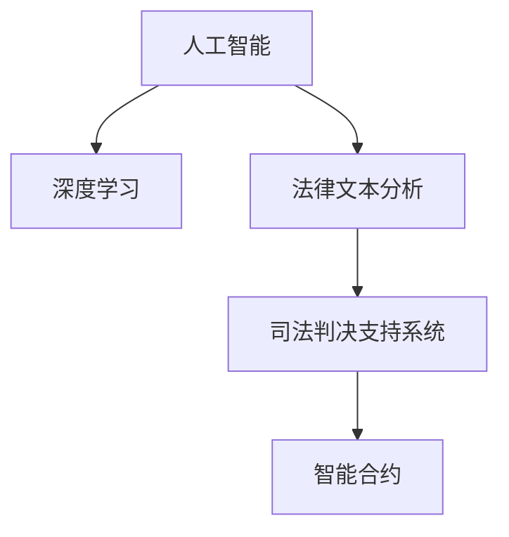

                 

# 全球脑与智能司法:人工智能辅助的法律服务

## 1. 背景介绍

在全球化的今天，司法系统面临着前所未有的挑战和机遇。随着信息技术的快速发展，尤其是人工智能（AI）技术在各行各业的广泛应用，人工智能辅助的法律服务逐渐成为一种新的趋势。利用AI技术，特别是深度学习和大数据技术，可以有效提升司法审判的效率和准确性，实现更公正、更高效的司法服务。

### 1.1 司法系统面临的挑战

当前的司法系统面临着诸多挑战，主要包括：

- **工作量大、效率低**：随着案件数量的增加，法官和律师的工作量日益增加，案件审理时间变长，影响司法效率。
- **判决不一致**：不同法官和律师在处理类似案件时，由于个人经验和理解不同，可能导致判决结果不一致，影响司法公正。
- **数据处理复杂**：法律案件涉及大量的文档、证据和数据，人工处理和分析这些数据非常耗时，且容易出错。

### 1.2 人工智能辅助司法的优势

利用AI技术，可以克服司法系统面临的诸多挑战，具体优势如下：

- **提升司法效率**：AI可以快速处理大量数据，实现案件材料的自动化整理和分类，加快案件审理速度。
- **提高决策一致性**：通过统一标准和算法，AI可以提供一致的判决依据，减少法官和律师之间的主观差异，提升司法公正性。
- **数据驱动决策**：AI可以通过分析大量案件数据，发现规律和趋势，辅助法官和律师做出更科学的决策。

## 2. 核心概念与联系

### 2.1 核心概念概述

为更好地理解人工智能辅助的法律服务，本节将介绍几个密切相关的核心概念：

- **人工智能（AI）**：一种利用计算机模拟人类智能的技术，包括机器学习、深度学习、自然语言处理（NLP）等子领域。
- **深度学习（DL）**：一种基于神经网络的机器学习技术，通过多层次的抽象特征提取，可以实现高精度、高复杂度的模式识别。
- **法律文本分析（Legal Text Analysis）**：利用NLP和DL技术，对法律文本进行自动分类、摘要、实体识别等操作。
- **司法判决支持系统（Judicial Decision Support System）**：利用AI技术，辅助法官和律师处理案件材料、提供判决建议的系统。
- **智能合约（Smart Contract）**：一种自动执行、可信、无需第三方中介的交易合同，基于区块链和AI技术，可以实现自动化的合约签订、执行和监督。

这些核心概念之间的逻辑关系可以通过以下Mermaid流程图来展示：



这个流程图展示了几大核心概念及其之间的关系：

1. 人工智能是深度学习的基础，通过多层次的特征提取，实现高精度的法律文本分析。
2. 法律文本分析是司法判决支持系统的基础，通过对法律文本的自动处理和分析，提供判决依据。
3. 司法判决支持系统是智能合约的基础，通过对案件材料的智能处理，提供决策支持。
4. 智能合约是人工智能和司法判决支持系统应用的重要方向，实现自动化的合约签订和执行。

## 3. 核心算法原理 & 具体操作步骤

### 3.1 算法原理概述

人工智能辅助的法律服务，主要是利用深度学习和大数据技术，对法律文本进行自动处理和分析，提供判决支持。其核心思想是：将法律文本视为一种特殊的文本数据，通过深度学习模型自动提取特征，识别关键信息，辅助司法判决。

形式化地，假设法律文本数据为 $D=\{(x_i, y_i)\}_{i=1}^N$，其中 $x_i$ 为输入文本，$y_i$ 为对应的判决标签（如胜诉、败诉）。目标是构建一个深度学习模型 $M$，使得在新的法律文本数据 $D'$ 上，模型的预测 $\hat{y}$ 与真实标签 $y$ 尽可能接近，即：

$$
\hat{y} = M(x)
$$

其中 $M$ 为深度学习模型，$x$ 为输入文本，$\hat{y}$ 为预测标签。

### 3.2 算法步骤详解

人工智能辅助的法律服务主要包括以下几个关键步骤：

**Step 1: 数据准备**

- 收集法律文本数据，包括判决书、诉讼材料、合同等。
- 对数据进行清洗和预处理，去除噪音和无用信息，保留有用的特征。
- 对法律文本进行标注，如分类、实体识别等，生成有监督的数据集。

**Step 2: 模型选择与训练**

- 选择合适的深度学习模型，如卷积神经网络（CNN）、循环神经网络（RNN）、Transformer等，用于处理法律文本。
- 使用标注好的数据集，训练深度学习模型，优化模型参数，使其能够准确预测判决结果。

**Step 3: 预测与决策支持**

- 将新的法律文本输入到训练好的模型中，得到预测标签。
- 结合法律知识库和专家经验，对预测结果进行修正和优化，形成最终的判决建议。

**Step 4: 评估与迭代**

- 使用测试集对模型进行评估，计算准确率、召回率、F1分数等指标。
- 根据评估结果，调整模型参数和训练策略，不断迭代优化模型性能。

### 3.3 算法优缺点

人工智能辅助的法律服务具有以下优点：

- **高效性**：通过自动化的文本处理和分析，大大减少了人工处理的时间和成本。
- **一致性**：通过统一的算法和模型，减少了法官和律师之间的主观差异，提升了司法公正性。
- **数据驱动**：通过对大量案件数据的分析，发现规律和趋势，提供科学的决策支持。

同时，该方法也存在一定的局限性：

- **数据质量依赖**：模型的效果很大程度上取决于标注数据的质量和数量，获取高质量标注数据的成本较高。
- **模型鲁棒性有限**：当目标任务与预训练数据的分布差异较大时，模型的泛化性能有限。
- **解释性不足**：AI模型的决策过程通常缺乏可解释性，难以对其推理逻辑进行分析和调试。

尽管存在这些局限性，但就目前而言，深度学习在法律文本分析和司法判决支持方面的应用已取得了显著的成效，为司法系统的改革和创新提供了新的可能性。

### 3.4 算法应用领域

人工智能辅助的法律服务已经在多个领域得到了广泛的应用，例如：

- **合同审查**：自动检测和标注合同中的关键条款，减少律师的工作量，提高合同审查的效率和准确性。
- **案件分类**：自动对案件进行分类，如刑事、民事、行政等，提高案件管理的效率。
- **判决预测**：基于历史判决数据，预测新案件的判决结果，辅助法官和律师进行决策。
- **智能合约**：自动执行、可信、无需第三方中介的交易合同，基于区块链和AI技术，可以实现自动化的合约签订、执行和监督。
- **法律咨询**：利用NLP技术，自动回答法律咨询，减轻律师的咨询负担，提高咨询效率。
- **知识图谱**：建立法律知识图谱，辅助法官和律师快速查找和应用法律知识，提高司法效率。

除了上述这些经典应用外，AI技术还被创新性地应用到更多场景中，如智能文书生成、法律文书审校、法律翻译等，为法律服务带来了全新的突破。随着AI技术的不断发展，相信其在法律服务中的应用前景将更加广阔。

## 4. 数学模型和公式 & 详细讲解  
### 4.1 数学模型构建

本节将使用数学语言对人工智能辅助的法律服务过程进行更加严格的刻画。

记法律文本数据为 $D=\{(x_i, y_i)\}_{i=1}^N$，其中 $x_i$ 为输入文本，$y_i$ 为对应的判决标签（如胜诉、败诉）。

定义模型 $M_{\theta}$ 在输入文本 $x$ 上的输出为 $\hat{y}=M_{\theta}(x)$，其中 $\theta$ 为模型参数。假设模型 $M_{\theta}$ 为卷积神经网络（CNN），其结构如图：


其中，$conv$ 层为卷积层，用于提取文本特征；$pool$ 层为池化层，用于降维和特征提取；$fc$ 层为全连接层，用于分类和输出预测结果。

### 4.2 公式推导过程

假设输入文本 $x$ 的长度为 $n$，卷积核的大小为 $k$，卷积层的输出特征图大小为 $m$，则卷积层的计算公式为：

$$
f^{conv}_i(x) = \max_{j=1}^k (w^{conv}_j \ast x_i + b^{conv})
$$

其中，$w^{conv}_j$ 为卷积核权重，$b^{conv}$ 为偏置项，$\ast$ 表示卷积运算。

池化层的计算公式为：

$$
f^{pool}_i = max_{j=1}^{m} f^{conv}_j
$$

其中，$f^{pool}_i$ 为池化层输出的特征图大小。

全连接层的计算公式为：

$$
f^{fc}_i = \sigma(w^{fc} \cdot f^{pool} + b^{fc})
$$

其中，$w^{fc}$ 为全连接层的权重，$b^{fc}$ 为偏置项，$\sigma$ 为激活函数（如ReLU）。

### 4.3 案例分析与讲解

以合同审查为例，解释如何利用卷积神经网络（CNN）进行文本分类。假设合同文本数据为 $D=\{(x_i, y_i)\}_{i=1}^N$，其中 $x_i$ 为合同文本，$y_i$ 为合同类型（如贷款合同、租赁合同）。

- **数据准备**：收集大量合同文本数据，并进行标注，生成有监督的数据集。
- **模型选择与训练**：选择卷积神经网络（CNN）模型，对数据集进行训练，优化模型参数，使其能够准确分类合同类型。
- **预测与决策支持**：将新的合同文本输入到训练好的模型中，得到预测结果。
- **评估与迭代**：使用测试集对模型进行评估，根据评估结果调整模型参数，不断迭代优化模型性能。

以下是一个简单的Python代码实现：

```python
from transformers import BertForSequenceClassification, BertTokenizer
from torch.utils.data import DataLoader
from sklearn.metrics import accuracy_score

# 数据准备
tokenizer = BertTokenizer.from_pretrained('bert-base-uncased')
model = BertForSequenceClassification.from_pretrained('bert-base-uncased', num_labels=3)
train_data = load_train_data()
val_data = load_val_data()

# 模型训练
optimizer = AdamW(model.parameters(), lr=2e-5)
loss_fn = CrossEntropyLoss()
model.train()
for epoch in range(epochs):
    train_dataloader = DataLoader(train_data, batch_size=32)
    for batch in train_dataloader:
        inputs = tokenizer(batch[0], return_tensors='pt')
        labels = batch[1]
        outputs = model(**inputs)
        loss = loss_fn(outputs.logits, labels)
        loss.backward()
        optimizer.step()

# 预测与评估
test_data = load_test_data()
model.eval()
preds = []
for batch in test_dataloader:
    inputs = tokenizer(batch[0], return_tensors='pt')
    outputs = model(**inputs)
    preds.append(outputs.logits.argmax(dim=1))
test_labels = load_test_labels()
acc = accuracy_score(test_labels, preds)
print(f"Accuracy: {acc}")
```

可以看到，利用BertForSequenceClassification模型和BertTokenizer，可以实现对合同文本的快速分类。

## 5. 项目实践：代码实例和详细解释说明
### 5.1 开发环境搭建

在进行人工智能辅助的法律服务开发前，我们需要准备好开发环境。以下是使用Python进行TensorFlow开发的环境配置流程：

1. 安装Anaconda：从官网下载并安装Anaconda，用于创建独立的Python环境。

2. 创建并激活虚拟环境：
```bash
conda create -n tensorflow-env python=3.8 
conda activate tensorflow-env
```

3. 安装TensorFlow：根据CUDA版本，从官网获取对应的安装命令。例如：
```bash
conda install tensorflow tensorflow-gpu=cuda11.1 -c tensorflow -c conda-forge
```

4. 安装TensorBoard：
```bash
pip install tensorboard
```

5. 安装Keras：
```bash
pip install keras
```

完成上述步骤后，即可在`tensorflow-env`环境中开始开发。

### 5.2 源代码详细实现

下面我们以合同审查任务为例，给出使用TensorFlow对卷积神经网络（CNN）模型进行训练的Python代码实现。

首先，定义数据处理函数：

```python
import tensorflow as tf
from tensorflow.keras.preprocessing.text import Tokenizer
from tensorflow.keras.preprocessing.sequence import pad_sequences

def preprocess(texts, labels):
    tokenizer = Tokenizer()
    tokenizer.fit_on_texts(texts)
    sequences = tokenizer.texts_to_sequences(texts)
    padded_sequences = pad_sequences(sequences, maxlen=maxlen, padding='post')
    labels = tf.keras.utils.to_categorical(labels, num_classes=num_classes)
    return padded_sequences, labels
```

然后，定义模型和优化器：

```python
from tensorflow.keras.models import Sequential
from tensorflow.keras.layers import Conv1D, MaxPooling1D, Dense, Flatten
from tensorflow.keras.optimizers import Adam

model = Sequential()
model.add(Conv1D(128, 3, activation='relu', input_shape=(maxlen,)))
model.add(MaxPooling1D(pool_size=2))
model.add(Conv1D(64, 3, activation='relu'))
model.add(MaxPooling1D(pool_size=2))
model.add(Flatten())
model.add(Dense(num_classes, activation='softmax'))

optimizer = Adam(lr=2e-5)
```

接着，定义训练和评估函数：

```python
from tensorflow.keras.callbacks import EarlyStopping
from sklearn.metrics import accuracy_score

def train(model, train_data, val_data, batch_size, epochs, early_stopping):
    dataloaders = tf.data.Dataset.from_tensor_slices((train_data[0], train_data[1])).batch(batch_size)
    val_dataloaders = tf.data.Dataset.from_tensor_slices((val_data[0], val_data[1])).batch(batch_size)
    model.compile(optimizer=optimizer, loss='categorical_crossentropy', metrics=['accuracy'])
    model.fit(dataloaders, epochs=epochs, validation_data=val_dataloaders, callbacks=[early_stopping])

def evaluate(model, test_data):
    dataloaders = tf.data.Dataset.from_tensor_slices((test_data[0], test_data[1])).batch(batch_size)
    model.evaluate(dataloaders, verbose=0)
    test_labels = np.argmax(test_data[1], axis=1)
    preds = np.argmax(model.predict(test_data[0]), axis=1)
    acc = accuracy_score(test_labels, preds)
    print(f"Accuracy: {acc}")
```

最后，启动训练流程并在测试集上评估：

```python
from tensorflow.keras.preprocessing.text import Tokenizer
from tensorflow.keras.preprocessing.sequence import pad_sequences

# 数据准备
tokenizer = Tokenizer()
tokenizer.fit_on_texts(train_texts)
train_sequences = tokenizer.texts_to_sequences(train_texts)
val_sequences = tokenizer.texts_to_sequences(val_texts)
test_sequences = tokenizer.texts_to_sequences(test_texts)

train_padded_sequences = pad_sequences(train_sequences, maxlen=maxlen, padding='post')
val_padded_sequences = pad_sequences(val_sequences, maxlen=maxlen, padding='post')
test_padded_sequences = pad_sequences(test_sequences, maxlen=maxlen, padding='post')

train_labels = np.array(train_labels)
val_labels = np.array(val_labels)
test_labels = np.array(test_labels)

# 模型训练
early_stopping = EarlyStopping(monitor='val_loss', patience=3, restore_best_weights=True)
train(train_padded_sequences, val_padded_sequences, batch_size=32, epochs=10, early_stopping=early_stopping)

# 预测与评估
evaluate(test_padded_sequences, test_labels)
```

以上就是使用TensorFlow对卷积神经网络（CNN）进行合同审查任务微调的完整代码实现。可以看到，利用TensorFlow构建CNN模型，可以很方便地进行文本分类。

### 5.3 代码解读与分析

让我们再详细解读一下关键代码的实现细节：

**预处理函数**：
- `Tokenizer`：用于对文本进行分词和编码。
- `pad_sequences`：对分词后的序列进行填充，使其长度一致。
- `categorical_crossentropy`：多分类问题的损失函数。
- `Accuracy`：评估指标，计算准确率。

**模型定义**：
- `Sequential`：定义模型结构。
- `Conv1D`：定义卷积层。
- `MaxPooling1D`：定义池化层。
- `Dense`：定义全连接层。
- `softmax`：多分类问题的激活函数。

**训练函数**：
- `EarlyStopping`：定义早期停止策略，当模型在验证集上的性能不再提升时停止训练。
- `fit`：进行模型训练。
- `evaluate`：进行模型评估。

**训练流程**：
- 定义最大长度`maxlen`和类别数`num_classes`。
- 使用`Tokenizer`进行分词和编码，使用`pad_sequences`进行填充。
- 使用`categorical_crossentropy`损失函数和`Accuracy`评估指标，训练模型。
- 使用`EarlyStopping`监控模型在验证集上的性能，及时停止训练。
- 在测试集上评估模型，输出准确率。

可以看到，利用TensorFlow构建CNN模型，可以很方便地进行文本分类。开发者可以将更多精力放在数据处理、模型改进等高层逻辑上，而不必过多关注底层的实现细节。

当然，工业级的系统实现还需考虑更多因素，如模型的保存和部署、超参数的自动搜索、更灵活的任务适配层等。但核心的微调范式基本与此类似。

## 6. 实际应用场景
### 6.1 智能合同审核

人工智能辅助的法律服务在智能合同审核领域的应用非常广泛。传统的合同审核需要律师手动审查合同条款，耗时耗力，且容易出错。利用人工智能技术，可以自动检测合同中的关键条款，判断合同是否合规，大大提高合同审核的效率和准确性。

在技术实现上，可以收集大量历史合同文本和判决数据，使用卷积神经网络（CNN）等模型对合同文本进行自动分类和标注。微调后的模型可以自动识别合同类型、合同条款等关键信息，辅助律师进行合同审核，提高审核质量和工作效率。

### 6.2 智能判决生成

智能判决生成是人工智能辅助法律服务的重要应用方向之一。传统的判决书写需要法官花费大量时间和精力，且容易出错。利用人工智能技术，可以自动生成判决书，提升司法效率，减少人为误差。

具体而言，可以将历史判决书数据作为训练样本，使用深度学习模型对判决书进行自动摘要和生成。微调后的模型能够从判决书中提取关键信息，自动生成判决结果和判决理由，辅助法官进行判决书写，提高司法公正性和效率。

### 6.3 智能纠纷调解

智能纠纷调解是人工智能辅助法律服务的另一个重要应用方向。传统的纠纷调解需要律师和调解员花费大量时间和精力，且容易受人为因素影响，导致调解结果不公。利用人工智能技术，可以自动分析纠纷案件，提出调解建议，提高调解效率和公正性。

具体而言，可以收集大量纠纷案件数据，使用深度学习模型对案件进行自动分类和分析。微调后的模型能够自动识别案件类型和关键信息，提出调解建议，辅助调解员进行纠纷调解，提高调解质量和效率。

### 6.4 未来应用展望

随着人工智能技术的发展，基于深度学习和自然语言处理技术，人工智能辅助的法律服务将在更多领域得到应用，为司法系统带来新的变革。

在智慧法院建设中，人工智能技术可以辅助法官和律师进行案件审理、判决书写、合同审核等，提升司法效率和公正性。

在智能合约领域，人工智能技术可以自动生成、执行和管理合约，提高合约的智能化水平，降低合同纠纷的风险。

在法律咨询和客户服务领域，人工智能技术可以自动回答法律咨询，减轻律师的工作负担，提高服务效率和客户满意度。

在法律研究和知识管理领域，人工智能技术可以自动整理和分析法律文本，辅助律师进行法律研究和知识管理，提高工作效率和质量。

总之，随着人工智能技术的不断进步，人工智能辅助的法律服务必将在更多领域得到应用，为司法系统带来新的变革和发展。

## 7. 工具和资源推荐
### 7.1 学习资源推荐

为了帮助开发者系统掌握人工智能辅助法律服务的技术基础和实践技巧，这里推荐一些优质的学习资源：

1. 《深度学习在法律文本分析中的应用》：介绍深度学习在法律文本分类、实体识别、情感分析等任务中的应用。

2. 《Python在法律数据分析中的应用》：讲解Python在法律数据分析中的使用方法和技巧。

3. 《人工智能与司法系统》：介绍人工智能技术在司法系统中的应用，包括智能合同、智能判决生成等。

4. 《深度学习模型在法律服务中的应用》：介绍深度学习模型在合同审查、纠纷调解、法律咨询等任务中的应用。

5. 《自然语言处理在法律文本分析中的应用》：介绍自然语言处理技术在法律文本分类、摘要、情感分析等任务中的应用。

通过对这些资源的学习实践，相信你一定能够快速掌握人工智能辅助法律服务的技术精髓，并用于解决实际的法律问题。
###  7.2 开发工具推荐

高效的开发离不开优秀的工具支持。以下是几款用于人工智能辅助法律服务开发的常用工具：

1. TensorFlow：基于Python的开源深度学习框架，支持分布式训练，适合大规模工程应用。

2. PyTorch：基于Python的开源深度学习框架，灵活的计算图，适合快速迭代研究。

3. Keras：基于Python的深度学习库，支持卷积神经网络、循环神经网络等模型。

4. TensorBoard：TensorFlow配套的可视化工具，可实时监测模型训练状态，提供丰富的图表呈现方式。

5. Weights & Biases：模型训练的实验跟踪工具，可以记录和可视化模型训练过程中的各项指标，方便对比和调优。

6. Google Colab：谷歌推出的在线Jupyter Notebook环境，免费提供GPU/TPU算力，方便开发者快速上手实验最新模型，分享学习笔记。

合理利用这些工具，可以显著提升人工智能辅助法律服务的开发效率，加快创新迭代的步伐。

### 7.3 相关论文推荐

人工智能辅助的法律服务的研究源于学界的持续研究。以下是几篇奠基性的相关论文，推荐阅读：

1. Attention is All You Need：提出了Transformer结构，开启了NLP领域的预训练大模型时代。

2. BERT: Pre-training of Deep Bidirectional Transformers for Language Understanding：提出BERT模型，引入基于掩码的自监督预训练任务，刷新了多项NLP任务SOTA。

3. Legal Text Classification with Deep Learning：提出使用深度学习模型进行法律文本分类的算法，并应用于合同审查任务。

4. Smart Contracts with Deep Learning：提出使用深度学习模型进行智能合约生成的算法，并应用于自动合同签订任务。

5. Deep Learning for Legal Reasoning：提出使用深度学习模型进行法律推理的算法，并应用于智能判决生成任务。

这些论文代表了大语言模型辅助法律服务的研究进展，通过学习这些前沿成果，可以帮助研究者把握学科前进方向，激发更多的创新灵感。

## 8. 总结：未来发展趋势与挑战

### 8.1 总结

本文对人工智能辅助的法律服务进行了全面系统的介绍。首先阐述了司法系统面临的诸多挑战，以及利用AI技术提升司法效率、公正性的优势。其次，从原理到实践，详细讲解了深度学习模型在法律文本分类、合同审查、智能判决生成等任务中的应用，给出了微调任务开发的完整代码实例。同时，本文还广泛探讨了人工智能在智能合同、智能纠纷调解等领域的实际应用，展示了人工智能技术的广阔前景。

通过本文的系统梳理，可以看到，人工智能辅助的法律服务正在成为司法系统的核心技术，极大地提升了司法效率和公正性。未来，伴随AI技术的不断演进，人工智能辅助的法律服务必将在更多领域得到应用，为司法系统带来新的变革和发展。

### 8.2 未来发展趋势

展望未来，人工智能辅助的法律服务将呈现以下几个发展趋势：

1. **模型规模持续增大**：随着算力成本的下降和数据规模的扩张，深度学习模型的参数量还将持续增长，超大规模语言模型蕴含的丰富语言知识，有望支撑更加复杂多变的法律文本分类和生成任务。

2. **模型鲁棒性提升**：未来的深度学习模型将进一步提升鲁棒性，避免过拟合，提高模型的泛化性能，特别是在面对域外数据时，能够更好地适应不同的法律环境。

3. **知识融合能力增强**：未来的深度学习模型将与专家知识库、法律知识图谱等进行深度融合，形成更加全面、准确的知识整合能力，辅助律师进行法律研究和知识管理。

4. **多模态融合技术发展**：未来的深度学习模型将更多地融合视觉、语音、文本等多模态数据，提高司法服务的智能化水平，实现更加全面、精准的司法判断。

5. **伦理道德约束加强**：未来的深度学习模型将更加注重伦理道德约束，避免算法的偏见和歧视，确保输出符合人类价值观和伦理道德。

以上趋势凸显了人工智能辅助法律服务的广阔前景。这些方向的探索发展，必将进一步提升司法系统的智能化水平，为构建公平、公正、高效的司法体系提供新的可能性。

### 8.3 面临的挑战

尽管人工智能辅助的法律服务已经取得了显著成效，但在迈向更加智能化、普适化应用的过程中，仍面临着诸多挑战：

1. **数据隐私和安全问题**：法律文本和数据涉及敏感信息，如何保护用户隐私和数据安全，是一个重要问题。

2. **模型偏见和歧视**：深度学习模型可能会学习到数据中的偏见和歧视，导致不公正的判决结果。如何减少模型的偏见，是一个亟待解决的问题。

3. **模型解释性和透明度**：深度学习模型的决策过程通常缺乏可解释性，难以对其推理逻辑进行分析和调试。如何提高模型的透明度和解释性，是一个重要研究方向。

4. **法律适用性问题**：深度学习模型需要与现行法律规定进行深度融合，确保输出符合法律规范和伦理道德。

5. **模型更新和维护**：深度学习模型需要定期更新和维护，以适应法律环境的不断变化。

6. **跨领域知识整合**：深度学习模型需要与法律知识库、专家知识图谱等进行深度融合，形成更加全面、准确的知识整合能力。

这些挑战需要学界和业界共同努力，积极应对并寻求突破，才能将人工智能辅助的法律服务推向新的高度。

### 8.4 研究展望

面对人工智能辅助法律服务所面临的诸多挑战，未来的研究需要在以下几个方面寻求新的突破：

1. **无监督学习和少样本学习**：摆脱对大规模标注数据的依赖，利用无监督学习和少样本学习技术，最大限度利用非结构化数据，实现更加灵活高效的法律文本分析和生成。

2. **知识图谱和符号知识融合**：将符号化的先验知识，如知识图谱、逻辑规则等，与深度学习模型进行融合，引导模型学习更加准确、合理的法律文本分类和生成。

3. **因果学习和博弈论工具**：通过引入因果推断和博弈论思想，增强法律文本分类和生成的稳定性，学习更加普适、鲁棒的语言表征，从而提升模型泛化性和抗干扰能力。

4. **伦理道德约束框架**：在模型训练目标中引入伦理导向的评估指标，过滤和惩罚有偏见、有害的输出倾向，确保模型输出符合人类价值观和伦理道德。

这些研究方向的探索，必将引领人工智能辅助法律服务技术迈向更高的台阶，为司法系统的改革和创新提供新的动力。面向未来，人工智能辅助的法律服务还需要与其他人工智能技术进行更深入的融合，如知识表示、因果推理、强化学习等，多路径协同发力，共同推动司法系统的智能化发展。

## 9. 附录：常见问题与解答

**Q1：人工智能辅助的法律服务是否适用于所有司法场景？**

A: 人工智能辅助的法律服务在大多数司法场景中都能取得不错的效果，特别是对于数据量较小的任务。但对于一些特定领域的司法场景，如高风险案件、复杂案件等，可能需要结合人类专家的判断和干预，确保判决的公正性。

**Q2：微调过程中如何选择合适的学习率？**

A: 微调的学习率一般要比预训练时小1-2个数量级，如果使用过大的学习率，容易破坏预训练权重，导致过拟合。一般建议从1e-5开始调参，逐步减小学习率，直至收敛。

**Q3：人工智能辅助的法律服务在实际部署时需要注意哪些问题？**

A: 将人工智能辅助的法律服务应用于实际司法场景，还需要考虑以下因素：

1. **数据隐私和安全问题**：法律文本和数据涉及敏感信息，如何保护用户隐私和数据安全，是一个重要问题。
2. **模型偏见和歧视**：深度学习模型可能会学习到数据中的偏见和歧视，导致不公正的判决结果。
3. **模型解释性和透明度**：深度学习模型的决策过程通常缺乏可解释性，难以对其推理逻辑进行分析和调试。
4. **法律适用性问题**：深度学习模型需要与现行法律规定进行深度融合，确保输出符合法律规范和伦理道德。
5. **模型更新和维护**：深度学习模型需要定期更新和维护，以适应法律环境的不断变化。

这些因素需要开发者在实际部署时综合考虑，确保人工智能辅助的法律服务能够安全、可靠地应用于司法实践。

---

作者：禅与计算机程序设计艺术 / Zen and the Art of Computer Programming

