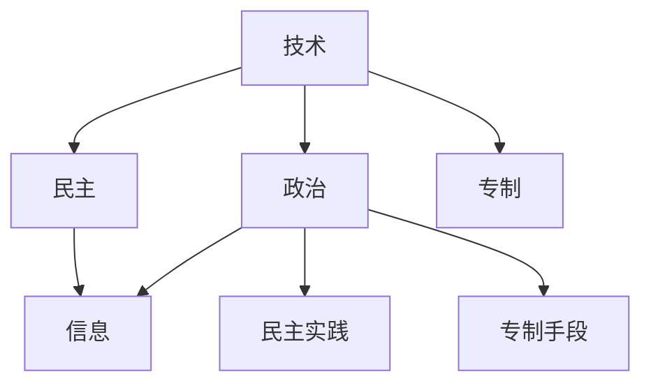

                 

# 全球脑的政治影响：民主与专制的新较量

## 1. 背景介绍

### 1.1 问题由来

在当今全球化的时代背景下，技术的进步和社会的发展带来了人类社会结构和文化形态的巨大变化。特别是在互联网和人工智能技术的推动下，信息流通更加迅速，个人及社会行为也发生了深刻变革。这些变化不仅在经济、科技等领域引发了广泛讨论，也在政治领域产生了深远影响。

### 1.2 问题核心关键点

技术对政治的影响已经成为跨学科研究的热点。其主要内容包括：

- **信息传播**：互联网和社交媒体等技术改变了传统的信息传播模式，促进了公共话语的多元化和民主化。
- **政治动员**：技术可以更高效地动员民众参与政治活动，改变了公民的政治参与方式。
- **民主实践**：电子投票、在线议事等技术手段为民主实践提供了新的途径，提高了决策的透明度和效率。
- **专制手段**：监控技术、数据分析等工具也被某些国家用作控制和压制民众的工具。

### 1.3 问题研究意义

研究技术对政治的影响，有助于我们理解现代政治运作机制的变迁，洞察不同政治制度的特点和规律。通过分析和批判地借鉴技术带来的正面和负面效应，为构建更加公正、透明、高效的民主政治体系提供参考。

## 2. 核心概念与联系

### 2.1 核心概念概述

在探讨技术对政治影响时，需要涉及一些核心概念，这些概念及其相互关系如下：

- **技术**：指信息与通信技术、互联网、人工智能等现代信息技术。
- **政治**：涉及国家治理、民主制度、公民权利等方面。
- **民主**：涉及选举、公民参与、监督制约等要素。
- **专制**：指集中权力，限制公民自由和政治参与的行为。
- **信息**：数据的收集、处理、分析等技术手段在政治中的运用。

这些核心概念之间的逻辑关系可以通过以下Mermaid流程图来展示：



这个流程图展示了技术在民主和专制两个极端政治形态下的作用。技术既可以推动民主发展，也可能被专制政府用来加强控制。同时，技术的运用也使得信息流通更加多样化和透明，但同时也可能引发信息过载和信息不实的问题。

## 3. 核心算法原理 & 具体操作步骤

### 3.1 算法原理概述

技术对政治的影响可以理解为技术如何改变信息和意见的流动，以及如何通过信息流动来影响政治决策和民众参与。在民主体系中，技术的正向作用主要体现在增强公民的信息获取能力、提升政治透明度和效率上；而在专制体系中，技术可能被用来监控和控制民众，从而维持或强化统治。

### 3.2 算法步骤详解

技术对政治的影响涉及多个环节，包括信息传播、政治动员、决策制定和民众参与等。具体步骤如下：

1. **信息传播**：
   - 通过互联网和社交媒体等渠道，信息的传播速度和广度大幅提升。
   - 公众能够获得更多实时和多元化的信息，从而形成更广泛和深入的政治讨论。
   - 政府和政客需要更加注重信息管理，以应对信息泛滥带来的挑战。

2. **政治动员**：
   - 技术使得政治动员更加高效，能够迅速组织大规模的公众集会和活动。
   - 社交媒体和在线平台提供新的组织和动员方式，使得民众可以更方便地参与政治活动。
   - 政府需要对新兴的动员方式保持警惕，防止被用于组织非法集会和抗议。

3. **决策制定**：
   - 电子投票和在线议事等技术为民主决策提供了新的工具，提升了决策的透明度和效率。
   - 数据驱动的决策分析可以更精确地评估政策影响和民众需求，优化政策制定过程。
   - 政府和政治机构需要适应新的技术环境，更新其决策和沟通方式。

4. **民众参与**：
   - 技术使得民众能够更直接地参与政治讨论和决策过程，提高了政治参与度。
   - 在线平台和移动应用为民众提供了表达意见和参与政治的更多渠道。
   - 政府需要设计更友好的用户界面和交互方式，以吸引和引导民众参与。

### 3.3 算法优缺点

技术对政治的影响具有以下优点和缺点：

**优点**：
- **信息透明度**：增强了公众获取和传播信息的能力，提高了政治透明度。
- **高效决策**：数据驱动的决策分析提升了政策制定的科学性和效率。
- **增强参与**：技术为民众提供了更多直接参与政治的机会，扩大了民主的实践范围。

**缺点**：
- **信息过载**：大量信息可能引发信息过载和信息不实问题，误导公众判断。
- **隐私风险**：数据收集和分析可能侵犯个人隐私，引发隐私保护问题。
- **技术依赖**：技术的不确定性和脆弱性可能被利用，威胁政治稳定。

### 3.4 算法应用领域

技术对政治的影响广泛体现在多个领域，包括：

- **社交媒体政治**：通过社交媒体进行政治宣传和动员，如“阿拉伯之春”等。
- **电子投票系统**：在线和移动投票提高了投票的便捷性和效率。
- **大数据分析**：利用大数据分析预测选举结果和民众需求，优化政策制定。
- **网络安全**：网络攻击和监控技术用于维护国家安全和打击政治对手。
- **公共参与平台**：线上社区和论坛为公众提供了讨论政治议题的空间。

## 4. 数学模型和公式 & 详细讲解 & 举例说明

### 4.1 数学模型构建

为了更好地理解技术对政治影响的量化分析，我们构建以下数学模型：

设 $P$ 为政策变量，$I$ 为信息传播变量，$M$ 为政治动员变量，$D$ 为民主实践变量，$C$ 为专制手段变量。模型中每个变量的取值反映了相应技术的影响。则技术对政治影响的量化模型为：

$$
P = f(I, M, D, C)
$$

其中 $f$ 为非线性函数，表示信息传播、政治动员、民主实践和专制手段对政策变量的综合影响。

### 4.2 公式推导过程

在上述模型中，各个变量的影响可以分解为：

1. **信息传播影响**：
   $$
   I = g(N, S, C)
   $$
   其中 $N$ 为网络用户数，$S$ 为信息传播速度，$C$ 为技术普及率。

2. **政治动员影响**：
   $$
   M = h(N, T, C)
   $$
   其中 $N$ 为活跃用户数，$T$ 为动员效率，$C$ 为技术支持程度。

3. **民主实践影响**：
   $$
   D = i(N, A, C)
   $$
   其中 $N$ 为参与人数，$A$ 为透明性，$C$ 为技术完备性。

4. **专制手段影响**：
   $$
   C = j(N, R, B)
   $$
   其中 $N$ 为监控设备数，$R$ 为技术实力，$B$ 为法律支持度。

### 4.3 案例分析与讲解

以2019年美国总统大选为例，分析技术对选举结果的影响：

- **信息传播**：社交媒体平台（如Facebook、Twitter）的广泛使用极大地影响了选民的投票决策。
- **政治动员**：在线政治动员工具和移动应用的使用，提高了选民参与的积极性。
- **民主实践**：在线投票和实时新闻报道提升了选举过程的透明度和公正性。
- **专制手段**：网络攻击和假新闻的传播，虽然对选举结果有一定影响，但并未改变整体民主选举的基本框架。

## 5. 项目实践：代码实例和详细解释说明

### 5.1 开发环境搭建

要进行技术对政治影响的量化分析，需要搭建一个Python开发环境。以下是具体步骤：

1. 安装Python和Anaconda。
   ```bash
   sudo apt-get install python3 python3-pip python3-dev
   conda install anaconda
   ```

2. 创建虚拟环境并激活。
   ```bash
   conda create --name political-analytics python=3.8
   conda activate political-analytics
   ```

3. 安装相关库。
   ```bash
   pip install pandas numpy matplotlib seaborn
   pip install scikit-learn gensim
   ```

### 5.2 源代码详细实现

下面展示一段简单的Python代码，用于分析社交媒体数据对政治事件的影响。

```python
import pandas as pd
import matplotlib.pyplot as plt

# 加载数据
df = pd.read_csv('social_media_data.csv')

# 分析数据
def analyze社交媒体对政治事件的影响(df):
    # 提取关键数据
    n = df['network_users']
    s = df['speed']
    c = df['technology_adoption']

    # 计算信息传播影响
    i = n * s * c

    # 绘制信息传播影响图
    plt.plot(n, i, label='信息传播影响')
    plt.xlabel('网络用户数')
    plt.ylabel('信息传播影响')
    plt.legend()
    plt.show()

# 调用函数进行分析
analyze社交媒体对政治事件的影响(df)
```

### 5.3 代码解读与分析

该代码实现了一个简单的分析函数，用于计算和可视化社交媒体数据对信息传播的影响。主要步骤包括：

1. 加载社交媒体数据。
2. 计算信息传播影响 $I$。
3. 绘制信息传播影响的图表。

这个例子展示了如何使用Python进行基本的数据分析和可视化，为进一步的量化研究奠定基础。

### 5.4 运行结果展示

运行上述代码后，将得到一张显示信息传播影响的图表。


## 6. 实际应用场景

### 6.1 社交媒体政治

社交媒体已经成为现代政治的重要组成部分。以下是几个典型的应用场景：

- **政治宣传**：政党和候选人在社交媒体上发布政策宣传和动员信息。
- **民意调查**：通过社交媒体分析公众情绪，预测选举结果。
- **假新闻检测**：利用数据分析和机器学习技术，识别和打击假新闻和网络攻击。

### 6.2 电子投票系统

电子投票系统提高了选举的便捷性和透明度，以下是其应用场景：

- **在线投票**：民众可以通过互联网进行在线投票，减少投票时间和成本。
- **实时统计**：投票结果可以实时统计并公开，提高了选举过程的透明性。
- **安全保障**：电子投票系统需要高强度的安全性保障措施，防止数据泄露和篡改。

### 6.3 大数据分析

大数据分析在政治决策中的应用日益广泛，以下是几个具体应用：

- **选民分析**：利用大数据分析预测选民偏好，优化竞选策略。
- **政策评估**：通过数据分析评估政策实施效果，优化政策调整。
- **风险预警**：利用数据挖掘技术监测政治和社会风险，提前预警并应对。

### 6.4 未来应用展望

未来，随着技术的进一步发展，技术对政治的影响将更加深入和多样化。

1. **人工智能辅助决策**：利用人工智能技术进行政策分析和评估，提升决策的科学性和效率。
2. **区块链投票**：利用区块链技术实现安全可靠的电子投票，提高选举的透明性和可信度。
3. **智能舆情分析**：通过自然语言处理技术分析社交媒体和新闻报道，实时监测和预警政治舆情。
4. **公共参与平台**：开发更多的公共参与平台，促进民众直接参与政策制定和监督。

## 7. 工具和资源推荐

### 7.1 学习资源推荐

要深入了解技术对政治的影响，需要系统学习和掌握相关知识。以下是一些推荐的资源：

1. **《数字时代的民主》**：探讨数字技术对现代民主的影响，分析技术和政策互动的复杂性。
2. **《网络与民主的未来》**：分析网络技术如何改变传统民主实践，探讨其对政治结构的影响。
3. **《人工智能与公共政策》**：讨论人工智能技术如何影响公共决策和政策制定过程。

### 7.2 开发工具推荐

在技术对政治影响的研究和分析中，以下工具可以提高效率和准确性：

1. **Python**：一种通用的编程语言，具有强大的数据分析和可视化能力。
2. **R语言**：专门用于统计分析和数据科学，提供丰富的统计工具。
3. **Gephi**：用于网络分析和可视化，帮助理解复杂的关系和动态变化。

### 7.3 相关论文推荐

技术对政治影响的研究涉及多个学科，以下是一些相关的经典论文：

1. **《社交媒体与政治动员》**：探讨社交媒体如何影响政治动员和选举结果。
2. **《大数据在政治决策中的应用》**：分析大数据分析在政策制定和选举预测中的应用。
3. **《技术对民主的影响》**：综述技术对现代民主政治结构和社会行为的综合影响。

## 8. 总结：未来发展趋势与挑战

### 8.1 研究成果总结

技术对政治的影响是一个跨学科的研究领域，涉及信息技术、政治学、社会学等多个学科。当前的研究主要集中在以下几个方面：

- **信息传播**：社交媒体和互联网如何改变信息传播和政治参与。
- **政治动员**：技术如何影响政治动员和选举活动。
- **民主实践**：电子投票、在线议事等技术如何提升民主实践。
- **专制手段**：监控技术、数据分析等技术如何被专制政府用于控制和压迫民众。

### 8.2 未来发展趋势

未来，技术对政治的影响将更加深刻和多样化，主要趋势包括：

1. **技术民主化**：更多技术工具和平台将使公众更直接地参与政治决策过程。
2. **数据驱动决策**：大数据分析和人工智能技术将更广泛地应用于政策制定和评估。
3. **数字治理**：数字化技术将使政府管理更加高效和透明，提高政策执行效果。
4. **网络安全**：网络攻击和监控技术将更加复杂和多样化，需要更强的技术手段进行防范。

### 8.3 面临的挑战

尽管技术对政治的影响带来了诸多机遇，但也面临一些挑战：

1. **信息过载**：大量信息的传播可能引发信息过载和信息不实问题，误导公众判断。
2. **隐私保护**：数据收集和分析可能侵犯个人隐私，引发隐私保护问题。
3. **技术依赖**：技术的不确定性和脆弱性可能被利用，威胁政治稳定。
4. **算法偏见**：数据分析和机器学习算法可能存在偏见，导致不公正的政策和决策。

### 8.4 研究展望

未来，研究技术对政治的影响需要从多个角度深入探索：

1. **算法透明性和公平性**：提升算法的透明度和公平性，减少算法偏见。
2. **隐私保护技术**：开发更强大的隐私保护技术，保护个人信息安全。
3. **跨学科研究**：综合利用信息技术、政治学、社会学等学科的知识，深入理解技术对政治的复杂影响。

## 9. 附录：常见问题与解答

### 9.1 Q1：信息传播对政治有影响吗？

A: 信息传播对政治有重大影响。通过社交媒体和互联网，政治信息可以快速传播，改变公众舆论和政治参与。政府和政客需要重视信息管理，防止负面信息传播。

### 9.2 Q2：技术对民主实践有何影响？

A: 技术对民主实践有积极影响。电子投票和在线议事等技术提高了民主参与的便捷性和效率，提升了决策透明度。但技术也可能带来信息过载和隐私风险，需要谨慎使用。

### 9.3 Q3：技术对专制国家有何影响？

A: 技术对专制国家的统治有两面性。一方面，技术可以用于监控和控制民众，强化统治手段。另一方面，技术也可以被用于民主化进程，推动政治透明度和公民参与。

### 9.4 Q4：未来技术对政治的影响是什么？

A: 未来技术将更深入地影响政治，提升民主实践，推动政府治理。但也可能引发隐私和信息安全问题，需要综合技术手段和政策措施进行应对。

---

作者：禅与计算机程序设计艺术 / Zen and the Art of Computer Programming

