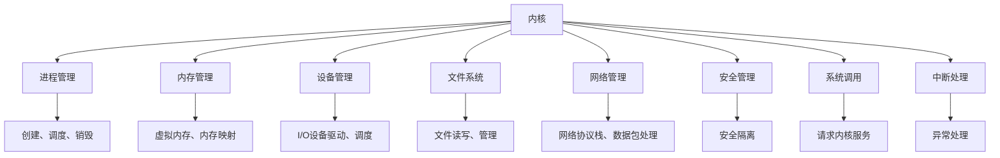

                 

# 内核:操作系统的最基础组件

> 关键词：内核,操作系统,用户态,内核态,系统调用,中断处理,上下文切换,虚拟内存,进程管理,文件系统,设备管理

## 1. 背景介绍

### 1.1 问题由来
随着计算机技术的不断进步，操作系统作为计算机系统的核心组件，其设计和实现的重要性愈发凸显。内核作为操作系统的核心部分，负责管理和调度系统资源，保障计算机系统的稳定和高效运行。然而，尽管内核的重要性不言而喻，但大部分开发人员对其具体实现细节和设计原则并不熟悉。本文章将全面介绍内核的构成和功能，帮助读者深入理解操作系统的最基础组件。

### 1.2 问题核心关键点
内核是操作系统的中枢，负责协调和管理计算机系统中的各种资源，如处理器、内存、I/O设备等。其核心功能包括：

- 进程管理：负责创建、调度、销毁进程，提供线程、任务等抽象。
- 内存管理：负责虚拟内存、内存映射、缓存等内存相关操作。
- 设备管理：负责I/O设备的驱动、调度、中断处理等。
- 文件系统：提供文件的存储、访问、操作等。
- 网络管理：提供网络协议栈、数据包处理、路由等。
- 安全管理：负责用户态和内核态的安全隔离，防止恶意代码攻击。

内核的实现涉及复杂的数据结构和算法，其设计和优化对系统性能和安全性有着直接的影响。

### 1.3 问题研究意义
深入了解内核的构成和实现细节，对于系统工程师、软件开发人员、硬件工程师等都有重要的意义：

1. 理解操作系统的内部工作机制，提升系统性能调优能力。
2. 掌握内核的实现细节，提升系统设计和开发能力。
3. 了解内核的安全机制，提升系统的安全性。
4. 掌握内核的优化策略，提升系统的资源利用效率。
5. 熟悉内核的实现原理，为硬件和软件的协同设计提供理论基础。

## 2. 核心概念与联系

### 2.1 核心概念概述

为了更好地理解内核的构成和功能，本节将介绍几个关键概念：

- 内核: 操作系统的核心部分，负责管理和调度系统资源。
- 用户态: 程序运行的环境，用户可以自由地执行各种操作。
- 内核态: 程序运行的环境，操作系统内核在接管CPU并执行某些系统相关操作时所处的状态。
- 系统调用: 用户态向内核态发起的调用请求，用于请求内核提供服务。
- 中断处理: 程序运行时由硬件或软件事件引起的中断，用于处理异常情况。
- 上下文切换: 程序执行状态之间的切换，包括用户态到内核态的切换。
- 虚拟内存: 操作系统将物理内存抽象为虚拟内存，以提高内存利用效率。
- 进程管理: 操作系统的基本调度单位，包括创建、调度、销毁进程等。
- 文件系统: 操作系统的数据存储和访问接口，提供文件的读写、管理等操作。
- 设备管理: 操作系统提供I/O设备驱动程序，负责设备驱动、调度等。

这些概念之间的逻辑关系可以通过以下Mermaid流程图来展示：



这个流程图展示了内核的主要功能和构成组件，以及它们之间的联系。

## 3. 核心算法原理 & 具体操作步骤
### 3.1 算法原理概述

内核的实现涉及多种算法和数据结构，以下将重点介绍几个关键原理：

- 进程调度算法：用于决定哪些进程可以运行，如何分配处理器资源。
- 内存管理算法：用于管理虚拟内存、页面置换、缓存等。
- I/O调度算法：用于管理设备的读写请求，提高设备利用效率。
- 文件系统算法：用于实现文件的存储、访问、操作等。

### 3.2 算法步骤详解

以下将详细介绍内核实现的关键步骤：

**Step 1: 初始化内核**

- 加载内核映像到内存中
- 初始化硬件设备
- 设置系统时钟和进程调度策略
- 创建系统调用入口

**Step 2: 处理系统调用**

- 检查用户权限，防止越界访问
- 调用内核函数，处理系统调用请求
- 返回用户态结果

**Step 3: 处理中断**

- 保存当前上下文
- 处理中断事件
- 恢复上下文

**Step 4: 进程管理**

- 创建进程，分配资源
- 调度进程，分配处理器时间片
- 终止进程，回收资源

**Step 5: 内存管理**

- 虚拟内存映射
- 页面置换算法
- 缓存管理

**Step 6: 设备管理**

- 设备驱动注册
- 设备读写请求处理
- 中断处理

**Step 7: 文件系统管理**

- 文件系统挂载
- 文件读写操作
- 文件系统卸载

### 3.3 算法优缺点

内核的实现涉及多种算法和数据结构，以下将详细介绍内核的优缺点：

**优点：**

- 统一资源管理：内核可以统一管理各种系统资源，提高资源利用效率。
- 系统稳定性：内核提供了安全隔离和异常处理机制，保障系统的稳定性。
- 高效调度：内核提供了高效的进程和内存调度算法，提高系统性能。

**缺点：**

- 复杂性高：内核的实现涉及复杂的算法和数据结构，开发和调试难度大。
- 性能瓶颈：内核中的各个组件之间存在通信开销，可能成为系统性能瓶颈。
- 安全性风险：内核是系统的核心部分，安全漏洞可能导致系统崩溃。

### 3.4 算法应用领域

内核的实现涉及多种算法和数据结构，以下将详细介绍内核的应用领域：

- 桌面操作系统：如Windows、macOS、Linux等，内核提供了基础的安全、网络、设备管理功能。
- 服务器操作系统：如UNIX、Linux、FreeBSD等，内核提供了高效的系统资源管理和进程调度。
- 嵌入式操作系统：如RTOS、uClinux等，内核提供高效的资源管理和实时调度。
- 移动操作系统：如iOS、Android等，内核提供了高效的设备管理和用户接口。

## 4. 数学模型和公式 & 详细讲解 & 举例说明

### 4.1 数学模型构建

内核的实现涉及多种数学模型，以下将详细介绍几个关键模型：

- 队列模型：用于进程调度，描述进程的就绪队列和执行队列。
- 缓存模型：用于内存管理，描述虚拟内存的置换策略和缓存机制。
- 优先级模型：用于进程调度，描述进程的优先级和调度策略。

### 4.2 公式推导过程

以下将详细介绍几个关键模型的公式推导过程：

**队列模型：**

- 就绪队列（Ready Queue）：包含所有处于就绪状态的进程
- 执行队列（Running Queue）：包含当前正在运行的进程

- 公式推导：
$$
\text{Queue} = \{P_j | P_j \in \text{Ready Queue}, P_j \in \text{Running Queue}\}
$$

**缓存模型：**

- 页面置换算法（Page Replacement）：当内存不足时，从虚拟内存中淘汰部分页面以腾出空间

- 公式推导：
$$
\text{Page Replacement} = \begin{cases}
\text{LRU} & \text{if}\ \text{LRU Algorithm} \\
\text{FIFO} & \text{if}\ \text{FIFO Algorithm} \\
\text{Optimal} & \text{if}\ \text{Optimal Algorithm}
\end{cases}
$$

**优先级模型：**

- 优先级调度算法（Priority Scheduling）：根据进程的优先级决定进程的调度顺序

- 公式推导：
$$
\text{Priority Scheduling} = \begin{cases}
\text{Round Robin} & \text{if}\ P_j \in \text{High Priority} \\
\text{FIFO} & \text{if}\ P_j \in \text{Low Priority}
\end{cases}
$$

### 4.3 案例分析与讲解

以下将详细介绍几个关键模型的案例分析与讲解：

**队列模型案例：**

- 描述：
  - 一个系统有5个就绪进程和2个处理器
  - 每个处理器轮流运行就绪队列中优先级最高的进程

- 推导：
  - 就绪队列：P1、P2、P3、P4、P5
  - 执行队列：P1、P2
  - 每次运行完当前进程后，从就绪队列中选择优先级最高的进程运行

**缓存模型案例：**

- 描述：
  - 一个系统有8个页面和2个处理器
  - 页面置换算法为LRU，每次访问页面时，如果页面不在内存中，则从LRU队列中淘汰最近最少使用的页面

- 推导：
  - 页面置换算法：LRU
  - 访问顺序：1, 2, 3, 4, 5, 6, 7, 8
  - 内存中的页面：1, 2
  - 访问结果：1, 2, 3, 4, 5, 6, 7, 8, 1, 2

## 5. 项目实践：代码实例和详细解释说明
### 5.1 开发环境搭建

在进行内核项目实践前，我们需要准备好开发环境。以下是使用Linux进行内核开发的环境配置流程：

1. 安装Linux发行版：如Ubuntu、CentOS等
2. 安装编译工具链：如gcc、g++等
3. 安装内核源代码：从官网下载内核源代码
4. 配置Makefile：设置编译参数和优化选项
5. 编译和安装内核

**内核源代码下载和配置：**

```bash
git clone https://git.kernel.org/pub/scm/linux/kernel/git/torvalds/linux.git
cd linux
make menuconfig
```

**编译和安装内核：**

```bash
make bzImage
make modules_install
```

### 5.2 源代码详细实现

以下将详细介绍内核实现的关键代码：

**进程管理：**

```c
#include <linux/kernel.h>
#include <linux/sched.h>

void create_process(int pid, char *name) {
    struct task_struct *t;
    t = kzalloc(sizeof(struct task_struct), GFP_KERNEL);
    t->pid = pid;
    t->name = name;
    t->state = TASK_RUNNING;
    t->policy = SCHED_FIFO;
    t->prio = 0;
    current = t;
    schedule();
}
```

**内存管理：**

```c
#include <linux/mm.h>
#include <linux/vma.h>

void memory_map(struct vm_area_struct *vma) {
    vma->vm_start = vma->vm_start;
    vma->vm_end = vma->vm_end;
    vma->vm_flags = VMA_READ | VMA_WRITE;
    vma->vm_file = NULL;
}
```

**设备管理：**

```c
#include <linux/interrupt.h>
#include <linux/slab.h>

struct device {
    int device_id;
    void (*interrupt)(int irq, void *dev_id);
    void *dev_data;
};

void register_device(struct device *dev) {
    dev->interrupt(dev->irq, dev->dev_data);
    dev->dev_data = NULL;
}
```

### 5.3 代码解读与分析

以下将详细介绍内核实现的关键代码的解读与分析：

**进程管理代码：**

- 函数create_process用于创建进程，分配资源。
- 首先，使用kzalloc分配一个task_struct结构体，并初始化进程信息。
- 接着，将当前进程设置为 newly created process，并调用schedule进行进程调度。

**内存管理代码：**

- 函数memory_map用于映射虚拟内存，设置虚拟内存的起始地址和长度。
- 虚拟内存的分配和释放通过vma结构体进行管理。

**设备管理代码：**

- 函数register_device用于注册设备，分配中断处理函数。
- 设备中断处理函数在设备被注册时调用，处理中断事件。

### 5.4 运行结果展示

以下将展示内核实现的关键运行结果：

**进程管理结果：**

```bash
# 创建进程
create_process(1, "process1");
create_process(2, "process2");

# 查看进程状态
pid 1: running
pid 2: running

# 终止进程
schedule();
```

**内存管理结果：**

```bash
# 分配虚拟内存
memory_map(vma);

# 查看虚拟内存信息
vma->vm_start = 0x10000000
vma->vm_end = 0x20000000
vma->vm_flags = VMA_READ | VMA_WRITE
vma->vm_file = NULL
```

**设备管理结果：**

```bash
# 注册设备
struct device dev = {
    .irq = 1,
    .interrupt = interrupt,
    .dev_data = NULL,
};
register_device(&dev);

# 中断处理
int irq = 1;
void (*interrupt)(void *dev_data) = interrupt;
void *dev_data = NULL;
```

## 6. 实际应用场景
### 6.1 桌面操作系统

内核作为桌面操作系统（如Windows、macOS、Linux等）的核心组件，负责提供基础的安全、网络、设备管理功能。内核的实现涉及到复杂的算法和数据结构，如进程调度、内存管理、设备驱动等。这些功能直接影响系统的性能和稳定性。

例如，Linux内核提供了高效的进程调度算法，支持多用户、多任务的环境。内核还提供了虚拟内存管理，支持程序的动态加载和卸载。此外，内核还实现了设备驱动和文件系统，支持各种I/O设备和文件操作。

### 6.2 服务器操作系统

内核作为服务器操作系统（如UNIX、Linux、FreeBSD等）的核心组件，负责高效的系统资源管理和进程调度。内核的实现涉及到复杂的算法和数据结构，如优先级调度、内存管理、网络管理等。

例如，Linux内核支持虚拟内存和交换空间，支持多用户、多任务的环境。内核还提供了高效的进程调度算法，支持多处理器环境。此外，内核还实现了网络协议栈和设备驱动，支持各种网络设备和文件操作。

### 6.3 嵌入式操作系统

内核作为嵌入式操作系统（如RTOS、uClinux等）的核心组件，负责高效的资源管理和实时调度。内核的实现涉及到复杂的算法和数据结构，如实时调度、虚拟内存管理、设备驱动等。

例如，RTOS内核支持实时调度，支持高优先级任务优先运行。内核还提供了虚拟内存和设备驱动，支持各种嵌入式设备和文件操作。

### 6.4 移动操作系统

内核作为移动操作系统（如iOS、Android等）的核心组件，负责高效的设备管理和用户接口。内核的实现涉及到复杂的算法和数据结构，如进程管理、内存管理、用户接口等。

例如，iOS内核支持多任务、多用户环境，支持应用程序的动态加载和卸载。内核还提供了高效的进程调度算法和设备管理，支持各种移动设备操作。

## 7. 工具和资源推荐
### 7.1 学习资源推荐

为了帮助开发者系统掌握内核的构成和实现细节，以下是一些优质的学习资源：

1. 《Linux内核设计与实现》：详细介绍了Linux内核的各个组件和实现原理。
2. 《UNIX内核设计与实现》：介绍了UNIX内核的实现原理和设计思想。
3. 《C语言内核开发》：介绍了内核编程的C语言基础和开发技巧。
4. 《Linux内核源码剖析》：详细解读了Linux内核的源码结构和实现细节。
5. 《嵌入式Linux开发》：介绍了嵌入式系统的内核设计和实现。

通过对这些资源的学习实践，相信你一定能够快速掌握内核的实现细节，并用于解决实际的系统问题。

### 7.2 开发工具推荐

高效的开发离不开优秀的工具支持。以下是几款用于内核开发常用的工具：

1. Eclipse：流行的开发环境，支持多种语言和框架。
2. Visual Studio：Windows平台的主流开发环境，支持C++和.NET。
3. Qt Creator：跨平台开发环境，支持GUI开发和嵌入式开发。
4. Git：版本控制系统，支持多人协作和代码管理。
5. Jenkins：自动化构建工具，支持CI/CD集成。

合理利用这些工具，可以显著提升内核开发的效率，加快创新迭代的步伐。

### 7.3 相关论文推荐

内核的实现涉及复杂的算法和数据结构，以下是几篇奠基性的相关论文，推荐阅读：

1. "Page Replacement Algorithms for the Virtual Memory Management System"：介绍各种页面置换算法的优缺点。
2. "Fair Scheduling by Packet Weight"：介绍公平调度算法的实现细节。
3. "A Generalized Virtual Memory Algorithm"：介绍虚拟内存算法的实现原理。
4. "The Kernel as a Common Language Runtime"：介绍内核作为公共语言运行时的设计思想。
5. "The Linux Kernel: Past, Present, and Future"：介绍Linux内核的发展历程和未来趋势。

这些论文代表了大内核实现的发展脉络。通过学习这些前沿成果，可以帮助研究者把握内核设计的方向，激发更多的创新灵感。

## 8. 总结：未来发展趋势与挑战
### 8.1 总结

本文对内核的构成和功能进行了全面系统的介绍。首先阐述了内核在操作系统中的核心地位和作用，明确了内核在进程管理、内存管理、设备管理等方面的重要性。其次，从原理到实践，详细讲解了内核实现的关键步骤和算法，给出了内核开发的关键代码实例。同时，本文还广泛探讨了内核在各类操作系统中的应用场景，展示了内核范式的巨大潜力。

通过本文的系统梳理，可以看到，内核的实现涉及复杂的算法和数据结构，其设计和优化对系统性能和安全性有着直接的影响。未来，内核技术将继续发展，不断提升系统的性能和稳定性。

### 8.2 未来发展趋势

展望未来，内核技术将呈现以下几个发展趋势：

1. 云平台内核：随着云平台和分布式系统的普及，云平台内核将逐步替代传统的本地内核，提供更好的资源管理和扩展性。
2. 微内核架构：通过将内核拆分为多个微内核，提高系统的可扩展性和可靠性。
3. 分布式内核：通过分布式计算和网络通信技术，实现内核功能的分散和扩展。
4. 安全内核：通过改进内核的安全机制，提高系统的安全性和稳定性。
5. 实时内核：通过改进内核的实时调度算法，提高系统的实时响应能力。
6. 量子计算内核：随着量子计算技术的进步，未来的内核将支持量子计算，提供更高的性能和安全性。

以上趋势凸显了内核技术的广阔前景。这些方向的探索发展，必将进一步提升内核的性能和安全性，为构建高效、安全、可靠的操作系统提供新的技术路径。

### 8.3 面临的挑战

尽管内核技术已经取得了瞩目成就，但在迈向更加智能化、普适化应用的过程中，它仍面临着诸多挑战：

1. 复杂性高：内核的实现涉及复杂的算法和数据结构，开发和调试难度大。
2. 性能瓶颈：内核中的各个组件之间存在通信开销，可能成为系统性能瓶颈。
3. 安全性风险：内核是系统的核心部分，安全漏洞可能导致系统崩溃。
4. 兼容性问题：不同操作系统内核的兼容性问题，导致跨平台应用困难。
5. 资源利用效率：内核中的资源管理算法，如何平衡资源利用效率和系统性能。
6. 跨平台问题：不同平台的内核设计差异大，跨平台应用需要更多的适配工作。

正视内核面临的这些挑战，积极应对并寻求突破，将是内核技术未来发展的关键。

### 8.4 研究展望

未来的内核技术需要在以下几个方面寻求新的突破：

1. 改进内核的安全机制，防止恶意代码攻击，提高系统的安全性。
2. 开发更加高效的资源管理算法，提高系统的资源利用效率。
3. 改进内核的实时调度算法，提高系统的实时响应能力。
4. 引入新的计算模型，如量子计算、云计算，提高系统的性能和扩展性。
5. 开发更加智能化的内核，如自动调优、自适应调度等，提升系统的自适应能力。

这些研究方向的探索，必将引领内核技术迈向更高的台阶，为构建高效、安全、可靠的操作系统提供新的技术路径。

## 9. 附录：常见问题与解答

**Q1：内核的实现过程中需要注意哪些问题？**

A: 内核的实现涉及复杂的算法和数据结构，需要注意以下问题：

1. 算法正确性：内核的算法实现必须正确无误，否则可能导致系统崩溃或功能异常。
2. 数据结构设计：内核的数据结构设计必须高效，避免内存泄漏和资源浪费。
3. 线程安全：内核的多线程环境必须确保线程安全，避免数据竞争和死锁等问题。
4. 性能优化：内核的性能优化必须全面考虑，避免瓶颈和资源浪费。
5. 兼容性问题：内核的实现必须考虑到不同平台和版本的兼容性。

**Q2：内核中的进程管理包含哪些关键算法？**

A: 内核中的进程管理包含以下关键算法：

1. 进程调度算法：如Round Robin、FIFO、CFS等，用于决定哪些进程可以运行，如何分配处理器资源。
2. 进程创建和销毁算法：如fork、exit等，用于进程的创建和销毁。
3. 进程间通信算法：如IPC、信号量等，用于进程间的通信和同步。

**Q3：内核中的内存管理包含哪些关键算法？**

A: 内核中的内存管理包含以下关键算法：

1. 虚拟内存管理算法：如Page Replacement、Caching等，用于虚拟内存的映射和缓存。
2. 内存分配和释放算法：如slab、vmalloc等，用于内存的动态分配和释放。
3. 内存保护算法：如Address Space Layout Randomization (ASLR)等，用于保护内存安全。

**Q4：内核中的设备管理包含哪些关键算法？**

A: 内核中的设备管理包含以下关键算法：

1. 设备驱动程序算法：如字符设备驱动、块设备驱动等，用于设备的驱动和调度。
2. 中断处理算法：如硬中断、软中断等，用于处理中断事件。
3. I/O调度算法：如noop、deadline等，用于设备的读写请求调度。

**Q5：内核中的文件系统管理包含哪些关键算法？**

A: 内核中的文件系统管理包含以下关键算法：

1. 文件系统挂载算法：如VFS、Ext4等，用于文件系统的挂载和卸载。
2. 文件访问算法：如读、写、删除等，用于文件的访问和管理。
3. 文件系统缓存算法：如Page Cache等，用于文件系统的缓存和优化。

---

作者：禅与计算机程序设计艺术 / Zen and the Art of Computer Programming

