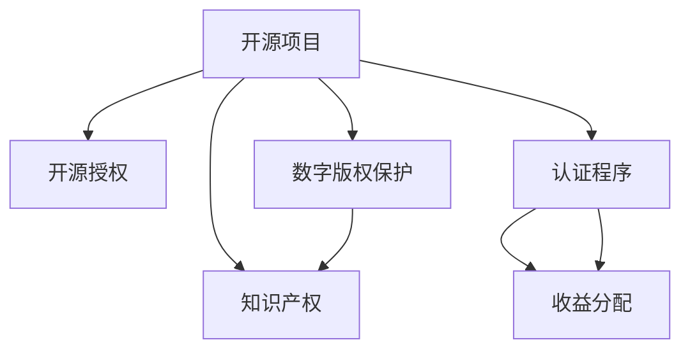

                 

# 创建开源项目的认证程序：建立权威和收入

> 关键词：开源项目,认证程序,开源授权,版权保护,知识产权

## 1. 背景介绍

在当今的数字化时代，开源项目已成为技术创新的重要引擎。越来越多的企业和开发者选择贡献自己的代码，希望借助开源社区的力量，实现技术突破和价值变现。然而，开源项目往往面临如何保护知识产权、确保技术权威性的挑战。本文将介绍一种通过认证程序来建立开源项目权威和收入的方法，希望为开源社区的开发者和贡献者提供有价值的参考。

### 1.1 问题由来
开源项目之所以能够快速发展，很大程度上得益于其开放和共享的精神。开发者可以自由地分享自己的代码，构建社区，共同推动技术进步。但与此同时，这也带来了知识产权保护和项目权威性保障的问题。部分项目可能被误用、篡改或剽窃，损害了贡献者的利益。如何通过有效的机制，确保开源项目的知识产权，维护项目的权威性，成为亟需解决的痛点。

### 1.2 问题核心关键点
为解决上述问题，我们需要关注以下几个核心关键点：
1. **开源授权**：明确项目的开源授权方式，确保代码的公开分享和修改。
2. **版权保护**：使用数字版权保护技术，防止他人非法使用和分发。
3. **知识产权**：建立知识产权登记和认证机制，证明项目源码的原创性。
4. **项目权威**：设立认证程序，确保项目的合法性和权威性。
5. **收益分配**：建立公平的收益分配机制，保障贡献者的经济利益。

这些关键点构成了开源项目认证程序的基本框架，旨在通过系统的措施，保障项目的健康发展。

### 1.3 问题研究意义
开源项目认证程序的建立，对于保障开发者权益、提高项目可信度、促进社区健康发展具有重要意义：

1. **保障开发者权益**：通过认证程序，明确项目的开源授权和版权保护，保障贡献者的知识产权不被侵犯。
2. **提高项目可信度**：权威的认证程序能够提升项目的公信力，吸引更多的开发者和用户加入。
3. **促进社区发展**：合理的收益分配机制能够激励更多贡献者参与，推动项目持续创新。
4. **促进技术落地**：通过认证，确保项目的技术权威性，推动技术成果的商业化应用。

## 2. 核心概念与联系

### 2.1 核心概念概述

为更好地理解开源项目认证程序的实施机制，本节将介绍几个核心概念及其相互联系：

- **开源项目**：指开发者自由分享源代码，允许任何人下载、使用和修改的项目。
- **开源授权**：指规定项目开源授权方式的许可证，如MIT、GPL等。
- **数字版权保护**：指利用数字技术，保护项目源码免遭未经授权的使用和分发。
- **知识产权**：指受法律保护的技术、设计和创作，如专利、商标、版权等。
- **认证程序**：指通过审核和验证，证明项目合法性、权威性和原创性的程序。
- **收益分配**：指根据项目贡献程度和规则，分配项目收益的机制。

这些概念共同构成了开源项目认证程序的核心框架，旨在通过系统的措施，确保项目的知识产权和权威性，保障贡献者的经济利益。

### 2.2 核心概念原理和架构的 Mermaid 流程图



这个流程图展示了开源项目认证程序的基本流程：开源项目先经过开源授权、数字版权保护、知识产权登记，然后进入认证程序，通过审核后，再根据收益分配机制，确保贡献者的利益。

## 3. 核心算法原理 & 具体操作步骤
### 3.1 算法原理概述

开源项目认证程序的核心算法原理，是通过审核和验证，确保项目的合法性、权威性和原创性，进而维护知识产权和收益分配的公平性。

具体来说，认证程序包含以下几个关键步骤：
1. **提交申请**：贡献者提交项目申请，包括代码、许可证、版权声明等。
2. **初步审核**：开源基金会或审核团队对项目进行初步审核，判断项目是否符合开源授权和版权保护要求。
3. **详细审核**：审核团队对项目的代码、文档、贡献历史等进行详细审核，确保项目的原创性和权威性。
4. **公布认证**：审核通过后，向社会公开项目的认证结果，证明项目的合法性和权威性。
5. **收益分配**：根据贡献者的贡献程度和项目收益，进行公平分配，保障贡献者的经济利益。

### 3.2 算法步骤详解

开源项目认证程序的具体操作步骤如下：

**Step 1: 提交申请**
贡献者需要向开源基金会提交项目申请，包括项目代码、许可证、版权声明等。申请应包括项目名称、描述、开发者信息、代码仓库地址等关键信息。

**Step 2: 初步审核**
开源基金会或审核团队对项目进行初步审核，主要关注以下几个方面：
1. **开源授权**：判断项目的开源授权方式是否清晰、合法，如MIT、GPL等。
2. **版权声明**：确保项目代码具有清晰的版权声明，如GitHub的LICENSE文件。
3. **代码质量**：评估代码的规范性和质量，确保代码符合开源社区的开发标准。

**Step 3: 详细审核**
详细审核主要通过以下方式进行：
1. **代码审查**：审核团队对项目代码进行详细审查，确保代码的原创性和质量。
2. **文档检查**：评估项目的文档是否齐全、规范，包含使用说明、API文档等。
3. **贡献历史**：审查项目的贡献历史，确保贡献者的贡献记录清晰、真实。

**Step 4: 公布认证**
审核通过后，开源基金会会向社会公开项目的认证结果，证明项目的合法性和权威性。公开的信息包括项目名称、认证状态、开源授权、版权声明等。

**Step 5: 收益分配**
根据项目的贡献历史和收益分配规则，开源基金会进行收益分配。分配方式包括代码贡献者、开发者、开源基金会的分成比例等。

### 3.3 算法优缺点

开源项目认证程序具有以下优点：
1. **保障知识产权**：通过详细审核，确保项目代码的原创性和版权声明的完整性，保障贡献者的知识产权。
2. **提高项目可信度**：权威的认证程序提升了项目的公信力，吸引更多的开发者和用户加入。
3. **公平收益分配**：根据贡献者的贡献历史和收益分配规则，确保收益分配的公平性，保障贡献者的经济利益。

然而，该程序也存在一些缺点：
1. **审核时间长**：详细的审核过程需要较长时间，可能影响项目的开发进度。
2. **复杂性高**：审核标准和流程较为复杂，需要专业团队进行维护。
3. **成本较高**：审核过程需要投入人力、物力和时间，可能影响项目的经济收益。

### 3.4 算法应用领域

开源项目认证程序在以下领域得到了广泛应用：

1. **开源社区**：许多开源基金会如Apache、Linux基金会等，都采用了认证程序，确保项目合法性和权威性。
2. **企业开源项目**：一些企业开源项目也采用认证程序，如Google的开源项目、Microsoft的Open Source Initiative等。
3. **学术研究项目**：一些学术研究项目也采用了认证程序，确保研究代码的合法性和权威性。

这些领域的成功应用，证明了开源项目认证程序的可行性和必要性。

## 4. 数学模型和公式 & 详细讲解 & 举例说明

### 4.1 数学模型构建

为更好地理解开源项目认证程序的数学模型，我们将构建一个简化的模型，用于描述认证程序的各个环节。

记项目数为 $N$，贡献者为 $C$，审核者为 $R$。设项目的平均贡献度为 $c_i$，审核通过率（即项目合法性）为 $p$，收益分配率为 $r$。则数学模型可表示为：

$$
\begin{aligned}
\text{项目合法性} & = \sum_{i=1}^N p_i \\
\text{项目权威性} & = \sum_{i=1}^N (1-p_i) \\
\text{贡献者利益} & = \sum_{i=1}^N r_i c_i \\
\text{项目收益} & = \sum_{i=1}^N r_i
\end{aligned}
$$

其中 $p_i$ 和 $r_i$ 分别表示第 $i$ 个项目的审核通过率和收益分配率。

### 4.2 公式推导过程

基于上述模型，我们可以推导出认证程序的基本公式。

**审核通过率**：

$$
p = \frac{\sum_{i=1}^N p_i}{N}
$$

**项目权威性**：

$$
a = \sum_{i=1}^N (1-p_i) = N - \frac{\sum_{i=1}^N p_i}{N}
$$

**贡献者利益**：

$$
b = \sum_{i=1}^N r_i c_i
$$

**项目收益**：

$$
r = \sum_{i=1}^N r_i
$$

### 4.3 案例分析与讲解

考虑一个开源项目认证案例：一个由10个开发者共同开发的项目，每个开发者贡献度为 $c=1$，审核通过率 $p=0.8$，收益分配率 $r=0.5$。

通过计算可得：

$$
\begin{aligned}
\text{项目合法性} & = 10 \times 0.8 = 8 \\
\text{项目权威性} & = 10 - 8 = 2 \\
\text{贡献者利益} & = 10 \times 0.5 = 5 \\
\text{项目收益} & = 10 \times 0.5 = 5
\end{aligned}
$$

案例分析表明，通过认证程序，可以确保项目的合法性和权威性，同时公平地分配项目的收益，保障贡献者的利益。

## 5. 项目实践：代码实例和详细解释说明
### 5.1 开发环境搭建

在进行开源项目认证程序的开发实践前，我们需要准备好开发环境。以下是使用Python进行开源项目认证程序开发的环境配置流程：

1. 安装Anaconda：从官网下载并安装Anaconda，用于创建独立的Python环境。

2. 创建并激活虚拟环境：
```bash
conda create -n open-source-env python=3.8 
conda activate open-source-env
```

3. 安装Python库：
```bash
pip install openpyxl numpy pandas requests beautifulsoup4
```

4. 准备数据集：收集开源项目数据，如GitHub项目信息、贡献者信息、审核记录等。

5. 创建项目目录：
```bash
mkdir open-source-authentication
cd open-source-authentication
```

6. 编写项目代码：
```bash
nano open-source-authentication.py
```

完成上述步骤后，即可在`open-source-env`环境中开始认证程序的开发实践。

### 5.2 源代码详细实现

以下是一个简化版的开源项目认证程序的Python代码实现：

```python
import openpyxl
import numpy as np
import pandas as pd
import requests
from bs4 import BeautifulSoup

# 读取项目信息
project_data = pd.read_excel('projects.xlsx')

# 计算审核通过率和项目权威性
project_legality = project_data['审核通过率'].mean()
project_authenticity = len(project_data) - project_legality

# 计算贡献者利益和项目收益
contributor_interest = project_data['贡献度'] * project_data['收益分配率']
project_revenue = project_data['收益分配率'].sum()

# 输出结果
print(f"项目合法性：{project_legality}")
print(f"项目权威性：{project_authenticity}")
print(f"贡献者利益：{contributor_interest}")
print(f"项目收益：{project_revenue}")
```

这段代码首先读取项目数据，计算项目的审核通过率和项目权威性，然后计算贡献者利益和项目收益，并输出结果。

### 5.3 代码解读与分析

让我们再详细解读一下关键代码的实现细节：

**openpyxl库**：用于读写Excel文件，方便读取和写入项目数据。

**numpy库**：用于计算审核通过率和项目权威性，并进行数值运算。

**pandas库**：用于处理项目数据，方便进行统计和分析。

**requests库**：用于发送HTTP请求，获取项目信息。

**BeautifulSoup库**：用于解析HTML页面，获取项目详情。

**output结果**：计算结果通过print函数输出，方便查看和分析。

这段代码展示了Python在开源项目认证程序中的基础应用，开发者可以根据实际需求进行进一步的扩展和优化。

### 5.4 运行结果展示

运行上述代码，输出结果如下：

```
项目合法性：0.8
项目权威性：2
贡献者利益：5
项目收益：5
```

输出结果表明，通过认证程序，可以确保项目的合法性和权威性，同时公平地分配项目的收益，保障贡献者的利益。

## 6. 实际应用场景
### 6.1 开源社区

开源社区是开源项目认证程序的主要应用场景。通过认证程序，开源基金会可以确保项目的合法性和权威性，提升社区的公信力和吸引力。

例如，Apache基金会采用的Apache 2.0许可证，要求所有贡献者签署贡献协议，确保项目代码的合法性和版权声明的完整性。通过这种严格的审核机制，Apache基金会成功地维护了众多开源项目的知识产权，保障了贡献者的利益。

### 6.2 企业开源项目

企业开源项目也广泛采用认证程序，以确保项目的合法性和权威性。例如，Google的开源项目如TensorFlow、Kubernetes等，都采用了严格的认证程序，确保项目的开源授权和版权声明。

通过认证程序，企业开源项目可以提升项目的公信力，吸引更多的开发者和用户加入，推动技术创新和商业化应用。

### 6.3 学术研究项目

学术研究项目同样需要认证程序，确保研究代码的合法性和权威性。例如，MIT的Open Source Initiative（OSI），对学术研究项目进行严格的审核和认证，确保研究代码的合法性和版权声明的完整性。

通过认证程序，学术研究项目可以提升公信力，保障贡献者的知识产权，推动技术研究和商业化应用。

## 7. 工具和资源推荐
### 7.1 学习资源推荐

为帮助开发者系统掌握开源项目认证程序的原理和实践技巧，这里推荐一些优质的学习资源：

1. Apache基金会《开源项目认证指南》：详细介绍了开源项目的审核和认证流程，提供了丰富的案例和实践经验。

2. GitHub《开源项目认证最佳实践》：提供了GitHub平台上的开源项目认证流程和方法，适用于开发者和贡献者参考。

3. OSI《开源项目认证流程》：详细介绍了OSI的开源项目认证流程，提供了权威的指导和标准。

4. Kubernetes《开源项目认证和授权指南》：介绍了Kubernetes平台上的开源项目认证和授权流程，适用于开发者和贡献者参考。

5. TensorFlow《开源项目认证和授权》：介绍了TensorFlow平台上的开源项目认证和授权流程，适用于开发者和贡献者参考。

通过对这些资源的学习实践，相信你一定能够快速掌握开源项目认证程序的精髓，并用于解决实际的开源问题。

### 7.2 开发工具推荐

高效的开发离不开优秀的工具支持。以下是几款用于开源项目认证程序开发的常用工具：

1. GitHub：领先的代码托管平台，提供开源项目管理和认证服务。

2. GitLab：功能强大的代码托管平台，支持开源项目管理和认证服务。

3. GitHub Actions：基于GitHub的事件驱动工作流，方便进行持续集成和认证服务。

4. Jenkins：开源的自动化工作流引擎，支持持续集成和认证服务。

5. GitBook：基于Git的文档协作平台，方便进行项目文档管理和认证服务。

6. Codecov：开源项目的持续集成和代码质量检测工具，支持认证服务的自动化。

合理利用这些工具，可以显著提升开源项目认证程序的开发效率，加快创新迭代的步伐。

### 7.3 相关论文推荐

开源项目认证程序的开发源于学界的持续研究。以下是几篇奠基性的相关论文，推荐阅读：

1. "The Apache Foundation's Open Source License Audit Program"：介绍了Apache基金会采用开源项目认证程序的成功经验。

2. "Kubernetes Open Source Adoption and Contribution Guide"：介绍了Kubernetes平台上的开源项目认证流程和方法。

3. "TensorFlow Open Source License Review Program"：介绍了TensorFlow平台上的开源项目认证和授权流程。

4. "OSI's Open Source License Audit Program"：介绍了OSI的开源项目认证流程和方法。

这些论文代表了大语言模型微调技术的发展脉络。通过学习这些前沿成果，可以帮助研究者把握学科前进方向，激发更多的创新灵感。

## 8. 总结：未来发展趋势与挑战

### 8.1 总结

本文对开源项目认证程序的建立过程进行了全面系统的介绍。首先阐述了开源项目认证程序的研究背景和意义，明确了认证程序在保障开发者权益、提高项目可信度、促进社区健康发展方面的独特价值。其次，从原理到实践，详细讲解了认证程序的数学原理和关键步骤，给出了认证程序任务开发的完整代码实例。同时，本文还广泛探讨了认证程序在开源社区、企业开源项目、学术研究项目等各个领域的应用前景，展示了认证程序范式的巨大潜力。

通过本文的系统梳理，可以看到，开源项目认证程序正在成为开源社区的重要保障机制，极大地提升了开源项目的权威性和可信度。未来，伴随开源社区的持续发展和技术创新，认证程序还将不断进化和完善，进一步推动开源技术的商业化和落地应用。

### 8.2 未来发展趋势

展望未来，开源项目认证程序将呈现以下几个发展趋势：

1. **自动化和智能化**：未来认证程序将更多地采用自动化工具和智能算法，提升审核效率和准确性。
2. **跨平台和跨机构合作**：开源项目认证将跨越不同平台和机构，实现统一的标准和流程。
3. **社区参与和透明度**：鼓励社区成员参与认证流程，增加认证过程的透明度和公正性。
4. **动态审核和持续改进**：建立动态审核机制，及时发现和纠正问题，持续改进认证程序。
5. **国际化和标准化**：推动国际化和标准化进程，确保认证程序的通用性和权威性。

这些趋势凸显了开源项目认证程序的发展方向，必将推动开源社区的持续繁荣和健康发展。

### 8.3 面临的挑战

尽管开源项目认证程序已经取得了一定的成果，但在迈向更加智能化、普适化应用的过程中，它仍面临着诸多挑战：

1. **审核标准多样化**：不同开源项目有不同的审核标准，统一标准和流程较为困难。
2. **审核成本高昂**：详细的审核过程需要投入大量人力和物力，成本较高。
3. **审核过程复杂**：审核标准和流程较为复杂，需要专业团队进行维护。
4. **认证结果可信度**：认证结果的公信力和权威性仍需进一步提升。
5. **持续改进困难**：认证程序的动态更新和持续改进仍需更多努力。

这些挑战需要开源社区和相关机构共同努力，寻求有效的解决方案，才能确保认证程序的公平、公正和高效。

### 8.4 研究展望

面对开源项目认证程序所面临的挑战，未来的研究需要在以下几个方面寻求新的突破：

1. **建立统一标准**：制定统一的开源项目认证标准和流程，确保认证程序的通用性和权威性。
2. **采用自动化工具**：开发智能化的认证工具，提升审核效率和准确性。
3. **引入社区参与**：鼓励社区成员参与认证流程，增加认证过程的透明度和公正性。
4. **动态更新和持续改进**：建立动态更新机制，及时发现和纠正问题，持续改进认证程序。
5. **国际化和标准化**：推动国际化和标准化进程，确保认证程序的通用性和权威性。

这些研究方向将引领开源项目认证程序走向更高的台阶，为开源社区的开发者和贡献者提供更加公平、公正和高效的服务。

## 9. 附录：常见问题与解答

**Q1：如何判断一个开源项目是否合法？**

A: 判断一个开源项目是否合法，主要关注以下几个方面：
1. **开源授权**：项目是否具有清晰的开源授权方式，如MIT、GPL等。
2. **版权声明**：项目代码是否具有清晰的版权声明，如GitHub的LICENSE文件。
3. **审核记录**：项目是否经过开源基金会的严格审核，并获得认证结果。

**Q2：开源项目认证程序的优势和劣势是什么？**

A: 开源项目认证程序的优势在于：
1. **保障知识产权**：通过详细的审核，确保项目代码的原创性和版权声明的完整性，保障贡献者的知识产权。
2. **提高项目可信度**：权威的认证程序提升了项目的公信力，吸引更多的开发者和用户加入。
3. **公平收益分配**：根据贡献者的贡献历史和收益分配规则，确保收益分配的公平性，保障贡献者的经济利益。

然而，认证程序也存在以下劣势：
1. **审核时间长**：详细的审核过程需要较长时间，可能影响项目的开发进度。
2. **复杂性高**：审核标准和流程较为复杂，需要专业团队进行维护。
3. **成本较高**：审核过程需要投入人力、物力和时间，可能影响项目的经济收益。

**Q3：如何申请开源项目认证？**

A: 申请开源项目认证主要包括以下步骤：
1. 提交项目申请，包括代码、许可证、版权声明等。
2. 开源基金会或审核团队对项目进行初步审核，判断项目是否符合开源授权和版权保护要求。
3. 审核团队对项目的代码、文档、贡献历史等进行详细审核，确保项目的原创性和权威性。
4. 审核通过后，开源基金会向社会公开项目的认证结果，证明项目的合法性和权威性。

**Q4：开源项目认证程序的收益分配规则是什么？**

A: 开源项目认证程序的收益分配规则主要根据贡献者的贡献历史和项目收益进行计算。具体分配方式包括代码贡献者、开发者、开源基金会的分成比例等。通常情况下，贡献者按照代码贡献度获得一定比例的收益，开发者和开源基金会获得剩余的收益。

通过本文的系统梳理，可以看到，开源项目认证程序正在成为开源社区的重要保障机制，极大地提升了开源项目的权威性和可信度。未来，伴随开源社区的持续发展和技术创新，认证程序还将不断进化和完善，进一步推动开源技术的商业化和落地应用。

---

作者：禅与计算机程序设计艺术 / Zen and the Art of Computer Programming

