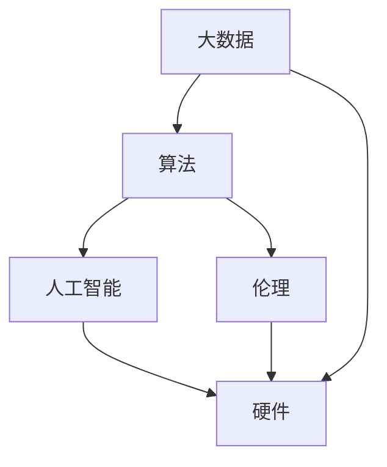

                 

# 创造更美好的明天：人类计算的积极作用

## 1. 背景介绍

### 1.1 问题由来

人类计算的崛起，得益于计算机技术的飞速发展，尤其是人工智能（AI）的突破。如今，AI已经渗透到社会生活的各个角落，带来了深刻的变革和机遇。但与此同时，也引发了诸多社会伦理、就业、隐私等复杂问题。如何在享受AI带来的红利的同时，平衡这些问题，成为一个重要的课题。

本文将从多个角度探讨人类计算的积极作用，试图揭示其潜力，并提出一些解决思路，为未来的发展指明方向。

### 1.2 问题核心关键点

人类计算的核心关键点包括：

- **人工智能：** 核心技术，使计算机具备了人类智能水平，可以处理复杂问题。
- **大数据：** 提供海量数据支持，为AI模型的训练和优化提供保障。
- **算法：** 模型训练的核心，决定了AI的性能和效率。
- **硬件：** 计算资源的基础，决定了AI应用的规模和速度。
- **伦理：** AI应用中需要考虑的伦理问题，如隐私保护、公平性、透明度等。

这些问题紧密相关，共同构成了人类计算的复杂生态。本文将逐一展开探讨。

## 2. 核心概念与联系

### 2.1 核心概念概述

为更好地理解人类计算的积极作用，本节将介绍几个密切相关的核心概念：

- **人工智能：** 一种模拟人类智能的技术，使机器能够执行复杂任务，如视觉识别、语音识别、自然语言处理等。
- **大数据：** 海量的数据集，为AI模型提供了丰富的训练样本和知识。
- **算法：** 模型训练和优化的核心，决定模型性能和泛化能力。
- **硬件：** 包括CPU、GPU、TPU等，提供了必要的计算资源和存储支持。
- **伦理：** 指AI应用中需要遵守的伦理规范，如隐私保护、公平性、透明度等。

这些核心概念之间通过数据、算法和硬件等关键环节紧密联系，共同驱动了人类计算的发展。

### 2.2 核心概念原理和架构的 Mermaid 流程图



这个流程图展示了核心概念之间的联系。大数据为算法提供了数据支持，算法通过AI模型进行计算，最终在硬件上实现。伦理贯穿整个计算过程，是AI应用的重要指导原则。

## 3. 核心算法原理 & 具体操作步骤

### 3.1 算法原理概述

人类计算的核心算法原理包括以下几个关键点：

- **机器学习算法：** 包括监督学习、无监督学习和强化学习等，用于训练模型和优化性能。
- **深度学习算法：** 神经网络、卷积神经网络（CNN）、循环神经网络（RNN）等，用于处理复杂结构化数据。
- **强化学习算法：** 通过奖励机制，训练模型在特定环境中做出最优决策。

这些算法共同构成了人类计算的技术基础。

### 3.2 算法步骤详解

1. **数据准备：** 收集和处理数据，确保数据质量和高可利用性。
2. **模型设计：** 选择合适的模型架构，并根据任务需求进行设计。
3. **模型训练：** 使用训练数据集进行模型训练，优化模型参数。
4. **模型评估：** 在测试数据集上评估模型性能，确保模型泛化能力强。
5. **模型部署：** 将模型部署到实际应用环境中，提供高效的服务。

### 3.3 算法优缺点

人类计算的算法优点包括：

- **高效性：** 大数据和硬件支持使得算法能够快速处理海量数据。
- **泛化能力：** 通过学习广泛的训练数据，算法能够泛化到未知数据上。
- **可解释性：** 部分算法（如决策树）能够提供可解释的决策过程。

算法缺点包括：

- **数据需求高：** 需要大量高质量数据，数据获取和标注成本较高。
- **计算资源需求大：** 复杂算法和模型需要高性能硬件支持，成本较高。
- **可解释性差：** 神经网络等算法通常是"黑盒"模型，难以解释内部决策过程。

### 3.4 算法应用领域

人类计算的算法广泛应用于多个领域，包括：

- **医疗：** 通过AI模型进行疾病诊断、药物研发等。
- **金融：** 使用AI进行风险评估、欺诈检测、交易策略优化等。
- **自动驾驶：** 利用AI实现环境感知、路径规划、控制决策等。
- **智能客服：** 通过自然语言处理技术提供智能客服服务。
- **推荐系统：** 使用AI模型进行个性化推荐，提高用户体验。

## 4. 数学模型和公式 & 详细讲解 & 举例说明

### 4.1 数学模型构建

人类计算中的数学模型通常包括以下几个部分：

- **特征提取：** 将原始数据转换为机器可以理解的特征。
- **损失函数：** 定义模型预测与真实标签之间的差异，用于优化模型。
- **优化算法：** 如梯度下降、随机梯度下降等，用于更新模型参数。

### 4.2 公式推导过程

以简单的线性回归模型为例，其数学模型为：

$$
y = \theta_0 + \theta_1 x_1 + \theta_2 x_2 + ... + \theta_n x_n + \epsilon
$$

其中，$y$ 为输出，$x_1, x_2, ..., x_n$ 为输入特征，$\theta_0, \theta_1, ..., \theta_n$ 为模型参数，$\epsilon$ 为噪声。

使用梯度下降算法更新参数：

$$
\theta_i \leftarrow \theta_i - \alpha \frac{\partial L(y, x)}{\partial \theta_i}
$$

其中，$\alpha$ 为学习率。

### 4.3 案例分析与讲解

以图像分类为例，使用卷积神经网络（CNN）进行训练。CNN通过卷积层、池化层等层次结构，逐步提取图像特征，并在全连接层进行分类。使用交叉熵损失函数和随机梯度下降算法进行模型训练和优化。

## 5. 项目实践：代码实例和详细解释说明

### 5.1 开发环境搭建

在进行人类计算项目开发时，需要准备以下环境：

1. 安装Python：选择Python 3.8及以上版本，并确保pip、conda等工具可用。
2. 安装TensorFlow、PyTorch等深度学习框架。
3. 安装NumPy、Pandas等数据处理库。
4. 安装Jupyter Notebook等开发工具。

### 5.2 源代码详细实现

以图像分类为例，使用TensorFlow框架实现CNN模型：

```python
import tensorflow as tf
from tensorflow import keras
import numpy as np
import matplotlib.pyplot as plt

# 准备数据
(x_train, y_train), (x_test, y_test) = keras.datasets.cifar10.load_data()
x_train = x_train / 255.0
x_test = x_test / 255.0

# 构建模型
model = keras.Sequential([
    keras.layers.Conv2D(32, (3, 3), activation='relu', input_shape=(32, 32, 3)),
    keras.layers.MaxPooling2D((2, 2)),
    keras.layers.Conv2D(64, (3, 3), activation='relu'),
    keras.layers.MaxPooling2D((2, 2)),
    keras.layers.Flatten(),
    keras.layers.Dense(64, activation='relu'),
    keras.layers.Dense(10)
])

# 编译模型
model.compile(optimizer='adam',
              loss=tf.keras.losses.SparseCategoricalCrossentropy(from_logits=True),
              metrics=['accuracy'])

# 训练模型
history = model.fit(x_train, y_train, epochs=10, 
                    validation_data=(x_test, y_test))

# 评估模型
test_loss, test_acc = model.evaluate(x_test, y_test, verbose=2)
print('Test accuracy:', test_acc)

# 绘制训练曲线
plt.plot(history.history['accuracy'], label='accuracy')
plt.plot(history.history['val_accuracy'], label='val_accuracy')
plt.xlabel('Epoch')
plt.ylabel('Accuracy')
plt.ylim([0.5, 1])
plt.legend(loc='lower right')
plt.show()
```

### 5.3 代码解读与分析

这段代码实现了图像分类的CNN模型。首先导入必要的库，然后加载CIFAR-10数据集，并对数据进行预处理。接着构建CNN模型，包括卷积层、池化层、全连接层等，并使用adam优化器和交叉熵损失函数进行编译。最后进行模型训练和评估，并绘制训练曲线。

## 6. 实际应用场景

### 6.1 医疗诊断

在医疗领域，人类计算可以用于疾病诊断和治疗方案推荐。通过训练包含大量病历数据的模型，可以在短时间内对新病历进行快速诊断，提高诊断准确性。

### 6.2 金融风控

金融领域中，人类计算可以用于风险评估和欺诈检测。通过分析历史交易数据，构建风险模型，可以有效识别异常交易和欺诈行为，保护客户资产安全。

### 6.3 自动驾驶

自动驾驶是AI的重要应用之一，通过深度学习和强化学习算法，可以实现环境感知、路径规划和控制决策等。未来，自动驾驶技术有望大规模普及，带来交通安全的重大提升。

### 6.4 智能客服

智能客服系统可以提供24小时不间断服务，通过自然语言处理技术，快速理解用户问题并给出解答。这不仅可以提高客户满意度，还可以大幅降低人工客服成本。

### 6.5 推荐系统

推荐系统通过分析用户历史行为数据，预测用户对不同商品或内容的兴趣，并推荐相关商品或内容。这种个性化推荐可以显著提升用户体验，增加平台粘性。

## 7. 工具和资源推荐

### 7.1 学习资源推荐

- **《深度学习》书籍：** Ian Goodfellow等人著，详细介绍了深度学习的基本概念和算法。
- **Coursera深度学习课程：** 由Andrew Ng等人主讲，涵盖了深度学习的基础和高级内容。
- **Kaggle竞赛平台：** 提供大量实际数据集和挑战赛，实践深度学习算法。

### 7.2 开发工具推荐

- **TensorFlow：** 由Google开发的深度学习框架，支持GPU加速和分布式训练。
- **PyTorch：** Facebook开发的深度学习框架，具有动态计算图和丰富的工具库。
- **Jupyter Notebook：** 支持代码、数据和结果的一体化展示，方便学习和分享。

### 7.3 相关论文推荐

- **Deep Learning：** Ian Goodfellow等人著，全面介绍了深度学习的技术和应用。
- **ImageNet Classification with Deep Convolutional Neural Networks：** Alex Krizhevsky等人著，提出CNN模型，显著提升了图像分类性能。
- **Attention is All You Need：** Ashish Vaswani等人著，提出Transformer模型，开创了预训练大模型的时代。

## 8. 总结：未来发展趋势与挑战

### 8.1 研究成果总结

人类计算的发展离不开技术的不断进步和数据的积累。深度学习、强化学习等算法在各个领域取得了显著进展，推动了AI应用的多样化和普及。未来，AI将继续拓展应用场景，提升社会效率，改善人类生活。

### 8.2 未来发展趋势

未来，人类计算的发展趋势包括：

- **多模态计算：** 结合视觉、语音、文本等多种模态数据，构建更为全面的人类智能系统。
- **联邦学习：** 在保护数据隐私的前提下，通过分布式计算提升模型性能。
- **边缘计算：** 将计算任务分解为多个节点，实现高效的数据处理和模型优化。
- **AI伦理：** 在AI应用中引入伦理规范，保护用户隐私，确保公平性和透明度。

### 8.3 面临的挑战

人类计算面临的挑战包括：

- **数据隐私：** 如何在保证数据隐私的前提下，进行有效计算和数据共享。
- **模型公平性：** 避免AI模型在训练和应用中的偏见，确保公平性。
- **计算资源：** 如何高效利用计算资源，提升AI应用的性能和效率。
- **伦理问题：** 在AI应用中，如何平衡技术进步和伦理道德。

### 8.4 研究展望

未来的研究可以从以下几个方面进行：

- **AI伦理规范：** 制定和完善AI伦理规范，确保技术进步符合人类价值观。
- **数据隐私保护：** 研究隐私保护技术，如差分隐私、联邦学习等，保护用户隐私。
- **计算资源优化：** 探索边缘计算、分布式计算等技术，提升AI应用效率。
- **多模态融合：** 研究如何融合多种模态数据，提升AI系统的综合能力。

## 9. 附录：常见问题与解答

**Q1：人类计算和人工智能有什么区别？**

A: 人类计算是人工智能的一种实现方式，通过计算和算法模拟人类智能，解决复杂问题。

**Q2：人类计算中数据的重要性体现在哪里？**

A: 数据是AI模型的基础，高质量的数据可以提升模型的泛化能力和性能。

**Q3：人类计算中如何处理计算资源不足的问题？**

A: 可以采用分布式计算、边缘计算等技术，将计算任务分散到多个节点进行处理。

**Q4：如何在AI应用中确保公平性和透明度？**

A: 引入伦理规范和监管机制，确保AI应用的公正性和透明性。

**Q5：如何处理AI应用中的隐私问题？**

A: 采用差分隐私、联邦学习等技术，保护用户隐私，同时提供高质量的数据支持。

---

作者：禅与计算机程序设计艺术 / Zen and the Art of Computer Programming

