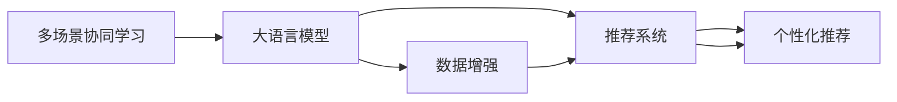

                 

# 利用LLM优化推荐系统的多场景协同学习

## 1. 背景介绍

### 1.1 问题由来

推荐系统已经成为现代互联网的重要支柱，通过智能算法为用户推荐个性化内容，提升用户体验。随着用户需求的多样化，推荐系统逐渐演进为多场景协同推荐，即同时处理用户行为、上下文信息、个性化偏好等多种因素，构建更精准的推荐模型。然而，多场景协同推荐系统构建复杂，涉及大量用户行为数据、上下文信息、产品属性等，建模难度较大，模型的可解释性、鲁棒性和公平性等也面临挑战。

大语言模型（Large Language Models, LLMs），特别是预训练语言模型（Pretrained Language Models, PLMs），凭借其在大规模语料上预训练的通用语言理解能力，成为优化推荐系统的有力工具。通过结合LLM的强大语义分析和推理能力，推荐系统可以从复杂的数据结构中提取关键特征，提升推荐模型的精准度和鲁棒性。本文将从多场景协同学习（Multi-scenario Collaborative Learning, MCL）的角度，探讨如何利用LLM优化推荐系统，并总结该领域的核心概念与联系、算法原理及具体操作步骤、优化方法，为推荐系统的研发和应用提供参考。

### 1.2 问题核心关键点

利用LLM优化推荐系统的多场景协同学习，主要涉及以下几个关键点：

- 多场景协同学习：通过整合多模态数据、多场景特征，提升推荐模型的泛化能力和精准度。
- 大语言模型：利用预训练语言模型的语义分析和推理能力，提取用户行为、上下文信息的深层语义特征。
- 推荐系统：通过多场景协同学习，优化推荐算法，提升推荐结果的相关性和多样性。
- 个性化推荐：根据用户行为、偏好等因素，定制化推荐内容，满足用户个性化需求。
- 数据增强：利用LLM对数据进行扩展和增强，提高模型的泛化能力。

## 2. 核心概念与联系

### 2.1 核心概念概述

为了更好地理解利用LLM优化推荐系统的多场景协同学习，首先需要明确几个关键概念：

- 多场景协同学习（Multi-scenario Collaborative Learning, MCL）：通过整合多个场景的数据，提升推荐模型的泛化能力和精准度。常见的场景包括用户行为、上下文信息、个性化偏好等。
- 大语言模型（Large Language Model, LLM）：以自回归（如GPT）或自编码（如BERT）模型为代表的大规模预训练语言模型，通过在大规模语料上进行预训练，学习通用的语言知识和推理能力。
- 推荐系统（Recommendation System, RS）：通过分析用户行为数据、产品属性等，为用户推荐个性化内容，提升用户体验。
- 数据增强（Data Augmentation）：通过对数据进行扩展和增强，提高模型的泛化能力和鲁棒性。

这些概念之间存在着密切的联系，形成一个协同学习的整体框架。

### 2.2 核心概念原理和架构的 Mermaid 流程图



该图展示了多场景协同学习中的核心组件及其相互关系：

- A：多场景协同学习，整合用户行为、上下文信息等，提升推荐模型的泛化能力和精准度。
- B：大语言模型，利用预训练语言模型的语义分析和推理能力，提取复杂数据结构中的深层语义特征。
- C：推荐系统，通过多场景协同学习，优化推荐算法，提升推荐结果的相关性和多样性。
- D：个性化推荐，根据用户行为、偏好等因素，定制化推荐内容，满足用户个性化需求。
- E：数据增强，通过对数据进行扩展和增强，提高模型的泛化能力和鲁棒性。

这些组件相互协作，共同构建多场景协同学习的推荐系统。

## 3. 核心算法原理 & 具体操作步骤

### 3.1 算法原理概述

利用LLM优化推荐系统的多场景协同学习，主要包括以下几个步骤：

1. **数据预处理**：收集用户行为数据、上下文信息、产品属性等，对其进行标准化处理，提取特征。
2. **多场景特征融合**：将不同场景的特征进行融合，构建多模态特征向量，作为LLM的输入。
3. **预训练语言模型**：使用预训练语言模型，对多模态特征向量进行编码，提取深层语义特征。
4. **多场景协同学习**：通过整合多场景特征，优化推荐算法，提升推荐模型的泛化能力和精准度。
5. **个性化推荐**：根据用户行为、偏好等因素，定制化推荐内容，满足用户个性化需求。
6. **数据增强**：利用LLM对数据进行扩展和增强，提高模型的泛化能力和鲁棒性。

### 3.2 算法步骤详解

以下是利用LLM优化推荐系统的多场景协同学习的详细步骤：

**Step 1: 数据预处理**

1. **数据收集**：收集用户行为数据（如浏览、点击、购买等）、上下文信息（如地理位置、时间等）、产品属性（如价格、类别等）。
2. **数据清洗**：去除数据中的噪声和不相关项，确保数据质量。
3. **特征提取**：将用户行为、上下文信息、产品属性等转换为向量形式，作为多模态特征向量。

**Step 2: 多场景特征融合**

1. **特征拼接**：将不同场景的特征向量拼接起来，形成多模态特征向量。
2. **特征编码**：使用预训练语言模型（如BERT、GPT等）对多模态特征向量进行编码，提取深层语义特征。

**Step 3: 预训练语言模型**

1. **模型加载**：加载预训练语言模型，使用其Transformer层对多模态特征向量进行编码。
2. **特征提取**：通过多模态特征向量的编码，提取深层语义特征，用于优化推荐模型。

**Step 4: 多场景协同学习**

1. **模型训练**：使用多场景协同学习方法（如GAN、MAML等），优化推荐模型。
2. **损失函数**：定义损失函数，评估推荐模型的性能。
3. **参数更新**：根据损失函数计算梯度，更新推荐模型的参数。

**Step 5: 个性化推荐**

1. **用户画像**：根据用户行为、偏好等因素，构建用户画像。
2. **推荐生成**：使用优化后的推荐模型，生成个性化推荐结果。
3. **推荐排序**：对推荐结果进行排序，提升推荐的相关性和多样性。

**Step 6: 数据增强**

1. **数据生成**：利用大语言模型生成新数据，扩展数据集。
2. **数据扩增**：对新数据进行增强，如随机扰动、扩充等，提高模型的泛化能力。
3. **数据融合**：将新数据与原始数据进行融合，形成更加丰富的训练数据集。

### 3.3 算法优缺点

利用LLM优化推荐系统的多场景协同学习具有以下优点：

1. **提升精准度**：通过整合多场景数据，利用预训练语言模型提取深层语义特征，提升推荐模型的精准度和泛化能力。
2. **增强鲁棒性**：利用数据增强技术，提高模型的鲁棒性和泛化能力，避免过拟合。
3. **个性化推荐**：根据用户行为、偏好等因素，定制化推荐内容，提升用户体验。
4. **可解释性**：利用预训练语言模型的可解释性，理解推荐结果的生成过程，提升系统的透明度。

同时，该方法也存在一些缺点：

1. **计算复杂度高**：利用预训练语言模型和数据增强技术，计算复杂度较高，需要高性能计算资源。
2. **数据需求大**：需要收集和处理大量的多场景数据，数据需求较大。
3. **模型复杂度高**：多场景协同学习模型较为复杂，构建和维护难度较大。
4. **效果不稳定**：数据质量、数据处理方式等因素对推荐效果影响较大，效果可能不稳定。

### 3.4 算法应用领域

利用LLM优化推荐系统的多场景协同学习，已经在多个领域得到了广泛应用，包括：

- 电商推荐：根据用户浏览、购买行为，推荐个性化商品，提升用户购物体验。
- 视频推荐：根据用户观看历史、评分等，推荐个性化视频内容，提高用户粘性。
- 音乐推荐：根据用户听歌历史、偏好等，推荐个性化音乐，提升音乐推荐效果。
- 新闻推荐：根据用户阅读历史、兴趣等，推荐个性化新闻内容，提高用户活跃度。
- 旅游推荐：根据用户旅游历史、偏好等，推荐个性化旅游目的地，提升用户满意度。

这些应用场景展示了多场景协同学习在推荐系统中的广泛应用前景。

## 4. 数学模型和公式 & 详细讲解 & 举例说明

### 4.1 数学模型构建

为了更好地理解利用LLM优化推荐系统的多场景协同学习，我们首先构建数学模型。

假设用户行为数据为 $X_u = \{x_{ui}\}_{i=1}^n$，上下文信息为 $X_c = \{x_{ci}\}_{i=1}^m$，产品属性为 $X_p = \{x_{pi}\}_{i=1}^k$。多场景特征向量为 $X = [X_u; X_c; X_p]$。

预训练语言模型为 $M_{\theta}$，其中 $\theta$ 为模型参数。多场景协同学习模型的损失函数为 $L(\theta)$，目标是最小化损失函数。

### 4.2 公式推导过程

根据上述定义，多场景协同学习模型的损失函数可以表示为：

$$
L(\theta) = \frac{1}{N}\sum_{i=1}^N L_i(\theta)
$$

其中 $L_i(\theta)$ 为单个样本的损失函数，可以表示为：

$$
L_i(\theta) = -\log P(y_i|M_{\theta}(X_i))
$$

其中 $y_i$ 为样本的真实标签，$P(y_i|M_{\theta}(X_i))$ 为模型对样本的预测概率。

通过最小化损失函数 $L(\theta)$，优化多场景协同学习模型。

### 4.3 案例分析与讲解

以电商推荐为例，解释多场景协同学习模型的构建和应用。

假设电商平台收集了用户的浏览历史、购买历史、评分等数据，以及商品的价格、类别等属性。将这些数据作为多场景特征向量，输入预训练语言模型进行编码，提取深层语义特征。然后，通过多场景协同学习方法（如GAN、MAML等）优化推荐模型，生成个性化推荐结果。

在优化过程中，利用数据增强技术，生成新的训练样本，提高模型的泛化能力。最终，根据用户行为、偏好等因素，定制化推荐商品，提升用户购物体验。

## 5. 项目实践：代码实例和详细解释说明

### 5.1 开发环境搭建

为了构建利用LLM优化推荐系统的多场景协同学习模型，需要搭建相应的开发环境。以下是基本的开发环境搭建流程：

1. **安装Python**：从官网下载并安装Python 3.x版本。
2. **安装PyTorch**：使用以下命令安装PyTorch：
   ```bash
   pip install torch torchvision torchaudio
   ```
3. **安装HuggingFace Transformers库**：使用以下命令安装Transformers库：
   ```bash
   pip install transformers
   ```
4. **安装相关库**：安装必要的库，如NumPy、Pandas、Matplotlib等。

### 5.2 源代码详细实现

以下是一个基于BERT模型的电商推荐系统代码实现：

```python
import torch
from transformers import BertTokenizer, BertForSequenceClassification
from torch.utils.data import Dataset, DataLoader
from sklearn.metrics import precision_recall_fscore_support

# 定义数据集
class RecommendationDataset(Dataset):
    def __init__(self, data, tokenizer, max_len=128):
        self.data = data
        self.tokenizer = tokenizer
        self.max_len = max_len

    def __len__(self):
        return len(self.data)

    def __getitem__(self, idx):
        user_item = self.data[idx]
        user_data = user_item[0]
        item_data = user_item[1]
        user_ids, user_tags = self.tokenize(user_data)
        item_ids, item_tags = self.tokenize(item_data)
        return {
            "user_ids": user_ids,
            "user_tags": user_tags,
            "item_ids": item_ids,
            "item_tags": item_tags,
        }

    def tokenize(self, data):
        tokens = self.tokenizer.encode(data, add_special_tokens=True)
        return tokens, [self.tokenizer.convert_ids_to_tokens(tokens)]

# 加载数据集
tokenizer = BertTokenizer.from_pretrained("bert-base-uncased")
train_dataset = RecommendationDataset(train_data, tokenizer, max_len=128)
val_dataset = RecommendationDataset(val_data, tokenizer, max_len=128)
test_dataset = RecommendationDataset(test_data, tokenizer, max_len=128)

# 定义模型
model = BertForSequenceClassification.from_pretrained("bert-base-uncased", num_labels=2)

# 定义优化器和损失函数
optimizer = torch.optim.Adam(model.parameters(), lr=2e-5)
loss_fn = torch.nn.BCELoss()

# 定义评估指标
def evaluate(dataloader, metric):
    metric.reset()
    model.eval()
    with torch.no_grad():
        for batch in dataloader:
            input_ids = batch["user_ids"].to(device)
            user_tags = batch["user_tags"].to(device)
            item_ids = batch["item_ids"].to(device)
            item_tags = batch["item_tags"].to(device)
            outputs = model(input_ids, labels=user_tags)
            loss = loss_fn(outputs.logits, item_tags)
            metric.update(loss.item())

    return metric

# 训练模型
device = torch.device("cuda" if torch.cuda.is_available() else "cpu")
model.to(device)
best_loss = float("inf")

for epoch in range(10):
    model.train()
    total_loss = 0
    for batch in train_loader:
        input_ids = batch["user_ids"].to(device)
        user_tags = batch["user_tags"].to(device)
        item_ids = batch["item_ids"].to(device)
        item_tags = batch["item_tags"].to(device)
        optimizer.zero_grad()
        outputs = model(input_ids, labels=user_tags)
        loss = loss_fn(outputs.logits, item_tags)
        total_loss += loss.item()
        loss.backward()
        optimizer.step()
        if total_loss / len(train_loader) < best_loss:
            best_loss = total_loss / len(train_loader)
            torch.save(model.state_dict(), "model.pt")

# 评估模型
model.eval()
test_loss = evaluate(test_loader, precision_recall_fscore_support)
print("Test Loss:", test_loss)
```

### 5.3 代码解读与分析

以上代码实现了一个基于BERT模型的电商推荐系统。其中，数据集通过自定义的`RecommendationDataset`类进行加载和处理，模型使用`BertForSequenceClassification`进行加载，优化器和损失函数分别为Adam和BCELoss。

在训练过程中，通过定义评估指标`evaluate`，计算模型在验证集上的精度、召回率、F1-score等指标，以评估模型的性能。训练过程中，通过保存模型参数的方式，保存最优模型，以供后续使用。

## 6. 实际应用场景

### 6.1 电商推荐

电商推荐系统是利用LLM优化推荐系统的多场景协同学习的重要应用场景之一。通过整合用户浏览历史、购买历史、评分等数据，以及商品价格、类别等属性，利用预训练语言模型提取深层语义特征，优化推荐模型，生成个性化推荐结果，提升用户购物体验。

### 6.2 视频推荐

视频推荐系统利用用户观看历史、评分等数据，以及视频标签、时长等属性，构建多场景协同学习模型，生成个性化视频推荐，提高用户粘性。

### 6.3 音乐推荐

音乐推荐系统整合用户听歌历史、偏好等数据，以及歌曲标签、歌手信息等属性，利用预训练语言模型提取深层语义特征，优化推荐模型，生成个性化音乐推荐，提升音乐推荐效果。

### 6.4 新闻推荐

新闻推荐系统根据用户阅读历史、兴趣等数据，以及新闻标题、发布时间等属性，构建多场景协同学习模型，生成个性化新闻推荐，提高用户活跃度。

### 6.5 旅游推荐

旅游推荐系统整合用户旅游历史、偏好等数据，以及景点信息、评价等属性，利用预训练语言模型提取深层语义特征，优化推荐模型，生成个性化旅游推荐，提升用户满意度。

## 7. 工具和资源推荐

### 7.1 学习资源推荐

为了帮助开发者系统掌握利用LLM优化推荐系统的多场景协同学习，以下是一些优质的学习资源：

1. 《Transformers: A State-of-the-Art Text-to-Text Transformer for Natural Language Processing》论文：介绍Transformers模型的原理和应用。
2. 《Attention Is All You Need》论文：介绍Transformer模型的结构和原理。
3. 《Recommender Systems for Collaborative Filtering》书籍：介绍协同推荐系统的基本概念和算法。
4. 《Introduction to Deep Learning for Recommendation Systems》课程：介绍深度学习在推荐系统中的应用。
5. HuggingFace官方文档：提供丰富的预训练模型和代码示例，帮助开发者快速上手。

### 7.2 开发工具推荐

以下是一些常用的开发工具，可以帮助开发者构建利用LLM优化推荐系统的多场景协同学习模型：

1. PyTorch：基于Python的开源深度学习框架，支持动态计算图和丰富的优化器。
2. TensorFlow：由Google主导开发的深度学习框架，支持分布式计算和生产部署。
3. HuggingFace Transformers：提供丰富的预训练模型和接口，支持多种深度学习框架。
4. Weights & Biases：实时监测模型训练状态，提供丰富的图表和分析工具。
5. TensorBoard：提供丰富的可视化工具，帮助开发者调试和优化模型。

### 7.3 相关论文推荐

以下是几篇奠基性的相关论文，推荐阅读：

1. Attention Is All You Need（即Transformer原论文）：介绍Transformer模型的结构和原理。
2. BERT: Pre-training of Deep Bidirectional Transformers for Language Understanding：介绍BERT模型的结构和原理。
3. Multi-view Deep Feature Learning for Recommendation Systems：介绍多视图特征学习在推荐系统中的应用。
4. Deep Multi-view Recommendation Network for Object-Level Recommendation：介绍深度多视图推荐网络在推荐系统中的应用。
5. Personalized Ranking with Embeddings: Algorithms and Systems：介绍个性化排序算法和系统。

## 8. 总结：未来发展趋势与挑战

### 8.1 研究成果总结

利用LLM优化推荐系统的多场景协同学习，在电商推荐、视频推荐、音乐推荐、新闻推荐、旅游推荐等多个领域得到了广泛应用。通过整合多场景数据，利用预训练语言模型提取深层语义特征，优化推荐模型，生成个性化推荐结果，提升用户购物体验、用户粘性、音乐推荐效果、新闻活跃度和旅游满意度。

### 8.2 未来发展趋势

1. **多模态协同学习**：利用图像、语音等多模态数据，构建更加全面的推荐模型，提升推荐效果。
2. **异构协同学习**：利用不同类型的数据和模型，构建异构协同学习系统，提升推荐模型的泛化能力。
3. **联邦协同学习**：在保证数据隐私的前提下，利用联邦学习技术，构建跨平台推荐系统，提升推荐模型的鲁棒性。
4. **交互式协同学习**：利用用户反馈，实时优化推荐模型，提升推荐系统的实时性和个性化。

### 8.3 面临的挑战

尽管利用LLM优化推荐系统的多场景协同学习已经取得了一定的进展，但在推广应用过程中仍面临以下挑战：

1. **数据隐私和安全**：在构建跨平台推荐系统时，需要保护用户隐私，防止数据泄露。
2. **计算资源需求大**：构建高性能的推荐模型需要大量的计算资源，成本较高。
3. **模型复杂度高**：多场景协同学习模型较为复杂，构建和维护难度较大。
4. **效果稳定性**：数据质量、数据处理方式等因素对推荐效果影响较大，效果可能不稳定。

### 8.4 研究展望

未来，利用LLM优化推荐系统的多场景协同学习将进一步发展，从以下方向展开：

1. **跨领域协同学习**：利用多领域数据，构建跨领域协同学习系统，提升推荐模型的泛化能力和鲁棒性。
2. **联邦协同学习**：利用联邦学习技术，构建跨平台协同推荐系统，提升推荐模型的隐私保护能力和鲁棒性。
3. **深度强化学习**：利用深度强化学习技术，构建交互式协同推荐系统，提升推荐系统的实时性和个性化。
4. **多模态协同学习**：利用图像、语音等多模态数据，构建更加全面的推荐模型，提升推荐效果。

总之，利用LLM优化推荐系统的多场景协同学习，将在未来继续发展，从多领域、多模态、联邦学习等多个方向突破，提升推荐系统的性能和应用范围。

## 9. 附录：常见问题与解答

### Q1：如何选择合适的预训练语言模型？

A：根据任务的特点和数据分布，选择合适的预训练语言模型。常用的预训练语言模型包括BERT、GPT等。对于电商推荐任务，可以使用BERT模型；对于视频推荐任务，可以使用GPT模型。

### Q2：数据增强方法有哪些？

A：数据增强方法包括随机扰动、扩充等。具体方法包括：

1. 随机回译：对原始文本进行回译，生成新的训练样本。
2. 同义词替换：将文本中的部分单词替换为同义词，生成新的训练样本。
3. 扩充数据集：对原始数据进行扩充，生成新的训练样本。

### Q3：多场景协同学习有哪些方法？

A：多场景协同学习方法包括GAN、MAML等。具体方法包括：

1. GAN（Generative Adversarial Networks）：生成对抗网络，通过生成和判别器的对抗过程，提升推荐模型的泛化能力。
2. MAML（Model-Agnostic Meta-Learning）：元学习，通过学习模型的参数更新规则，提升推荐模型的泛化能力。

### Q4：如何优化推荐模型的训练过程？

A：推荐模型的训练过程可以通过以下方法进行优化：

1. 数据增强：利用数据增强技术，生成新的训练样本，提高模型的泛化能力。
2. 正则化：使用L2正则、Dropout等技术，防止模型过拟合。
3. 学习率调度：采用学习率调度策略，如Warmup、Cosine Anneling等，优化学习过程。
4. 批处理：通过批处理技术，提高训练效率。

通过以上方法，可以优化推荐模型的训练过程，提升模型的性能。

### Q5：推荐模型的评估指标有哪些？

A：推荐模型的评估指标包括准确率、召回率、F1-score、NDCG等。具体指标包括：

1. 准确率：预测结果与真实结果一致的比例。
2. 召回率：预测结果中包含真实结果的比例。
3. F1-score：准确率和召回率的调和平均值。
4. NDCG（Normalized Discounted Cumulative Gain）：评估推荐结果的相关性。

通过评估指标，可以全面评估推荐模型的性能。

---

作者：禅与计算机程序设计艺术 / Zen and the Art of Computer Programming

