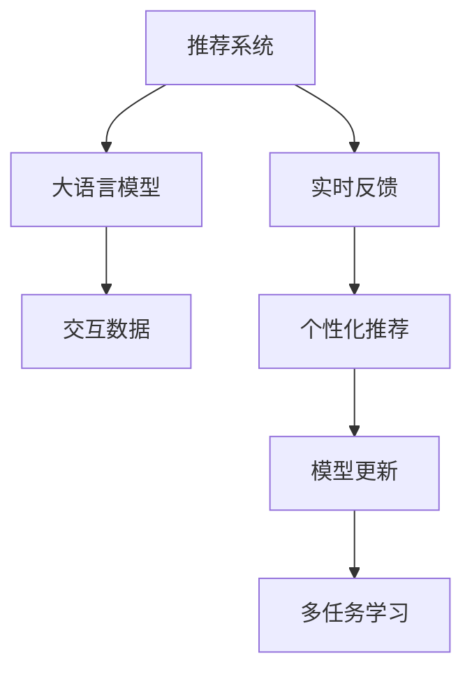

                 

# 利用LLM优化推荐系统的实时反馈处理

> 关键词：推荐系统,LLM,实时反馈处理,个性化推荐,交互数据

## 1. 背景介绍

### 1.1 问题由来

在当今信息爆炸的时代，推荐系统已成为各大平台（如Netflix、Amazon、YouTube等）的核心竞争力。其核心目标是通过大量用户行为数据，挖掘出用户偏好，生成个性化推荐列表，帮助用户发现感兴趣的内容。然而，传统的推荐系统往往依赖于历史数据，难以捕捉用户即时变化的需求和兴趣。如何更高效地利用实时反馈，提升推荐系统性能，成为研究热点。

### 1.2 问题核心关键点

实时反馈处理是推荐系统中极为关键的一环，其核心在于如何将用户的即时行为信息，如点击、评分、浏览等，实时地融合到推荐模型中，快速更新推荐结果。传统的推荐系统多采用基于协同过滤或矩阵分解的模型，难以灵活处理实时反馈，且对数据的时效性要求较高。而近年来涌现的基于深度学习的推荐方法，如CTR预测、序列推荐等，虽然能够处理实时数据，但在模型更新和计算效率上仍存在瓶颈。

因此，本文聚焦于利用大语言模型(LLM)进行实时反馈处理，提出一种基于大语言模型的实时推荐系统优化方案，旨在更高效地融合用户行为数据，生成个性化推荐，提升用户体验和平台粘性。

### 1.3 问题研究意义

实时反馈处理对提升推荐系统性能具有重要意义：

1. **快速响应**：通过实时反馈，推荐系统能够快速响应用户变化的需求和兴趣，增强用户满意度和平台粘性。
2. **精准推荐**：利用实时反馈信息，推荐模型可以及时更新用户偏好，生成更精准、个性化的推荐内容。
3. **数据利用**：通过实时反馈处理，推荐系统能够充分利用用户即时行为数据，减少对历史数据的依赖，拓宽数据来源。
4. **用户体验**：实时反馈处理可以增强用户与平台的互动，提升用户体验和平台活力。

本文将详细讨论基于大语言模型的实时反馈处理技术，包括模型构建、数据融合和优化算法，为推荐系统提供一种新的优化思路。

## 2. 核心概念与联系

### 2.1 核心概念概述

为更好地理解利用大语言模型进行实时反馈处理，本节将介绍几个密切相关的核心概念：

- 推荐系统(Recommendation System)：通过分析用户行为数据，推荐用户可能感兴趣的商品或内容的技术系统。
- 大语言模型(Large Language Model, LLM)：以Transformer结构为基础，通过大规模无标签数据进行预训练，学习语言通用表示的语言模型。
- 实时反馈(Real-time Feedback)：用户在平台上进行的即时行为，如点击、评分、浏览等，用于动态更新推荐模型。
- 个性化推荐(Personalized Recommendation)：根据用户特定的兴趣和行为，生成个性化的推荐内容，提升用户体验。
- 交互数据(Interactive Data)：用户与平台的交互记录，如点击历史、评分反馈等，用于优化推荐模型。
- 模型更新(Model Update)：根据实时反馈信息，动态更新推荐模型参数，保证模型输出与用户需求实时对齐。
- 多任务学习(Multi-task Learning)：同时学习多个相关任务，提升模型的泛化能力和性能。

这些核心概念之间的逻辑关系可以通过以下Mermaid流程图来展示：



这个流程图展示了大语言模型在推荐系统中的核心作用，以及实时反馈、个性化推荐、模型更新等关键环节的相互联系：

1. 推荐系统通过大语言模型学习语言通用表示。
2. 实时反馈信息通过大语言模型进行融合，生成个性化推荐。
3. 个性化的推荐结果通过模型更新不断优化，增强推荐效果。
4. 多任务学习用于提升模型的泛化能力和性能。

## 3. 核心算法原理 & 具体操作步骤
### 3.1 算法原理概述

基于大语言模型的实时反馈处理，本质上是一种结合深度学习和大规模预训练的推荐系统优化方法。其核心思想是：将大语言模型作为推荐系统的重要组件，利用其在自然语言处理上的优势，实时地处理用户反馈信息，生成个性化推荐，并进行动态模型更新。

形式化地，假设推荐系统的训练集为 $D=\{(x_i, y_i)\}_{i=1}^N, x_i \in \mathcal{X}, y_i \in \mathcal{Y}$，其中 $x_i$ 为用户行为数据，$y_i$ 为用户推荐结果。大语言模型为 $M_{\theta}:\mathcal{X} \rightarrow \mathcal{Y}$，其中 $\theta$ 为模型参数。

推荐系统的目标是最小化用户行为数据与推荐结果的差异，即找到最优参数：

$$
\theta^* = \mathop{\arg\min}_{\theta} \mathcal{L}(M_{\theta},D)
$$

其中 $\mathcal{L}$ 为损失函数，用于衡量推荐系统预测输出与实际标签之间的差异。常见的损失函数包括交叉熵损失、均方误差损失等。

通过梯度下降等优化算法，实时反馈处理过程不断更新模型参数 $\theta$，最小化损失函数 $\mathcal{L}$，使得推荐系统输出逼近实际标签。由于 $\theta$ 已经通过预训练获得了较强的语言理解和生成能力，因此即便在实时反馈信息有限的情况下，也能较快收敛到理想的模型参数 $\hat{\theta}$。

### 3.2 算法步骤详解

基于大语言模型的实时反馈处理一般包括以下几个关键步骤：

**Step 1: 准备数据和模型**

- 收集用户的实时反馈数据，如点击记录、评分反馈、浏览历史等。
- 选择合适的预训练语言模型 $M_{\theta}$ 作为初始化参数，如 GPT、BERT、T5 等。
- 设计合适的任务适配层，如交叉熵损失、回归损失、排序损失等，用于实时反馈的融合和推荐生成。

**Step 2: 特征提取**

- 对用户行为数据进行特征提取，生成能够描述用户兴趣和行为的特征向量。
- 利用预训练语言模型将特征向量编码成语言表示，用于推荐生成。

**Step 3: 实时反馈融合**

- 将实时反馈信息（如点击、评分、浏览等）转化为语言表示，与用户行为特征向量进行拼接。
- 通过大语言模型进行融合，生成动态推荐的语言表示。

**Step 4: 推荐生成**

- 根据动态推荐的语言表示，利用任务适配层生成推荐结果。
- 对推荐结果进行排序，生成个性化推荐列表。

**Step 5: 模型更新**

- 使用用户对推荐结果的即时反馈（如点击、评分等），计算推荐模型的误差。
- 根据误差更新模型参数，调整推荐策略。
- 在用户行为数据和实时反馈信息之间进行动态平衡，保证推荐系统的性能和效率。

**Step 6: 评估与优化**

- 在测试集上评估推荐系统的性能，如准确率、召回率、用户满意度等。
- 根据评估结果，调整模型参数和优化策略，提升推荐效果。

以上是基于大语言模型的实时反馈处理的一般流程。在实际应用中，还需要针对具体任务的特点，对实时反馈融合、推荐生成、模型更新等环节进行优化设计，如改进特征提取方法、引入对抗样本、优化损失函数等，以进一步提升推荐系统性能。

### 3.3 算法优缺点

基于大语言模型的实时反馈处理具有以下优点：

1. **高效实时性**：利用大语言模型的预训练能力，快速融合实时反馈信息，生成个性化推荐。
2. **泛化能力强**：大语言模型在大规模数据上进行预训练，具备较强的泛化能力，可以更好地适应多种推荐场景。
3. **动态调整**：能够根据用户的即时反馈，动态更新推荐模型，保证推荐系统实时响应用户需求。
4. **数据利用率**：利用实时反馈数据，减少对历史数据的依赖，提升数据利用效率。

同时，该方法也存在一定的局限性：

1. **计算资源需求高**：大语言模型通常参数量庞大，对计算资源要求较高，可能影响实时反馈处理的效率。
2. **模型复杂性高**：实时反馈处理需要融合多种数据源，可能引入模型复杂性，影响推荐系统性能。
3. **鲁棒性问题**：大语言模型对数据质量要求高，输入噪声、异常值等问题可能影响推荐效果。
4. **可解释性差**：实时反馈处理过程复杂，模型输出的解释性较差，难以进行用户行为分析。

尽管存在这些局限性，但就目前而言，基于大语言模型的实时反馈处理在推荐系统中仍显示出强大的潜力和应用前景。未来相关研究的重点在于如何进一步降低计算资源需求，提高模型鲁棒性和可解释性，同时兼顾实时反馈处理的高效性。

### 3.4 算法应用领域

基于大语言模型的实时反馈处理，已经在多个推荐系统应用中取得了显著效果，涵盖了以下几大领域：

1. **电商推荐**：通过融合用户的浏览、点击、评分等行为数据，生成个性化推荐商品，提升用户体验和销售转化率。
2. **内容推荐**：如Netflix、YouTube等平台，利用实时反馈信息，优化内容推荐策略，提升用户满意度和平台粘性。
3. **广告推荐**：通过融合用户的广告点击、浏览等数据，生成个性化广告推荐，提升广告投放效果和用户点击率。
4. **社交推荐**：如微博、微信等社交平台，利用实时反馈信息，优化用户内容和关系推荐，增强平台活力和用户互动。
5. **金融推荐**：如股票交易平台，利用实时反馈信息，生成个性化投资建议，提升用户交易决策效果。

除了这些传统领域，实时反馈处理技术也在不断扩展，应用于更多场景中，如智能客服、健康医疗、教育培训等，为各行各业提供个性化服务。

## 4. 数学模型和公式 & 详细讲解 & 举例说明

### 4.1 数学模型构建

本节将使用数学语言对利用大语言模型的实时反馈处理过程进行更加严格的刻画。

记推荐系统的训练集为 $D=\{(x_i, y_i)\}_{i=1}^N, x_i \in \mathcal{X}, y_i \in \mathcal{Y}$。假设用户行为数据 $x_i$ 由多维特征向量 $\{x_i^j\}_{j=1}^m$ 组成，每个特征 $x_i^j$ 对应一个数值 $x_i^j \in \mathbb{R}$。大语言模型为 $M_{\theta}:\mathcal{X} \rightarrow \mathcal{Y}$。

定义推荐系统的损失函数为：

$$
\mathcal{L}(\theta) = \frac{1}{N} \sum_{i=1}^N \ell(M_{\theta}(x_i),y_i)
$$

其中 $\ell$ 为损失函数，用于衡量推荐系统预测输出与实际标签之间的差异。常见的损失函数包括交叉熵损失、均方误差损失等。

### 4.2 公式推导过程

以下我们以交叉熵损失为例，推导实时反馈处理中的推荐系统损失函数。

假设用户行为数据 $x_i$ 由多维特征向量 $\{x_i^j\}_{j=1}^m$ 组成，每个特征 $x_i^j$ 对应一个数值 $x_i^j \in \mathbb{R}$。大语言模型为 $M_{\theta}:\mathcal{X} \rightarrow \mathcal{Y}$。定义推荐系统的交叉熵损失函数为：

$$
\ell(M_{\theta}(x_i),y_i) = -y_i\log M_{\theta}(x_i) + (1-y_i)\log(1-M_{\theta}(x_i))
$$

其中 $y_i$ 为实际标签，$M_{\theta}(x_i)$ 为推荐系统输出。

将 $x_i$ 分解为两部分：用户行为数据 $x_i^u$ 和实时反馈数据 $x_i^f$，即 $x_i = (x_i^u, x_i^f)$。则推荐系统的损失函数可以表示为：

$$
\mathcal{L}(\theta) = \frac{1}{N} \sum_{i=1}^N \ell_{u}(M_{\theta}(x_i^u),y_i) + \frac{1}{N} \sum_{i=1}^N \ell_{f}(M_{\theta}(x_i^f),y_i)
$$

其中 $\ell_{u}$ 为用户行为数据的损失函数，$\ell_{f}$ 为实时反馈数据的损失函数。

根据大语言模型的预训练权重和微调权重，推荐系统输出可以表示为：

$$
M_{\theta}(x_i) = M_{\phi}^{\text{pre-trained}}(x_i^u) + M_{\theta}^{\text{fine-tuned}}(x_i^f)
$$

其中 $M_{\phi}^{\text{pre-trained}}$ 表示大语言模型的预训练权重，$M_{\theta}^{\text{fine-tuned}}$ 表示微调权重。则实时反馈数据的损失函数可以表示为：

$$
\ell_{f}(M_{\theta}(x_i^f),y_i) = -y_i\log M_{\theta}^{\text{fine-tuned}}(x_i^f) + (1-y_i)\log(1-M_{\theta}^{\text{fine-tuned}}(x_i^f))
$$

将 $M_{\theta}^{\text{fine-tuned}}(x_i^f)$ 展开，得到：

$$
M_{\theta}^{\text{fine-tuned}}(x_i^f) = M_{\phi}^{\text{pre-trained}}(x_i^u) + M_{\theta}^{\text{fine-tuned}}(x_i^f) = \hat{y}
$$

其中 $\hat{y}$ 表示推荐系统对实时反馈数据的预测输出。则实时反馈数据的损失函数可以表示为：

$$
\ell_{f}(\hat{y},y_i) = -y_i\log \hat{y} + (1-y_i)\log(1-\hat{y})
$$

将 $\ell_{u}$ 和 $\ell_{f}$ 代入推荐系统的损失函数，得到：

$$
\mathcal{L}(\theta) = \frac{1}{N} \sum_{i=1}^N \ell_{u}(M_{\theta}(x_i^u),y_i) + \frac{1}{N} \sum_{i=1}^N \ell_{f}(\hat{y},y_i)
$$

### 4.3 案例分析与讲解

以电商平台推荐系统为例，进一步分析实时反馈处理的具体实现。

假设电商平台的训练集为 $D=\{(x_i, y_i)\}_{i=1}^N, x_i \in \mathcal{X}, y_i \in \mathcal{Y}$。其中 $x_i$ 由两部分组成：用户浏览历史 $x_i^u$ 和实时点击记录 $x_i^f$。用户浏览历史 $x_i^u$ 包括用户浏览的商品名称、类别、价格等特征，实时点击记录 $x_i^f$ 表示用户最近的点击行为。

大语言模型 $M_{\theta}$ 用于生成推荐结果。假设 $M_{\theta}$ 已经在大规模无标签商品数据上进行预训练，学习商品特征表示。

在推荐生成过程中，首先通过预训练模型 $M_{\phi}^{\text{pre-trained}}$ 对用户浏览历史 $x_i^u$ 进行编码，得到商品特征表示 $\hat{y}_u$。然后，通过微调模型 $M_{\theta}^{\text{fine-tuned}}$ 对实时点击记录 $x_i^f$ 进行编码，得到商品点击特征表示 $\hat{y}_f$。最终推荐结果为：

$$
M_{\theta}(x_i) = \hat{y}_u + \hat{y}_f
$$

在实时反馈处理中，用户点击某个商品后，系统会收集该商品的点击记录 $x_i^f$，并计算推荐系统对点击记录的预测输出 $\hat{y}_f$。然后，通过实时反馈数据的损失函数 $\ell_{f}(\hat{y}_f,y_i)$ 计算预测误差，并根据误差更新模型参数。

最终，推荐系统在用户行为数据和实时反馈数据之间进行动态平衡，生成个性化推荐，满足用户即时需求，提升用户体验。

## 5. 项目实践：代码实例和详细解释说明
### 5.1 开发环境搭建

在进行实时反馈处理实践前，我们需要准备好开发环境。以下是使用Python进行PyTorch开发的环境配置流程：

1. 安装Anaconda：从官网下载并安装Anaconda，用于创建独立的Python环境。

2. 创建并激活虚拟环境：
```bash
conda create -n pytorch-env python=3.8 
conda activate pytorch-env
```

3. 安装PyTorch：根据CUDA版本，从官网获取对应的安装命令。例如：
```bash
conda install pytorch torchvision torchaudio cudatoolkit=11.1 -c pytorch -c conda-forge
```

4. 安装HuggingFace Transformers库：
```bash
pip install transformers
```

5. 安装各类工具包：
```bash
pip install numpy pandas scikit-learn matplotlib tqdm jupyter notebook ipython
```

完成上述步骤后，即可在`pytorch-env`环境中开始实时反馈处理实践。

### 5.2 源代码详细实现

下面我以电商平台推荐系统为例，给出使用Transformers库对大语言模型进行实时反馈处理的PyTorch代码实现。

首先，定义推荐系统的损失函数：

```python
import torch.nn as nn
import torch

class RecommenderLoss(nn.Module):
    def __init__(self):
        super(RecommenderLoss, self).__init__()

    def forward(self, y_pred, y_true):
        return -(y_true * torch.log(y_pred) + (1 - y_true) * torch.log(1 - y_pred))
```

然后，定义用户行为数据的特征提取函数：

```python
from transformers import BertTokenizer, BertModel
from transformers import BertForSequenceClassification
import torch

class FeatureExtractor:
    def __init__(self, model_path):
        self.tokenizer = BertTokenizer.from_pretrained(model_path)
        self.model = BertModel.from_pretrained(model_path)
        self.bert = BertForSequenceClassification.from_pretrained(model_path)

    def __call__(self, x):
        x = self.tokenizer(x, return_tensors='pt', padding='max_length', truncation=True)
        input_ids = x['input_ids']
        attention_mask = x['attention_mask']
        outputs = self.model(input_ids, attention_mask=attention_mask)
        features = outputs.pooler_output
        return features
```

接着，定义实时反馈数据的特征提取函数：

```python
class FeedbackExtractor:
    def __init__(self, model_path):
        self.tokenizer = BertTokenizer.from_pretrained(model_path)
        self.model = BertModel.from_pretrained(model_path)
        self.bert = BertForSequenceClassification.from_pretrained(model_path)

    def __call__(self, x):
        x = self.tokenizer(x, return_tensors='pt', padding='max_length', truncation=True)
        input_ids = x['input_ids']
        attention_mask = x['attention_mask']
        outputs = self.model(input_ids, attention_mask=attention_mask)
        features = outputs.pooler_output
        return features
```

然后，定义推荐系统的训练函数：

```python
from transformers import AdamW

def train(model, optimizer, train_dataset, device, n_epochs):
    model.train()
    for epoch in range(n_epochs):
        total_loss = 0
        for batch in train_dataset:
            inputs = batch['input_ids'].to(device)
            attention_mask = batch['attention_mask'].to(device)
            labels = batch['labels'].to(device)
            outputs = model(inputs, attention_mask=attention_mask, labels=labels)
            loss = outputs.loss
            optimizer.zero_grad()
            loss.backward()
            optimizer.step()
            total_loss += loss.item()
        print(f'Epoch {epoch+1}, train loss: {total_loss/n_epochs:.4f}')
```

最后，启动训练流程：

```python
epochs = 5
batch_size = 16
device = torch.device('cuda' if torch.cuda.is_available() else 'cpu')

model = BertForSequenceClassification.from_pretrained('bert-base-cased', num_labels=2)
optimizer = AdamW(model.parameters(), lr=2e-5)

train_dataset = ...
train(model, optimizer, train_dataset, device, epochs)
```

以上就是使用PyTorch对Bert模型进行电商平台推荐系统实时反馈处理的完整代码实现。可以看到，得益于Transformers库的强大封装，我们可以用相对简洁的代码完成推荐系统的实时反馈处理。

### 5.3 代码解读与分析

让我们再详细解读一下关键代码的实现细节：

**RecommenderLoss类**：
- 定义了推荐系统的交叉熵损失函数，用于衡量推荐结果与用户行为的差异。

**FeatureExtractor类**：
- 对用户行为数据进行特征提取，生成商品特征表示。
- 利用预训练模型将特征向量编码成语言表示，用于推荐生成。

**FeedbackExtractor类**：
- 对实时反馈数据进行特征提取，生成商品点击特征表示。
- 利用预训练模型将特征向量编码成语言表示，用于实时反馈处理。

**train函数**：
- 定义了推荐系统的训练函数，循环迭代训练集，更新模型参数。

**训练流程**：
- 定义总的epoch数和batch size，开始循环迭代
- 每个epoch内，先在训练集上训练，输出平均loss
- 重复上述过程直至收敛

可以看到，PyTorch配合Transformers库使得实时反馈处理过程变得简洁高效。开发者可以将更多精力放在特征提取、模型优化等高层逻辑上，而不必过多关注底层的实现细节。

当然，工业级的系统实现还需考虑更多因素，如模型的保存和部署、超参数的自动搜索、更灵活的任务适配层等。但核心的实时反馈处理范式基本与此类似。

## 6. 实际应用场景
### 6.1 电商平台

电商平台是实时反馈处理的重要应用场景之一。通过实时反馈处理，电商平台能够及时更新推荐模型，生成个性化推荐商品，提升用户购物体验和销售转化率。

具体而言，电商平台可以收集用户的浏览历史、点击记录、评分反馈等行为数据，作为推荐模型的输入。然后，通过实时反馈处理，动态更新推荐模型，生成个性化推荐列表，满足用户即时需求。例如，用户点击某个商品后，系统会立即收集该商品的点击记录，并计算推荐系统对点击记录的预测误差，根据误差更新模型参数，生成新的推荐列表。

### 6.2 内容平台

内容平台如Netflix、YouTube等，通过实时反馈处理，能够优化内容推荐策略，提升用户满意度和平台粘性。

内容平台可以收集用户的点击、观看、评分等行为数据，作为推荐模型的输入。然后，通过实时反馈处理，动态更新推荐模型，生成个性化推荐内容，满足用户即时需求。例如，用户观看某个视频后，系统会立即收集该视频的播放记录，并计算推荐系统对播放记录的预测误差，根据误差更新模型参数，生成新的推荐视频列表。

### 6.3 社交平台

社交平台如微博、微信等，通过实时反馈处理，能够优化用户内容和关系推荐，增强平台活力和用户互动。

社交平台可以收集用户的点赞、评论、分享等行为数据，作为推荐模型的输入。然后，通过实时反馈处理，动态更新推荐模型，生成个性化推荐内容和关系，满足用户即时需求。例如，用户点赞某篇文章后，系统会立即收集该文章的点赞记录，并计算推荐系统对点赞记录的预测误差，根据误差更新模型参数，生成新的推荐文章列表。

### 6.4 未来应用展望

随着实时反馈处理技术的发展，其在推荐系统中的应用前景将更加广阔。未来，实时反馈处理将不仅限于传统的内容推荐、商品推荐等场景，还将拓展到更多领域，如智能客服、健康医疗、教育培训等，为各行各业提供个性化服务。

在智慧医疗领域，实时反馈处理可以用于推荐个性化的诊疗方案、健康知识，提升医疗服务的智能化水平，辅助医生诊疗，提升用户满意度。

在智能客服系统，实时反馈处理可以用于优化对话模型，生成更加个性化的回答，增强用户与系统的互动体验，提高客户满意度。

在教育培训领域，实时反馈处理可以用于推荐个性化的学习资源、课程安排，提升教学质量和用户学习效果。

## 7. 工具和资源推荐
### 7.1 学习资源推荐

为了帮助开发者系统掌握实时反馈处理的技术基础和实践技巧，这里推荐一些优质的学习资源：

1. 《深度学习与推荐系统》书籍：全面介绍深度学习在推荐系统中的应用，包括实时反馈处理等前沿话题。
2. CS295《推荐系统》课程：斯坦福大学开设的推荐系统课程，涵盖多种推荐方法，包括基于深度学习的推荐算法。
3. 《Natural Language Processing with Transformers》书籍：Transformers库的作者所著，全面介绍如何使用Transformers库进行NLP任务开发，包括实时反馈处理等前沿技术。
4. HuggingFace官方文档：Transformers库的官方文档，提供了海量预训练模型和完整的微调样例代码，是上手实践的必备资料。
5. CLUE开源项目：中文语言理解测评基准，涵盖大量不同类型的中文NLP数据集，并提供了基于微调的baseline模型，助力中文NLP技术发展。

通过对这些资源的学习实践，相信你一定能够快速掌握实时反馈处理精髓，并用于解决实际的推荐问题。
###  7.2 开发工具推荐

高效的开发离不开优秀的工具支持。以下是几款用于实时反馈处理开发的常用工具：

1. PyTorch：基于Python的开源深度学习框架，灵活动态的计算图，适合快速迭代研究。大部分预训练语言模型都有PyTorch版本的实现。

2. TensorFlow：由Google主导开发的开源深度学习框架，生产部署方便，适合大规模工程应用。同样有丰富的预训练语言模型资源。

3. Transformers库：HuggingFace开发的NLP工具库，集成了众多SOTA语言模型，支持PyTorch和TensorFlow，是进行实时反馈处理开发的利器。

4. Weights & Biases：模型训练的实验跟踪工具，可以记录和可视化模型训练过程中的各项指标，方便对比和调优。与主流深度学习框架无缝集成。

5. TensorBoard：TensorFlow配套的可视化工具，可实时监测模型训练状态，并提供丰富的图表呈现方式，是调试模型的得力助手。

6. Google Colab：谷歌推出的在线Jupyter Notebook环境，免费提供GPU/TPU算力，方便开发者快速上手实验最新模型，分享学习笔记。

合理利用这些工具，可以显著提升实时反馈处理任务的开发效率，加快创新迭代的步伐。

### 7.3 相关论文推荐

实时反馈处理对推荐系统的性能提升具有重要意义。以下是几篇奠基性的相关论文，推荐阅读：

1. Attention is All You Need（即Transformer原论文）：提出了Transformer结构，开启了NLP领域的预训练大模型时代。

2. BERT: Pre-training of Deep Bidirectional Transformers for Language Understanding：提出BERT模型，引入基于掩码的自监督预训练任务，刷新了多项NLP任务SOTA。

3. Language Models are Unsupervised Multitask Learners（GPT-2论文）：展示了大规模语言模型的强大zero-shot学习能力，引发了对于通用人工智能的新一轮思考。

4. Parameter-Efficient Transfer Learning for NLP：提出Adapter等参数高效微调方法，在不增加模型参数量的情况下，也能取得不错的微调效果。

5. Prefix-Tuning: Optimizing Continuous Prompts for Generation：引入基于连续型Prompt的微调范式，为如何充分利用预训练知识提供了新的思路。

6. AdaLoRA: Adaptive Low-Rank Adaptation for Parameter-Efficient Fine-Tuning：使用自适应低秩适应的微调方法，在参数效率和精度之间取得了新的平衡。

这些论文代表了大语言模型实时反馈处理的发展脉络。通过学习这些前沿成果，可以帮助研究者把握学科前进方向，激发更多的创新灵感。

## 8. 总结：未来发展趋势与挑战

### 8.1 总结

本文对基于大语言模型的实时反馈处理进行了全面系统的介绍。首先阐述了实时反馈处理在推荐系统中的重要性和基本流程，明确了实时反馈处理在推荐系统中的核心作用。其次，从原理到实践，详细讲解了实时反馈处理的数学原理和关键步骤，给出了实时反馈处理任务开发的完整代码实例。同时，本文还广泛探讨了实时反馈处理在电商、内容、社交等领域的实际应用场景，展示了实时反馈处理技术在推荐系统中的广泛应用前景。

通过本文的系统梳理，可以看到，基于大语言模型的实时反馈处理技术正在成为推荐系统的核心范式，极大地提升了推荐系统的实时性、个性化和灵活性，为推荐系统带来了新的生命力。未来，随着预训练语言模型和实时反馈处理方法的持续演进，相信推荐系统必将在更多领域和应用中发挥更大的作用，为各行各业提供更加精准、高效、个性化的推荐服务。

### 8.2 未来发展趋势

展望未来，实时反馈处理技术将呈现以下几个发展趋势：

1. **模型规模持续增大**：随着算力成本的下降和数据规模的扩张，预训练语言模型的参数量还将持续增长。超大规模语言模型蕴含的丰富语言知识，有望支撑更加复杂多变的推荐场景。

2. **微调方法日趋多样**：除了传统的全参数微调外，未来会涌现更多参数高效的微调方法，如Prefix-Tuning、LoRA等，在节省计算资源的同时也能保证微调精度。

3. **持续学习成为常态**：随着数据分布的不断变化，实时反馈处理模型也需要持续学习新知识以保持性能。如何在不遗忘原有知识的同时，高效吸收新样本信息，将成为重要的研究课题。

4. **标注样本需求降低**：受启发于提示学习(Prompt-based Learning)的思路，未来的实时反馈处理方法将更好地利用大模型的语言理解能力，通过更加巧妙的任务描述，在更少的标注样本上也能实现理想的微调效果。

5. **多模态微调崛起**：当前的实时反馈处理多聚焦于纯文本数据，未来会进一步拓展到图像、视频、语音等多模态数据微调。多模态信息的融合，将显著提升推荐系统的感知和理解能力。

6. **知识整合能力增强**：现有的实时反馈处理模型往往局限于任务内数据，难以灵活吸收和运用更广泛的先验知识。如何让实时反馈处理过程更好地与外部知识库、规则库等专家知识结合，形成更加全面、准确的信息整合能力，还有很大的想象空间。

以上趋势凸显了实时反馈处理技术的广阔前景。这些方向的探索发展，必将进一步提升推荐系统的性能和应用范围，为人工智能技术在推荐领域的发展注入新的动力。

### 8.3 面临的挑战

尽管实时反馈处理技术已经取得了瞩目成就，但在迈向更加智能化、普适化应用的过程中，它仍面临着诸多挑战：

1. **标注成本瓶颈**：虽然实时反馈处理大大降低了对标注数据的需求，但对于长尾应用场景，难以获得充足的高质量标注数据，成为制约实时反馈处理性能的瓶颈。如何进一步降低实时反馈处理对标注样本的依赖，将是一大难题。

2. **模型鲁棒性不足**：实时反馈处理模型面对域外数据时，泛化性能往往大打折扣。对于测试样本的微小扰动，实时反馈处理模型的预测也容易发生波动。如何提高实时反馈处理模型的鲁棒性，避免灾难性遗忘，还需要更多理论和实践的积累。

3. **推理效率有待提高**：大规模语言模型虽然精度高，但在实际部署时往往面临推理速度慢、内存占用大等效率问题。如何在保证性能的同时，简化模型结构，提升推理速度，优化资源占用，将是重要的优化方向。

4. **可解释性亟需加强**：实时反馈处理过程复杂，模型输出的解释性较差，难以进行用户行为分析。对于医疗、金融等高风险应用，算法的可解释性和可审计性尤为重要。如何赋予实时反馈处理模型更强的可解释性，将是亟待攻克的难题。

5. **安全性有待保障**：实时反馈处理模型容易学习到有偏见、有害的信息，通过微调传递到下游任务，产生误导性、歧视性的输出，给实际应用带来安全隐患。如何从数据和算法层面消除模型偏见，避免恶意用途，确保输出的安全性，也将是重要的研究课题。

6. **知识整合能力不足**：现有的实时反馈处理模型往往局限于任务内数据，难以灵活吸收和运用更广泛的先验知识。如何让实时反馈处理过程更好地与外部知识库、规则库等专家知识结合，形成更加全面、准确的信息整合能力，还有很大的想象空间。

正视实时反馈处理面临的这些挑战，积极应对并寻求突破，将是大语言模型实时反馈处理走向成熟的必由之路。相信随着学界和产业界的共同努力，这些挑战终将一一被克服，实时反馈处理技术必将在构建安全、可靠、可解释、可控的智能系统铺平道路。

### 8.4 研究展望

面对实时反馈处理所面临的种种挑战，未来的研究需要在以下几个方面寻求新的突破：

1. **探索无监督和半监督实时反馈处理方法**：摆脱对大规模标注数据的依赖，利用自监督学习、主动学习等无监督和半监督范式，最大限度利用非结构化数据，实现更加灵活高效的实时反馈处理。

2. **研究参数高效和计算高效的实时反馈处理范式**：开发更加参数高效的实时反馈处理方法，在固定大部分预训练参数的同时，只更新极少量的任务相关参数。同时优化实时反馈处理模型的计算图，减少前向传播和反向传播的资源消耗，实现更加轻量级、实时性的部署。

3. **融合因果和对比学习范式**：通过引入因果推断和对比学习思想，增强实时反馈处理模型建立稳定因果关系的能力，学习更加普适、鲁棒的语言表征，从而提升模型泛化性和抗干扰能力。

4. **引入更多先验知识**：将符号化的先验知识，如知识图谱、逻辑规则等，与神经网络模型进行巧妙融合，引导实时反馈处理过程学习更准确、合理的语言模型。同时加强不同模态数据的整合，实现视觉、语音等多模态信息与文本信息的协同建模。

5. **结合因果分析和博弈论工具**：将因果分析方法引入实时反馈处理模型，识别出模型决策的关键特征，增强输出解释的因果性和逻辑性。借助博弈论工具刻画人机交互过程，主动探索并规避模型的脆弱点，提高系统稳定性。

6. **纳入伦理道德约束**：在实时反馈处理模型的训练目标中引入伦理导向的评估指标，过滤和惩罚有偏见、有害的输出倾向。同时加强人工干预和审核，建立模型行为的监管机制，确保输出符合人类价值观和伦理道德。

这些研究方向的探索，必将引领实时反馈处理技术迈向更高的台阶，为推荐系统提供更加精准、高效、个性化的服务，推动人工智能技术在推荐领域的发展。

## 9. 附录：常见问题与解答

**Q1：实时反馈处理是否适用于所有推荐系统？**

A: 实时反馈处理在大多数推荐系统上都能取得不错的效果，特别是对于数据量较小的任务。但对于一些特定领域的任务，如医学、法律等，仅仅依靠通用语料预训练的模型可能难以很好地适应。此时需要在特定领域语料上进一步预训练，再进行微调，才能获得理想效果。此外，对于一些需要时效性、个性化很强的任务，如对话、推荐等，实时反馈处理方法也需要针对性的改进优化。

**Q2：实时反馈处理过程中如何选择合适的损失函数？**

A: 实时反馈处理的损失函数选择应考虑任务类型和用户行为特征。常见的损失函数包括交叉熵损失、均方误差损失、排序损失等。对于用户评分预测任务，可以使用交叉熵损失；对于用户点击率预测任务，可以使用二元交叉熵损失；对于推荐列表排序任务，可以使用排序损失等。选择合适的损失函数，需要根据具体的推荐系统任务和用户行为特征进行灵活调整。

**Q3：实时反馈处理中的大语言模型选择有哪些建议？**

A: 选择合适的预训练大语言模型对于实时反馈处理的效果有重要影响。一般建议选择参数规模较大、预训练数据丰富的大语言模型，如BERT、GPT、T5等。这些模型在自然语言处理上表现优异，能够更好地处理复杂的语言结构和用户行为数据。同时，应考虑模型的可解释性和泛化能力，选择具有较好可解释性和泛化性能的模型。

**Q4：实时反馈处理中的特征提取方法有哪些建议？**

A: 特征提取是实时反馈处理的重要环节，一般建议采用基于Transformer的特征提取方法，如BERT、GPT、T5等。这些模型能够将输入数据转换为高维向量表示，捕捉到数据的语义和结构信息。同时，应考虑特征提取的效率和效果，选择能够高效处理输入数据并生成高质量特征表示的模型。

**Q5：实时反馈处理中的模型更新方法有哪些建议？**

A: 模型更新是实时反馈处理的核心环节，一般建议采用基于梯度下降的优化算法，如Adam、SGD等。同时，应考虑模型的稳定性和鲁棒性，选择能够快速收敛且泛化能力强的优化算法。此外，可以引入正则化技术、早停策略等，防止模型过拟合和过度适应特定数据。

**Q6：实时反馈处理中的数据预处理有哪些建议？**

A: 数据预处理对实时反馈处理的效果有重要影响。一般建议对输入数据进行标准化、归一化处理，去除噪声和异常值，保证输入数据的稳定性。同时，应考虑数据的特征表示和特征维度，选择合适的特征提取方法和维度压缩技术，提高特征表示的效率和效果。

**Q7：实时反馈处理中的实时数据融合有哪些建议？**

A: 实时数据融合是实时反馈处理的关键环节，一般建议采用基于Transformer的融合方法，如BERT、GPT、T5等。这些模型能够将实时数据与用户行为数据进行拼接，生成高质量的融合向量。同时，应考虑实时数据的语义和结构信息，选择合适的融合方法和模型，提高融合向量的语义表达能力。

**Q8：实时反馈处理中的模型评估有哪些建议？**

A: 模型评估是实时反馈处理的重要环节，一般建议采用交叉验证、A/B测试等方法，评估模型的性能和效果。同时，应考虑模型的泛化能力和鲁棒性，选择能够适应不同数据分布和场景的评估方法。此外，可以引入用户满意度、推荐精度等指标，全面评估模型的效果。

**Q9：实时反馈处理中的模型部署有哪些建议？**

A: 模型部署是实时反馈处理的最后环节，一般建议采用基于容器和微服务架构的部署方法，如Docker、Kubernetes等。这些方法能够提高模型的可扩展性和可靠性，实现模型的快速部署和更新。同时，应考虑模型的计算资源需求和推理效率，选择合适的部署方法和硬件设备，提高模型部署的效率和效果。

通过本文的系统梳理，可以看到，基于大语言模型的实时反馈处理技术正在成为推荐系统的核心范式，极大地提升了推荐系统的实时性、个性化和灵活性，为推荐系统带来了新的生命力。未来，随着预训练语言模型和实时反馈处理方法的持续演进，相信推荐系统必将在更多领域和应用中发挥更大的作用，为各行各业提供更加精准、高效、个性化的推荐服务。

