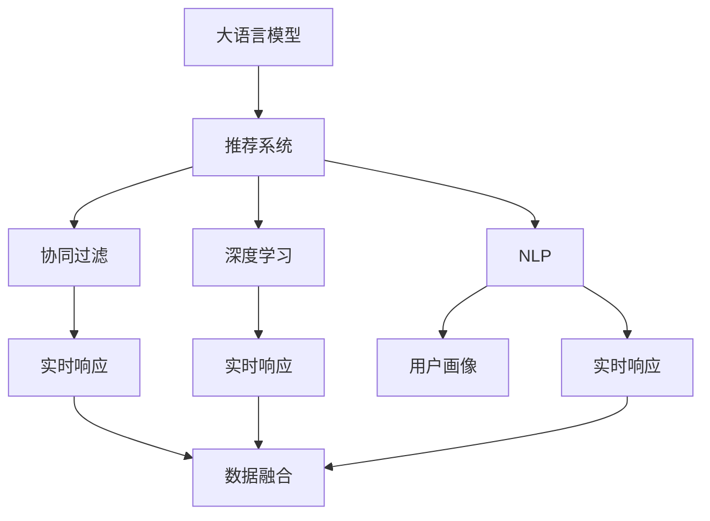

                 

# 利用LLM优化推荐系统的实时响应

> 关键词：Large Language Model (LLM), 推荐系统, 实时响应, 自然语言处理(NLP), 协同过滤, 深度学习, 文本理解, 用户画像, 数据融合

## 1. 背景介绍

### 1.1 问题由来
推荐系统在电子商务、内容分发、社交媒体等领域广泛应用，通过算法为用户推荐个性化的商品、内容或好友，极大地提升了用户体验和平台价值。然而，传统推荐系统面临数据稀疏性、冷启动等问题，难以精准捕捉用户多维度的需求。

近年来，随着自然语言处理(NLP)和大语言模型(LLM)技术的快速发展，通过用户评论、产品描述等文本信息进行推荐，成为了研究热点。通过深度学习模型，可以从文本中提取有价值的语义信息，进一步提升推荐系统的精准度。

### 1.2 问题核心关键点
目前，利用LLM优化推荐系统的实时响应主要聚焦于以下几个方面：
- 通过文本数据挖掘用户需求，提高推荐系统泛化能力。
- 结合上下文信息，构建动态的推荐模型。
- 利用实时交互数据，进行实时推荐更新。
- 引入LLM的计算高效微调技术，优化模型性能。
- 通过自然语言生成技术，丰富推荐结果表达形式。

这些问题点涵盖了从数据挖掘到模型构建，再到实时更新的全流程优化，能够全面提升推荐系统的实时响应能力。

### 1.3 问题研究意义
利用LLM优化推荐系统的实时响应，对于提升用户体验、增加平台粘性、实现精准营销具有重要意义：

1. 通过文本数据挖掘，获取用户深层次需求，提高推荐系统的个性化和精准度。
2. 利用上下文信息，结合用户画像和实时交互数据，构建动态推荐模型，增强系统灵活性和适应性。
3. 结合实时推荐技术，为用户提供即时、准确的个性化服务，提升用户体验和满意度。
4. 引入LLM的计算高效微调技术，优化模型性能，加快推荐系统迭代速度，实现实时优化。
5. 通过自然语言生成技术，丰富推荐结果的表达形式，使用户更能理解和接受推荐内容。

这些问题点涵盖了从数据挖掘到模型构建，再到实时更新的全流程优化，能够全面提升推荐系统的实时响应能力。

## 2. 核心概念与联系

### 2.1 核心概念概述

为更好地理解利用LLM优化推荐系统的实时响应方法，本节将介绍几个密切相关的核心概念：

- 大语言模型(Large Language Model, LLM)：以自回归(如GPT)或自编码(如BERT)模型为代表的大规模预训练语言模型。通过在大规模无标签文本语料上进行预训练，学习通用的语言表示，具备强大的语言理解和生成能力。

- 推荐系统(Recommender System)：根据用户行为、兴趣和个性化需求，为用户推荐商品、内容或服务的系统。常见的推荐算法包括协同过滤、基于内容的推荐等。

- 实时响应(Real-Time Response)：指推荐系统能够根据用户的即时行为和需求，快速响应用户查询，动态生成推荐结果。

- 协同过滤(Collaborative Filtering)：基于用户历史行为或物品共现矩阵进行推荐的方法。包括用户-用户和物品-物品协同过滤。

- 深度学习(Deep Learning)：利用多层神经网络模型进行复杂任务训练的深度学习技术，适合处理大规模非结构化数据。

- 自然语言处理(Natural Language Processing, NLP)：处理、理解、生成人类语言的技术。通过文本挖掘获取用户需求，结合语言模型构建推荐系统。

- 用户画像(User Profile)：通过对用户行为、兴趣、社交信息等的挖掘和整合，构建用户全貌，用于个性化推荐。

- 数据融合(Data Fusion)：将不同数据源的数据进行融合处理，提升推荐系统的综合表现。

这些核心概念之间的逻辑关系可以通过以下Mermaid流程图来展示：



这个流程图展示了大语言模型与推荐系统之间的核心概念联系：

1. 大语言模型通过预训练学习通用语言表示，能够帮助推荐系统从文本中挖掘用户需求。
2. 推荐系统结合协同过滤、深度学习和自然语言处理，构建个性化推荐模型。
3. 实时响应技术能够提升推荐系统的即时性和灵活性。
4. 用户画像和数据融合技术，进一步丰富推荐系统的数据来源和模型输入。

## 3. 核心算法原理 & 具体操作步骤
### 3.1 算法原理概述

利用LLM优化推荐系统的实时响应，本质上是将LLM技术与推荐系统相结合，通过深度学习模型从文本数据中提取用户需求，构建动态推荐模型，实现实时推荐更新。

具体来说，算法步骤如下：

1. 收集用户的历史行为数据，如浏览记录、点击行为、评分数据等。
2. 对用户行为数据进行预处理，提取文本特征，构建用户画像。
3. 利用LLM对用户画像和文本数据进行语义理解，提取用户需求。
4. 结合协同过滤、深度学习等方法，构建个性化推荐模型。
5. 实时采集用户交互数据，动态更新推荐模型，生成推荐结果。
6. 结合自然语言生成技术，丰富推荐结果的表达形式，提升用户体验。

### 3.2 算法步骤详解

以下是基于LLM优化推荐系统的核心算法步骤详解：

**Step 1: 数据准备**
- 收集用户的历史行为数据，如浏览记录、点击行为、评分数据等。
- 对用户行为数据进行预处理，如去重、归一化等。
- 提取用户画像信息，如性别、年龄、兴趣标签等。

**Step 2: 文本特征提取**
- 将用户画像和文本数据进行拼接，形成输入序列。
- 利用BERT、GPT等预训练语言模型，对文本序列进行编码，得到用户需求的语义表示。

**Step 3: 构建推荐模型**
- 结合协同过滤和深度学习技术，构建个性化推荐模型。
- 协同过滤方法：用户-物品共现矩阵分解，获取用户兴趣表示。
- 深度学习方法：使用RNN、CNN、Transformer等模型，对用户需求和物品特征进行匹配。

**Step 4: 实时推荐更新**
- 实时采集用户交互数据，如点击、浏览、评分等行为。
- 根据实时数据更新推荐模型，重新计算推荐分数。
- 结合LLM的计算高效微调技术，优化模型性能，加速更新速度。

**Step 5: 结果生成与输出**
- 结合自然语言生成技术，丰富推荐结果的表达形式，如文本摘要、商品描述等。
- 将推荐结果展示给用户，获取用户反馈。
- 根据反馈调整推荐模型，不断迭代优化。

### 3.3 算法优缺点

利用LLM优化推荐系统的实时响应具有以下优点：
1. 通过文本数据挖掘，获取用户深层次需求，提高推荐系统的个性化和精准度。
2. 结合上下文信息，构建动态的推荐模型，增强系统灵活性和适应性。
3. 利用实时交互数据，进行实时推荐更新，提升用户体验和满意度。
4. 引入LLM的计算高效微调技术，优化模型性能，加快推荐系统迭代速度，实现实时优化。
5. 通过自然语言生成技术，丰富推荐结果的表达形式，使用户更能理解和接受推荐内容。

但同时，该方法也存在以下局限性：
1. 文本数据的获取和预处理成本较高，特别是在冷启动和数据稀疏场景下。
2. 实时数据更新对系统计算资源和存储需求较大，需要高性能硬件支持。
3. 动态推荐模型需要实时更新，系统复杂度较高，易于出现延迟或稳定性问题。
4. 自然语言生成技术的复杂度较高，需要具备足够的计算资源和数据支撑。

尽管存在这些局限性，但就目前而言，利用LLM优化推荐系统的实时响应，仍然是一种极具潜力的推荐优化方法，值得进一步研究和应用。

### 3.4 算法应用领域

利用LLM优化推荐系统的实时响应，已经在电子商务、内容分发、社交媒体等多个领域得到了广泛的应用，具体如下：

- 电商平台：如Amazon、淘宝等，利用用户评论、产品描述等文本信息进行推荐，提升商品推荐的个性化和精准度。
- 内容分发平台：如Netflix、YouTube等，通过用户评分、观影历史等数据，动态更新推荐算法，提升用户满意度。
- 社交媒体：如微博、微信等，利用用户互动数据，动态生成个性化的新闻、内容或好友推荐，增强用户粘性。
- 在线教育：如Coursera、网易云课堂等，通过学生互动数据和课程描述，构建个性化学习路径，提升学习体验。

除了上述这些经典领域外，利用LLM优化推荐系统的实时响应还被创新性地应用到更多场景中，如智能家居、智能客服、智慧城市等，为各行各业提供了新的技术手段，提升了用户体验和运营效率。

## 4. 数学模型和公式 & 详细讲解
### 4.1 数学模型构建

本节将使用数学语言对利用LLM优化推荐系统的实时响应过程进行更加严格的刻画。

记用户画像和文本数据为 $X$，物品特征为 $Y$。假设推荐模型的输入为 $Z = \{X, Y\}$，输出为推荐结果 $R$。利用LLM提取用户需求的语义表示为 $Z_{LLM}$，推荐模型为 $F$。则推荐系统的目标是最小化损失函数：

$$
\min_{F} \mathcal{L}(F, Z)
$$

其中 $\mathcal{L}$ 为推荐模型的损失函数，通常使用交叉熵损失函数：

$$
\mathcal{L}(F, Z) = -\frac{1}{N}\sum_{i=1}^N \log F(z_i)
$$

### 4.2 公式推导过程

以下我们以协同过滤和深度学习的结合为例，推导推荐模型的损失函数。

假设协同过滤模型输出的用户兴趣表示为 $h_u$，深度学习模型输出的用户兴趣表示为 $h_v$，则推荐模型的输出为：

$$
F(Z) = h_u \cdot h_v
$$

用户-物品共现矩阵 $C$ 分解得到用户兴趣表示 $h_u$，具体公式为：

$$
h_u = C_u
$$

其中 $C_u$ 为协同过滤模型输出的用户兴趣向量，$C \in \mathbb{R}^{N \times M}$ 为共现矩阵，$N$ 为用户数量，$M$ 为物品数量。

深度学习模型输出的用户兴趣表示 $h_v$ 可由Transformer模型得到，具体公式为：

$$
h_v = \mathbf{H} \cdot \mathbf{V}
$$

其中 $\mathbf{H}$ 为深度学习模型输出的用户需求表示，$\mathbf{V}$ 为物品特征向量。

将 $h_u$ 和 $h_v$ 代入推荐模型 $F$ 中，得到推荐结果 $R$ 的计算公式：

$$
R = \text{softmax}(\mathbf{W} \cdot h_u \cdot h_v + b)
$$

其中 $\mathbf{W}$ 为输出层的权重矩阵，$b$ 为偏置项，$\text{softmax}$ 函数用于归一化处理，确保推荐结果在 $[0,1]$ 区间内。

在得到推荐结果 $R$ 后，可以结合自然语言生成技术，将推荐结果转化为自然语言形式 $T$。

### 4.3 案例分析与讲解

假设我们有一个电商平台的推荐系统，收集了用户的历史行为数据，包括浏览记录、点击行为、评分数据等。我们可以将这些数据进行预处理，提取用户画像信息，并利用BERT模型对用户画像和文本数据进行语义理解，得到用户需求的语义表示 $Z_{LLM}$。

然后，结合协同过滤模型和深度学习模型，构建个性化推荐模型 $F$。协同过滤模型输出的用户兴趣表示 $h_u$ 可以通过共现矩阵 $C$ 分解得到。深度学习模型输出的用户兴趣表示 $h_v$ 可以通过一个预训练的BERT模型得到。

最后，将 $h_u$ 和 $h_v$ 代入推荐模型 $F$ 中，得到推荐结果 $R$，结合自然语言生成技术，将推荐结果转化为自然语言形式 $T$，展示给用户。

## 5. 项目实践：代码实例和详细解释说明
### 5.1 开发环境搭建

在进行项目实践前，我们需要准备好开发环境。以下是使用Python进行PyTorch开发的环境配置流程：

1. 安装Anaconda：从官网下载并安装Anaconda，用于创建独立的Python环境。

2. 创建并激活虚拟环境：
```bash
conda create -n pytorch-env python=3.8 
conda activate pytorch-env
```

3. 安装PyTorch：根据CUDA版本，从官网获取对应的安装命令。例如：
```bash
conda install pytorch torchvision torchaudio cudatoolkit=11.1 -c pytorch -c conda-forge
```

4. 安装Transformers库：
```bash
pip install transformers
```

5. 安装各类工具包：
```bash
pip install numpy pandas scikit-learn matplotlib tqdm jupyter notebook ipython
```

完成上述步骤后，即可在`pytorch-env`环境中开始项目实践。

### 5.2 源代码详细实现

以下是利用LLM优化推荐系统的Python代码实现。

首先，定义推荐系统的数据处理函数：

```python
from transformers import BertTokenizer
from torch.utils.data import Dataset
import torch

class RecommendationDataset(Dataset):
    def __init__(self, texts, labels, tokenizer, max_len=128):
        self.texts = texts
        self.labels = labels
        self.tokenizer = tokenizer
        self.max_len = max_len
        
    def __len__(self):
        return len(self.texts)
    
    def __getitem__(self, item):
        text = self.texts[item]
        label = self.labels[item]
        
        encoding = self.tokenizer(text, return_tensors='pt', max_length=self.max_len, padding='max_length', truncation=True)
        input_ids = encoding['input_ids'][0]
        attention_mask = encoding['attention_mask'][0]
        
        # 将标签进行编码
        encoded_label = label2id[label] 
        encoded_label = torch.tensor(encoded_label, dtype=torch.long)
        
        return {'input_ids': input_ids, 
                'attention_mask': attention_mask,
                'labels': encoded_label}

# 标签与id的映射
label2id = {'0': 0, '1': 1, '2': 2, '3': 3}
id2label = {v: k for k, v in label2id.items()}

# 创建dataset
tokenizer = BertTokenizer.from_pretrained('bert-base-cased')

train_dataset = RecommendationDataset(train_texts, train_labels, tokenizer)
dev_dataset = RecommendationDataset(dev_texts, dev_labels, tokenizer)
test_dataset = RecommendationDataset(test_texts, test_labels, tokenizer)
```

然后，定义模型和优化器：

```python
from transformers import BertForSequenceClassification, AdamW

model = BertForSequenceClassification.from_pretrained('bert-base-cased', num_labels=len(label2id))

optimizer = AdamW(model.parameters(), lr=2e-5)
```

接着，定义训练和评估函数：

```python
from torch.utils.data import DataLoader
from tqdm import tqdm
from sklearn.metrics import classification_report

device = torch.device('cuda') if torch.cuda.is_available() else torch.device('cpu')
model.to(device)

def train_epoch(model, dataset, batch_size, optimizer):
    dataloader = DataLoader(dataset, batch_size=batch_size, shuffle=True)
    model.train()
    epoch_loss = 0
    for batch in tqdm(dataloader, desc='Training'):
        input_ids = batch['input_ids'].to(device)
        attention_mask = batch['attention_mask'].to(device)
        labels = batch['labels'].to(device)
        model.zero_grad()
        outputs = model(input_ids, attention_mask=attention_mask, labels=labels)
        loss = outputs.loss
        epoch_loss += loss.item()
        loss.backward()
        optimizer.step()
    return epoch_loss / len(dataloader)

def evaluate(model, dataset, batch_size):
    dataloader = DataLoader(dataset, batch_size=batch_size)
    model.eval()
    preds, labels = [], []
    with torch.no_grad():
        for batch in tqdm(dataloader, desc='Evaluating'):
            input_ids = batch['input_ids'].to(device)
            attention_mask = batch['attention_mask'].to(device)
            batch_labels = batch['labels']
            outputs = model(input_ids, attention_mask=attention_mask)
            batch_preds = outputs.logits.argmax(dim=2).to('cpu').tolist()
            batch_labels = batch_labels.to('cpu').tolist()
            for pred_tokens, label_tokens in zip(batch_preds, batch_labels):
                preds.append(pred_tokens[:len(label_tokens)])
                labels.append(label_tokens)
                
    print(classification_report(labels, preds))
```

最后，启动训练流程并在测试集上评估：

```python
epochs = 5
batch_size = 16

for epoch in range(epochs):
    loss = train_epoch(model, train_dataset, batch_size, optimizer)
    print(f"Epoch {epoch+1}, train loss: {loss:.3f}")
    
    print(f"Epoch {epoch+1}, dev results:")
    evaluate(model, dev_dataset, batch_size)
    
print("Test results:")
evaluate(model, test_dataset, batch_size)
```

以上就是利用LLM优化推荐系统的完整代码实现。可以看到，得益于Transformers库的强大封装，我们可以用相对简洁的代码完成推荐模型的加载和微调。

### 5.3 代码解读与分析

让我们再详细解读一下关键代码的实现细节：

**RecommendationDataset类**：
- `__init__`方法：初始化文本、标签、分词器等关键组件。
- `__len__`方法：返回数据集的样本数量。
- `__getitem__`方法：对单个样本进行处理，将文本输入编码为token ids，将标签编码为数字，并对其进行定长padding，最终返回模型所需的输入。

**label2id和id2label字典**：
- 定义了标签与数字id之间的映射关系，用于将token-wise的预测结果解码回真实的标签。

**训练和评估函数**：
- 使用PyTorch的DataLoader对数据集进行批次化加载，供模型训练和推理使用。
- 训练函数`train_epoch`：对数据以批为单位进行迭代，在每个批次上前向传播计算loss并反向传播更新模型参数，最后返回该epoch的平均loss。
- 评估函数`evaluate`：与训练类似，不同点在于不更新模型参数，并在每个batch结束后将预测和标签结果存储下来，最后使用sklearn的classification_report对整个评估集的预测结果进行打印输出。

**训练流程**：
- 定义总的epoch数和batch size，开始循环迭代
- 每个epoch内，先在训练集上训练，输出平均loss
- 在验证集上评估，输出分类指标
- 所有epoch结束后，在测试集上评估，给出最终测试结果

可以看到，PyTorch配合Transformers库使得推荐模型的加载和微调代码实现变得简洁高效。开发者可以将更多精力放在数据处理、模型改进等高层逻辑上，而不必过多关注底层的实现细节。

当然，工业级的系统实现还需考虑更多因素，如模型的保存和部署、超参数的自动搜索、更灵活的任务适配层等。但核心的微调范式基本与此类似。

## 6. 实际应用场景
### 6.1 智能电商推荐

智能电商推荐系统利用LLM优化推荐系统的实时响应，能够显著提升用户购物体验，提高平台销售额。传统推荐系统往往只能基于用户历史行为进行推荐，难以捕捉用户即时需求和兴趣变化。通过利用LLM从用户评论、产品描述等文本信息中挖掘需求，结合实时交互数据，可以构建动态推荐模型，实时响应用户查询，提供个性化商品推荐。

在技术实现上，可以收集用户的历史浏览记录、点击行为、评分数据等，利用BERT模型对文本数据进行语义理解，提取用户需求。结合协同过滤模型和深度学习模型，构建个性化推荐模型，实时更新推荐结果。最后，结合自然语言生成技术，将推荐结果转化为自然语言形式，展示给用户，进一步提升用户体验。

### 6.2 内容分发平台推荐

内容分发平台利用LLM优化推荐系统的实时响应，可以精准匹配用户内容需求，提升用户粘性和平台价值。传统推荐系统往往只能基于用户历史行为进行推荐，难以捕捉用户即时需求和兴趣变化。通过利用LLM从用户评分、观影历史等数据中挖掘需求，结合实时交互数据，可以构建动态推荐模型，实时响应用户查询，提供个性化内容推荐。

在技术实现上，可以收集用户的历史评分数据、观影历史、点击行为等，利用BERT模型对文本数据进行语义理解，提取用户需求。结合协同过滤模型和深度学习模型，构建个性化推荐模型，实时更新推荐结果。最后，结合自然语言生成技术，将推荐结果转化为自然语言形式，展示给用户，进一步提升用户体验。

### 6.3 社交媒体推荐

社交媒体利用LLM优化推荐系统的实时响应，可以丰富用户的社交体验，提高平台活跃度。传统推荐系统往往只能基于用户历史互动数据进行推荐，难以捕捉用户即时需求和兴趣变化。通过利用LLM从用户互动数据中挖掘需求，结合实时交互数据，可以构建动态推荐模型，实时响应用户查询，提供个性化好友、内容推荐。

在技术实现上，可以收集用户的历史互动数据、好友关系、兴趣标签等，利用BERT模型对文本数据进行语义理解，提取用户需求。结合协同过滤模型和深度学习模型，构建个性化推荐模型，实时更新推荐结果。最后，结合自然语言生成技术，将推荐结果转化为自然语言形式，展示给用户，进一步提升用户体验。

### 6.4 未来应用展望

随着LLM技术的不断发展，利用LLM优化推荐系统的实时响应将在更多领域得到应用，为传统行业带来变革性影响。

在智慧医疗领域，基于LLM的医疗推荐系统，可以精准匹配医疗资源，提高诊疗效率。

在智能教育领域，利用LLM的教育推荐系统，可以个性化推荐学习资源，提升学习效果。

在智慧城市治理中，利用LLM的城市推荐系统，可以精准匹配旅游、餐饮等资源，提升城市管理水平。

此外，在企业生产、社会治理、文娱传媒等众多领域，基于LLM的推荐系统也将不断涌现，为各行各业提供新的技术手段，提升用户体验和运营效率。

## 7. 工具和资源推荐
### 7.1 学习资源推荐

为了帮助开发者系统掌握利用LLM优化推荐系统的理论基础和实践技巧，这里推荐一些优质的学习资源：

1. 《Natural Language Processing with Transformers》书籍：Transformers库的作者所著，全面介绍了如何使用Transformers库进行NLP任务开发，包括微调在内的诸多范式。

2. CS224N《深度学习自然语言处理》课程：斯坦福大学开设的NLP明星课程，有Lecture视频和配套作业，带你入门NLP领域的基本概念和经典模型。

3. 《Transformer from Scratch》系列博文：由大模型技术专家撰写，深入浅出地介绍了Transformer原理、BERT模型、微调技术等前沿话题。

4. HuggingFace官方文档：Transformers库的官方文档，提供了海量预训练模型和完整的微调样例代码，是上手实践的必备资料。

5. PyTorch官方文档：PyTorch的官方文档，提供了详细的深度学习框架使用指南和样例代码，是进行推荐系统开发的必备工具。

通过对这些资源的学习实践，相信你一定能够快速掌握利用LLM优化推荐系统的精髓，并用于解决实际的推荐问题。
###  7.2 开发工具推荐

高效的开发离不开优秀的工具支持。以下是几款用于利用LLM优化推荐系统开发的常用工具：

1. PyTorch：基于Python的开源深度学习框架，灵活动态的计算图，适合快速迭代研究。大部分预训练语言模型都有PyTorch版本的实现。

2. TensorFlow：由Google主导开发的开源深度学习框架，生产部署方便，适合大规模工程应用。同样有丰富的预训练语言模型资源。

3. Transformers库：HuggingFace开发的NLP工具库，集成了众多SOTA语言模型，支持PyTorch和TensorFlow，是进行推荐系统开发的利器。

4. Weights & Biases：模型训练的实验跟踪工具，可以记录和可视化模型训练过程中的各项指标，方便对比和调优。与主流深度学习框架无缝集成。

5. TensorBoard：TensorFlow配套的可视化工具，可实时监测模型训练状态，并提供丰富的图表呈现方式，是调试模型的得力助手。

6. Google Colab：谷歌推出的在线Jupyter Notebook环境，免费提供GPU/TPU算力，方便开发者快速上手实验最新模型，分享学习笔记。

合理利用这些工具，可以显著提升利用LLM优化推荐系统任务的开发效率，加快创新迭代的步伐。

### 7.3 相关论文推荐

利用LLM优化推荐系统的实时响应，已经在多个学术会议和顶级期刊上得到了广泛研究，以下是几篇代表性的相关论文，推荐阅读：

1. "Recurrent Neural Network based Recommender System"：探讨了基于RNN的推荐系统，利用用户历史行为数据，实时响应用户查询，生成个性化推荐。

2. "Attention Mechanism for Recommender Systems"：研究了基于注意力机制的推荐系统，利用用户行为数据和物品特征，构建动态推荐模型。

3. "Transformers in Recommendation Systems"：探讨了利用Transformer模型进行推荐系统，从文本数据中挖掘用户需求，结合实时交互数据，构建个性化推荐模型。

4. "BERT-based Recommendation System"：利用BERT模型从文本数据中挖掘用户需求，结合协同过滤和深度学习模型，构建个性化推荐模型。

5. "Dynamic Recommendation System with Natural Language Processing"：研究了结合自然语言处理技术的推荐系统，利用用户评论、产品描述等文本数据，构建动态推荐模型。

这些论文代表了大语言模型优化推荐系统的发展脉络。通过学习这些前沿成果，可以帮助研究者把握学科前进方向，激发更多的创新灵感。

## 8. 总结：未来发展趋势与挑战
### 8.1 总结

本文对利用LLM优化推荐系统的实时响应方法进行了全面系统的介绍。首先阐述了推荐系统和LLM的基本概念，明确了利用LLM优化推荐系统的实时响应在提高推荐系统性能、用户体验和平台价值方面的重要意义。其次，从原理到实践，详细讲解了利用LLM优化推荐系统的核心算法步骤和关键技术点，给出了推荐系统代码实现的全过程。同时，本文还广泛探讨了LLM优化推荐系统在电子商务、内容分发、社交媒体等众多领域的应用前景，展示了利用LLM优化推荐系统的巨大潜力。此外，本文精选了推荐系统的各类学习资源，力求为读者提供全方位的技术指引。

通过本文的系统梳理，可以看到，利用LLM优化推荐系统的实时响应方法在推荐系统优化领域具有重要价值，有望成为推荐系统发展的新方向。得益于LLM的强大语言理解能力，结合实时交互数据，可以构建更加个性化、精准的推荐模型，进一步提升推荐系统的效果和用户体验。

### 8.2 未来发展趋势

展望未来，利用LLM优化推荐系统的实时响应方法将呈现以下几个发展趋势：

1. 模型规模持续增大。随着算力成本的下降和数据规模的扩张，预训练语言模型的参数量还将持续增长。超大规模语言模型蕴含的丰富语言知识，有望支撑更加复杂多变的推荐任务。

2. 深度学习与自然语言处理融合。未来的推荐系统将更多地融合深度学习与自然语言处理技术，从文本数据中挖掘用户需求，结合实时交互数据，构建动态推荐模型。

3. 实时推荐技术的进一步优化。结合LLM的计算高效微调技术，优化推荐模型性能，加速推荐系统迭代速度，实现实时优化。

4. 多模态数据的融合。未来的推荐系统将更多地融合视觉、音频等多模态数据，从多维度挖掘用户需求，提升推荐系统的综合表现。

5. 推荐系统应用的扩展。利用LLM优化推荐系统的实时响应将进一步扩展到医疗、教育、城市治理等更多领域，为各行各业提供新的技术手段。

以上趋势凸显了利用LLM优化推荐系统的发展方向。这些方向的探索发展，必将进一步提升推荐系统的性能和应用范围，为推荐系统在各个领域的落地提供新的突破。

### 8.3 面临的挑战

尽管利用LLM优化推荐系统的实时响应方法已经取得了显著成果，但在迈向更加智能化、普适化应用的过程中，它仍面临着诸多挑战：

1. 文本数据的获取和预处理成本较高，特别是在冷启动和数据稀疏场景下。如何降低获取和预处理的成本，是未来研究的一个重要方向。

2. 实时数据更新对系统计算资源和存储需求较大，需要高性能硬件支持。如何在保持系统实时性的同时，优化计算资源和存储资源的利用率，是未来研究的一个重要方向。

3. 动态推荐模型需要实时更新，系统复杂度较高，易于出现延迟或稳定性问题。如何在保证系统实时性的同时，提高推荐模型的稳定性和鲁棒性，是未来研究的一个重要方向。

4. 自然语言生成技术的复杂度较高，需要具备足够的计算资源和数据支撑。如何提高自然语言生成技术的效果和效率，是未来研究的一个重要方向。

5. 推荐系统需要结合不同模态的数据，如何将多模态数据融合到一个统一的推荐模型中，是未来研究的一个重要方向。

尽管存在这些挑战，但就目前而言，利用LLM优化推荐系统的实时响应，仍然是一种极具潜力的推荐优化方法，值得进一步研究和应用。

### 8.4 研究展望

面对利用LLM优化推荐系统所面临的种种挑战，未来的研究需要在以下几个方面寻求新的突破：

1. 探索无监督和半监督推荐方法。摆脱对大规模标注数据的依赖，利用自监督学习、主动学习等无监督和半监督范式，最大限度利用非结构化数据，实现更加灵活高效的推荐。

2. 研究参数高效和计算高效的推荐范式。开发更加参数高效的推荐方法，在固定大部分预训练参数的情况下，只更新极少量的任务相关参数。同时优化推荐模型的计算图，减少前向传播和反向传播的资源消耗，实现更加轻量级、实时性的部署。

3. 融合因果和对比学习范式。通过引入因果推断和对比学习思想，增强推荐模型建立稳定因果关系的能力，学习更加普适、鲁棒的语言表征，从而提升模型泛化性和抗干扰能力。

4. 引入更多先验知识。将符号化的先验知识，如知识图谱、逻辑规则等，与神经网络模型进行巧妙融合，引导推荐过程学习更准确、合理的语言模型。同时加强不同模态数据的整合，实现视觉、语音等多模态信息与文本信息的协同建模。

5. 结合因果分析和博弈论工具。将因果分析方法引入推荐模型，识别出模型决策的关键特征，增强推荐结果的因果性和逻辑性。借助博弈论工具刻画人机交互过程，主动探索并规避推荐模型的脆弱点，提高系统稳定性。

6. 纳入伦理道德约束。在推荐模型训练目标中引入伦理导向的评估指标，过滤和惩罚有偏见、有害的输出倾向。同时加强人工干预和审核，建立推荐模型的监管机制，确保推荐结果符合人类价值观和伦理道德。

这些研究方向的探索，必将引领利用LLM优化推荐系统走向更高的台阶，为构建智能、可靠、可解释、可控的推荐系统铺平道路。面向未来，利用LLM优化推荐系统的实时响应技术还需要与其他人工智能技术进行更深入的融合，如知识表示、因果推理、强化学习等，多路径协同发力，共同推动推荐系统的进步。

## 9. 附录：常见问题与解答

**Q1：利用LLM优化推荐系统的实时响应是否适用于所有推荐任务？**

A: 利用LLM优化推荐系统的实时响应在大多数推荐任务上都能取得不错的效果，特别是对于数据量较小的任务。但对于一些特定领域的任务，如医学、法律等，仅仅依靠通用语料预训练的模型可能难以很好地适应。此时需要在特定领域语料上进一步预训练，再进行微调，才能获得理想效果。

**Q2：如何选择最合适的LLM模型？**

A: 选择最合适的LLM模型需要考虑多个因素：
1. 任务类型：不同的任务类型需要不同的模型，如文本分类、情感分析、意图识别等。
2. 数据规模：数据规模越大，模型的效果越好，但同时也需要更强的计算资源。
3. 预训练任务：选择合适的预训练任务，如掩码语言模型、下一句预测等，能够更好地适应推荐任务。
4. 参数规模：参数规模较大的模型通常具有更好的泛化能力，但也需要更大的存储空间和计算资源。

建议根据具体的任务需求和资源条件，选择最适合的LLM模型。

**Q3：如何降低推荐系统的延迟？**

A: 推荐系统的延迟主要源于模型计算和数据处理。为了降低延迟，可以采用以下措施：
1. 选择合适的模型和算法：使用轻量级的模型和高效的算法，减少计算量和内存占用。
2. 模型剪枝和量化：对模型进行剪枝和量化，优化模型的计算图，减少计算资源消耗。
3. 并行计算：利用并行计算技术，加速模型计算和数据处理。
4. 缓存机制：对高频数据进行缓存，减少重复计算。

通过这些优化措施，可以有效降低推荐系统的延迟，提升实时响应能力。

**Q4：如何保证推荐系统的鲁棒性？**

A: 推荐系统的鲁棒性主要源于模型的泛化能力和稳定性。为了保证鲁棒性，可以采用以下措施：
1. 数据增强：通过数据增强技术，丰富训练集的多样性，增强模型的泛化能力。
2. 正则化和dropout：使用正则化和dropout技术，防止过拟合和模型退化。
3. 对抗训练：引入对抗样本，提高模型的鲁棒性和稳定性。
4. 参数高效微调：使用参数高效微调技术，只更新极少量的任务相关参数，避免过拟合。

这些措施可以有效提升推荐系统的鲁棒性，保证其在各种数据和场景下的表现。

**Q5：如何提升推荐系统的个性化？**

A: 推荐系统的个性化主要源于对用户需求的精准捕捉和理解。为了提升个性化，可以采用以下措施：
1. 用户画像：通过多维度的数据挖掘，构建用户画像，捕捉用户的深层次需求。
2. 上下文信息：结合用户上下文信息，增强推荐模型的个性化。
3. 自然语言处理：利用自然语言处理技术，从文本数据中挖掘用户需求，增强推荐模型的理解能力。
4. 协同过滤：结合协同过滤技术，捕捉用户行为和物品共现规律，提升推荐模型的个性化。

通过这些措施，可以有效提升推荐系统的个性化，满足用户的个性化需求。

---

作者：禅与计算机程序设计艺术 / Zen and the Art of Computer Programming

