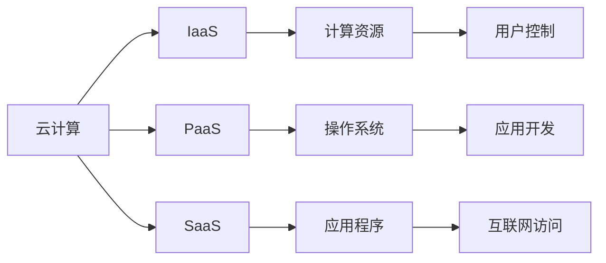

                 

# 利用云计算实现创业自动化

## 1. 背景介绍

### 1.1 问题由来

在快速变化的商业环境中，创业公司面临着前所未有的挑战。它们需要快速部署应用程序，管理数据，并且保持灵活性以应对市场变化。云计算提供了解决方案，使其可以轻松地构建、扩展和管理应用程序，而无需担心基础设施管理。通过云计算，创业公司可以迅速将想法转化为现实，从而在竞争激烈的市场中占据优势。

## 2. 核心概念与联系

### 2.1 核心概念概述

- **云计算(Cloud Computing)**：基于互联网的计算方式，用户通过网络使用各种计算资源和服务，无需担心硬件和软件维护。
- **创业自动化(Automated Startup)**：使用自动化工具和平台来管理企业的各种运营活动，包括财务、人力资源、市场营销等，以提高效率、降低成本。
- **IaaS(基础设施即服务)**：云服务提供商提供计算、存储和网络基础设施，由用户管理和控制。
- **PaaS(平台即服务)**：云服务提供商提供平台，如操作系统、数据库和编程框架，用户只需关注应用程序的开发。
- **SaaS(软件即服务)**：云服务提供商提供软件应用程序，用户只需通过互联网访问。

这些概念之间存在密切联系。云计算为创业公司提供了基础设施，而创业自动化则使公司能够高效地使用这些基础设施。IaaS、PaaS和SaaS作为云计算的三个主要类别，提供了不同的服务级别和灵活性。

### 2.2 核心概念原理和架构的 Mermaid 流程图



这个流程图展示了云计算、IaaS、PaaS和SaaS之间的联系。用户可以通过云计算获取基础设施、平台或软件，而控制权则根据不同的服务级别有所不同。

## 3. 核心算法原理 & 具体操作步骤

### 3.1 算法原理概述

基于云计算的创业自动化，其核心原理是通过将企业的各种运营活动自动化，提高效率、降低成本。以下是基本算法原理：

1. **识别关键运营活动**：首先，需要识别企业的关键运营活动，例如销售、客户服务、财务、人力资源等。
2. **选择云服务**：根据每个活动的性质和需求，选择合适的云计算服务（IaaS、PaaS或SaaS）。
3. **自动化流程**：使用自动化工具和平台，实现这些关键运营活动的自动化。
4. **监控和优化**：持续监控自动化流程的表现，并根据反馈进行优化。

### 3.2 算法步骤详解

#### 3.2.1 识别关键运营活动

- **销售**：客户获取、销售渠道、订单处理等。
- **客户服务**：客户支持、投诉处理、客户关系管理等。
- **财务**：账簿管理、发票处理、财务管理等。
- **人力资源**：招聘、员工管理、培训等。
- **市场营销**：广告投放、社交媒体管理、内容创作等。

#### 3.2.2 选择云服务

- **IaaS**：适用于需要控制基础设施和资源的运营活动。例如，可以使用AWS的EC2进行实例部署。
- **PaaS**：适用于需要快速部署和扩展的应用程序。例如，可以使用Heroku进行Web应用的部署和扩展。
- **SaaS**：适用于需要易于访问和使用的软件应用。例如，可以使用Salesforce进行客户关系管理。

#### 3.2.3 自动化流程

- **销售自动化**：使用CRM系统（如Salesforce）管理客户关系，使用自动化营销工具（如HubSpot）进行潜在客户生成。
- **客户服务自动化**：使用聊天机器人（如Zendesk）处理常见问题，使用自动化流程（如Trello）管理客户支持。
- **财务自动化**：使用会计软件（如QuickBooks）自动化财务处理，使用自动化报告工具（如Tableau）生成财务报告。
- **人力资源自动化**：使用招聘平台（如LinkedIn）自动化招聘流程，使用员工管理软件（如Payroll）管理工资和福利。
- **市场营销自动化**：使用广告管理平台（如Google Ads）自动化广告投放，使用社交媒体管理工具（如Hootsuite）管理社交媒体账号。

#### 3.2.4 监控和优化

- **关键绩效指标(KPIs)**：设置关键绩效指标（如客户满意度、销售转化率、客户获取成本等）进行监控。
- **数据分析**：使用数据分析工具（如Google Analytics）分析自动化流程的效果。
- **持续改进**：根据数据分析结果，不断调整和优化自动化流程。

### 3.3 算法优缺点

#### 3.3.1 优点

- **灵活性**：使用云计算可以轻松扩展和缩减资源，适应企业需求变化。
- **成本效益**：避免高昂的硬件和软件采购和维护成本，降低运营成本。
- **快速部署**：使用云服务可以快速部署应用程序，提高市场响应速度。
- **安全性**：云服务提供商通常提供高水平的安全性措施，保护数据和应用。

#### 3.3.2 缺点

- **数据隐私**：使用云服务需要处理敏感数据，需要确保数据隐私和安全。
- **依赖性**：过度依赖云服务可能导致系统故障或中断。
- **迁移成本**：在需要更换云服务提供商时，可能需要支付迁移成本。

### 3.4 算法应用领域

- **初创公司**：快速部署应用程序、管理数据和降低成本。
- **中小企业**：需要灵活扩展和快速适应市场需求的企业。
- **科技公司**：需要快速迭代和发布新产品的公司。
- **创意产业**：需要高效协作和快速原型开发的公司。

## 4. 数学模型和公式 & 详细讲解

### 4.1 数学模型构建

云计算的创业自动化可以通过数学模型来描述。假设企业有N个关键运营活动，每个活动使用m种云计算服务。设$C_{i,j}$表示第i个活动使用第j种云服务的成本，则总成本$C_{total}$可以表示为：

$$
C_{total} = \sum_{i=1}^N \sum_{j=1}^m C_{i,j}
$$

### 4.2 公式推导过程

- **IaaS成本**：$C_{IaaS} = C_{计算资源} + C_{存储资源} + C_{网络资源}$
- **PaaS成本**：$C_{PaaS} = C_{平台许可费} + C_{服务费用}$
- **SaaS成本**：$C_{SaaS} = C_{软件许可费} + C_{使用费}$

假设每个运营活动需要计算资源R、存储资源S和网络资源N，则IaaS的成本可以表示为：

$$
C_{IaaS} = R \times P_{计算} + S \times P_{存储} + N \times P_{网络}
$$

其中$P_{计算}$、$P_{存储}$和$P_{网络}$为每个计算资源的价格。

### 4.3 案例分析与讲解

以电子商务平台为例，使用IaaS、PaaS和SaaS的成本计算如下：

- **IaaS**：使用AWS的EC2实例，计算资源为$R=1$，存储资源为$S=0.5$，网络资源为$N=1$，则IaaS的成本为：

$$
C_{IaaS} = 1 \times P_{计算} + 0.5 \times P_{存储} + 1 \times P_{网络}
$$

- **PaaS**：使用Heroku进行Web应用部署，平台许可费为$P_{许可费}$，服务费用为$P_{服务费用}$，则PaaS的成本为：

$$
C_{PaaS} = P_{许可费} + P_{服务费用}
$$

- **SaaS**：使用Salesforce进行客户关系管理，软件许可费为$P_{许可费}$，使用费为$P_{使用费}$，则SaaS的成本为：

$$
C_{SaaS} = P_{许可费} + P_{使用费}
$$

将这些成本相加，得到总成本：

$$
C_{total} = C_{IaaS} + C_{PaaS} + C_{SaaS}
$$

## 5. 项目实践：代码实例和详细解释说明

### 5.1 开发环境搭建

要实现云计算的创业自动化，需要以下开发环境：

- **操作系统**：支持Python 3.8及以上的Linux或Windows操作系统。
- **开发工具**：Python、Jupyter Notebook、Visual Studio Code、Git等。
- **云服务提供商**：AWS、Azure、Google Cloud等。

### 5.2 源代码详细实现

以下是使用Python和AWS进行销售自动化流程的示例代码：

```python
import boto3
import time

# 设置AWS访问凭证
aws_access_key = 'YOUR_ACCESS_KEY'
aws_secret_key = 'YOUR_SECRET_KEY'
region_name = 'us-west-2'

# 创建S3客户端
s3_client = boto3.client('s3', aws_access_key_id=aws_access_key, aws_secret_access_key=aws_secret_key, region_name=region_name)

# 上传销售数据到S3
bucket_name = 'sales-data-bucket'
file_name = 'sales_data.csv'
with open(file_name, 'rb') as f:
    s3_client.upload_fileobj(f, bucket_name, file_name)

# 获取销售数据
response = s3_client.list_objects_v2(Bucket=bucket_name)
data = response['Contents'][0]['Body'].read().decode('utf-8')
```

### 5.3 代码解读与分析

- **AWS访问凭证**：用于访问AWS服务的凭证，包括访问密钥和秘钥。
- **S3客户端**：使用Boto3库创建S3客户端，用于上传和下载文件。
- **上传销售数据到S3**：将销售数据上传至AWS的S3存储桶。
- **获取销售数据**：从S3存储桶中获取文件内容。

### 5.4 运行结果展示

运行以上代码，将看到销售数据成功上传并存储在AWS的S3存储桶中，并且从存储桶中获取了文件内容。

## 6. 实际应用场景

### 6.1 智能制造

智能制造公司可以使用云计算自动化流程，例如：

- **设计**：使用CAD软件进行产品设计，自动上传至云端进行版本控制和共享。
- **生产**：使用工业物联网设备采集数据，自动上传到云端进行实时监控和分析。
- **物流**：使用地理信息系统进行物流规划和优化，自动生成路线和调度。

### 6.2 电子商务

电子商务公司可以使用云计算自动化流程，例如：

- **订单管理**：使用CRM系统管理客户订单，自动生成发货单和物流跟踪信息。
- **库存管理**：使用仓库管理系统管理库存，自动更新实时库存数据。
- **市场营销**：使用广告平台进行精准投放，自动生成营销报告。

### 6.3 医疗健康

医疗健康公司可以使用云计算自动化流程，例如：

- **病历管理**：使用电子病历系统管理患者病历，自动生成报告和分析。
- **诊断支持**：使用医学影像分析工具进行图像处理，自动生成诊断结果。
- **患者服务**：使用在线咨询服务系统进行患者互动，自动生成医疗记录。

## 7. 工具和资源推荐

### 7.1 学习资源推荐

- **Udacity《云计算基础》课程**：介绍云计算基础知识和基本概念，适合初学者入门。
- **Coursera《云安全基础》课程**：讲解云安全基础和最佳实践，保障数据隐私和安全。
- **Amazon AWS文档**：详细介绍了AWS云服务的使用和配置，适合技术专家学习。

### 7.2 开发工具推荐

- **AWS Management Console**：AWS官方管理界面，用于管理和配置云服务。
- **Google Cloud Console**：Google Cloud官方管理界面，用于管理和配置云服务。
- **Azure Portal**：Azure官方管理界面，用于管理和配置云服务。

### 7.3 相关论文推荐

- **Cloud Computing: Concepts, Technology and Architecture**：一本全面介绍云计算的书籍，适合初学者和高级用户阅读。
- **Building the Data Center for the Cloud**：介绍云数据中心建设的最佳实践，保障云计算的可靠性和安全性。
- **Cloud Computing Services for Business Continuity**：讲解云服务在业务连续性中的作用，提升企业的应急响应能力。

## 8. 总结：未来发展趋势与挑战

### 8.1 总结

云计算为创业公司提供了灵活、高效和成本效益的解决方案，使得创业自动化成为可能。通过云服务提供商，企业可以轻松地构建、扩展和管理应用程序，从而在竞争激烈的市场中占据优势。基于云计算的创业自动化，为企业提供了高效运营的工具和平台，降低了运营成本，提升了市场响应速度。

### 8.2 未来发展趋势

- **多云融合**：未来企业可能使用多个云服务提供商，需要实现多云融合和无缝切换。
- **人工智能集成**：云计算将与人工智能深度融合，提供更智能化的自动化解决方案。
- **区块链技术**：使用区块链技术保障数据隐私和安全，提高企业的数据治理能力。
- **边缘计算**：在本地设备上进行数据处理，提高数据处理效率和响应速度。
- **自动化治理**：通过自动化工具和平台，实现云计算基础设施和应用的管理和优化。

### 8.3 面临的挑战

- **数据隐私和安全**：使用云计算处理敏感数据，需要确保数据隐私和安全。
- **系统复杂性**：云服务的复杂性可能导致系统故障或中断。
- **迁移成本**：在需要更换云服务提供商时，可能需要支付迁移成本。

### 8.4 研究展望

- **云服务自动化治理**：研究和开发自动化治理工具，保障云服务的高效管理和优化。
- **智能运维平台**：开发智能运维平台，实现自动监控、预警和故障排除。
- **云计算生态系统**：构建云计算生态系统，提供更多的云服务选择和整合。
- **云计算教育和培训**：提供云计算教育和培训，提升企业和个人的云计算技能。

## 9. 附录：常见问题与解答

**Q1：云计算的创业自动化是否适用于所有类型的企业？**

A：云计算的创业自动化适用于各种类型的企业，尤其是初创公司和小型企业。它能够快速部署应用程序、管理数据和降低成本，帮助企业迅速成长和扩展。

**Q2：云计算的成本是否总是低于传统IT基础设施？**

A：云计算的成本通常低于传统IT基础设施，尤其是对于需要快速扩展和缩减资源的企业。但是，需要考虑数据传输成本和本地存储成本。

**Q3：云计算的安全性如何？**

A：云计算服务提供商通常提供高水平的安全性措施，如数据加密、身份验证和访问控制等。但是，需要企业自行管理和维护安全策略，确保数据隐私和安全。

**Q4：云计算是否适合所有类型的应用？**

A：云计算适合各种类型的应用，尤其是需要弹性扩展和快速部署的应用。但是，需要根据应用的需求选择合适的云服务类型（IaaS、PaaS或SaaS）。

**Q5：云计算是否适合所有行业？**

A：云计算适合所有行业，尤其是需要高效、灵活和低成本运营的行业。但是，需要根据行业的特点和需求选择合适的云服务和解决方案。

---

作者：禅与计算机程序设计艺术 / Zen and the Art of Computer Programming

