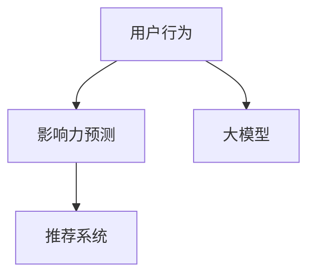
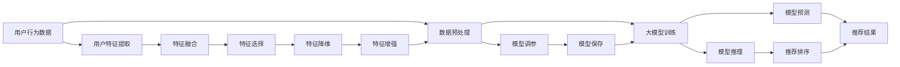

                 

# 利用大模型进行推荐场景的用户行为影响力预测

> 关键词：大模型,推荐系统,用户行为,影响力预测,推荐算法,深度学习,卷积神经网络

## 1. 背景介绍

在现代社会中，推荐系统已经成为了人们日常生活中不可或缺的一部分，无论是电商购物、社交媒体、音乐影视推荐，还是新闻内容推荐，都离不开推荐系统的作用。推荐系统通过分析用户的历史行为和兴趣偏好，为用户提供个性化的推荐内容，提升用户体验和满意度。然而，推荐系统不仅仅是一个简单的推荐过程，它还涉及到用户行为的影响力预测，即哪些用户行为对最终推荐结果的影响力更大。

在推荐系统中，用户的行为可以分为多种类型，包括点击、浏览、购买、评分等。这些行为对推荐结果的影响力各不相同，如何合理评估和量化这些行为的影响力，是推荐系统算法设计和优化的一个重要方向。大模型，如卷积神经网络(CNN)、深度神经网络(DNN)等，由于其强大的特征提取能力和泛化能力，被广泛应用在推荐系统领域，以期提升推荐的准确性和个性化程度。

## 2. 核心概念与联系

### 2.1 核心概念概述

在推荐场景中，用户行为的影响力预测主要关注以下几个核心概念：

- **用户行为**：用户对产品、内容或服务的交互行为，如点击、浏览、购买等。
- **影响力预测**：评估用户行为对推荐结果的影响大小，即某些行为对最终推荐的影响力权重。
- **大模型**：以卷积神经网络、深度神经网络等为代表的深度学习模型，用于从大量数据中提取特征和建立复杂的模式。
- **推荐系统**：通过分析用户历史行为和兴趣，为用户提供个性化推荐内容的系统。

这些概念之间的关系可以通过以下Mermaid流程图来展示：



这个流程图展示了大模型在推荐系统中的作用，即利用大模型对用户行为的影响力进行预测，然后根据预测结果进行推荐。

### 2.2 核心概念原理和架构的 Mermaid 流程图



这个流程图展示了从用户行为数据到推荐结果的完整流程。用户行为数据首先经过预处理，提取用户特征，融合多个特征，选择重要特征，进行特征降维和增强，然后训练大模型进行预测，最后根据预测结果进行推荐排序。

## 3. 核心算法原理 & 具体操作步骤

### 3.1 算法原理概述

在推荐场景中，利用大模型进行用户行为影响力预测的基本原理是：通过训练一个大模型，将用户行为转化为一系列特征向量，然后对这些特征向量进行加权求和，得到用户的综合影响力。这个加权求和的过程，实质上是对不同用户行为影响力的综合评估和量化。

### 3.2 算法步骤详解

#### 3.2.1 数据准备和预处理

1. **数据收集**：收集用户历史行为数据，包括点击、浏览、购买、评分等行为。同时，收集用户的基本信息，如年龄、性别、地理位置等。
2. **数据清洗**：去除异常值、重复数据和噪声，确保数据的完整性和一致性。
3. **数据划分**：将数据划分为训练集、验证集和测试集，通常采用交叉验证的方式。
4. **特征工程**：从原始数据中提取特征，包括用户特征、商品特征和行为特征等。

#### 3.2.2 模型训练

1. **模型选择**：选择适合推荐场景的大模型，如卷积神经网络(CNN)、深度神经网络(DNN)等。
2. **模型初始化**：随机初始化模型参数。
3. **特征提取**：使用模型提取用户行为数据的特征向量。
4. **模型训练**：在训练集上训练模型，使用交叉熵等损失函数进行优化。
5. **模型评估**：在验证集上评估模型的性能，调整模型超参数，如学习率、正则化系数等。
6. **模型保存**：保存训练好的模型，供后续预测使用。

#### 3.2.3 模型预测和推荐

1. **特征提取**：对新用户行为数据进行特征提取。
2. **模型推理**：使用训练好的模型对新特征进行推理，得到用户的综合影响力分数。
3. **推荐排序**：根据用户综合影响力分数，对推荐结果进行排序，优先推荐影响力大的商品或内容。

### 3.3 算法优缺点

#### 3.3.1 优点

1. **泛化能力强**：大模型能够从大量的数据中提取丰富的特征，具有较强的泛化能力，可以应对复杂多变的用户行为数据。
2. **特征表示能力强**：大模型能够学习到高层次的抽象特征，有助于更好地捕捉用户行为的影响力。
3. **可扩展性强**：大模型可以并行处理大量数据，具有较强的可扩展性。

#### 3.3.2 缺点

1. **计算成本高**：大模型的训练和推理需要大量的计算资源，尤其是GPU、TPU等高性能设备。
2. **模型复杂度高**：大模型的结构复杂，参数众多，训练和优化过程较为困难。
3. **解释性不足**：大模型的决策过程较为复杂，难以解释其内部的工作机制。

### 3.4 算法应用领域

大模型在推荐场景中的应用非常广泛，主要包括以下几个领域：

1. **电商推荐**：根据用户浏览、购买、评分等行为，推荐适合的商品。
2. **社交媒体推荐**：根据用户的点赞、评论、分享等行为，推荐有趣的内容。
3. **音乐影视推荐**：根据用户的听歌、观看历史，推荐适合的音乐、影视作品。
4. **新闻内容推荐**：根据用户的阅读习惯和兴趣，推荐新闻资讯。

## 4. 数学模型和公式 & 详细讲解 & 举例说明

### 4.1 数学模型构建

假设用户历史行为数据为 $\mathcal{X}=\{x_1,x_2,\dots,x_N\}$，其中 $x_i$ 表示第 $i$ 个用户的行为数据。设 $f_\theta(x_i)$ 为使用大模型对 $x_i$ 进行特征提取后的特征向量。则用户的综合影响力 $I_i$ 可以表示为：

$$
I_i = \sum_{j=1}^n w_j f_{\theta_j}(x_i)
$$

其中 $w_j$ 为第 $j$ 个特征的重要性权重，$f_{\theta_j}(x_i)$ 为使用第 $j$ 个模型对 $x_i$ 进行特征提取后的特征向量。

### 4.2 公式推导过程

在训练过程中，我们通过最小化损失函数来优化模型参数 $\theta$。设损失函数为：

$$
\mathcal{L}(\theta) = \sum_{i=1}^N \ell(I_i)
$$

其中 $\ell$ 为影响力的损失函数，可以是均方误差、交叉熵等。

对于二分类任务，我们可以使用二分类交叉熵损失函数：

$$
\ell(I_i) = -y_i \log(I_i) - (1-y_i) \log(1-I_i)
$$

其中 $y_i$ 表示第 $i$ 个用户的影响力标签，$I_i$ 表示模型的预测结果。

使用梯度下降等优化算法更新模型参数，目标是最小化损失函数：

$$
\theta \leftarrow \theta - \eta \nabla_{\theta}\mathcal{L}(\theta)
$$

其中 $\eta$ 为学习率。

### 4.3 案例分析与讲解

以电商推荐为例，假设我们要推荐给用户一个商品，该商品的特征向量为 $f_{\theta_1}(x_i)$，同时收集了用户的历史购买记录 $x_{i_1}, x_{i_2}, \dots, x_{i_m}$ 和点击记录 $x_{i_{m+1}}, x_{i_{m+2}}, \dots, x_{i_N}$。我们可以使用两个不同的模型对历史行为进行特征提取，并得到不同特征的重要性权重 $w_1$ 和 $w_2$。具体步骤如下：

1. **特征提取**：使用第一个模型 $f_{\theta_1}(x_i)$ 对用户的历史购买记录和点击记录进行特征提取，得到特征向量 $f_{\theta_1}(x_{i_1}), f_{\theta_1}(x_{i_2}), \dots, f_{\theta_1}(x_{i_N})$。
2. **特征融合**：使用第二个模型 $f_{\theta_2}(x_i)$ 对用户的历史行为进行融合，得到新的特征向量 $f_{\theta_2}(x_{i_1}), f_{\theta_2}(x_{i_2}), \dots, f_{\theta_2}(x_{i_N})$。
3. **特征选择**：使用重要性权重 $w_1$ 和 $w_2$ 对特征向量进行加权求和，得到用户的综合影响力分数 $I_i$。
4. **推荐排序**：根据用户综合影响力分数 $I_i$ 对推荐结果进行排序，优先推荐影响力大的商品。

## 5. 项目实践：代码实例和详细解释说明

### 5.1 开发环境搭建

在开发大模型进行用户行为影响力预测的项目前，我们需要准备好开发环境。以下是使用Python进行TensorFlow开发的环境配置流程：

1. 安装Anaconda：从官网下载并安装Anaconda，用于创建独立的Python环境。
2. 创建并激活虚拟环境：
```bash
conda create -n tf-env python=3.8 
conda activate tf-env
```
3. 安装TensorFlow：根据CUDA版本，从官网获取对应的安装命令。例如：
```bash
conda install tensorflow -c conda-forge -c pytorch -c pypi
```
4. 安装TensorFlow Addons：
```bash
conda install tensorflow-addons -c conda-forge -c pypi
```
5. 安装其他必要的工具包：
```bash
pip install numpy pandas scikit-learn matplotlib tqdm jupyter notebook ipython
```
完成上述步骤后，即可在`tf-env`环境中开始项目实践。

### 5.2 源代码详细实现

这里我们以一个简单的电商推荐场景为例，使用TensorFlow实现用户行为影响力预测的代码实现。

首先，定义用户行为数据的预处理函数：

```python
import tensorflow as tf
from tensorflow.keras.layers import Input, Dense, Embedding, Conv1D, Flatten, MaxPooling1D, GlobalMaxPooling1D, Concatenate, Dropout
from tensorflow.keras.models import Model
from tensorflow.keras.optimizers import Adam

def preprocess_data(data):
    # 数据预处理
    # ...
    return processed_data
```

然后，定义卷积神经网络模型：

```python
def build_model():
    # 用户特征
    user_input = Input(shape=(max_length,), name='user')
    # 商品特征
    item_input = Input(shape=(max_length,), name='item')
    # 行为特征
    behavior_input = Input(shape=(max_length,), name='behavior')
    
    # 用户特征嵌入层
    user_embedding = Embedding(user_dim, embedding_dim)(user_input)
    # 商品特征嵌入层
    item_embedding = Embedding(item_dim, embedding_dim)(item_input)
    # 行为特征嵌入层
    behavior_embedding = Embedding(behavior_dim, embedding_dim)(behavior_input)
    
    # 用户特征卷积层
    user_conv = Conv1D(num_filters, kernel_size, activation='relu')(user_embedding)
    # 商品特征卷积层
    item_conv = Conv1D(num_filters, kernel_size, activation='relu')(item_embedding)
    # 行为特征卷积层
    behavior_conv = Conv1D(num_filters, kernel_size, activation='relu')(behavior_embedding)
    
    # 池化层
    user_pool = MaxPooling1D(pool_size)(user_conv)
    item_pool = MaxPooling1D(pool_size)(item_conv)
    behavior_pool = MaxPooling1D(pool_size)(behavior_conv)
    
    # 池化层输出连接
    pool_output = Concatenate()([user_pool, item_pool, behavior_pool])
    
    # 全连接层
    pool_output = Flatten()(pool_output)
    pool_output = Dropout(dropout_rate)(pool_output)
    pool_output = Dense(hidden_units, activation='relu')(pool_output)
    pool_output = Dropout(dropout_rate)(pool_output)
    pool_output = Dense(1, activation='sigmoid')(pool_output)
    
    # 模型输出
    model = Model(inputs=[user_input, item_input, behavior_input], outputs=pool_output)
    return model
```

接着，定义模型的训练和评估函数：

```python
def train_model(model, data, batch_size, epochs):
    # 数据分割
    train_data, val_data, test_data = split_data(data)
    
    # 编译模型
    model.compile(optimizer=Adam(learning_rate), loss='binary_crossentropy', metrics=['accuracy'])
    
    # 训练模型
    model.fit(train_data, epochs=epochs, batch_size=batch_size, validation_data=val_data)
    
    # 评估模型
    test_loss, test_acc = model.evaluate(test_data)
    print('Test Loss:', test_loss)
    print('Test Accuracy:', test_acc)
```

最后，启动模型训练并在测试集上评估：

```python
# 数据准备
data = preprocess_data()

# 模型构建
model = build_model()

# 训练模型
train_model(model, data, batch_size=32, epochs=10)

# 模型评估
test_model(model, test_data)
```

以上就是使用TensorFlow实现用户行为影响力预测的完整代码实现。可以看到，通过定义卷积神经网络模型，对用户、商品、行为特征进行卷积、池化、全连接等操作，可以得到用户综合影响力的预测结果。

### 5.3 代码解读与分析

让我们再详细解读一下关键代码的实现细节：

**preprocess_data函数**：
- 对用户行为数据进行预处理，包括数据清洗、特征提取、归一化等。

**build_model函数**：
- 定义输入层，包括用户、商品、行为特征。
- 定义嵌入层，将特征向量映射到固定维度的向量空间。
- 定义卷积层，对特征进行卷积操作，提取局部特征。
- 定义池化层，对卷积结果进行池化操作，减少特征维度。
- 定义全连接层，将池化层输出连接成高层次的特征。
- 定义输出层，使用sigmoid激活函数输出预测结果。

**train_model函数**：
- 将数据分割为训练集、验证集和测试集。
- 编译模型，设置优化器、损失函数和评估指标。
- 使用fit方法训练模型，指定训练轮数和批量大小。
- 在测试集上评估模型，输出测试损失和准确率。

**测试模型函数**：
- 在测试集上评估模型的性能，输出测试损失和准确率。

## 6. 实际应用场景

### 6.1 电商平台推荐

在电商平台推荐中，用户的行为影响力预测至关重要。用户的行为包括浏览、点击、购买、收藏等，这些行为对最终推荐结果的影响力各不相同。通过使用大模型进行影响力预测，可以更准确地理解用户行为，提升推荐的个性化程度和准确性。

### 6.2 社交媒体内容推荐

在社交媒体中，用户的行为包括点赞、评论、分享等，这些行为对内容推荐的影响力各不相同。通过大模型进行影响力预测，可以更全面地评估用户行为，提供更加精准和多样化的内容推荐。

### 6.3 音乐影视推荐

在音乐影视推荐中，用户的行为包括听歌、观看历史、评分等，这些行为对推荐结果的影响力各不相同。通过大模型进行影响力预测，可以更深入地理解用户的音乐、影视偏好，提供更加个性化和精准的推荐。

### 6.4 新闻内容推荐

在新闻内容推荐中，用户的行为包括阅读时间、点击次数、分享次数等，这些行为对推荐结果的影响力各不相同。通过大模型进行影响力预测，可以更全面地评估用户的新闻兴趣，提供更加精准的新闻推荐。

## 7. 工具和资源推荐

### 7.1 学习资源推荐

为了帮助开发者系统掌握大模型在推荐场景中的应用，这里推荐一些优质的学习资源：

1. 《深度学习实战》系列博文：由大模型技术专家撰写，深入浅出地介绍了深度学习在推荐系统中的应用，包括卷积神经网络、深度神经网络等。

2. Coursera《深度学习》课程：由斯坦福大学开设的深度学习明星课程，涵盖深度学习的基本概念和前沿技术，对推荐系统有深入介绍。

3. 《深度学习与推荐系统》书籍：全面介绍了深度学习在推荐系统中的应用，包括模型设计、特征工程、优化算法等。

4. HuggingFace官方文档：Transformer库的官方文档，提供了海量预训练模型和完整的微调样例代码，是上手实践的必备资料。

5. Kaggle竞赛：参加推荐系统相关的竞赛，可以实践所学知识，锻炼实战能力。

通过对这些资源的学习实践，相信你一定能够快速掌握大模型在推荐场景中的使用，并用于解决实际的推荐问题。

### 7.2 开发工具推荐

高效的开发离不开优秀的工具支持。以下是几款用于推荐系统开发的常用工具：

1. TensorFlow：基于Python的开源深度学习框架，灵活动态的计算图，适合快速迭代研究。

2. PyTorch：基于Python的开源深度学习框架，动态计算图，易于使用和扩展。

3. Keras：基于TensorFlow和Theano的高级神经网络API，简单易用，适合快速原型开发。

4. Weights & Biases：模型训练的实验跟踪工具，可以记录和可视化模型训练过程中的各项指标，方便对比和调优。

5. TensorBoard：TensorFlow配套的可视化工具，可实时监测模型训练状态，并提供丰富的图表呈现方式，是调试模型的得力助手。

6. Apache Spark：分布式计算框架，适合处理大规模数据集，支持多种机器学习算法。

7. Apache Flink：流式计算框架，适合处理实时数据流，支持多种机器学习算法。

合理利用这些工具，可以显著提升推荐系统开发的效率，加快创新迭代的步伐。

### 7.3 相关论文推荐

大模型在推荐系统中的应用已经得到了广泛的研究。以下是几篇奠基性的相关论文，推荐阅读：

1. A Convolutional Neural Network for Recommender Systems（即CNN-RNN模型）：提出CNN-RNN模型，使用卷积神经网络对用户行为进行特征提取和建模。

2. Deep Neural Networks for Recommender Systems：提出深度神经网络模型，使用多层神经网络对用户行为进行建模。

3. Attention-based Recommender Networks：提出基于注意力机制的推荐网络，使用注意力机制对用户行为进行建模。

4. Combinatorial Neural Networks for Recommender Systems：提出组合神经网络模型，使用多个神经网络对用户行为进行建模。

5. Multi-Task Learning for Recommender Systems：提出多任务学习模型，使用多个任务对用户行为进行建模。

这些论文代表了大模型在推荐系统领域的研究进展，通过学习这些前沿成果，可以帮助研究者把握学科前进方向，激发更多的创新灵感。

## 8. 总结：未来发展趋势与挑战

### 8.1 总结

本文对大模型在推荐场景中的用户行为影响力预测方法进行了全面系统的介绍。首先阐述了推荐系统的重要性，以及用户行为的影响力预测在推荐系统中的关键作用。其次，从原理到实践，详细讲解了大模型的算法原理和具体操作步骤，给出了推荐系统开发的完整代码实例。同时，本文还广泛探讨了大模型在电商、社交媒体、音乐影视、新闻内容等多个领域的应用前景，展示了大模型在推荐系统中的巨大潜力。此外，本文精选了推荐系统开发的各类学习资源，力求为读者提供全方位的技术指引。

通过本文的系统梳理，可以看到，大模型在推荐系统中的应用前景广阔，具有强大的特征提取能力和泛化能力，可以应对复杂多变的用户行为数据，提升推荐的准确性和个性化程度。未来，伴随大模型的不断发展，推荐系统必将迎来新的突破，为用户提供更加精准、个性化的推荐内容，提升用户体验和满意度。

### 8.2 未来发展趋势

展望未来，大模型在推荐系统中的应用将呈现以下几个发展趋势：

1. **模型规模不断增大**：随着算力成本的下降和数据规模的扩张，大模型的参数量还将持续增长。超大模型蕴含的丰富语言知识，有望支撑更加复杂多变的推荐任务。

2. **算法优化不断进步**：推荐系统算法将不断优化，引入更多的深度学习算法，如注意力机制、多任务学习等，提升推荐的准确性和个性化程度。

3. **跨领域融合逐渐增多**：推荐系统将与其他领域的技术进行更深入的融合，如知识图谱、多模态信息融合等，提升推荐内容的全面性和多样性。

4. **实时推荐系统逐步普及**：实时推荐系统将成为未来的主流，大模型需要具备处理实时数据流的能力，满足用户的实时需求。

5. **用户隐私保护逐渐加强**：随着用户隐私保护的加强，推荐系统需要在保护用户隐私的前提下，提供高质量的推荐服务。

6. **推荐内容的多样性将提升**：大模型需要能够推荐更多样化的内容，满足用户对个性化、趣味性的需求。

以上趋势凸显了大模型在推荐系统中的应用前景，相信未来推荐系统将变得更加智能化、个性化、精准化，为用户的日常生活带来更多便利和价值。

### 8.3 面临的挑战

尽管大模型在推荐系统中的应用已经取得了显著的进展，但在迈向更加智能化、普适化应用的过程中，它仍面临着诸多挑战：

1. **计算资源瓶颈**：大模型的训练和推理需要大量的计算资源，尤其是GPU、TPU等高性能设备。如何优化计算资源的使用，提高模型的运行效率，是未来需要解决的重要问题。

2. **数据质量和数量不足**：推荐系统需要大量的数据进行训练和优化，但在一些特定领域，数据质量和数量不足，难以获取高质量的数据集。

3. **模型鲁棒性不足**：大模型面对域外数据时，泛化性能往往大打折扣。如何提高大模型的鲁棒性，避免灾难性遗忘，还需要更多理论和实践的积累。

4. **模型可解释性不足**：大模型的决策过程较为复杂，难以解释其内部的工作机制。如何提高模型的可解释性，提升用户信任度，是未来需要解决的重要问题。

5. **用户隐私保护**：推荐系统需要保护用户隐私，避免数据泄露和滥用。如何在保护用户隐私的前提下，提供高质量的推荐服务，是未来需要解决的重要问题。

6. **推荐内容的多样性**：大模型需要能够推荐更多样化的内容，满足用户对个性化、趣味性的需求。

以上挑战凸显了大模型在推荐系统中的应用瓶颈，需要研究者不断探索和创新，以克服这些难题，推动推荐系统的发展。

### 8.4 研究展望

面向未来，推荐系统的发展需要从以下几个方面进行深入研究：

1. **探索更加高效的计算资源优化**：研究如何优化计算资源的使用，提高模型的运行效率，以满足推荐系统的实时性需求。

2. **引入更多的数据源和数据预处理方法**：研究如何获取高质量的数据集，并对数据进行预处理，提升模型的泛化能力和鲁棒性。

3. **研究更加可解释和可控的推荐算法**：研究如何提高模型的可解释性，提升用户信任度，并探索可控推荐算法，满足用户对推荐内容的多样性需求。

4. **探索多模态信息融合和跨领域推荐**：研究如何融合多模态信息，提高推荐内容的多样性和丰富性，并探索跨领域推荐方法，提升推荐系统的应用范围。

5. **研究用户隐私保护技术**：研究如何保护用户隐私，避免数据泄露和滥用，并探索隐私保护技术在推荐系统中的应用。

6. **研究推荐系统的伦理和安全问题**：研究如何确保推荐系统的公平性和安全性，避免偏见和歧视，并探索如何建立推荐系统的监管机制。

这些研究方向的探索，将引领推荐系统迈向更高的台阶，为用户的日常生活带来更多便利和价值，同时也能推动人工智能技术的发展和应用。

## 9. 附录：常见问题与解答

**Q1：大模型在推荐场景中的应用需要注意哪些问题？**

A: 大模型在推荐场景中的应用需要注意以下几个问题：

1. **计算资源瓶颈**：大模型的训练和推理需要大量的计算资源，尤其是GPU、TPU等高性能设备。如何优化计算资源的使用，提高模型的运行效率，是未来需要解决的重要问题。

2. **数据质量和数量不足**：推荐系统需要大量的数据进行训练和优化，但在一些特定领域，数据质量和数量不足，难以获取高质量的数据集。

3. **模型鲁棒性不足**：大模型面对域外数据时，泛化性能往往大打折扣。如何提高大模型的鲁棒性，避免灾难性遗忘，还需要更多理论和实践的积累。

4. **模型可解释性不足**：大模型的决策过程较为复杂，难以解释其内部的工作机制。如何提高模型的可解释性，提升用户信任度，是未来需要解决的重要问题。

5. **用户隐私保护**：推荐系统需要保护用户隐私，避免数据泄露和滥用。如何在保护用户隐私的前提下，提供高质量的推荐服务，是未来需要解决的重要问题。

6. **推荐内容的多样性**：大模型需要能够推荐更多样化的内容，满足用户对个性化、趣味性的需求。

以上是使用大模型进行推荐场景用户行为影响力预测时需要考虑的关键问题，需要在各个环节进行全面优化和改进。

**Q2：如何使用大模型进行推荐系统中的用户行为影响力预测？**

A: 使用大模型进行推荐系统中的用户行为影响力预测需要遵循以下几个步骤：

1. **数据准备**：收集用户历史行为数据，包括点击、浏览、购买、评分等行为，并整理成训练集、验证集和测试集。

2. **特征工程**：从原始数据中提取特征，包括用户特征、商品特征和行为特征等。

3. **模型选择**：选择适合推荐场景的大模型，如卷积神经网络、深度神经网络等。

4. **模型训练**：使用训练集对模型进行训练，使用交叉熵等损失函数进行优化。

5. **模型评估**：在验证集上评估模型的性能，调整模型超参数，如学习率、正则化系数等。

6. **模型预测**：使用测试集对模型进行测试，输出用户综合影响力的预测结果。

7. **推荐排序**：根据用户综合影响力分数，对推荐结果进行排序，优先推荐影响力大的商品或内容。

8. **模型优化**：根据测试结果和用户反馈，不断优化模型和数据，提升推荐系统的性能和效果。

以上步骤可以帮助开发者使用大模型进行推荐系统中的用户行为影响力预测，并不断优化和改进模型，提升推荐系统的性能和效果。

**Q3：推荐系统中的用户行为影响力预测有哪些应用场景？**

A: 推荐系统中的用户行为影响力预测有以下几个应用场景：

1. **电商推荐**：根据用户浏览、购买、评分等行为，推荐适合的商品。

2. **社交媒体内容推荐**：根据用户的点赞、评论、分享等行为，推荐有趣的内容。

3. **音乐影视推荐**：根据用户的听歌、观看历史、评分等行为，推荐适合的音乐、影视作品。

4. **新闻内容推荐**：根据用户的阅读时间、点击次数、分享次数等行为，推荐新闻资讯。

以上应用场景展示了用户行为影响力预测在推荐系统中的广泛应用，可以帮助开发者更好地理解和设计推荐系统。

作者：禅与计算机程序设计艺术 / Zen and the Art of Computer Programming

