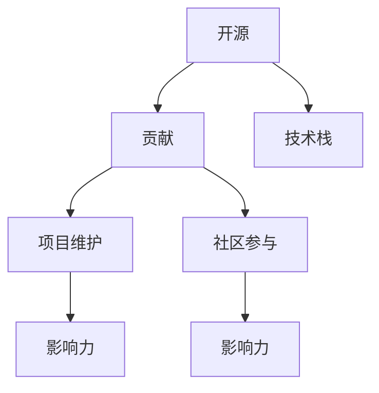

                 

# 利用开源贡献提升职场竞争力

## 1. 背景介绍

在当前高速发展的科技浪潮中，人工智能(AI)、云计算、大数据等技术迅猛崛起，人才需求与日俱增。对于每一位IT从业者来说，提升职场竞争力不仅是个人成长的必经之路，更是公司发展和行业变革的迫切需求。开源贡献作为提升技术能力和展示专业能力的重要手段，日益受到各大企业和招聘方的关注。本文旨在系统介绍开源贡献的核心要素、技术实践，并探讨其在职场发展中的潜在价值。

## 2. 核心概念与联系

### 2.1 核心概念概述

- **开源**：指软件源代码开放，任何人都可以查看、修改和分发，形成一个持续迭代和共享的社区生态。
- **贡献**：指个人或团队对开源项目做出的代码修改、文档编写、问题解决等行为，积极参与开源项目以提升自身技能和展示专业素养。
- **技术栈**：指在某个项目或领域常用的技术组合，包括编程语言、框架、工具等。
- **项目维护**：指定期检查代码库、修复漏洞、优化性能等，保证项目长期稳定运行。
- **社区参与**：指参与开源项目的讨论、社区活动、培训等，建立良好的开源生态关系。
- **影响力**：指通过开源贡献在技术社区中的知名度和认可度，成为行业内的权威人物。

这些概念之间的逻辑关系可以通过以下Mermaid流程图来展示：



### 2.2 核心概念原理和架构的 Mermaid 流程图


## 3. 核心算法原理 & 具体操作步骤

### 3.1 算法原理概述

开源贡献的核心算法原理基于Git版本控制系统，通过Git协议实现代码版本管理和协作，其工作流程通常遵循"Pull Request(合并请求)"机制。贡献者需要：

- 分叉开源项目的Git仓库。
- 将修改后的代码提交到分叉仓库。
- 提交Pull Request，由项目维护者审核并合并。

该过程可描述为：

1. 获取最新代码。
2. 新建或修改代码。
3. 提交代码至分叉仓库。
4. 申请Pull Request。
5. 审核通过后，代码合并至主仓库。

### 3.2 算法步骤详解

#### 3.2.1 获取最新代码

首先需要安装Git，并克隆开源项目的代码仓库。例如，使用以下命令克隆Github上的GitHub官方仓库：

```bash
git clone https://github.com/tech-article/tech-article.git
```

#### 3.2.2 新建或修改代码

在新代码文件或修改已有文件后，需要提交到分叉仓库：

```bash
git add .
git commit -m "Add or modify tech article."
git push origin branch-name
```

#### 3.2.3 提交代码至分叉仓库

通过GitHub网站提交Pull Request：

1. 进入GitHub，点击项目仓库中的"Fork"按钮。
2. 选择分叉后的仓库，点击"New Pull Request"按钮。
3. 在"Base repository"中选择原仓库，在"Compare"中选择自己的分叉仓库。
4. 填写Pull Request的标题和描述，点击"Create Pull Request"。

#### 3.2.4 申请Pull Request

项目维护者收到Pull Request后，需要审核并决定是否合并：

1. 打开Pull Request，点击"Review"按钮。
2. 在评论中提出修改建议，要求进一步优化或修复。
3. 审核通过后，点击"Merge"按钮，将代码合并至主仓库。

### 3.3 算法优缺点

#### 3.3.1 优点

- **技术提升**：参与开源项目可以掌握最新的技术动态，提升自身技术栈。
- **社区认可**：贡献代码、解决问题会得到社区的认可和嘉奖，建立良好的技术声誉。
- **资源共享**：开源项目通常资源丰富，贡献者可共享和使用项目资源。
- **网络效应**：社区内交流合作，有助于扩展人脉和资源。

#### 3.3.2 缺点

- **时间投入**：开源贡献通常需要大量时间和精力，可能影响日常工作。
- **技术门槛**：需要具备一定的编程和版本管理技能，对新手有一定门槛。
- **沟通成本**：需要与项目维护者和社区成员进行有效沟通，处理复杂问题和冲突。

### 3.4 算法应用领域

开源贡献广泛应用于软件开发、数据分析、网站开发、产品设计等多个领域。特别是在企业招聘、职业发展、技术协作等场景中，开源贡献的影响力尤为显著。

- **招聘时考量**：一些大型企业和招聘方会优先选择开源贡献记录良好的应聘者。
- **职业发展**：开源贡献者通常在技术社区中拥有较高的知名度，有利于晋升和职业转型。
- **技术协作**：开源社区为开发者提供了一个广泛的协作平台，便于建立技术合作网络。

## 4. 数学模型和公式 & 详细讲解 & 举例说明

### 4.1 数学模型构建

在开源贡献过程中，可以建立以下数学模型：

- 需求模型：定义项目的需求、目标和优先级，明确开源贡献的初衷和方向。
- 贡献模型：描述贡献者的技术水平、时间投入和贡献方式，量化贡献的效益。
- 代码模型：建立代码变更的跟踪和版本管理模型，确保代码变更的可追溯性和可靠性。

### 4.2 公式推导过程

以代码贡献模型为例，其数学模型如下：

$$
\text{贡献效益} = \text{代码复杂度} \times \text{代码质量} \times \text{代码频率} - \text{时间成本} - \text{沟通成本}
$$

其中，代码复杂度和代码质量可通过代码审查和代码分析工具进行量化；代码频率代表贡献者代码提交的频率和数量；时间成本和沟通成本则需结合实际情况评估。

### 4.3 案例分析与讲解

假设某开源项目维护者根据上述模型计算，发现某贡献者代码贡献效益较高，其代码提交质量高，频率稳定，但贡献时间较长，沟通成本较高。因此，可推荐该贡献者参与更高优先级的需求和问题解决，同时优化沟通流程，减少不必要的延误。

## 5. 项目实践：代码实例和详细解释说明

### 5.1 开发环境搭建

为了快速上手开源贡献，需要搭建以下开发环境：

1. 安装Git客户端和GitHub桌面应用。
2. 使用Docker或虚拟机搭建本地Git仓库。
3. 配置环境变量和开发IDE。

### 5.2 源代码详细实现

#### 5.2.1 分叉和克隆仓库

```bash
git clone https://github.com/your-username/tech-article.git
git checkout -b branch-name
```

#### 5.2.2 提交代码

在本地修改代码后，提交至分叉仓库：

```bash
git add .
git commit -m "Add or modify tech article."
git push origin branch-name
```

#### 5.2.3 申请Pull Request

打开GitHub网站，进入项目仓库，点击"New Pull Request"按钮，填写信息并提交。

### 5.3 代码解读与分析

以下是一个简单的贡献示例：

```python
# 修改tech-article.py
def tech_article():
    # 增加代码
    print("开源贡献的重要性")
```

### 5.4 运行结果展示

在Pull Request审核通过后，代码会被合并至主仓库。可在GitHub中查看合并后的代码和提交日志。

## 6. 实际应用场景

### 6.1 招聘

开源贡献者通常具备较强的技术能力和项目管理经验，成为企业招聘时的优先人选。例如，Google、Microsoft等大公司招聘时，经常要求申请者提交开源贡献记录。

### 6.2 职业发展

开源贡献者通常在技术社区中拥有较高的知名度和声誉，有助于快速晋升和职业转型。例如，技术博客作者通过撰写高质量的贡献文章，提升自身在社区中的影响力。

### 6.3 技术协作

开源社区为开发者提供了一个广泛的协作平台，便于建立技术合作网络。例如，项目组定期举行技术分享会，邀请开源贡献者分享技术经验和实践心得。

### 6.4 未来应用展望

随着开源社区的壮大和技术的发展，开源贡献将在更多领域得到应用，为技术人才的职业发展带来新的机遇。例如，新兴技术领域如区块链、AI等，开源社区的活跃度越来越高，为技术人才提供了广阔的发展空间。

## 7. 工具和资源推荐

### 7.1 学习资源推荐

为了提升开源贡献能力，推荐以下学习资源：

1. **《开源贡献的艺术》**：详细介绍了开源贡献的基本流程和最佳实践。
2. **GitHub官方文档**：提供详细的Git和GitHub使用指南。
3. **Github Pages**：为开源项目提供免费的静态网站托管服务。
4. **Gitter和Slack**：开源社区常用的聊天工具，便于沟通协作。

### 7.2 开发工具推荐

以下是用于开源贡献和社区协作的常用工具：

1. **GitHub Desktop**：GitHub官方客户端，提供图形化界面。
2. **Git LFS**：解决Git版本管理中的文件大小限制问题。
3. **VSCode**：开源社区常用的代码编辑器，支持Git集成和插件扩展。
4. **CI/CD工具**：如Jenkins、Travis CI，支持自动构建和测试。
5. **代码审查工具**：如Lgtm、CodeClimate，提高代码质量和可维护性。

### 7.3 相关论文推荐

以下是一些开源贡献领域的前沿研究论文：

1. **"Open Source Contribution Analytics and Business Value Assessment"**：探讨开源贡献的经济价值和社会影响。
2. **"The Impact of Open Source Contributions on Career Advancement"**：研究开源贡献对职业发展的实际影响。
3. **"Collaborative Model of Open Source Contributions"**：建立开源贡献的协作模型和评价指标。

## 8. 总结：未来发展趋势与挑战

### 8.1 研究成果总结

开源贡献在提升职场竞争力方面展现了巨大的潜力和价值，成为技术人员展示技术和协作能力的有效手段。当前，开源贡献已成为企业招聘和职业发展的关键考量因素。

### 8.2 未来发展趋势

- **自动化和智能化**：开源贡献将借助自动化和智能化工具，提升效率和质量。
- **多维融合**：开源贡献将与云计算、区块链、AI等新兴技术融合，拓展应用场景。
- **开源生态**：开源社区将更加活跃，技术协作和资源共享将更加高效。

### 8.3 面临的挑战

- **资源和时间投入**：开源贡献需要大量时间和精力，可能会影响日常工作。
- **技术门槛**：对新手有一定的技术门槛，需要不断学习和适应。
- **社区治理**：开源社区需要建立完善的治理机制，处理复杂问题和冲突。

### 8.4 研究展望

未来开源贡献的研究方向包括：

- **贡献模型优化**：建立更科学、全面的开源贡献模型，评估贡献效益。
- **自动化和智能化**：开发自动化工具，提升开源贡献的效率和质量。
- **生态建设**：建立完善的开源生态系统，促进技术人才的交流和合作。

## 9. 附录：常见问题与解答

### 9.1 问题

**Q1: 开源贡献如何开始？**

A: 首先需要找到一个感兴趣的开源项目，克隆该项目仓库，并创建一个新分支进行贡献。

**Q2: 如何评估开源贡献的效益？**

A: 可以通过贡献数量、代码复杂度、代码质量等指标进行量化评估。

**Q3: 开源贡献会影响日常工作吗？**

A: 开源贡献通常需要投入大量时间和精力，可能会影响日常工作。需合理安排时间。

**Q4: 开源贡献有哪些优势？**

A: 开源贡献有助于提升技术水平，获取社区认可，建立广泛的合作关系。

### 9.2 解答

本文系统介绍了开源贡献在职场竞争力的提升作用，从核心概念、技术实践、应用场景等多个方面进行了详细探讨。开源贡献不仅有助于提升技术能力和管理经验，还能够获得社区的认可和嘉奖，助力职业发展。随着开源社区的壮大和技术的发展，开源贡献必将成为技术人才展示技术和协作能力的重要手段，为职场发展带来新的机遇和挑战。

---

作者：禅与计算机程序设计艺术 / Zen and the Art of Computer Programming

