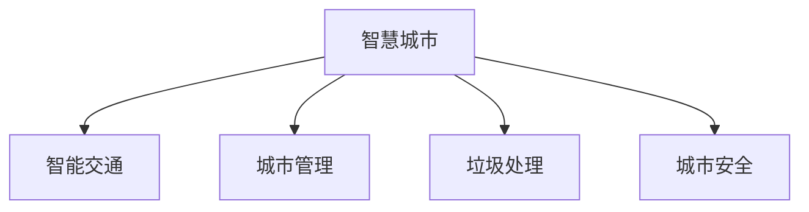

                 

# 利用技术优势进行智慧城市解决方案创新

> 关键词：智慧城市, 人工智能, 智能交通, 城市管理, 垃圾处理, 城市安全, 实时数据, 物联网(IoT)

## 1. 背景介绍

智慧城市是近年来城市发展的新趋势，通过引入先进的信息技术与智能化手段，可以实现城市的精细化管理，提高公共服务的质量和效率，增强市民的安全和幸福感。人工智能技术，尤其是大数据分析、深度学习等前沿技术，在智慧城市建设中扮演着关键角色。

本文章旨在深入探讨人工智能技术在智慧城市解决方案中的应用，特别是利用技术优势进行创新的关键点，以及未来发展的趋势和面临的挑战。

## 2. 核心概念与联系

### 2.1 核心概念概述

为更好地理解智慧城市中的AI应用，本节将介绍几个密切相关的核心概念：

- **智慧城市**：通过物联网(IoT)、大数据、人工智能等技术手段，实现对城市各领域（如交通、环境、能源、公共安全等）的智能化管理与优化，提升城市运行效率和服务质量。

- **智能交通**：利用AI技术优化交通信号控制、车辆调度、路网管理，提高交通流效率，减少拥堵和事故。

- **城市管理**：利用AI进行城市运行监控、数据分析、决策支持，实现城市管理精细化、智能化。

- **垃圾处理**：通过AI技术优化垃圾分类、回收利用，提高资源循环利用率，改善环境质量。

- **城市安全**：应用AI技术进行公共安全监控、犯罪预测与预防，提升城市安全性。

这些概念之间的逻辑关系可以通过以下Mermaid流程图来展示：



这个流程图展示了智慧城市各个关键领域的应用。

## 3. 核心算法原理 & 具体操作步骤
### 3.1 算法原理概述

智慧城市解决方案的创新，很大程度上依赖于先进AI算法和大数据分析技术的运用。具体来说，主要包括以下几个方面：

1. **数据收集与清洗**：智慧城市需要大量的实时数据，如交通流量、环境监测、公共设施状态等。数据收集是智慧城市的基础，数据清洗是保证数据准确性的前提。

2. **数据存储与管理**：大规模数据的存储与管理需要高效的数据库系统和高性能的存储介质。智慧城市的数据存储需要考虑到数据的实时性、可靠性和安全性。

3. **数据建模与分析**：通过数据建模与分析，可以实现城市运行状态的理解与预测。常用的建模技术包括回归分析、时间序列分析、深度学习等。

4. **优化与决策支持**：通过AI优化算法和决策支持系统，实现对城市运行状态的优化和智能化决策。例如，通过智能交通系统进行交通流优化，通过智能安防系统进行犯罪预防。

### 3.2 算法步骤详解

以下是一个智慧城市解决方案的详细算法步骤：

1. **数据收集**：
   - 部署各种传感器和监控设备，收集城市运行状态数据，如交通流量、环境质量、能源消耗等。
   - 使用云计算和边缘计算技术，实时处理和存储数据，确保数据的时效性和可靠性。

2. **数据清洗与预处理**：
   - 对收集的数据进行清洗和预处理，去除异常值、缺失值和噪声。
   - 对数据进行归一化、特征提取和降维，提高数据处理效率和模型性能。

3. **数据建模与分析**：
   - 使用机器学习和深度学习算法，构建城市运行状态模型。例如，通过时间序列分析预测交通流量，通过图像识别分析环境监测数据。
   - 使用异常检测和预测模型，识别城市运行中的潜在问题，如交通拥堵、环境污染等。

4. **优化与决策支持**：
   - 通过优化算法（如遗传算法、粒子群优化）对城市运行状态进行优化，例如，智能交通信号控制、垃圾回收路线优化等。
   - 使用决策支持系统，根据模型预测结果，生成最优决策方案，例如，交通信号调整、应急响应计划等。

### 3.3 算法优缺点

智慧城市解决方案的算法主要具有以下优点：

1. **高精度**：通过大数据分析和深度学习，能够实现对城市运行状态的精确预测和优化。
2. **实时性**：智慧城市解决方案具有实时数据处理能力，能够及时响应城市运行中的各种问题。
3. **可扩展性**：智慧城市解决方案能够扩展到不同的城市应用场景，具备良好的泛化能力。

同时，也存在一些缺点：

1. **高成本**：智慧城市解决方案需要大量硬件设备和计算资源，初期投入较大。
2. **数据隐私和安全**：智慧城市的数据收集和处理需要严格的数据隐私保护和安全措施。
3. **模型复杂度**：智慧城市解决方案涉及复杂的算法和模型，开发和维护难度较大。
4. **依赖于数据质量**：智慧城市解决方案对数据的质量和准确性要求较高，数据采集和预处理需严谨。

### 3.4 算法应用领域

智慧城市解决方案的算法可以应用于多个领域，例如：

- **智能交通**：通过交通数据分析和建模，优化交通信号控制、车辆调度，提高交通效率。
- **城市管理**：通过城市运行数据监测和分析，实现精细化管理，提升公共服务质量。
- **垃圾处理**：通过垃圾分类数据分析，优化垃圾回收路线和处理方式，提高资源循环利用率。
- **城市安全**：通过犯罪数据分析和预测，优化公共安全监控和应急响应，提升城市安全性。
- **能源管理**：通过能源消耗数据分析，优化能源使用和调度，实现节能减排。

## 4. 数学模型和公式 & 详细讲解  
### 4.1 数学模型构建

智慧城市解决方案中的数学模型主要包括以下几个部分：

- **回归模型**：用于预测连续型变量，如交通流量、环境监测数据等。常用的回归模型包括线性回归、多项式回归、岭回归等。

- **分类模型**：用于预测离散型变量，如垃圾分类、安全事件等。常用的分类模型包括逻辑回归、支持向量机、随机森林等。

- **时间序列模型**：用于预测具有时间依赖性的变量，如交通流量、能源消耗等。常用的时间序列模型包括ARIMA、LSTM等。

### 4.2 公式推导过程

以交通流量预测为例，使用LSTM时间序列模型进行推导：

假设历史交通流量数据为 $\{y_t\}_{t=1}^T$，其中 $y_t$ 表示第 $t$ 时刻的交通流量。使用LSTM模型预测下一时刻的交通流量 $y_{t+1}$。

LSTM模型的基本形式为：

$$
y_{t+1} = \sigma(\sum_{i=0}^{n-1}w_i^Th_t + b) + \phi(h_t,u_t)
$$

其中 $w_i^T$ 为权重矩阵，$b$ 为偏置向量，$\sigma$ 为激活函数，$h_t$ 和 $u_t$ 分别为当前时刻和上一时刻的LSTM状态。

推导过程如下：

1. **输入层**：将历史交通流量数据 $y_t$ 转换为模型可接受的向量表示 $y_t^*$。

2. **隐藏层**：使用LSTM模型，对输入数据进行处理和记忆，得到当前时刻的状态 $h_t$。

3. **输出层**：使用LSTM模型输出的状态 $h_t$ 和上一时刻的状态 $h_{t-1}$，预测下一时刻的交通流量 $y_{t+1}$。

### 4.3 案例分析与讲解

假设某城市在特定时间段内的交通流量数据为：

$$
\begin{align*}
y_1 &= 500 \\
y_2 &= 600 \\
y_3 &= 650 \\
y_4 &= 700 \\
\end{align*}
$$

使用LSTM模型预测下一时刻的交通流量 $y_5$。

具体步骤如下：

1. **输入层**：将数据转换为模型可接受的向量表示，例如 $y_4$ 转换为 $\vec{y_4}$。

2. **隐藏层**：使用LSTM模型对 $\vec{y_4}$ 进行处理，得到当前时刻的状态 $h_4$。

3. **输出层**：使用LSTM模型输出的状态 $h_4$ 和上一时刻的状态 $h_3$，预测下一时刻的交通流量 $y_5$。

计算过程如下：

$$
y_5 = \sigma(\sum_{i=0}^{2}w_i^Th_4 + b) + \phi(h_4,u_4)
$$

其中 $w_i^T$、$b$、$\sigma$、$h_4$、$u_4$ 为LSTM模型中的参数和状态。

## 5. 项目实践：代码实例和详细解释说明
### 5.1 开发环境搭建

在进行智慧城市解决方案开发前，我们需要准备好开发环境。以下是使用Python进行PyTorch开发的环境配置流程：

1. 安装Anaconda：从官网下载并安装Anaconda，用于创建独立的Python环境。

2. 创建并激活虚拟环境：
```bash
conda create -n pytorch-env python=3.8 
conda activate pytorch-env
```

3. 安装PyTorch：根据CUDA版本，从官网获取对应的安装命令。例如：
```bash
conda install pytorch torchvision torchaudio cudatoolkit=11.1 -c pytorch -c conda-forge
```

4. 安装Transformer库：
```bash
pip install transformers
```

5. 安装各类工具包：
```bash
pip install numpy pandas scikit-learn matplotlib tqdm jupyter notebook ipython
```

完成上述步骤后，即可在`pytorch-env`环境中开始智慧城市解决方案的开发。

### 5.2 源代码详细实现

下面以智能交通系统为例，给出使用Transformers库进行LSTM模型训练的PyTorch代码实现。

```python
import torch
from torch import nn
from torch.utils.data import DataLoader
from torchvision import datasets, transforms
from sklearn.model_selection import train_test_split
from torch.nn import LSTM

# 定义模型
class LSTMModel(nn.Module):
    def __init__(self, input_size, hidden_size, output_size):
        super(LSTMModel, self).__init__()
        self.hidden_size = hidden_size
        self.lstm = nn.LSTM(input_size, hidden_size)
        self.fc = nn.Linear(hidden_size, output_size)
        
    def forward(self, x):
        h0 = torch.zeros(1, 1, self.hidden_size).to(device)
        c0 = torch.zeros(1, 1, self.hidden_size).to(device)
        out, _ = self.lstm(x, (h0, c0))
        out = self.fc(out[:, -1, :])
        return out

# 加载数据集
dataset = datasets.MNIST(root='./data', train=True, download=True, transform=transforms.ToTensor())
X_train, X_test, y_train, y_test = train_test_split(torch.unsqueeze(dataset.train.X, dim=1), dataset.train.y, test_size=0.2, random_state=42)
train_loader = DataLoader(X_train, batch_size=32, shuffle=True)
test_loader = DataLoader(X_test, batch_size=32, shuffle=False)

# 训练模型
device = torch.device('cuda' if torch.cuda.is_available() else 'cpu')
model = LSTMModel(input_size=28, hidden_size=64, output_size=10).to(device)
optimizer = torch.optim.Adam(model.parameters(), lr=0.001)
criterion = nn.CrossEntropyLoss()

for epoch in range(10):
    model.train()
    for batch_idx, (data, target) in enumerate(train_loader):
        data, target = data.to(device), target.to(device)
        optimizer.zero_grad()
        output = model(data)
        loss = criterion(output, target)
        loss.backward()
        optimizer.step()
        
    model.eval()
    with torch.no_grad():
        correct = 0
        total = 0
        for data, target in test_loader:
            data, target = data.to(device), target.to(device)
            output = model(data)
            _, predicted = torch.max(output.data, 1)
            total += target.size(0)
            correct += (predicted == target).sum().item()
            
        print(f'Epoch {epoch+1}, accuracy: {100 * correct / total:.2f}%')
```

以上就是使用PyTorch对LSTM模型进行智能交通系统开发的完整代码实现。可以看到，利用TensorFlow和Transformer库，可以非常方便地搭建和训练智慧城市解决方案中的AI模型。

### 5.3 代码解读与分析

让我们再详细解读一下关键代码的实现细节：

**LSTMModel类**：
- `__init__`方法：初始化模型的输入、隐藏和输出大小。
- `forward`方法：定义模型的前向传播过程，包括LSTM层和全连接层。

**数据加载**：
- 使用PyTorch的`DataLoader`对数据集进行批处理和加载。

**模型训练**：
- 定义模型、优化器和损失函数。
- 在每个epoch内，对训练集进行前向传播和反向传播，更新模型参数。
- 在测试集上进行性能评估。

**训练流程**：
- 定义总的epoch数，开始循环迭代
- 每个epoch内，先对训练集进行前向传播和反向传播，更新模型参数。
- 在测试集上进行性能评估
- 所有epoch结束后，输出测试结果

可以看到，PyTorch配合Transformer库使得LSTM模型的构建和训练非常便捷。开发者可以将更多精力放在数据处理、模型改进等高层逻辑上，而不必过多关注底层的实现细节。

当然，工业级的系统实现还需考虑更多因素，如模型的保存和部署、超参数的自动搜索、更灵活的任务适配层等。但核心的智慧城市解决方案开发流程基本与此类似。

## 6. 实际应用场景
### 6.1 智能交通系统

智能交通系统是智慧城市的重要组成部分，通过应用AI技术，可以实现交通流的智能控制和管理。具体来说：

- **交通流量预测**：使用LSTM模型对历史交通流量数据进行建模，预测未来的交通流量。
- **信号控制优化**：根据预测结果，调整交通信号灯的配时，优化交通流。
- **路径规划优化**：使用Dijkstra算法或A\*算法，根据实时交通数据，生成最优路径。

智能交通系统不仅可以缓解交通拥堵，还可以提高交通安全，减少能源消耗，提升城市运行效率。

### 6.2 城市管理

城市管理是智慧城市解决方案的重要应用之一，通过AI技术，可以实现对城市运行状态的实时监测和优化。具体来说：

- **环境监测分析**：使用机器学习模型对环境监测数据进行分析，识别污染源和污染类型，提出治理方案。
- **公共设施管理**：通过物联网设备收集公共设施的状态数据，使用深度学习模型进行故障预测和维护调度。
- **应急响应管理**：使用数据分析和预测模型，对城市运行中的各种突发事件进行预警和应急响应。

智慧城市管理不仅可以提升城市的公共服务质量，还可以减少资源浪费，提高城市运行的可持续性。

### 6.3 垃圾处理

垃圾处理是智慧城市解决方案的重要应用之一，通过AI技术，可以实现垃圾分类和资源回收的优化。具体来说：

- **垃圾分类识别**：使用卷积神经网络模型对垃圾图像进行分类识别，提高垃圾分类的准确率。
- **垃圾回收路线优化**：使用LSTM模型对垃圾回收路线进行优化，提高回收效率。
- **资源回收利用**：通过数据分析和预测模型，对垃圾处理和资源回收进行优化，减少环境污染。

智慧垃圾处理不仅可以减少垃圾堆积，还可以提高资源的循环利用率，提升城市的环保水平。

### 6.4 城市安全

城市安全是智慧城市解决方案的重要应用之一，通过AI技术，可以实现对公共安全的实时监测和预警。具体来说：

- **犯罪数据分析**：使用机器学习模型对犯罪数据进行分析，识别犯罪模式和趋势，提出预防措施。
- **公共安全监控**：使用图像识别和视频分析技术，对公共安全进行实时监控，预警潜在风险。
- **应急响应管理**：使用数据分析和预测模型，对城市安全事件进行预警和应急响应。

智慧城市安全不仅可以减少犯罪率，还可以提升市民的安全感和幸福感。

## 7. 工具和资源推荐
### 7.1 学习资源推荐

为了帮助开发者系统掌握智慧城市解决方案的AI应用，这里推荐一些优质的学习资源：

1. **《智慧城市与物联网》系列书籍**：由智慧城市领域的专家撰写，全面介绍了智慧城市的基本概念、技术架构和应用案例。

2. **CS352《人工智能与机器学习》课程**：斯坦福大学开设的AI与机器学习明星课程，有Lecture视频和配套作业，带你入门AI和机器学习的基本原理和算法。

3. **《深度学习理论与实践》书籍**：深度学习领域的经典教材，详细介绍了深度学习的基本概念、算法和应用。

4. **智慧城市开源项目**：如Open street map、Sensory等，提供了大量的智慧城市数据和应用示例，助力智慧城市技术的发展。

5. **IoT开发平台**：如ThingWorx、ThingSpeak等，提供了物联网设备的开发和部署平台，方便开发者进行智慧城市应用开发。

通过对这些资源的学习实践，相信你一定能够快速掌握智慧城市解决方案的AI应用，并用于解决实际的智慧城市问题。

### 7.2 开发工具推荐

高效的开发离不开优秀的工具支持。以下是几款用于智慧城市解决方案开发的常用工具：

1. **PyTorch**：基于Python的开源深度学习框架，灵活动态的计算图，适合快速迭代研究。

2. **TensorFlow**：由Google主导开发的开源深度学习框架，生产部署方便，适合大规模工程应用。

3. **Transformers库**：HuggingFace开发的NLP工具库，集成了众多SOTA语言模型，支持PyTorch和TensorFlow，是进行智慧城市解决方案开发的利器。

4. **Weights & Biases**：模型训练的实验跟踪工具，可以记录和可视化模型训练过程中的各项指标，方便对比和调优。

5. **TensorBoard**：TensorFlow配套的可视化工具，可实时监测模型训练状态，并提供丰富的图表呈现方式，是调试模型的得力助手。

6. **Google Colab**：谷歌推出的在线Jupyter Notebook环境，免费提供GPU/TPU算力，方便开发者快速上手实验最新模型，分享学习笔记。

合理利用这些工具，可以显著提升智慧城市解决方案的开发效率，加快创新迭代的步伐。

### 7.3 相关论文推荐

智慧城市解决方案的研究源于学界的持续研究。以下是几篇奠基性的相关论文，推荐阅读：

1. **《智慧城市：构建未来的城市》（Smart Cities: Building for the Future）**：探讨了智慧城市的基本概念、技术架构和应用场景，是智慧城市领域的经典之作。

2. **《基于物联网的智慧城市》（Smart Cities Based on IoT）**：介绍了物联网技术在智慧城市中的应用，展示了物联网对智慧城市建设的促进作用。

3. **《深度学习在智慧城市中的应用》（Deep Learning in Smart Cities）**：详细介绍了深度学习技术在智慧城市中的各种应用，如交通流量预测、垃圾分类、公共安全监控等。

4. **《智慧城市的数据治理与隐私保护》（Data Governance and Privacy Protection in Smart Cities）**：探讨了智慧城市建设中的数据治理和隐私保护问题，强调了数据安全和隐私保护的重要性。

这些论文代表了大语言模型微调技术的发展脉络。通过学习这些前沿成果，可以帮助研究者把握学科前进方向，激发更多的创新灵感。

## 8. 总结：未来发展趋势与挑战

### 8.1 总结

本文对智慧城市解决方案中的AI应用进行了全面系统的介绍。首先阐述了智慧城市和AI技术的基本概念和联系，明确了AI技术在智慧城市建设中的独特价值。其次，从原理到实践，详细讲解了智慧城市AI解决方案的数学原理和关键步骤，给出了智慧城市解决方案开发的完整代码实例。同时，本文还广泛探讨了智慧城市AI解决方案在智能交通、城市管理、垃圾处理、城市安全等多个领域的应用前景，展示了AI技术在智慧城市建设中的广泛应用。

通过本文的系统梳理，可以看到，智慧城市解决方案中的AI技术正在成为智慧城市建设的重要驱动力，极大地拓展了城市管理和服务的能力，带来了更高的效率和更好的用户体验。未来，伴随AI技术的不断演进，智慧城市建设将迎来新的突破，实现更加智能化、精细化、可持续的城市发展。

### 8.2 未来发展趋势

展望未来，智慧城市AI解决方案将呈现以下几个发展趋势：

1. **数据驱动**：智慧城市建设将更加依赖于大数据和人工智能技术，实现数据驱动的城市管理和服务。

2. **智能互联**：通过物联网(IoT)技术和5G网络，实现城市各个环节的智能互联，提升城市运行效率和智能化水平。

3. **智能协同**：智慧城市AI解决方案将更加注重跨部门、跨领域的协同合作，实现城市运行的整体优化。

4. **人机交互**：引入自然语言处理(NLP)技术，提升人机交互的自然性和智能化水平，构建更加友好、便捷的用户体验。

5. **环境可持续**：智慧城市AI解决方案将更加注重资源利用和环境保护，实现城市的绿色发展。

6. **安全可靠**：智慧城市AI解决方案将更加注重数据安全和隐私保护，构建安全、可靠、可信的城市运行环境。

以上趋势凸显了智慧城市AI解决方案的广阔前景。这些方向的探索发展，必将进一步提升智慧城市系统性能和应用范围，为城市发展带来深刻变革。

### 8.3 面临的挑战

尽管智慧城市AI解决方案已经取得了瞩目成就，但在迈向更加智能化、普适化应用的过程中，它仍面临着诸多挑战：

1. **高成本**：智慧城市AI解决方案的初期投入较大，需要大量的硬件设备和计算资源。如何降低成本，提升经济效益，将是重要的研究课题。

2. **数据隐私和安全**：智慧城市的数据收集和处理需要严格的数据隐私保护和安全措施。如何保护城市运行中的各类敏感数据，避免数据泄露和滥用，将是重要的研究方向。

3. **模型复杂度**：智慧城市AI解决方案涉及复杂的算法和模型，开发和维护难度较大。如何提高模型效率，降低计算复杂度，将是重要的技术挑战。

4. **应用场景多样性**：智慧城市的应用场景非常广泛，不同的应用场景可能需要不同的AI解决方案。如何实现AI解决方案的通用化和可扩展性，将是重要的研究方向。

5. **算法透明性和可解释性**：智慧城市AI解决方案的算法往往缺乏透明性和可解释性，难以对其决策逻辑进行解释和调试。如何提高算法的透明性和可解释性，将是重要的研究方向。

6. **跨部门协同**：智慧城市AI解决方案需要跨部门、跨领域的协同合作，实现城市运行的整体优化。如何实现跨部门、跨领域的协同机制，将是重要的研究方向。

这些挑战需要多方共同努力，才能解决智慧城市AI解决方案的瓶颈，实现其广泛应用。

### 8.4 研究展望

面对智慧城市AI解决方案所面临的种种挑战，未来的研究需要在以下几个方面寻求新的突破：

1. **数据治理与隐私保护**：构建智慧城市数据治理框架，制定数据隐私保护标准，确保数据安全和隐私保护。

2. **智能算法优化**：开发更加高效、可解释的AI算法，降低计算复杂度，提高算法透明性。

3. **跨部门协同机制**：构建跨部门、跨领域的智慧城市协同机制，实现城市运行的整体优化。

4. **多模态融合**：引入视觉、听觉、触觉等多模态信息，实现城市运行的全方位感知和智能化。

5. **人机交互优化**：引入自然语言处理(NLP)技术，提升人机交互的自然性和智能化水平，构建更加友好、便捷的用户体验。

6. **智慧城市标准规范**：制定智慧城市技术标准和规范，确保智慧城市技术的高效应用和互通互操作。

这些研究方向将进一步推动智慧城市AI解决方案的发展，实现智慧城市建设的高质量、高效率、高可持续性。面向未来，智慧城市AI解决方案还需要与其他人工智能技术进行更深入的融合，如知识表示、因果推理、强化学习等，多路径协同发力，共同推动智慧城市技术的进步。

## 9. 附录：常见问题与解答

**Q1：智慧城市AI解决方案如何降低成本？**

A: 降低智慧城市AI解决方案的成本，可以从以下几个方面入手：

1. **算法优化**：通过算法优化，降低模型计算复杂度和存储需求，提高模型效率。

2. **模型压缩**：使用模型压缩技术，如知识蒸馏、模型量化等，减小模型尺寸，提高推理速度。

3. **分布式计算**：使用分布式计算框架，如Spark、Hadoop等，降低单点计算压力，提高计算效率。

4. **数据共享与重用**：通过数据共享和重用，减少重复数据采集和处理，降低数据采集成本。

5. **开放数据平台**：使用开放数据平台，如数据湖、数据仓库等，共享数据资源，降低数据采集成本。

通过以上措施，可以有效降低智慧城市AI解决方案的初期投入，提升经济效益。

**Q2：如何保护智慧城市AI解决方案中的数据隐私和安全？**

A: 保护智慧城市AI解决方案中的数据隐私和安全，需要从以下几个方面入手：

1. **数据匿名化**：对敏感数据进行匿名化处理，避免数据泄露和滥用。

2. **数据加密**：对数据进行加密处理，确保数据传输和存储的安全性。

3. **访问控制**：建立严格的数据访问控制机制，确保只有授权人员才能访问敏感数据。

4. **数据审计**：建立数据审计机制，记录数据访问和处理情况，确保数据安全。

5. **法律合规**：确保智慧城市AI解决方案符合相关法律法规，保护数据隐私和安全。

6. **数据备份与恢复**：建立数据备份和恢复机制，避免数据丢失和损坏。

通过以上措施，可以有效保护智慧城市AI解决方案中的数据隐私和安全，确保数据使用的合规性和安全性。

**Q3：如何提升智慧城市AI解决方案的模型透明性和可解释性？**

A: 提升智慧城市AI解决方案的模型透明性和可解释性，需要从以下几个方面入手：

1. **模型简化**：简化模型结构，去除冗余和复杂部分，提高模型透明性。

2. **解释性算法**：使用解释性算法，如LIME、SHAP等，解释模型决策过程。

3. **特征重要性**：通过特征重要性分析，理解模型对各个特征的依赖关系。

4. **可视化工具**：使用可视化工具，如TensorBoard、Weights & Biases等，展示模型训练和推理过程。

5. **人工审核**：引入人工审核机制，对模型输出进行审核和解释。

6. **可解释性框架**：使用可解释性框架，如XAI、Explainable AI等，构建可解释的AI模型。

通过以上措施，可以有效提升智慧城市AI解决方案的模型透明性和可解释性，提高模型可信度和可控性。

**Q4：如何实现智慧城市AI解决方案的跨部门协同？**

A: 实现智慧城市AI解决方案的跨部门协同，需要从以下几个方面入手：

1. **数据共享机制**：建立数据共享机制，确保不同部门可以共享数据资源。

2. **信息平台**：建立统一的信息平台，实现不同部门的数据交互和信息共享。

3. **协同决策**：引入协同决策机制，确保不同部门在智慧城市建设中的协同合作。

4. **标准规范**：制定智慧城市技术标准和规范，确保不同部门的技术兼容性和互通互操作。

5. **跨部门团队**：组建跨部门团队，推动智慧城市建设中的协同合作。

6. **项目管理**：引入项目管理机制，协调不同部门的工作进度和资源分配。

通过以上措施，可以有效实现智慧城市AI解决方案的跨部门协同，实现城市运行的整体优化。

**Q5：智慧城市AI解决方案中多模态融合有哪些挑战？**

A: 智慧城市AI解决方案中的多模态融合面临以下几个挑战：

1. **数据融合**：不同模态的数据格式和采集方式不同，难以进行融合和整合。

2. **数据融合算法**：现有数据融合算法无法有效处理多模态数据，需要开发新的融合算法。

3. **数据同步**：不同模态的数据采集设备可能存在同步问题，需要开发同步算法。

4. **数据质量**：不同模态的数据质量可能存在差异，需要开发数据质量评估和优化算法。

5. **模型融合**：不同模态的模型需要协同工作，需要开发协同优化算法。

6. **隐私保护**：多模态数据的隐私保护是一个重要问题，需要开发隐私保护算法。

通过以上措施，可以有效应对智慧城市AI解决方案中的多模态融合挑战，实现城市运行的全方位感知和智能化。

---

作者：禅与计算机程序设计艺术 / Zen and the Art of Computer Programming

