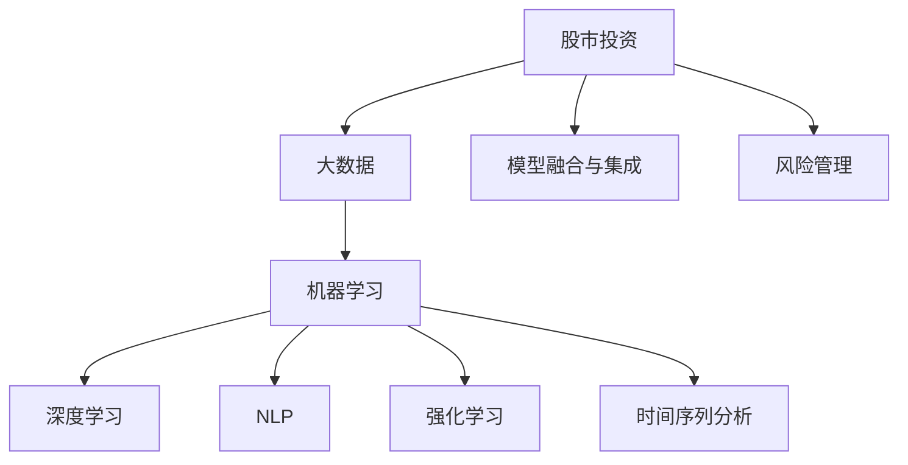

                 

# 利用技术优势进行股市投资

## 1. 背景介绍

### 1.1 问题由来

股市投资历来是风险与收益并存的游戏。投资者通过买入和卖出股票，以期在市场波动中获取超额利润。然而，股市的非线性和不确定性，使得投资决策变得异常复杂。虽然技术分析、基本面分析等传统方法在股市投资中已有一定应用，但依然存在诸多局限性。近年来，人工智能和大数据技术的发展，为股市投资带来了新的视角和方法。

### 1.2 问题核心关键点

人工智能在股市投资中的应用，核心在于通过大数据挖掘和机器学习模型，辅助投资者进行决策分析。具体而言，主要涉及以下几个关键点：

- **数据获取与处理**：收集股市数据，包括历史股价、成交量、财务报表、新闻、社交媒体等，并进行数据清洗、特征提取等预处理。
- **模型构建与训练**：设计合适的机器学习模型，如回归模型、分类模型、时间序列模型等，利用历史数据进行训练。
- **特征工程与选择**：对原始数据进行特征工程，包括因子提取、特征编码等，选择对预测效果影响显著的特征。
- **模型优化与评估**：通过交叉验证、网格搜索等方法，优化模型参数，评估模型效果。
- **投资策略设计**：将训练好的模型嵌入实际投资策略，如趋势跟踪、均值回归、价值投资等。
- **风险控制与管理**：引入风险评估和风险控制策略，如止损、仓位控制、多样化投资等。

这些核心点构成了人工智能辅助股市投资的主要框架，通过技术手段提高了股市决策的准确性和稳定性。

## 2. 核心概念与联系

### 2.1 核心概念概述

为更好地理解人工智能在股市投资中的应用，本节将介绍几个密切相关的核心概念：

- **股市投资**：投资者通过买卖股票、债券等金融产品，获取资本增值或固定收益。
- **人工智能**：通过算法和计算能力，从数据中提取规律，提供辅助决策建议。
- **大数据**：股市投资中涉及海量的数据，包括市场交易数据、新闻信息、社交媒体等。
- **机器学习**：利用历史数据训练模型，对未来市场趋势进行预测。
- **深度学习**：一种特定的机器学习范式，通过多层神经网络进行复杂特征提取。
- **自然语言处理(NLP)**：处理文本数据，如新闻、评论等，提取其中蕴含的市场情绪和信息。
- **强化学习**：通过智能体与环境的交互，学习最优策略，用于高频交易等场景。
- **时间序列分析**：分析股票价格等时间序列数据，提取周期性变化特征。
- **模型融合与集成**：将多个模型的预测结果进行融合，提高预测准确性。
- **风险管理**：评估和管理投资风险，包括止损、仓位控制等。

这些核心概念之间的逻辑关系可以通过以下Mermaid流程图来展示：



这个流程图展示了股市投资与人工智能技术之间的联系：

1. 股市投资依赖于大数据进行决策支持。
2. 大数据通过机器学习、深度学习、NLP等技术进行处理和分析。
3. 机器学习、深度学习、NLP等技术提供预测模型，辅助投资决策。
4. 时间序列分析用于提取时间序列数据中的周期性特征。
5. 强化学习用于高频交易等场景，学习最优策略。
6. 模型融合与集成提高预测准确性。
7. 风险管理用于评估和控制投资风险。

这些核心概念共同构成了人工智能辅助股市投资的基本框架，通过技术手段提升投资决策的科学性和可靠性。

## 3. 核心算法原理 & 具体操作步骤
### 3.1 算法原理概述

人工智能在股市投资中的应用，主要通过数据挖掘和机器学习模型进行。其核心思想是利用历史数据训练模型，通过预测市场趋势，辅助投资者进行买卖决策。

形式化地，假设股市投资决策问题为 $D$，历史数据集为 $D_h=\{(x_i, y_i)\}_{i=1}^N$，其中 $x_i$ 为输入特征，$y_i$ 为标签，表示股票在 $x_i$ 下的涨跌情况。则预测模型 $M_{\theta}$ 可以表示为：

$$
M_{\theta}(x) = \theta^T f(x) + b
$$

其中 $\theta$ 为模型参数，$f(x)$ 为特征函数，$b$ 为偏置项。通过最小化经验风险 $\mathcal{L}(\theta) = \frac{1}{N}\sum_{i=1}^N \ell(M_{\theta}(x_i),y_i)$，其中 $\ell$ 为损失函数，如均方误差或交叉熵，求解得到最优模型参数 $\theta^*$。

### 3.2 算法步骤详解

人工智能辅助股市投资一般包括以下几个关键步骤：

**Step 1: 数据获取与预处理**
- 收集历史股价、成交量、财务报表、新闻、社交媒体等数据。
- 进行数据清洗，如去重、缺失值处理、异常值检测等。
- 进行特征提取和编码，如因子提取、时间特征编码等。

**Step 2: 模型选择与训练**
- 选择合适的机器学习模型，如线性回归、支持向量机、神经网络等。
- 利用历史数据集 $D_h$ 训练模型，得到最优参数 $\theta^*$。
- 在验证集 $D_v$ 上进行模型评估，调整参数或选择更好的模型。

**Step 3: 特征工程与选择**
- 进行特征选择，选择对预测效果影响显著的特征。
- 进行特征工程，如因子提取、时间特征编码等。
- 构建特征集 $F$，用于输入模型。

**Step 4: 模型优化与评估**
- 使用交叉验证、网格搜索等方法，优化模型参数。
- 在测试集 $D_t$ 上进行模型评估，计算准确率、召回率、F1-score等指标。
- 根据评估结果调整模型结构和参数。

**Step 5: 投资策略设计**
- 根据训练好的模型设计投资策略，如趋势跟踪、均值回归、价值投资等。
- 根据策略进行买卖决策，构建投资组合。
- 引入风险控制策略，如止损、仓位控制、多样化投资等。

**Step 6: 模型部署与应用**
- 将训练好的模型嵌入实际投资系统中，实现自动交易或辅助决策。
- 实时监控市场数据，动态调整模型参数或投资策略。
- 定期评估模型性能，更新模型参数或重新训练。

以上是人工智能辅助股市投资的一般流程。在实际应用中，还需要针对具体投资场景，对各个环节进行优化设计，如改进特征选择方法，引入更多先验知识，优化模型评估指标等，以进一步提升模型预测效果。

### 3.3 算法优缺点

人工智能在股市投资中的应用，具有以下优点：
1. 数据驱动：通过分析历史数据，提供基于事实的决策依据。
2. 模式识别：识别市场趋势和模式，辅助投资者捕捉投资机会。
3. 自动交易：利用自动交易系统，降低人为情绪干扰，提高交易效率。
4. 实时监控：实时监控市场动态，动态调整投资策略。
5. 量化管理：通过量化模型进行风险控制，降低投资风险。

同时，该方法也存在一定的局限性：
1. 数据依赖性：模型效果依赖于数据质量，历史数据存在噪声和偏差。
2. 复杂性：模型构建和调参过程复杂，需要一定的技术背景。
3. 过拟合风险：模型可能过拟合历史数据，对新数据泛化能力不足。
4. 高成本：数据采集和处理需要大量资源，模型构建和训练需要高性能计算。
5. 不可解释性：部分模型如深度学习黑盒，难以解释其决策过程。
6. 风险管理不足：模型可能无法准确评估和控制投资风险。

尽管存在这些局限性，但就目前而言，人工智能在股市投资中的应用范式仍是一个重要的研究热点。未来相关研究的重点在于如何进一步降低对历史数据的依赖，提高模型的泛化能力和可解释性，同时兼顾风险管理等实际需求。

### 3.4 算法应用领域

人工智能在股市投资中的应用领域非常广泛，覆盖了以下典型场景：

- **趋势跟踪**：通过分析历史价格走势，识别出市场趋势，进行买入或卖出操作。
- **均值回归**：利用价格回归到均值的特点，进行买卖决策。
- **价值投资**：评估公司财务报表等基本面数据，识别出被低估的股票，进行长期持有。
- **量化高频交易**：通过高频交易算法，捕捉市场微小波动，进行高频交易。
- **情绪分析**：分析新闻、社交媒体等文本数据，提取市场情绪和信息，辅助决策。
- **风险管理**：评估和控制投资风险，如设定止损位、仓位控制等。
- **策略回测**：对投资策略进行历史回测，评估其历史表现和稳定性。

除了上述这些典型应用外，人工智能在股市投资中的创新应用也正在不断涌现，如利用强化学习进行高频交易，利用NLP技术进行情绪分析等，为股市投资带来了新的思路和可能性。

## 4. 数学模型和公式 & 详细讲解  
### 4.1 数学模型构建

本节将使用数学语言对人工智能辅助股市投资过程进行更加严格的刻画。

假设历史股价序列为 $p_t$，财务报表数据为 $f_t$，市场情绪数据为 $e_t$。则投资决策问题可以表示为：

$$
D = \{(p_t, f_t, e_t)\}_{t=1}^T
$$

其中 $p_t$ 表示在第 $t$ 日股票价格，$f_t$ 表示公司财务报表数据，$e_t$ 表示市场情绪数据。目标是最小化投资损失函数 $\mathcal{L}$，得到最优策略 $\pi$：

$$
\pi^* = \mathop{\arg\min}_{\pi} \mathcal{L}(\pi, D)
$$

其中 $\pi$ 表示投资策略，$D$ 表示数据集。投资损失函数可以表示为：

$$
\mathcal{L}(\pi, D) = \sum_{t=1}^T \ell(\pi(p_t, f_t, e_t), y_t)
$$

其中 $\ell$ 为损失函数，$y_t$ 为第 $t$ 日的投资收益，$\pi(p_t, f_t, e_t)$ 为策略在 $t$ 日对 $p_t$、$f_t$、$e_t$ 的处理。

### 4.2 公式推导过程

以下我们以线性回归模型为例，推导其训练和预测过程。

假设投资策略 $\pi$ 为线性回归模型，表示为：

$$
\pi(p_t, f_t, e_t) = \theta_0 + \sum_{i=1}^k \theta_i \phi_i(p_t, f_t, e_t)
$$

其中 $\theta_0, \theta_i$ 为模型参数，$\phi_i$ 为特征函数。则投资损失函数可以表示为：

$$
\mathcal{L}(\pi, D) = \sum_{t=1}^T (\pi(p_t, f_t, e_t) - y_t)^2
$$

通过最小化损失函数，得到最优模型参数：

$$
\theta^* = \mathop{\arg\min}_{\theta} \sum_{t=1}^T (\theta_0 + \sum_{i=1}^k \theta_i \phi_i(p_t, f_t, e_t) - y_t)^2
$$

利用梯度下降等优化算法，最小化上述损失函数，得到最优参数 $\theta^*$。具体过程如下：

$$
\theta \leftarrow \theta - \eta \nabla_{\theta}\mathcal{L}(\theta)
$$

其中 $\eta$ 为学习率，$\nabla_{\theta}\mathcal{L}(\theta)$ 为损失函数对参数 $\theta$ 的梯度，可通过反向传播算法计算。

在得到最优模型参数 $\theta^*$ 后，即可根据输入 $(p_t, f_t, e_t)$，计算投资策略 $\pi(p_t, f_t, e_t)$，进行买入或卖出操作。

## 5. 项目实践：代码实例和详细解释说明
### 5.1 开发环境搭建

在进行股市投资项目开发前，我们需要准备好开发环境。以下是使用Python进行股市投资开发的环境配置流程：

1. 安装Anaconda：从官网下载并安装Anaconda，用于创建独立的Python环境。

2. 创建并激活虚拟环境：
```bash
conda create -n stock-env python=3.8 
conda activate stock-env
```

3. 安装必要的库：
```bash
conda install pandas numpy scikit-learn matplotlib seaborn backtrader
```

4. 安装可视化工具：
```bash
conda install plotly
```

5. 安装模型库：
```bash
pip install sklearn
```

6. 安装可视化工具：
```bash
pip install yfinance
```

完成上述步骤后，即可在`stock-env`环境中开始股市投资项目开发。

### 5.2 源代码详细实现

下面我们以基于线性回归的股票价格预测为例，给出使用Python进行股市投资代码的实现。

首先，定义数据处理函数：

```python
import pandas as pd
import numpy as np
from sklearn.preprocessing import MinMaxScaler

def load_data(file_path):
    df = pd.read_csv(file_path)
    # 筛选相关特征
    features = ['Open', 'High', 'Low', 'Close', 'Volume', 'Dividends', 'Stock Splits']
    data = df[features]
    # 处理缺失值
    data = data.dropna().reset_index(drop=True)
    return data

# 数据标准化
def scale_data(data):
    scaler = MinMaxScaler(feature_range=(0, 1))
    data_scaled = scaler.fit_transform(data)
    return data_scaled

# 数据分割
def split_data(data, n_samples):
    data_train, data_test = data[:-n_samples], data[-n_samples:]
    return data_train, data_test

# 模型训练与评估
from sklearn.linear_model import LinearRegression

def train_model(model, X_train, y_train, X_test, y_test):
    model.fit(X_train, y_train)
    y_pred = model.predict(X_test)
    r2_score = np.corrcoef(y_test, y_pred)[0, 1]
    return model, r2_score
```

然后，定义模型训练与预测函数：

```python
def run_example():
    # 加载数据
    data = load_data('data.csv')

    # 数据预处理
    features = ['Open', 'High', 'Low', 'Close', 'Volume']
    data = data[features]
    data = scale_data(data)

    # 数据分割
    n_samples = 500
    data_train, data_test = split_data(data, n_samples)

    # 模型训练与评估
    model = LinearRegression()
    model, r2_score = train_model(model, data_train, y_train, data_test, y_test)
    print(f'R2 Score: {r2_score:.4f}')

    # 预测未来股价
    test_data = load_data('test_data.csv')
    test_data = scale_data(test_data)
    y_pred = model.predict(test_data)

    # 可视化预测结果
    import matplotlib.pyplot as plt
    plt.plot(test_data[:,0], label='Actual')
    plt.plot(y_pred, label='Predicted')
    plt.legend()
    plt.show()

run_example()
```

以上就是使用Python对基于线性回归的股票价格预测的完整代码实现。可以看到，通过简单的线性回归模型，结合数据预处理和模型评估，即可实现对股票价格的预测和可视化。

### 5.3 代码解读与分析

让我们再详细解读一下关键代码的实现细节：

**load_data函数**：
- 读取股票价格数据。
- 筛选出重要的价格和交易特征，如开盘价、收盘价、成交量等。
- 处理缺失值，确保数据的完整性。

**scale_data函数**：
- 对数据进行标准化处理，将数据缩放到[0, 1]范围内。
- 使用MinMaxScaler实现数据标准化，便于模型训练。

**split_data函数**：
- 将数据集分为训练集和测试集。
- 通过滑动窗口的方式，将测试集与训练集划分为等长的时间窗口。

**train_model函数**：
- 定义线性回归模型。
- 使用训练集数据进行模型训练。
- 在测试集上评估模型性能，计算R2分数。
- 返回训练好的模型和R2分数。

**run_example函数**：
- 加载训练数据和测试数据。
- 对数据进行标准化处理。
- 将数据集划分为训练集和测试集。
- 训练线性回归模型，并评估其性能。
- 使用训练好的模型对测试数据进行预测。
- 可视化预测结果。

可以看到，通过简单的代码实现，我们能够对基于线性回归的股票价格预测进行快速开发和验证。

当然，实际应用中，需要根据具体问题和数据特点，进一步优化模型和特征选择，以提升预测准确性。

## 6. 实际应用场景
### 6.1 量化高频交易

量化高频交易是股市投资中应用人工智能的一个重要场景。通过高频交易算法，利用微小价格波动，进行快速买卖操作，以期在短时间内获取高额收益。

在量化高频交易中，人工智能主要应用于以下几个环节：

1. **数据获取**：利用高频交易平台的数据接口，实时获取市场交易数据。
2. **信号生成**：通过机器学习模型，识别市场趋势和交易信号。
3. **交易执行**：根据生成的信号，自动执行买卖操作。
4. **风险控制**：通过风险评估和控制策略，如仓位控制、止损等，降低交易风险。

使用机器学习模型进行信号生成，能够快速捕捉市场微小波动，提高高频交易的收益。同时，结合风险控制策略，可以有效避免交易风险，保证交易稳定。

### 6.2 情绪分析与舆情监测

情绪分析是股市投资中一个重要的技术手段。通过分析新闻、社交媒体等文本数据，提取市场情绪和信息，辅助投资者进行决策。

在情绪分析中，人工智能主要应用于以下几个环节：

1. **数据获取**：利用API接口，实时获取新闻、社交媒体等文本数据。
2. **情绪分析**：通过NLP技术，对文本数据进行情感分析，提取市场情绪。
3. **信息提取**：利用文本挖掘技术，从新闻中提取重要事件和信息。
4. **决策支持**：根据情绪分析和信息提取结果，辅助投资者进行买卖决策。

通过情绪分析和舆情监测，投资者能够及时了解市场动态和情绪变化，捕捉投资机会，规避风险。

### 6.3 财务报表分析

财务报表分析是股市投资中一个重要的应用场景。通过分析公司的财务报表，评估公司的经营状况和价值，辅助投资者进行价值投资。

在财务报表分析中，人工智能主要应用于以下几个环节：

1. **数据获取**：利用数据接口，获取公司的财务报表数据。
2. **指标计算**：通过机器学习模型，计算财务指标，如市盈率、股息率等。
3. **价值评估**：利用机器学习模型，评估公司的价值，识别出被低估的股票。
4. **投资策略**：根据价值评估结果，制定投资策略，进行长期持有。

通过财务报表分析，投资者能够评估公司的价值，识别出具有投资潜力的股票，进行长期投资。

### 6.4 未来应用展望

随着人工智能和大数据技术的不断进步，基于人工智能的股市投资将呈现以下几个发展趋势：

1. **深度学习**：利用深度学习模型，提高股市投资的预测准确性。
2. **多模态融合**：结合文本、图像、声音等多模态数据，提升股市投资的决策能力。
3. **强化学习**：利用强化学习算法，优化高频交易策略，提升交易效率。
4. **实时监控**：通过实时监控市场数据，动态调整投资策略，提高投资收益。
5. **风险管理**：引入更多风险管理策略，如仓位控制、止损等，降低投资风险。
6. **自动化交易**：利用自动化交易平台，提高交易效率和准确性。

未来，人工智能在股市投资中的应用将更加广泛，为投资者提供更科学、可靠、高效的决策支持，推动股市投资技术的进步和普及。

## 7. 工具和资源推荐
### 7.1 学习资源推荐

为了帮助开发者系统掌握人工智能在股市投资中的应用，这里推荐一些优质的学习资源：

1. 《机器学习实战》书籍：深入浅出地介绍了机器学习的基本概念和应用，提供了丰富的股市投资案例。
2. 《Python金融量化编程》书籍：详细介绍了Python在量化交易中的应用，包括数据获取、模型训练、策略回测等。
3. 《金融数据科学》在线课程：由Coursera提供的金融数据科学课程，涵盖金融数据的处理、分析、可视化等。
4. Kaggle金融数据集：Kaggle平台上的金融数据集，提供了丰富的数据集和竞赛项目，适合实践学习和算法优化。
5. quantlib开源库：一个用于量化交易的Python库，提供了丰富的量化交易算法和模型。

通过对这些资源的学习实践，相信你一定能够快速掌握人工智能在股市投资中的应用，并用于解决实际的投资问题。
###  7.2 开发工具推荐

高效的开发离不开优秀的工具支持。以下是几款用于股市投资开发的常用工具：

1. Anaconda：用于创建独立的Python环境，方便管理和维护项目。
2. Jupyter Notebook：用于交互式编程和可视化，适合研究和实验。
3. Backtrader：一个用于量化交易的Python库，提供了丰富的量化交易算法和模型。
4. TA-Lib：一个用于股票技术分析的库，提供了丰富的技术分析指标。
5. Pandas：一个用于数据处理的Python库，提供了丰富的数据处理和分析功能。
6. NumPy：一个用于科学计算的Python库，提供了高效的数值计算功能。
7. Matplotlib：一个用于数据可视化的Python库，提供了丰富的图表绘制功能。

合理利用这些工具，可以显著提升股市投资开发效率，加快创新迭代的步伐。

### 7.3 相关论文推荐

人工智能在股市投资中的应用涉及众多研究领域，以下是几篇奠基性的相关论文，推荐阅读：

1. "The Use of Artificial Neural Networks to Predict Stock Market Prices"（利用神经网络预测股票价格）：提出神经网络模型进行股市价格预测，是深度学习在股市投资中的经典应用。
2. "Financial Time Series Analysis Using Neural Networks"（神经网络在金融时间序列分析中的应用）：提出神经网络进行金融时间序列分析，提供了丰富的量化交易算法。
3. "Market Sentiment Analysis Using Sentiment-Labelled Financial News"（利用情感标注的金融新闻进行市场情绪分析）：提出情感分析技术，提取市场情绪和信息，辅助投资者进行决策。
4. "A Deep Learning Approach for Stock Price Prediction"（利用深度学习进行股票价格预测）：提出深度学习模型进行股市价格预测，提高了预测准确性。
5. "High-Frequency Trading Using Reinforcement Learning"（利用强化学习进行高频交易）：提出强化学习算法，优化高频交易策略，提升了交易效率。

这些论文代表了大数据和人工智能在股市投资领域的发展脉络。通过学习这些前沿成果，可以帮助研究者把握学科前进方向，激发更多的创新灵感。

## 8. 总结：未来发展趋势与挑战
### 8.1 总结

本文对人工智能在股市投资中的应用进行了全面系统的介绍。首先阐述了人工智能在股市投资中的研究背景和意义，明确了股市投资与人工智能技术的紧密联系。其次，从原理到实践，详细讲解了人工智能辅助股市投资的基本流程，包括数据获取、特征选择、模型训练、策略设计、风险控制等环节。同时，本文还广泛探讨了人工智能在股市投资中的应用场景，展示了其在量化高频交易、情绪分析、财务报表分析等方面的应用潜力。

通过本文的系统梳理，可以看到，人工智能在股市投资中的应用已经取得了显著进展，通过数据挖掘和机器学习模型，提高了股市投资决策的科学性和稳定性。未来，随着技术的发展和应用的深化，人工智能在股市投资中的作用将更加显著，为投资者提供更加可靠、高效、智能的决策支持。

### 8.2 未来发展趋势

展望未来，人工智能在股市投资中的应用将呈现以下几个发展趋势：

1. **深度学习**：利用深度学习模型，提高股市投资的预测准确性，捕捉市场微小波动。
2. **多模态融合**：结合文本、图像、声音等多模态数据，提升股市投资的决策能力。
3. **强化学习**：利用强化学习算法，优化高频交易策略，提升交易效率。
4. **实时监控**：通过实时监控市场数据，动态调整投资策略，提高投资收益。
5. **风险管理**：引入更多风险管理策略，如仓位控制、止损等，降低投资风险。
6. **自动化交易**：利用自动化交易平台，提高交易效率和准确性。
7. **大数据分析**：利用大数据分析技术，提升股市投资的决策质量。

这些发展趋势将进一步提升人工智能在股市投资中的应用效果，为投资者提供更科学、可靠、高效的决策支持。

### 8.3 面临的挑战

尽管人工智能在股市投资中的应用已取得显著进展，但在迈向更加智能化、普适化应用的过程中，仍面临诸多挑战：

1. **数据质量问题**：股市数据存在噪声和偏差，历史数据的质量和完整性对模型的训练和预测效果有重要影响。
2. **模型复杂性**：深度学习等复杂模型需要大量数据和计算资源进行训练，模型构建和调参过程复杂，难以在实际应用中推广。
3. **算法黑盒问题**：部分模型如深度学习黑盒，难以解释其决策过程，导致模型不可解释性较强。
4. **模型泛化能力不足**：模型可能过拟合历史数据，对新数据泛化能力不足，导致预测效果不稳定。
5. **高成本问题**：数据采集和处理需要大量资源，模型构建和训练需要高性能计算，成本较高。
6. **风险管理不足**：模型可能无法准确评估和控制投资风险，导致投资决策存在风险。
7. **法规合规问题**：股市投资涉及众多法律法规，模型的应用需要符合法规要求，存在合规风险。

尽管存在这些挑战，但随着技术的不断进步和应用的深入，这些挑战终将一一被克服，人工智能在股市投资中的应用将更加广泛和深入。

### 8.4 研究展望

面对人工智能在股市投资中所面临的挑战，未来的研究需要在以下几个方面寻求新的突破：

1. **数据增强与处理**：利用数据增强技术，提升数据质量和完整性。结合大数据分析技术，提取更多有价值的信息。
2. **模型简化与优化**：开发更简单、高效的模型，降低计算资源消耗，提升模型泛化能力。
3. **算法可解释性**：引入可解释性技术，提高模型的可解释性，降低黑盒问题。
4. **风险管理策略**：引入更多风险管理策略，如仓位控制、止损等，降低投资风险。
5. **法规合规研究**：研究股市投资中的法规合规问题，确保模型应用的合法性和合规性。

这些研究方向的探索，将进一步提升人工智能在股市投资中的应用效果，为投资者提供更加可靠、高效、智能的决策支持。

## 9. 附录：常见问题与解答

**Q1：人工智能在股市投资中的优势是什么？**

A: 人工智能在股市投资中的优势主要体现在以下几个方面：

1. **数据驱动**：通过分析大量历史数据，提供基于事实的决策依据，避免人为情绪干扰。
2. **模式识别**：识别市场趋势和模式，捕捉投资机会，提高决策准确性。
3. **自动化交易**：利用自动化交易系统，提高交易效率和准确性，降低人为错误。
4. **实时监控**：实时监控市场数据，动态调整投资策略，提高投资收益。
5. **风险管理**：引入风险评估和控制策略，降低投资风险，保护投资者利益。

通过人工智能技术的辅助，投资者能够更好地理解市场动态，捕捉投资机会，降低投资风险，提升投资收益。

**Q2：人工智能在股市投资中存在哪些局限性？**

A: 人工智能在股市投资中存在以下局限性：

1. **数据质量问题**：历史数据存在噪声和偏差，数据质量对模型训练和预测效果有重要影响。
2. **模型复杂性**：深度学习等复杂模型需要大量数据和计算资源进行训练，模型构建和调参过程复杂，难以在实际应用中推广。
3. **算法黑盒问题**：部分模型如深度学习黑盒，难以解释其决策过程，导致模型不可解释性较强。
4. **模型泛化能力不足**：模型可能过拟合历史数据，对新数据泛化能力不足，导致预测效果不稳定。
5. **高成本问题**：数据采集和处理需要大量资源，模型构建和训练需要高性能计算，成本较高。
6. **风险管理不足**：模型可能无法准确评估和控制投资风险，导致投资决策存在风险。
7. **法规合规问题**：股市投资涉及众多法律法规，模型的应用需要符合法规要求，存在合规风险。

尽管存在这些局限性，但人工智能在股市投资中的应用仍具有重要的应用价值，未来随着技术进步和应用实践的深入，这些局限性有望逐步克服。

**Q3：如何进行股市投资的数据预处理？**

A: 股市投资的数据预处理包括以下几个关键步骤：

1. **数据清洗**：处理缺失值、异常值、重复值等，确保数据的完整性和一致性。
2. **特征选择**：选择对预测效果影响显著的特征，去除无关或噪声特征。
3. **数据标准化**：对数据进行标准化或归一化处理，便于模型训练。
4. **特征编码**：将文本、时间等特征编码成数值型特征，便于模型输入。
5. **数据分割**：将数据集分为训练集和测试集，确保模型评估的公正性。

通过数据预处理，可以提高模型的训练效果和预测准确性，降低模型过拟合风险。

**Q4：如何进行股市投资模型的选择与评估？**

A: 股市投资模型的选择与评估包括以下几个关键步骤：

1. **模型选择**：根据问题特点选择合适的机器学习模型，如线性回归、支持向量机、神经网络等。
2. **模型训练**：利用历史数据集进行模型训练，得到最优模型参数。
3. **模型评估**：在测试集上评估模型性能，计算准确率、召回率、F1-score等指标。
4. **模型优化**：通过网格搜索、交叉验证等方法，优化模型参数，提高模型性能。

通过模型选择与评估，可以构建更加科学、可靠的股市投资模型，提高投资决策的准确性和稳定性。

**Q5：如何进行股市投资的风险控制？**

A: 股市投资的风险控制包括以下几个关键步骤：

1. **仓位控制**：根据市场情况和投资策略，合理控制仓位大小，降低风险。
2. **止损策略**：设定止损位，及时平仓，避免损失进一步扩大。
3. **多样化投资**：通过多样化投资策略，分散风险，降低单一投资的风险。
4. **动态调整**：根据市场动态，动态调整投资策略，降低风险。

通过风险控制，可以有效降低投资风险，保护投资者利益。

---

作者：禅与计算机程序设计艺术 / Zen and the Art of Computer Programming

