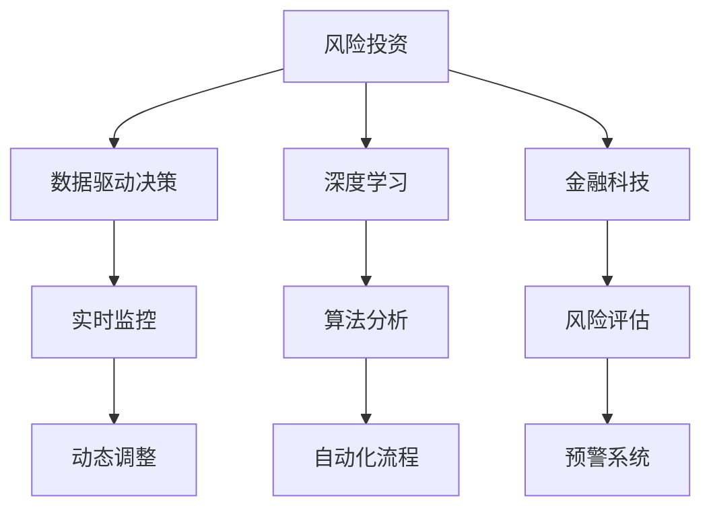

                 

# 利用技术洞察力进行风险投资

> 关键词：技术洞察力, 风险投资, 人工智能, 数据驱动决策, 深度学习, 算法分析, 金融科技, 风险管理

## 1. 背景介绍

### 1.1 问题由来
在当今快速变化的市场环境中，传统的风险投资方式面临着严峻的挑战。投资决策通常依赖于有限的人类经验，易于受情绪影响，难以处理大量复杂的数据。这种传统决策方式不仅效率低下，而且常常造成投资失误。为了提升风险投资的质量和效率，投资机构开始寻求新技术手段，以科技洞察力替代传统经验，驱动数据驱动的决策制定。

### 1.2 问题核心关键点
技术洞察力在风险投资中的应用，主要体现在以下几个方面：

1. **数据驱动的洞察**：通过收集、分析和应用大数据，发现新的投资机会和风险。
2. **算法辅助的决策**：利用深度学习、机器学习等先进算法，分析市场趋势和投资标的特征。
3. **实时监控与调整**：通过人工智能系统，实现对投资项目的实时监控和动态调整。
4. **自动化流程优化**：将投资流程自动化，提高效率，减少人为错误。
5. **风险评估与预警**：使用AI技术，评估投资风险，提前预警潜在风险。

## 2. 核心概念与联系

### 2.1 核心概念概述

为更好地理解技术洞察力在风险投资中的应用，本节将介绍几个密切相关的核心概念：

- **风险投资**：风险投资机构向具有发展潜力的初创企业提供资金支持，以获取股权回报。
- **数据驱动决策**：通过数据分析和建模，辅助或替代人类经验，进行科学决策。
- **深度学习**：一种机器学习算法，利用多层神经网络，自动提取复杂数据中的特征。
- **金融科技**：利用技术手段，如大数据、区块链、人工智能等，优化金融服务的创新和应用。
- **算法分析**：通过编写和执行算法，对数据进行处理和分析，以得出有用结论。

这些核心概念之间的逻辑关系可以通过以下Mermaid流程图来展示：



这个流程图展示风险投资的核心概念及其之间的关系：

1. 风险投资通过数据驱动决策来辅助投资决策，提高决策质量。
2. 深度学习用于大数据分析，提取特征，帮助理解和预测市场趋势。
3. 金融科技提供技术支持，提升服务效率和安全性。
4. 算法分析用于数据处理和模型构建，为决策提供科学依据。
5. 实时监控与动态调整确保投资决策的适应性和灵活性。
6. 自动化流程优化提高效率，减少人为误差。
7. 风险评估和预警系统提前发现风险，保护投资安全。

## 3. 核心算法原理 & 具体操作步骤
### 3.1 算法原理概述

基于技术洞察力的风险投资决策，主要依赖数据驱动的算法分析。具体流程如下：

1. **数据收集**：收集相关市场数据、公司财务数据、行业报告、新闻评论等，构建综合的数据库。
2. **数据预处理**：清洗数据，填补缺失值，转换数据格式，确保数据质量和一致性。
3. **特征提取**：利用深度学习等技术，从原始数据中提取关键特征。
4. **模型训练**：选择适合的机器学习模型，如决策树、随机森林、支持向量机、神经网络等，训练数据集，构建预测模型。
5. **模型评估与优化**：通过交叉验证、测试集等方式，评估模型性能，调整模型参数，优化模型效果。
6. **投资决策**：将模型应用于投资标的，结合专家经验，做出投资决策。

### 3.2 算法步骤详解

基于技术洞察力的风险投资决策流程如下：

**Step 1: 数据收集与预处理**
- 收集目标市场和行业的数据，如公司财务报表、行业报告、新闻文章、社交媒体评论等。
- 清洗数据，去除重复、错误、无关的信息，填补缺失值，统一数据格式。
- 对文本数据进行分词、词性标注、命名实体识别等预处理，转换为结构化数据。

**Step 2: 特征提取**
- 使用深度学习模型，如卷积神经网络（CNN）、循环神经网络（RNN）、Transformer等，提取文本数据的特征。
- 特征可以包括词频、TF-IDF、词向量等统计特征，也可以包括基于模型的高级特征。

**Step 3: 模型训练与评估**
- 选择适当的机器学习算法，如逻辑回归、决策树、随机森林、支持向量机等，构建模型。
- 使用训练集进行模型训练，调整模型参数，优化模型效果。
- 使用测试集对模型进行评估，计算准确率、召回率、F1值等指标，确定最佳模型。

**Step 4: 投资决策**
- 将模型应用于投资标的，计算每个投资标的预测得分。
- 结合专家经验和投资策略，选择得分最高的投资标的，做出投资决策。
- 实时监控投资标的性能，根据实际情况动态调整投资策略。

### 3.3 算法优缺点

基于技术洞察力的风险投资决策方法具有以下优点：
1. **数据驱动**：利用数据和算法，降低决策过程中的人为干扰，提高决策科学性。
2. **高效性**：自动化流程提高了决策效率，减少了人力成本和时间成本。
3. **客观性**：模型结果不受情绪和主观判断的影响，决策更加客观。
4. **可解释性**：通过特征提取和模型解释，可以清楚地理解决策依据。

同时，该方法也存在一定的局限性：
1. **数据依赖**：模型的性能依赖于数据的质量和数量，数据不充分或数据偏差可能影响结果。
2. **复杂性**：构建和维护复杂的算法模型需要高水平的技术团队，增加了投资成本。
3. **黑箱问题**：深度学习等模型具有较强的"黑箱"特性，难以解释其内部决策逻辑。
4. **过拟合风险**：如果模型过度拟合训练数据，可能在实际应用中表现不佳。

尽管存在这些局限性，但技术洞察力在风险投资中的应用正迅速成为主流趋势，特别是在数据丰富和科技发达的领域。未来相关研究的重点在于如何进一步优化模型性能，降低对数据的依赖，提高模型的可解释性和鲁棒性。

### 3.4 算法应用领域

基于技术洞察力的风险投资决策方法，在多个领域得到了广泛应用：

- **科技初创企业**：利用大数据和深度学习，评估创业公司的技术潜力和市场前景。
- **金融市场**：分析股票、债券、商品等金融产品的价格趋势和风险，制定投资策略。
- **房地产**：预测房价走势，分析投资回报，优化投资组合。
- **健康医疗**：评估医疗机构的财务状况和运营效率，预测医疗市场趋势。
- **新能源**：分析太阳能、风能等新能源技术的发展前景和投资回报。

除了上述这些经典应用外，技术洞察力还被创新性地应用于更多新兴领域，如自动驾驶、智能制造、量子计算等，为风险投资带来了新的视角和方法。随着数据和技术的不断演进，相信技术洞察力将在更多领域得到应用，为风险投资决策提供更科学、更可靠的支持。

## 4. 数学模型和公式 & 详细讲解 & 举例说明
### 4.1 数学模型构建

本节将使用数学语言对基于技术洞察力的风险投资决策过程进行更加严格的刻画。

记目标市场的数据集为 $\mathcal{D}=\{(x_i, y_i)\}_{i=1}^N, x_i \in \mathcal{X}, y_i \in \mathcal{Y}$，其中 $x_i$ 为输入特征，$y_i$ 为投资标的的风险评分。

定义模型 $M_{\theta}$ 在输入 $x$ 上的输出为 $y=M_{\theta}(x)$，其中 $\theta$ 为模型参数。风险投资决策的目标是最小化风险，即找到最优模型参数 $\theta^*$，使得：

$$
\theta^* = \mathop{\arg\min}_{\theta} \mathcal{L}(\theta)
$$

其中 $\mathcal{L}$ 为损失函数，用于衡量模型预测风险评分与实际风险评分之间的差异。

### 4.2 公式推导过程

以逻辑回归为例，进行详细推导。

假设模型 $M_{\theta}$ 为逻辑回归模型，其输出为：

$$
y = \sigma(\theta^T x + b)
$$

其中 $\sigma$ 为 sigmoid 函数，$\theta$ 为模型参数，$x$ 为输入特征。

则模型在单个样本 $(x_i, y_i)$ 上的损失函数为：

$$
\ell(M_{\theta}(x_i),y_i) = -(y_i\log M_{\theta}(x_i) + (1-y_i)\log(1-M_{\theta}(x_i)))
$$

在训练集中应用交叉熵损失函数，得到经验风险为：

$$
\mathcal{L}(\theta) = -\frac{1}{N}\sum_{i=1}^N \ell(M_{\theta}(x_i),y_i)
$$

根据梯度下降优化算法，更新模型参数 $\theta$，使得损失函数最小化：

$$
\theta \leftarrow \theta - \eta \nabla_{\theta}\mathcal{L}(\theta)
$$

其中 $\eta$ 为学习率，$\nabla_{\theta}\mathcal{L}(\theta)$ 为损失函数对模型参数的梯度，可通过反向传播算法高效计算。

在得到损失函数的梯度后，即可带入参数更新公式，完成模型的迭代优化。重复上述过程直至收敛，最终得到适应目标市场投资风险的最优模型参数 $\theta^*$。

### 4.3 案例分析与讲解

以金融市场的股票投资为例，进行详细讲解。

假设某投资机构需要预测A股市场的股票投资风险，其数据集为历史股价、财务报表、行业报告等。构建逻辑回归模型，通过以下步骤进行训练和应用：

**Step 1: 数据收集与预处理**
- 收集A股市场的历史股价、财务报表、行业报告、新闻评论等数据。
- 清洗数据，去除重复、错误、无关的信息，填补缺失值，统一数据格式。
- 对文本数据进行分词、词性标注、命名实体识别等预处理，转换为结构化数据。

**Step 2: 特征提取**
- 使用深度学习模型，如卷积神经网络（CNN）、循环神经网络（RNN）、Transformer等，提取文本数据的特征。
- 特征可以包括词频、TF-IDF、词向量等统计特征，也可以包括基于模型的高级特征。

**Step 3: 模型训练与评估**
- 选择逻辑回归算法，构建模型。
- 使用训练集进行模型训练，调整模型参数，优化模型效果。
- 使用测试集对模型进行评估，计算准确率、召回率、F1值等指标，确定最佳模型。

**Step 4: 投资决策**
- 将模型应用于A股市场股票，计算每个股票的预测得分。
- 结合专家经验和投资策略，选择得分最高的股票，做出投资决策。
- 实时监控股票表现，根据实际情况动态调整投资策略。

## 5. 项目实践：代码实例和详细解释说明
### 5.1 开发环境搭建

在进行风险投资技术实现前，我们需要准备好开发环境。以下是使用Python进行Scikit-learn开发的环境配置流程：

1. 安装Anaconda：从官网下载并安装Anaconda，用于创建独立的Python环境。

2. 创建并激活虚拟环境：
```bash
conda create -n pytorch-env python=3.8 
conda activate pytorch-env
```

3. 安装Scikit-learn：
```bash
conda install scikit-learn
```

4. 安装各类工具包：
```bash
pip install numpy pandas scikit-learn matplotlib tqdm jupyter notebook ipython
```

完成上述步骤后，即可在`pytorch-env`环境中开始风险投资技术实现。

### 5.2 源代码详细实现

下面我们以金融市场的股票投资为例，给出使用Scikit-learn对股票市场进行风险预测的Python代码实现。

首先，定义股票市场的数据处理函数：

```python
from sklearn.preprocessing import MinMaxScaler
from sklearn.model_selection import train_test_split
from sklearn.linear_model import LogisticRegression
from sklearn.metrics import accuracy_score, precision_score, recall_score, f1_score

def preprocess_data(data):
    # 数据清洗
    data = data.dropna()
    # 特征选择
    features = data[['P/E ratio', 'EPS', 'ROE', 'Revenue growth', 'Price volatility']]
    labels = data['risk_score']
    # 数据标准化
    scaler = MinMaxScaler(feature_range=(0, 1))
    features = scaler.fit_transform(features)
    return features, labels

def train_model(X_train, y_train):
    model = LogisticRegression()
    model.fit(X_train, y_train)
    return model

def evaluate_model(model, X_test, y_test):
    y_pred = model.predict(X_test)
    accuracy = accuracy_score(y_test, y_pred)
    precision = precision_score(y_test, y_pred)
    recall = recall_score(y_test, y_pred)
    f1 = f1_score(y_test, y_pred)
    return accuracy, precision, recall, f1

# 加载数据
data = pd.read_csv('stock_data.csv')

# 数据预处理
features, labels = preprocess_data(data)

# 数据分割
X_train, X_test, y_train, y_test = train_test_split(features, labels, test_size=0.2, random_state=42)

# 模型训练
model = train_model(X_train, y_train)

# 模型评估
accuracy, precision, recall, f1 = evaluate_model(model, X_test, y_test)

print(f"Accuracy: {accuracy:.3f}")
print(f"Precision: {precision:.3f}")
print(f"Recall: {recall:.3f}")
print(f"F1-score: {f1:.3f}")
```

以上代码展示了从数据预处理到模型训练和评估的完整流程。使用Scikit-learn的LogisticRegression模型，结合数据标准化和特征选择技术，实现了对股票市场风险的预测。

### 5.3 代码解读与分析

让我们再详细解读一下关键代码的实现细节：

**preprocess_data函数**：
- 数据清洗：去除缺失值。
- 特征选择：选择P/E ratio、EPS、ROE、Revenue growth、Price volatility作为模型输入特征。
- 数据标准化：使用MinMaxScaler将特征值标准化到[0,1]区间。

**train_model函数**：
- 使用LogisticRegression算法，训练模型。
- 返回训练好的模型。

**evaluate_model函数**：
- 对测试集进行预测。
- 计算模型的准确率、精确率、召回率和F1分数。
- 返回评估结果。

**数据加载和预处理**：
- 使用pandas加载股票数据。
- 调用preprocess_data函数进行数据预处理。

**模型训练和评估**：
- 使用train_test_split将数据集分割为训练集和测试集。
- 调用train_model函数训练模型。
- 调用evaluate_model函数评估模型性能。

可以看到，Scikit-learn提供了丰富的机器学习模型和评估指标，使得模型构建和性能评估变得简洁高效。开发者可以将更多精力放在数据处理和业务逻辑上，而不必过多关注底层的实现细节。

当然，实际应用中还需要考虑更多因素，如数据隐私、模型部署、异常处理等。但核心的风险投资决策流程基本与此类似。

## 6. 实际应用场景
### 6.1 智能投顾

智能投顾系统利用技术洞察力，结合大数据和深度学习，提供个性化的投资建议和风险管理服务。智能投顾可以自动分析用户财务状况、风险偏好和市场趋势，生成适合用户的投资组合和风险控制策略。

在技术实现上，可以收集用户的历史交易数据、财务报表、新闻评论等，构建综合的数据集。利用深度学习等技术，提取关键特征，构建预测模型。智能投顾系统根据用户输入，实时提供投资建议，动态调整投资组合，确保风险可控。

### 6.2 量化交易

量化交易系统使用技术洞察力，自动分析市场数据，发现投资机会，实现高频交易和套利。量化交易系统通过构建复杂的数学模型，预测市场趋势，生成买卖信号，自动化执行交易操作。

在技术实现上，可以收集历史股价、交易量、财务报表等数据，构建综合的数据集。利用深度学习等技术，提取关键特征，构建预测模型。量化交易系统根据模型预测结果，自动生成交易策略，执行买卖操作，实现高收益和高风险平衡。

### 6.3 风险管理

风险管理是金融机构的重要职责之一。传统风险管理依赖于人工经验，难以应对复杂多变的环境。技术洞察力结合大数据和深度学习，为风险管理提供科学依据和高效手段。

在技术实现上，可以收集金融市场的历史数据、公司财务报表、行业报告等，构建综合的数据集。利用深度学习等技术，提取关键特征，构建预测模型。风险管理系统根据模型预测结果，实时监控市场风险，动态调整投资组合，确保金融稳定。

### 6.4 未来应用展望

随着技术的不断发展，基于技术洞察力的风险投资决策将呈现以下几个发展趋势：

1. **实时化**：通过云计算和边缘计算，实现对市场的实时分析和实时决策，提升投资效率。
2. **智能化**：结合人工智能和自然语言处理，实现对复杂多变市场的智能分析，提高投资质量。
3. **集成化**：将风险投资决策与其他金融服务（如财富管理、保险等）集成，实现一站式金融服务。
4. **普适化**：将技术洞察力应用到更多新兴领域，如自动驾驶、智能制造、医疗健康等，拓展投资视角。

## 7. 工具和资源推荐
### 7.1 学习资源推荐

为了帮助开发者系统掌握技术洞察力在风险投资中的应用，这里推荐一些优质的学习资源：

1. 《Python for Finance》书籍：介绍如何使用Python进行金融数据分析和建模。
2. 《Machine Learning for Trading》书籍：详细讲解机器学习在量化交易中的应用。
3. Coursera的《Financial Engineering and Risk Management》课程：提供金融工程和风险管理的系统学习。
4 Kaggle的金融数据分析竞赛：通过实际项目，练习数据处理和模型构建。
5. 《Deep Learning for Trading》书籍：介绍深度学习在量化交易中的应用。

通过对这些资源的学习实践，相信你一定能够快速掌握技术洞察力在风险投资中的应用，并用于解决实际的金融问题。

### 7.2 开发工具推荐

高效的开发离不开优秀的工具支持。以下是几款用于技术洞察力实现的风险投资开发的常用工具：

1. Python：Python语言以其简洁易用、生态丰富、社区活跃等特点，成为风险投资技术实现的主流选择。
2. Scikit-learn：提供丰富的机器学习算法和评估指标，支持数据预处理和模型训练。
3. TensorFlow和PyTorch：先进的深度学习框架，支持复杂模型的构建和训练。
4. Jupyter Notebook：交互式编程环境，支持代码实现和数据分析。
5. Azure ML和Google Cloud AI：提供云端机器学习平台，支持模型训练、部署和监控。

合理利用这些工具，可以显著提升风险投资技术实现的开发效率，加快创新迭代的步伐。

### 7.3 相关论文推荐

技术洞察力在风险投资中的应用源于学界的持续研究。以下是几篇奠基性的相关论文，推荐阅读：

1. G. Hinton等人的《A Neural Probabilistic Language Model》：提出神经网络语言模型，奠定了深度学习的基础。
2. Y. Bengio等人的《Representation Learning: A Review and New Perspectives》：总结了深度学习在数据分析和建模中的应用。
3. H. Cover和J. Thomas的《Elements of Information Theory》：介绍信息论基本概念，为数据驱动决策提供理论基础。
4. P. S. Park等的《Machine Learning and Statistical Learning for Financial Applications》：详细介绍机器学习在金融领域的应用。
5. S. J. Angenent等的《Advances in Financial Machine Learning》：介绍金融科技在风险投资中的应用。

这些论文代表了大数据和深度学习在风险投资中的应用前沿。通过学习这些前沿成果，可以帮助研究者把握学科前进方向，激发更多的创新灵感。

## 8. 总结：未来发展趋势与挑战
### 8.1 总结

本文对基于技术洞察力的风险投资决策方法进行了全面系统的介绍。首先阐述了技术洞察力在风险投资中的应用背景和意义，明确了其在大数据和深度学习驱动下的科学决策优势。其次，从原理到实践，详细讲解了风险投资决策的数学模型和操作步骤，给出了完整的代码实例。同时，本文还广泛探讨了技术洞察力在智能投顾、量化交易、风险管理等多个领域的应用前景，展示了其巨大的潜力。此外，本文精选了技术洞察力相关的学习资源，力求为读者提供全方位的技术指引。

通过本文的系统梳理，可以看到，基于技术洞察力的风险投资决策方法正在成为风险投资的重要手段，极大地提升了投资决策的质量和效率。技术洞察力有望在未来更广泛地应用于金融科技领域，为金融市场的稳定和创新提供强有力的支撑。

### 8.2 未来发展趋势

展望未来，基于技术洞察力的风险投资决策将呈现以下几个发展趋势：

1. **算法自动化**：自动化风险投资决策流程，提高效率，减少人为干扰。
2. **数据多源融合**：结合多源数据，提升决策的全面性和准确性。
3. **实时化处理**：实现对市场数据的实时分析和实时决策，提高投资效率。
4. **智能化辅助**：结合自然语言处理、知识图谱等技术，提升投资决策的智能性。
5. **跨界融合**：将技术洞察力与其他科技手段（如区块链、物联网）集成，拓展应用范围。
6. **伦理合规**：注重数据隐私和算法透明，遵守法律法规，确保投资决策的合规性。

以上趋势凸显了技术洞察力在风险投资中的巨大前景。这些方向的探索发展，必将进一步提升风险投资决策的科学性和稳定性，为金融市场的健康发展提供有力支持。

### 8.3 面临的挑战

尽管技术洞察力在风险投资中的应用前景广阔，但在实际落地过程中，仍面临诸多挑战：

1. **数据隐私**：风险投资决策依赖于大量的敏感数据，如何保护数据隐私，避免数据泄露，是关键问题。
2. **模型可解释性**：深度学习等模型具有较强的"黑箱"特性，难以解释其内部决策逻辑，如何提高模型的可解释性，是技术应用的关键。
3. **模型鲁棒性**：在复杂多变的市场环境中，模型可能面临过拟合、泛化能力不足等问题，如何提高模型的鲁棒性，是技术实现的难点。
4. **计算资源**：技术洞察力需要强大的计算资源支持，如何降低计算成本，提高资源利用效率，是技术部署的重要问题。
5. **模型更新**：市场环境和数据分布不断变化，如何及时更新模型，保持其有效性，是技术维护的关键。

正视技术洞察力在风险投资中面临的这些挑战，积极应对并寻求突破，将是大规模应用的关键。相信随着技术的不断进步和研究的深入，这些挑战终将逐一解决，技术洞察力必将在风险投资决策中发挥更加重要的作用。

### 8.4 研究展望

未来，风险投资决策领域的技术洞察力研究将重点关注以下几个方向：

1. **模型可解释性**：开发更易于理解和解释的模型，增强算法的透明度和可信度。
2. **隐私保护**：研究数据隐私保护技术，确保数据使用的合规性和安全性。
3. **跨领域融合**：将技术洞察力与其他科技手段（如区块链、物联网）集成，拓展应用范围。
4. **实时化处理**：研究实时数据分析和决策技术，提升投资效率和响应速度。
5. **跨界应用**：将技术洞察力应用到更多新兴领域，如自动驾驶、智能制造、医疗健康等，拓展投资视角。

这些研究方向的探索，必将引领技术洞察力在风险投资决策中的进一步发展和应用，为金融市场的健康发展和创新提供更可靠的支持。总之，风险投资决策领域的技术洞察力研究需要跨学科的合作和创新，才能更好地应对复杂的市场环境，提升投资决策的科学性和稳定性。面向未来，我们有理由相信，技术洞察力将在风险投资决策中发挥更大的作用，推动金融科技的持续进步。

## 9. 附录：常见问题与解答

**Q1：如何选择合适的风险投资算法？**

A: 选择合适的风险投资算法应综合考虑以下因素：
1. 数据类型：不同类型的数据（如结构化数据、文本数据、时间序列数据）适合不同的算法。
2. 业务需求：根据实际业务需求，选择适合的模型（如回归、分类、聚类等）。
3. 数据规模：数据规模越大，越适合使用深度学习等算法。
4. 模型复杂度：根据数据复杂度，选择合适的模型（如简单线性回归、复杂深度神经网络等）。

**Q2：风险投资决策中的数据隐私问题如何解决？**

A: 解决数据隐私问题，可以采用以下策略：
1. 数据匿名化：通过数据加密、数据去标识化等手段，保护用户隐私。
2. 数据访问控制：采用访问控制机制，限制数据访问权限，确保数据安全。
3. 数据加密传输：通过数据加密技术，保护数据在传输过程中的安全性。
4. 数据安全审计：定期对数据使用情况进行安全审计，及时发现和修复漏洞。

**Q3：如何评估风险投资决策的模型性能？**

A: 评估风险投资决策的模型性能，可以采用以下指标：
1. 准确率：模型预测结果与实际结果的匹配度。
2. 精确率：模型预测为正样本的样本中，实际为正样本的比例。
3. 召回率：实际为正样本的样本中，模型预测为正样本的比例。
4. F1分数：综合考虑精确率和召回率，评估模型的整体性能。
5. AUC-ROC曲线：评估模型在不同阈值下的性能表现。

**Q4：风险投资决策中的模型可解释性问题如何解决？**

A: 解决模型可解释性问题，可以采用以下策略：
1. 特征工程：通过深入分析数据特征，构建易于解释的特征。
2. 模型简化：使用简单模型（如逻辑回归、决策树），降低模型的复杂度。
3. 模型解释工具：使用模型解释工具（如LIME、SHAP），揭示模型的决策过程。
4. 交互式可视化：通过交互式可视化界面，展示模型决策结果和特征贡献度。

**Q5：如何在风险投资决策中应用实时数据？**

A: 在风险投资决策中应用实时数据，可以采用以下策略：
1. 实时数据采集：通过实时数据采集技术，获取最新的市场数据。
2. 实时数据分析：使用实时数据分析工具（如Spark Streaming、Apache Flink），处理实时数据。
3. 实时决策系统：构建实时决策系统，根据实时数据动态调整投资策略。
4. 实时监控与预警：建立实时监控系统，及时发现和预警市场风险。

这些策略可以结合实际业务需求，灵活应用，提升风险投资决策的实时性和灵活性。

---

作者：禅与计算机程序设计艺术 / Zen and the Art of Computer Programming

