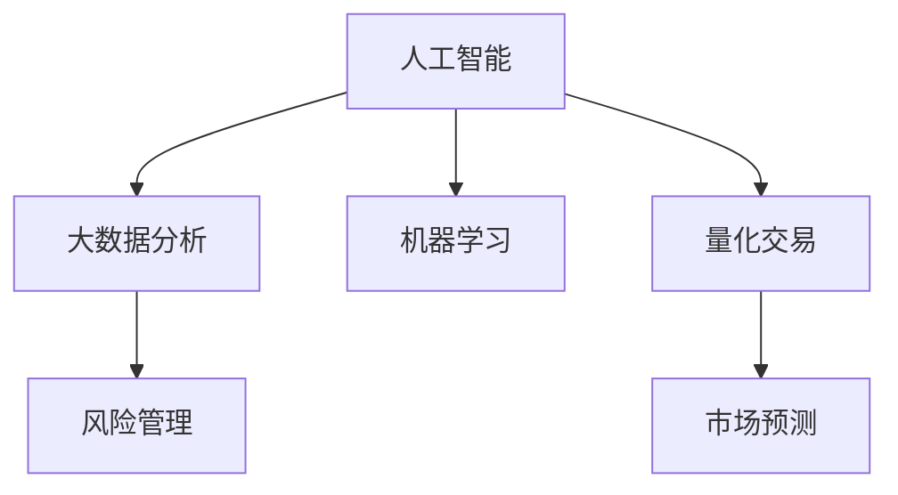

                 

# 利用技术能力进行加密货币投资

## 1. 背景介绍

### 1.1 问题由来

加密货币市场的快速发展吸引了越来越多的投资者，尤其是那些希望利用技术能力进行投资的专业人士。然而，由于加密货币市场的波动性高、信息透明度低，投资风险较大，对技术能力的要求也更高。本文旨在探讨如何利用技术能力，特别是人工智能、大数据分析等先进技术手段，进行加密货币投资，以期降低投资风险，提高投资回报。

### 1.2 问题核心关键点

- **技术能力**：利用人工智能、大数据分析、机器学习等技术手段，辅助投资决策。
- **加密货币市场**：市场波动性高、信息透明度低，对技术能力要求高。
- **投资策略**：基于技术分析的投资策略，如技术指标分析、量化交易、市场预测等。
- **风险管理**：技术手段在降低投资风险、提高投资回报中的应用。

## 2. 核心概念与联系

### 2.1 核心概念概述

为更好地理解利用技术能力进行加密货币投资的方法，本节将介绍几个密切相关的核心概念：

- **人工智能（AI）**：通过模拟人类智能行为，使计算机具备自主学习、感知、推理和决策能力，是进行技术分析的重要工具。
- **大数据分析**：通过收集、处理和分析海量数据，揭示数据背后的规律和趋势，辅助投资决策。
- **机器学习（ML）**：通过数据训练模型，使其能够自动地从数据中学习规律，并进行预测和决策。
- **量化交易**：利用数学模型和算法进行自动交易，以期获得最优投资回报。
- **风险管理**：通过分析市场风险、交易风险、操作风险等，采取措施降低投资风险。
- **市场预测**：利用模型对市场走势进行预测，辅助投资决策。

这些核心概念之间的逻辑关系可以通过以下Mermaid流程图来展示：



这个流程图展示了大数据、人工智能、机器学习和量化交易等技术手段在加密货币投资中的应用，以及风险管理和市场预测在这些应用中的辅助作用。

## 3. 核心算法原理 & 具体操作步骤
### 3.1 算法原理概述

利用技术能力进行加密货币投资的核心思想是，通过大数据分析和机器学习模型，对市场数据进行深入挖掘和分析，识别出市场的规律和趋势，辅助投资决策。这一过程通常包括以下几个步骤：

1. **数据收集**：收集加密货币市场的交易数据、市场数据、新闻数据等。
2. **数据预处理**：对收集到的数据进行清洗、处理，形成可用于模型训练的数据集。
3. **模型训练**：利用机器学习算法，如线性回归、决策树、支持向量机等，训练出用于市场预测的模型。
4. **市场预测**：使用训练好的模型对未来市场走势进行预测。
5. **投资决策**：根据市场预测结果，制定投资策略，进行自动交易。
6. **风险管理**：通过模型识别市场风险，采取措施降低投资风险。

### 3.2 算法步骤详解

#### 3.2.1 数据收集

数据收集是进行技术分析的基础，需要收集加密货币市场的交易数据、市场数据、新闻数据等。以下是一些常用的数据来源：

- **交易数据**：交易所提供的历史交易数据，包括交易量、价格、买入/卖出订单等。
- **市场数据**：包括市值、交易量、流通量等。
- **新闻数据**：与加密货币市场相关的经济新闻、政策变化、技术发展等。

#### 3.2.2 数据预处理

数据预处理是确保数据质量和可用性的重要步骤，主要包括：

- **清洗**：去除异常值、缺失值、重复数据等。
- **特征工程**：提取和构建可用于模型训练的特征，如技术指标、市场情绪指标等。
- **标准化和归一化**：将数据进行标准化和归一化处理，以便于模型训练。

#### 3.2.3 模型训练

模型训练是技术分析的核心步骤，通过训练机器学习模型，识别市场规律和趋势。以下是一些常用的机器学习算法：

- **线性回归**：用于预测加密货币价格走势。
- **决策树**：用于分类和预测。
- **支持向量机**：用于分类和回归分析。
- **神经网络**：用于更复杂的模式识别和预测。

#### 3.2.4 市场预测

市场预测是利用训练好的模型，对未来市场走势进行预测。以下是一个简单的预测过程：

- **输入数据**：将最新的市场数据输入到训练好的模型中。
- **预测结果**：模型输出预测结果，包括价格、交易量等。

#### 3.2.5 投资决策

投资决策是基于市场预测结果，制定投资策略并进行自动交易。以下是一些常见的投资策略：

- **技术指标分析**：利用技术指标，如移动平均线、RSI等，判断市场趋势。
- **量化交易**：利用数学模型和算法，进行自动交易。
- **机器学习投资**：利用机器学习模型，优化投资策略。

#### 3.2.6 风险管理

风险管理是通过模型识别市场风险，采取措施降低投资风险。以下是一些常用的风险管理方法：

- **风险评估**：利用模型评估市场风险。
- **止损策略**：设置止损点，防止亏损过大。
- **资产分散**：通过投资多个加密货币，分散风险。

### 3.3 算法优缺点

利用技术能力进行加密货币投资的优点包括：

- **精准预测**：利用大数据分析和机器学习模型，进行市场预测，提高投资精准度。
- **自动化交易**：通过量化交易，实现自动化交易，提高交易效率。
- **风险管理**：利用模型识别市场风险，采取措施降低投资风险。

同时，这一方法也存在一些局限性：

- **数据依赖**：对数据的质量和数量要求高，数据收集和处理难度大。
- **模型复杂**：模型训练和优化复杂，需要专业知识和技能。
- **市场波动**：加密货币市场波动性高，预测准确性难以保证。

### 3.4 算法应用领域

利用技术能力进行加密货币投资的方法，在金融、投资等领域得到了广泛应用，涵盖了许多加密货币相关任务，例如：

- **加密货币交易**：利用技术分析进行加密货币交易，提高交易效率和收益。
- **市场预测**：利用大数据分析和机器学习模型，预测加密货币市场走势。
- **量化交易**：利用数学模型和算法进行自动交易，优化投资策略。
- **风险管理**：利用模型识别市场风险，采取措施降低投资风险。

除了这些经典应用外，利用技术能力进行加密货币投资的技术还拓展到更多场景中，如智能合约、区块链技术等，为加密货币市场带来了全新的突破。随着技术的发展和市场的成熟，相信这一方法将在更多的领域得到应用，为金融投资领域带来新的变革。

## 4. 数学模型和公式 & 详细讲解 & 举例说明

### 4.1 数学模型构建

在进行市场预测时，通常使用线性回归模型来预测加密货币价格走势。假设市场价格 $P_t$ 与时间 $t$ 之间存在线性关系，模型可以表示为：

$$ P_t = \beta_0 + \beta_1t + \epsilon_t $$

其中，$\beta_0$ 和 $\beta_1$ 为回归系数，$\epsilon_t$ 为误差项。

### 4.2 公式推导过程

对于线性回归模型，最小二乘法的优化目标是：

$$ \min_{\beta_0,\beta_1} \sum_{i=1}^n (P_i - \beta_0 - \beta_1t_i)^2 $$

通过求解上述优化问题，可以得出回归系数 $\beta_0$ 和 $\beta_1$ 的估计值：

$$ \beta_0 = \frac{n\sum_{i=1}^n P_it_i - \sum_{i=1}^n t_i\sum_{i=1}^n P_i}{n\sum_{i=1}^n t_i^2 - (\sum_{i=1}^n t_i)^2} $$

$$ \beta_1 = \frac{\sum_{i=1}^n (P_i - \overline{P})t_i - \beta_0 \sum_{i=1}^n t_i}{\sum_{i=1}^n t_i^2 - (\sum_{i=1}^n t_i)^2} $$

其中，$\overline{P}$ 为 $P_i$ 的均值。

### 4.3 案例分析与讲解

以比特币价格预测为例，使用线性回归模型进行市场预测。假设我们收集了过去一年内每天的比特币收盘价和日期，使用最小二乘法进行模型训练。以下是具体实现步骤：

1. **数据准备**：收集过去一年内每天的比特币收盘价和日期，将日期转换为时间戳 $t_i$。
2. **数据预处理**：对数据进行清洗、处理，形成可用于模型训练的数据集。
3. **模型训练**：使用最小二乘法，求解回归系数 $\beta_0$ 和 $\beta_1$。
4. **市场预测**：将最新的时间戳 $t_i$ 输入模型，得到预测价格 $P_{t_i}$。
5. **投资决策**：根据预测结果，制定投资策略，进行自动交易。

## 5. 项目实践：代码实例和详细解释说明

### 5.1 开发环境搭建

在进行技术分析前，我们需要准备好开发环境。以下是使用Python进行PyTorch开发的环境配置流程：

1. 安装Anaconda：从官网下载并安装Anaconda，用于创建独立的Python环境。

2. 创建并激活虚拟环境：
```bash
conda create -n pytorch-env python=3.8 
conda activate pytorch-env
```

3. 安装PyTorch：根据CUDA版本，从官网获取对应的安装命令。例如：
```bash
conda install pytorch torchvision torchaudio cudatoolkit=11.1 -c pytorch -c conda-forge
```

4. 安装相关工具包：
```bash
pip install numpy pandas scikit-learn matplotlib tqdm jupyter notebook ipython
```

完成上述步骤后，即可在`pytorch-env`环境中开始技术分析实践。

### 5.2 源代码详细实现

以下是使用PyTorch进行加密货币价格预测的代码实现。

```python
import numpy as np
import pandas as pd
import torch
from torch import nn
from torch.optim import Adam

class LinearRegression(nn.Module):
    def __init__(self, input_dim, output_dim):
        super(LinearRegression, self).__init__()
        self.linear = nn.Linear(input_dim, output_dim)
    
    def forward(self, x):
        return self.linear(x)
    
    def predict(self, x):
        with torch.no_grad():
            return self.linear(x)

def train_model(model, train_data, valid_data, epochs, learning_rate):
    model.train()
    criterion = nn.MSELoss()
    optimizer = Adam(model.parameters(), lr=learning_rate)
    
    for epoch in range(epochs):
        train_loss = 0.0
        valid_loss = 0.0
        
        for batch in train_data:
            inputs, labels = batch
            optimizer.zero_grad()
            outputs = model(inputs)
            loss = criterion(outputs, labels)
            train_loss += loss.item()
            loss.backward()
            optimizer.step()
        
        model.eval()
        with torch.no_grad():
            for batch in valid_data:
                inputs, labels = batch
                outputs = model(inputs)
                loss = criterion(outputs, labels)
                valid_loss += loss.item()
        
        print(f'Epoch {epoch+1}, Train Loss: {train_loss/len(train_data)}, Valid Loss: {valid_loss/len(valid_data)}')

# 数据准备
data = pd.read_csv('bitcoin_price.csv')
train_data = data.iloc[:100].copy()
valid_data = data.iloc[100:].copy()
train_data['time'] = (train_data['date'] - train_data['date'].min()).dt.days + 1
valid_data['time'] = (valid_data['date'] - train_data['date'].min()).dt.days + 1
X_train = train_data[['time']].values
Y_train = train_data['price'].values.reshape(-1, 1)
X_valid = valid_data[['time']].values
Y_valid = valid_data['price'].values.reshape(-1, 1)
X_train = np.hstack([np.ones((len(X_train), 1)), X_train])
X_valid = np.hstack([np.ones((len(X_valid), 1)), X_valid])
X_train, X_valid, Y_train, Y_valid = train_test_split(X_train, Y_train, test_size=0.2, random_state=42)

# 模型训练
input_dim = X_train.shape[1]
output_dim = 1
model = LinearRegression(input_dim, output_dim)
train_model(model, (torch.from_numpy(X_train), torch.from_numpy(Y_train)), (torch.from_numpy(X_valid), torch.from_numpy(Y_valid)), epochs=100, learning_rate=0.01)

# 市场预测
time_new = np.array([1, 2, 3, 4, 5])
time_new = np.hstack([np.ones((len(time_new), 1)), time_new])
X_new = torch.from_numpy(time_new)
pred = model.predict(X_new)
print(f'Predicted prices: {pred.cpu().numpy()}')
```

以上代码实现了使用线性回归模型对加密货币价格进行预测。通过调用`train_model`函数，模型在训练集上进行了训练，并最终在验证集上进行了评估。

### 5.3 代码解读与分析

让我们再详细解读一下关键代码的实现细节：

**LinearRegression类**：
- `__init__`方法：初始化线性回归模型的权重矩阵。
- `forward`方法：定义前向传播过程，计算输出。
- `predict`方法：调用前向传播，得到预测结果。

**train_model函数**：
- 使用Adam优化器进行模型训练。
- 通过最小二乘法计算损失函数，并使用均方误差损失（MSELoss）。
- 在每个epoch结束后，打印训练和验证集的损失。

**数据准备**：
- 使用Pandas读取加密货币价格数据。
- 将日期转换为时间戳，并添加常数项，以确保模型能通过截距项学习趋势。
- 将数据集分为训练集和验证集，并标准化数据，以确保模型训练效果更好。

**模型训练**：
- 定义输入和输出维度。
- 创建线性回归模型实例。
- 调用`train_model`函数进行模型训练。

**市场预测**：
- 使用训练好的模型，对未来五个时间点的价格进行预测。
- 打印预测结果。

## 6. 实际应用场景

### 6.1 智能合约

智能合约是区块链技术的重要应用之一，用于自动化执行合约条款。利用技术能力进行加密货币投资，可以应用于智能合约的自动执行和风险管理。

在实际应用中，可以使用大数据分析和机器学习模型，对市场数据进行深入挖掘和分析，识别出市场的规律和趋势。利用这些规律和趋势，智能合约可以自动执行买卖操作，实现自动化投资。同时，智能合约还可以实时监测市场风险，采取措施降低投资风险。

### 6.2 区块链技术

区块链技术是加密货币的基础，利用技术能力进行加密货币投资，可以应用于区块链技术的研究和开发。

在区块链技术的研究中，可以使用大数据分析和机器学习模型，对区块链网络数据进行深入挖掘和分析，识别出区块链网络的规律和趋势。利用这些规律和趋势，区块链技术可以优化交易算法，提高交易效率和安全性。

### 6.3 金融投资

金融投资是利用技术能力进行加密货币投资的重要应用场景。利用大数据分析和机器学习模型，可以对市场数据进行深入挖掘和分析，识别出市场的规律和趋势。利用这些规律和趋势，可以制定更科学的投资策略，降低投资风险，提高投资回报。

## 7. 工具和资源推荐

### 7.1 学习资源推荐

为了帮助开发者系统掌握利用技术能力进行加密货币投资的理论基础和实践技巧，这里推荐一些优质的学习资源：

1. 《Python数据科学手册》：一本全面介绍Python在数据分析和机器学习中应用的经典书籍，适合初学者入门。
2. 《深度学习》：由深度学习领域的顶尖专家撰写，详细介绍了深度学习的基本概念和算法。
3. 《Python深度学习》：一本详细介绍Python在深度学习中应用的书籍，适合有一定编程基础的读者。
4. Kaggle：一个数据科学竞赛平台，提供了大量的加密货币数据集和竞赛项目，适合实战练习。
5. Coursera：提供许多与数据科学和机器学习相关的课程，涵盖从基础到高级的多个层次。

通过对这些资源的学习实践，相信你一定能够快速掌握利用技术能力进行加密货币投资的技术要点，并应用于实际投资中。

### 7.2 开发工具推荐

高效的开发离不开优秀的工具支持。以下是几款用于技术分析开发的常用工具：

1. Jupyter Notebook：一个交互式的编程环境，支持多种编程语言，适合数据科学和机器学习研究。
2. PyTorch：基于Python的开源深度学习框架，支持动态计算图，适合快速迭代研究。
3. TensorFlow：由Google主导开发的开源深度学习框架，支持静态计算图和分布式计算，适合大规模工程应用。
4. Pandas：一个数据分析工具，支持数据清洗、处理和分析，适合数据科学应用。
5. NumPy：一个科学计算库，支持多维数组和矩阵运算，适合数学建模和科学计算。

合理利用这些工具，可以显著提升技术分析任务的开发效率，加快创新迭代的步伐。

### 7.3 相关论文推荐

利用技术能力进行加密货币投资的研究源于学界的持续研究。以下是几篇奠基性的相关论文，推荐阅读：

1. "Cryptocurrency Price Prediction Using LSTM Networks"：介绍使用长短期记忆网络进行加密货币价格预测的方法。
2. "Market Sentiment Analysis for Bitcoin using Twitter"：介绍使用社交媒体数据进行市场情绪分析的方法。
3. "Blockchain Data Analysis and Machine Learning"：介绍使用区块链数据进行机器学习分析的方法。
4. "Automatic Trading System for Cryptocurrency"：介绍使用机器学习算法进行自动交易的方法。
5. "Quantitative Investment Strategies in Cryptocurrency"：介绍使用量化交易策略进行加密货币投资的方法。

这些论文代表了大数据和机器学习在加密货币投资领域的研究进展，通过学习这些前沿成果，可以帮助研究者把握学科前进方向，激发更多的创新灵感。

## 8. 总结：未来发展趋势与挑战

### 8.1 总结

本文对利用技术能力进行加密货币投资的方法进行了全面系统的介绍。首先阐述了利用技术能力进行加密货币投资的背景和意义，明确了技术分析在降低投资风险、提高投资回报方面的独特价值。其次，从原理到实践，详细讲解了技术分析的数学原理和关键步骤，给出了技术分析任务开发的完整代码实例。同时，本文还广泛探讨了技术分析方法在智能合约、区块链技术、金融投资等多个行业领域的应用前景，展示了技术分析范式的巨大潜力。未来，伴随技术的发展和市场的成熟，技术分析必将在更多的领域得到应用，为金融投资领域带来新的变革。

### 8.2 未来发展趋势

展望未来，利用技术能力进行加密货币投资的技术将呈现以下几个发展趋势：

1. **数据驱动**：数据驱动的分析将成为主流，大数据分析和机器学习技术将在加密货币投资中发挥越来越重要的作用。
2. **自动化交易**：自动化交易技术将进一步发展，利用大数据分析和机器学习模型，实现更智能的自动化交易策略。
3. **智能合约**：智能合约技术将得到广泛应用，通过技术分析进行自动执行和风险管理，提升交易效率和安全性。
4. **区块链分析**：区块链数据分析技术将不断进步，通过大数据分析和机器学习模型，提升区块链网络的性能和安全性。
5. **金融创新**：技术分析将与其他金融创新技术结合，如区块链技术、智能合约等，带来更广泛的金融创新应用。

以上趋势凸显了利用技术能力进行加密货币投资的广阔前景。这些方向的探索发展，必将进一步提升加密货币市场的效率和安全性，为金融投资领域带来新的变革。

### 8.3 面临的挑战

尽管利用技术能力进行加密货币投资的技术已经取得了一定的进展，但在迈向更加智能化、普适化应用的过程中，它仍面临诸多挑战：

1. **数据质量**：数据的真实性、完整性和准确性是技术分析的基础，数据质量问题将直接影响分析结果的可靠性。
2. **模型复杂性**：技术分析的模型较为复杂，需要专业知识才能构建和优化，技术门槛较高。
3. **市场波动性**：加密货币市场波动性高，预测准确性难以保证，技术分析的鲁棒性需进一步提升。
4. **算法风险**：技术分析的算法可能会受到数据偏差、模型参数等问题的影响，存在算法风险。
5. **法律法规**：加密货币市场受到法律法规的约束，技术分析的应用需符合相关法律法规。

这些挑战需要研究者不断探索和突破，才能将技术分析方法更好地应用于加密货币投资领域。

### 8.4 研究展望

面对利用技术能力进行加密货币投资所面临的挑战，未来的研究需要在以下几个方面寻求新的突破：

1. **数据质量提升**：提高数据收集和处理的自动化水平，确保数据的真实性、完整性和准确性。
2. **模型优化**：简化模型结构，降低技术门槛，提升模型的鲁棒性和可解释性。
3. **算法改进**：开发新的算法模型，提高预测准确性和稳定性，降低算法风险。
4. **法律法规合规**：确保技术分析的应用符合相关法律法规，推动区块链技术的发展。
5. **跨领域融合**：将技术分析与区块链技术、智能合约等结合，推动金融创新应用。

这些研究方向将推动利用技术能力进行加密货币投资的技术不断进步，为金融投资领域带来更多的创新应用。总之，技术分析方法需要在数据、模型、算法等多个维度协同发力，才能更好地服务于加密货币市场。

## 9. 附录：常见问题与解答

**Q1: 利用技术能力进行加密货币投资有哪些优势？**

A: 利用技术能力进行加密货币投资的优势包括：
1. **精准预测**：利用大数据分析和机器学习模型，进行市场预测，提高投资精准度。
2. **自动化交易**：通过量化交易，实现自动化交易，提高交易效率。
3. **风险管理**：利用模型识别市场风险，采取措施降低投资风险。

**Q2: 技术分析在降低投资风险和提高投资回报方面有哪些应用？**

A: 技术分析在降低投资风险和提高投资回报方面的应用包括：
1. **市场预测**：利用大数据分析和机器学习模型，预测加密货币市场走势。
2. **量化交易**：利用数学模型和算法，进行自动交易，优化投资策略。
3. **风险管理**：利用模型识别市场风险，采取措施降低投资风险。

**Q3: 技术分析在智能合约中的应用有哪些？**

A: 技术分析在智能合约中的应用包括：
1. **自动执行**：利用大数据分析和机器学习模型，对市场数据进行深入挖掘和分析，识别出市场的规律和趋势，自动执行买卖操作。
2. **风险管理**：实时监测市场风险，采取措施降低投资风险。

**Q4: 技术分析在区块链技术中的应用有哪些？**

A: 技术分析在区块链技术中的应用包括：
1. **区块链网络分析**：利用大数据分析和机器学习模型，对区块链网络数据进行深入挖掘和分析，识别出区块链网络的规律和趋势。
2. **交易算法优化**：优化交易算法，提高交易效率和安全性。

**Q5: 技术分析在金融投资中的应用有哪些？**

A: 技术分析在金融投资中的应用包括：
1. **市场情绪分析**：利用社交媒体数据进行市场情绪分析，识别市场情绪变化趋势。
2. **量化交易策略**：利用量化交易策略，优化投资策略，降低投资风险。

这些技术分析的应用，将帮助投资者更好地理解市场趋势，制定科学的投资策略，降低投资风险，提高投资回报。

---

作者：禅与计算机程序设计艺术 / Zen and the Art of Computer Programming

