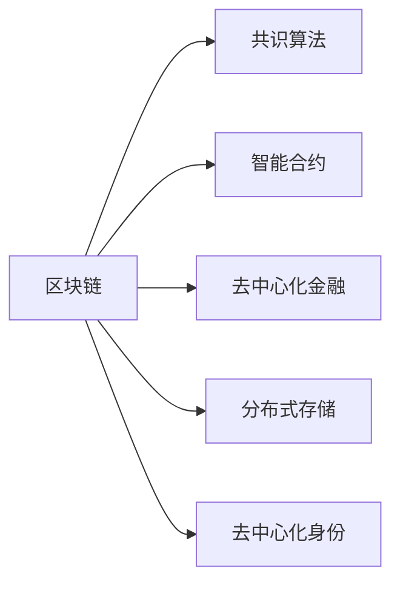

                 

# 区块链技术：程序员的新财富机遇

## 1. 背景介绍

### 1.1 问题由来
区块链技术的兴起，使得程序员拥有了一个全新的财富机遇。随着去中心化、透明化和安全性的需求日益增长，全球范围内对于区块链技术的需求不断扩大。加密货币、智能合约、去中心化金融(DeFi)、供应链管理等领域的蓬勃发展，为程序员提供了广阔的舞台。

区块链技术的核心在于其底层的数据分布式账本，即“区块链”。它由多个节点共同维护，通过密码学手段保障数据的安全性和不可篡改性，实现了点对点的信任机制。这种特性使得区块链能够构建出无需中介的信任体系，极大地降低了交易成本和提高了效率。

### 1.2 问题核心关键点
当前区块链技术的商业应用主要集中在以下几个领域：

1. **加密货币**：如比特币、以太坊等，它们是区块链技术的最早应用，也为程序员提供了丰富的区块链开发场景。
2. **智能合约**：能够在区块链上自动执行的代码，如以太坊的Solidity语言，为程序员提供了构建自动合约的全新机遇。
3. **去中心化金融(DeFi)**：构建在区块链上的金融服务，如借贷、交易、保险等，为程序员提供了构建去中心化金融应用的平台。
4. **供应链管理**：通过区块链实现供应链透明化、可追溯性，为程序员提供了构建供应链管理系统的机会。
5. **物联网(IoT)**：通过区块链实现物联网设备间的信任和互操作性，为程序员提供了构建IoT解决方案的机会。

这些领域的应用为程序员提供了丰富的挑战和机遇，推动了区块链技术的发展。

### 1.3 问题研究意义
区块链技术的应用不仅局限于金融和供应链，其分布式、透明、不可篡改的特性，使得它在医疗、教育、政府、公共服务等多个领域具有巨大的潜力。程序员通过参与区块链技术的开发和应用，不仅能够获得丰厚的技术收入，更能够在提升技术水平的同时，推动社会的进步和发展。

## 2. 核心概念与联系

### 2.1 核心概念概述

为了更好地理解区块链技术，本节将介绍几个核心概念：

- **区块链(Blockchain)**：一种去中心化的分布式账本技术，通过时间戳和散列函数保证数据的不可篡改性。
- **共识算法(Consensus Algorithm)**：保证区块链网络中所有节点对数据的一致性达成共识的算法，如PoW(工作量证明)、PoS(权益证明)等。
- **智能合约(Smart Contract)**：一种基于区块链的代码，能够在区块链上自动执行，具有自我执行、不可篡改的特性。
- **去中心化金融(DeFi)**：基于区块链技术的金融服务，如借贷、交易、保险等，旨在去除中心化的中介机构。
- **分布式存储(Distributed Storage)**：区块链技术支持分布式存储，如IPFS(InterPlanetary File System)，能够提供高效、安全的存储解决方案。
- **去中心化身份(Decentralized Identity)**：基于区块链技术实现的去中心化身份认证，保障个人数据隐私和安全性。

这些核心概念之间的逻辑关系可以通过以下Mermaid流程图来展示：



这个流程图展示了几大核心概念之间的相互关系：

1. 区块链是核心技术，其它概念都是基于区块链技术的应用和延伸。
2. 共识算法是保障区块链数据一致性的关键。
3. 智能合约是区块链上应用最广泛的功能之一。
4. 去中心化金融应用了智能合约，构建了无需中介的金融服务。
5. 分布式存储和去中心化身份都是区块链技术的应用领域。

这些概念共同构成了区块链技术的框架，使得其能够在多个领域发挥其独特的优势。

## 3. 核心算法原理 & 具体操作步骤

### 3.1 算法原理概述

区块链技术的核心算法包括：

- **加密算法**：保障数据的安全性和不可篡改性，如哈希算法、公钥加密算法等。
- **共识算法**：保证区块链网络中所有节点对数据的一致性达成共识，如PoW、PoS、DPoS等。
- **共识协议**：具体实现共识算法的协议，如以太坊的共识协议Ethash、比特币的共识协议DPoS等。
- **交易验证**：验证交易是否符合规则，并添加到区块链上，如椭圆曲线密码学、数字签名等。

这些算法的核心思想是利用密码学手段保证数据的安全性和不可篡改性，并通过共识算法实现分布式系统的协同工作。

### 3.2 算法步骤详解

下面以比特币网络为例，展示区块链技术的核心步骤：

1. **生成区块**：比特币网络中的每个区块包含多个交易信息，使用加密算法对区块进行哈希，生成唯一的区块标识。
2. **验证交易**：比特币网络中的节点验证每个交易是否符合规则，包括交易是否有效、是否有足够的比特币余额等。
3. **生成区块链**：将验证通过的交易添加到新区块中，并通过共识算法（如PoW）将新区块添加到区块链上。
4. **同步区块链**：所有节点从其他节点同步区块链，确保数据的一致性。

### 3.3 算法优缺点

区块链技术具有以下优点：

1. **透明性**：区块链上所有的交易记录都是公开透明的，提高了数据透明度和可信度。
2. **安全性**：区块链使用加密算法和共识算法保证数据的安全性和不可篡改性。
3. **去中心化**：所有节点都参与到数据验证和共识中，无需中心化机构，降低了信任风险。
4. **不可篡改性**：一旦数据被记录在区块链上，就无法被篡改或删除，提高了数据的可靠性。

同时，区块链技术也存在以下缺点：

1. **性能瓶颈**：区块链网络的扩展性较差，交易速度较慢，处理大数据量时可能出现延迟。
2. **能源消耗高**：共识算法如PoW需要大量计算资源，导致能源消耗高。
3. **隐私问题**：虽然区块链数据公开透明，但个人隐私仍然面临风险。
4. **复杂性高**：区块链技术的实现和维护需要高水平的技术能力和专业知识。

### 3.4 算法应用领域

区块链技术主要应用于以下几个领域：

1. **加密货币**：如比特币、以太坊等，是区块链技术的最早应用。
2. **智能合约**：在区块链上自动执行的代码，广泛应用于金融、供应链、医疗等领域。
3. **去中心化金融(DeFi)**：构建在区块链上的金融服务，如借贷、交易、保险等。
4. **供应链管理**：通过区块链实现供应链透明化、可追溯性。
5. **物联网(IoT)**：通过区块链实现物联网设备间的信任和互操作性。
6. **分布式存储**：如IPFS，提供高效、安全的存储解决方案。
7. **去中心化身份**：基于区块链技术实现的去中心化身份认证。

这些应用领域展示了区块链技术的广泛应用前景，为程序员提供了广阔的舞台。

## 4. 数学模型和公式 & 详细讲解 & 举例说明（备注：数学公式请使用latex格式，latex嵌入文中独立段落使用 $$，段落内使用 $)
### 4.1 数学模型构建

在区块链中，核心数学模型包括：

- **哈希函数**：如SHA-256，将任意长度的消息映射为固定长度的哈希值。
- **公钥加密算法**：如椭圆曲线加密算法，用于保障交易的安全性和隐私性。
- **共识算法**：如PoW、PoS、DPoS等，确保所有节点对数据的一致性达成共识。
- **交易验证**：如椭圆曲线密码学、数字签名，保障交易的有效性和不可篡改性。

### 4.2 公式推导过程

以PoW算法为例，其核心公式为：

$$
\text{Proof-of-Work} = \text{哈希函数}(\text{交易信息} + \text{随机数}) < \text{目标值}
$$

其中，随机数是一个不断尝试的数，直到生成的哈希值小于目标值为止。目标值是一个难以达到的数值，通常与当前区块的时间戳和难度有关。

该公式的推导过程如下：

1. 将交易信息和一个随机数作为输入，通过哈希函数计算得到一个哈希值。
2. 如果该哈希值小于目标值，则表示该交易符合规则，可以添加到区块链上。
3. 如果该哈希值大于目标值，则需要不断调整随机数，直到符合规则为止。

### 4.3 案例分析与讲解

假设有一段文本信息需要加密：

```
这是一段需要加密的文本信息
```

使用SHA-256算法对其进行加密：

```
输入：这是一段需要加密的文本信息
输出：9871b7b80ae8dd9ca5e7c9ab9d523a46b7da6c43da0a9d704e1f83a9c21e7427
```

该哈希值不可逆，即使知道输入，也无法反向计算出原文，保障了数据的安全性和不可篡改性。

## 5. 项目实践：代码实例和详细解释说明
### 5.1 开发环境搭建

在开始区块链开发前，需要先搭建好开发环境：

1. **安装Node.js**：区块链开发需要Node.js环境支持，可以从官网下载安装。
2. **安装区块链框架**：如以太坊的Truffle框架，可以从官网下载安装。
3. **安装Git**：区块链项目的源代码往往通过Git进行管理，需要安装Git工具。
4. **安装区块链客户端**：如比特币客户端，可以从官网下载安装。

### 5.2 源代码详细实现

以下以智能合约为例，展示如何在以太坊网络上部署智能合约：

1. **创建合约文件**：使用Solidity编写智能合约代码，如：

```solidity
// 定义一个简单的智能合约
pragma solidity ^0.8.0;

contract HelloWorld {
    function sayHello() public view returns string memory {
        return "Hello, World!";
    }
}
```

2. **编译合约**：使用Solidity编译器编译合约代码，生成字节码文件：

```
solc HelloWorld.sol --outputFolder build
```

3. **部署合约**：使用Web3.js等工具将合约部署到以太坊网络上，如：

```javascript
const web3 = new Web3(new Web3.providers.HttpProvider('http://localhost:8545'));
const abi = web3.eth.abi.encodeFunctionCall({
    name: 'sayHello',
    type: 'function',
    inputs: []
});
const address = '0x1234567890abcdef';
const hash = web3.utils.soliditySha3(abi);
const data = web3.eth.abi.encodeMethodCall({
    name: 'sayHello',
    type: 'function',
    inputs: []
});
web3.eth.sendTransaction({ from: '0xabcdef1234567890', to: address, data: data });
```

### 5.3 代码解读与分析

**合约文件**：定义了智能合约的结构和功能，如`sayHello`函数，用于返回"Hello, World!"。

**编译合约**：使用Solidity编译器将合约代码编译成字节码文件，以便部署到以太坊网络。

**部署合约**：使用Web3.js等工具将合约部署到以太坊网络上，通过`web3.eth.sendTransaction`方法发送交易，将合约部署到指定的地址。

### 5.4 运行结果展示

通过上述代码，合约将被部署到以太坊网络上，并可以通过`web3.eth.call`方法调用`sayHello`函数，获取返回结果：

```javascript
web3.eth.call({ from: '0xabcdef1234567890', to: address, data: data }, function (err, result) {
    console.log(result);
});
```

输出结果为：

```
Hello, World!
```

## 6. 实际应用场景

### 6.1 智能合约

智能合约是区块链技术的重要应用之一，能够自动执行代码，无需中介机构。智能合约广泛应用于金融、供应链、医疗等领域，能够提高效率，降低成本。

在金融领域，智能合约可以用于自动执行贷款合同、保险理赔等，降低人工操作带来的风险和成本。在供应链管理中，智能合约可以用于合同的自动执行和监管，提高供应链的透明度和可靠性。

### 6.2 去中心化金融(DeFi)

去中心化金融是区块链技术的重要应用方向，旨在去除中心化中介机构，实现金融服务的去中心化。DeFi应用包括借贷、交易、保险等，能够降低金融服务的使用门槛，提高服务的效率和公平性。

DeFi平台如Compound、Uniswap等，使用智能合约实现了借贷、交易等金融服务，大幅降低了传统金融机构的运营成本，提高了金融服务的可访问性和普惠性。

### 6.3 供应链管理

供应链管理是区块链技术的重要应用方向之一，通过区块链技术实现供应链透明化、可追溯性，保障了供应链的可靠性。

区块链技术能够记录供应链的每一个环节，包括物流、生产、销售等，确保数据的透明性和不可篡改性。智能合约可以用于合同的自动执行和监管，提高了供应链的透明度和可靠性。

### 6.4 未来应用展望

未来，区块链技术的应用领域还将不断扩展，以下是几个值得关注的方向：

1. **数字身份认证**：通过区块链技术实现去中心化身份认证，保障个人数据隐私和安全。
2. **数字资产管理**：通过区块链技术实现数字资产的存储、管理和交易，降低金融机构的运营成本。
3. **物联网(IoT)**：通过区块链技术实现物联网设备间的信任和互操作性，提高IoT系统的安全和可靠性。
4. **去中心化投票**：通过区块链技术实现去中心化投票，提高选举的公平性和透明度。
5. **跨链互操作性**：实现不同区块链之间的互操作性，提高区块链网络的灵活性和可扩展性。

## 7. 工具和资源推荐

### 7.1 学习资源推荐

为了帮助程序员系统掌握区块链技术的理论基础和实践技巧，这里推荐一些优质的学习资源：

1. **《区块链技术基础》课程**：由知名区块链专家授课，系统介绍了区块链的基本原理、共识算法、智能合约等核心内容。
2. **《智能合约开发实战》书籍**：详细介绍了如何使用Solidity等编程语言编写智能合约，并进行部署和调试。
3. **区块链开发者社区**：如Blockchain.org、BitcoinTalk等，提供丰富的区块链技术资料和社区讨论。
4. **开源区块链项目**：如以太坊的Truffle框架、比特币的开源项目，提供了丰富的区块链开发示例。
5. **区块链开发者工具**：如Web3.js、Truffle、MythX等，提供了区块链开发所需的工具和库。

### 7.2 开发工具推荐

高效的开发离不开优秀的工具支持。以下是几款用于区块链开发常用的工具：

1. **Node.js**：区块链开发需要Node.js环境支持，提供了丰富的区块链开发库和插件。
2. **Truffle**：以太坊的区块链开发框架，提供了丰富的智能合约开发工具和库。
3. **Web3.js**：以太坊的区块链开发库，提供了丰富的以太坊API接口和开发工具。
4. **MythX**：以太坊智能合约安全测试工具，提供了丰富的智能合约漏洞检测功能。
5. **IPFS**：分布式存储协议，提供了高效的分布式文件存储和访问功能。

合理利用这些工具，可以显著提升区块链开发的效率和安全性，降低开发难度和成本。

### 7.3 相关论文推荐

区块链技术的快速发展，带来了大量的学术研究成果。以下是几篇具有代表性的相关论文，推荐阅读：

1. **《比特币：一种点对点的电子现金系统》**：比特币的创始人中本聪的论文，介绍了比特币的设计思想和技术架构。
2. **《以太坊：一种去中心化的平台和语言》**：以太坊的创始人Vitalik Buterin的论文，介绍了以太坊的技术架构和智能合约机制。
3. **《区块链技术：一种去中心化的分布式账本》**：概述了区块链技术的核心思想和应用场景。
4. **《智能合约：区块链技术的应用》**：探讨了智能合约在金融、供应链、医疗等领域的应用前景。
5. **《数字身份：基于区块链技术的去中心化身份认证》**：探讨了区块链技术在数字身份认证中的应用和挑战。

这些论文代表了区块链技术的理论基础和应用实践，为程序员提供了丰富的学习材料和参考资料。

## 8. 总结：未来发展趋势与挑战

### 8.1 总结

区块链技术为程序员提供了广阔的发展机遇，从加密货币到智能合约，从去中心化金融到供应链管理，区块链技术的应用领域不断扩展，为程序员带来了更多的创新机会。区块链技术的透明性、安全性和去中心化的特点，使其在金融、医疗、政府等领域具有广泛的应用前景。

### 8.2 未来发展趋势

区块链技术的发展前景广阔，未来将呈现以下几个趋势：

1. **区块链技术的普及**：随着区块链技术的不断成熟，其应用将逐渐普及到各个领域，带来更多的商业机会。
2. **去中心化身份认证**：区块链技术将推动去中心化身份认证的发展，保障个人数据隐私和安全性。
3. **跨链互操作性**：实现不同区块链之间的互操作性，提高区块链网络的灵活性和可扩展性。
4. **智能合约的普及**：智能合约将广泛应用于金融、供应链、医疗等领域，提高效率和公平性。
5. **去中心化金融(DeFi)**：DeFi应用将逐步取代传统金融机构的地位，带来更高效、公平的金融服务。

### 8.3 面临的挑战

尽管区块链技术的应用前景广阔，但在其发展过程中也面临诸多挑战：

1. **性能瓶颈**：区块链网络的扩展性较差，交易速度较慢，处理大数据量时可能出现延迟。
2. **能源消耗高**：共识算法如PoW需要大量计算资源，导致能源消耗高。
3. **隐私问题**：虽然区块链数据公开透明，但个人隐私仍然面临风险。
4. **复杂性高**：区块链技术的实现和维护需要高水平的技术能力和专业知识。
5. **安全问题**：智能合约和去中心化金融应用面临的安全风险，需要进一步提高安全性。

### 8.4 研究展望

未来，区块链技术需要在以下几个方面进一步研究：

1. **提高性能**：优化共识算法和交易验证算法，提高区块链网络的扩展性和交易速度。
2. **降低能源消耗**：开发低能耗的共识算法，降低能源消耗和环境影响。
3. **增强隐私保护**：提高个人隐私保护机制，保障用户数据的安全性和隐私性。
4. **提高安全性**：提高智能合约和去中心化金融应用的安全性，降低安全风险。
5. **优化用户体验**：提高用户体验，降低区块链技术的使用门槛，推动区块链技术的普及。

这些研究方向的探索，将推动区块链技术的不断发展和完善，为程序员提供更多的创新机会，为社会带来更多的好处。

## 9. 附录：常见问题与解答

**Q1：什么是区块链技术？**

A: 区块链是一种去中心化的分布式账本技术，通过时间戳和散列函数保证数据的不可篡改性，并使用共识算法保障数据的一致性。

**Q2：区块链技术的核心算法包括哪些？**

A: 区块链技术的核心算法包括加密算法、共识算法、共识协议、交易验证等，保障数据的安全性和不可篡改性。

**Q3：智能合约有哪些应用？**

A: 智能合约广泛应用于金融、供应链、医疗等领域，能够提高效率，降低成本。

**Q4：区块链技术有哪些未来应用展望？**

A: 未来，区块链技术的应用领域将不断扩展，包括数字身份认证、数字资产管理、物联网(IoT)、去中心化投票、跨链互操作性等。

**Q5：区块链技术的发展面临哪些挑战？**

A: 区块链技术的发展面临性能瓶颈、能源消耗高、隐私问题、复杂性高、安全问题等挑战，需要进一步研究和优化。

通过本文的系统梳理，可以看到，区块链技术为程序员提供了一个广阔的发展舞台，带来了更多的创新机会。区块链技术的透明性、安全性和去中心化的特点，使其在金融、医疗、政府等领域具有广泛的应用前景。未来，随着区块链技术的不断发展和完善，其应用将更加广泛和深入，为程序员带来更多的创新机会，为社会带来更多的好处。

---

作者：禅与计算机程序设计艺术 / Zen and the Art of Computer Programming

