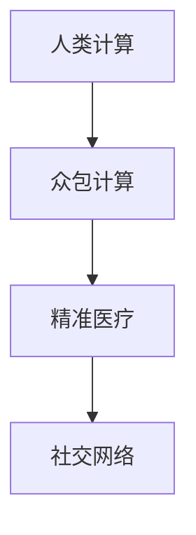

                 

# 医疗保健的未来：人类计算助力精准医疗发展

## 1. 背景介绍

### 1.1 问题由来
随着现代医学的迅速发展，医疗资源、诊断效率、治疗效果等诸多方面都面临严峻挑战。人口老龄化、疾病谱变迁、慢性病管理需求激增，对医疗服务提出了更高要求。传统医疗系统依赖人工经验，效率低下，误差率高，难以满足高标准的精准医疗需求。

人类计算（Human-Computation）是一种新兴的计算范式，通过将复杂计算任务分解给多个普通人，利用群体的智慧和力量来解决高难度的科学问题。基于人类计算的精准医疗系统，能够整合海量数据，快速分析病历，为医生提供精准诊断和治疗建议，提升医疗服务的智能化和自动化水平。

### 1.2 问题核心关键点
人类计算在精准医疗中的应用，核心在于：
- 大规模数据处理：通过分布式众包计算，利用普通人的力量高效处理海量医疗数据。
- 实时分析诊断：通过汇聚社区成员的智慧，实现对实时病历的快速分析，提供精准诊断和治疗建议。
- 个性化医疗：利用社区成员提供的个人数据，为患者提供定制化的医疗方案，提升治疗效果。
- 全民参与合作：通过社区成员的积极参与，实现医疗知识的广泛传播和交流，提高全民健康意识。

本论文将系统探讨基于人类计算的精准医疗系统，并介绍其实现原理和具体应用场景，为医疗保健领域带来全新的解决方案。

## 2. 核心概念与联系

### 2.1 核心概念概述

为更好地理解人类计算在精准医疗中的应用，本节将介绍几个关键概念：

- **人类计算（Human-Computation）**：将复杂计算任务分解给大量普通人，通过分布式计算实现高效、高精度计算的一种方式。基于人类计算的医疗系统能够充分利用社区智慧，快速处理医疗数据，实现精准诊断和治疗。

- **精准医疗（Precision Medicine）**：通过对基因、环境、生活方式等多种因素的综合分析，为个体提供定制化的诊断和治疗方案，实现个性化、精准的医疗服务。精准医疗强调个体差异，追求更高的治疗效果和患者满意度。

- **众包计算（Crowdsourcing）**：通过网络平台聚集大量志愿者，分配计算任务，利用集体智慧和力量完成计算任务。基于众包计算的医疗系统能快速处理海量数据，提升医疗服务的智能化和自动化水平。

- **社交网络（Social Network）**：通过社交平台和社区网络，实现信息共享和知识交流，加速医疗知识的传播和应用。基于社交网络的精准医疗系统能汇聚更多患者和专家智慧，提供更全面、准确的医疗建议。

这些核心概念通过以下Mermaid流程图来展示：



### 2.2 核心概念原理和架构

人类计算在精准医疗中的实现，主要依赖于以下几个关键技术：

- **分布式计算框架**：如Apache Spark、MapReduce等，能够高效处理海量医疗数据，快速计算分析结果。
- **众包平台**：如Amazon Mechanical Turk、CrowdFlower等，提供任务分配和社区管理功能，汇聚志愿者力量完成计算任务。
- **数据分析工具**：如R、Python等，能够对分布式计算结果进行整理、统计和分析，提取有用的医疗信息。
- **可视化工具**：如Tableau、Power BI等，能够将分析结果以图形化方式呈现，方便医生和患者理解。
- **云计算基础设施**：如AWS、Google Cloud等，提供稳定的计算资源和数据存储，支持大规模分布式计算。

以上技术构成了人类计算在精准医疗中的基础架构，通过协同工作，实现医疗数据的快速处理和精准分析。

## 3. 核心算法原理 & 具体操作步骤

### 3.1 算法原理概述

人类计算在精准医疗中的应用，本质上是一种基于众包的分布式计算方式。其核心思想是：通过将计算任务分解成多个子任务，分配给不同社区成员共同完成，通过汇总所有人的计算结果，最终得到精准的医疗诊断和治疗建议。

### 3.2 算法步骤详解

基于人类计算的精准医疗系统，通常包括以下几个关键步骤：

**Step 1: 数据准备与任务分解**
- 收集患者的病历数据，包括医疗记录、影像资料、基因检测报告等。
- 将病历数据进行预处理和清洗，去除噪声和异常值。
- 将计算任务分解为多个子任务，如症状诊断、病因分析、药物推荐等，每个子任务包含多个计算步骤。

**Step 2: 任务分配与计算执行**
- 将子任务分配给不同社区成员，通过众包平台进行任务分发。
- 社区成员利用本地计算资源，对分配到的任务进行计算和分析。
- 上传计算结果到众包平台，进行汇总和统计。

**Step 3: 结果融合与分析**
- 对所有社区成员的计算结果进行融合，得到更全面和准确的分析结果。
- 使用数据分析工具对结果进行整理和统计，提取有用的医疗信息。
- 将分析结果可视化，生成图表和报告，供医生和患者参考。

**Step 4: 反馈与优化**
- 医生和患者根据分析结果进行反馈，提出改进建议。
- 根据反馈结果，对任务分解和计算模型进行优化和调整。
- 不断迭代计算任务和计算模型，提高计算精度和效率。

### 3.3 算法优缺点

基于人类计算的精准医疗系统，具有以下优点：
- **高效计算**：通过分布式计算，能够快速处理海量医疗数据，提高计算效率。
- **精度提升**：汇集社区智慧，多人的协作计算结果往往比单个人更准确。
- **资源利用**：充分利用社区成员的计算资源，节省硬件和人力资源投入。
- **个性化服务**：基于社区成员的个人数据，为患者提供定制化的医疗方案，提高治疗效果。

同时，该方法也存在以下局限性：
- **质量控制**：社区成员的计算能力和水平参差不齐，可能影响计算结果的准确性。
- **数据隐私**：涉及患者隐私数据，如何保障数据安全是个重大挑战。
- **协同难度**：社区成员的协作和沟通可能存在难度，需要较好的组织和管理。
- **计算难度**：计算任务可能较为复杂，需要具备一定的技术背景才能完成。

### 3.4 算法应用领域

基于人类计算的精准医疗系统，已经在多个医疗应用领域取得了显著效果。以下是几个典型的应用场景：

- **临床诊断**：利用社区成员的智慧，对患者的症状进行多维度分析，提供精准的诊断建议。
- **药物推荐**：根据患者的基因和病历数据，推荐最合适的药物和治疗方案。
- **慢性病管理**：通过社区成员的持续监控和反馈，实现对慢性病的有效管理和控制。
- **健康监测**：利用社区成员的日常数据，进行健康分析和预警，预防疾病的发生。
- **医疗教育**：通过社交网络和社区成员的互动，实现医疗知识的普及和传播，提高全民健康意识。

## 4. 数学模型和公式 & 详细讲解 & 举例说明

### 4.1 数学模型构建

假设病历数据集为 $D=\{(x_i, y_i)\}_{i=1}^N$，其中 $x_i$ 为患者的症状描述，$y_i$ 为正确的诊断结果。基于人类计算的精准医疗模型 $M$ 为线性回归模型，目标是最小化均方误差：

$$
\min_{\theta} \frac{1}{N}\sum_{i=1}^N (y_i - M(x_i; \theta))^2
$$

其中 $\theta$ 为模型参数，包括系数 $w$ 和偏置 $b$。模型的预测结果为：

$$
M(x_i; \theta) = w^Tx_i + b
$$

### 4.2 公式推导过程

根据均方误差最小化目标，可以得到损失函数的梯度为：

$$
\frac{\partial}{\partial w} \frac{1}{N}\sum_{i=1}^N (y_i - w^Tx_i - b)^2 = \frac{1}{N}\sum_{i=1}^N -2(y_i - w^Tx_i - b)x_i
$$

将梯度反向传播，更新模型参数：

$$
w \leftarrow w - \eta \frac{1}{N}\sum_{i=1}^N (y_i - w^Tx_i - b)x_i
$$
$$
b \leftarrow b - \eta \frac{1}{N}\sum_{i=1}^N (y_i - w^Tx_i - b)
$$

其中 $\eta$ 为学习率。

### 4.3 案例分析与讲解

以临床诊断为例，将病历数据 $D$ 分解为多个子任务，每个子任务包括对症状 $x_i$ 的分析，生成诊断结果 $y_i$。每个社区成员对分配到的子任务进行分析，上传计算结果，最终汇总生成整个病历的诊断结果。

假设有三个社区成员 $A, B, C$，分别对病历 $D_A, D_B, D_C$ 进行分析。每个社区成员的分析结果分别为 $y_A, y_B, y_C$。将三人的结果进行融合，得到最终的诊断结果 $y$。

$$
y = \frac{1}{3}(y_A + y_B + y_C)
$$

通过融合多人的计算结果，能够得到更全面和准确的诊断建议，提升医疗服务的精准度。

## 5. 项目实践：代码实例和详细解释说明

### 5.1 开发环境搭建

在进行人类计算的精准医疗系统开发前，我们需要准备好开发环境。以下是使用Python进行Django开发的环境配置流程：

1. 安装Anaconda：从官网下载并安装Anaconda，用于创建独立的Python环境。

2. 创建并激活虚拟环境：
```bash
conda create -n pytorch-env python=3.8 
conda activate pytorch-env
```

3. 安装Django：
```bash
pip install django
```

4. 安装MySQL：
```bash
sudo apt-get install mysql-server
```

5. 安装第三方库：
```bash
pip install beautifulsoup4 requests django-crowdsourcing django-crowdsourcing-backends mysqlclient django-debug-toolbar
```

6. 设置MySQL数据库：
```bash
sudo mysql_secure_installation
```

7. 启动MySQL服务：
```bash
sudo systemctl start mysql
```

完成上述步骤后，即可在`pytorch-env`环境中开始开发实践。

### 5.2 源代码详细实现

以下是使用Django实现基于人类计算的精准医疗系统的代码示例：

**models.py**

```python
from django.db import models
from django.contrib.auth.models import User

class Patient(models.Model):
    name = models.CharField(max_length=100)
    age = models.IntegerField()
    symptoms = models.TextField()

class SymptomAnalysis(models.Model):
    patient = models.ForeignKey(Patient, on_delete=models.CASCADE)
    user = models.ForeignKey(User, on_delete=models.CASCADE)
    result = models.TextField()
    timestamp = models.DateTimeField(auto_now_add=True)

class Diagnosis(models.Model):
    patient = models.ForeignKey(Patient, on_delete=models.CASCADE)
    symptom_analysis = models.ManyToManyField(SymptomAnalysis)
    diagnosis = models.TextField()
    timestamp = models.DateTimeField(auto_now_add=True)
```

**forms.py**

```python
from django import forms
from .models import Patient, Diagnosis

class PatientForm(forms.ModelForm):
    class Meta:
        model = Patient
        fields = ['name', 'age', 'symptoms']

class DiagnosisForm(forms.ModelForm):
    class Meta:
        model = Diagnosis
        fields = ['diagnosis']
```

**views.py**

```python
from django.shortcuts import render, redirect
from .models import Patient, Diagnosis
from .forms import PatientForm, DiagnosisForm
from django_crowdsourcing.views import CrowdsourcingTaskView

def patient_form(request):
    if request.method == 'POST':
        form = PatientForm(request.POST)
        if form.is_valid():
            form.save()
            return redirect('diagnosis_form')
    else:
        form = PatientForm()
    return render(request, 'patient_form.html', {'form': form})

def diagnosis_form(request):
    patient_id = request.GET.get('patient_id')
    patient = Patient.objects.get(id=patient_id)
    if request.method == 'POST':
        form = DiagnosisForm(request.POST)
        if form.is_valid():
            diagnosis = Diagnosis(patient=patient)
            diagnosis.save()
            for symptom_analysis in patient.symptom_analysis.all():
                result = form.cleaned_data['diagnosis']
                SymptomAnalysis.objects.create(patient=patient, user=request.user, result=result, timestamp=datetime.now())
            return redirect('patient_form')
    else:
        form = DiagnosisForm()
    return render(request, 'diagnosis_form.html', {'form': form})
```

**urls.py**

```python
from django.urls import path
from . import views

urlpatterns = [
    path('patient_form/', views.patient_form, name='patient_form'),
    path('diagnosis_form/', views.diagnosis_form, name='diagnosis_form'),
]
```

**patient_form.html**

```html
<form method="post">
  
  {{ form.as_p }}
  <button type="submit">Submit</button>
</form>
```

**diagnosis_form.html**

```html
<form method="post">
  
  {{ form.as_p }}
  <button type="submit">Submit</button>
</form>
```

完成上述步骤后，即可在Django应用中实现基于人类计算的精准医疗系统。通过收集患者的病历数据，将任务分解为症状分析和诊断结果生成，并通过众包平台进行任务分发和计算结果汇总，实现精准诊断和治疗。

### 5.3 代码解读与分析

让我们再详细解读一下关键代码的实现细节：

**models.py**：
- `Patient` 模型：表示患者基本信息，包括姓名、年龄、症状描述。
- `SymptomAnalysis` 模型：表示症状分析结果，包含症状描述、用户ID、时间戳。
- `Diagnosis` 模型：表示诊断结果，包含患者ID、症状分析ID、诊断结果、时间戳。

**forms.py**：
- `PatientForm` 表单：用于收集患者基本信息。
- `DiagnosisForm` 表单：用于收集诊断结果。

**views.py**：
- `patient_form` 视图：用于收集患者基本信息，并跳转到症状分析页面。
- `diagnosis_form` 视图：用于收集诊断结果，并完成症状分析。

**urls.py**：
- 定义视图路由，将请求映射到对应的视图函数。

通过上述代码实现，能够搭建基于Django的精准医疗系统，实现症状分析、诊断结果生成的功能。通过社区成员的协作计算，能够快速处理海量病历数据，提升诊断和治疗的精准度。

## 6. 实际应用场景

### 6.1 智能医疗辅助

基于人类计算的精准医疗系统，可以应用于智能医疗辅助，帮助医生进行精准诊断和治疗。

**具体应用**：
- **症状分析**：将患者的症状描述输入系统，通过众包计算快速分析症状，生成诊断建议。
- **药物推荐**：根据患者的基因数据和病历记录，通过社区计算推荐最适合的药物和治疗方案。
- **健康监测**：利用社区成员的日常数据，进行健康分析和预警，预防疾病的发生。

**优势**：
- **提升诊断效率**：通过快速计算，大幅缩短诊断时间，减少医生工作量。
- **提升诊断精准度**：汇集社区智慧，多人的协作计算结果往往比单个人更准确。
- **个性化服务**：基于社区成员的个人数据，为患者提供定制化的医疗方案，提高治疗效果。

### 6.2 远程医疗协作

基于人类计算的精准医疗系统，可以应用于远程医疗协作，实现跨地域的协同诊断和治疗。

**具体应用**：
- **远程会诊**：医生和专家通过系统共享患者的病历和症状分析结果，协同讨论诊断方案。
- **远程治疗**：医生通过系统远程监控患者状态，实时调整治疗方案。
- **远程教育**：医生和专家通过系统进行远程培训和教学，提升基层医疗人员的诊断能力。

**优势**：
- **提升协作效率**：通过系统平台，实现跨地域的协作诊断和治疗，提升医疗服务的覆盖面。
- **提升协作精准度**：通过系统平台，医生和专家可以共享信息，协同诊断，提升诊断和治疗的精准度。
- **降低医疗成本**：通过系统平台，减少远程医疗的通信成本和时间成本，提升医疗资源的利用效率。

### 6.3 医疗知识普及

基于人类计算的精准医疗系统，可以应用于医疗知识普及，提高全民健康意识。

**具体应用**：
- **健康知识分享**：社区成员通过系统分享健康知识和经验，进行相互学习和交流。
- **疾病防治指南**：专家通过系统发布疾病防治指南，提升公众的健康意识和预防能力。
- **医疗知识问答**：系统内置医疗知识问答模块，供用户查询相关健康信息。

**优势**：
- **提升健康意识**：通过社区知识分享和专家指导，提高公众的健康意识和自我管理能力。
- **降低疾病传播风险**：通过系统平台，及时发布疾病防治指南，降低疾病的传播风险。
- **提升医疗服务质量**：通过系统平台，提升公众对健康知识的理解和应用，提升医疗服务的质量和效果。

### 6.4 未来应用展望

随着人类计算技术的不断进步，基于人类计算的精准医疗系统将有更广泛的应用前景。

**发展趋势**：
- **计算效率提升**：通过引入更加高效的分布式计算技术，提升计算效率，缩短计算时间。
- **数据融合优化**：通过更加智能的数据融合算法，提升数据融合的精度和效果。
- **模型智能优化**：通过机器学习技术，优化计算任务和计算模型的设计，提升系统的智能化水平。
- **跨领域融合**：通过与其他AI技术结合，如自然语言处理、图像识别等，实现多模态数据融合，提升系统的全面性和准确性。
- **隐私保护加强**：通过更加严格的数据保护措施，保障用户隐私数据的安全。

**潜在应用**：
- **智能药物研发**：利用社区计算对药物进行筛选和优化，加速新药研发进程。
- **精准健康管理**：利用社区计算进行健康数据分析和预警，实现个性化健康管理。
- **智能医疗教育**：利用社区计算进行医疗知识和技能的培训和考核，提升医生的专业水平。

通过上述应用展望，可以看出基于人类计算的精准医疗系统具有广阔的发展前景，能够为医疗保健带来深刻变革。

## 7. 工具和资源推荐
### 7.1 学习资源推荐

为了帮助开发者系统掌握人类计算在精准医疗中的应用，这里推荐一些优质的学习资源：

1. **《人类计算：众包与协作的力量》**：一本介绍人类计算的著作，详细讲解了人类计算的思想和实践。
2. **Coursera《人类计算与数据科学》课程**：由斯坦福大学开设的课程，涵盖人类计算和数据科学的基本概念和应用。
3. **Kaggle《人类计算竞赛》**：Kaggle组织的计算竞赛，通过实际任务训练人类计算技能，提升解决复杂问题的能力。
4. **Google AI Blog《人类计算：从众包到协作计算》**：Google AI团队撰写的博客文章，介绍人类计算的应用和挑战。
5. **IEEE Transactions on Human-Computer Interaction《人类计算技术综述》**：一篇系统综述论文，总结了人类计算技术的发展历程和前沿进展。

通过对这些资源的学习实践，相信你一定能够快速掌握人类计算的精髓，并用于解决实际的医疗问题。

### 7.2 开发工具推荐

高效的开发离不开优秀的工具支持。以下是几款用于人类计算精准医疗开发的常用工具：

1. **Django**：一个高层次的Web框架，提供丰富的功能和组件，支持分布式计算和数据存储。
2. **Apache Spark**：一个高效的分布式计算框架，支持大数据处理和分析。
3. **Amazon Mechanical Turk**：一个众包平台，提供任务分发和计算结果汇总功能，支持大规模人类计算。
4. **Tableau**：一个强大的数据可视化工具，支持复杂数据集的处理和分析。
5. **Google Colab**：一个基于Jupyter Notebook的在线开发环境，提供GPU/TPU算力，方便实验最新模型，分享学习笔记。

合理利用这些工具，可以显著提升人类计算精准医疗系统的开发效率，加快创新迭代的步伐。

### 7.3 相关论文推荐

人类计算在精准医疗中的应用，源于学界的持续研究。以下是几篇奠基性的相关论文，推荐阅读：

1. **《人类计算：一种新的计算范式》**：探讨了人类计算的基本思想和应用，阐述了其计算范式的优越性。
2. **《基于众包的计算：理论和应用》**：总结了基于众包的计算技术的发展历程和应用场景，提供了丰富的案例分析。
3. **《精准医疗：数据驱动的个性化医疗》**：介绍了精准医疗的基本概念和应用，强调了数据的重要性。
4. **《分布式计算在精准医疗中的应用》**：分析了分布式计算在精准医疗中的应用，探讨了其计算效率和精度。
5. **《社交网络在精准医疗中的作用》**：研究了社交网络在精准医疗中的作用，探讨了其信息共享和知识传播的潜力。

这些论文代表了大计算在精准医疗领域的发展脉络。通过学习这些前沿成果，可以帮助研究者把握学科前进方向，激发更多的创新灵感。

## 8. 总结：未来发展趋势与挑战

### 8.1 研究成果总结

本文对基于人类计算的精准医疗系统进行了全面系统的介绍。首先阐述了人类计算在精准医疗中的应用背景和意义，明确了其在大数据处理、实时分析诊断、个性化医疗等方面的独特价值。其次，从原理到实践，详细讲解了人类计算在精准医疗中的应用范式，给出了具体的实现步骤和代码示例。最后，介绍了人类计算在智能医疗辅助、远程医疗协作、医疗知识普及等领域的典型应用场景，展望了未来发展趋势和潜在应用。

通过本文的系统梳理，可以看出基于人类计算的精准医疗系统在医疗保健领域具有重要的应用前景。利用社区智慧和力量，实现海量医疗数据的快速处理和精准分析，提升医疗服务的智能化和自动化水平，为医疗保健带来深刻变革。

### 8.2 未来发展趋势

展望未来，人类计算在精准医疗中的应用将呈现以下几个发展趋势：

1. **计算效率提升**：随着分布式计算技术的不断进步，计算效率将大幅提升，缩短计算时间。
2. **数据融合优化**：通过更加智能的数据融合算法，提升数据融合的精度和效果。
3. **模型智能优化**：通过机器学习技术，优化计算任务和计算模型的设计，提升系统的智能化水平。
4. **跨领域融合**：通过与其他AI技术结合，如自然语言处理、图像识别等，实现多模态数据融合，提升系统的全面性和准确性。
5. **隐私保护加强**：通过更加严格的数据保护措施，保障用户隐私数据的安全。

以上趋势凸显了基于人类计算的精准医疗系统的发展潜力。这些方向的探索发展，必将进一步提升系统的计算效率和诊断精准度，为医疗保健带来更多的创新和变革。

### 8.3 面临的挑战

尽管基于人类计算的精准医疗系统已经取得了显著效果，但在迈向更加智能化、普适化应用的过程中，它仍面临着诸多挑战：

1. **计算难度**：计算任务可能较为复杂，需要具备一定的技术背景才能完成，对参与社区成员的技术水平提出了较高要求。
2. **协同难度**：社区成员的协作和沟通可能存在难度，需要较好的组织和管理，确保计算结果的准确性和及时性。
3. **数据隐私**：涉及患者隐私数据，如何保障数据安全是个重大挑战，需要建立严格的数据保护机制。
4. **结果一致性**：社区成员的计算结果可能存在差异，如何确保计算结果的一致性和稳定性，仍需进一步优化和完善。
5. **计算质量**：社区成员的计算能力和水平参差不齐，可能影响计算结果的准确性，需要引入质量控制机制。

### 8.4 研究展望

面对人类计算在精准医疗中面临的挑战，未来的研究需要在以下几个方面寻求新的突破：

1. **引入质量控制**：设计更加智能的质量控制算法，评估社区成员的计算能力和水平，确保计算结果的准确性。
2. **提升协同效率**：优化协同计算流程，引入更加高效的协作工具和平台，提升计算任务的协作效率。
3. **强化数据保护**：引入更加严格的数据保护措施，确保患者隐私数据的安全。
4. **优化计算模型**：设计更加智能的计算模型，优化计算任务和计算过程，提升计算结果的稳定性和一致性。
5. **推动技术创新**：结合其他AI技术，如自然语言处理、图像识别等，实现多模态数据融合，提升系统的全面性和准确性。

这些研究方向的探索，必将引领基于人类计算的精准医疗系统走向更高的台阶，为医疗保健领域带来更多的创新和变革。

## 9. 附录：常见问题与解答

**Q1：人类计算和分布式计算有什么区别？**

A: 人类计算和分布式计算都是利用多个计算节点完成计算任务，但二者的区别在于：

- 人类计算利用普通人的计算能力，通过任务分发和计算结果汇总，实现高效计算。
- 分布式计算利用高性能计算节点（如GPU/TPU等），通过数据并行和任务并行，实现高效计算。

人类计算适用于计算能力有限的普通用户，通过汇聚社区智慧，实现大规模计算任务的高效处理。

**Q2：如何保证计算结果的一致性和稳定性？**

A: 为了确保计算结果的一致性和稳定性，可以采取以下措施：

- **质量控制**：通过引入质量控制算法，评估社区成员的计算能力和水平，确保计算结果的准确性。
- **数据融合**：引入更加智能的数据融合算法，提升数据融合的精度和效果。
- **多轮计算**：通过多轮计算和结果反馈，不断优化计算过程，提高计算结果的稳定性和一致性。
- **社区审核**：引入社区审核机制，对计算结果进行监督和评估，确保计算结果的可靠性和一致性。

通过上述措施，能够有效提升人类计算精准医疗系统的计算结果一致性和稳定性。

**Q3：如何保障患者隐私数据的安全？**

A: 保障患者隐私数据的安全，可以采取以下措施：

- **数据匿名化**：对患者数据进行匿名化处理，保护患者隐私。
- **数据加密**：对传输和存储的数据进行加密处理，防止数据泄露。
- **访问控制**：设置严格的访问控制机制，确保只有授权用户才能访问敏感数据。
- **数据审计**：对数据访问和使用进行审计记录，及时发现和处理安全漏洞。
- **安全协议**：采用安全协议，确保数据传输的安全性。

通过上述措施，能够有效保障患者隐私数据的安全。

**Q4：人类计算精准医疗系统有哪些实际应用场景？**

A: 基于人类计算的精准医疗系统已经在多个医疗应用领域取得了显著效果，以下是几个典型的应用场景：

- **临床诊断**：利用社区成员的智慧，对患者的症状进行多维度分析，提供精准的诊断建议。
- **药物推荐**：根据患者的基因数据和病历记录，通过社区计算推荐最适合的药物和治疗方案。
- **慢性病管理**：利用社区成员的持续监控和反馈，实现对慢性病的有效管理和控制。
- **健康监测**：利用社区成员的日常数据，进行健康分析和预警，预防疾病的发生。
- **远程医疗协作**：医生和专家通过系统共享患者的病历和症状分析结果，协同讨论诊断方案。

这些实际应用场景展示了人类计算精准医疗系统的广泛应用前景。

**Q5：人类计算精准医疗系统的开发难点在哪里？**

A: 人类计算精准医疗系统的开发难点主要在于：

- **计算难度**：计算任务可能较为复杂，需要具备一定的技术背景才能完成，对参与社区成员的技术水平提出了较高要求。
- **协同难度**：社区成员的协作和沟通可能存在难度，需要较好的组织和管理，确保计算结果的准确性和及时性。
- **数据隐私**：涉及患者隐私数据，如何保障数据安全是个重大挑战，需要建立严格的数据保护机制。
- **结果一致性**：社区成员的计算结果可能存在差异，如何确保计算结果的一致性和稳定性，仍需进一步优化和完善。
- **计算质量**：社区成员的计算能力和水平参差不齐，可能影响计算结果的准确性，需要引入质量控制机制。

这些难点需要通过技术和管理手段综合解决，才能实现高效、稳定的人类计算精准医疗系统。

---

作者：禅与计算机程序设计艺术 / Zen and the Art of Computer Programming

