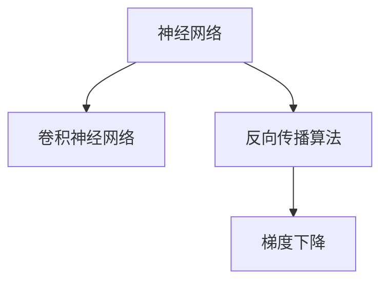

                 

# 反向传播在计算机视觉中的应用

> 关键词：反向传播, 计算机视觉, 神经网络, 深度学习, 梯度下降, 图像分类, 物体检测

## 1. 背景介绍

在计算机视觉领域，反向传播算法（Backpropagation）是训练深度神经网络的核心技术。自1980年代以来，反向传播已经广泛应用于图像分类、物体检测、图像分割、图像生成等各种计算机视觉任务中，显著提升了深度学习的性能和应用效果。

### 1.1 问题由来

计算机视觉的核心任务是让计算机能够"看"懂并理解图像或视频内容。深度学习模型的出现，特别是卷积神经网络（Convolutional Neural Networks, CNNs）的诞生，为计算机视觉任务的解决提供了强有力的工具。然而，深度学习模型的参数数量庞大，模型结构复杂，其训练过程需要大量的标注数据和强大的计算资源，这使得传统的模型训练方法难以胜任。

为了解决这个问题，反向传播算法应运而生。通过反向传播，可以高效地计算模型参数的梯度，利用梯度下降等优化算法来更新模型参数，从而实现深度学习模型的训练和优化。

### 1.2 问题核心关键点

反向传播算法是深度学习模型训练的核心。其核心思想是：通过链式法则，计算模型输出与损失函数之间的梯度，并沿着反向传播路径，逐层更新模型参数。反向传播的计算过程包括前向传播和反向传播两个阶段。

1. **前向传播**：从模型输入开始，通过模型计算得到输出。前向传播的过程可以看作是对模型的一种模拟，即输入数据经过模型参数的加权和激活函数的运算，最终得到模型的预测输出。

2. **反向传播**：根据预测输出和真实标签之间的误差，计算损失函数的梯度。反向传播的过程可以看作是对误差进行倒推，即将误差从输出层向输入层传递，每层计算梯度的过程中都需要用到前向传播的结果。

通过反向传播算法，模型可以自动学习输入和输出之间的复杂映射关系，实现对各种计算机视觉任务的建模和求解。

### 1.3 问题研究意义

反向传播算法在计算机视觉领域的应用，为深度学习模型的训练和优化提供了重要工具，使得计算机视觉任务得以在各种场景下实现高性能的解决方案。

1. **提高模型性能**：反向传播算法可以高效计算梯度，使得深度学习模型能够快速迭代优化，从而提升模型的性能。
2. **降低训练成本**：通过反向传播，模型可以在较少的标注数据下快速学习，减少了数据标注和模型训练的成本。
3. **提升模型泛化能力**：反向传播算法可以优化模型参数，提高模型的泛化能力，使其能够在未见过的数据上取得良好的表现。
4. **支持大规模模型训练**：反向传播算法可以高效处理大规模模型参数，支持深度学习模型的进一步发展。
5. **推动计算机视觉技术创新**：反向传播算法是深度学习模型的核心组成部分，推动了计算机视觉技术的不断创新，为计算机视觉应用提供了新的可能。

## 2. 核心概念与联系

### 2.1 核心概念概述

在理解反向传播算法在计算机视觉中的应用之前，首先需要理解以下几个核心概念：

- **神经网络（Neural Network）**：由大量人工神经元（或称神经元）组成的网络结构，用于处理和分析数据。
- **卷积神经网络（Convolutional Neural Network, CNN）**：一种专门用于图像和视频处理的神经网络，利用卷积和池化等操作提取特征，减少参数量，提升模型性能。
- **反向传播算法（Backpropagation）**：通过链式法则计算模型参数梯度的算法，是深度学习模型训练的核心。
- **梯度下降（Gradient Descent）**：一种常用的优化算法，通过不断调整模型参数来最小化损失函数。

这些概念之间的逻辑关系可以通过以下Mermaid流程图来展示：



这个流程图展示了神经网络、卷积神经网络和反向传播算法之间的关系：

1. 神经网络是深度学习模型的基础，包含大量神经元。
2. 卷积神经网络是神经网络的一种特殊形式，适用于图像和视频处理。
3. 反向传播算法是训练神经网络的核心技术，用于计算模型参数的梯度。
4. 梯度下降是一种优化算法，利用反向传播计算的梯度来更新模型参数。

## 3. 核心算法原理 & 具体操作步骤
### 3.1 算法原理概述

反向传播算法是深度学习模型训练的核心技术，其核心思想是通过链式法则计算模型参数的梯度，并利用梯度下降等优化算法来更新模型参数。

在计算机视觉任务中，常见的反向传播算法流程如下：

1. **前向传播**：输入数据经过卷积层、池化层、全连接层等模型层，得到模型的预测输出。
2. **计算损失函数**：根据预测输出和真实标签之间的误差，计算损失函数。
3. **反向传播**：利用链式法则，从输出层开始计算每个参数的梯度。
4. **梯度更新**：利用计算出的梯度，结合梯度下降等优化算法，更新模型参数。

反向传播算法的核心是利用梯度的链式法则，将损失函数的梯度逐层传递给模型参数，并利用优化算法来更新这些参数。通过这种方式，反向传播算法可以高效地训练深度学习模型，提升模型的性能和泛化能力。

### 3.2 算法步骤详解

反向传播算法的详细步骤包括：

**Step 1: 数据预处理**

- 加载图像数据，并进行归一化、裁剪、调整大小等预处理。
- 将图像数据转换为张量形式，准备输入模型。

**Step 2: 前向传播**

- 将预处理后的图像数据输入模型，得到模型的预测输出。
- 计算模型的损失函数，如交叉熵损失、均方误差等。

**Step 3: 反向传播**

- 根据损失函数对输出层进行反向传播，计算每个参数的梯度。
- 逐层向前传递梯度，计算每个参数的梯度。

**Step 4: 梯度更新**

- 使用梯度下降等优化算法，结合模型参数的梯度，更新模型参数。
- 重复前向传播和反向传播过程，直到模型收敛。

**Step 5: 模型评估**

- 使用验证集或测试集评估模型的性能，如准确率、精度、召回率等。
- 调整超参数，重新训练模型，直到获得满意的性能。

### 3.3 算法优缺点

反向传播算法在计算机视觉领域的应用，具有以下优点：

1. **高效计算**：通过链式法则，反向传播算法可以高效计算模型参数的梯度，减少了计算成本。
2. **易于实现**：反向传播算法的实现相对简单，易于理解和实现。
3. **泛化能力强**：反向传播算法可以提升模型的泛化能力，使其在未见过的数据上表现良好。
4. **支持大规模模型训练**：反向传播算法可以处理大规模的模型参数，支持深度学习模型的进一步发展。

同时，反向传播算法也存在以下缺点：

1. **依赖梯度计算**：反向传播算法的训练过程依赖于梯度计算，而梯度计算可能存在数值不稳定的问题。
2. **易过拟合**：若模型参数过多，可能导致过拟合现象。
3. **计算量大**：反向传播算法的计算量较大，需要强大的计算资源支持。

### 3.4 算法应用领域

反向传播算法在计算机视觉领域的应用非常广泛，主要包括：

1. **图像分类**：通过反向传播算法训练卷积神经网络，实现对图像的分类。如CIFAR-10、ImageNet等数据集。
2. **物体检测**：利用反向传播算法训练Faster R-CNN、YOLO、SSD等模型，实现对图像中物体的检测。
3. **图像分割**：利用反向传播算法训练U-Net、FCN等模型，实现对图像的像素级分割。
4. **图像生成**：通过反向传播算法训练GAN、VAE等模型，实现图像的生成和变分。
5. **图像风格转换**：利用反向传播算法训练神经网络，实现图像的风格转换和增强。
6. **图像修复**：利用反向传播算法训练神经网络，实现图像的修复和去噪。

这些应用领域展示了反向传播算法在计算机视觉中的广泛应用和巨大潜力。

## 4. 数学模型和公式 & 详细讲解 & 举例说明
### 4.1 数学模型构建

在计算机视觉任务中，反向传播算法的数学模型构建可以表示如下：

设模型输入为 $x \in \mathbb{R}^d$，模型输出为 $y \in \mathbb{R}^m$，模型损失函数为 $L(y, t)$，其中 $t$ 为真实标签。模型的参数为 $\theta$，包括卷积核、权重矩阵、偏置项等。

反向传播算法的目标是最小化损失函数 $L(y, t)$，即：

$$
\min_{\theta} L(y, t)
$$

其中 $y$ 为模型输出，$t$ 为真实标签。

### 4.2 公式推导过程

在反向传播算法中，通常使用梯度下降等优化算法来更新模型参数。梯度下降的更新公式为：

$$
\theta \leftarrow \theta - \eta \nabla_{\theta}L(y, t)
$$

其中 $\eta$ 为学习率，$\nabla_{\theta}L(y, t)$ 为损失函数对模型参数的梯度。

对于卷积神经网络，模型的梯度计算过程如下：

1. **前向传播**：输入图像 $x$ 经过卷积层、池化层、全连接层等，得到模型输出 $y$。

2. **计算损失函数**：根据模型输出 $y$ 和真实标签 $t$，计算损失函数 $L(y, t)$。

3. **反向传播**：利用链式法则，计算每个参数的梯度。

   - **输出层**：
     - 计算损失函数对输出层的梯度 $\nabla_{\theta}L(y, t)$。
     - 利用梯度下降等优化算法，更新输出层参数 $\theta^{(out)}$。

   - **隐藏层**：
     - 利用链式法则，计算隐藏层参数的梯度 $\nabla_{\theta}L(y, t)$。
     - 利用梯度下降等优化算法，更新隐藏层参数 $\theta^{(hidden)}$。

   - **卷积层**：
     - 利用链式法则，计算卷积核参数的梯度 $\nabla_{\theta}L(y, t)$。
     - 利用梯度下降等优化算法，更新卷积核参数 $\theta^{(conv)}$。

4. **梯度更新**：
   - 结合梯度下降等优化算法，更新模型参数 $\theta$。

   - 重复前向传播和反向传播过程，直到模型收敛。

### 4.3 案例分析与讲解

以图像分类任务为例，反向传播算法的具体实现步骤如下：

1. **数据预处理**：加载图像数据，并进行归一化、裁剪、调整大小等预处理。

2. **模型定义**：定义卷积神经网络模型，包括卷积层、池化层、全连接层等。

3. **前向传播**：将预处理后的图像数据输入模型，得到模型的预测输出。

4. **计算损失函数**：根据预测输出和真实标签之间的误差，计算损失函数，如交叉熵损失。

5. **反向传播**：利用链式法则，计算每个参数的梯度。

6. **梯度更新**：利用梯度下降等优化算法，更新模型参数。

7. **模型评估**：使用验证集或测试集评估模型的性能，如准确率、精度、召回率等。

## 5. 项目实践：代码实例和详细解释说明
### 5.1 开发环境搭建

在进行反向传播算法的项目实践前，我们需要准备好开发环境。以下是使用Python进行TensorFlow开发的环境配置流程：

1. 安装Anaconda：从官网下载并安装Anaconda，用于创建独立的Python环境。

2. 创建并激活虚拟环境：
```bash
conda create -n tensorflow-env python=3.8 
conda activate tensorflow-env
```

3. 安装TensorFlow：根据CUDA版本，从官网获取对应的安装命令。例如：
```bash
conda install tensorflow tensorflow-cpu -c tensorflow -c conda-forge
```

4. 安装各类工具包：
```bash
pip install numpy pandas scikit-learn matplotlib tqdm jupyter notebook ipython
```

完成上述步骤后，即可在`tensorflow-env`环境中开始反向传播算法的项目实践。

### 5.2 源代码详细实现

这里以图像分类任务为例，给出使用TensorFlow实现反向传播算法的代码实现。

首先，定义图像分类任务的数据处理函数：

```python
import tensorflow as tf
from tensorflow.keras.preprocessing.image import ImageDataGenerator

def load_and_preprocess_data(data_dir, image_size=(224, 224), batch_size=32):
    datagen = ImageDataGenerator(rescale=1./255, 
                                 shear_range=0.2, 
                                 zoom_range=0.2, 
                                 horizontal_flip=True)
    train_generator = datagen.flow_from_directory(
        data_dir,
        target_size=image_size,
        batch_size=batch_size,
        class_mode='binary'
    )
    return train_generator
```

然后，定义卷积神经网络模型：

```python
from tensorflow.keras.models import Sequential
from tensorflow.keras.layers import Conv2D, MaxPooling2D, Flatten, Dense, Dropout

model = Sequential([
    Conv2D(32, (3, 3), activation='relu', input_shape=(224, 224, 3)),
    MaxPooling2D((2, 2)),
    Conv2D(64, (3, 3), activation='relu'),
    MaxPooling2D((2, 2)),
    Conv2D(128, (3, 3), activation='relu'),
    MaxPooling2D((2, 2)),
    Flatten(),
    Dense(256, activation='relu'),
    Dropout(0.5),
    Dense(1, activation='sigmoid')
])
```

接着，定义反向传播算法的训练函数：

```python
def train(model, train_generator, epochs, learning_rate=0.001):
    model.compile(optimizer=tf.keras.optimizers.Adam(learning_rate), loss='binary_crossentropy', metrics=['accuracy'])
    model.fit(train_generator, epochs=epochs, validation_split=0.1)
```

最后，启动训练流程：

```python
data_dir = '/path/to/train'
train_generator = load_and_preprocess_data(data_dir)
train(model, train_generator, epochs=10)
```

以上就是使用TensorFlow实现反向传播算法的完整代码实现。可以看到，通过TensorFlow的高级API，我们可以用相对简洁的代码完成卷积神经网络模型的定义和反向传播算法的训练。

### 5.3 代码解读与分析

让我们再详细解读一下关键代码的实现细节：

**load_and_preprocess_data函数**：
- 定义数据生成器，对图像数据进行预处理，包括归一化、随机裁剪、随机缩放、水平翻转等。
- 利用TensorFlow的ImageDataGenerator，从目录中加载图像数据，并进行预处理，生成训练数据的批次数据。

**Sequential模型定义**：
- 利用Sequential模型定义卷积神经网络模型，包括卷积层、池化层、全连接层等。
- 在模型定义中，我们使用了TensorFlow的高级API，如Conv2D、MaxPooling2D、Dense、Dropout等，简化了代码实现。

**train函数**：
- 定义训练函数，利用TensorFlow的高级API，通过Adam优化器进行梯度下降，计算损失函数和准确率。
- 利用fit方法进行模型训练，设置训练轮数、验证集比例等参数。

**训练流程**：
- 定义数据目录，加载并预处理训练数据。
- 调用train函数，启动模型训练。

可以看到，TensorFlow提供了丰富的API和工具，使得反向传播算法的项目实践变得更加简单和高效。通过TensorFlow，我们可以轻松实现卷积神经网络模型的定义和训练，加速深度学习模型在计算机视觉中的应用。

## 6. 实际应用场景
### 6.1 智能安防系统

在智能安防领域，反向传播算法可以用于图像分类和物体检测等任务。通过训练卷积神经网络模型，可以实现对视频流中不同场景的识别和行为分析，提高安全防范的智能化水平。

具体而言，可以收集视频监控数据，将视频帧转换为图像数据，并标注不同的场景类别（如行人、车辆、异常行为等）。在训练集上进行反向传播算法的训练，使得模型能够自动识别和分类视频中的不同场景，实现实时监控和安全报警。

### 6.2 医疗影像分析

在医疗影像分析领域，反向传播算法可以用于图像分割和图像分类等任务。通过训练卷积神经网络模型，可以实现对医学影像的自动分析和诊断，辅助医生进行疾病诊断和治疗。

具体而言，可以收集医学影像数据，如X光片、CT扫描、MRI等，并标注不同的病灶区域（如肿瘤、血管、骨骼等）。在训练集上进行反向传播算法的训练，使得模型能够自动识别和分割病灶区域，实现对医学影像的自动分析和诊断，提高医生的诊断效率和治疗效果。

### 6.3 自动驾驶系统

在自动驾驶领域，反向传播算法可以用于图像分类和目标检测等任务。通过训练卷积神经网络模型，可以实现对车辆周围环境的全方位感知和行为决策，提高自动驾驶的安全性和可靠性。

具体而言，可以收集自动驾驶车辆周围的摄像头图像数据，并标注不同的物体（如行人、车辆、道路标志等）。在训练集上进行反向传播算法的训练，使得模型能够自动识别和分类车辆周围的物体，实现对周围环境的全面感知和行为决策，提高自动驾驶的安全性和可靠性。

### 6.4 未来应用展望

随着反向传播算法的不断发展，其在计算机视觉领域的应用将更加广泛和深入。未来，反向传播算法可能进一步推动计算机视觉技术的创新和应用：

1. **多模态数据融合**：反向传播算法可以与视觉、语音、文本等多种模态数据进行融合，实现更加全面和准确的信息提取和理解。
2. **端到端训练**：反向传播算法可以与强化学习等方法结合，实现端到端的模型训练，提升模型性能和泛化能力。
3. **对抗性样本生成**：反向传播算法可以用于生成对抗性样本，提高模型的鲁棒性和泛化能力。
4. **无监督学习和半监督学习**：反向传播算法可以结合无监督学习和半监督学习方法，减少对标注数据的依赖，提升模型泛化能力。
5. **联邦学习**：反向传播算法可以与联邦学习技术结合，实现分布式训练，提升模型性能和安全性。
6. **零样本学习**：反向传播算法可以结合零样本学习方法，实现对未知类别的识别和分类，提升模型的泛化能力。

这些技术方向的探索发展，必将进一步提升反向传播算法在计算机视觉领域的应用水平，为计算机视觉技术带来新的突破和创新。

## 7. 工具和资源推荐
### 7.1 学习资源推荐

为了帮助开发者系统掌握反向传播算法的理论基础和实践技巧，这里推荐一些优质的学习资源：

1. **深度学习与计算机视觉笔记**：深度学习与计算机视觉课程，涵盖深度学习模型、反向传播算法、卷积神经网络等核心内容，适合初学者系统学习。
2. **TensorFlow官方文档**：TensorFlow官方文档，提供了丰富的API和工具，帮助开发者实现卷积神经网络模型和反向传播算法的训练和优化。
3. **PyTorch官方文档**：PyTorch官方文档，提供了丰富的API和工具，帮助开发者实现卷积神经网络模型和反向传播算法的训练和优化。
4. **Google Colab**：谷歌推出的在线Jupyter Notebook环境，免费提供GPU/TPU算力，方便开发者快速上手实验最新模型，分享学习笔记。
5. **Coursera深度学习课程**：Coursera深度学习课程，由斯坦福大学教授Andrew Ng主讲，涵盖深度学习模型、反向传播算法、卷积神经网络等核心内容，适合系统学习。

通过对这些资源的学习实践，相信你一定能够快速掌握反向传播算法的精髓，并用于解决实际的计算机视觉问题。

### 7.2 开发工具推荐

高效的开发离不开优秀的工具支持。以下是几款用于反向传播算法开发的常用工具：

1. **TensorFlow**：由Google主导开发的开源深度学习框架，生产部署方便，适合大规模工程应用。
2. **PyTorch**：由Facebook主导开发的开源深度学习框架，灵活动态的计算图，适合快速迭代研究。
3. **Keras**：基于TensorFlow和Theano的高层API，简单易用，适合快速搭建卷积神经网络模型。
4. **OpenCV**：开源计算机视觉库，提供了丰富的图像处理和计算机视觉算法，适合进行图像分类和物体检测等任务。
5. **Matplotlib**：Python数据可视化库，适合绘制卷积神经网络模型的训练曲线和损失函数曲线。

合理利用这些工具，可以显著提升反向传播算法的开发效率，加快创新迭代的步伐。

### 7.3 相关论文推荐

反向传播算法在计算机视觉领域的应用，源于学界的持续研究。以下是几篇奠基性的相关论文，推荐阅读：

1. **ImageNet Classification with Deep Convolutional Neural Networks**：Hinton等人提出使用卷积神经网络实现图像分类任务，取得了当时最好的性能。
2. **AlexNet: One Million Training Examples for Large Scale Image Recognition**：AlexNet提出使用多GPU进行分布式训练，实现了图像分类任务的突破。
3. **Faster R-CNN: Towards Real-Time Object Detection with Region Proposal Networks**：Faster R-CNN提出使用区域提议网络，实现了目标检测任务的突破。
4. **Deep Residual Learning for Image Recognition**：ResNet提出使用残差网络，解决了深度神经网络训练中的梯度消失问题。
5. **Towards End-to-End Object Detection with Real-Time Single-Shot Detections**：YOLO提出使用单阶段目标检测算法，实现了实时性目标检测任务的突破。
6. **Feature Pyramid Networks for Object Detection**：Fpn提出使用金字塔网络结构，实现了更精确的目标检测任务。

这些论文代表了大规模反向传播算法在计算机视觉领域的发展脉络。通过学习这些前沿成果，可以帮助研究者把握学科前进方向，激发更多的创新灵感。

## 8. 总结：未来发展趋势与挑战
### 8.1 总结

本文对反向传播算法在计算机视觉中的应用进行了全面系统的介绍。首先阐述了反向传播算法的研究背景和意义，明确了其在计算机视觉任务中的重要作用。其次，从原理到实践，详细讲解了反向传播算法的数学原理和关键步骤，给出了卷积神经网络模型的代码实现。同时，本文还广泛探讨了反向传播算法在智能安防、医疗影像、自动驾驶等多个领域的应用前景，展示了其广泛的适用性和巨大的潜力。

通过本文的系统梳理，可以看到，反向传播算法在计算机视觉领域的应用已经非常广泛，为深度学习模型的训练和优化提供了重要工具，推动了计算机视觉任务的不断突破和发展。未来，伴随深度学习技术的不断进步，反向传播算法将在更多领域得到应用，为计算机视觉技术的产业化进程贡献更大的力量。

### 8.2 未来发展趋势

展望未来，反向传播算法在计算机视觉领域的应用将呈现以下几个发展趋势：

1. **多模态融合**：反向传播算法可以与视觉、语音、文本等多种模态数据进行融合，实现更加全面和准确的信息提取和理解。
2. **端到端训练**：反向传播算法可以与强化学习等方法结合，实现端到端的模型训练，提升模型性能和泛化能力。
3. **对抗性样本生成**：反向传播算法可以用于生成对抗性样本，提高模型的鲁棒性和泛化能力。
4. **无监督学习和半监督学习**：反向传播算法可以结合无监督学习和半监督学习方法，减少对标注数据的依赖，提升模型泛化能力。
5. **联邦学习**：反向传播算法可以与联邦学习技术结合，实现分布式训练，提升模型性能和安全性。
6. **零样本学习**：反向传播算法可以结合零样本学习方法，实现对未知类别的识别和分类，提升模型的泛化能力。

这些趋势凸显了反向传播算法在计算机视觉领域的应用前景和潜力，将推动计算机视觉技术的不断创新和发展。

### 8.3 面临的挑战

尽管反向传播算法在计算机视觉领域已经取得了显著成就，但在迈向更加智能化、普适化应用的过程中，仍面临诸多挑战：

1. **计算资源需求高**：反向传播算法需要大量的计算资源，这对硬件设备提出了较高要求，特别是在大规模模型训练中。
2. **数据标注成本高**：计算机视觉任务通常需要大量标注数据，数据标注成本较高，难以获取充足的标注数据。
3. **模型鲁棒性不足**：反向传播算法训练的模型可能存在鲁棒性不足的问题，容易受到对抗样本的攻击。
4. **模型可解释性差**：反向传播算法训练的深度神经网络模型通常难以解释其内部工作机制和决策逻辑，存在可解释性不足的问题。
5. **模型泛化能力不足**：反向传播算法训练的模型可能存在泛化能力不足的问题，难以适应新数据和场景。

正视这些挑战，积极应对并寻求突破，将使反向传播算法在计算机视觉领域更加成熟和完善。

### 8.4 研究展望

面向未来，反向传播算法的研究方向如下：

1. **参数高效微调**：研究如何在保持模型参数数量不变的情况下，提升模型性能和泛化能力。
2. **数据增强**：研究如何通过数据增强技术，扩充训练集，提升模型泛化能力。
3. **迁移学习**：研究如何将在大规模数据集上训练的模型，迁移应用到其他数据集上，提升模型性能。
4. **对抗样本生成**：研究如何生成对抗性样本，提高模型的鲁棒性和泛化能力。
5. **无监督学习**：研究如何在没有标注数据的情况下，训练高效、泛化能力强的模型。
6. **联邦学习**：研究如何在分布式计算环境中，实现模型的联合训练和优化。

这些研究方向将进一步推动反向传播算法在计算机视觉领域的应用和发展，为计算机视觉技术的进步贡献更大的力量。

## 9. 附录：常见问题与解答

**Q1：反向传播算法有哪些优缺点？**

A: 反向传播算法的优缺点如下：
- **优点**：
  - 高效计算：通过链式法则，反向传播算法可以高效计算模型参数的梯度，减少了计算成本。
  - 易于实现：反向传播算法的实现相对简单，易于理解和实现。
  - 泛化能力强：反向传播算法可以提升模型的泛化能力，使其在未见过的数据上表现良好。
  - 支持大规模模型训练：反向传播算法可以处理大规模的模型参数，支持深度学习模型的进一步发展。
- **缺点**：
  - 依赖梯度计算：反向传播算法的训练过程依赖于梯度计算，而梯度计算可能存在数值不稳定的问题。
  - 易过拟合：若模型参数过多，可能导致过拟合现象。
  - 计算量大：反向传播算法的计算量较大，需要强大的计算资源支持。

**Q2：如何使用反向传播算法进行图像分类任务？**

A: 使用反向传播算法进行图像分类任务，通常需要以下步骤：
1. 加载图像数据，并进行归一化、裁剪、调整大小等预处理。
2. 定义卷积神经网络模型，包括卷积层、池化层、全连接层等。
3. 将预处理后的图像数据输入模型，得到模型的预测输出。
4. 计算模型的损失函数，如交叉熵损失。
5. 利用链式法则，计算每个参数的梯度。
6. 利用梯度下降等优化算法，更新模型参数。
7. 重复前向传播和反向传播过程，直到模型收敛。
8. 使用验证集或测试集评估模型的性能，如准确率、精度、召回率等。

**Q3：反向传播算法在计算机视觉任务中需要哪些超参数？**

A: 反向传播算法在计算机视觉任务中，需要以下超参数：
- 学习率（learning rate）：控制模型参数更新的速度，通常从0.001开始调整，逐步减小学习率。
- 批大小（batch size）：控制每个训练批次的样本数量，通常设置为32或64。
- 迭代轮数（epochs）：控制模型训练的轮数，通常从10开始调整，逐步增加迭代轮数。
- 正则化参数（regularization parameter）：控制模型的正则化程度，通常设置为0.001。
- 激活函数（activation function）：控制神经元的非线性变换，通常使用ReLU函数。
- 卷积核大小（kernel size）：控制卷积层的卷积核大小，通常设置为3x3或5x5。
- 池化大小（pooling size）：控制池化层的池化大小，通常设置为2x2。
- 初始化方法（initialization method）：控制模型参数的初始化方法，通常使用Xavier或He初始化。

这些超参数的选择和调整，需要根据具体的任务和数据集进行调整，以达到最优的模型性能。

---

作者：禅与计算机程序设计艺术 / Zen and the Art of Computer Programming

