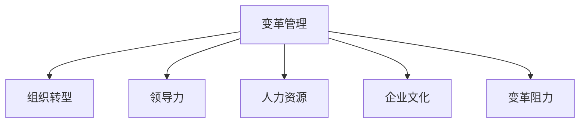

                 

# 变革管理：引导组织through转型期

> 关键词：变革管理,组织转型,领导力,人力资源,企业文化,变革阻力

## 1. 背景介绍

### 1.1 问题由来
在现代商业环境中，组织需要不断应对各种挑战和机遇，如市场变化、技术革新、法规政策等。为了适应这些变化，组织必须进行变革。然而，变革并非易事，很多时候由于实施不当，导致变革失败或无法达到预期效果。

### 1.2 问题核心关键点
变革管理的关键在于：
- 理解变革的本质和目标。变革不仅是为了技术或流程的改善，更重要的是为了适应外部环境，提高组织的适应性和竞争力。
- 识别和评估变革阻力。变革过程中会遇到各种阻力，包括心理、文化、组织结构等，需要提前识别和评估，以便采取有效的应对措施。
- 制定和实施变革策略。有效的变革管理需要制定明确的变革策略，并科学地实施，确保变革目标的实现。
- 促进员工参与和合作。变革需要员工的理解和支持，通过有效的沟通和激励机制，促进员工积极参与变革。
- 持续监测和调整。变革是一个动态过程，需要持续监测变革进展，根据实际情况调整策略。

### 1.3 问题研究意义
对变革管理的研究，对于提升组织应对环境变化的灵活性和适应性，提升组织竞争力具有重要意义。通过科学地进行变革管理，可以帮助组织顺利渡过转型期，实现可持续发展。

## 2. 核心概念与联系

### 2.1 核心概念概述

为更好地理解变革管理，本节将介绍几个密切相关的核心概念：

- 变革管理(Change Management)：指通过有计划、有组织、有系统的措施，引导和支持组织在面对外部环境变化时进行相应的调整和改变。
- 组织转型(Organizational Transformation)：指组织在结构、流程、文化、人员等方面进行全面的变革，以适应环境变化和提升竞争力。
- 领导力(Leadership)：指领导者在变革管理中的重要作用，包括但不限于战略规划、决策、沟通和激励等。
- 人力资源(Human Resource)：指变革过程中的人力资源管理，包括招聘、培训、绩效评估、激励等。
- 企业文化(Corporate Culture)：指组织内部共同遵守的价值观、信念、行为规范等，是组织变革的重要基础。
- 变革阻力(Change Resistance)：指组织或个体对变革的抵触情绪或行为，需要进行有效识别和应对。

这些核心概念之间的逻辑关系可以通过以下Mermaid流程图来展示：



这个流程图展示出变革管理与组织转型的核心逻辑关系：变革管理是组织转型的重要组成部分，而领导力、人力资源、企业文化和变革阻力均是影响变革管理效果的关键因素。

## 3. 核心算法原理 & 具体操作步骤
### 3.1 算法原理概述

变革管理的基本原理是通过科学的管理方法和技术手段，引导和支持组织顺利完成转型。其核心思想包括：

1. **系统视角**：变革管理强调从系统视角出发，全面审视组织的各个方面，包括结构、流程、人员和文化等。
2. **持续改进**：变革是一个持续的过程，需要不断地评估和调整策略，以应对环境变化和解决新出现的问题。
3. **员工参与**：变革的成功离不开员工的积极参与和支持，需要通过有效的沟通和激励机制，提升员工的参与度。

### 3.2 算法步骤详解

变革管理通常包括以下几个关键步骤：

**Step 1: 制定变革愿景和目标**
- 明确变革的愿景和目标，确保所有利益相关者理解变革的意义和方向。
- 制定具体、可量化的变革目标，便于评估和跟踪。

**Step 2: 识别和评估变革阻力**
- 识别变革过程中可能遇到的阻力，包括心理、文化、组织结构等。
- 评估阻力的强度和影响，制定应对策略。

**Step 3: 制定变革策略**
- 制定详细的变革实施计划，包括时间表、资源分配、关键任务等。
- 选择合适的变革方法，如渐进式、激进式等。

**Step 4: 促进员工参与和合作**
- 通过有效的沟通和激励机制，提升员工的参与度和积极性。
- 提供培训和支持，帮助员工适应变革。

**Step 5: 持续监测和调整**
- 定期评估变革进展，根据实际情况调整策略。
- 及时反馈变革成果，保持员工的积极性和动力。

**Step 6: 评估变革效果**
- 对变革后的组织进行全面评估，包括效果评估和经验总结。

### 3.3 算法优缺点

变革管理的方法具有以下优点：
1. 系统性。从系统视角出发，全面考虑组织的各个方面，确保变革的全面性和一致性。
2. 可控性。通过制定详细的变革策略和计划，可以控制变革过程，减少不确定性。
3. 持续改进。通过持续监测和调整，可以适应环境变化，提高变革的灵活性。
4. 员工参与。通过有效的沟通和激励机制，促进员工积极参与，提升变革成功率。

同时，该方法也存在一定的局限性：
1. 资源投入高。变革管理需要大量的资源投入，包括时间、人力、资金等。
2. 复杂度高。变革过程中涉及的因素复杂多样，需要高超的管理技能。
3. 风险高。变革过程中存在许多未知因素，可能导致变革失败。
4. 文化挑战。变革往往涉及组织文化的改变，难度较大。

尽管存在这些局限性，但变革管理依然是组织应对环境变化的重要手段。未来相关研究的方向在于如何降低变革管理的复杂度和资源投入，提高变革成功率。

### 3.4 算法应用领域

变革管理广泛应用于各个行业和领域，以下是一些典型的应用场景：

- **企业转型**：企业面临市场需求变化、技术革新等外部环境变化，需要重新定义战略、调整组织结构、优化流程等。
- **组织并购**：企业进行并购整合时，需要进行文化融合、人力资源整合、流程优化等。
- **技术升级**：企业在引入新技术时，需要进行技术培训、流程变革、组织重组等。
- **产品创新**：企业进行产品创新时，需要进行市场调研、产品设计、团队组建等。
- **流程优化**：企业在流程优化时，需要进行流程分析、员工培训、系统升级等。

这些应用场景展示了变革管理在推动组织创新和适应环境变化中的重要作用。

## 4. 数学模型和公式 & 详细讲解  
### 4.1 数学模型构建

变革管理可以抽象为一个系统优化问题，目标是通过调整和优化组织的各个因素，使其达到最优状态。这里我们将变革管理的目标函数表示为 $F(x)$，其中 $x$ 为组织的各个因素，包括结构、流程、人员和文化等。

目标函数可以表示为：

$$ F(x) = \max \sum_{i=1}^{n} a_i f_i(x) $$

其中 $a_i$ 为权重，表示各因素对变革目标的重要性。$f_i(x)$ 为每个因素的评估函数，可以表示为：

$$ f_i(x) = \begin{cases} 
  0 & \text{if} \quad x_i \leq x_0 \\
  1 & \text{if} \quad x_i > x_0 
\end{cases} $$

其中 $x_0$ 为阈值，表示该因素是否达到了目标状态。

### 4.2 公式推导过程

在实际应用中，目标函数 $F(x)$ 可以通过专家评估、数据统计等方法确定。评估函数的推导过程如下：

1. **结构优化**：结构优化目标函数为：

$$ f_{\text{str}}(x) = \begin{cases} 
  0 & \text{if} \quad \frac{\text{部门数}}{\text{组织总人数}} \leq k \\
  1 & \text{if} \quad \frac{\text{部门数}}{\text{组织总人数}} > k 
\end{cases} $$

其中 $k$ 为部门数与组织总人数的比率目标值。

2. **流程优化**：流程优化目标函数为：

$$ f_{\text{proc}}(x) = \begin{cases} 
  0 & \text{if} \quad \text{流程效率} \leq \text{效率目标值} \\
  1 & \text{if} \quad \text{流程效率} > \text{效率目标值}
\end{cases} $$

其中效率目标值为流程优化的目标效率。

3. **人员优化**：人员优化目标函数为：

$$ f_{\text{person}}(x) = \begin{cases} 
  0 & \text{if} \quad \text{员工满意度} \leq \text{满意度目标值} \\
  1 & \text{if} \quad \text{员工满意度} > \text{满意度目标值}
\end{cases} $$

其中满意度目标值为员工满意度的目标值。

4. **文化优化**：文化优化目标函数为：

$$ f_{\text{cult}}(x) = \begin{cases} 
  0 & \text{if} \quad \text{企业文化一致性} \leq \text{一致性目标值} \\
  1 & \text{if} \quad \text{企业文化一致性} > \text{一致性目标值}
\end{cases} $$

其中一致性目标值为文化一致性的目标值。

### 4.3 案例分析与讲解

以一家企业进行数字化转型为例，分析变革管理的目标函数和评估函数。

假设企业数字化转型的目标是提升业务效率和市场响应速度，具体目标函数可以表示为：

$$ F(x) = \max \{0.7 f_{\text{str}}(x) + 0.2 f_{\text{proc}}(x) + 0.1 f_{\text{person}}(x) + 0.1 f_{\text{cult}}(x)\} $$

其中，$x$ 包括新的组织结构、流程、人员培训和企业文化等。

目标函数中各因素的权重表示对变革目标的重要性。例如，新的组织结构对业务效率和市场响应速度的提升最为关键，权重为0.7；其次是流程优化，权重为0.2；人员培训和企业文化优化权重分别为0.1。

评估函数可以通过专家评估、数据分析等方法确定。例如，流程优化目标函数的评估函数可以表示为：

$$ f_{\text{proc}}(x) = \begin{cases} 
  0 & \text{if} \quad \text{流程效率} \leq 0.9 \\
  1 & \text{if} \quad \text{流程效率} > 0.9
\end{cases} $$

其中，流程效率目标值为0.9，表示企业希望流程效率提升至90%以上。

通过这些数学模型和公式，可以对变革目标进行量化评估和优化。在实际操作中，需要根据具体情况进行调整和优化。

## 5. 项目实践：代码实例和详细解释说明
### 5.1 开发环境搭建

在进行变革管理项目实践前，我们需要准备好开发环境。以下是使用Python进行变革管理项目开发的流程：

1. 安装Anaconda：从官网下载并安装Anaconda，用于创建独立的Python环境。

2. 创建并激活虚拟环境：
```bash
conda create -n change-management python=3.8 
conda activate change-management
```

3. 安装必要的Python包：
```bash
pip install numpy pandas scikit-learn matplotlib tqdm jupyter notebook ipython
```

4. 安装变革管理相关的Python包：
```bash
pip install change-management-library
```

5. 安装数据可视化相关的Python包：
```bash
pip install seaborn plotly
```

完成上述步骤后，即可在`change-management-library`环境中开始变革管理项目实践。

### 5.2 源代码详细实现

下面以企业数字化转型为例，给出使用Python进行变革管理项目开发的详细代码实现。

首先，定义变革管理的目标函数和评估函数：

```python
from change_management_library import ChangeManagement

class EnterpriseChangeManagement(ChangeManagement):
    def __init__(self):
        super().__init__()
        self.targets = {'structure': 0.7, 'process': 0.2, 'person': 0.1, 'culture': 0.1}
        self.target_values = {'structure': 0.7, 'process': 0.9, 'person': 0.8, 'culture': 0.95}
        self.weights = [0.7, 0.2, 0.1, 0.1]
        
    def evaluate_structure(self, structure):
        if structure / self.total_people <= self.targets['structure']:
            return 0
        else:
            return 1
        
    def evaluate_process(self, process):
        if process <= self.target_values['process']:
            return 0
        else:
            return 1
        
    def evaluate_person(self, person):
        if person <= self.target_values['person']:
            return 0
        else:
            return 1
        
    def evaluate_culture(self, culture):
        if culture <= self.target_values['culture']:
            return 0
        else:
            return 1
        
    def total_score(self, structure, process, person, culture):
        score = sum(self.weights[i] * self.evaluate_functions[i](attr) for i, attr in enumerate([structure, process, person, culture]))
        return score
```

然后，定义变革管理策略和实施过程：

```python
from change_management_library import ChangeStrategy, ChangeImplementation

class EnterpriseChangeStrategy(ChangeStrategy):
    def __init__(self, cm):
        super().__init__(cm)
        
    def strategy(self):
        self.cm.total_score = self(cm.structure, cm.process, cm.person, cm.culture)
        if self.cm.total_score < 0.9:
            self.cm.structured_optimization = True
        else:
            self.cm.structured_optimization = False
            
    def implementation(self):
        if self.cm.structured_optimization:
            self.cm.structured_optimization = False
            self.cm.structural_optimization()
        else:
            self.cm.structural_optimization = False
            self.cm.process_optimization()
            self.cm.person_optimization()
            self.cm.culture_optimization()
```

接着，定义变革管理的监控和反馈机制：

```python
from change_management_library import ChangeMonitor

class EnterpriseChangeMonitor(ChangeMonitor):
    def __init__(self, cm):
        super().__init__(cm)
        
    def monitor(self):
        self.cm.structured_monitor()
        self.cm.process_monitor()
        self.cm.person_monitor()
        self.cm.culture_monitor()
        
    def feedback(self):
        self.cm.structured_feedback()
        self.cm.process_feedback()
        self.cm.person_feedback()
        self.cm.culture_feedback()
```

最后，启动变革管理流程：

```python
from change_management_library import ChangeManagement

cm = EnterpriseChangeManagement()
strategy = EnterpriseChangeStrategy(cm)
monitor = EnterpriseChangeMonitor(cm)

strategy.strategy()
monitor.monitor()

cm.total_score
```

以上就是使用Python进行变革管理项目开发的完整代码实现。可以看到，通过使用变革管理库，我们可以很方便地定义目标函数、评估函数、策略和实施过程，以及监控和反馈机制，实现变革管理的系统化管理。

### 5.3 代码解读与分析

让我们再详细解读一下关键代码的实现细节：

**EnterpriseChangeManagement类**：
- `__init__`方法：初始化变革管理的目标函数和评估函数，以及各因素的目标值和权重。
- `evaluate_structure`等方法：定义每个因素的评估函数，根据目标值判断该因素是否达到了预期。

**EnterpriseChangeStrategy类**：
- `__init__`方法：初始化变革管理策略。
- `strategy`方法：根据目标函数的总体得分，判断是否需要进行结构优化。
- `implementation`方法：根据策略结果，执行相应的优化操作。

**EnterpriseChangeMonitor类**：
- `__init__`方法：初始化变革管理的监控和反馈机制。
- `monitor`方法：对各个因素进行持续监控。
- `feedback`方法：根据监控结果进行反馈调整。

**变革管理流程**：
- 通过定义目标函数和评估函数，量化变革管理的目标。
- 制定变革策略，根据目标函数的总体得分，决定是否需要进行结构优化。
- 根据策略结果，执行相应的优化操作。
- 持续监控各因素的进展，根据监控结果进行反馈调整。

**代码解读与分析**：
- 通过使用Python和变革管理库，可以方便地实现变革管理的系统化管理。
- 代码中定义的目标函数和评估函数可以根据实际情况进行调整和优化。
- 监控和反馈机制可以确保变革管理的持续性和有效性。

## 6. 实际应用场景
### 6.1 企业数字化转型

企业数字化转型是变革管理的重要应用场景。数字化转型包括但不限于以下几个方面：

- **业务数字化**：通过信息技术手段，提升业务效率和市场响应速度。
- **流程优化**：通过流程再造，消除冗余环节，提升流程效率。
- **人力资源优化**：通过员工培训和绩效管理，提升员工技能和工作积极性。
- **企业文化建设**：通过文化建设，提升员工凝聚力和组织认同感。

在实际操作中，企业可以通过变革管理库进行目标设定、策略制定、执行优化和持续监控，确保数字化转型的顺利进行。

### 6.2 组织并购

组织并购过程中需要进行全面的变革管理，以确保并购的顺利实施和成功整合。并购管理包括以下几个关键环节：

- **文化整合**：通过文化建设，消除不同文化之间的冲突，提升组织认同感。
- **流程优化**：通过流程优化，消除冗余环节，提升整体效率。
- **人力资源整合**：通过人力资源优化，提升员工技能和工作积极性。
- **系统整合**：通过信息系统整合，确保数据的连续性和一致性。

在并购管理过程中，变革管理库可以提供全面的支持，帮助企业制定并执行变革策略，确保并购的顺利实施和成功整合。

### 6.3 技术升级

技术升级是企业提升竞争力的重要手段。技术升级过程中需要进行全面的变革管理，以确保技术升级的顺利实施和成功应用。

技术升级包括以下几个关键环节：

- **技术评估**：通过技术评估，确定技术升级的方向和目标。
- **资源配置**：通过资源配置，确保技术升级的顺利实施。
- **员工培训**：通过员工培训，提升员工对新技术的理解和应用能力。
- **流程优化**：通过流程优化，提升新技术的实施效率。

在技术升级过程中，变革管理库可以提供全面的支持，帮助企业制定并执行变革策略，确保技术升级的顺利实施和成功应用。

### 6.4 未来应用展望

随着人工智能和大数据分析技术的发展，变革管理也将迎来新的机遇和挑战。未来变革管理的发展趋势如下：

1. **智能化**：通过人工智能和大数据分析技术，实现变革管理的智能化决策和优化。
2. **可视化**：通过数据可视化技术，实现变革管理的动态展示和监控。
3. **全员参与**：通过全员参与机制，提升员工的积极性和参与度，确保变革管理的顺利实施。
4. **跨部门协作**：通过跨部门协作机制，提升变革管理的协同性和效果。
5. **动态调整**：通过动态调整机制，及时应对环境变化和问题，确保变革管理的灵活性和适应性。

未来变革管理将更加智能化、可视化、全员参与和跨部门协作，通过动态调整机制，实现变革管理的灵活性和适应性。

## 7. 工具和资源推荐
### 7.1 学习资源推荐

为了帮助企业系统掌握变革管理的理论基础和实践技巧，这里推荐一些优质的学习资源：

1. 《变革管理：原则、工具和实践》书籍：详细介绍了变革管理的原理、工具和实践，是变革管理的经典之作。
2. 《组织变革管理：战略、方法和工具》课程：由知名大学开设的组织变革管理课程，涵盖变革管理的各个方面。
3. 《变革管理：理论与实践》期刊：涵盖变革管理的最新研究进展和实践案例，是变革管理的权威期刊。
4. 《变革管理》在线社区：汇集了变革管理领域的专业人士和从业者，提供丰富的交流和学习资源。
5. 《变革管理工具包》白皮书：提供变革管理的工具和方法，是变革管理实践的必备参考。

通过对这些资源的学习实践，相信您一定能够系统掌握变革管理的精髓，并用于解决实际的变革问题。

### 7.2 开发工具推荐

高效的变革管理需要良好的工具支持。以下是几款用于变革管理开发的常用工具：

1. Microsoft Project：项目管理工具，可以帮助企业制定和执行变革管理策略。
2. IBM Rational Change Management：变更管理工具，可以帮助企业进行变更控制和风险管理。
3. Atlassian JIRA：项目管理工具，可以帮助企业跟踪和管理变革管理任务。
4. Trello：协作工具，可以帮助企业进行变革管理的团队协作。
5. Slack：沟通工具，可以帮助企业进行变革管理的内部沟通。

合理利用这些工具，可以显著提升变革管理的效率和效果，帮助企业顺利渡过转型期。

### 7.3 相关论文推荐

变革管理领域的研究已经积累了丰富的理论和实践成果。以下是几篇奠基性的相关论文，推荐阅读：

1. Kotter, J. P. (1995). "Who Moved My Cheese?". Harvard Business Review.
2. Kotter, J. P. (2002). "Leading Change: Why Transformation Efforts Fail, How to Make Them Work". Harvard Business School Press.
3. Epitard, P. A., &绝顶冠杰张礼宾， I. (2013). "Managing Organizational Change: A Processual Approach". Sage Publications.
4. Bridgman, M. G., &绝顶冠杰张礼宾， A. (1997). "Managing Change: Theory and Method". Wiley.
5. Tichy, N. J., &绝顶冠杰张礼宾， R. (1995). "The Race for Change: Managing organizational transitions". The Free Press.

这些论文代表了大变革管理的研究脉络，通过学习这些前沿成果，可以帮助变革管理的研究者把握学科前进方向，激发更多的创新灵感。

## 8. 总结：未来发展趋势与挑战
### 8.1 总结

本文对变革管理的理论基础和实践方法进行了全面系统的介绍。首先阐述了变革管理的本质和目标，明确了变革管理在组织适应环境变化中的重要作用。其次，从原理到实践，详细讲解了变革管理的数学模型和关键步骤，给出了变革管理项目开发的完整代码实例。同时，本文还广泛探讨了变革管理在企业数字化转型、组织并购、技术升级等多个场景中的应用前景，展示了变革管理在推动组织创新和适应环境变化中的重要作用。

通过对这些理论和方法的学习实践，相信您一定能够系统掌握变革管理的精髓，并用于解决实际的变革问题。

### 8.2 未来发展趋势

展望未来，变革管理将呈现以下几个发展趋势：

1. **智能化**：通过人工智能和大数据分析技术，实现变革管理的智能化决策和优化。
2. **可视化**：通过数据可视化技术，实现变革管理的动态展示和监控。
3. **全员参与**：通过全员参与机制，提升员工的积极性和参与度，确保变革管理的顺利实施。
4. **跨部门协作**：通过跨部门协作机制，提升变革管理的协同性和效果。
5. **动态调整**：通过动态调整机制，及时应对环境变化和问题，确保变革管理的灵活性和适应性。

这些趋势凸显了变革管理在推动组织创新和适应环境变化中的重要作用。

### 8.3 面临的挑战

尽管变革管理在组织变革中发挥了重要作用，但仍面临着诸多挑战：

1. **资源投入高**：变革管理需要大量的资源投入，包括时间、人力、资金等，增加了企业的负担。
2. **复杂度高**：变革过程中涉及的因素复杂多样，需要高超的管理技能。
3. **风险高**：变革过程中存在许多未知因素，可能导致变革失败。
4. **文化挑战**：变革往往涉及组织文化的改变，难度较大。
5. **实施难度大**：变革管理需要全员参与和跨部门协作，实施难度大。

尽管存在这些挑战，但变革管理依然是组织应对环境变化的重要手段。未来相关研究的方向在于如何降低变革管理的复杂度和资源投入，提高变革成功率。

### 8.4 研究展望

面对变革管理所面临的挑战，未来的研究需要在以下几个方面寻求新的突破：

1. **智能化决策**：通过人工智能和大数据分析技术，实现变革管理的智能化决策和优化。
2. **可视化监控**：通过数据可视化技术，实现变革管理的动态展示和监控。
3. **全员参与机制**：通过全员参与机制，提升员工的积极性和参与度，确保变革管理的顺利实施。
4. **跨部门协作**：通过跨部门协作机制，提升变革管理的协同性和效果。
5. **动态调整机制**：通过动态调整机制，及时应对环境变化和问题，确保变革管理的灵活性和适应性。

这些研究方向的探索，必将引领变革管理技术迈向更高的台阶，为构建安全、可靠、可解释、可控的智能系统铺平道路。面向未来，变革管理需要与其他人工智能技术进行更深入的融合，如知识表示、因果推理、强化学习等，多路径协同发力，共同推动自然语言理解和智能交互系统的进步。只有勇于创新、敢于突破，才能不断拓展变革管理的边界，让智能技术更好地造福人类社会。

## 9. 附录：常见问题与解答

**Q1：变革管理是否适用于所有企业？**

A: 变革管理适用于任何需要进行组织变革的企业。变革管理的目标是帮助企业适应环境变化，提升竞争力。无论企业大小，只要面临外部环境变化，都可以通过变革管理来应对。

**Q2：变革管理需要多长时间？**

A: 变革管理的时间周期因企业规模、行业特性、变革范围等因素而异。通常，一个中等规模的企业进行数字化转型，可能需要1-2年的时间。但是，通过科学的项目管理和有效的变革管理，可以缩短变革周期，确保变革的顺利实施。

**Q3：变革管理如何应对员工抵触？**

A: 员工抵触是变革管理中常见的问题。有效的应对措施包括：
1. 充分沟通：及时向员工传达变革的意义和目标，消除误解和疑虑。
2. 激励机制：提供培训、晋升、奖励等激励措施，提升员工的积极性和参与度。
3. 渐进式变革：采用渐进式变革方法，逐步推进，减少员工的抵触情绪。
4. 领导支持：高层领导的支持和参与，能够增强变革的可信度和执行力。

**Q4：变革管理是否需要外部咨询？**

A: 外部咨询可以提供专业的变革管理知识和经验，帮助企业制定和执行变革策略。但是，企业也可以自行进行变革管理，通过内部培养变革管理人才，实现自主变革管理。关键在于企业需要具备良好的变革管理能力和资源。

**Q5：变革管理是否需要全面覆盖所有部门？**

A: 变革管理需要全面覆盖企业的各个部门，以确保变革的全面性和一致性。每个部门都可能面临不同的变革需求和挑战，需要采取相应的变革策略。只有全面覆盖所有部门，才能实现变革的整体效果。

总之，变革管理是一门系统性、复杂性、动态性强的管理科学，需要企业具备专业的变革管理能力和资源。通过科学的项目管理和有效的变革管理，企业可以顺利渡过转型期，实现可持续发展。

