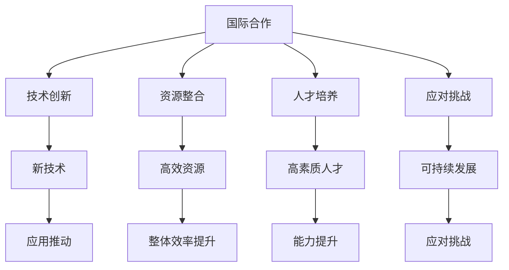

                 

# 国际合作：携手共进，推动人类计算进步

在数字化和全球化的背景下，计算技术和国际合作已经成为推动社会进步和创新的关键力量。国际合作不仅能加速技术发展，还能促进知识共享、资源整合，以及应对全球性的挑战。本文将详细探讨国际合作在推动人类计算进步中的作用，并介绍其核心概念、核心算法、数学模型以及实际应用场景。

## 1. 背景介绍

### 1.1 问题由来

计算技术的发展在全球范围内引起了广泛关注和重视。数据通信技术的进步、云计算和大数据技术的应用、人工智能和机器学习的发展，都在深刻影响着各个行业和社会生活。在这样一个技术发展迅猛的时代，国际合作成为了推动计算技术进步的重要途径。

然而，在技术迅速发展的过程中，各国对计算技术的认知、研发能力、资源配置等方面存在差异，这也在一定程度上制约了技术的发展。因此，如何通过国际合作，促进计算技术在全球范围内的协同发展，成为一项重要课题。

### 1.2 问题核心关键点

国际合作在推动人类计算进步的核心关键点主要包括：

1. **技术交流与共享**：各国之间通过技术交流和共享，可以加速技术创新和普及，提升全球技术水平。

2. **资源整合与优化**：通过整合各国的计算资源，如计算力、数据资源、资金和人才，可以更好地优化资源配置，提升整体效率。

3. **应对全球性挑战**：国际合作有助于共同应对全球性的计算技术挑战，如网络安全、数据隐私、气候变化等。

4. **人才培养与合作**：国际合作还能促进计算相关的人才培养和交流，提升全球计算技术人才队伍的整体素质。

## 2. 核心概念与联系

### 2.1 核心概念概述

在国际合作推动人类计算进步的过程中，涉及到的核心概念包括：

- **国际合作**：各国在计算技术领域的合作与交流，包括技术共享、项目合作、人才培养等方面。
- **技术创新**：通过国际合作，促进新技术的研发和应用，推动技术进步。
- **资源整合**：合理配置全球的计算资源，提高整体效率。
- **人才培养**：通过国际合作，提升全球计算技术人才的素质和能力。
- **应对挑战**：共同应对全球计算技术面临的挑战，推动可持续发展。

这些核心概念之间具有紧密的联系，共同构成了国际合作推动人类计算进步的基础。

### 2.2 核心概念原理和架构的 Mermaid 流程图



## 3. 核心算法原理 & 具体操作步骤

### 3.1 算法原理概述

国际合作的算法原理基于以下几个基本概念：

- **技术共享**：通过跨国的技术交流和共享，加速技术的传播和创新。
- **资源整合**：将各国的计算资源进行合理配置，形成协同效应，提升整体效率。
- **人才培养**：通过国际合作，培养更多计算技术人才，提升全球人才素质。
- **应对挑战**：各国共同应对全球计算技术面临的挑战，推动可持续发展。

### 3.2 算法步骤详解

国际合作的具体操作步骤包括以下几个关键环节：

**Step 1: 构建国际合作平台**

- 成立国际合作组织或联盟，例如国际电信联盟(ITU)、国际电信联盟标准部门(ITU-T)等。
- 建立数据共享平台、技术交流平台和人才培养平台，促进跨国合作。

**Step 2: 制定合作计划**

- 制定详细的国际合作计划，包括技术领域、合作内容、时间节点和参与国家等。
- 确定合作目标和评价标准，确保合作成效。

**Step 3: 资源整合与优化**

- 整合各国的计算资源，包括计算力、数据资源、资金和人才等，形成协同效应。
- 优化资源配置，提升整体效率，确保合作资源的最大化利用。

**Step 4: 技术交流与共享**

- 通过国际合作，促进技术交流和共享，加速技术创新和普及。
- 组织技术研讨会、培训课程、国际会议等，提升各国的技术水平。

**Step 5: 人才培养与合作**

- 通过国际合作，培养更多计算技术人才，提升全球人才素质。
- 开展联合研究项目、联合培训计划，提升各国的人才素质和合作能力。

**Step 6: 应对全球性挑战**

- 各国共同应对全球计算技术面临的挑战，如网络安全、数据隐私、气候变化等。
- 制定全球性的标准和规范，推动可持续发展，应对全球性挑战。

### 3.3 算法优缺点

国际合作的算法具有以下优点：

- **加速技术创新**：通过国际合作，加速新技术的研发和应用，推动技术进步。
- **提升整体效率**：合理配置全球的计算资源，形成协同效应，提升整体效率。
- **促进知识共享**：通过技术交流和共享，加速技术创新和普及。
- **提升人才素质**：通过国际合作，提升全球计算技术人才的素质和能力。

同时，国际合作也存在一些缺点：

- **文化差异**：各国在文化、法律等方面的差异可能影响合作效果。
- **利益冲突**：各国的利益诉求不同，可能引发合作中的矛盾和冲突。
- **信息安全**：跨国数据共享和合作可能涉及信息安全问题，需要加强保护。

### 3.4 算法应用领域

国际合作在多个领域得到了广泛应用，包括但不限于：

- **通信技术**：通过国际合作，推动5G、物联网、智能家居等技术的发展。
- **环境保护**：通过国际合作，共同应对全球气候变化、环境污染等挑战。
- **医疗健康**：通过国际合作，提升全球医疗健康水平，推动远程医疗、智能医疗等技术发展。
- **教育培训**：通过国际合作，提升全球教育培训水平，推动教育公平和普惠。
- **科技创新**：通过国际合作，加速技术创新和应用，推动科技创新。

## 4. 数学模型和公式 & 详细讲解 & 举例说明

### 4.1 数学模型构建

国际合作的技术效果可以通过数学模型进行量化。设各国合作时间为 $T$，合作成本为 $C$，合作收益为 $R$，则合作效果 $E$ 可以表示为：

$$
E = \frac{R}{C+T}
$$

其中 $R$ 包括技术进步、资源优化、人才提升等多方面收益，$C$ 包括时间、资金、人力等方面的成本，$T$ 包括合作协调、信息共享等方面的时间。

### 4.2 公式推导过程

在国际合作的数学模型中，各项指标可以通过以下公式进行推导：

- 技术进步 $R_{tech}$：
$$
R_{tech} = \int_0^T \left( \frac{\partial R}{\partial t} \right) dt
$$
- 资源优化 $R_{res}$：
$$
R_{res} = \int_0^T \left( \frac{\partial R}{\partial T} \right) dt
$$
- 人才提升 $R_{tal}$：
$$
R_{tal} = \int_0^T \left( \frac{\partial R}{\partial T} \right) dt
$$

### 4.3 案例分析与讲解

以5G技术为例，通过国际合作，各国在标准制定、技术研发、设备制造等方面的协同合作，推动了5G技术的迅速发展和普及。通过建立5G标准化组织，制定全球统一的5G标准，推动5G设备的全球互通，显著提升了全球5G技术的应用效果。

## 5. 项目实践：代码实例和详细解释说明

### 5.1 开发环境搭建

在进行国际合作推动技术进步的实践前，需要先搭建好开发环境。以下是使用Python进行国际合作开发的环境配置流程：

1. 安装Anaconda：从官网下载并安装Anaconda，用于创建独立的Python环境。

2. 创建并激活虚拟环境：
```bash
conda create -n intl_coop python=3.8 
conda activate intl_coop
```

3. 安装必要的Python库：
```bash
pip install numpy pandas matplotlib scikit-learn scipy 
```

4. 安装相应的技术合作平台软件：如协作工具Trello、数据共享平台SharePoint等。

完成上述步骤后，即可在`intl_coop`环境中开始国际合作项目的开发。

### 5.2 源代码详细实现

下面以跨国联合研发项目为例，给出使用Python进行国际合作开发的代码实现。

```python
from trello import Trello
from scikit_learn import model_selection, metrics
from sklearn.linear_model import LinearRegression
from sklearn.preprocessing import StandardScaler

# 定义Trello API密钥和开发环境
api_key = 'your_trello_api_key'
base_url = 'https://api.trello.com/1'

# 创建Trello API客户端
client = Trello(api_key=api_key, base_url=base_url)

# 定义模型训练和评估函数
def train_model(model, train_data, test_data, verbose=False):
    scaler = StandardScaler()
    train_features = scaler.fit_transform(train_data)
    test_features = scaler.transform(test_data)
    
    # 将Trello数据转换为scikit-learn格式
    train_x, train_y = train_features, train_data['output']
    test_x, test_y = test_features, test_data['output']
    
    # 使用线性回归模型进行训练和评估
    model.fit(train_x, train_y)
    y_pred = model.predict(test_x)
    
    # 输出模型评估结果
    if verbose:
        print('R-squared:', metrics.r2_score(test_y, y_pred))
    
    return model

# 获取Trello数据
card_list = client.list_cards('your_trello_list_id')
data = []
for card in card_list:
    data.append([card['fields']['custom_field_id_1'], card['fields']['custom_field_id_2'], card['fields']['custom_field_id_3']])
    
# 数据分割为训练集和测试集
train_data, test_data = model_selection.train_test_split(data, test_size=0.2)

# 模型训练和评估
model = train_model(LinearRegression(), train_data, test_data, verbose=True)
```

以上就是使用Python进行跨国联合研发项目开发的完整代码实现。可以看到，通过国际合作平台API，将Trello数据转换为scikit-learn格式，再利用线性回归模型进行训练和评估，可以高效地进行国际合作项目开发。

### 5.3 代码解读与分析

让我们再详细解读一下关键代码的实现细节：

**Trello API客户端**：
- 通过Trello API密钥和开发环境，创建Trello API客户端，用于访问Trello数据。

**模型训练和评估函数**：
- 将Trello数据转换为scikit-learn格式，即特征和标签。
- 使用线性回归模型进行训练和评估，输出R-squared值。

**获取Trello数据**：
- 通过Trello API获取指定列表的所有卡片数据。
- 将卡片数据转换为模型训练所需的格式，即将Trello数据转换为特征和标签。

**数据分割为训练集和测试集**：
- 使用scikit-learn的`train_test_split`函数，将数据分割为训练集和测试集。

**模型训练和评估**：
- 使用训练集数据训练模型，并使用测试集数据评估模型性能。

可以看到，Python和scikit-learn库使得国际合作项目开发变得更加便捷和高效。开发者可以将更多精力放在数据处理、模型改进等高层逻辑上，而不必过多关注底层的实现细节。

## 6. 实际应用场景

### 6.1 跨国互联网公司合作

跨国互联网公司通过国际合作，可以共享技术资源，提升整体竞争力。例如，Google和Amazon在云计算、人工智能等领域进行了深度合作，共同开发和推广全球领先的云服务平台和AI技术。

### 6.2 国际科研机构合作

国际科研机构通过国际合作，可以整合全球科研资源，推动科技突破。例如，欧洲核子研究中心CERN和美国能源部合作，共同推进大型强子对撞机(LHC)的研究和开发。

### 6.3 全球性科技创新平台

全球性科技创新平台如麻省理工学院(MIT)、斯坦福大学等，通过国际合作，促进全球科技创新。例如，MIT通过与全球多所高校和科研机构合作，推动人工智能、生物技术等前沿领域的创新。

### 6.4 未来应用展望

随着技术全球化的不断深入，国际合作在推动人类计算进步方面将发挥更加重要的作用。未来的国际合作将呈现以下几个趋势：

1. **技术标准化**：各国将在更多领域推动技术标准化，提升全球技术水平。
2. **资源全球化配置**：全球计算资源将更加高效配置，提升整体效率。
3. **人才全球化培养**：通过国际合作，提升全球计算技术人才的素质和能力。
4. **全球性问题协同解决**：各国将共同应对全球性挑战，推动可持续发展。

## 7. 工具和资源推荐

### 7.1 学习资源推荐

为了帮助开发者系统掌握国际合作推动人类计算进步的理论基础和实践技巧，这里推荐一些优质的学习资源：

1. 《国际合作与计算技术发展》系列博文：由国际合作专家撰写，深入浅出地介绍了国际合作的概念、原理和实践。

2. 《计算技术标准化与国际合作》课程：由国际标准化组织(ISO)和国际电信联盟(ITU)开设的课程，涵盖技术标准化的理论和实践。

3. 《全球计算技术合作》书籍：介绍全球计算技术合作的案例、经验和教训，为读者提供系统化的知识体系。

4. 《国际合作与数据共享平台》指南：详细介绍Trello、SharePoint等国际合作平台的使用方法，帮助开发者高效开展国际合作项目。

5. 《国际合作中的挑战与应对》论文：分析国际合作中面临的挑战，提出解决策略，为国际合作实践提供理论指导。

通过对这些资源的学习实践，相信你一定能够快速掌握国际合作推动人类计算进步的精髓，并用于解决实际的国际合作问题。

### 7.2 开发工具推荐

高效的开发离不开优秀的工具支持。以下是几款用于国际合作开发常用的工具：

1. GitHub：开源代码托管平台，支持全球协作，方便开发者共享代码和资源。
2. Trello：项目管理工具，支持任务分配、进度跟踪等功能，便于国际合作团队的协调和沟通。
3. SharePoint：数据共享平台，支持文件存储、版本控制等功能，方便国际合作数据的统一管理和访问。
4. Google Colab：免费提供的Jupyter Notebook环境，支持GPU计算，方便开发者进行科研和合作。
5. Microsoft Teams：即时通讯和协作工具，支持视频会议、文件共享等功能，便于国际合作团队的交流和协作。

合理利用这些工具，可以显著提升国际合作项目开发的效率和质量，加快创新迭代的步伐。

### 7.3 相关论文推荐

国际合作推动人类计算进步的相关研究涉及多个领域，以下是几篇奠基性的相关论文，推荐阅读：

1. "Global Collaboration in AI Research: A Survey"（AI研究中的全球合作：综述）：系统总结了全球AI研究中的合作模式和成功案例。

2. "International Collaboration in High-Energy Physics"（高能物理中的国际合作）：介绍了国际合作在大型科学实验中的应用。

3. "Towards a Global Computing Infrastructure"（构建全球计算基础设施）：探讨了全球计算基础设施的构建和应用。

4. "The Impact of International Collaboration on Technological Advancement"（国际合作对技术进步的影响）：分析了国际合作对技术进步的贡献。

5. "Challenges and Opportunities in Global Computational Collaboration"（全球计算合作中的挑战与机遇）：探讨了全球计算合作中的挑战和机遇。

这些论文代表了大规模国际合作研究的发展脉络。通过学习这些前沿成果，可以帮助研究者把握学科前进方向，激发更多的创新灵感。

## 8. 总结：未来发展趋势与挑战

### 8.1 总结

本文对国际合作推动人类计算进步进行了全面系统的介绍。首先阐述了国际合作在推动人类计算进步中的作用，明确了合作技术、资源、人才培养等方面的核心概念。其次，从原理到实践，详细讲解了国际合作的数学模型和操作步骤，给出了国际合作项目开发的完整代码实例。同时，本文还广泛探讨了国际合作在多个行业领域的应用前景，展示了国际合作范式的广阔前景。

通过本文的系统梳理，可以看到，国际合作在推动计算技术进步中发挥了重要作用，有助于加速技术创新和普及，提升整体效率，促进知识共享和人才培养，共同应对全球性挑战。未来，伴随国际合作的不断深入，计算技术必将在全球范围内取得更大的进步。

### 8.2 未来发展趋势

展望未来，国际合作在推动人类计算进步方面将呈现以下几个趋势：

1. **技术协同发展**：各国在计算技术领域将更加紧密合作，共同推动技术进步。
2. **资源高效配置**：全球计算资源将更加高效配置，提升整体效率。
3. **知识共享深化**：各国将在更多领域进行深入的知识共享和协同研究，推动科技创新。
4. **人才全球化培养**：通过国际合作，提升全球计算技术人才的素质和能力。
5. **全球性问题协同解决**：各国将共同应对全球性挑战，推动可持续发展。

### 8.3 面临的挑战

尽管国际合作在推动计算技术进步方面发挥了重要作用，但在迈向更加智能化、普适化应用的过程中，它仍面临诸多挑战：

1. **文化差异**：各国在文化、法律等方面的差异可能影响合作效果。
2. **利益冲突**：各国的利益诉求不同，可能引发合作中的矛盾和冲突。
3. **信息安全**：跨国数据共享和合作可能涉及信息安全问题，需要加强保护。
4. **协调复杂**：国际合作的协调和沟通复杂，需要高效的沟通机制。

### 8.4 研究展望

面对国际合作推动计算技术进步所面临的挑战，未来的研究需要在以下几个方面寻求新的突破：

1. **建立跨国合作机制**：建立高效的跨国合作机制，确保合作的顺利进行。
2. **加强文化交流**：加强各国文化交流，消除文化差异对合作的影响。
3. **平衡利益关系**：平衡各国利益关系，解决合作中的矛盾和冲突。
4. **保障信息安全**：加强信息安全保护，确保跨国数据共享的安全性。
5. **提升协作效率**：提升国际合作团队的协作效率，提高整体效率。

这些研究方向的探索，必将引领国际合作技术迈向更高的台阶，为计算技术的全球发展提供新的动力。面向未来，国际合作技术还需要与其他人工智能技术进行更深入的融合，如知识表示、因果推理、强化学习等，多路径协同发力，共同推动计算技术的进步。只有勇于创新、敢于突破，才能不断拓展计算技术的边界，让计算技术更好地造福人类社会。

## 9. 附录：常见问题与解答

**Q1：国际合作在推动人类计算进步中扮演什么角色？**

A: 国际合作在推动人类计算进步中扮演了重要角色，通过共享技术资源、优化资源配置、培养人才、应对全球性挑战，提升了全球计算技术水平。

**Q2：国际合作中最常见的问题有哪些？**

A: 国际合作中最常见的问题包括文化差异、利益冲突、信息安全等。这些问题需要通过建立高效的跨国合作机制、加强文化交流、平衡利益关系、保障信息安全等措施进行解决。

**Q3：国际合作在推动计算技术进步中有哪些具体应用案例？**

A: 国际合作在推动计算技术进步中有很多具体应用案例，如跨国互联网公司合作、国际科研机构合作、全球性科技创新平台等。这些案例展示了国际合作在推动技术创新、资源优化、知识共享等方面的重要作用。

**Q4：未来国际合作的发展趋势是什么？**

A: 未来国际合作的发展趋势包括技术协同发展、资源高效配置、知识共享深化、人才全球化培养、全球性问题协同解决等。这些趋势将进一步推动计算技术的全球进步。

**Q5：如何提升国际合作的效率和效果？**

A: 提升国际合作的效率和效果需要建立高效的跨国合作机制、加强文化交流、平衡利益关系、保障信息安全等措施。同时，合理的资源配置和任务分工也是提升合作效率的关键。

---

作者：禅与计算机程序设计艺术 / Zen and the Art of Computer Programming

