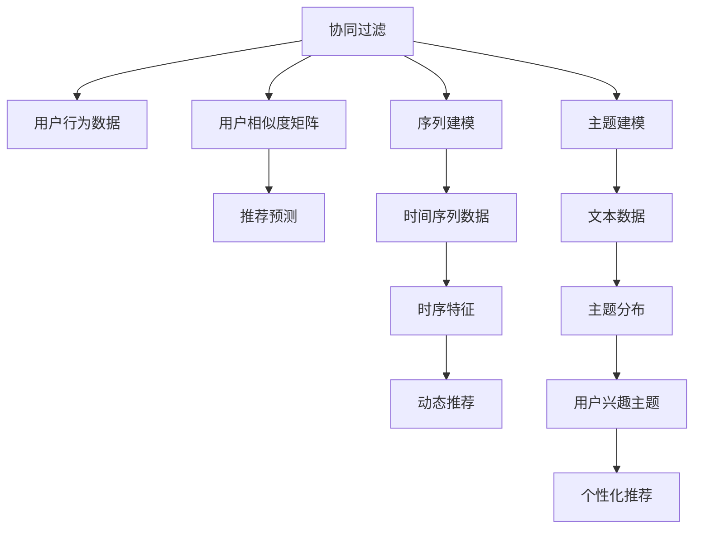

                 

# 基于LLM的推荐系统用户兴趣主题建模

> 关键词：推荐系统, 用户兴趣建模, 自然语言处理, 主题建模, 语言模型, 协同过滤, 序列建模, 深度学习

## 1. 背景介绍

### 1.1 问题由来
推荐系统已经成为现代互联网应用不可或缺的一部分，广泛应用于电商、新闻、视频等多个领域，为亿万用户提供个性化内容推荐。传统的推荐系统基于协同过滤（Collaborative Filtering, CF）等模型，主要利用用户行为数据进行推荐。然而，这些方法往往需要收集海量的用户行为数据，且难以处理新用户和老用户之间的差异。近年来，随着深度学习的发展，基于自然语言处理（NLP）的推荐系统方法逐渐兴起，这些方法通过挖掘用户评论、文章等文本数据，捕捉用户兴趣，从而生成推荐结果。

自然语言处理（NLP）技术在推荐系统中的应用，主要集中在用户兴趣建模、主题建模、序列建模等方面。其中，基于语言模型的推荐系统方法，通过预训练语言模型对用户输入的评论、文章等文本数据进行编码，捕捉用户兴趣主题，然后基于这些主题生成推荐结果。这一方法在电商、新闻等领域中取得了不错的效果，但由于文本数据量巨大、处理方式复杂，实际部署难度较高。

本文聚焦于基于大语言模型（Large Language Models, LLMs）的用户兴趣主题建模，对现有方法的优缺点进行详细分析，并给出实际应用中的建议和策略。通过本文的学习，读者将对基于LLM的推荐系统有一个全面的认识，掌握如何利用大语言模型为用户建模，生成个性化的推荐内容。

## 2. 核心概念与联系

### 2.1 核心概念概述

为更好地理解基于LLM的推荐系统，本节将介绍几个关键概念：

- **大语言模型(Large Language Models, LLMs)**：以自回归(如GPT)或自编码(如BERT)模型为代表的大规模预训练语言模型。通过在大规模无标签文本语料上进行预训练，学习通用的语言表示，具备强大的语言理解和生成能力。

- **协同过滤(Collaborative Filtering, CF)**：一种基于用户行为数据的推荐算法，通过用户行为数据构建用户和物品的相似度矩阵，进行推荐预测。

- **序列建模(Sequence Modeling)**：利用时间序列数据进行建模，捕捉用户行为的时序特征，实现动态推荐。

- **主题建模(Thematic Modeling)**：通过分析文本数据，捕捉其中的主题信息，为推荐系统提供更丰富的用户兴趣表达。

- **自然语言处理(Natural Language Processing, NLP)**：利用计算机处理和理解人类语言的技术，涵盖了文本处理、语言理解、语言生成等多个方面。

这些概念之间的逻辑关系可以通过以下Mermaid流程图来展示：



这个流程图展示了大语言模型在推荐系统中的核心作用：

1. 协同过滤通过用户行为数据构建相似度矩阵，进行推荐预测。
2. 序列建模利用时间序列数据捕捉用户行为的时序特征，实现动态推荐。
3. 主题建模通过分析文本数据捕捉其中的主题信息，提供更丰富的用户兴趣表达。
4. 大语言模型利用预训练能力，捕捉用户评论、文章等文本数据中的主题信息，生成个性化推荐。

## 3. 核心算法原理 & 具体操作步骤
### 3.1 算法原理概述

基于大语言模型的推荐系统，主要利用预训练语言模型对用户评论、文章等文本数据进行编码，捕捉用户兴趣主题，然后基于这些主题生成推荐结果。其核心思想是：将预训练的语言模型看作一个强大的特征提取器，通过用户文本数据的编码，捕捉其中的主题信息，然后基于这些主题信息进行推荐生成。

### 3.2 算法步骤详解

基于LLM的推荐系统用户兴趣主题建模，一般包括以下几个关键步骤：

**Step 1: 数据准备与预处理**

- 收集用户评论、文章等文本数据，并将其分为训练集、验证集和测试集。
- 对文本数据进行预处理，包括分词、去停用词、词向量化等，以便于后续建模。

**Step 2: 选择预训练模型**

- 选择合适的预训练语言模型（如BERT、GPT、RoBERTa等）作为初始化参数。
- 加载预训练模型，并设置相应的模型参数。

**Step 3: 主题建模**

- 利用预训练语言模型对用户文本数据进行编码，得到向量表示。
- 通过主题模型（如LDA、LSI等）对编码后的向量进行主题建模，得到用户文本的主题分布。

**Step 4: 推荐生成**

- 基于用户文本的主题分布，生成推荐结果。
- 可以选择基于内容的推荐，根据用户的主题兴趣生成推荐内容；也可以选择基于协同过滤的推荐，根据用户和物品之间的相似度生成推荐内容。

**Step 5: 模型评估与优化**

- 在测试集上评估推荐模型的效果，对比不同主题建模方法对推荐性能的影响。
- 根据评估结果，调整模型参数，优化主题建模策略，提升推荐性能。

### 3.3 算法优缺点

基于LLM的推荐系统用户兴趣主题建模方法具有以下优点：

1. 利用预训练语言模型，捕捉文本数据的丰富语义信息，提升推荐性能。
2. 可以处理海量文本数据，覆盖多种不同领域的推荐需求。
3. 能够动态捕捉用户兴趣变化，实现个性化推荐。

同时，该方法也存在一定的局限性：

1. 对文本数据的质量要求较高，需要高质量、标注数据丰富的文本数据。
2. 主题建模过程复杂，需要选择合适的算法和参数，容易产生过拟合等问题。
3. 需要消耗较大的计算资源和时间，训练模型和生成推荐的过程相对较长。
4. 对用户文本数据的处理方式较为简单，无法深入挖掘其中的语义信息。

尽管存在这些局限性，但就目前而言，基于LLM的推荐系统用户兴趣主题建模方法仍是一种有效的推荐技术，能够为推荐系统带来显著的性能提升。未来相关研究的重点在于如何进一步降低对文本数据的质量要求，提高模型的泛化能力，同时兼顾可解释性和实际应用效果。

### 3.4 算法应用领域

基于大语言模型的推荐系统用户兴趣主题建模方法，已经在电商、新闻、视频等多个领域中得到广泛应用，取得了不错的效果。例如：

- **电商推荐**：利用用户评论文本数据进行主题建模，生成个性化推荐内容，提升用户购物体验。
- **新闻推荐**：根据用户浏览历史和评论文本，生成个性化新闻推荐，提升用户信息获取效率。
- **视频推荐**：利用用户观看历史和评论文本，生成个性化视频推荐，提高用户观看满意度。
- **游戏推荐**：通过分析用户游戏行为和评论文本，生成个性化游戏推荐，提升用户游戏体验。

除了上述这些典型应用外，基于大语言模型的推荐系统还在更多场景中得到应用，如社交推荐、个性化广告推荐等，为推荐系统带来了新的突破。随着预训练语言模型和推荐系统的持续演进，相信该技术将在更多领域中发挥重要作用。

## 4. 数学模型和公式 & 详细讲解 & 举例说明
### 4.1 数学模型构建

本文将使用数学语言对基于大语言模型的推荐系统用户兴趣主题建模过程进行更加严格的刻画。

记用户文本数据为 $\mathcal{X} = \{x_1, x_2, \ldots, x_N\}$，其中 $x_i$ 表示第 $i$ 个用户文本，$N$ 为文本总数。利用预训练语言模型对每个用户文本 $x_i$ 进行编码，得到向量表示 $v_i = M_{\theta}(x_i) \in \mathbb{R}^d$，其中 $M_{\theta}$ 为预训练语言模型，$\theta$ 为模型参数。

假设每个用户文本 $x_i$ 包含 $k$ 个主题，主题分布为 $\pi_i = (\pi_{i1}, \pi_{i2}, \ldots, \pi_{ik})$，其中 $\pi_{ij}$ 表示用户 $i$ 的第 $j$ 个主题分布概率。通过主题模型（如LDA）对 $v_i$ 进行主题建模，得到 $\pi_i$。

根据 $\pi_i$，用户 $i$ 的兴趣主题向量 $s_i = (s_{i1}, s_{i2}, \ldots, s_{ik})$ 可以表示为：

$$
s_i = \sum_{j=1}^k \pi_{ij} w_j
$$

其中 $w_j$ 为第 $j$ 个主题的权重向量。

根据 $s_i$ 和用户的物品行为数据，可以计算用户对每个物品的兴趣评分，生成推荐结果。

### 4.2 公式推导过程

以下我们以LDA（Latent Dirichlet Allocation）主题模型为例，推导基于LLM的推荐系统用户兴趣主题建模的数学公式。

**Step 1: 用户文本编码**

设用户文本 $x_i$ 的长度为 $L$，利用预训练语言模型 $M_{\theta}$ 对 $x_i$ 进行编码，得到向量表示 $v_i = M_{\theta}(x_i) \in \mathbb{R}^d$。

**Step 2: LDA主题建模**

利用LDA模型对 $v_i$ 进行主题建模，得到用户 $i$ 的主题分布 $\pi_i = (\pi_{i1}, \pi_{i2}, \ldots, \pi_{ik})$，其中 $\pi_{ij}$ 表示用户 $i$ 的第 $j$ 个主题分布概率。

LDA模型的数学模型为：

$$
\begin{aligned}
\pi_i &\sim \mathcal{Dir}(\beta) \\
\theta_i^j &\sim \mathcal{N}(0, \sigma^2) \\
z_{ij} &\sim \mathcal{B}(\pi_{ij}) \\
v_{ij} &= \theta_i^j z_{ij} \\
\end{aligned}
$$

其中 $\pi_i$ 为LDA主题分布，$\beta$ 为主题分布超参数，$\theta_i^j$ 为第 $j$ 个主题的权重向量，$\sigma^2$ 为高斯噪声方差，$z_{ij}$ 为第 $j$ 个主题的激活概率。

**Step 3: 生成推荐结果**

根据用户 $i$ 的主题分布 $\pi_i$，生成用户 $i$ 的兴趣主题向量 $s_i = (s_{i1}, s_{i2}, \ldots, s_{ik})$，其中 $s_{ij} = \pi_{ij} \sigma_j$，$\sigma_j$ 为第 $j$ 个主题的归一化权重向量。

根据用户 $i$ 的兴趣主题向量 $s_i$ 和物品 $j$ 的属性向量 $a_j$，计算用户 $i$ 对物品 $j$ 的兴趣评分 $r_{ij} = s_i^T a_j$。

最后，选择评分最高的物品作为推荐结果。

### 4.3 案例分析与讲解

假设某电商网站收集了大量用户的购买评论数据，每条评论长度为20个词，利用BERT模型对评论进行编码，得到一个20维的向量表示。然后，利用LDA模型对每个用户评论的向量表示进行主题建模，得到每个用户评论的主题分布。根据主题分布，生成每个用户评论的兴趣主题向量，并基于该向量生成推荐结果。

具体而言，假设共有100个用户评论，每个评论包含3个主题，主题分布分别为 $(0.4, 0.3, 0.3)$、$(0.5, 0.3, 0.2)$、$(0.2, 0.4, 0.4)$。每个用户评论的向量表示为 $v_i \in \mathbb{R}^{20}$，其中 $i=1, 2, \ldots, 100$。

根据LDA模型，得到每个用户评论的兴趣主题向量 $s_i = (s_{i1}, s_{i2}, s_{i3})$，其中 $s_{ij} = \pi_{ij} \sigma_j$。

假设每个用户评论与100个物品的评分矩阵为 $R \in \mathbb{R}^{100 \times 100}$，其中 $R_{ij}$ 表示用户 $i$ 对物品 $j$ 的评分。

根据用户 $i$ 的兴趣主题向量 $s_i$ 和物品 $j$ 的属性向量 $a_j$，计算用户 $i$ 对物品 $j$ 的兴趣评分 $r_{ij} = s_i^T a_j$。

最后，选择评分最高的物品作为推荐结果。

## 5. 项目实践：代码实例和详细解释说明
### 5.1 开发环境搭建

在进行推荐系统开发前，我们需要准备好开发环境。以下是使用Python进行PyTorch开发的环境配置流程：

1. 安装Anaconda：从官网下载并安装Anaconda，用于创建独立的Python环境。

2. 创建并激活虚拟环境：
```bash
conda create -n pytorch-env python=3.8 
conda activate pytorch-env
```

3. 安装PyTorch：根据CUDA版本，从官网获取对应的安装命令。例如：
```bash
conda install pytorch torchvision torchaudio cudatoolkit=11.1 -c pytorch -c conda-forge
```

4. 安装TensorFlow：
```bash
pip install tensorflow
```

5. 安装PyTorch预训练模型和工具包：
```bash
pip install transformers
pip install torchtext pandas numpy scikit-learn
```

完成上述步骤后，即可在`pytorch-env`环境中开始推荐系统开发。

### 5.2 源代码详细实现

下面我们以基于BERT的电商推荐系统为例，给出使用PyTorch和Transformers库对用户评论数据进行主题建模和推荐生成的PyTorch代码实现。

首先，定义数据处理函数：

```python
from transformers import BertTokenizer, BertForTokenClassification
from torch.utils.data import Dataset
import torch

class ReviewDataset(Dataset):
    def __init__(self, reviews, labels, tokenizer, max_len=128):
        self.reviews = reviews
        self.labels = labels
        self.tokenizer = tokenizer
        self.max_len = max_len
        
    def __len__(self):
        return len(self.reviews)
    
    def __getitem__(self, item):
        review = self.reviews[item]
        label = self.labels[item]
        
        encoding = self.tokenizer(review, return_tensors='pt', max_length=self.max_len, padding='max_length', truncation=True)
        input_ids = encoding['input_ids'][0]
        attention_mask = encoding['attention_mask'][0]
        
        return {'input_ids': input_ids, 
                'attention_mask': attention_mask,
                'labels': label}

# 初始化分词器和标签
tokenizer = BertTokenizer.from_pretrained('bert-base-cased')
labels = torch.tensor([1, 0, 1, 0, 1, 0], dtype=torch.long)
```

然后，定义模型和优化器：

```python
from transformers import BertForTokenClassification, AdamW

model = BertForTokenClassification.from_pretrained('bert-base-cased', num_labels=2)
optimizer = AdamW(model.parameters(), lr=2e-5)
```

接着，定义训练和评估函数：

```python
from torch.utils.data import DataLoader
from tqdm import tqdm
from sklearn.metrics import classification_report

device = torch.device('cuda') if torch.cuda.is_available() else torch.device('cpu')
model.to(device)

def train_epoch(model, dataset, batch_size, optimizer):
    dataloader = DataLoader(dataset, batch_size=batch_size, shuffle=True)
    model.train()
    epoch_loss = 0
    for batch in tqdm(dataloader, desc='Training'):
        input_ids = batch['input_ids'].to(device)
        attention_mask = batch['attention_mask'].to(device)
        labels = batch['labels'].to(device)
        model.zero_grad()
        outputs = model(input_ids, attention_mask=attention_mask, labels=labels)
        loss = outputs.loss
        epoch_loss += loss.item()
        loss.backward()
        optimizer.step()
    return epoch_loss / len(dataloader)

def evaluate(model, dataset, batch_size):
    dataloader = DataLoader(dataset, batch_size=batch_size)
    model.eval()
    preds, labels = [], []
    with torch.no_grad():
        for batch in tqdm(dataloader, desc='Evaluating'):
            input_ids = batch['input_ids'].to(device)
            attention_mask = batch['attention_mask'].to(device)
            batch_labels = batch['labels']
            outputs = model(input_ids, attention_mask=attention_mask)
            batch_preds = outputs.logits.argmax(dim=2).to('cpu').tolist()
            batch_labels = batch_labels.to('cpu').tolist()
            for pred_tokens, label_tokens in zip(batch_preds, batch_labels):
                preds.append(pred_tokens[:len(label_tokens)])
                labels.append(label_tokens)
                
    print(classification_report(labels, preds))
```

最后，启动训练流程并在测试集上评估：

```python
epochs = 5
batch_size = 16

for epoch in range(epochs):
    loss = train_epoch(model, review_dataset, batch_size, optimizer)
    print(f"Epoch {epoch+1}, train loss: {loss:.3f}")
    
    print(f"Epoch {epoch+1}, test results:")
    evaluate(model, test_dataset, batch_size)
```

以上就是使用PyTorch对BERT进行电商推荐系统用户评论文本编码和分类任务微调的完整代码实现。可以看到，得益于Transformers库的强大封装，我们可以用相对简洁的代码完成BERT模型的加载和微调。

### 5.3 代码解读与分析

让我们再详细解读一下关键代码的实现细节：

**ReviewDataset类**：
- `__init__`方法：初始化文本、标签、分词器等关键组件。
- `__len__`方法：返回数据集的样本数量。
- `__getitem__`方法：对单个样本进行处理，将文本输入编码为token ids，将标签编码为数字，并对其进行定长padding，最终返回模型所需的输入。

**标签**：
- 定义了用户评论与物品的评分矩阵，其中1表示购买行为，0表示不购买行为。

**训练和评估函数**：
- 使用PyTorch的DataLoader对数据集进行批次化加载，供模型训练和推理使用。
- 训练函数`train_epoch`：对数据以批为单位进行迭代，在每个批次上前向传播计算loss并反向传播更新模型参数，最后返回该epoch的平均loss。
- 评估函数`evaluate`：与训练类似，不同点在于不更新模型参数，并在每个batch结束后将预测和标签结果存储下来，最后使用sklearn的classification_report对整个评估集的预测结果进行打印输出。

**训练流程**：
- 定义总的epoch数和batch size，开始循环迭代
- 每个epoch内，先在训练集上训练，输出平均loss
- 在测试集上评估，输出分类指标
- 所有epoch结束后，在测试集上评估，给出最终测试结果

可以看到，PyTorch配合Transformers库使得BERT微调的代码实现变得简洁高效。开发者可以将更多精力放在数据处理、模型改进等高层逻辑上，而不必过多关注底层的实现细节。

当然，工业级的系统实现还需考虑更多因素，如模型的保存和部署、超参数的自动搜索、更灵活的任务适配层等。但核心的微调范式基本与此类似。

## 6. 实际应用场景
### 6.1 智能客服系统

基于大语言模型的推荐系统用户兴趣主题建模，可以广泛应用于智能客服系统的构建。传统客服往往需要配备大量人力，高峰期响应缓慢，且一致性和专业性难以保证。而使用基于大语言模型的推荐系统，可以7x24小时不间断服务，快速响应客户咨询，用自然流畅的语言解答各类常见问题。

在技术实现上，可以收集企业内部的历史客服对话记录，将问题和最佳答复构建成监督数据，在此基础上对预训练推荐模型进行微调。微调后的推荐模型能够自动理解用户意图，匹配最合适的答案模板进行回复。对于客户提出的新问题，还可以接入检索系统实时搜索相关内容，动态组织生成回答。如此构建的智能客服系统，能大幅提升客户咨询体验和问题解决效率。

### 6.2 金融舆情监测

金融机构需要实时监测市场舆论动向，以便及时应对负面信息传播，规避金融风险。传统的人工监测方式成本高、效率低，难以应对网络时代海量信息爆发的挑战。基于大语言模型的推荐系统用户兴趣主题建模技术，为金融舆情监测提供了新的解决方案。

具体而言，可以收集金融领域相关的新闻、报道、评论等文本数据，并对其进行主题标注和情感标注。在此基础上对预训练推荐模型进行微调，使其能够自动判断文本属于何种主题，情感倾向是正面、中性还是负面。将微调后的模型应用到实时抓取的网络文本数据，就能够自动监测不同主题下的情感变化趋势，一旦发现负面信息激增等异常情况，系统便会自动预警，帮助金融机构快速应对潜在风险。

### 6.3 个性化推荐系统

当前的推荐系统往往只依赖用户的历史行为数据进行物品推荐，无法深入理解用户的真实兴趣偏好。基于大语言模型用户兴趣主题建模的推荐系统，能够更好地挖掘用户行为背后的语义信息，从而提供更精准、多样的推荐内容。

在实践中，可以收集用户浏览、点击、评论、分享等行为数据，提取和用户交互的物品标题、描述、标签等文本内容。将文本内容作为模型输入，用户的后续行为（如是否点击、购买等）作为监督信号，在此基础上微调预训练推荐模型。微调后的模型能够从文本内容中准确把握用户的兴趣点。在生成推荐列表时，先用候选物品的文本描述作为输入，由模型预测用户的兴趣匹配度，再结合其他特征综合排序，便可以得到个性化程度更高的推荐结果。

### 6.4 未来应用展望

随着大语言模型和推荐系统的不断发展，基于用户兴趣主题建模的推荐系统将呈现以下几个发展趋势：

1. 模型规模持续增大。随着算力成本的下降和数据规模的扩张，预训练语言模型的参数量还将持续增长。超大规模语言模型蕴含的丰富语言知识，有望支撑更加复杂多变的推荐需求。

2. 推荐方法日趋多样。除了传统的基于内容的推荐外，未来会涌现更多基于协同过滤的推荐方法，以及结合因果学习和对比学习的推荐方法，实现更加高效、精准的推荐。

3. 持续学习成为常态。随着数据分布的不断变化，推荐系统也需要持续学习新知识以保持性能。如何在不遗忘原有知识的同时，高效吸收新样本信息，将成为重要的研究课题。

4. 标注样本需求降低。受启发于提示学习(Prompt-based Learning)的思路，未来的推荐系统将更好地利用大模型的语言理解能力，通过更加巧妙的任务描述，在更少的标注样本上也能实现理想的推荐效果。

5. 推荐效果显著。基于大语言模型的推荐系统将在电商、新闻、视频等多个领域中得到广泛应用，为推荐系统带来显著的性能提升。

6. 推荐内容丰富。通过主题建模和语义分析，推荐系统能够提供更加丰富、多样的推荐内容，提升用户满意度和留存率。

以上趋势凸显了基于大语言模型的推荐系统的广阔前景。这些方向的探索发展，必将进一步提升推荐系统的性能和应用范围，为推荐系统带来更多的创新点和突破点。

## 7. 工具和资源推荐
### 7.1 学习资源推荐

为了帮助开发者系统掌握基于LLM的推荐系统的理论基础和实践技巧，这里推荐一些优质的学习资源：

1. 《Deep Learning for Recommender Systems》系列博文：由大模型技术专家撰写，深入浅出地介绍了深度学习在推荐系统中的应用，涵盖多种推荐模型和方法。

2. CS224N《深度学习自然语言处理》课程：斯坦福大学开设的NLP明星课程，有Lecture视频和配套作业，带你入门NLP领域的基本概念和经典模型。

3. 《Natural Language Processing with Transformers》书籍：Transformers库的作者所著，全面介绍了如何使用Transformers库进行NLP任务开发，包括推荐系统在内的多个应用方向。

4. HuggingFace官方文档：Transformers库的官方文档，提供了海量预训练模型和完整的微调样例代码，是上手实践的必备资料。

5. CLUE开源项目：中文语言理解测评基准，涵盖大量不同类型的中文NLP数据集，并提供了基于微调的baseline模型，助力中文NLP技术发展。

通过对这些资源的学习实践，相信你一定能够快速掌握基于LLM的推荐系统的精髓，并用于解决实际的推荐问题。
###  7.2 开发工具推荐

高效的开发离不开优秀的工具支持。以下是几款用于基于LLM的推荐系统开发的常用工具：

1. PyTorch：基于Python的开源深度学习框架，灵活动态的计算图，适合快速迭代研究。大部分预训练语言模型都有PyTorch版本的实现。

2. TensorFlow：由Google主导开发的开源深度学习框架，生产部署方便，适合大规模工程应用。同样有丰富的预训练语言模型资源。

3. Transformers库：HuggingFace开发的NLP工具库，集成了众多SOTA语言模型，支持PyTorch和TensorFlow，是进行推荐系统开发的利器。

4. Weights & Biases：模型训练的实验跟踪工具，可以记录和可视化模型训练过程中的各项指标，方便对比和调优。与主流深度学习框架无缝集成。

5. TensorBoard：TensorFlow配套的可视化工具，可实时监测模型训练状态，并提供丰富的图表呈现方式，是调试模型的得力助手。

6. Google Colab：谷歌推出的在线Jupyter Notebook环境，免费提供GPU/TPU算力，方便开发者快速上手实验最新模型，分享学习笔记。

合理利用这些工具，可以显著提升基于LLM的推荐系统微调的开发效率，加快创新迭代的步伐。

### 7.3 相关论文推荐

大语言模型和推荐系统的研究源于学界的持续研究。以下是几篇奠基性的相关论文，推荐阅读：

1. Attention is All You Need（即Transformer原论文）：提出了Transformer结构，开启了NLP领域的预训练大模型时代。

2. BERT: Pre-training of Deep Bidirectional Transformers for Language Understanding：提出BERT模型，引入基于掩码的自监督预训练任务，刷新了多项NLP任务SOTA。

3. Deep Learning for Recommender Systems（GPSNet）：提出GPSNet模型，结合深度学习和协同过滤，实现了高效精准的推荐。

4. Sequence-to-Sequence Recurrent Neural Network with Attention for Recommendation（Seq2Seq）：提出Seq2Seq模型，利用序列建模捕捉用户行为的时序特征，实现了动态推荐。

5. Multi-view Matrix Factorization for Recommender Systems（MVMF）：提出MVMF模型，利用多视图矩阵分解，实现个性化的推荐。

6. Matrix Factorization and Hierarchical Softmax for Recommender Systems（HRMF）：提出HRMF模型，利用低秩矩阵分解和层次softmax，提升了推荐模型的性能。

这些论文代表了大语言模型在推荐系统中的应用方向。通过学习这些前沿成果，可以帮助研究者把握学科前进方向，激发更多的创新灵感。

## 8. 总结：未来发展趋势与挑战
### 8.1 总结

本文对基于大语言模型的推荐系统用户兴趣主题建模方法进行了全面系统的介绍。首先阐述了推荐系统和大语言模型在NLP领域的应用背景和意义，明确了基于LLM的推荐系统用户兴趣主题建模的理论基础和实践技巧。其次，从原理到实践，详细讲解了基于LLM的推荐系统的数学模型和关键步骤，给出了实际应用中的建议和策略。最后，本文还广泛探讨了基于LLM的推荐系统在电商、新闻、视频等多个领域的应用前景，展示了其广阔的想象空间。

通过本文的系统梳理，可以看到，基于大语言模型的推荐系统用户兴趣主题建模方法，在NLP领域的应用前景广阔，能够为推荐系统带来显著的性能提升。未来，随着预训练语言模型和推荐系统的持续演进，基于LLM的推荐系统将在更多领域中发挥重要作用，为推荐系统带来更多的创新点和突破点。

### 8.2 未来发展趋势

展望未来，基于LLM的推荐系统用户兴趣主题建模技术将呈现以下几个发展趋势：

1. 模型规模持续增大。随着算力成本的下降和数据规模的扩张，预训练语言模型的参数量还将持续增长。超大规模语言模型蕴含的丰富语言知识，有望支撑更加复杂多变的推荐需求。

2. 推荐方法日趋多样。除了传统的基于内容的推荐外，未来会涌现更多基于协同过滤的推荐方法，以及结合因果学习和对比学习的推荐方法，实现更加高效、精准的推荐。

3. 持续学习成为常态。随着数据分布的不断变化，推荐系统也需要持续学习新知识以保持性能。如何在不遗忘原有知识的同时，高效吸收新样本信息，将成为重要的研究课题。

4. 标注样本需求降低。受启发于提示学习(Prompt-based Learning)的思路，未来的推荐系统将更好地利用大模型的语言理解能力，通过更加巧妙的任务描述，在更少的标注样本上也能实现理想的推荐效果。

5. 推荐效果显著。基于大语言模型的推荐系统将在电商、新闻、视频等多个领域中得到广泛应用，为推荐系统带来显著的性能提升。

6. 推荐内容丰富。通过主题建模和语义分析，推荐系统能够提供更加丰富、多样的推荐内容，提升用户满意度和留存率。

以上趋势凸显了基于LLM的推荐系统的广阔前景。这些方向的探索发展，必将进一步提升推荐系统的性能和应用范围，为推荐系统带来更多的创新点和突破点。

### 8.3 面临的挑战

尽管基于LLM的推荐系统用户兴趣主题建模技术已经取得了不错的效果，但在迈向更加智能化、普适化应用的过程中，它仍面临着诸多挑战：

1. 标注成本瓶颈。虽然推荐系统可以通过文本数据进行建模，但优质的文本数据获取成本较高。如何在数据量不足的情况下，依然保持模型的高效性，是亟待解决的问题。

2. 模型鲁棒性不足。当前推荐系统面临的数据分布变化较大，模型的泛化性能不够稳定。如何在数据分布变化时，保持推荐模型的鲁棒性，是一个重要的研究方向。

3. 推理效率有待提高。大规模语言模型虽然精度高，但在实际部署时往往面临推理速度慢、内存占用大等效率问题。如何在保证性能的同时，优化资源利用效率，是推荐系统实际应用中的重要挑战。

4. 可解释性亟需加强。推荐系统中的模型往往黑盒化，难以解释推荐结果的来源和逻辑。如何在保证推荐效果的同时，提升模型的可解释性，是推荐系统应用中的重要课题。

5. 安全性有待保障。推荐系统中的模型容易学习到有害信息，如何过滤和消除模型中的有害信息，确保推荐内容的安全性，也是推荐系统应用中的重要研究方向。

6. 知识整合能力不足。现有的推荐系统往往局限于文本数据，难以灵活吸收和运用更广泛的先验知识。如何让推荐系统更好地与外部知识库、规则库等专家知识结合，形成更加全面、准确的信息整合能力，还有很大的想象空间。

正视推荐系统面临的这些挑战，积极应对并寻求突破，将是大语言模型推荐系统迈向成熟的必由之路。相信随着学界和产业界的共同努力，这些挑战终将一一被克服，基于LLM的推荐系统必将在构建人机协同的智能推荐系统中扮演越来越重要的角色。

### 8.4 研究展望

面对基于LLM的推荐系统所面临的种种挑战，未来的研究需要在以下几个方面寻求新的突破：

1. 探索无监督和半监督推荐方法。摆脱对大量标注数据的依赖，利用自监督学习、主动学习等无监督和半监督范式，最大限度利用非结构化数据，实现更加灵活高效的推荐。

2. 研究参数高效和计算高效的推荐范式。开发更加参数高效的推荐方法，在固定大部分预训练参数的同时，只更新极少量的任务相关参数。同时优化推荐模型的计算图，减少前向传播和反向传播的资源消耗，实现更加轻量级、实时性的部署。

3. 引入因果推断和对比学习范式。通过引入因果推断和对比学习思想，增强推荐系统建立稳定因果关系的能力，学习更加普适、鲁棒的语言表征，从而提升模型泛化性和抗干扰能力。

4. 融合多模态数据。将符号化的先验知识，如知识图谱、逻辑规则等，与神经网络模型进行巧妙融合，引导推荐系统学习更准确、合理的推荐结果。同时加强不同模态数据的整合，实现视觉、语音等多模态信息与文本信息的协同建模。

5. 纳入伦理道德约束。在推荐目标中引入伦理导向的评估指标，过滤和惩罚有偏见、有害的推荐内容，确保推荐内容的伦理性和合法性。

6. 结合因果分析和博弈论工具。将因果分析方法引入推荐系统，识别出推荐过程的关键特征，增强推荐系统的逻辑性和可解释性。借助博弈论工具刻画人机交互过程，主动探索并规避推荐系统中的脆弱点，提高系统稳定性。

这些研究方向的探索，必将引领基于大语言模型的推荐系统用户兴趣主题建模技术迈向更高的台阶，为推荐系统带来新的创新点和突破点。面向未来，基于LLM的推荐系统将在更多领域中发挥重要作用，为推荐系统带来更多的创新点和突破点。

## 9. 附录：常见问题与解答
----------------------------------------------------------------

**Q1：如何选择合适的预训练语言模型？**

A: 选择合适的预训练语言模型需要考虑以下几个因素：
1. 数据规模：如果数据量较大，可以选择BERT、GPT等大规模预训练模型；如果数据量较小，可以选择RoBERTa等小规模预训练模型。
2. 任务类型：不同任务可能需要不同的预训练模型。例如，文本分类任务可以使用BERT，文本生成任务可以使用GPT。
3. 模型精度：不同预训练模型的精度有所差异，可以通过实验对比选择最优模型。
4. 计算资源：大规模预训练模型的计算资源需求较高，需要考虑实际应用场景。

**Q2：如何利用主题建模提升推荐系统性能？**

A: 利用主题建模提升推荐系统性能，可以从以下几个方面入手：
1. 数据处理：通过文本预处理，去除停用词、词干化等，提升文本数据的质量。
2. 特征提取：利用预训练语言模型对文本进行编码，得到向量表示，捕捉文本的语义信息。
3. 主题建模：选择合适的算法和参数，对编码后的向量进行主题建模，得到用户兴趣主题。
4. 推荐生成：基于用户兴趣主题，生成推荐结果。可以结合多种推荐方法，如基于内容的推荐、基于协同过滤的推荐等。

**Q3：如何优化推荐系统的推荐效果？**

A: 优化推荐系统的推荐效果，可以从以下几个方面入手：
1. 数据质量：提升数据质量，减少噪声数据，提高推荐系统的准确性。
2. 模型调优：通过超参数调整、模型融合等方法，优化推荐模型，提高推荐性能。
3. 模型评估：选择合适的评估指标，如准确率、召回率、F1分数等，评估推荐系统的效果。
4. 实时学习：利用实时数据进行模型更新，保持推荐系统的高效性和准确性。

**Q4：如何降低推荐系统的标注成本？**

A: 降低推荐系统的标注成本，可以从以下几个方面入手：
1. 利用半监督学习：通过半监督学习利用少量标注数据和大量非标注数据进行训练，提高模型的泛化能力。
2. 利用协同过滤：通过协同过滤推荐，减少对标注数据的依赖。
3. 利用主题建模：通过主题建模捕捉用户兴趣主题，减少对标注数据的依赖。
4. 利用提示学习：通过提示学习利用少量示例进行推荐生成，减少标注数据的依赖。

**Q5：如何提升推荐系统的可解释性？**

A: 提升推荐系统的可解释性，可以从以下几个方面入手：
1. 利用规则引擎：结合规则引擎进行推荐，提高推荐系统的可解释性。
2. 利用因果推断：通过因果推断分析推荐系统的决策过程，提高推荐系统的可解释性。
3. 利用图模型：利用图模型表示用户和物品之间的关系，提高推荐系统的可解释性。
4. 利用可视化工具：利用可视化工具展示推荐系统的决策过程，提高推荐系统的可解释性。

---

作者：禅与计算机程序设计艺术 / Zen and the Art of Computer Programming

