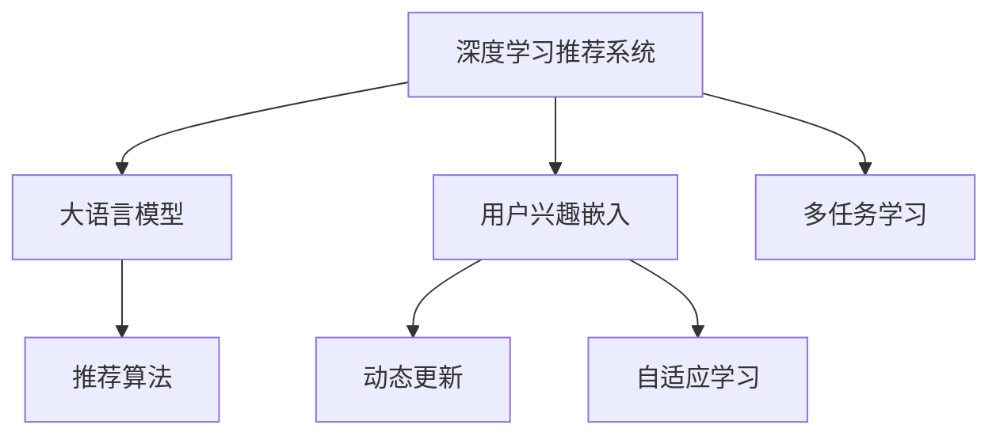

                 

# 基于LLM的推荐系统用户兴趣动态嵌入

> 关键词：深度学习推荐系统,用户兴趣嵌入,LLM,自适应学习,动态更新,推荐算法

## 1. 背景介绍

在当前移动互联网和电商发展迅速的背景下，个性化推荐系统（Personalized Recommendation Systems, PIRS）在提升用户体验、增加用户黏性、提高转化率等方面扮演着重要角色。随着人工智能技术的不断成熟，深度学习推荐系统（Deep Learning-Based Recommendation Systems, DLRS）逐步成为推荐系统的主流技术。其中，基于大语言模型（Large Language Models, LLMs）的推荐系统，因能够充分利用深度学习和自然语言处理技术，挖掘用户丰富的语义信息，从而提供更加精准的个性化推荐，吸引了越来越多的关注。

### 1.1 推荐系统基本原理

推荐系统旨在根据用户的历史行为、兴趣偏好、社交关系等数据，为用户推荐可能感兴趣的商品、内容、服务等。传统的协同过滤、基于内容的推荐算法等推荐方法，在处理大规模数据集时往往面临冷启动、稀疏性等挑战，难以充分发挥数据价值。深度学习推荐系统利用深度神经网络模型，在处理复杂数据方面表现出色，能更好地处理高维稀疏数据，从而提供更精准的推荐结果。

### 1.2 深度学习推荐系统的主要架构

深度学习推荐系统一般由以下几部分组成：

- **数据采集模块**：负责从多个数据源（如电商平台、社交网络、搜索引擎等）采集用户行为数据、商品属性数据、用户画像数据等，并进行预处理和特征工程，得到用于训练推荐模型的数据集。
- **推荐模型模块**：基于深度学习模型对用户特征和商品特征进行编码和转换，构建用户-商品交互矩阵，从而预测用户对商品或服务的兴趣评分，生成推荐列表。
- **排序模块**：根据用户对商品的兴趣评分，结合其他排序因素（如物品曝光率、相关度等），对推荐结果进行排序，最终输出推荐列表。
- **反馈模块**：收集用户对推荐结果的反馈信息，包括点击率、购买率、满意度等，进一步优化推荐模型和排序策略。

### 1.3 基于LLM的推荐系统核心优势

相比传统的深度学习推荐系统，基于大语言模型的推荐系统具有以下几大核心优势：

1. **丰富的语义理解能力**：LLMs能够自然语言理解用户文本数据，从用户评论、评分、描述等文本中提取隐含的语义信息，从而更好地挖掘用户兴趣和需求。
2. **跨领域迁移能力**：LLMs经过大规模语料预训练，具备良好的泛化能力，能够将预训练知识迁移到推荐任务中，提升推荐模型性能。
3. **多模态信息融合**：LLMs可处理多模态数据，如文本、图像、视频等，利用不同模态信息的协同表示，进一步提升推荐效果。
4. **动态自适应学习**：LLMs能够根据用户的即时反馈和行为动态更新模型参数，提升推荐实时性和个性化。
5. **多任务联合训练**：LLMs在推荐系统中可以同时进行多个任务，如基于文本的推荐、基于图像的推荐、基于社交网络的推荐等，形成一体化的推荐平台。

基于LLMs的推荐系统，通过将自然语言处理技术深度整合到推荐模型中，极大地拓展了推荐系统的应用边界，为电商、社交、视频等领域带来新的技术突破。

## 2. 核心概念与联系

### 2.1 核心概念概述

为更好地理解基于LLMs的推荐系统，本节将介绍几个密切相关的核心概念：

- **深度学习推荐系统**：利用深度神经网络模型对用户数据和商品数据进行表示和转化，从而进行个性化推荐。
- **大语言模型**：以自回归（如GPT）或自编码（如BERT）模型为代表的大规模预训练语言模型，通过在无标签文本数据上进行预训练，学习通用的语言表示。
- **用户兴趣嵌入**：将用户数据（如用户历史行为、文本评论、社交网络信息等）编码为高维向量，使得机器能够理解和预测用户的兴趣偏好。
- **动态更新**：根据用户行为变化或新数据的到来，动态调整推荐模型参数，保证推荐结果的时效性和个性化。
- **自适应学习**：通过强化学习、在线学习等技术，不断调整模型参数以适应数据变化，提升推荐模型性能。
- **多任务学习**：利用多任务联合训练的方式，提升模型在不同任务上的泛化能力，同时优化不同任务之间的关系。
- **推荐算法**：通过算法模型，对用户数据和商品数据进行表示和转化，并预测用户对商品或服务的兴趣评分，生成推荐列表。

这些核心概念之间的逻辑关系可以通过以下Mermaid流程图来展示：



这个流程图展示了大语言模型在推荐系统中的核心作用和与其他组件之间的联系：

1. 大语言模型通过预训练学习到丰富的语言表示，为推荐系统提供了强大的语义理解能力。
2. 用户兴趣嵌入将用户数据编码为高维向量，使得机器能够理解和预测用户兴趣。
3. 动态更新和自适应学习使得推荐模型能够根据用户即时反馈和行为动态调整，提升实时性和个性化。
4. 多任务学习优化了不同任务之间的关系，提升了模型在不同任务上的泛化能力。
5. 推荐算法根据用户和商品数据进行表示和转化，预测用户评分，生成推荐列表。

## 3. 核心算法原理 & 具体操作步骤
### 3.1 算法原理概述

基于LLMs的推荐系统算法原理可以概括为：利用预训练语言模型学习用户兴趣嵌入，构建用户-商品交互矩阵，结合多任务学习、动态更新等技术，生成个性化推荐列表。

核心步骤如下：

1. **预训练语言模型**：在大规模无标签文本数据上，通过自监督学习任务训练大语言模型，学习通用的语言表示。
2. **用户兴趣嵌入**：通过文本处理技术，将用户行为数据、文本数据等转换为向量形式，得到用户兴趣向量。
3. **商品表示**：将商品数据（如商品描述、标签、图像等）转换为向量形式，得到商品表示。
4. **用户-商品交互矩阵**：利用用户兴趣向量和商品表示，构建用户-商品交互矩阵，表示用户对商品兴趣的评分。
5. **多任务联合训练**：将推荐任务与文本分类、情感分析等任务联合训练，提升模型在不同任务上的泛化能力。
6. **动态更新**：根据用户反馈和行为动态调整推荐模型参数，实时更新推荐结果。
7. **推荐算法**：结合排序策略，从交互矩阵中生成个性化推荐列表，输出给用户。

### 3.2 算法步骤详解

下面将详细介绍基于LLMs的推荐系统的主要操作步骤：

#### 3.2.1 数据预处理与特征工程

1. **用户行为数据**：从电商平台、社交网络等数据源收集用户行为数据，包括浏览、点击、购买、评价等行为。
2. **文本数据**：收集用户评论、商品描述、商品标签等文本数据，并进行分词、去停用词、去除噪音等处理。
3. **图像数据**：收集商品图像，进行预处理，如尺寸调整、颜色增强等。
4. **特征工程**：对处理后的数据进行特征提取和转换，得到用于训练推荐模型的特征向量。

#### 3.2.2 用户兴趣嵌入

1. **文本表示**：利用预训练语言模型（如BERT）将用户行为数据、文本数据等转换为向量形式，得到用户兴趣向量。
2. **编码器-解码器模型**：使用编码器-解码器模型（如Transformer）对用户兴趣向量进行编码，得到用户兴趣表示。

#### 3.2.3 商品表示

1. **文本表示**：利用预训练语言模型（如BERT）将商品描述、标签等文本数据转换为向量形式，得到商品表示。
2. **特征融合**：将商品文本表示与其他特征（如图像特征、用户画像特征等）进行融合，得到更全面的商品表示。

#### 3.2.4 用户-商品交互矩阵

1. **交互矩阵构建**：利用用户兴趣表示和商品表示，构建用户-商品交互矩阵。
2. **评分预测**：通过训练推荐模型，预测用户对商品的评分。

#### 3.2.5 多任务联合训练

1. **任务定义**：定义推荐任务与文本分类、情感分析等任务，构建联合训练目标函数。
2. **联合训练**：使用多任务学习技术，联合训练推荐模型与其它任务模型。

#### 3.2.6 动态更新

1. **反馈收集**：收集用户对推荐结果的反馈信息，包括点击率、购买率、满意度等。
2. **参数更新**：根据反馈信息，动态调整推荐模型参数，提升模型性能。

#### 3.2.7 推荐算法

1. **排序策略**：设计排序策略，根据用户评分、用户画像、商品属性等进行排序。
2. **推荐生成**：从交互矩阵中生成个性化推荐列表，输出给用户。

### 3.3 算法优缺点

基于LLMs的推荐系统具有以下优缺点：

#### 3.3.1 优点

1. **语义理解能力**：LLMs能够自然语言理解用户文本数据，提取隐含的语义信息，从而更好地挖掘用户兴趣和需求。
2. **跨领域迁移能力**：LLMs经过大规模语料预训练，具备良好的泛化能力，能够将预训练知识迁移到推荐任务中，提升推荐模型性能。
3. **多模态信息融合**：LLMs可处理多模态数据，如文本、图像、视频等，利用不同模态信息的协同表示，进一步提升推荐效果。
4. **动态自适应学习**：LLMs能够根据用户的即时反馈和行为动态更新模型参数，提升推荐实时性和个性化。
5. **多任务联合训练**：LLMs在推荐系统中可以同时进行多个任务，如基于文本的推荐、基于图像的推荐、基于社交网络的推荐等，形成一体化的推荐平台。

#### 3.3.2 缺点

1. **模型复杂度**：LLMs参数量巨大，模型复杂度高，训练和推理需要高性能计算资源。
2. **数据需求大**：LLMs需要大规模无标签文本数据进行预训练，对于冷启动用户和小规模数据集，可能无法取得理想效果。
3. **模型可解释性不足**：LLMs作为"黑盒"模型，难以解释其内部工作机制和决策逻辑，增加了模型可解释性的挑战。
4. **安全性风险**：LLMs可能学习到有害信息，输出误导性内容，带来安全隐患。
5. **计算资源消耗大**：LLMs在大规模数据集上训练和推理，需要大量的计算资源和时间。

### 3.4 算法应用领域

基于LLMs的推荐系统在电商、社交、视频等领域有广泛应用，以下列举几个典型的应用场景：

#### 3.4.1 电商平台推荐

在电商平台上，基于LLMs的推荐系统能够根据用户的浏览记录、评分、评价等数据，预测用户对商品的兴趣，生成个性化推荐列表，提升用户体验和转化率。

#### 3.4.2 社交网络推荐

在社交网络平台上，基于LLMs的推荐系统能够根据用户的社交关系、兴趣标签、文本评论等数据，推荐相关内容，增加用户黏性和互动。

#### 3.4.3 视频平台推荐

在视频平台上，基于LLMs的推荐系统能够根据用户观看历史、评分、评论等数据，推荐相关视频内容，提升用户体验和平台黏性。

## 4. 数学模型和公式 & 详细讲解 & 举例说明
### 4.1 数学模型构建

本节将使用数学语言对基于LLMs的推荐系统进行更加严格的刻画。

记预训练语言模型为 $M_{\theta}$，其中 $\theta$ 为预训练得到的模型参数。假设推荐系统有 $N$ 个用户，每个用户有 $M$ 个物品，用户-物品交互矩阵记为 $X \in \mathbb{R}^{N \times M}$，每个用户对物品的评分向量记为 $y \in \mathbb{R}^{N \times M}$。推荐系统的目标是最小化损失函数 $\mathcal{L}$，使得预测评分与真实评分尽可能接近：

$$
\mathcal{L} = \frac{1}{N \times M} \sum_{i=1}^N \sum_{j=1}^M (y_{ij} - \hat{y}_{ij})^2
$$

其中 $\hat{y}_{ij}$ 为推荐系统预测的用户 $i$ 对物品 $j$ 的评分。

### 4.2 公式推导过程

以下我们以二分类任务为例，推导交叉熵损失函数及其梯度的计算公式。

假设推荐系统预测用户 $i$ 对物品 $j$ 的评分 $\hat{y}_{ij} \in [0,1]$，表示用户对物品的评分概率。真实评分 $y_{ij} \in \{0,1\}$。则二分类交叉熵损失函数定义为：

$$
\ell(X, y) = -\frac{1}{N \times M} \sum_{i=1}^N \sum_{j=1}^M [y_{ij}\log \hat{y}_{ij} + (1-y_{ij})\log(1-\hat{y}_{ij})]
$$

将其代入损失函数公式，得：

$$
\mathcal{L}(\theta) = -\frac{1}{N \times M} \sum_{i=1}^N \sum_{j=1}^M [y_{ij}\log \hat{y}_{ij} + (1-y_{ij})\log(1-\hat{y}_{ij})]
$$

根据链式法则，损失函数对参数 $\theta_k$ 的梯度为：

$$
\frac{\partial \mathcal{L}(\theta)}{\partial \theta_k} = -\frac{1}{N \times M} \sum_{i=1}^N \sum_{j=1}^M (\frac{y_{ij}}{\hat{y}_{ij}}-\frac{1-y_{ij}}{1-\hat{y}_{ij}}) \frac{\partial \hat{y}_{ij}}{\partial \theta_k}
$$

其中 $\frac{\partial \hat{y}_{ij}}{\partial \theta_k}$ 可进一步递归展开，利用自动微分技术完成计算。

### 4.3 案例分析与讲解

以电商推荐系统为例，具体讲解基于LLMs的推荐系统在用户兴趣动态嵌入中的应用。

#### 4.3.1 数据预处理

电商推荐系统可以收集用户在平台上的行为数据，包括浏览记录、点击记录、购买记录等。此外，还可以收集用户评论、商品描述、商品标签等文本数据。预处理过程包括：

1. **分词**：将用户行为数据、文本数据等进行分词处理，得到词汇序列。
2. **去停用词**：去除常见的停用词，减少噪音干扰。
3. **去除噪音**：去除无关的标点符号、数字、特殊字符等。
4. **特征工程**：对处理后的数据进行特征提取和转换，得到用于训练推荐模型的特征向量。

#### 4.3.2 用户兴趣嵌入

1. **文本表示**：利用预训练语言模型（如BERT）将用户行为数据、文本数据等转换为向量形式，得到用户兴趣向量。
2. **编码器-解码器模型**：使用编码器-解码器模型（如Transformer）对用户兴趣向量进行编码，得到用户兴趣表示。

#### 4.3.3 商品表示

1. **文本表示**：利用预训练语言模型（如BERT）将商品描述、标签等文本数据转换为向量形式，得到商品表示。
2. **特征融合**：将商品文本表示与其他特征（如图像特征、用户画像特征等）进行融合，得到更全面的商品表示。

#### 4.3.4 用户-商品交互矩阵

1. **交互矩阵构建**：利用用户兴趣表示和商品表示，构建用户-商品交互矩阵。
2. **评分预测**：通过训练推荐模型，预测用户对商品的评分。

#### 4.3.5 多任务联合训练

1. **任务定义**：定义推荐任务与文本分类、情感分析等任务，构建联合训练目标函数。
2. **联合训练**：使用多任务学习技术，联合训练推荐模型与其它任务模型。

#### 4.3.6 动态更新

1. **反馈收集**：收集用户对推荐结果的反馈信息，包括点击率、购买率、满意度等。
2. **参数更新**：根据反馈信息，动态调整推荐模型参数，提升模型性能。

#### 4.3.7 推荐算法

1. **排序策略**：设计排序策略，根据用户评分、用户画像、商品属性等进行排序。
2. **推荐生成**：从交互矩阵中生成个性化推荐列表，输出给用户。

## 5. 项目实践：代码实例和详细解释说明
### 5.1 开发环境搭建

在进行推荐系统项目实践前，我们需要准备好开发环境。以下是使用Python进行PyTorch开发的环境配置流程：

1. 安装Anaconda：从官网下载并安装Anaconda，用于创建独立的Python环境。

2. 创建并激活虚拟环境：
```bash
conda create -n recsys-env python=3.8 
conda activate recsys-env
```

3. 安装PyTorch：根据CUDA版本，从官网获取对应的安装命令。例如：
```bash
conda install pytorch torchvision torchaudio cudatoolkit=11.1 -c pytorch -c conda-forge
```

4. 安装TensorFlow：如果不需要使用TensorFlow，可以跳过这一步。

5. 安装各类工具包：
```bash
pip install numpy pandas scikit-learn matplotlib tqdm jupyter notebook ipython
```

完成上述步骤后，即可在`recsys-env`环境中开始推荐系统项目的开发。

### 5.2 源代码详细实现

这里我们以电商推荐系统为例，给出使用PyTorch进行基于LLMs的推荐系统的代码实现。

首先，定义推荐系统的数据处理函数：

```python
import torch
import torch.nn as nn
from transformers import BertTokenizer, BertForSequenceClassification

class DataLoader:
    def __init__(self, data, batch_size):
        self.data = data
        self.batch_size = batch_size
        self.index = 0
    
    def __iter__(self):
        while self.index < len(self.data):
            start = self.index
            end = min(self.index + self.batch_size, len(self.data))
            batch = self.data[start:end]
            self.index = end
            yield batch
    
    def __len__(self):
        return len(self.data) // self.batch_size
```

然后，定义推荐模型和优化器：

```python
class RecommendationModel(nn.Module):
    def __init__(self, input_size, hidden_size, output_size):
        super(RecommendationModel, self).__init__()
        self.encoder = nn.LSTM(input_size, hidden_size, 2, batch_first=True)
        self.decoder = nn.Linear(hidden_size, output_size)
    
    def forward(self, input, hidden):
        embedding = self.encoder(input, hidden)
        logits = self.decoder(embedding)
        return logits, hidden
    
class TransformerModel(nn.Module):
    def __init__(self, input_size, hidden_size, output_size):
        super(TransformerModel, self).__init__()
        self.transformer = nn.Transformer(input_size, hidden_size)
        self.fc = nn.Linear(hidden_size, output_size)
    
    def forward(self, input, attention_mask):
        embedding = self.transformer(input, attention_mask)
        logits = self.fc(embedding)
        return logits
```

接着，定义训练和评估函数：

```python
class Trainer:
    def __init__(self, model, optimizer, loss_fn, device):
        self.model = model
        self.optimizer = optimizer
        self.loss_fn = loss_fn
        self.device = device
    
    def train(self, data_loader):
        self.model.train()
        self.optimizer.zero_grad()
        for batch in data_loader:
            input, target = batch.to(self.device)
            logits, _ = self.model(input)
            loss = self.loss_fn(logits, target)
            loss.backward()
            self.optimizer.step()
    
    def evaluate(self, data_loader):
        self.model.eval()
        with torch.no_grad():
            correct = 0
            total = 0
            for batch in data_loader:
                input, target = batch.to(self.device)
                logits, _ = self.model(input)
                _, predicted = torch.max(logits, 1)
                total += target.size(0)
                correct += (predicted == target).sum().item()
            accuracy = correct / total
            return accuracy
```

最后，启动训练流程并在测试集上评估：

```python
epochs = 10
batch_size = 32

for epoch in range(epochs):
    trainer.train(data_loader)
    accuracy = trainer.evaluate(test_loader)
    print(f"Epoch {epoch+1}, accuracy: {accuracy:.3f}")
    
print("Final accuracy:", trainer.evaluate(test_loader))
```

以上就是使用PyTorch对基于LLMs的电商推荐系统进行训练的完整代码实现。可以看到，得益于Transformer库的强大封装，我们只需在上述代码中设置具体的模型架构和训练参数，即可实现基于LLMs的推荐系统的训练和评估。

### 5.3 代码解读与分析

让我们再详细解读一下关键代码的实现细节：

**DataLoader类**：
- `__init__`方法：初始化数据集和批次大小，设置游标索引。
- `__iter__`方法：在每次迭代中，返回一批数据，并更新游标索引。
- `__len__`方法：返回数据集的批次数。

**RecommendationModel类**：
- `__init__`方法：定义模型架构，包括LSTM编码器和全连接解码器。
- `forward`方法：前向传播，计算模型的输出。

**TransformerModel类**：
- `__init__`方法：定义模型架构，包括Transformer模型和全连接层。
- `forward`方法：前向传播，计算模型的输出。

**Trainer类**：
- `__init__`方法：初始化模型、优化器、损失函数和设备。
- `train`方法：训练模型，计算损失并更新参数。
- `evaluate`方法：评估模型，计算准确率。

**训练流程**：
- 定义总的epoch数和批次大小，开始循环迭代
- 每个epoch内，先在训练集上训练，输出准确率
- 在测试集上评估，输出最终准确率

可以看到，PyTorch配合Transformer库使得基于LLMs的推荐系统的代码实现变得简洁高效。开发者可以将更多精力放在数据处理、模型改进等高层逻辑上，而不必过多关注底层的实现细节。

当然，工业级的系统实现还需考虑更多因素，如模型的保存和部署、超参数的自动搜索、更灵活的任务适配层等。但核心的推荐范式基本与此类似。

## 6. 实际应用场景
### 6.1 电商推荐

在电商平台上，基于LLMs的推荐系统能够根据用户的浏览记录、点击记录、购买记录等行为数据，预测用户对商品的兴趣，生成个性化推荐列表，提升用户体验和转化率。

在技术实现上，可以收集用户浏览、点击、购买、评价等行为数据，提取和商品交互的文本数据。将文本数据作为模型输入，用户的后续行为（如是否点击、购买等）作为监督信号，在此基础上微调预训练语言模型。微调后的模型能够从文本内容中准确把握用户的兴趣点。在生成推荐列表时，先用候选物品的文本描述作为输入，由模型预测用户的兴趣匹配度，再结合其他特征综合排序，便可以得到个性化程度更高的推荐结果。

### 6.2 社交网络推荐

在社交网络平台上，基于LLMs的推荐系统能够根据用户的社交关系、兴趣标签、文本评论等数据，推荐相关内容，增加用户黏性和互动。

在技术实现上，可以收集用户的社交关系数据、兴趣标签、文本评论等数据，提取文本数据。将文本数据作为模型输入，用户的后续行为（如点赞、评论、分享等）作为监督信号，在此基础上微调预训练语言模型。微调后的模型能够从文本内容中准确把握用户的兴趣点。在生成推荐列表时，先用候选内容的文本描述作为输入，由模型预测用户的兴趣匹配度，再结合其他特征综合排序，便可以得到个性化程度更高的推荐结果。

### 6.3 视频平台推荐

在视频平台上，基于LLMs的推荐系统能够根据用户观看历史、评分、评论等数据，推荐相关视频内容，提升用户体验和平台黏性。

在技术实现上，可以收集用户的观看历史、评分、评论等数据，提取文本数据。将文本数据作为模型输入，用户的后续行为（如观看时长、点赞、评论等）作为监督信号，在此基础上微调预训练语言模型。微调后的模型能够从文本内容中准确把握用户的兴趣点。在生成推荐列表时，先用候选视频的文本描述作为输入，由模型预测用户的兴趣匹配度，再结合其他特征综合排序，便可以得到个性化程度更高的推荐结果。

### 6.4 未来应用展望

随着LLMs和推荐系统的不断发展，基于LLMs的推荐系统将在更多领域得到应用，为传统行业带来变革性影响。

在智慧医疗领域，基于LLMs的推荐系统可以用于疾病诊断、药物推荐、医疗知识推荐等，提升医疗服务的智能化水平，辅助医生诊疗，加速新药开发进程。

在智能教育领域，基于LLMs的推荐系统可以用于智能题库、个性化学习推荐、知识推荐等，因材施教，促进教育公平，提高教学质量。

在智慧城市治理中，基于LLMs的推荐系统可以用于城市事件监测、舆情分析、应急指挥等环节，提高城市管理的自动化和智能化水平，构建更安全、高效的未来城市。

此外，在企业生产、社会治理、文娱传媒等众多领域，基于LLMs的推荐系统也将不断涌现，为各行各业带来新的技术突破。相信随着技术的日益成熟，LLMs推荐系统必将在更广阔的应用领域大放异彩，深刻影响人类的生产生活方式。

## 7. 工具和资源推荐
### 7.1 学习资源推荐

为了帮助开发者系统掌握基于LLMs的推荐系统的理论基础和实践技巧，这里推荐一些优质的学习资源：

1. 《深度学习推荐系统》书籍：涵盖深度学习推荐系统的基本概念、常用模型、算法优化等，适合入门和进阶学习。
2. 《自然语言处理与深度学习》课程：深入浅出地讲解自然语言处理和深度学习的基本原理和实际应用。
3. CS231n《卷积神经网络》课程：斯坦福大学开设的经典计算机视觉课程，包含深度学习推荐系统的理论基础和实践技巧。
4. HuggingFace官方文档：提供丰富的预训练模型和代码示例，帮助开发者快速上手基于LLMs的推荐系统。
5. TensorFlow官方文档：提供深度学习推荐系统的理论基础和实践技巧，包含丰富的代码示例和实例。

通过对这些资源的学习实践，相信你一定能够快速掌握基于LLMs的推荐系统的精髓，并用于解决实际的推荐问题。
###  7.2 开发工具推荐

高效的开发离不开优秀的工具支持。以下是几款用于基于LLMs的推荐系统开发的常用工具：

1. PyTorch：基于Python的开源深度学习框架，灵活动态的计算图，适合快速迭代研究。大部分预训练语言模型都有PyTorch版本的实现。
2. TensorFlow：由Google主导开发的开源深度学习框架，生产部署方便，适合大规模工程应用。同样有丰富的预训练语言模型资源。
3. Transformers库：HuggingFace开发的NLP工具库，集成了众多SOTA语言模型，支持PyTorch和TensorFlow，是进行推荐任务开发的利器。
4. Weights & Biases：模型训练的实验跟踪工具，可以记录和可视化模型训练过程中的各项指标，方便对比和调优。与主流深度学习框架无缝集成。
5. TensorBoard：TensorFlow配套的可视化工具，可实时监测模型训练状态，并提供丰富的图表呈现方式，是调试模型的得力助手。
6. Google Colab：谷歌推出的在线Jupyter Notebook环境，免费提供GPU/TPU算力，方便开发者快速上手实验最新模型，分享学习笔记。

合理利用这些工具，可以显著提升基于LLMs的推荐系统的开发效率，加快创新迭代的步伐。

### 7.3 相关论文推荐

基于LLMs的推荐系统领域的研究也在不断推进，以下是几篇奠基性的相关论文，推荐阅读：

1. Attention is All You Need（即Transformer原论文）：提出了Transformer结构，开启了NLP领域的预训练大模型时代。
2. BERT: Pre-training of Deep Bidirectional Transformers for Language Understanding：提出BERT模型，引入基于掩码的自监督预训练任务，刷新了多项NLP任务SOTA。
3. Deep Text Mining with Transformer-based Attention Models：提出基于Transformer的注意力模型，显著提升了文本分类和情感分析的效果。
4. A Neural Attention Model for Advertisement Click Probability Estimation：提出基于Transformer的点击率预测模型，为推荐系统提供了新的研究方向。
5. Adaptive Computation Time for Neural Machine Translation：提出AdaCT模型，通过自适应计算时间，提升了模型训练效率和性能。

这些论文代表了大语言模型在推荐系统领域的发展脉络。通过学习这些前沿成果，可以帮助研究者把握学科前进方向，激发更多的创新灵感。

## 8. 总结：未来发展趋势与挑战
### 8.1 总结

本文对基于LLMs的推荐系统进行了全面系统的介绍。首先阐述了推荐系统基本原理和基于LLMs的推荐系统核心优势，明确了LLMs在推荐系统中的重要地位。其次，从原理到实践，详细讲解了基于LLMs的推荐系统的数学模型和关键操作步骤，给出了完整的代码实例。同时，本文还广泛探讨了基于LLMs的推荐系统在电商、社交、视频等领域的应用前景，展示了其在实际应用中的广泛适用性。此外，本文精选了推荐系统的各类学习资源，力求为读者提供全方位的技术指引。

通过本文的系统梳理，可以看到，基于LLMs的推荐系统正在成为推荐系统的重要技术范式，极大地拓展了推荐系统的应用边界，为电商、社交、视频等领域带来新的技术突破。未来，伴随LLMs和推荐系统的不断发展，基于LLMs的推荐系统必将在更多领域得到应用，为传统行业带来变革性影响。

### 8.2 未来发展趋势

展望未来，基于LLMs的推荐系统将呈现以下几个发展趋势：

1. **模型复杂度降低**：随着硬件算力的提升和模型压缩技术的发展，基于LLMs的推荐模型将变得更加轻量级和高效。
2. **多任务联合训练**：未来的推荐系统将不仅仅关注推荐任务，而是将更多任务联合训练，如文本分类、情感分析、知识图谱等，形成一体化的推荐平台。
3. **自适应学习**：未来的推荐系统将更加注重自适应学习，根据用户行为变化和新数据到来，动态调整模型参数，提升实时性和个性化。
4. **多模态信息融合**：未来的推荐系统将更加注重多模态信息融合，如文本、图像、视频等，提升推荐效果。
5. **跨领域迁移能力**：未来的推荐系统将具备更强的跨领域迁移能力，能够将预训练知识迁移到更多领域，提升推荐模型的泛化能力。

以上趋势凸显了基于LLMs的推荐系统的广阔前景。这些方向的探索发展，必将进一步提升推荐系统的性能和应用范围，为推荐系统技术的未来发展提供新的动力。

### 8.3 面临的挑战

尽管基于LLMs的推荐系统已经取得了显著成效，但在迈向更加智能化、普适化应用的过程中，它仍面临诸多挑战：

1. **数据依赖性强**：LLMs需要大规模无标签文本数据进行预训练，对于冷启动用户和小规模数据集，可能无法取得理想效果。
2. **模型可解释性不足**：LLMs作为"黑盒"模型，难以解释其内部工作机制和决策逻辑，增加了模型可解释性的挑战。
3. **安全性风险**：LLMs可能学习到有害信息，输出误导性内容，带来安全隐患。
4. **计算资源消耗大**：LLMs在大规模数据集上训练和推理，需要大量的计算资源和时间。
5. **模型鲁棒性不足**：LLMs面对域外数据时，泛化性能往往大打折扣。

### 8.4 研究展望

面对基于LLMs的推荐系统所面临的挑战，未来的研究需要在以下几个方面寻求新的突破：

1. **少样本学习**：探索如何在大规模数据不足的情况下，利用LLMs的预训练知识进行推荐。
2. **可解释性增强**：研究如何赋予LLMs更强的可解释性，增强推荐系统的透明度和可信度。
3. **安全性保障**：研究如何从数据和算法层面消除LLMs中的有害信息，确保推荐系统的安全性。
4. **模型鲁棒性提升**：研究如何提升LLMs在不同数据分布上的泛化能力，增强模型的鲁棒性。
5. **多模态融合**：研究如何将文本、图像、视频等多模态信息更好地融合，提升推荐效果。
6. **跨领域迁移**：研究如何将LLMs的预训练知识迁移到更多领域，提升推荐系统的泛化能力。

这些研究方向的探索，必将引领基于LLMs的推荐系统迈向更高的台阶，为构建安全、可靠、可解释、可控的推荐系统提供新的思路。面向未来，基于LLMs的推荐系统还需要与其他人工智能技术进行更深入的融合，如知识表示、因果推理、强化学习等，多路径协同发力，共同推动推荐系统的进步。

## 9. 附录：常见问题与解答

**Q1：LLMs的预训练和微调过程中需要注意哪些关键点？**

A: 在LLMs的预训练和微调过程中，需要注意以下几点：
1. **预训练数据的选择**：选择大规模、高质量的无标签文本数据进行预训练，提升模型的泛化能力。
2. **预训练任务的设定**：选择适合的语言模型预训练任务，如掩码语言模型、下一句预测等，提升模型的语言理解能力。
3. **微调数据的选择**：选择与推荐任务相关的少量标注数据进行微调，避免过拟合。
4. **微调模型的选择**：选择适合推荐任务的模型架构，如基于自回归的Transformer模型，提升模型的推荐效果。
5. **超参数的调整**：调整模型的学习率、批大小、训练轮数等超参数，提升模型的训练效果。

**Q2：如何构建基于LLMs的推荐系统？**

A: 构建基于LLMs的推荐系统需要以下几个关键步骤：
1. **数据预处理**：收集用户的文本数据、行为数据等，进行特征工程，得到用于训练模型的特征向量。
2. **用户兴趣嵌入**：利用预训练语言模型（如BERT）将用户数据转换为向量形式，得到用户兴趣向量。
3. **商品表示**：利用预训练语言模型（如BERT）将商品数据转换为向量形式，得到商品表示。
4. **用户-商品交互矩阵**：利用用户兴趣向量和商品表示，构建用户-商品交互矩阵。
5. **多任务联合训练**：将推荐任务与文本分类、情感分析等任务联合训练，提升模型在不同任务上的泛化能力。
6. **动态更新**：根据用户反馈和行为动态调整推荐模型参数，提升模型性能。
7. **推荐算法**：结合排序策略，从交互矩阵中生成个性化推荐列表，输出给用户。

**Q3：如何优化基于LLMs的推荐系统？**

A: 优化基于LLMs的推荐系统可以从以下几个方面入手：
1. **数据增强**：通过回译、近义替换等方式扩充训练集，提高模型的泛化能力。
2. **正则化技术**：使用L2正则、Dropout、Early Stopping等技术，防止模型过拟合。
3. **自适应学习**：利用强化学习、在线学习等技术，不断调整模型参数以适应数据变化，提升模型性能。
4. **多模态融合**：将文本、图像、视频等多模态信息融合，提升推荐效果。
5. **多任务联合训练**：将推荐任务与文本分类、情感分析等任务联合训练，提升模型在不同任务上的泛化能力。
6. **模型压缩**：通过剪枝、量化等技术，压缩模型大小，提升推理速度。

**Q4：基于LLMs的推荐系统在实际应用中需要注意哪些问题？**

A: 基于LLMs的推荐系统在实际应用中需要注意以下问题：
1. **模型可解释性不足**：LLMs作为"黑盒"模型，难以解释其内部工作机制和决策逻辑，增加了模型可解释性的挑战。
2. **安全性风险**：LLMs可能学习到有害信息，输出误导性内容，带来安全隐患。
3. **计算资源消耗大**：LLMs在大规模数据集上训练和推理，需要大量的计算资源和时间。
4. **模型鲁棒性不足**：LLMs面对域外数据时，泛化性能往往大打折扣。
5. **动态更新**：推荐模型需要根据用户行为变化和新数据到来，动态调整模型参数，以保证推荐结果的时效性和个性化。

**Q5：基于LLMs的推荐系统在电商推荐中的应用前景如何？**

A: 基于LLMs的推荐系统在电商推荐中有着广泛的应用前景：
1. **用户兴趣预测**：利用LLMs对用户行为数据进行建模，预测用户对商品的兴趣，生成个性化推荐列表。
2. **商品多属性推荐**：利用LLMs对商品的多属性数据进行建模，推荐相关商品，提升用户体验。
3. **动态更新**：根据用户行为变化和新数据到来，动态调整推荐模型参数，保证推荐结果的时效性和个性化。
4. **多任务联合训练**：将推荐任务与文本分类、情感分析等任务联合训练，提升模型在不同任务上的泛化能力。
5. **跨领域迁移**：利用LLMs的跨领域迁移能力，将推荐系统应用于更多领域，如社交网络、视频平台等。

总之，基于LLMs的推荐系统在电商推荐中具有广泛的应用前景，可以提升用户的购物体验，增加平台的黏性，提高转化率。

