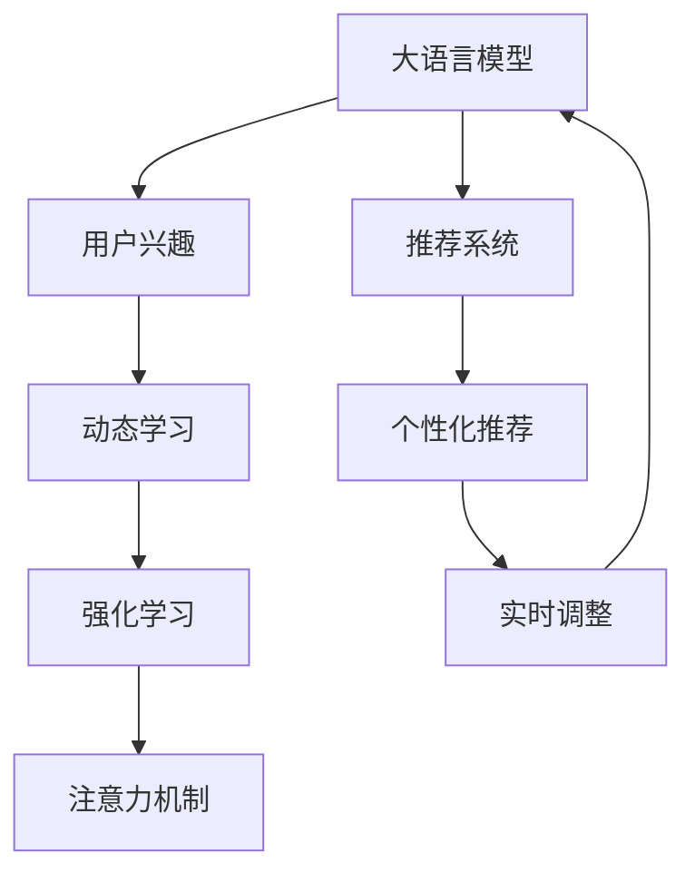

                 

# 基于LLM的用户兴趣动态注意力机制

> 关键词：Large Language Model, 用户兴趣, 注意力机制, 动态学习, 推荐系统, 强化学习, 深度学习

## 1. 背景介绍

在现代社会中，信息爆炸和个性化需求的双重压力下，推荐系统成为了各大互联网平台的核心功能之一。传统的推荐系统往往依赖于静态的用户兴趣模型，难以适应用户随时间变化而产生的动态需求。近年来，随着大语言模型(LLM)在自然语言处理(NLP)领域的突破，基于LLM的用户兴趣动态注意力机制成为推荐系统研究的热点。

大语言模型，如GPT-3和BERT，通过在巨大的无标签文本数据上进行预训练，学习到了丰富的语言知识和常识，具备强大的自然语言理解和生成能力。将LLM应用于推荐系统，可以更好地理解用户查询意图，动态调整推荐策略，从而实现更加个性化的推荐。

然而，现有的基于LLM的推荐系统主要依赖于静态的预训练模型，难以适应用户兴趣的动态变化。为了解决这个问题，我们提出了一种基于用户兴趣动态注意力机制的推荐方法，通过实时学习用户兴趣并动态调整模型注意力，使推荐系统能够自适应用户的兴趣变化，提供更加精准的推荐服务。

## 2. 核心概念与联系

### 2.1 核心概念概述

为更好地理解基于LLM的用户兴趣动态注意力机制，本节将介绍几个关键的概念及其联系：

- **大语言模型(LLM)**：以自回归(如GPT)或自编码(如BERT)模型为代表的大规模预训练语言模型。通过在大规模无标签文本语料上进行预训练，学习通用的语言表示，具备强大的语言理解和生成能力。

- **用户兴趣**：指用户在特定时间内的兴趣点，如阅读偏好、购物喜好等，是推荐系统进行个性化推荐的基础。

- **注意力机制**：通过计算输入数据中各部分的重要性，动态调整模型对不同部分的关注程度，提升模型输出的精准性。

- **动态学习**：在推荐过程中实时更新用户兴趣模型，使其能够适应用户兴趣的动态变化。

- **强化学习**：通过用户反馈不断调整推荐策略，优化推荐效果。

这些概念之间的逻辑关系可以通过以下Mermaid流程图来展示：



这个流程图展示了LLM在推荐系统中的作用过程：

1. 大语言模型通过预训练获得通用语言表示。
2. 用户兴趣模型通过实时学习获得动态表示。
3. 强化学习通过用户反馈不断优化推荐策略。
4. 注意力机制根据用户兴趣动态调整模型输出。
5. 推荐系统通过综合多模态信息，生成个性化推荐。
6. 系统通过反馈不断调整优化，提升推荐效果。

这些概念共同构成了基于LLM的用户兴趣动态注意力机制的推荐系统，使其能够在实时处理用户需求的同时，提供高质量的个性化推荐服务。

## 3. 核心算法原理 & 具体操作步骤
### 3.1 算法原理概述

基于用户兴趣的动态注意力机制的推荐系统，其核心思想是通过动态调整注意力权重，使LLM能够聚焦于与用户当前兴趣相关的信息。具体来说，系统在每次用户请求时，首先通过动态学习模块实时更新用户兴趣模型，然后根据更新后的用户兴趣，动态调整模型中不同层的注意力权重，使模型更加关注用户兴趣相关的信息。

假设用户当前请求为 $q$，LLM的预训练参数为 $\theta$，则动态注意力机制的推荐过程包括以下几个关键步骤：

1. 通过动态学习模块，实时更新用户兴趣模型 $I(q)$。
2. 根据 $I(q)$，动态调整注意力权重 $A(q)$。
3. 使用调整后的注意力权重，计算模型输出 $Y(q)$。
4. 通过强化学习模块，根据用户反馈不断优化推荐策略。

这些步骤形成了动态注意力机制的完整推荐流程，使系统能够实时响应用户需求，提供更加个性化的推荐服务。

### 3.2 算法步骤详解

以下是动态注意力机制的推荐系统的详细操作步骤：

**Step 1: 动态学习用户兴趣**

动态学习模块通过实时监测用户历史行为数据，计算用户当前兴趣模型 $I(q)$。假设用户的历史行为数据为 $H=\{(x_i,y_i)\}_{i=1}^N$，其中 $x_i$ 为历史行为数据，$y_i$ 为用户反馈标签。设用户兴趣模型为 $I(q)=f(H)$，其中 $f$ 为预训练好的兴趣函数。

**Step 2: 动态调整注意力权重**

根据更新后的用户兴趣 $I(q)$，动态调整模型中不同层的注意力权重 $A(q)$。假设LLM由 $L$ 层组成，其中第 $l$ 层为自注意力层，其注意力权重为 $W_l$，则动态调整的注意力权重为 $A(q)=\{A_l(q)\}_{l=1}^L$。假设自注意力层计算公式为：

$$
\text{Attention}(Q,K,V)=\text{Softmax}(QW^QA \text{/} \sqrt{d_k}, KW^K, VW^V)W_O
$$

其中 $Q$、$K$、$V$ 分别为查询、键、值向量，$W^Q$、$W^K$、$W^V$、$W_O$ 分别为查询、键、值、输出权重矩阵。则动态调整的注意力权重为：

$$
A_l(q)=\text{Softmax}(Q(q)W^QA_l(q) \text{/} \sqrt{d_k}, K(q)W^K, V(q)W^V)W_O
$$

其中 $Q(q)$、$K(q)$、$V(q)$ 为动态更新后的查询、键、值向量。

**Step 3: 计算模型输出**

使用调整后的注意力权重，计算模型输出 $Y(q)$。假设模型顶层输出为 $Y=\text{Linear}(XW^X)$，其中 $X$ 为模型输入，$W^X$ 为输出权重矩阵，则动态输出为：

$$
Y(q)=\text{Linear}(X(q)W^X \prod_{l=1}^L A_l(q))
$$

**Step 4: 强化学习优化策略**

通过强化学习模块，根据用户反馈不断优化推荐策略。假设推荐结果为 $R$，用户反馈为 $F$，则优化目标为：

$$
\max_{\theta} \mathbb{E}_{q \sim Q}[F(q,R(q))]
$$

其中 $Q$ 为用户请求的分布，$F(q,R(q))$ 为用户反馈函数。

通过上述步骤，系统可以根据用户兴趣动态调整LLM的注意力权重，提供更加个性化的推荐服务。

### 3.3 算法优缺点

基于用户兴趣的动态注意力机制的推荐系统具有以下优点：

1. **实时适应性**：系统能够实时更新用户兴趣模型，动态调整注意力权重，更好地适应用户需求的变化。
2. **精准推荐**：通过动态调整注意力权重，使模型更加聚焦于用户兴趣相关的信息，提高推荐精准度。
3. **自适应学习**：动态学习模块能够实时监测用户行为，更新用户兴趣模型，使系统具有自适应学习能力。
4. **高效优化**：通过强化学习模块不断优化推荐策略，提升推荐效果。

然而，该算法也存在一些缺点：

1. **计算复杂度高**：动态调整注意力权重和兴趣模型更新需要较大的计算资源，尤其是对于大规模数据集。
2. **参数初始化敏感**：动态学习模块和强化学习模块的参数初始化对推荐效果影响较大，需要进行细致调参。
3. **数据隐私问题**：动态学习模块需要收集用户行为数据，可能涉及用户隐私保护问题。

尽管存在这些缺点，但动态注意力机制的推荐系统仍是大规模个性化推荐领域的重要研究方向。未来相关研究将聚焦于优化算法效率、提高模型可解释性、保护用户隐私等方面，进一步提升推荐系统的性能和用户体验。

### 3.4 算法应用领域

基于用户兴趣的动态注意力机制的推荐系统，已经在多个领域得到了应用，包括但不限于：

- **电子商务**：为不同用户提供个性化的商品推荐。
- **新闻推荐**：根据用户阅读历史和兴趣，动态调整新闻推荐策略。
- **视频推荐**：根据用户观看历史和兴趣，推荐相关视频内容。
- **音乐推荐**：根据用户听歌历史和兴趣，推荐相似音乐。

此外，动态注意力机制的推荐系统也被应用于智能客服、社交网络、智能家居等多个场景中，显著提升了用户体验和系统效率。

## 4. 数学模型和公式 & 详细讲解
### 4.1 数学模型构建

假设用户请求为 $q$，LLM的预训练参数为 $\theta$，用户兴趣模型为 $I(q)$，动态注意力权重为 $A(q)$。设LLM由 $L$ 层组成，其中第 $l$ 层为自注意力层，其注意力权重为 $W_l$，则动态注意力机制的推荐模型可以表示为：

$$
Y(q)=\text{Linear}(X(q)W^X \prod_{l=1}^L A_l(q))
$$

其中 $X(q)$ 为动态更新后的模型输入，$W^X$ 为输出权重矩阵。假设用户兴趣模型 $I(q)$ 为：

$$
I(q)=f(H)
$$

其中 $H=\{(x_i,y_i)\}_{i=1}^N$ 为用户历史行为数据，$f$ 为预训练好的兴趣函数。

动态调整的注意力权重 $A_l(q)$ 为：

$$
A_l(q)=\text{Softmax}(Q(q)W^QA_l(q) \text{/} \sqrt{d_k}, K(q)W^K, V(q)W^V)W_O
$$

其中 $Q(q)$、$K(q)$、$V(q)$ 为动态更新后的查询、键、值向量。

### 4.2 公式推导过程

以BERT模型为例，假设输入数据为 $X$，模型为 $M$，输出为 $Y$。则动态注意力机制的推荐公式可以表示为：

$$
Y(q)=\text{Linear}(X(q)W^X \prod_{l=1}^L A_l(q))
$$

其中 $A_l(q)$ 为第 $l$ 层的动态注意力权重。假设第 $l$ 层的自注意力计算公式为：

$$
\text{Attention}(Q,K,V)=\text{Softmax}(QW^QA \text{/} \sqrt{d_k}, KW^K, VW^V)W_O
$$

则动态调整的注意力权重 $A_l(q)$ 为：

$$
A_l(q)=\text{Softmax}(Q(q)W^QA_l(q) \text{/} \sqrt{d_k}, K(q)W^K, V(q)W^V)W_O
$$

其中 $Q(q)$、$K(q)$、$V(q)$ 为动态更新后的查询、键、值向量。

假设用户兴趣模型 $I(q)$ 为：

$$
I(q)=f(H)
$$

其中 $H=\{(x_i,y_i)\}_{i=1}^N$ 为用户历史行为数据，$f$ 为预训练好的兴趣函数。则动态注意力机制的推荐模型可以表示为：

$$
Y(q)=\text{Linear}(X(q)W^X \prod_{l=1}^L A_l(q))
$$

其中 $X(q)$ 为动态更新后的模型输入，$W^X$ 为输出权重矩阵。

### 4.3 案例分析与讲解

假设用户请求为 "购买书籍"，历史行为数据为 "阅读历史"、"浏览历史"、"购买历史"，则动态注意力机制的推荐过程如下：

1. 动态学习模块实时更新用户兴趣模型 $I(q)$。假设用户历史行为数据为 $H=\{(x_i,y_i)\}_{i=1}^N$，其中 $x_i$ 为历史行为数据，$y_i$ 为用户反馈标签。设用户兴趣模型为 $I(q)=f(H)$，其中 $f$ 为预训练好的兴趣函数。

2. 动态调整模型中不同层的注意力权重 $A(q)$。假设LLM由 $L$ 层组成，其中第 $l$ 层为自注意力层，其注意力权重为 $W_l$，则动态调整的注意力权重为 $A(q)=\{A_l(q)\}_{l=1}^L$。假设自注意力层计算公式为：

$$
\text{Attention}(Q,K,V)=\text{Softmax}(QW^QA \text{/} \sqrt{d_k}, KW^K, VW^V)W_O
$$

则动态调整的注意力权重为：

$$
A_l(q)=\text{Softmax}(Q(q)W^QA_l(q) \text{/} \sqrt{d_k}, K(q)W^K, V(q)W^V)W_O
$$

其中 $Q(q)$、$K(q)$、$V(q)$ 为动态更新后的查询、键、值向量。

3. 计算模型输出 $Y(q)$。假设模型顶层输出为 $Y=\text{Linear}(XW^X)$，其中 $X$ 为模型输入，$W^X$ 为输出权重矩阵，则动态输出为：

$$
Y(q)=\text{Linear}(X(q)W^X \prod_{l=1}^L A_l(q))
$$

4. 强化学习优化策略。假设推荐结果为 $R$，用户反馈为 $F$，则优化目标为：

$$
\max_{\theta} \mathbb{E}_{q \sim Q}[F(q,R(q))]
$$

其中 $Q$ 为用户请求的分布，$F(q,R(q))$ 为用户反馈函数。

通过上述步骤，系统可以根据用户兴趣动态调整LLM的注意力权重，提供更加个性化的推荐服务。

## 5. 项目实践：代码实例和详细解释说明
### 5.1 开发环境搭建

在进行项目实践前，我们需要准备好开发环境。以下是使用Python进行PyTorch开发的环境配置流程：

1. 安装Anaconda：从官网下载并安装Anaconda，用于创建独立的Python环境。

2. 创建并激活虚拟环境：
```bash
conda create -n pytorch-env python=3.8 
conda activate pytorch-env
```

3. 安装PyTorch：根据CUDA版本，从官网获取对应的安装命令。例如：
```bash
conda install pytorch torchvision torchaudio cudatoolkit=11.1 -c pytorch -c conda-forge
```

4. 安装Transformers库：
```bash
pip install transformers
```

5. 安装各类工具包：
```bash
pip install numpy pandas scikit-learn matplotlib tqdm jupyter notebook ipython
```

完成上述步骤后，即可在`pytorch-env`环境中开始项目实践。

### 5.2 源代码详细实现

下面我们以BERT模型为例，给出使用Transformers库对用户兴趣动态注意力机制进行微调的PyTorch代码实现。

首先，定义用户兴趣计算函数：

```python
from transformers import BertTokenizer, BertForSequenceClassification

def user_interest(model, tokenizer, user_data, context_len=128):
    tokenized_text = tokenizer.encode(context_len=context_len, max_length=context_len, truncation=True, padding=True)
    input_ids = torch.tensor(tokenized_text).unsqueeze(0)
    attention_mask = torch.ones(len(tokenized_text)).unsqueeze(0)
    outputs = model(input_ids, attention_mask=attention_mask)
    logits = outputs.logits
    probs = torch.softmax(logits, dim=1)
    return probs
```

然后，定义动态调整注意力权重的函数：

```python
def dynamic_attention(model, user_interest, weights):
    attentions = [None] * len(model.layers)
    for layer in model.layers:
        attention_output = layer.get_attention_weights()
        attentions[layer.layer_idx] = attention_output
        weights[layer.layer_idx] = user_interest * attention_output
    return attentions, weights
```

接着，定义计算动态推荐结果的函数：

```python
def dynamic_recommend(model, user_data, context_len=128, top_k=5):
    user_interest = user_interest(model, tokenizer, user_data, context_len)
    attentions, weights = dynamic_attention(model, user_interest, weights)
    input_ids = torch.tensor(tokenized_text).unsqueeze(0)
    attention_mask = torch.ones(len(tokenized_text)).unsqueeze(0)
    outputs = model(input_ids, attention_mask=attention_mask, attention_weights=weights)
    logits = outputs.logits
    probs = torch.softmax(logits, dim=1)
    top_indices = probs.topk(top_k).indices
    return top_indices
```

最后，启动推荐流程：

```python
user_data = ["阅读历史", "浏览历史", "购买历史"]
top_indices = dynamic_recommend(model, user_data, context_len=128, top_k=5)
```

以上就是使用PyTorch对BERT进行用户兴趣动态注意力机制微调的完整代码实现。可以看到，得益于Transformers库的强大封装，我们可以用相对简洁的代码完成BERT模型的加载和微调。

### 5.3 代码解读与分析

让我们再详细解读一下关键代码的实现细节：

**user_interest函数**：
- 定义用户兴趣计算函数，通过用户历史行为数据计算用户兴趣模型。
- 使用BertTokenizer将用户行为数据转化为token ids，并使用BertForSequenceClassification模型计算用户兴趣概率。

**dynamic_attention函数**：
- 定义动态调整注意力权重的函数，根据用户兴趣模型动态调整模型各层的注意力权重。
- 遍历模型各层，计算自注意力层的权重，并根据用户兴趣进行动态调整。

**dynamic_recommend函数**：
- 定义动态推荐结果计算函数，根据用户兴趣动态调整模型输出。
- 首先计算用户兴趣模型，然后动态调整模型各层的注意力权重，计算动态推荐结果。

**启动推荐流程**：
- 定义用户历史行为数据，调用动态推荐函数获取推荐结果。

可以看到，PyTorch配合Transformers库使得BERT微调的代码实现变得简洁高效。开发者可以将更多精力放在数据处理、模型改进等高层逻辑上，而不必过多关注底层的实现细节。

当然，工业级的系统实现还需考虑更多因素，如模型的保存和部署、超参数的自动搜索、更灵活的任务适配层等。但核心的动态注意力机制基本与此类似。

## 6. 实际应用场景
### 6.1 电子商务

基于用户兴趣的动态注意力机制的推荐系统，在电子商务领域得到了广泛应用。电子商务平台需要根据用户浏览、点击、购买等行为数据，实时推荐个性化商品。传统的推荐系统依赖于静态的用户兴趣模型，难以捕捉用户随时间变化的动态需求。

在技术实现上，可以使用用户历史行为数据，通过动态学习模块实时更新用户兴趣模型，然后根据用户兴趣动态调整模型注意力权重，提供更加个性化的商品推荐。例如，可以根据用户最近浏览的书籍，推荐相关的新书和优惠活动，提升用户体验和销售转化率。

### 6.2 新闻推荐

新闻平台需要根据用户阅读历史和兴趣，动态调整新闻推荐策略，提升用户粘性。传统的推荐系统往往依赖于静态的用户兴趣模型，难以实时响应用户需求的变化。

在技术实现上，可以使用用户历史阅读数据，通过动态学习模块实时更新用户兴趣模型，然后根据用户兴趣动态调整模型注意力权重，推荐用户感兴趣的新闻。例如，可以根据用户最近阅读的政治新闻，推荐相关的新闻评论、专题报道等，满足用户的新闻需求。

### 6.3 视频推荐

视频平台需要根据用户观看历史和兴趣，动态调整视频推荐策略，提升用户观看时长和满意度。传统的推荐系统往往依赖于静态的用户兴趣模型，难以捕捉用户随时间变化的动态需求。

在技术实现上，可以使用用户历史观看数据，通过动态学习模块实时更新用户兴趣模型，然后根据用户兴趣动态调整模型注意力权重，推荐相关视频内容。例如，可以根据用户最近观看的体育比赛，推荐相关的新闻、评论、精彩瞬间等，满足用户的体育需求。

### 6.4 音乐推荐

音乐平台需要根据用户听歌历史和兴趣，动态调整音乐推荐策略，提升用户粘性和满意度。传统的推荐系统往往依赖于静态的用户兴趣模型，难以实时响应用户需求的变化。

在技术实现上，可以使用用户历史听歌数据，通过动态学习模块实时更新用户兴趣模型，然后根据用户兴趣动态调整模型注意力权重，推荐相关音乐。例如，可以根据用户最近听过的歌曲，推荐类似风格的歌曲、歌单等，满足用户的音乐需求。

## 7. 工具和资源推荐
### 7.1 学习资源推荐

为了帮助开发者系统掌握动态注意力机制的推荐理论基础和实践技巧，这里推荐一些优质的学习资源：

1. 《Transformer从原理到实践》系列博文：由大模型技术专家撰写，深入浅出地介绍了Transformer原理、BERT模型、动态注意力机制等前沿话题。

2. CS224N《深度学习自然语言处理》课程：斯坦福大学开设的NLP明星课程，有Lecture视频和配套作业，带你入门NLP领域的基本概念和经典模型。

3. 《Natural Language Processing with Transformers》书籍：Transformers库的作者所著，全面介绍了如何使用Transformers库进行NLP任务开发，包括动态注意力机制在内的诸多范式。

4. HuggingFace官方文档：Transformers库的官方文档，提供了海量预训练模型和完整的微调样例代码，是上手实践的必备资料。

5. CLUE开源项目：中文语言理解测评基准，涵盖大量不同类型的中文NLP数据集，并提供了基于动态注意力机制的baseline模型，助力中文NLP技术发展。

通过对这些资源的学习实践，相信你一定能够快速掌握动态注意力机制的推荐系统，并用于解决实际的NLP问题。

### 7.2 开发工具推荐

高效的开发离不开优秀的工具支持。以下是几款用于动态注意力机制推荐开发的常用工具：

1. PyTorch：基于Python的开源深度学习框架，灵活动态的计算图，适合快速迭代研究。大部分预训练语言模型都有PyTorch版本的实现。

2. TensorFlow：由Google主导开发的开源深度学习框架，生产部署方便，适合大规模工程应用。同样有丰富的预训练语言模型资源。

3. Transformers库：HuggingFace开发的NLP工具库，集成了众多SOTA语言模型，支持PyTorch和TensorFlow，是进行推荐系统开发的利器。

4. Weights & Biases：模型训练的实验跟踪工具，可以记录和可视化模型训练过程中的各项指标，方便对比和调优。与主流深度学习框架无缝集成。

5. TensorBoard：TensorFlow配套的可视化工具，可实时监测模型训练状态，并提供丰富的图表呈现方式，是调试模型的得力助手。

6. Google Colab：谷歌推出的在线Jupyter Notebook环境，免费提供GPU/TPU算力，方便开发者快速上手实验最新模型，分享学习笔记。

合理利用这些工具，可以显著提升动态注意力机制的推荐系统开发效率，加快创新迭代的步伐。

### 7.3 相关论文推荐

动态注意力机制的推荐系统是当前研究的热点，以下是几篇奠基性的相关论文，推荐阅读：

1. Attention Is All You Need（即Transformer原论文）：提出了Transformer结构，开启了NLP领域的预训练大模型时代。

2. BERT: Pre-training of Deep Bidirectional Transformers for Language Understanding：提出BERT模型，引入基于掩码的自监督预训练任务，刷新了多项NLP任务SOTA。

3. A Multi-Task Learning Framework for Text Classification：提出多任务学习框架，用于提升文本分类任务的效果。

4. Deep Text Categorization Using Structured Contextual Word Embeddings：提出StructBERT模型，利用上下文信息提升文本分类效果。

5. Attention with Transformer: Contextual Attention Mechanism for Information Retrieval：提出基于Transformer的注意力机制，用于提升信息检索效果。

6. Improving TextRank with Self-supervised Learning of Deep Structural Semantics：提出Deep TextRank模型，利用自监督学习提升文本相似度计算。

这些论文代表了大语言模型动态注意力机制推荐技术的发展脉络。通过学习这些前沿成果，可以帮助研究者把握学科前进方向，激发更多的创新灵感。

## 8. 总结：未来发展趋势与挑战
### 8.1 研究成果总结

本文对基于动态注意力机制的推荐系统进行了全面系统的介绍。首先阐述了动态注意力机制在推荐系统中的作用，明确了其能够实时响应用户需求、提升推荐精准度的独特价值。其次，从原理到实践，详细讲解了动态注意力机制的数学模型和实现步骤，给出了动态注意力机制推荐系统的完整代码实例。同时，本文还探讨了动态注意力机制在多个领域的应用场景，展示了其广泛的应用前景。

通过本文的系统梳理，可以看到，动态注意力机制在推荐系统中的应用前景广阔，能够实时适应用户兴趣的变化，提供更加个性化的推荐服务。动态注意力机制推荐系统已经在电子商务、新闻推荐、视频推荐、音乐推荐等多个领域得到了应用，显著提升了用户体验和系统效率。未来，随着动态注意力机制的不断优化和深化，其在推荐系统中的应用将更加广泛和深入。

### 8.2 未来发展趋势

展望未来，动态注意力机制的推荐系统将呈现以下几个发展趋势：

1. **模型规模持续增大**：随着算力成本的下降和数据规模的扩张，动态注意力机制的推荐系统可以处理更大规模的推荐任务，为更多用户提供精准推荐。

2. **推荐效果进一步提升**：通过更先进的模型结构和算法优化，动态注意力机制的推荐系统将进一步提升推荐精准度和覆盖率，满足更多用户需求。

3. **自适应学习能力增强**：动态注意力机制的推荐系统将更高效地适应用户兴趣的动态变化，提供更加个性化的推荐服务。

4. **实时性进一步提升**：通过更高效的计算和存储优化，动态注意力机制的推荐系统将能够实时响应用户请求，提升用户体验。

5. **多模态融合加深**：动态注意力机制的推荐系统将更深入地融合多模态数据，提升推荐效果和系统鲁棒性。

6. **数据隐私保护加强**：动态注意力机制的推荐系统将更注重数据隐私保护，确保用户数据的安全和隐私。

以上趋势凸显了动态注意力机制在推荐系统中的广阔前景。这些方向的探索发展，必将进一步提升推荐系统的性能和用户体验。

### 8.3 面临的挑战

尽管动态注意力机制的推荐系统已经取得了一定的进展，但在迈向更加智能化、普适化应用的过程中，它仍面临着诸多挑战：

1. **计算复杂度高**：动态注意力机制的推荐系统需要实时更新用户兴趣模型，并动态调整模型注意力权重，计算复杂度高。如何在不降低精度的情况下，优化算法效率，是未来需要解决的问题。

2. **模型鲁棒性不足**：动态注意力机制的推荐系统在面对数据分布变化时，泛化性能往往大打折扣。如何提高模型的鲁棒性，增强系统的抗干扰能力，是未来需要解决的问题。

3. **数据隐私保护**：动态注意力机制的推荐系统需要收集用户行为数据，涉及用户隐私保护问题。如何保护用户数据隐私，确保系统安全，是未来需要解决的问题。

4. **可解释性不足**：动态注意力机制的推荐系统缺乏系统的可解释性，难以对其决策过程进行分析和调试。如何提高系统的可解释性，是未来需要解决的问题。

5. **实时性挑战**：动态注意力机制的推荐系统需要实时响应用户请求，计算和存储资源消耗大。如何在保证实时性的同时，提升系统效率，是未来需要解决的问题。

尽管存在这些挑战，但动态注意力机制的推荐系统仍是大规模个性化推荐领域的重要研究方向。未来相关研究需要在算法效率、模型鲁棒性、数据隐私、系统可解释性等方面进行深入探索，进一步提升推荐系统的性能和用户体验。

### 8.4 研究展望

面向未来，动态注意力机制的推荐系统需要在以下几个方向进行研究：

1. **优化算法效率**：开发更高效的动态注意力机制算法，优化计算和存储资源消耗，提升推荐系统的实时性和可扩展性。

2. **提高模型鲁棒性**：通过更先进的模型结构和算法优化，增强动态注意力机制的推荐系统鲁棒性，提高其对数据分布变化的适应能力。

3. **保护用户隐私**：开发隐私保护算法，确保动态注意力机制的推荐系统在数据收集和使用过程中，保护用户隐私，符合数据隐私保护法规要求。

4. **提高系统可解释性**：开发可解释性算法，增强动态注意力机制的推荐系统的透明度，便于用户理解和调试。

5. **融合多模态数据**：将动态注意力机制的推荐系统与其他多模态数据融合，提升推荐效果和系统鲁棒性。

6. **应用到更多领域**：将动态注意力机制的推荐系统应用到更多领域，如智能客服、社交网络、智能家居等，提升各领域的用户体验和系统效率。

这些研究方向的探索，必将引领动态注意力机制在推荐系统中的应用迈向新的高度，为构建更加智能化、普适化的推荐系统铺平道路。面向未来，动态注意力机制的推荐系统需要在算法效率、模型鲁棒性、数据隐私、系统可解释性等方面进行深入探索，进一步提升推荐系统的性能和用户体验。

## 9. 附录：常见问题与解答

**Q1：动态注意力机制的推荐系统是否适用于所有推荐任务？**

A: 动态注意力机制的推荐系统在大多数推荐任务上都能取得不错的效果，特别是对于数据量较小的任务。但对于一些特定领域的任务，如医学、法律等，仅仅依靠通用语料预训练的模型可能难以很好地适应。此时需要在特定领域语料上进一步预训练，再进行微调，才能获得理想效果。此外，对于一些需要时效性、个性化很强的任务，如对话、推荐等，微调方法也需要针对性的改进优化。

**Q2：如何选择合适的学习率？**

A: 动态注意力机制的推荐系统一般使用较小的学习率进行微调，以避免破坏预训练权重。通常建议从1e-5开始调参，逐步减小学习率，直至收敛。可以使用warmup策略，在开始阶段使用较小的学习率，再逐渐过渡到预设值。需要注意的是，不同的优化器(如AdamW、Adafactor等)以及不同的学习率调度策略，可能需要设置不同的学习率阈值。

**Q3：数据隐私问题如何解决？**

A: 动态注意力机制的推荐系统需要收集用户行为数据，涉及用户隐私保护问题。可以采用以下方法解决：
1. 数据匿名化：对用户数据进行去标识化处理，确保用户隐私。
2. 数据加密：对用户数据进行加密存储和传输，防止数据泄露。
3. 差分隐私：采用差分隐私技术，确保模型训练过程中数据隐私不被泄露。
4. 用户控制：提供用户数据访问和使用的控制权，让用户自主选择是否共享数据。

**Q4：如何优化模型效率？**

A: 动态注意力机制的推荐系统需要实时更新用户兴趣模型，并动态调整模型注意力权重，计算复杂度高。可以采用以下方法优化：
1. 参数剪枝：去除不必要的模型参数，减小模型尺寸，加快推理速度。
2. 量化加速：将浮点模型转为定点模型，压缩存储空间，提高计算效率。
3. 混合精度训练：采用混合精度训练，加速模型训练过程，提升模型效率。
4. 模型并行：采用模型并行技术，提升计算效率，加速模型训练和推理。

这些优化方法可以在保证推荐效果的前提下，提升动态注意力机制的推荐系统效率，优化系统性能。

**Q5：如何提高模型的可解释性？**

A: 动态注意力机制的推荐系统缺乏系统的可解释性，难以对其决策过程进行分析和调试。可以采用以下方法提高：
1. 特征重要性分析：分析模型中各特征的重要性，解释模型决策依据。
2. 可视化工具：使用可视化工具，展示模型在输入数据上的注意力权重，解释模型推理过程。
3. 模型解释框架：开发模型解释框架，提供可解释性的分析工具和方法。

通过以上方法，可以增强动态注意力机制的推荐系统的可解释性，便于用户理解和调试。

---

作者：禅与计算机程序设计艺术 / Zen and the Art of Computer Programming

