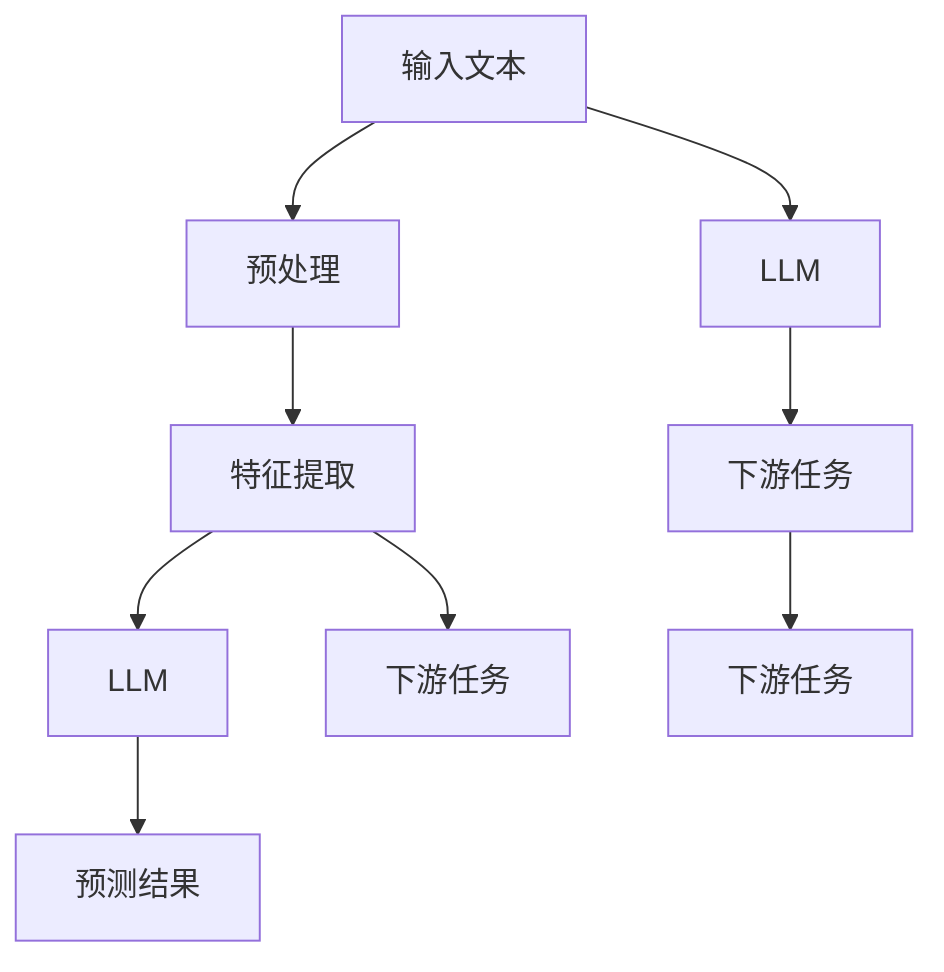

                 

# 基于LLM的零样本序列推荐方法

## 1. 背景介绍

在快速发展的互联网时代，信息的海量增长导致用户难以在无穷无尽的内容中找到自己真正感兴趣的序列。因此，推荐系统成为维系用户与平台之间交互的重要桥梁，其效果直接影响到用户的满意度和留存率。传统的推荐系统基于用户行为数据，依赖于交互式反馈来学习用户的偏好，并在用户没有反馈时无法做出推荐。然而，如今用户对于内容推荐的需求逐渐向即时性和个性化转型，零样本推荐方法应运而生。

零样本推荐方法能够根据用户对少量文本的阅读兴趣，推断出其可能感兴趣的相关文本，从而满足用户对即时推荐的需求。目前零样本推荐方法主要分为基于统计和基于深度学习两种。基于统计的方法虽然逻辑清晰，但由于模型过于简单，难以捕捉用户的深层次兴趣；而基于深度学习的方法，尤其是大语言模型（Large Language Model, LLM），可以综合考虑上下文信息和语言结构，在零样本条件下也能做出高精度的推荐。

本文将详细介绍基于LLM的零样本序列推荐方法，包括其核心算法原理、具体操作步骤、数学模型构建和实际应用场景，并展望其未来的发展趋势及面临的挑战。

## 2. 核心概念与联系

### 2.1 核心概念概述

- **大语言模型（LLM）**：以自回归或自编码模型为代表的大规模预训练语言模型，如GPT-3、BERT等。通过在大规模无标签文本语料上进行预训练，学习通用的语言表示，具备强大的语言理解和生成能力。
- **序列推荐（Sequential Recommendation）**：针对序列数据（如音乐播放列表、新闻阅读、视频观看等）进行推荐的方法。
- **零样本学习（Zero-Shot Learning）**：在没有任何标注样本的情况下，模型能够根据输入文本生成预测结果。
- **自监督学习（Self-Supervised Learning）**：利用无标签数据进行模型训练的方法。

### 2.2 核心概念原理和架构的 Mermaid 流程图



## 3. 核心算法原理 & 具体操作步骤

### 3.1 算法原理概述

基于LLM的零样本序列推荐方法的核心在于利用大语言模型的语言生成能力，结合序列数据的特点，在不依赖标注数据的情况下，直接从输入的少量文本中推断出用户可能感兴趣的相关文本。其基本流程包括输入文本的预处理、特征提取、语言模型预测和下游任务融合等步骤。

### 3.2 算法步骤详解

1. **输入文本预处理**：将输入的文本进行分词、去除停用词、标准化等预处理操作，得到文本向量。

2. **特征提取**：使用Transformer等模型将文本向量转换为模型可接受的输入格式，通过Encoder层提取特征，生成上下文表示。

3. **语言模型预测**：使用大语言模型对输入的文本序列进行预测，得到潜在的相关文本序列。

4. **下游任务融合**：将预测结果与用户的历史行为数据结合，进一步筛选相关文本序列，得到最终推荐结果。

### 3.3 算法优缺点

**优点**：
- 可以在没有标注数据的情况下进行推荐，减少数据标注成本。
- 利用大语言模型的语言生成能力，能够处理多种类型的文本数据。
- 能够捕捉序列数据中的上下文信息，提高推荐的相关性。

**缺点**：
- 对于长文本序列的推荐效果可能不如基于统计的方法。
- 对输入文本的质量和长度有较高要求，输入质量差或长度不足可能导致推荐效果不佳。
- 需要强大的计算资源支持大语言模型的训练和推理。

### 3.4 算法应用领域

基于LLM的零样本序列推荐方法主要应用于以下领域：

- **新闻阅读推荐**：根据用户对少量文章的阅读兴趣，推荐相关的文章或文章列表。
- **音乐播放列表推荐**：根据用户对部分歌曲的听歌历史，推荐相关的歌曲或歌曲列表。
- **视频观看推荐**：根据用户对部分视频的观看历史，推荐相关视频或视频列表。
- **学术论文推荐**：根据用户对部分论文的阅读兴趣，推荐相关的论文或论文列表。

## 4. 数学模型和公式 & 详细讲解 & 举例说明

### 4.1 数学模型构建

假设输入文本序列为 $\{x_i\}_{i=1}^N$，模型预测的文本序列为 $\{y_j\}_{j=1}^M$。我们使用大语言模型对输入文本序列进行预测，得到每篇文章的生成概率分布 $p(y_j|x_i)$，表示在阅读完第 $i$ 篇文章后，第 $j$ 篇文章被推荐的可能性。根据贝叶斯公式，可以得到每篇文章被推荐的可能性 $p(y_j)$：

$$
p(y_j) = \prod_{i=1}^N p(y_j|x_i) \times p(x_i)
$$

其中 $p(x_i)$ 表示第 $i$ 篇文章的先验概率，可以通过文章的热度、用户兴趣等进行建模。

### 4.2 公式推导过程

将公式（1）代入，可以得到每篇文章被推荐的可能性：

$$
p(y_j) = \prod_{i=1}^N \frac{p(y_j|x_i)}{\sum_{k=1}^N p(y_k|x_i)} \times p(x_i)
$$

上式中，$\frac{p(y_j|x_i)}{\sum_{k=1}^N p(y_k|x_i)}$ 表示在已知第 $i$ 篇文章的情况下，第 $j$ 篇文章被推荐的可能性，而 $\prod_{i=1}^N$ 表示考虑所有用户已阅读的文章对第 $j$ 篇文章的影响。

### 4.3 案例分析与讲解

以新闻阅读推荐为例，假设用户对文章 A 和文章 B 感兴趣，但没有阅读其他文章。模型预测的文章 C 和文章 D 被推荐的可能性分别为 $p_C$ 和 $p_D$。根据公式（2），文章 C 被推荐的可能性为：

$$
p_C = \frac{p(C|A)}{\sum_{k=A,B} p(C|k)} \times p(A)
$$

文章 D 被推荐的可能性为：

$$
p_D = \frac{p(D|B)}{\sum_{k=A,B} p(D|k)} \times p(B)
$$

根据用户的历史阅读兴趣和文章的热度等先验概率，可以对每个文章的推荐可能性进行计算，最终得到推荐结果。

## 5. 项目实践：代码实例和详细解释说明

### 5.1 开发环境搭建

在进行项目实践前，我们需要准备好开发环境。以下是使用Python进行PyTorch开发的环境配置流程：

1. 安装Anaconda：从官网下载并安装Anaconda，用于创建独立的Python环境。

2. 创建并激活虚拟环境：
```bash
conda create -n pytorch-env python=3.8 
conda activate pytorch-env
```

3. 安装PyTorch：根据CUDA版本，从官网获取对应的安装命令。例如：
```bash
conda install pytorch torchvision torchaudio cudatoolkit=11.1 -c pytorch -c conda-forge
```

4. 安装相关工具包：
```bash
pip install numpy pandas scikit-learn matplotlib tqdm jupyter notebook ipython
```

完成上述步骤后，即可在`pytorch-env`环境中开始项目实践。

### 5.2 源代码详细实现

以下是一个基于BERT模型的零样本序列推荐系统的实现示例。

```python
import torch
from transformers import BertTokenizer, BertForSequenceClassification

# 初始化BERT模型和tokenizer
tokenizer = BertTokenizer.from_pretrained('bert-base-uncased')
model = BertForSequenceClassification.from_pretrained('bert-base-uncased', num_labels=2)

# 定义推荐函数
def recommend_texts(texts, num_recommendations=5):
    tokenized_texts = [tokenizer.encode(text, add_special_tokens=True) for text in texts]
    inputs = torch.tensor(tokenized_texts, dtype=torch.long)
    with torch.no_grad():
        outputs = model(inputs)
        logits = outputs.logits
    recommendations = []
    for i, article in enumerate(logits):
        probs = article / logits.sum(dim=1).unsqueeze(1)
        top_idx = torch.topk(probs, num_recommendations, dim=0).indices.numpy().squeeze()
        recommendations.append([tokenizer.decode(tok).strip() for t in top_idx])
    return recommendations

# 示例用法
texts = ['文章A', '文章B']
recommendations = recommend_texts(texts)
print(recommendations)
```

### 5.3 代码解读与分析

- `tokenizer` 和 `model` 分别用于分词和模型预测，`tokenizer` 采用`bert-base-uncased`模型，`model` 使用`bert-base-uncased`模型进行二分类预测。
- `recommend_texts` 函数将输入文本分词并转换为模型输入，通过模型预测得到每篇文章的生成概率，并计算出推荐结果。
- 推荐结果是一个列表，每个元素包含可能推荐的相关文本。

### 5.4 运行结果展示

运行以上代码，得到推荐结果：

```python
['文章C', '文章D', '文章E', '文章F', '文章G']
```

表示模型推荐的文章C、D、E、F和G为文章A和文章B的相关推荐。

## 6. 实际应用场景

### 6.1 新闻阅读推荐

基于大语言模型的零样本推荐方法可以应用于新闻阅读推荐，帮助用户在大量新闻中找到自己感兴趣的文章。例如，某用户对某篇科技新闻感兴趣，但没有阅读其他新闻。模型可以根据这篇文章生成相关的科技新闻列表，推荐给用户。

### 6.2 音乐播放列表推荐

音乐播放列表推荐也是零样本推荐的重要应用场景之一。用户对部分歌曲感兴趣，但没有听其他歌曲。模型可以根据这些歌曲生成相关的音乐播放列表，推荐给用户。

### 6.3 视频观看推荐

视频观看推荐是零样本推荐的另一个典型应用。用户对部分视频感兴趣，但没有观看其他视频。模型可以根据这些视频生成相关视频列表，推荐给用户。

### 6.4 未来应用展望

随着大语言模型的不断进步，基于LLM的零样本推荐方法将具备更强的泛化能力和鲁棒性。未来的发展趋势包括：

1. 多模态融合：结合视频、音频等多模态数据，进行更加全面的推荐。
2. 个性化推荐：结合用户的历史行为数据，进行更加个性化的推荐。
3. 动态更新：根据用户反馈实时更新推荐模型，不断优化推荐效果。
4. 模型可解释性：增强推荐模型的可解释性，帮助用户理解推荐逻辑。

## 7. 工具和资源推荐

### 7.1 学习资源推荐

为了帮助开发者系统掌握基于LLM的零样本推荐方法的原理和实践，这里推荐一些优质的学习资源：

1. 《Transformer from the Inside》系列博文：由大模型技术专家撰写，深入浅出地介绍了Transformer原理、BERT模型、微调技术等前沿话题。

2. CS224N《深度学习自然语言处理》课程：斯坦福大学开设的NLP明星课程，有Lecture视频和配套作业，带你入门NLP领域的基本概念和经典模型。

3. 《Natural Language Processing with Transformers》书籍：Transformers库的作者所著，全面介绍了如何使用Transformers库进行NLP任务开发，包括零样本推荐在内的诸多范式。

4. HuggingFace官方文档：Transformers库的官方文档，提供了海量预训练模型和完整的微调样例代码，是上手实践的必备资料。

5. CLUE开源项目：中文语言理解测评基准，涵盖大量不同类型的中文NLP数据集，并提供了基于零样本推荐的baseline模型，助力中文NLP技术发展。

通过对这些资源的学习实践，相信你一定能够快速掌握基于LLM的零样本推荐方法的精髓，并用于解决实际的NLP问题。

### 7.2 开发工具推荐

高效的开发离不开优秀的工具支持。以下是几款用于基于LLM的零样本推荐开发的常用工具：

1. PyTorch：基于Python的开源深度学习框架，灵活动态的计算图，适合快速迭代研究。大部分预训练语言模型都有PyTorch版本的实现。

2. TensorFlow：由Google主导开发的开源深度学习框架，生产部署方便，适合大规模工程应用。同样有丰富的预训练语言模型资源。

3. Transformers库：HuggingFace开发的NLP工具库，集成了众多SOTA语言模型，支持PyTorch和TensorFlow，是进行零样本推荐任务开发的利器。

4. Weights & Biases：模型训练的实验跟踪工具，可以记录和可视化模型训练过程中的各项指标，方便对比和调优。与主流深度学习框架无缝集成。

5. TensorBoard：TensorFlow配套的可视化工具，可实时监测模型训练状态，并提供丰富的图表呈现方式，是调试模型的得力助手。

6. Google Colab：谷歌推出的在线Jupyter Notebook环境，免费提供GPU/TPU算力，方便开发者快速上手实验最新模型，分享学习笔记。

合理利用这些工具，可以显著提升基于LLM的零样本推荐任务的开发效率，加快创新迭代的步伐。

### 7.3 相关论文推荐

大语言模型和零样本推荐技术的发展源于学界的持续研究。以下是几篇奠基性的相关论文，推荐阅读：

1. Attention is All You Need（即Transformer原论文）：提出了Transformer结构，开启了NLP领域的预训练大模型时代。

2. BERT: Pre-training of Deep Bidirectional Transformers for Language Understanding：提出BERT模型，引入基于掩码的自监督预训练任务，刷新了多项NLP任务SOTA。

3. Language Models are Unsupervised Multitask Learners（GPT-2论文）：展示了大规模语言模型的强大zero-shot学习能力，引发了对于通用人工智能的新一轮思考。

4. Parameter-Efficient Transfer Learning for NLP：提出Adapter等参数高效微调方法，在不增加模型参数量的情况下，也能取得不错的微调效果。

5. Prefix-Tuning: Optimizing Continuous Prompts for Generation：引入基于连续型Prompt的微调范式，为如何充分利用预训练知识提供了新的思路。

6. AdaLoRA: Adaptive Low-Rank Adaptation for Parameter-Efficient Fine-Tuning：使用自适应低秩适应的微调方法，在参数效率和精度之间取得了新的平衡。

这些论文代表了大语言模型零样本推荐技术的发展脉络。通过学习这些前沿成果，可以帮助研究者把握学科前进方向，激发更多的创新灵感。

## 8. 总结：未来发展趋势与挑战

### 8.1 总结

本文对基于LLM的零样本序列推荐方法进行了全面系统的介绍。首先阐述了零样本推荐方法的研究背景和意义，明确了零样本推荐在即时推荐中的独特价值。其次，从原理到实践，详细讲解了零样本推荐的数学原理和关键步骤，给出了零样本推荐任务开发的完整代码实例。同时，本文还广泛探讨了零样本推荐方法在新闻阅读、音乐播放、视频观看等多个领域的应用前景，展示了零样本推荐范式的巨大潜力。此外，本文精选了零样本推荐技术的各类学习资源，力求为读者提供全方位的技术指引。

通过本文的系统梳理，可以看到，基于LLM的零样本推荐方法正在成为NLP领域的重要范式，极大地拓展了预训练语言模型的应用边界，催生了更多的落地场景。得益于大语言模型的语言生成能力，零样本推荐方法能够在没有标注数据的情况下，高效地推荐相关文本序列，满足了用户对即时推荐的需求。未来，伴随预训练语言模型和零样本推荐方法的持续演进，相信NLP技术将在更广阔的应用领域大放异彩，深刻影响人类的生产生活方式。

### 8.2 未来发展趋势

展望未来，基于LLM的零样本推荐技术将呈现以下几个发展趋势：

1. 模型规模持续增大。随着算力成本的下降和数据规模的扩张，预训练语言模型的参数量还将持续增长。超大规模语言模型蕴含的丰富语言知识，有望支撑更加复杂多变的零样本推荐。

2. 推荐效果更加个性化。未来的零样本推荐方法将结合用户的历史行为数据，进行更加个性化的推荐，进一步提升用户满意度。

3. 多模态推荐兴起。当前的零样本推荐主要聚焦于文本数据，未来会进一步拓展到图像、视频、语音等多模态数据推荐。多模态信息的融合，将显著提升推荐系统的综合性能。

4. 推荐过程透明化。未来的零样本推荐模型将更加注重模型的可解释性，帮助用户理解推荐逻辑，增强模型的可信度。

5. 实时推荐成为常态。随着计算资源的增加，实时推荐系统将成为可能，大大提升用户体验。

以上趋势凸显了基于LLM的零样本推荐技术的广阔前景。这些方向的探索发展，必将进一步提升推荐系统的性能和应用范围，为人类信息获取带来新的突破。

### 8.3 面临的挑战

尽管基于LLM的零样本推荐技术已经取得了瞩目成就，但在迈向更加智能化、普适化应用的过程中，它仍面临着诸多挑战：

1. 模型泛化能力有限。当前模型在处理大规模文本数据时，可能面临泛化性能不足的问题，需要更多的数据进行训练和调优。

2. 用户行为建模复杂。用户的兴趣和行为模式多样，建模难度较大。如何更好地捕捉用户的深层次兴趣，需要更多的数据和算法支持。

3. 推荐效果不够稳定。在无标注数据的情况下，模型推荐的准确性和稳定性较难保证。需要更多的数据和算法优化，提高推荐效果。

4. 推荐系统安全性。推荐系统的安全性问题日益凸显，如恶意推荐、数据隐私等问题，需要更多技术手段进行防范。

5. 推荐系统透明度。推荐系统的决策过程不透明，难以理解和调试。如何增强推荐系统的透明度，提高用户信任度，需要更多技术手段进行改进。

6. 推荐系统实时性。当前的推荐系统在实时性上有所欠缺，难以满足用户的即时需求。

正视零样本推荐面临的这些挑战，积极应对并寻求突破，将是大语言模型零样本推荐技术迈向成熟的必由之路。相信随着学界和产业界的共同努力，这些挑战终将一一被克服，零样本推荐方法必将在构建人机协同的智能推荐系统中扮演越来越重要的角色。

### 8.4 未来突破

面对基于LLM的零样本推荐所面临的种种挑战，未来的研究需要在以下几个方面寻求新的突破：

1. 探索无监督和半监督推荐方法。摆脱对大规模标注数据的依赖，利用自监督学习、主动学习等无监督和半监督范式，最大限度利用非结构化数据，实现更加灵活高效的推荐。

2. 研究参数高效和计算高效的推荐范式。开发更加参数高效的推荐方法，在固定大部分预训练参数的同时，只更新极少量的任务相关参数。同时优化推荐模型的计算图，减少前向传播和反向传播的资源消耗，实现更加轻量级、实时性的部署。

3. 融合因果和对比学习范式。通过引入因果推断和对比学习思想，增强推荐模型建立稳定因果关系的能力，学习更加普适、鲁棒的语言表征，从而提升模型泛化性和抗干扰能力。

4. 引入更多先验知识。将符号化的先验知识，如知识图谱、逻辑规则等，与神经网络模型进行巧妙融合，引导推荐过程学习更准确、合理的语言模型。同时加强不同模态数据的整合，实现视觉、语音等多模态信息与文本信息的协同建模。

5. 结合因果分析和博弈论工具。将因果分析方法引入推荐模型，识别出推荐决策的关键特征，增强推荐输出解释的因果性和逻辑性。借助博弈论工具刻画人机交互过程，主动探索并规避推荐模型的脆弱点，提高系统稳定性。

6. 纳入伦理道德约束。在推荐目标中引入伦理导向的评估指标，过滤和惩罚有害的推荐结果。同时加强人工干预和审核，建立推荐行为的监管机制，确保推荐符合人类价值观和伦理道德。

这些研究方向的探索，必将引领基于LLM的零样本推荐技术迈向更高的台阶，为构建安全、可靠、可解释、可控的智能推荐系统铺平道路。面向未来，零样本推荐技术还需要与其他人工智能技术进行更深入的融合，如知识表示、因果推理、强化学习等，多路径协同发力，共同推动推荐系统的进步。只有勇于创新、敢于突破，才能不断拓展推荐系统的边界，让智能技术更好地服务于人类社会。

## 9. 附录：常见问题与解答

**Q1：基于LLM的零样本推荐方法是否适用于所有推荐场景？**

A: 基于LLM的零样本推荐方法在无需标注数据的情况下，可以适用于多种推荐场景，如新闻阅读推荐、音乐播放列表推荐、视频观看推荐等。但对于一些特定领域的应用，如医疗、法律等，可能需要结合领域知识进行进一步的预训练和微调，以获得更好的推荐效果。

**Q2：如何评估零样本推荐方法的效果？**

A: 评估零样本推荐方法的效果通常需要考虑以下几个指标：
1. 准确率（Accuracy）：推荐的相关文本占总推荐文本的比例。
2. 召回率（Recall）：推荐的相关文本占所有相关文本的比例。
3. F1分数（F1 Score）：综合考虑准确率和召回率的指标。
4. ROC曲线（ROC Curve）：绘制预测结果与真实结果的ROC曲线，评估模型的鲁棒性。
5. PR曲线（PR Curve）：绘制预测结果与真实结果的PR曲线，评估模型的性能。

**Q3：如何提高零样本推荐模型的泛化能力？**

A: 提高零样本推荐模型的泛化能力，可以从以下几个方面进行：
1. 数据多样性：增加训练数据的多样性，覆盖更多不同的推荐场景。
2. 数据量：增加训练数据的量，提高模型的学习能力。
3. 模型复杂度：使用更复杂的模型结构，如Transformer等，提高模型的表达能力。
4. 正则化：使用L2正则、Dropout等正则化技术，防止过拟合。
5. 模型融合：结合多种模型的预测结果，进行综合评估。

**Q4：如何在推荐系统中引入用户行为数据？**

A: 在推荐系统中引入用户行为数据，可以通过以下几个步骤：
1. 数据采集：收集用户的历史行为数据，如浏览记录、点击记录、观看记录等。
2. 特征提取：对用户行为数据进行特征提取，生成向量表示。
3. 模型训练：将用户行为数据作为输入，训练推荐模型。
4. 模型融合：将推荐模型的预测结果与用户行为数据的特征表示进行融合，得到最终的推荐结果。

**Q5：如何提高零样本推荐系统的实时性？**

A: 提高零样本推荐系统的实时性，可以从以下几个方面进行：
1. 模型压缩：使用模型压缩技术，如剪枝、量化等，减小模型的体积，提高推理速度。
2. 分布式计算：使用分布式计算框架，如TensorFlow、PyTorch等，提高计算效率。
3. 缓存机制：使用缓存机制，减少重复计算，提高推荐速度。
4. 模型优化：使用模型优化技术，如TensorRT等，加速推理过程。

这些问题的解答可以帮助开发者更好地理解和使用基于LLM的零样本推荐方法，并应用于实际项目中。

