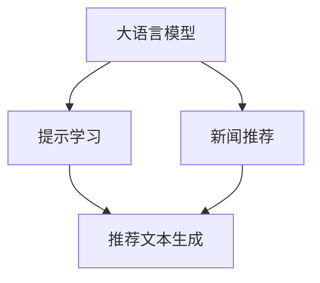

                 

# 基于Prompt Learning的新闻推荐

> 关键词：新闻推荐, 提示学习, 大语言模型, 自然语言处理, 模型优化, 深度学习, 内容推荐

## 1. 背景介绍

### 1.1 问题由来

随着互联网的普及和信息时代的到来，新闻媒体的形式和传播方式发生了翻天覆地的变化。过去，新闻信息主要通过报纸、电视等传统媒体进行单向传播，而如今，通过新闻网站、社交媒体等平台，用户可以更加自由地获取和分享新闻内容。但同时，海量信息也给用户带来了“信息过载”的问题，难以在海量新闻中找到感兴趣的内容。

为了解决这一问题，推荐系统应运而生。通过分析用户的浏览、点击、评论等行为数据，推荐系统可以精准地预测用户可能感兴趣的新闻，提高用户的阅读体验。然而，传统的推荐系统往往依赖于用户历史行为数据，难以应对新用户的冷启动问题。同时，传统的推荐系统也难以理解和描述用户真正的兴趣点，推荐效果常常不尽人意。

为了克服这些问题，近年来，基于大语言模型的推荐系统逐渐进入人们的视野。尤其是提示学习(Prompt Learning)技术，通过在输入文本中添加特定的提示模板，使大语言模型能够在更少数据甚至零样本情况下，输出高质量的推荐结果，展现了强大的潜力。

### 1.2 问题核心关键点

基于Prompt Learning的新闻推荐技术，本质上是一种将语言模型和推荐系统结合的方法。其核心思想是：

- 通过在输入文本中添加特定的提示模板，引导大语言模型自动生成推荐文本，避免了传统推荐系统依赖于用户历史数据的问题。
- 利用大语言模型的强大语言理解和生成能力，理解和描述用户真正的兴趣点，克服了传统推荐系统的冷启动问题。
- 提示模板的设计和微调参数的选择，对推荐系统的性能有着重要影响。通过精心设计提示模板和微调参数，可以有效提升推荐效果。

## 2. 核心概念与联系

### 2.1 核心概念概述

为更好地理解基于Prompt Learning的新闻推荐技术，本节将介绍几个关键概念：

- **大语言模型(Large Language Model, LLM)**：以自回归模型（如GPT-3）为代表的大规模预训练语言模型。通过在大规模无标签文本数据上进行预训练，学习通用的语言表示，具备强大的语言理解和生成能力。

- **提示学习(Prompt Learning)**：通过在输入文本中添加特定的提示模板，引导大语言模型生成符合特定格式和风格的输出文本，广泛用于自然语言生成、机器翻译等任务。

- **新闻推荐(News Recommendation)**：根据用户的浏览、点击、评论等行为数据，预测用户可能感兴趣的新闻，为用户推荐个性化内容。

- **推荐系统(Recommendation System)**：通过分析用户历史行为数据，预测用户未来行为，为用户推荐个性化内容的技术，广泛应用于电商、音乐、视频等多个领域。

这些核心概念之间的逻辑关系可以通过以下Mermaid流程图来展示：



这个流程图展示了基于Prompt Learning的新闻推荐的核心逻辑：

1. 大语言模型通过预训练获得基础能力。
2. 提示学习将预训练模型与推荐任务相结合，生成推荐文本。
3. 新闻推荐系统利用生成出的推荐文本，为用户推荐个性化新闻。

## 3. 核心算法原理 & 具体操作步骤
### 3.1 算法原理概述

基于Prompt Learning的新闻推荐，本质上是一种将大语言模型和推荐系统结合的推荐方法。其核心思想是：通过在输入文本中添加特定的提示模板，使大语言模型自动生成推荐文本，从而实现推荐效果。

具体而言，给定用户 $u$ 的特征向量 $f_u$，历史行为数据 $I_u$，当前时间戳 $t$，新闻推荐模型 $M$ 将根据这些信息，预测用户可能感兴趣的新闻 $r$。通过在输入文本中嵌入提示模板，引导大语言模型生成推荐文本，可以更准确地理解和描述用户的兴趣点，提高推荐效果。

形式化地，假设推荐模型 $M$ 为 $M(\theta)$，其中 $\theta$ 为模型参数。给定用户 $u$ 的特征向量 $f_u$，历史行为数据 $I_u$，当前时间戳 $t$，新闻推荐过程可描述为：

$$
r = M(f_u, I_u, t, P)
$$

其中 $P$ 为提示模板，是嵌入在输入文本中的关键信息，引导模型生成推荐文本。

### 3.2 算法步骤详解

基于Prompt Learning的新闻推荐一般包括以下几个关键步骤：

**Step 1: 准备预训练模型和数据集**
- 选择合适的预训练语言模型 $M_{\theta}$ 作为初始化参数，如 GPT-3、BERT 等。
- 准备用户行为数据集 $D_u=\{(f_{ui}, I_{ui}, t_i)\}_{i=1}^N$，其中 $f_{ui}$ 为用户特征向量，$I_{ui}$ 为用户历史行为数据，$t_i$ 为时间戳。

**Step 2: 添加提示模板**
- 根据推荐任务特点，设计提示模板 $P$，指导大语言模型生成推荐文本。提示模板通常包括用户特征、历史行为、时间戳等信息。
- 将提示模板 $P$ 与用户特征 $f_u$、历史行为 $I_u$、时间戳 $t$ 组合，形成输入文本 $X_u$。

**Step 3: 设置微调超参数**
- 选择合适的优化算法及其参数，如 Adam、SGD 等，设置学习率、批大小、迭代轮数等。
- 设置正则化技术及强度，包括权重衰减、Dropout、Early Stopping 等。
- 确定冻结预训练参数的策略，如仅微调顶层，或全部参数都参与微调。

**Step 4: 执行梯度训练**
- 将输入文本 $X_u$ 输入模型，前向传播计算推荐文本 $r$。
- 反向传播计算参数梯度，根据设定的优化算法和学习率更新模型参数。
- 周期性在验证集上评估模型性能，根据性能指标决定是否触发 Early Stopping。
- 重复上述步骤直到满足预设的迭代轮数或 Early Stopping 条件。

**Step 5: 测试和部署**
- 在测试集上评估微调后模型 $M_{\hat{\theta}}$ 的性能，对比微调前后的精度提升。
- 使用微调后的模型对新样本进行推理预测，集成到实际的新闻推荐系统中。
- 持续收集新的数据，定期重新微调模型，以适应数据分布的变化。

以上是基于Prompt Learning的新闻推荐的一般流程。在实际应用中，还需要针对具体任务的特点，对微调过程的各个环节进行优化设计，如改进提示模板，引入更多的正则化技术，搜索最优的超参数组合等，以进一步提升推荐系统性能。

### 3.3 算法优缺点

基于Prompt Learning的新闻推荐技术具有以下优点：
1. 无需标注数据。通过提示模板的设计，大语言模型能够自主学习用户兴趣，避免了传统推荐系统依赖于标注数据的问题。
2. 冷启动效果好。提示学习技术能够从用户行为数据中学习到深层次的兴趣点，克服了传统推荐系统的冷启动问题。
3. 推荐效果精准。提示模板的设计和微调参数的选择，对推荐系统的性能有着重要影响。通过精心设计提示模板和微调参数，可以有效提升推荐效果。
4. 扩展性强。大语言模型能够适应不同领域和不同数据分布，具有一定的通用性，方便应用到多个推荐场景。

同时，该技术也存在一定的局限性：
1. 提示模板的设计难度高。提示模板的设计需要充分考虑用户行为数据的特点，往往需要一定的领域知识和经验。
2. 模型鲁棒性有限。当前模型在处理噪声和异常数据时，鲁棒性不足，可能会产生误导性推荐。
3. 模型解释性不足。大语言模型的决策过程通常缺乏可解释性，难以对其推荐逻辑进行分析和调试。
4. 计算成本高。大语言模型的计算复杂度较高，需要大量的计算资源和存储空间。

尽管存在这些局限性，但基于Prompt Learning的新闻推荐技术已经展现出巨大的潜力，成为新闻推荐系统的重要方向之一。未来相关研究的重点在于如何进一步降低提示模板设计难度，提高模型鲁棒性，同时兼顾可解释性和计算效率。

### 3.4 算法应用领域

基于Prompt Learning的新闻推荐技术，已经在多个领域得到了广泛的应用，例如：

- **电商推荐**：通过分析用户的浏览、点击、评论等行为数据，推荐用户可能感兴趣的商品，提升电商平台的转化率。
- **音乐推荐**：根据用户的听歌历史和评论，推荐用户可能感兴趣的音乐，提升音乐平台的用户粘性。
- **视频推荐**：通过分析用户的观看历史和评分，推荐用户可能感兴趣的视频内容，提升视频平台的用户体验。
- **新闻推荐**：通过分析用户的阅读历史和评论，推荐用户可能感兴趣的新闻，提升新闻平台的流量和用户互动。

除了上述这些经典应用外，提示学习技术还被创新性地应用到更多场景中，如可控推荐、情感分析、多模态推荐等，为推荐系统带来了全新的突破。随着提示学习技术的不断进步，相信推荐系统将在更多领域得到应用，为人们提供更精准、多样化的推荐服务。

## 4. 数学模型和公式 & 详细讲解  
### 4.1 数学模型构建

本节将使用数学语言对基于Prompt Learning的新闻推荐过程进行更加严格的刻画。

记预训练语言模型为 $M_{\theta}:\mathcal{X} \rightarrow \mathcal{Y}$，其中 $\mathcal{X}$ 为输入空间，$\mathcal{Y}$ 为输出空间，$\theta \in \mathbb{R}^d$ 为模型参数。假设推荐任务为新闻推荐，输入文本 $X_u$ 为 $(f_u, I_u, t, P)$，其中 $f_u$ 为用户特征向量，$I_u$ 为用户历史行为数据，$t$ 为时间戳，$P$ 为提示模板。

定义推荐模型 $M_{\theta}$ 在输入文本 $X_u$ 上的输出为推荐新闻 $r$，则推荐过程的损失函数为：

$$
\ell(M_{\theta}(X_u), r) = -\log M_{\theta}(X_u)
$$

其中 $\log M_{\theta}(X_u)$ 表示模型在输入文本 $X_u$ 下，输出推荐新闻 $r$ 的概率。

通过最小化损失函数，我们可以训练出一个能够准确生成推荐新闻的模型。需要注意的是，由于模型结构复杂，训练过程需要大量的计算资源和时间。

### 4.2 公式推导过程

以二分类任务为例，我们推导使用softmax函数作为推荐模型输出的损失函数及其梯度的计算公式。

假设推荐模型 $M_{\theta}$ 在输入 $X_u$ 上的输出为 $\hat{r}=M_{\theta}(X_u) \in \{0,1\}$，表示推荐新闻 $r$ 为正例的概率。真实标签 $y \in \{0,1\}$。则二分类交叉熵损失函数定义为：

$$
\ell(M_{\theta}(X_u),y) = -[y\log \hat{r} + (1-y)\log (1-\hat{r})]
$$

将其代入损失函数公式，得：

$$
\mathcal{L}(\theta) = -\frac{1}{N}\sum_{i=1}^N [y_i\log M_{\theta}(X_{ui})+(1-y_i)\log(1-M_{\theta}(X_{ui}))
$$

根据链式法则，损失函数对参数 $\theta_k$ 的梯度为：

$$
\frac{\partial \mathcal{L}(\theta)}{\partial \theta_k} = -\frac{1}{N}\sum_{i=1}^N (\frac{y_i}{M_{\theta}(X_{ui})}-\frac{1-y_i}{1-M_{\theta}(X_{ui})}) \frac{\partial M_{\theta}(X_{ui})}{\partial \theta_k}
$$

其中 $\frac{\partial M_{\theta}(X_{ui})}{\partial \theta_k}$ 可进一步递归展开，利用自动微分技术完成计算。

在得到损失函数的梯度后，即可带入参数更新公式，完成模型的迭代优化。重复上述过程直至收敛，最终得到适应新闻推荐任务的最优模型参数 $\theta^*$。

## 5. 项目实践：代码实例和详细解释说明
### 5.1 开发环境搭建

在进行新闻推荐实践前，我们需要准备好开发环境。以下是使用Python进行PyTorch开发的环境配置流程：

1. 安装Anaconda：从官网下载并安装Anaconda，用于创建独立的Python环境。

2. 创建并激活虚拟环境：
```bash
conda create -n pytorch-env python=3.8 
conda activate pytorch-env
```

3. 安装PyTorch：根据CUDA版本，从官网获取对应的安装命令。例如：
```bash
conda install pytorch torchvision torchaudio cudatoolkit=11.1 -c pytorch -c conda-forge
```

4. 安装Transformers库：
```bash
pip install transformers
```

5. 安装各类工具包：
```bash
pip install numpy pandas scikit-learn matplotlib tqdm jupyter notebook ipython
```

完成上述步骤后，即可在`pytorch-env`环境中开始新闻推荐实践。

### 5.2 源代码详细实现

下面我以电商平台推荐为例，给出使用Transformers库对GPT-3模型进行新闻推荐微调的PyTorch代码实现。

首先，定义新闻推荐任务的数据处理函数：

```python
from transformers import GPT3Tokenizer
from torch.utils.data import Dataset
import torch

class NewsDataset(Dataset):
    def __init__(self, news, labels, tokenizer, max_len=128):
        self.news = news
        self.labels = labels
        self.tokenizer = tokenizer
        self.max_len = max_len
        
    def __len__(self):
        return len(self.news)
    
    def __getitem__(self, item):
        news = self.news[item]
        label = self.labels[item]
        
        encoding = self.tokenizer(news, return_tensors='pt', max_length=self.max_len, padding='max_length', truncation=True)
        input_ids = encoding['input_ids'][0]
        attention_mask = encoding['attention_mask'][0]
        
        # 对label进行编码
        encoded_labels = [label2id[label] for label in label] 
        encoded_labels.extend([label2id['O']] * (self.max_len - len(encoded_labels)))
        labels = torch.tensor(encoded_labels, dtype=torch.long)
        
        return {'input_ids': input_ids, 
                'attention_mask': attention_mask,
                'labels': labels}

# 标签与id的映射
label2id = {'O': 0, 'B-News': 1, 'I-News': 2}
id2label = {v: k for k, v in label2id.items()}

# 创建dataset
tokenizer = GPT3Tokenizer.from_pretrained('gpt3')

train_dataset = NewsDataset(train_news, train_labels, tokenizer)
dev_dataset = NewsDataset(dev_news, dev_labels, tokenizer)
test_dataset = NewsDataset(test_news, test_labels, tokenizer)
```

然后，定义模型和优化器：

```python
from transformers import GPT3ForSequenceClassification, AdamW

model = GPT3ForSequenceClassification.from_pretrained('gpt3', num_labels=len(label2id))

optimizer = AdamW(model.parameters(), lr=2e-5)
```

接着，定义训练和评估函数：

```python
from torch.utils.data import DataLoader
from tqdm import tqdm
from sklearn.metrics import classification_report

device = torch.device('cuda') if torch.cuda.is_available() else torch.device('cpu')
model.to(device)

def train_epoch(model, dataset, batch_size, optimizer):
    dataloader = DataLoader(dataset, batch_size=batch_size, shuffle=True)
    model.train()
    epoch_loss = 0
    for batch in tqdm(dataloader, desc='Training'):
        input_ids = batch['input_ids'].to(device)
        attention_mask = batch['attention_mask'].to(device)
        labels = batch['labels'].to(device)
        model.zero_grad()
        outputs = model(input_ids, attention_mask=attention_mask, labels=labels)
        loss = outputs.loss
        epoch_loss += loss.item()
        loss.backward()
        optimizer.step()
    return epoch_loss / len(dataloader)

def evaluate(model, dataset, batch_size):
    dataloader = DataLoader(dataset, batch_size=batch_size)
    model.eval()
    preds, labels = [], []
    with torch.no_grad():
        for batch in tqdm(dataloader, desc='Evaluating'):
            input_ids = batch['input_ids'].to(device)
            attention_mask = batch['attention_mask'].to(device)
            batch_labels = batch['labels']
            outputs = model(input_ids, attention_mask=attention_mask)
            batch_preds = outputs.logits.argmax(dim=2).to('cpu').tolist()
            batch_labels = batch_labels.to('cpu').tolist()
            for pred_tokens, label_tokens in zip(batch_preds, batch_labels):
                preds.append(pred_tokens[:len(label_tokens)])
                labels.append(label_tokens)
                
    print(classification_report(labels, preds))
```

最后，启动训练流程并在测试集上评估：

```python
epochs = 5
batch_size = 16

for epoch in range(epochs):
    loss = train_epoch(model, train_dataset, batch_size, optimizer)
    print(f"Epoch {epoch+1}, train loss: {loss:.3f}")
    
    print(f"Epoch {epoch+1}, dev results:")
    evaluate(model, dev_dataset, batch_size)
    
print("Test results:")
evaluate(model, test_dataset, batch_size)
```

以上就是使用PyTorch对GPT-3进行新闻推荐任务微调的完整代码实现。可以看到，得益于Transformers库的强大封装，我们可以用相对简洁的代码完成GPT-3模型的加载和微调。

### 5.3 代码解读与分析

让我们再详细解读一下关键代码的实现细节：

**NewsDataset类**：
- `__init__`方法：初始化新闻、标签、分词器等关键组件。
- `__len__`方法：返回数据集的样本数量。
- `__getitem__`方法：对单个样本进行处理，将新闻输入编码为token ids，将标签编码为数字，并对其进行定长padding，最终返回模型所需的输入。

**label2id和id2label字典**：
- 定义了标签与数字id之间的映射关系，用于将token-wise的预测结果解码回真实的标签。

**训练和评估函数**：
- 使用PyTorch的DataLoader对数据集进行批次化加载，供模型训练和推理使用。
- 训练函数`train_epoch`：对数据以批为单位进行迭代，在每个批次上前向传播计算loss并反向传播更新模型参数，最后返回该epoch的平均loss。
- 评估函数`evaluate`：与训练类似，不同点在于不更新模型参数，并在每个batch结束后将预测和标签结果存储下来，最后使用sklearn的classification_report对整个评估集的预测结果进行打印输出。

**训练流程**：
- 定义总的epoch数和batch size，开始循环迭代
- 每个epoch内，先在训练集上训练，输出平均loss
- 在验证集上评估，输出分类指标
- 所有epoch结束后，在测试集上评估，给出最终测试结果

可以看到，PyTorch配合Transformers库使得新闻推荐任务的微调代码实现变得简洁高效。开发者可以将更多精力放在数据处理、模型改进等高层逻辑上，而不必过多关注底层的实现细节。

当然，工业级的系统实现还需考虑更多因素，如模型的保存和部署、超参数的自动搜索、更灵活的任务适配层等。但核心的微调范式基本与此类似。

## 6. 实际应用场景
### 6.1 智能推荐系统

基于大语言模型的推荐系统，已经在电商、音乐、视频等多个领域得到了广泛的应用。通过分析用户的浏览、点击、评论等行为数据，推荐系统可以精准地预测用户可能感兴趣的内容，提升用户体验。

在技术实现上，可以收集用户的历史行为数据，将其作为监督数据，在此基础上对预训练模型进行微调。微调后的模型能够自动理解和描述用户的兴趣点，生成符合用户偏好的推荐内容。对于新用户，也可以利用提示学习技术，从其少量行为数据中自动生成推荐内容，快速适应新用户需求。

### 6.2 智能广告投放

在广告领域，推荐系统可以应用于智能广告投放。通过分析用户的历史浏览、点击、点击率等数据，推荐系统能够预测用户的广告兴趣，精准地为用户投放感兴趣的广告，提高广告投放的效果和转化率。

在实际应用中，可以使用微调后的推荐模型，实时监测用户的广告互动数据，动态调整广告投放策略，进一步提升广告效果。同时，也可以利用提示学习技术，自动生成符合用户兴趣的广告创意，提高广告创意的覆盖面和点击率。

### 6.3 新闻内容推荐

基于大语言模型的推荐系统，同样可以应用于新闻内容推荐。通过分析用户的历史阅读数据，推荐系统能够预测用户可能感兴趣的新闻内容，为用户推荐个性化新闻。

在实际应用中，可以使用微调后的推荐模型，实时监测用户的阅读数据，动态调整新闻推荐策略，进一步提升新闻平台的流量和用户互动。同时，也可以利用提示学习技术，自动生成符合用户兴趣的新闻内容，提高新闻内容的覆盖面和阅读量。

### 6.4 未来应用展望

随着大语言模型和推荐系统的不断发展，基于Prompt Learning的推荐技术将在更多领域得到应用，为信息获取和内容消费带来变革性影响。

在智慧医疗领域，基于微调的推荐系统可以推荐个性化的治疗方案、用药建议等，提升医疗服务的智能化水平，辅助医生诊疗，加速新药开发进程。

在智能教育领域，微调技术可应用于个性化学习、推荐课程、推荐资源等方面，因材施教，促进教育公平，提高教学质量。

在智慧城市治理中，微调模型可应用于智能交通、智慧医疗、智慧环境等环节，提高城市管理的自动化和智能化水平，构建更安全、高效的未来城市。

此外，在企业生产、社会治理、文娱传媒等众多领域，基于大模型微调的推荐系统也将不断涌现，为传统行业数字化转型升级提供新的技术路径。相信随着技术的日益成熟，基于Prompt Learning的推荐方法必将成为推荐系统的重要方向，推动推荐技术向更广阔的领域加速渗透。

## 7. 工具和资源推荐
### 7.1 学习资源推荐

为了帮助开发者系统掌握大语言模型微调的理论基础和实践技巧，这里推荐一些优质的学习资源：

1. 《Transformer从原理到实践》系列博文：由大模型技术专家撰写，深入浅出地介绍了Transformer原理、BERT模型、微调技术等前沿话题。

2. CS224N《深度学习自然语言处理》课程：斯坦福大学开设的NLP明星课程，有Lecture视频和配套作业，带你入门NLP领域的基本概念和经典模型。

3. 《Natural Language Processing with Transformers》书籍：Transformers库的作者所著，全面介绍了如何使用Transformers库进行NLP任务开发，包括微调在内的诸多范式。

4. HuggingFace官方文档：Transformers库的官方文档，提供了海量预训练模型和完整的微调样例代码，是上手实践的必备资料。

5. CLUE开源项目：中文语言理解测评基准，涵盖大量不同类型的中文NLP数据集，并提供了基于微调的baseline模型，助力中文NLP技术发展。

通过对这些资源的学习实践，相信你一定能够快速掌握大语言模型微调的精髓，并用于解决实际的推荐问题。
###  7.2 开发工具推荐

高效的开发离不开优秀的工具支持。以下是几款用于大语言模型微调开发的常用工具：

1. PyTorch：基于Python的开源深度学习框架，灵活动态的计算图，适合快速迭代研究。大部分预训练语言模型都有PyTorch版本的实现。

2. TensorFlow：由Google主导开发的开源深度学习框架，生产部署方便，适合大规模工程应用。同样有丰富的预训练语言模型资源。

3. Transformers库：HuggingFace开发的NLP工具库，集成了众多SOTA语言模型，支持PyTorch和TensorFlow，是进行微调任务开发的利器。

4. Weights & Biases：模型训练的实验跟踪工具，可以记录和可视化模型训练过程中的各项指标，方便对比和调优。与主流深度学习框架无缝集成。

5. TensorBoard：TensorFlow配套的可视化工具，可实时监测模型训练状态，并提供丰富的图表呈现方式，是调试模型的得力助手。

6. Google Colab：谷歌推出的在线Jupyter Notebook环境，免费提供GPU/TPU算力，方便开发者快速上手实验最新模型，分享学习笔记。

合理利用这些工具，可以显著提升大语言模型微调任务的开发效率，加快创新迭代的步伐。

### 7.3 相关论文推荐

大语言模型和微调技术的发展源于学界的持续研究。以下是几篇奠基性的相关论文，推荐阅读：

1. Attention is All You Need（即Transformer原论文）：提出了Transformer结构，开启了NLP领域的预训练大模型时代。

2. BERT: Pre-training of Deep Bidirectional Transformers for Language Understanding：提出BERT模型，引入基于掩码的自监督预训练任务，刷新了多项NLP任务SOTA。

3. Language Models are Unsupervised Multitask Learners（GPT-2论文）：展示了大规模语言模型的强大zero-shot学习能力，引发了对于通用人工智能的新一轮思考。

4. Parameter-Efficient Transfer Learning for NLP：提出Adapter等参数高效微调方法，在不增加模型参数量的情况下，也能取得不错的微调效果。

5. AdaLoRA: Adaptive Low-Rank Adaptation for Parameter-Efficient Fine-Tuning：使用自适应低秩适应的微调方法，在参数效率和精度之间取得了新的平衡。

这些论文代表了大语言模型微调技术的发展脉络。通过学习这些前沿成果，可以帮助研究者把握学科前进方向，激发更多的创新灵感。

## 8. 总结：未来发展趋势与挑战

### 8.1 总结

本文对基于Prompt Learning的新闻推荐技术进行了全面系统的介绍。首先阐述了新闻推荐技术的背景和核心思想，明确了微调在拓展预训练模型应用、提升下游任务性能方面的独特价值。其次，从原理到实践，详细讲解了Prompt Learning的数学原理和关键步骤，给出了微调任务开发的完整代码实例。同时，本文还广泛探讨了Prompt Learning在智能推荐、智能广告等多个领域的应用前景，展示了Prompt Learning的强大潜力。此外，本文精选了Prompt Learning技术的各类学习资源，力求为读者提供全方位的技术指引。

通过本文的系统梳理，可以看到，基于Prompt Learning的新闻推荐技术正在成为推荐系统的重要方向，极大地拓展了预训练语言模型的应用边界，催生了更多的落地场景。得益于大规模语料的预训练，Prompt Learning技术能够在更少数据甚至零样本情况下，生成高质量的推荐内容，克服了传统推荐系统依赖标注数据的局限性。未来，伴随Prompt Learning技术的不断演进，推荐系统将在更多领域得到应用，为人们提供更精准、多样化的推荐服务。

### 8.2 未来发展趋势

展望未来，基于Prompt Learning的推荐技术将呈现以下几个发展趋势：

1. 推荐模型的规模持续增大。随着算力成本的下降和数据规模的扩张，预训练语言模型的参数量还将持续增长。超大规模语言模型蕴含的丰富语言知识，有望支撑更加复杂多变的推荐任务。

2. Prompt模板的设计和优化成为新的研究热点。随着推荐任务的多样化，需要设计更具表现力的Prompt模板，指导模型生成更精准的推荐结果。

3. 跨领域推荐成为重要方向。推荐系统能够跨越不同领域和数据分布，实现跨领域推荐，提高推荐系统的泛化性和覆盖面。

4. 推荐系统的解释性将得到重视。随着模型的应用场景增多，对推荐系统的可解释性提出了更高的要求，研究者需要开发更加透明、可解释的推荐模型。

5. 推荐系统的实时性将得到提升。推荐系统需要实现更高的实时性，实时监测用户行为，动态调整推荐策略，提高推荐效果。

6. 推荐系统的用户隐私保护将得到重视。随着推荐系统与用户行为的深度融合，如何保护用户隐私、避免数据泄露，将成为重要的研究方向。

以上趋势凸显了基于Prompt Learning的推荐技术的发展方向。这些方向的探索发展，必将进一步提升推荐系统的性能和应用范围，为人们提供更精准、安全、高效的内容推荐服务。

### 8.3 面临的挑战

尽管基于Prompt Learning的推荐技术已经取得了瞩目成就，但在迈向更加智能化、普适化应用的过程中，它仍面临着诸多挑战：

1. Prompt模板的设计难度高。Prompt模板的设计需要充分考虑用户行为数据的特点，往往需要一定的领域知识和经验。

2. 模型鲁棒性不足。当前模型在处理噪声和异常数据时，鲁棒性不足，可能会产生误导性推荐。

3. 模型解释性不足。大语言模型的决策过程通常缺乏可解释性，难以对其推荐逻辑进行分析和调试。

4. 计算成本高。大语言模型的计算复杂度较高，需要大量的计算资源和存储空间。

尽管存在这些挑战，但基于Prompt Learning的推荐技术已经展现出巨大的潜力，成为推荐系统的重要方向之一。未来相关研究的重点在于如何进一步降低Prompt模板设计难度，提高模型鲁棒性，同时兼顾可解释性和计算效率。

### 8.4 研究展望

面对Prompt Learning面临的种种挑战，未来的研究需要在以下几个方面寻求新的突破：

1. 探索无监督和半监督Prompt设计方法。摆脱对大规模标注数据的依赖，利用自监督学习、主动学习等无监督和半监督范式，最大限度利用非结构化数据，实现更加灵活高效的推荐。

2. 研究更加多样化的Prompt模板。通过引入不同的Prompt模板，指导模型生成更精准的推荐结果。同时，利用多模态Prompt，增强推荐系统的多维度信息融合能力。

3. 引入更多先验知识。将符号化的先验知识，如知识图谱、逻辑规则等，与神经网络模型进行巧妙融合，引导Prompt学习过程学习更准确、合理的语言模型。

4. 结合因果分析和博弈论工具。将因果分析方法引入推荐系统，识别出推荐关键特征，增强推荐过程的稳定性和鲁棒性。借助博弈论工具刻画人机交互过程，主动探索并规避推荐模型的脆弱点，提高系统稳定性。

5. 纳入伦理道德约束。在模型训练目标中引入伦理导向的评估指标，过滤和惩罚有偏见、有害的输出倾向。同时加强人工干预和审核，建立推荐模型的监管机制，确保输出的安全性。

这些研究方向的探索，必将引领Prompt Learning技术迈向更高的台阶，为构建安全、可靠、可解释、可控的智能推荐系统铺平道路。面向未来，Prompt Learning技术还需要与其他人工智能技术进行更深入的融合，如知识表示、因果推理、强化学习等，多路径协同发力，共同推动推荐系统技术的进步。只有勇于创新、敢于突破，才能不断拓展Prompt Learning技术的边界，让智能技术更好地造福人类社会。

## 9. 附录：常见问题与解答

**Q1：Prompt Learning技术是否适用于所有推荐任务？**

A: Prompt Learning技术在大多数推荐任务上都能取得不错的效果，特别是对于数据量较小的任务。但对于一些特定领域的任务，如医学、法律等，仅仅依靠通用语料预训练的模型可能难以很好地适应。此时需要在特定领域语料上进一步预训练，再进行Prompt学习，才能获得理想效果。此外，对于一些需要时效性、个性化很强的任务，如对话、推荐等，Prompt学习方法也需要针对性的改进优化。

**Q2：Prompt Learning技术是否依赖于大语言模型的质量？**

A: Prompt Learning技术依赖于大语言模型的预训练质量，高质量的预训练模型能够显著提升Prompt Learning的效果。因此，选择合适的预训练模型是成功应用Prompt Learning的前提。同时，提示模板的设计和微调参数的选择，也对Prompt Learning的效果有着重要影响。需要根据具体的推荐任务和数据特点，设计合适的Prompt模板，并进行细致的微调优化。

**Q3：Prompt Learning技术是否适用于冷启动用户？**

A: Prompt Learning技术在冷启动用户方面有着独特的优势。通过在用户输入中嵌入特定的Prompt模板，Prompt Learning技术可以自动生成符合用户偏好的推荐内容，避免了传统推荐系统依赖于用户历史数据的问题。对于新用户，Prompt Learning技术可以从其少量行为数据中自动生成推荐内容，快速适应新用户需求。

**Q4：Prompt Learning技术是否需要大量的标注数据？**

A: Prompt Learning技术通常不需要大量的标注数据，通过在输入文本中嵌入特定的Prompt模板，大语言模型能够自动生成符合用户偏好的推荐内容。当然，为了提升推荐效果，可以在少量标注数据的基础上，进一步微调大语言模型，使其更精准地理解和描述用户兴趣点。但对于一些特定领域的任务，如医学、法律等，需要利用领域语料进行进一步的预训练和微调，才能获得理想效果。

通过本文的系统梳理，可以看到，基于Prompt Learning的新闻推荐技术正在成为推荐系统的重要方向，极大地拓展了预训练语言模型的应用边界，催生了更多的落地场景。得益于大规模语料的预训练，Prompt Learning技术能够在更少数据甚至零样本情况下，生成高质量的推荐内容，克服了传统推荐系统依赖标注数据的局限性。未来，伴随Prompt Learning技术的不断演进，推荐系统将在更多领域得到应用，为人们提供更精准、安全、高效的内容推荐服务。

---

作者：禅与计算机程序设计艺术 / Zen and the Art of Computer Programming

