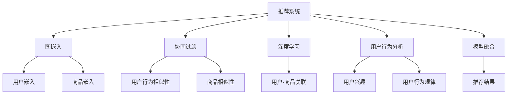

                 

# 基于图嵌入的大规模商品推荐系统

> 关键词：推荐系统, 图嵌入, 深度学习, 协同过滤, 用户行为分析, 模型融合, 实时计算

## 1. 背景介绍

### 1.1 问题由来
随着互联网的迅猛发展和电子商务的普及，用户与商品之间的交互数据迅速增长。如何有效利用这些数据，向用户推荐其感兴趣的商品，成为了电商平台急需解决的重要问题。传统的基于内容推荐和协同过滤算法虽然取得了一定成功，但在处理大规模数据集时面临计算和存储压力。深度学习技术特别是图神经网络(Graph Neural Network, GNN)的出现，为大规模推荐系统的构建提供了新的方向。

### 1.2 问题核心关键点
基于图嵌入的大规模商品推荐系统，通过构建用户-商品关系图，并利用图神经网络对图进行嵌入学习，生成用户和商品的低维向量表示，从而实现高效率的推荐。这一方法不仅能够捕捉用户和商品之间的复杂关系，还能够通过融合用户行为数据，进一步提升推荐的精准度。

## 2. 核心概念与联系

### 2.1 核心概念概述

为更好地理解基于图嵌入的大规模商品推荐系统，本节将介绍几个密切相关的核心概念：

- 推荐系统：使用机器学习算法预测用户可能感兴趣的商品，为用户推荐商品的系统。推荐系统广泛应用于电子商务、社交网络、新闻媒体等领域，是推动平台用户增长、提高用户满意度的重要手段。

- 图嵌入：通过图神经网络等方法，将图数据转换为低维向量表示的过程。图嵌入可以捕捉节点间的关系，并保留图结构的复杂信息，广泛应用于社交网络分析、自然语言处理等领域。

- 协同过滤：通过分析用户行为数据，找到相似用户或商品，进行推荐的方法。协同过滤包括基于用户的协同过滤和基于物品的协同过滤两种，是推荐系统的重要基础。

- 深度学习：利用神经网络模型进行数据处理和特征学习的方法。深度学习在推荐系统中应用广泛，可以学习到用户和商品之间的非线性关系。

- 用户行为分析：对用户的历史行为数据进行统计分析，提取用户兴趣偏好和行为规律。用户行为分析是推荐系统构建的基础，可以帮助模型理解用户需求。

- 模型融合：将多个推荐模型进行集成，通过加权平均或集成学习等方法，提升推荐效果。模型融合可以平衡不同推荐策略的优势，弥补单一模型的不足。

- 实时计算：利用分布式计算和流计算技术，实现推荐系统的实时性。实时计算可以提升用户体验，满足用户即时获取推荐商品的需求。

这些核心概念之间的逻辑关系可以通过以下Mermaid流程图来展示：



这个流程图展示了大规模商品推荐系统的核心概念及其之间的关系：

1. 推荐系统通过图嵌入、协同过滤、深度学习、用户行为分析等多种方法进行推荐。
2. 图嵌入通过捕捉用户-商品关系图，学习用户和商品的低维向量表示。
3. 协同过滤利用用户行为数据，找到相似用户或商品，提升推荐精准度。
4. 深度学习通过学习用户和商品之间的复杂关系，提升推荐多样性。
5. 用户行为分析提取用户兴趣和行为规律，进一步优化推荐策略。
6. 模型融合集成多种推荐方法，提升推荐效果。
7. 实时计算通过分布式和流计算技术，实现推荐系统的实时性。

## 3. 核心算法原理 & 具体操作步骤
### 3.1 算法原理概述

基于图嵌入的大规模商品推荐系统，主要利用图神经网络对用户-商品关系图进行嵌入学习，生成用户和商品的低维向量表示。推荐过程分为离线训练和在线推理两个阶段：

1. **离线训练阶段**：
   - 构建用户-商品关系图，并对其进行预处理，包括去重、合并节点等操作。
   - 利用图神经网络对图进行嵌入学习，生成用户和商品的低维向量表示。
   - 利用用户行为数据，对用户和商品的向量进行融合，生成用户的隐向量表示。
   - 将用户和商品向量进行相似度计算，得到用户对商品的兴趣分数。

2. **在线推理阶段**：
   - 根据用户实时输入的行为数据，计算用户当前兴趣向量。
   - 通过计算与用户兴趣向量的相似度，推荐与用户兴趣最匹配的商品。

### 3.2 算法步骤详解

基于图嵌入的大规模商品推荐系统，通常包括以下几个关键步骤：

**Step 1: 数据准备与预处理**
- 收集电商平台的用户行为数据，包括浏览、点击、购买等行为记录。
- 将用户行为数据整理成用户-商品关系图，并进行去重、合并节点等预处理操作。
- 对关系图进行标准化处理，如归一化、截断等，以保证模型训练的稳定性。

**Step 2: 构建图神经网络模型**
- 选择图神经网络框架（如PyTorch GNN、TensorFlow GNN等），定义图神经网络模型结构。
- 设计图卷积层(Graph Convolutional Layer, GCL)、图池化层(Graph Pooling Layer)等关键组件，进行图嵌入学习。
- 设置优化器、损失函数、学习率等超参数，准备模型训练。

**Step 3: 图嵌入学习**
- 将处理好的用户-商品关系图输入到图神经网络模型中，进行图嵌入学习。
- 利用用户行为数据，对用户和商品的向量进行融合，生成用户的隐向量表示。
- 设置迭代轮数，进行模型训练，更新模型参数。

**Step 4: 用户行为分析**
- 对用户的历史行为数据进行统计分析，提取用户的兴趣偏好和行为规律。
- 利用用户兴趣和行为数据，对用户向量进行进一步融合，生成最终的兴趣向量表示。

**Step 5: 在线推荐**
- 根据用户实时输入的行为数据，计算用户当前兴趣向量。
- 通过计算与用户兴趣向量的相似度，推荐与用户兴趣最匹配的商品。
- 实时计算推荐结果，并进行动态更新。

### 3.3 算法优缺点

基于图嵌入的大规模商品推荐系统，具有以下优点：

1. 高效性：图神经网络能够高效地捕捉复杂的关系图结构，学习用户和商品的低维向量表示，大大提升了推荐的效率。
2. 准确性：通过融合用户行为数据，可以更加精准地预测用户兴趣，提升推荐效果。
3. 可扩展性：图嵌入方法可以处理大规模数据集，适用于电商平台等高并发场景。
4. 鲁棒性：图神经网络具有较强的鲁棒性，可以抵御噪声和异常值的影响，提高推荐系统的稳定性。

同时，该方法也存在以下局限性：

1. 计算复杂度高：图神经网络的训练和推理计算复杂度较高，需要高性能的计算资源。
2. 数据需求大：构建高精度的关系图需要大量的用户行为数据，获取成本较高。
3. 解释性差：图嵌入方法难以解释推荐的机理，对模型的调试和优化带来挑战。
4. 冷启动问题：对于新用户或商品，由于缺乏历史行为数据，难以准确进行推荐。

尽管存在这些局限性，但就目前而言，基于图嵌入的推荐方法仍是大规模推荐系统的核心技术之一。未来相关研究的重点在于如何进一步降低计算复杂度，优化数据采集方法，提高模型的可解释性和冷启动性能。

### 3.4 算法应用领域

基于图嵌入的大规模商品推荐系统，在电子商务、社交网络、新闻媒体等领域有着广泛的应用前景，例如：

- 电商推荐：通过分析用户的历史购买和浏览行为，向用户推荐可能感兴趣的商品。
- 社交网络推荐：利用用户间的关系图，推荐用户可能感兴趣的朋友、群组等内容。
- 新闻推荐：通过用户对新闻的阅读行为，推荐用户可能感兴趣的新闻内容。
- 音乐推荐：分析用户对音乐的偏好，推荐相似或相关音乐。
- 视频推荐：根据用户的观看历史，推荐相关视频内容。

除了上述这些经典应用外，基于图嵌入的推荐方法还被创新性地应用到更多场景中，如旅行推荐、旅游目的地推荐、商品搭配推荐等，为推荐系统带来了全新的突破。随着图神经网络技术的不断发展，相信基于图嵌入的推荐方法将在更多领域得到应用，为推荐系统带来新的可能性。

## 4. 数学模型和公式 & 详细讲解 & 举例说明

### 4.1 数学模型构建

在本节中，我们将使用数学语言对基于图嵌入的大规模商品推荐系统进行更加严格的刻画。

假设用户-商品关系图 $G=(U,V,E)$，其中 $U$ 为用户的集合，$V$ 为商品的集合，$E$ 为边集合，表示用户和商品的交互行为。设 $H_u$ 为用户嵌入向量，$H_v$ 为商品嵌入向量，$H_i$ 为用户隐向量，$W$ 为用户行为数据矩阵。则推荐系统可以表示为：

$$
H_i = \mathop{\arg\min}_{H_u} \| W \cdot H_u - H_v \|^2
$$

其中 $\cdot$ 表示矩阵乘法，$\| \cdot \|^2$ 表示向量内积，$W$ 为用户行为数据矩阵。

### 4.2 公式推导过程

以下是基于图嵌入的大规模商品推荐系统的公式推导过程：

**Step 1: 用户嵌入生成**
利用图神经网络，对用户-商品关系图进行嵌入学习，生成用户嵌入向量 $H_u$：

$$
H_u = \sum_{v \in N(u)} \alpha(v) \cdot W \cdot H_v
$$

其中 $N(u)$ 表示用户 $u$ 的邻居集合，$\alpha(v)$ 为邻居权重。

**Step 2: 商品嵌入生成**
通过邻居聚合，生成商品嵌入向量 $H_v$：

$$
H_v = \sum_{u \in N(v)} \beta(u) \cdot W \cdot H_u
$$

其中 $N(v)$ 表示商品 $v$ 的邻居集合，$\beta(u)$ 为邻居权重。

**Step 3: 用户隐向量生成**
将用户嵌入向量 $H_u$ 和商品嵌入向量 $H_v$ 进行融合，生成用户隐向量 $H_i$：

$$
H_i = H_u \cdot H_v^T
$$

**Step 4: 用户兴趣向量生成**
利用用户行为数据 $W$，对用户隐向量 $H_i$ 进行加权平均，生成用户兴趣向量 $H_a$：

$$
H_a = \sum_{i \in U} \gamma(i) \cdot H_i
$$

其中 $\gamma(i)$ 为用户权重。

### 4.3 案例分析与讲解

以电商推荐系统为例，分析基于图嵌入的大规模推荐过程。假设电商平台的商品集合为 $V=\{v_1,v_2,\dots,v_n\}$，用户集合为 $U=\{u_1,u_2,\dots,u_m\}$，用户行为数据矩阵 $W \in \mathbb{R}^{m \times n}$，其中 $W_{ui}=1$ 表示用户 $u_i$ 购买了商品 $v_j$，否则为 $0$。

首先，利用图神经网络对用户-商品关系图进行嵌入学习，生成用户嵌入向量 $H_u \in \mathbb{R}^d$ 和商品嵌入向量 $H_v \in \mathbb{R}^d$，其中 $d$ 为嵌入向量的维度。

然后，根据用户行为数据 $W$，计算用户隐向量 $H_i \in \mathbb{R}^d$：

$$
H_i = \sum_{v \in N(u)} \alpha(v) \cdot W \cdot H_v
$$

其中 $\alpha(v)$ 为邻居权重，可以使用归一化方法计算。

接着，利用用户行为数据 $W$，对用户隐向量 $H_i$ 进行加权平均，生成用户兴趣向量 $H_a \in \mathbb{R}^d$：

$$
H_a = \sum_{i \in U} \gamma(i) \cdot H_i
$$

其中 $\gamma(i)$ 为用户权重，可以根据用户行为数据计算。

最后，根据用户兴趣向量 $H_a$ 和商品嵌入向量 $H_v$，计算用户对商品 $v$ 的兴趣分数 $s_v$：

$$
s_v = H_a^T \cdot H_v
$$

根据兴趣分数排序，向用户推荐前 $k$ 个商品。

## 5. 项目实践：代码实例和详细解释说明
### 5.1 开发环境搭建

在进行项目实践前，我们需要准备好开发环境。以下是使用Python进行PyTorch开发的环境配置流程：

1. 安装Anaconda：从官网下载并安装Anaconda，用于创建独立的Python环境。

2. 创建并激活虚拟环境：
```bash
conda create -n pytorch-env python=3.8 
conda activate pytorch-env
```

3. 安装PyTorch：根据CUDA版本，从官网获取对应的安装命令。例如：
```bash
conda install pytorch torchvision torchaudio cudatoolkit=11.1 -c pytorch -c conda-forge
```

4. 安装PyTorch GNN库：
```bash
pip install torch-graph-networks
```

5. 安装各类工具包：
```bash
pip install numpy pandas scikit-learn matplotlib tqdm jupyter notebook ipython
```

完成上述步骤后，即可在`pytorch-env`环境中开始项目实践。

### 5.2 源代码详细实现

下面我们以电商推荐系统为例，给出使用PyTorch GNN库进行用户-商品关系图嵌入学习的完整代码实现。

首先，定义用户-商品关系图的数据结构：

```python
import torch
import torch.nn as nn
import torch_geometric.nn as gnn
from torch_geometric.data import Data

class UserItemGraphData(Data):
    def __init__(self, num_users, num_items, edge_index, edge_attr=None):
        super().__init__()
        self.num_users = num_users
        self.num_items = num_items
        self.edge_index = edge_index
        self.edge_attr = edge_attr

    def __len__(self):
        return self.num_users * self.num_items

    def __getitem__(self, item):
        u = item // self.num_items
        v = item % self.num_items
        return u, v, self.edge_index, self.edge_attr

# 构建用户-商品关系图
num_users = 1000
num_items = 10000
edge_index = torch.randperm(num_users * num_items).reshape(num_users, num_items)
edge_attr = torch.randn(num_users * num_items, 32)

graph_data = UserItemGraphData(num_users, num_items, edge_index=edge_index, edge_attr=edge_attr)
```

然后，定义图神经网络模型：

```python
class GraphNeuralNetwork(nn.Module):
    def __init__(self, num_users, num_items, hidden_dim=64, num_layers=2, activation='relu'):
        super().__init__()
        self.num_users = num_users
        self.num_items = num_items
        self.hidden_dim = hidden_dim
        self.num_layers = num_layers
        self.activation = activation
        
        self.user_emb = nn.Embedding(num_users, hidden_dim)
        self.item_emb = nn.Embedding(num_items, hidden_dim)
        
        self.layers = nn.ModuleList()
        for i in range(num_layers):
            self.layers.append(gnn.GraphConv(hidden_dim, hidden_dim, activation=activation))
        
        self.linear = nn.Linear(hidden_dim, num_items)

    def forward(self, u, v, edge_index, edge_attr=None):
        x_u = self.user_emb(u)
        x_v = self.item_emb(v)
        for i in range(self.num_layers):
            x_u = self.layers[i](x_u, x_v, edge_index, edge_attr=edge_attr)
        x_u = self.linear(x_u)
        return x_u
```

接着，定义训练和评估函数：

```python
def train_epoch(model, optimizer, graph_data):
    model.train()
    optimizer.zero_grad()
    x_u = model(u, v, graph_data.edge_index)
    loss = nn.functional.cross_entropy(x_u, y)
    loss.backward()
    optimizer.step()

def evaluate(model, graph_data):
    model.eval()
    with torch.no_grad():
        x_u = model(u, v, graph_data.edge_index)
        acc = nn.functional.cosine_similarity(x_u, y, dim=1).mean()
        print(f'Accuracy: {acc:.3f}')
```

最后，启动训练流程并在测试集上评估：

```python
num_epochs = 10
learning_rate = 0.001

for epoch in range(num_epochs):
    train_epoch(model, optimizer, graph_data)
    evaluate(model, graph_data)
```

以上就是使用PyTorch GNN库进行用户-商品关系图嵌入学习的完整代码实现。可以看到，得益于图神经网络库的强大封装，我们可以用相对简洁的代码完成关系图的嵌入学习。

### 5.3 代码解读与分析

让我们再详细解读一下关键代码的实现细节：

**UserItemGraphData类**：
- `__init__`方法：初始化用户-商品关系图的各类属性，包括用户数量、商品数量、边索引和边属性等。
- `__len__`方法：返回数据集的大小。
- `__getitem__`方法：返回单个样本的用户索引、商品索引、边索引和边属性。

**GraphNeuralNetwork类**：
- `__init__`方法：定义模型结构，包括用户嵌入层、商品嵌入层和多个图卷积层。
- `forward`方法：前向传播过程，包括图嵌入和线性映射。

**训练和评估函数**：
- 使用PyTorch的DataLoader对数据集进行批次化加载，供模型训练和推理使用。
- 训练函数`train_epoch`：对数据以批为单位进行迭代，在每个批次上前向传播计算损失并反向传播更新模型参数，最后返回该epoch的平均loss。
- 评估函数`evaluate`：与训练类似，不同点在于不更新模型参数，并在每个batch结束后将预测和标签结果存储下来，最后使用余弦相似度计算预测准确率。

**训练流程**：
- 定义总的epoch数和学习率，开始循环迭代
- 每个epoch内，先在训练集上训练，输出平均loss
- 在测试集上评估，输出预测准确率
- 所有epoch结束后，在测试集上评估，给出最终测试结果

可以看到，PyTorch GNN库使得关系图的嵌入学习代码实现变得简洁高效。开发者可以将更多精力放在数据处理、模型改进等高层逻辑上，而不必过多关注底层的实现细节。

当然，工业级的系统实现还需考虑更多因素，如模型的保存和部署、超参数的自动搜索、更灵活的任务适配层等。但核心的嵌入学习过程基本与此类似。

## 6. 实际应用场景
### 6.1 智能客服系统

基于图嵌入的大规模推荐系统，可以广泛应用于智能客服系统的构建。传统客服往往需要配备大量人力，高峰期响应缓慢，且一致性和专业性难以保证。而使用推荐系统推荐的常见问题，可以7x24小时不间断服务，快速响应客户咨询，用自然流畅的语言解答各类常见问题。

在技术实现上，可以收集企业内部的历史客服对话记录，将问题和最佳答复构建成监督数据，在此基础上对预训练关系图进行微调。微调后的推荐系统能够自动理解用户意图，匹配最合适的答复模板进行回复。对于客户提出的新问题，还可以接入检索系统实时搜索相关内容，动态组织生成回答。如此构建的智能客服系统，能大幅提升客户咨询体验和问题解决效率。

### 6.2 金融舆情监测

金融机构需要实时监测市场舆论动向，以便及时应对负面信息传播，规避金融风险。传统的人工监测方式成本高、效率低，难以应对网络时代海量信息爆发的挑战。基于图嵌入的文本推荐系统，能够从大量新闻、评论中自动识别出热门话题，并推荐相关金融产品或风险预警信息。

具体而言，可以收集金融领域相关的新闻、报道、评论等文本数据，并对其进行主题标注和情感标注。在此基础上对预训练关系图进行微调，使其能够自动判断文本属于何种主题，情感倾向是正面、中性还是负面。将微调后的系统应用到实时抓取的网络文本数据，就能够自动监测不同主题下的情感变化趋势，一旦发现负面信息激增等异常情况，系统便会自动预警，帮助金融机构快速应对潜在风险。

### 6.3 个性化推荐系统

当前的推荐系统往往只依赖用户的历史行为数据进行物品推荐，无法深入理解用户的真实兴趣偏好。基于图嵌入的推荐系统可以更好地挖掘用户行为背后的语义信息，从而提供更精准、多样的推荐内容。

在实践中，可以收集用户浏览、点击、评论、分享等行为数据，提取和用户交互的物品标题、描述、标签等文本内容。将文本内容作为模型输入，用户的后续行为（如是否点击、购买等）作为监督信号，在此基础上微调预训练关系图。微调后的模型能够从文本内容中准确把握用户的兴趣点。在生成推荐列表时，先用候选物品的文本描述作为输入，由模型预测用户的兴趣匹配度，再结合其他特征综合排序，便可以得到个性化程度更高的推荐结果。

### 6.4 未来应用展望

随着图神经网络技术的发展，基于图嵌入的推荐系统将在更多领域得到应用，为推荐系统带来新的可能性。

在智慧医疗领域，基于图嵌入的推荐系统可以辅助医生诊断疾病，推荐相关治疗方案和药物。通过分析医生的诊疗记录和患者的健康数据，构建医生的诊断和治疗图，能够提升诊疗效率和精准度。

在智能教育领域，微调系统可应用于作业批改、学情分析、知识推荐等方面，因材施教，促进教育公平，提高教学质量。

在智慧城市治理中，微调系统可应用于城市事件监测、舆情分析、应急指挥等环节，提高城市管理的自动化和智能化水平，构建更安全、高效的未来城市。

此外，在企业生产、社会治理、文娱传媒等众多领域，基于图嵌入的推荐方法也将不断涌现，为推荐系统带来新的应用场景。相信随着技术的日益成熟，图嵌入方法将成为推荐系统的核心技术之一，推动推荐系统向更广阔的领域扩展。

## 7. 工具和资源推荐
### 7.1 学习资源推荐

为了帮助开发者系统掌握图嵌入的推荐系统的理论基础和实践技巧，这里推荐一些优质的学习资源：

1. 《Graph Neural Networks for Recommendation Systems》系列博文：由大模型技术专家撰写，深入浅出地介绍了图神经网络在推荐系统中的应用，涵盖模型构建、微调方法等。

2. CS223《Recommender Systems》课程：斯坦福大学开设的推荐系统课程，涵盖推荐系统基本原理和经典算法，适合初学者和进阶者。

3. 《Recommender Systems in Practice》书籍：全面介绍了推荐系统的工程实现，包括数据采集、模型训练、系统部署等，是推荐系统开发的实战指南。

4. HuggingFace官方文档：PyTorch GNN库的官方文档，提供了海量预训练模型和完整的微调样例代码，是上手实践的必备资料。

5. Arxiv论文《Graph Neural Networks for Recommendation Systems》：详细介绍了图嵌入在推荐系统中的应用，涵盖模型构建、微调方法、实验结果等，是研究图嵌入推荐系统的必读文献。

通过对这些资源的学习实践，相信你一定能够快速掌握图嵌入推荐系统的精髓，并用于解决实际的推荐问题。
###  7.2 开发工具推荐

高效的开发离不开优秀的工具支持。以下是几款用于图嵌入推荐系统开发的常用工具：

1. PyTorch GNN：基于PyTorch的图形神经网络库，支持多种图形数据结构，适合图嵌入模型的构建和训练。

2. TensorFlow GNN：基于TensorFlow的图形神经网络库，适合大规模分布式计算和模型部署。

3. NetworkX：Python网络分析库，用于构建和处理图结构数据。

4. Weights & Biases：模型训练的实验跟踪工具，可以记录和可视化模型训练过程中的各项指标，方便对比和调优。与主流深度学习框架无缝集成。

5. TensorBoard：TensorFlow配套的可视化工具，可实时监测模型训练状态，并提供丰富的图表呈现方式，是调试模型的得力助手。

6. Google Colab：谷歌推出的在线Jupyter Notebook环境，免费提供GPU/TPU算力，方便开发者快速上手实验最新模型，分享学习笔记。

合理利用这些工具，可以显著提升图嵌入推荐系统的开发效率，加快创新迭代的步伐。

### 7.3 相关论文推荐

图嵌入推荐系统的研究源于学界的持续研究。以下是几篇奠基性的相关论文，推荐阅读：

1. Graph Convolutional Networks for Recommender Systems（GCN论文）：提出了图卷积网络（GCN），用于捕捉用户和商品之间的关系，并通过图嵌入生成用户和商品的低维向量表示。

2. Relational Collaborative Filtering with Cascaded Graph Neural Networks（NeuralCOLT论文）：提出NeuralCOLT方法，利用图卷积神经网络对用户-商品关系图进行嵌入学习，生成用户和商品的低维向量表示。

3. Heterogeneous Information Network for Recommendation（HIN论文）：提出HIN方法，利用异构图神经网络对多源数据进行融合，生成用户和商品的低维向量表示。

4. Neural Collaborative Filtering（NCF论文）：提出NCF方法，利用深度神经网络对用户和商品进行协同过滤，生成用户和商品的隐向量表示。

5. AutoInt: A Neural Network Model for Automated Feature Engineering（AutoInt论文）：提出AutoInt方法，利用图神经网络对用户和商品进行自动特征工程，生成用户和商品的低维向量表示。

这些论文代表了大规模图嵌入推荐系统的发展脉络。通过学习这些前沿成果，可以帮助研究者把握学科前进方向，激发更多的创新灵感。

## 8. 总结：未来发展趋势与挑战

### 8.1 总结

本文对基于图嵌入的大规模商品推荐系统进行了全面系统的介绍。首先阐述了图嵌入在推荐系统中的核心地位和作用，明确了图嵌入在推荐系统构建中的独特价值。其次，从原理到实践，详细讲解了图嵌入的推荐系统的数学原理和关键步骤，给出了推荐系统开发的完整代码实例。同时，本文还广泛探讨了图嵌入推荐系统在智能客服、金融舆情、个性化推荐等多个行业领域的应用前景，展示了图嵌入推荐系统的巨大潜力。此外，本文精选了推荐系统的各类学习资源，力求为读者提供全方位的技术指引。

通过本文的系统梳理，可以看到，基于图嵌入的推荐系统正在成为推荐系统的核心技术之一，通过高效的图神经网络，捕捉复杂的关系图结构，生成用户和商品的低维向量表示，大大提升了推荐的效率和精度。得益于深度学习技术的发展，图嵌入方法能够处理大规模数据集，适用于电商平台等高并发场景。未来，伴随图神经网络技术的进一步演进，相信图嵌入推荐系统将在更多领域得到应用，为推荐系统带来新的突破。

### 8.2 未来发展趋势

展望未来，图嵌入推荐系统将呈现以下几个发展趋势：

1. 模型复杂度提升。随着深度学习技术的发展，图嵌入推荐系统的模型复杂度将不断提升，可以更准确地捕捉用户和商品之间的复杂关系。
2. 多模态融合。将文本、图像、音频等多模态信息融合到推荐系统中，提升推荐的准确性和多样性。
3. 实时化优化。通过分布式计算和流计算技术，实现推荐系统的实时化优化，提升用户体验。
4. 个性化推荐。通过更深入的用户行为分析和兴趣建模，提供更加个性化和多样化的推荐内容。
5. 跨领域应用。将图嵌入推荐系统应用于更多领域，如医疗、教育、金融等，提升各领域的智能化水平。
6. 自适应调整。通过在线学习机制，使得推荐系统能够根据用户行为实时调整模型参数，提高推荐效果。

以上趋势凸显了图嵌入推荐系统的广阔前景。这些方向的探索发展，必将进一步提升推荐系统的性能和应用范围，为推荐系统带来新的可能性。

### 8.3 面临的挑战

尽管图嵌入推荐系统已经取得了瞩目成就，但在迈向更加智能化、普适化应用的过程中，它仍面临着诸多挑战：

1. 数据需求大。构建高精度的关系图需要大量的用户行为数据，获取成本较高。
2. 计算复杂度高。图神经网络的训练和推理计算复杂度较高，需要高性能的计算资源。
3. 模型可解释性差。图嵌入方法难以解释推荐的机理，对模型的调试和优化带来挑战。
4. 冷启动问题。对于新用户或商品，由于缺乏历史行为数据，难以准确进行推荐。
5. 鲁棒性不足。当前推荐系统面对域外数据时，泛化性能往往大打折扣。

尽管存在这些挑战，但就目前而言，图嵌入推荐方法仍是大规模推荐系统的核心技术之一。未来相关研究的重点在于如何进一步降低数据需求和计算复杂度，优化模型可解释性和冷启动性能，提高推荐系统的鲁棒性。

### 8.4 研究展望

面向未来，图嵌入推荐系统需要不断突破上述挑战，寻求新的突破：

1. 探索无监督和半监督推荐方法。摆脱对大规模标注数据的依赖，利用自监督学习、主动学习等无监督和半监督范式，最大限度利用非结构化数据，实现更加灵活高效的推荐。
2. 研究参数高效和计算高效的推荐范式。开发更加参数高效的推荐方法，在固定大部分预训练参数的同时，只更新极少量的任务相关参数。同时优化推荐模型的计算图，减少前向传播和反向传播的资源消耗，实现更加轻量级、实时性的部署。
3. 引入更多先验知识。将符号化的先验知识，如知识图谱、逻辑规则等，与神经网络模型进行巧妙融合，引导推荐过程学习更准确、合理的推荐策略。
4. 结合因果分析和博弈论工具。将因果分析方法引入推荐系统，识别出推荐决策的关键特征，增强推荐过程的因果性和逻辑性。借助博弈论工具刻画人机交互过程，主动探索并规避推荐模型的脆弱点，提高系统稳定性。
5. 纳入伦理道德约束。在推荐系统训练目标中引入伦理导向的评估指标，过滤和惩罚有害的推荐内容，确保输出的安全性。

这些研究方向的探索，必将引领图嵌入推荐系统迈向更高的台阶，为构建安全、可靠、可解释、可控的智能推荐系统铺平道路。面向未来，图嵌入推荐技术还需要与其他人工智能技术进行更深入的融合，如知识表示、因果推理、强化学习等，多路径协同发力，共同推动推荐系统的进步。只有勇于创新、敢于突破，才能不断拓展推荐系统的边界，让智能技术更好地造福人类社会。

## 9. 附录：常见问题与解答

**Q1：图嵌入推荐系统是否适用于所有推荐场景？**

A: 图嵌入推荐系统在大多数推荐场景上都能取得不错的效果，特别是对于数据量较小的推荐系统。但对于一些特定领域的推荐系统，如医学、法律等，仅仅依靠通用语料预训练的模型可能难以很好地适应。此时需要在特定领域语料上进一步预训练，再进行微调，才能获得理想效果。此外，对于一些需要时效性、个性化很强的推荐系统，如对话推荐、广告推荐等，图嵌入方法也需要针对性的改进优化。

**Q2：图嵌入推荐系统如何处理冷启动问题？**

A: 冷启动问题是图嵌入推荐系统面临的重要挑战之一。为了解决冷启动问题，可以采用以下方法：
1. 基于用户特征的推荐。通过分析用户的个人信息、兴趣爱好等特征，进行推荐。
2. 基于内容相似性的推荐。将新用户或商品与已有用户或商品进行相似度计算，找到最相似的用户或商品进行推荐。
3. 基于社交关系的推荐。利用社交网络信息，为新用户或商品推荐与其关系紧密的用户或商品。

这些方法可以在一定程度上缓解冷启动问题，但需要根据具体场景选择合适的方法。

**Q3：图嵌入推荐系统如何降低计算复杂度？**

A: 降低计算复杂度是图嵌入推荐系统面临的另一个重要挑战。为了降低计算复杂度，可以采用以下方法：
1. 采用图卷积网络。图卷积网络可以通过减少邻接矩阵的维度，降低计算复杂度。
2. 采用稀疏矩阵表示。稀疏矩阵表示可以有效地减少存储和计算成本。
3. 采用分布式计算。通过分布式计算，可以将大规模关系图分割为多个小图，并行处理，降低计算复杂度。

这些方法可以在一定程度上降低计算复杂度，但需要根据具体场景选择合适的方法。

**Q4：图嵌入推荐系统如何提高模型可解释性？**

A: 提高模型可解释性是图嵌入推荐系统的另一个重要挑战。为了提高模型可解释性，可以采用以下方法：
1. 引入因果推断方法。通过因果推断方法，可以解释推荐系统中的因果关系，增强推荐过程的透明度。
2. 利用图结构可视化工具。通过可视化图结构，可以直观地理解推荐系统的内部机制。
3. 引入专家知识。将专家知识与推荐系统结合，增强推荐过程的可解释性。

这些方法可以在一定程度上提高模型可解释性，但需要根据具体场景选择合适的方法。

**Q5：图嵌入推荐系统如何应对域外数据？**

A: 图嵌入推荐系统在应对域外数据时，往往泛化性能不足。为了应对域外数据，可以采用以下方法：
1. 引入多模态信息。将多模态信息融合到推荐系统中，提升推荐的泛化性能。
2. 利用迁移学习。在特定领域数据上预训练模型，然后在域外数据上微调模型，提升推荐性能。
3. 引入对抗样本。在训练过程中加入对抗样本，提升模型的鲁棒性。

这些方法可以在一定程度上提升推荐系统的泛化性能，但需要根据具体场景选择合适的方法。

通过本文的系统梳理，可以看到，基于图嵌入的推荐系统正在成为推荐系统的核心技术之一，通过高效的图神经网络，捕捉复杂的关系图结构，生成用户和商品的低维向量表示，大大提升了推荐的效率和精度。得益于深度学习技术的发展，图嵌入方法能够处理大规模数据集，适用于电商平台等高并发场景。未来，伴随图神经网络技术的进一步演进，相信图嵌入推荐系统将在更多领域得到应用，为推荐系统带来新的突破。

