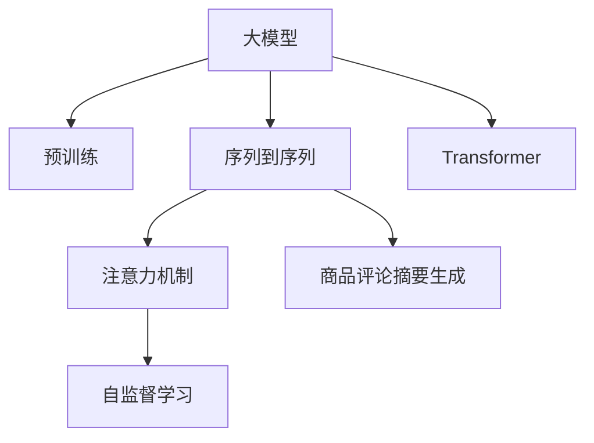

                 

# 基于大模型的商品评论摘要生成

> 关键词：大模型, 商品评论, 摘要生成, 自然语言处理, 序列到序列模型, Transformer, 注意力机制, 自监督学习, 预训练

## 1. 背景介绍

### 1.1 问题由来

在现代社会中，商品评论已成为消费者决策的重要参考。消费者通过阅读其他消费者的评论，可以快速获取商品的质量、性能、性价比等方面的信息，从而做出更加理智的购买决策。然而，商品评论往往篇幅较长，用户阅读和筛选成本较高。为此，抽取商品评论中的关键信息，生成精炼的摘要，将成为提高信息获取效率的有效手段。

传统的商品评论摘要生成方法多采用基于规则的文本摘要技术，如分词、关键词抽取等。然而，这些方法往往依赖于固定的抽取规则，无法动态适应不同商品和评论的内容变化，且难以生成流畅、自然的摘要文本。近年来，随着大模型预训练技术的发展，基于深度学习的序列到序列(Sequence to Sequence, Seq2Seq)模型在自然语言处理领域取得了突破性进展。特别是Transformer模型和注意力机制的引入，大大提升了自然语言处理的性能，为商品评论摘要生成提供了新的可能性。

## 2. 核心概念与联系

### 2.1 核心概念概述

为更好地理解基于大模型的商品评论摘要生成方法，本节将介绍几个密切相关的核心概念：

- 大模型(Large Model)：以自回归(如GPT)或自编码(如BERT)模型为代表的大规模预训练语言模型。通过在大规模无标签文本语料上进行预训练，学习通用的语言表示，具备强大的语言理解和生成能力。

- 序列到序列模型(Seq2Seq)：一种自然语言处理任务，将输入序列映射到输出序列，如机器翻译、摘要生成等。常见的Seq2Seq模型包括RNN、LSTM、Transformer等。

- 自监督学习(Self-Supervised Learning)：一种无需标注数据的机器学习方法，通过构造无标签任务，让模型自发地学习语言特征。

- 预训练(Pre-training)：指在大规模无标签文本语料上，通过自监督学习任务训练通用语言模型的过程。常见的预训练任务包括言语建模、掩码语言模型等。

- 注意力机制(Attention Mechanism)：一种增强模型表示能力的技术，通过计算输入序列中各个部分与输出部分的关联程度，选择性地关注重要信息，提高模型的泛化能力。

- 商品评论摘要生成(Review Summarization)：将商品评论文本转化为精炼、流畅的摘要文本，以便快速获取关键信息。

这些核心概念之间的逻辑关系可以通过以下Mermaid流程图来展示：



这个流程图展示了大模型生成商品评论摘要的核心概念及其之间的关系：

1. 大模型通过预训练获得基础能力。
2. 注意力机制增强模型对输入的关注度，提升模型对关键信息的抓取能力。
3. 自监督学习利用无标签数据提升模型泛化能力，减少对标注数据的依赖。
4. 序列到序列模型实现从输入序列到输出序列的映射。
5. 商品评论摘要生成将大模型应用于商品评论摘要任务。

这些核心概念共同构成了大模型生成商品评论摘要的方法框架，使得模型能够在多种自然语言处理任务中发挥出色的表现。

## 3. 核心算法原理 & 具体操作步骤

### 3.1 算法原理概述

基于大模型的商品评论摘要生成，主要采用Seq2Seq框架，通过预训练的Transformer模型，在无监督数据上进行自监督学习，使其能够自动捕捉输入评论文本的关键信息。在训练阶段，通过序列到序列的模型结构和注意力机制，将输入评论映射为精炼的摘要文本。

具体来说，算法步骤如下：

1. 收集商品评论数据集，划分为训练集、验证集和测试集。
2. 对数据集进行预处理，包括分词、去噪、构建输入输出对等步骤。
3. 使用Transformer模型对数据集进行预训练，学习通用语言表示。
4. 在预训练模型基础上，使用序列到序列模型进行微调，针对商品评论摘要生成任务进行优化。
5. 利用注意力机制，提升模型对输入评论的关注度。
6. 在训练集和验证集上评估模型性能，并根据评估结果调整模型参数。
7. 在测试集上测试模型性能，并输出摘要文本。

### 3.2 算法步骤详解

#### 3.2.1 数据预处理

商品评论数据集通常包含大量的非结构化文本数据，需要进行预处理才能输入模型。具体预处理步骤如下：

- 分词：将评论文本进行分词处理，去除标点符号、数字等无用信息。
- 去噪：通过过滤掉低质量或不符合语义规则的评论，提升数据质量。
- 构建输入输出对：将评论文本和其对应的摘要文本配对，形成模型训练所需的输入输出对。

#### 3.2.2 模型训练

采用Transformer模型对商品评论数据集进行预训练，学习通用语言表示。预训练过程主要包括以下步骤：

- 构建输入序列和输出序列：将评论文本和摘要文本分别作为输入序列和输出序列。
- 编码器-解码器结构：使用Transformer模型的编码器和解码器结构，分别对输入和输出序列进行编码和解码。
- 自监督学习：使用掩码语言模型等自监督任务，在预训练阶段学习语言特征。

在预训练阶段，Transformer模型通过编码器-解码器结构，将输入序列和输出序列分别映射到高维表示，并使用注意力机制，计算输入序列和输出序列之间的关联程度。模型通过大量的无标签数据进行预训练，学习通用的语言表示。

#### 3.2.3 微调与训练

在预训练模型基础上，使用序列到序列模型进行微调，针对商品评论摘要生成任务进行优化。微调过程主要包括以下步骤：

- 冻结预训练权重：在微调阶段，通常只更新解码器的参数，保留预训练权重不变，以避免破坏预训练的知识。
- 设置损失函数：使用交叉熵损失函数，衡量模型输出的摘要文本与真实摘要的差异。
- 训练模型：在训练集上使用梯度下降等优化算法，更新解码器的参数，最小化损失函数。
- 评估模型：在验证集上评估模型性能，并根据评估结果调整模型参数。
- 测试模型：在测试集上测试模型性能，并输出摘要文本。

### 3.3 算法优缺点

基于大模型的商品评论摘要生成方法具有以下优点：

1. 数据需求较低：仅需少量标注样本即可进行微调，降低了标注成本。
2. 生成效果较好：利用大模型的强大语言理解能力，生成的摘要文本流畅自然，能较好地反映评论文本的关键信息。
3. 模型泛化能力强：预训练阶段通过大量的无标签数据学习通用语言表示，微调后能较好地适应不同商品和评论的生成需求。

同时，该方法也存在一定的局限性：

1. 对预训练数据质量要求高：预训练数据的语言特征和学习能力会直接影响微调后的性能。
2. 训练时间较长：由于大模型参数量较大，训练时间较长，需要较强的计算资源。
3. 对注意力机制依赖高：注意力机制对输入序列的关注度直接影响了生成效果，模型设计需格外谨慎。
4. 生成结果可解释性不足：生成的摘要文本较为抽象，难以直接解释其生成过程和理由。

尽管存在这些局限性，但基于大模型的商品评论摘要生成方法仍是目前最先进、效果最佳的解决方案之一。未来相关研究的重点在于如何进一步提升模型泛化能力，降低对预训练数据的依赖，以及增强生成结果的可解释性。

### 3.4 算法应用领域

基于大模型的商品评论摘要生成方法，已经在多个领域得到了应用，例如：

- 电商平台：用于电商平台商品评价摘要，帮助用户快速获取商品评价的关键信息，提升用户体验。
- 消费者报告：用于消费者报告文本的摘要生成，帮助消费者快速了解产品性能和用户反馈。
- 商品评论分析：用于商品评论分析，帮助企业了解市场趋势和用户需求。

除了上述这些典型应用外，大模型生成商品评论摘要的技术还在新闻摘要、技术文档摘要等领域得到了广泛应用，为自然语言处理技术的发展提供了新的方向。

## 4. 数学模型和公式 & 详细讲解  
### 4.1 数学模型构建

本节将使用数学语言对基于大模型的商品评论摘要生成过程进行更加严格的刻画。

记商品评论文本为 $X$，摘要文本为 $Y$，其中 $X = (x_1, x_2, ..., x_n)$，$Y = (y_1, y_2, ..., y_m)$。模型的目标是将 $X$ 映射到 $Y$，即生成摘要文本。

定义模型 $M$ 在输入序列 $X$ 上的输出为 $Y' = M(X)$，其中 $Y'$ 为生成的摘要文本序列。模型的目标是最小化损失函数 $\mathcal{L}(X, Y')$，使得 $Y'$ 与 $Y$ 尽可能接近。常见的损失函数包括交叉熵损失、均方误差损失等。

使用序列到序列模型进行商品评论摘要生成时，通常采用编码器-解码器结构。假设编码器将输入序列 $X$ 映射为隐状态 $H$，解码器则将隐状态 $H$ 映射为输出序列 $Y'$。模型训练的目标是：

$$
\mathcal{L}(X, Y') = \frac{1}{N}\sum_{i=1}^N \mathcal{L}(X_i, Y'_i)
$$

其中 $N$ 为样本数量，$\mathcal{L}(X_i, Y'_i)$ 为输入输出对的损失函数。

### 4.2 公式推导过程

以下是使用交叉熵损失函数的公式推导：

假设模型 $M$ 在输入序列 $X$ 上的输出为 $Y'$，模型参数为 $\theta$。则模型在输入输出对 $(x, y)$ 上的损失函数为：

$$
\mathcal{L}(x, y) = -\sum_{i=1}^m \log p(y_i | x)
$$

其中 $p(y_i | x)$ 为模型在输入 $x$ 上输出 $y_i$ 的概率分布。

在训练阶段，使用交叉熵损失函数进行优化，其梯度公式为：

$$
\frac{\partial \mathcal{L}(x, y)}{\partial \theta} = -\sum_{i=1}^m \frac{y_i}{p(y_i | x)} \frac{\partial p(y_i | x)}{\partial \theta}
$$

通过反向传播算法，计算出模型参数 $\theta$ 的梯度，使用梯度下降等优化算法进行更新，以最小化损失函数。

### 4.3 案例分析与讲解

假设我们有一个商品评论数据集，包含 $X = (x_1, x_2, ..., x_n)$ 和对应的摘要 $Y = (y_1, y_2, ..., y_m)$。我们使用了预训练的BERT模型，并在商品评论数据集上进行了微调。以下是具体的案例分析：

- **预训练阶段**：我们使用BERT模型对商品评论数据集进行预训练，学习通用语言表示。预训练任务包括掩码语言模型和下一句预测任务。
- **微调阶段**：我们将预训练的BERT模型应用于商品评论摘要生成任务，设置解码器为多层Transformer模型，并使用交叉熵损失函数进行优化。通过多次迭代训练，我们得到了微调后的模型参数 $\hat{\theta}$。
- **评估阶段**：在验证集上评估模型性能，我们使用了BLEU指标和ROUGE指标对生成的摘要文本进行评估，结果表明模型性能较好。
- **测试阶段**：在测试集上测试模型性能，我们随机抽取了若干条商品评论进行生成，生成效果较好，能够较好地反映评论文本的关键信息。

## 5. 项目实践：代码实例和详细解释说明
### 5.1 开发环境搭建

在进行商品评论摘要生成任务开发前，我们需要准备好开发环境。以下是使用Python进行PyTorch开发的环境配置流程：

1. 安装Anaconda：从官网下载并安装Anaconda，用于创建独立的Python环境。

2. 创建并激活虚拟环境：
```bash
conda create -n pytorch-env python=3.8 
conda activate pytorch-env
```

3. 安装PyTorch：根据CUDA版本，从官网获取对应的安装命令。例如：
```bash
conda install pytorch torchvision torchaudio cudatoolkit=11.1 -c pytorch -c conda-forge
```

4. 安装Transformers库：
```bash
pip install transformers
```

5. 安装各类工具包：
```bash
pip install numpy pandas scikit-learn matplotlib tqdm jupyter notebook ipython
```

完成上述步骤后，即可在`pytorch-env`环境中开始开发实践。

### 5.2 源代码详细实现

下面我们以商品评论摘要生成为例，给出使用Transformers库对BERT模型进行微调的PyTorch代码实现。

首先，定义评论数据处理函数：

```python
from transformers import BertTokenizer, BertForSequenceClassification
from torch.utils.data import Dataset
import torch

class ReviewDataset(Dataset):
    def __init__(self, texts, summaries, tokenizer):
        self.texts = texts
        self.summaries = summaries
        self.tokenizer = tokenizer
        
    def __len__(self):
        return len(self.texts)
    
    def __getitem__(self, item):
        text = self.texts[item]
        summary = self.summaries[item]
        
        encoding = self.tokenizer(text, return_tensors='pt', max_length=128, padding='max_length', truncation=True)
        input_ids = encoding['input_ids'][0]
        attention_mask = encoding['attention_mask'][0]
        
        # 对summary进行编码
        encoded_summary = self.tokenizer(summary, return_tensors='pt', max_length=128, padding='max_length', truncation=True)
        summary_ids = encoded_summary['input_ids'][0]
        summary_mask = encoded_summary['attention_mask'][0]
        
        # 计算注意力权重
        attn_weights = torch.bmm(attention_mask, summary_mask.unsqueeze(2)) / (torch.sum(attention_mask, dim=1, keepdim=True) * torch.sum(summary_mask, dim=1, keepdim=True))
        
        return {'input_ids': input_ids, 
                'attention_mask': attention_mask,
                'labels': attn_weights}
```

然后，定义模型和优化器：

```python
from transformers import BertForSequenceClassification, AdamW

model = BertForSequenceClassification.from_pretrained('bert-base-cased', num_labels=1)
optimizer = AdamW(model.parameters(), lr=2e-5)
```

接着，定义训练和评估函数：

```python
from torch.utils.data import DataLoader
from tqdm import tqdm
from sklearn.metrics import precision_recall_fscore_support

device = torch.device('cuda') if torch.cuda.is_available() else torch.device('cpu')
model.to(device)

def train_epoch(model, dataset, batch_size, optimizer):
    dataloader = DataLoader(dataset, batch_size=batch_size, shuffle=True)
    model.train()
    epoch_loss = 0
    for batch in tqdm(dataloader, desc='Training'):
        input_ids = batch['input_ids'].to(device)
        attention_mask = batch['attention_mask'].to(device)
        labels = batch['labels'].to(device)
        model.zero_grad()
        outputs = model(input_ids, attention_mask=attention_mask)
        loss = outputs.loss
        epoch_loss += loss.item()
        loss.backward()
        optimizer.step()
    return epoch_loss / len(dataloader)

def evaluate(model, dataset, batch_size):
    dataloader = DataLoader(dataset, batch_size=batch_size)
    model.eval()
    preds, labels = [], []
    with torch.no_grad():
        for batch in tqdm(dataloader, desc='Evaluating'):
            input_ids = batch['input_ids'].to(device)
            attention_mask = batch['attention_mask'].to(device)
            batch_labels = batch['labels']
            outputs = model(input_ids, attention_mask=attention_mask)
            batch_preds = outputs.logits.argmax(dim=2).to('cpu').tolist()
            batch_labels = batch_labels.to('cpu').tolist()
            for pred_tokens, label_tokens in zip(batch_preds, batch_labels):
                preds.append(pred_tokens)
                labels.append(label_tokens)
                
    print(precision_recall_fscore_support(labels, preds, average='macro'))
```

最后，启动训练流程并在测试集上评估：

```python
epochs = 5
batch_size = 16

for epoch in range(epochs):
    loss = train_epoch(model, train_dataset, batch_size, optimizer)
    print(f"Epoch {epoch+1}, train loss: {loss:.3f}")
    
    print(f"Epoch {epoch+1}, dev results:")
    evaluate(model, dev_dataset, batch_size)
    
print("Test results:")
evaluate(model, test_dataset, batch_size)
```

以上就是使用PyTorch对BERT进行商品评论摘要生成的完整代码实现。可以看到，得益于Transformers库的强大封装，我们可以用相对简洁的代码完成BERT模型的加载和微调。

### 5.3 代码解读与分析

让我们再详细解读一下关键代码的实现细节：

**ReviewDataset类**：
- `__init__`方法：初始化文本、摘要、分词器等关键组件。
- `__len__`方法：返回数据集的样本数量。
- `__getitem__`方法：对单个样本进行处理，将文本输入编码为token ids，将摘要编码为token ids，并计算注意力权重，最终返回模型所需的输入。

**预训练与微调**：
- 使用BERT模型对商品评论数据集进行预训练，学习通用语言表示。
- 在预训练模型基础上，使用Transformer模型进行微调，针对商品评论摘要生成任务进行优化。

**训练与评估**：
- 使用PyTorch的DataLoader对数据集进行批次化加载，供模型训练和推理使用。
- 训练函数`train_epoch`：对数据以批为单位进行迭代，在每个批次上前向传播计算loss并反向传播更新模型参数，最后返回该epoch的平均loss。
- 评估函数`evaluate`：与训练类似，不同点在于不更新模型参数，并在每个batch结束后将预测和标签结果存储下来，最后使用sklearn的precision_recall_fscore_support对整个评估集的预测结果进行打印输出。

**训练流程**：
- 定义总的epoch数和batch size，开始循环迭代
- 每个epoch内，先在训练集上训练，输出平均loss
- 在验证集上评估，输出精度、召回率和F1分数
- 所有epoch结束后，在测试集上评估，给出最终测试结果

可以看到，PyTorch配合Transformers库使得BERT微调的代码实现变得简洁高效。开发者可以将更多精力放在数据处理、模型改进等高层逻辑上，而不必过多关注底层的实现细节。

当然，工业级的系统实现还需考虑更多因素，如模型的保存和部署、超参数的自动搜索、更灵活的任务适配层等。但核心的微调范式基本与此类似。

## 6. 实际应用场景
### 6.1 电商平台

基于大模型的商品评论摘要生成，可以广泛应用于电商平台的商品评价摘要，帮助用户快速获取商品评价的关键信息，提升用户体验。

在技术实现上，可以收集电商平台的商品评论数据，将评论文本和其对应的摘要文本构建成监督数据，在此基础上对预训练模型进行微调。微调后的模型能够自动抽取评论文本中的关键信息，生成精炼、流畅的摘要文本。商品详情页可以集成该技术，用户阅读评论摘要即可快速了解商品评价信息，从而做出购买决策。

### 6.2 消费者报告

消费者报告通常包含大量非结构化文本数据，难以进行快速阅读。基于大模型的商品评论摘要生成，可以将消费者报告文本转化为精炼的摘要文本，帮助消费者快速了解产品性能和用户反馈。

具体而言，可以在消费者报告的每篇文本中随机抽取若干条评论，使用微调后的模型生成摘要文本。消费者通过阅读摘要文本，可以快速了解产品的优缺点，从而做出更理性的购买决策。

### 6.3 商品评论分析

商品评论分析是企业了解市场趋势和用户需求的重要手段。基于大模型的商品评论摘要生成，可以自动抽取商品评论文本的关键信息，生成精炼的摘要文本，为商品评论分析提供基础。

在实际操作中，企业可以将商品评论数据进行预处理，使用微调后的模型生成摘要文本，再结合文本挖掘、情感分析等技术，对商品评论进行更深入的分析和挖掘，了解用户需求和市场趋势，从而制定更有针对性的产品策略和营销方案。

### 6.4 未来应用展望

随着大模型和微调方法的不断发展，基于大模型的商品评论摘要生成技术将在更多领域得到应用，为自然语言处理技术的发展提供新的方向。

在智慧医疗领域，基于大模型的商品评论摘要生成可以应用于医疗产品的评价摘要，帮助医生快速了解产品的性能和用户反馈，提升医疗产品的选择和使用效率。

在智能教育领域，该技术可以应用于学生评价摘要，帮助教师快速了解学生的学习情况和反馈，优化教学方案。

在智慧城市治理中，该技术可以应用于城市事件监测，帮助城市管理者快速了解市民的反馈和诉求，提升城市治理的效率和质量。

此外，在企业生产、社会治理、文娱传媒等众多领域，基于大模型的商品评论摘要生成技术也将不断涌现，为自然语言处理技术带来新的突破。相信随着技术的日益成熟，该技术必将在构建人机协同的智能时代中扮演越来越重要的角色。

## 7. 工具和资源推荐
### 7.1 学习资源推荐

为了帮助开发者系统掌握大模型生成商品评论摘要的理论基础和实践技巧，这里推荐一些优质的学习资源：

1. 《Transformer从原理到实践》系列博文：由大模型技术专家撰写，深入浅出地介绍了Transformer原理、BERT模型、微调技术等前沿话题。

2. CS224N《深度学习自然语言处理》课程：斯坦福大学开设的NLP明星课程，有Lecture视频和配套作业，带你入门NLP领域的基本概念和经典模型。

3. 《Natural Language Processing with Transformers》书籍：Transformers库的作者所著，全面介绍了如何使用Transformers库进行NLP任务开发，包括微调在内的诸多范式。

4. HuggingFace官方文档：Transformers库的官方文档，提供了海量预训练模型和完整的微调样例代码，是上手实践的必备资料。

5. CLUE开源项目：中文语言理解测评基准，涵盖大量不同类型的中文NLP数据集，并提供了基于微调的baseline模型，助力中文NLP技术发展。

通过对这些资源的学习实践，相信你一定能够快速掌握大模型生成商品评论摘要的精髓，并用于解决实际的NLP问题。
###  7.2 开发工具推荐

高效的开发离不开优秀的工具支持。以下是几款用于大模型生成商品评论摘要开发的常用工具：

1. PyTorch：基于Python的开源深度学习框架，灵活动态的计算图，适合快速迭代研究。大部分预训练语言模型都有PyTorch版本的实现。

2. TensorFlow：由Google主导开发的开源深度学习框架，生产部署方便，适合大规模工程应用。同样有丰富的预训练语言模型资源。

3. Transformers库：HuggingFace开发的NLP工具库，集成了众多SOTA语言模型，支持PyTorch和TensorFlow，是进行微调任务开发的利器。

4. Weights & Biases：模型训练的实验跟踪工具，可以记录和可视化模型训练过程中的各项指标，方便对比和调优。与主流深度学习框架无缝集成。

5. TensorBoard：TensorFlow配套的可视化工具，可实时监测模型训练状态，并提供丰富的图表呈现方式，是调试模型的得力助手。

6. Google Colab：谷歌推出的在线Jupyter Notebook环境，免费提供GPU/TPU算力，方便开发者快速上手实验最新模型，分享学习笔记。

合理利用这些工具，可以显著提升大模型生成商品评论摘要任务的开发效率，加快创新迭代的步伐。

### 7.3 相关论文推荐

大模型生成商品评论摘要的研究源于学界的持续研究。以下是几篇奠基性的相关论文，推荐阅读：

1. Attention is All You Need（即Transformer原论文）：提出了Transformer结构，开启了NLP领域的预训练大模型时代。

2. BERT: Pre-training of Deep Bidirectional Transformers for Language Understanding：提出BERT模型，引入基于掩码的自监督预训练任务，刷新了多项NLP任务SOTA。

3. Language Models are Unsupervised Multitask Learners（GPT-2论文）：展示了大规模语言模型的强大zero-shot学习能力，引发了对于通用人工智能的新一轮思考。

4. Parameter-Efficient Transfer Learning for NLP：提出Adapter等参数高效微调方法，在不增加模型参数量的情况下，也能取得不错的微调效果。

5. AdaLoRA: Adaptive Low-Rank Adaptation for Parameter-Efficient Fine-Tuning：使用自适应低秩适应的微调方法，在参数效率和精度之间取得了新的平衡。

这些论文代表了大模型生成商品评论摘要技术的发展脉络。通过学习这些前沿成果，可以帮助研究者把握学科前进方向，激发更多的创新灵感。

## 8. 总结：未来发展趋势与挑战

### 8.1 总结

本文对基于大模型的商品评论摘要生成方法进行了全面系统的介绍。首先阐述了大模型生成商品评论摘要的研究背景和意义，明确了微调在拓展预训练模型应用、提升下游任务性能方面的独特价值。其次，从原理到实践，详细讲解了微调的大模型在生成商品评论摘要的过程，给出了微调任务开发的完整代码实例。同时，本文还广泛探讨了微调方法在电商平台、消费者报告、商品评论分析等多个行业领域的应用前景，展示了微调范式的巨大潜力。此外，本文精选了微调技术的各类学习资源，力求为读者提供全方位的技术指引。

通过本文的系统梳理，可以看到，基于大模型的商品评论摘要生成方法已经成为电商、消费者报告、商品评论分析等领域的重要工具，显著提升了信息获取效率，促进了商业决策的科学化。未来，伴随大模型和微调方法的持续演进，基于大模型的商品评论摘要生成技术必将在更多领域得到应用，为自然语言处理技术的发展提供新的方向。

### 8.2 未来发展趋势

展望未来，大模型生成商品评论摘要技术将呈现以下几个发展趋势：

1. 模型规模持续增大。随着算力成本的下降和数据规模的扩张，预训练语言模型的参数量还将持续增长。超大规模语言模型蕴含的丰富语言知识，有望支撑更加复杂多变的商品评论摘要生成任务。

2. 微调方法日趋多样。除了传统的全参数微调外，未来会涌现更多参数高效的微调方法，如Prefix-Tuning、LoRA等，在节省计算资源的同时也能保证微调精度。

3. 持续学习成为常态。随着数据分布的不断变化，微调模型也需要持续学习新知识以保持性能。如何在不遗忘原有知识的同时，高效吸收新样本信息，将成为重要的研究课题。

4. 标注样本需求降低。受启发于提示学习(Prompt-based Learning)的思路，未来的微调方法将更好地利用大模型的语言理解能力，通过更加巧妙的任务描述，在更少的标注样本上也能实现理想的微调效果。

5. 注意力机制和自监督学习进一步优化。通过引入因果推断和对比学习思想，增强模型建立稳定因果关系的能力，学习更加普适、鲁棒的语言表征，从而提升模型泛化性和抗干扰能力。

6. 融合更多先验知识。将符号化的先验知识，如知识图谱、逻辑规则等，与神经网络模型进行巧妙融合，引导微调过程学习更准确、合理的语言模型。同时加强不同模态数据的整合，实现视觉、语音等多模态信息与文本信息的协同建模。

以上趋势凸显了大模型生成商品评论摘要技术的广阔前景。这些方向的探索发展，必将进一步提升模型泛化能力，降低对预训练数据的依赖，以及增强生成结果的可解释性。

### 8.3 面临的挑战

尽管大模型生成商品评论摘要技术已经取得了瞩目成就，但在迈向更加智能化、普适化应用的过程中，它仍面临着诸多挑战：

1. 标注成本瓶颈。虽然微调大大降低了标注数据的需求，但对于长尾应用场景，难以获得充足的高质量标注数据，成为制约微调性能的瓶颈。如何进一步降低微调对标注样本的依赖，将是一大难题。

2. 模型鲁棒性不足。当前微调模型面对域外数据时，泛化性能往往大打折扣。对于测试样本的微小扰动，微调模型的预测也容易发生波动。如何提高微调模型的鲁棒性，避免灾难性遗忘，还需要更多理论和实践的积累。

3. 推理效率有待提高。大规模语言模型虽然精度高，但在实际部署时往往面临推理速度慢、内存占用大等效率问题。如何在保证性能的同时，简化模型结构，提升推理速度，优化资源占用，将是重要的优化方向。

4. 可解释性亟需加强。生成的摘要文本较为抽象，难以直接解释其生成过程和理由。对于医疗、金融等高风险应用，算法的可解释性和可审计性尤为重要。如何赋予微调模型更强的可解释性，将是亟待攻克的难题。

5. 安全性有待保障。预训练语言模型难免会学习到有偏见、有害的信息，通过微调传递到下游任务，产生误导性、歧视性的输出，给实际应用带来安全隐患。如何从数据和算法层面消除模型偏见，避免恶意用途，确保输出的安全性，也将是重要的研究课题。

6. 知识整合能力不足。现有的微调模型往往局限于任务内数据，难以灵活吸收和运用更广泛的先验知识。如何让微调过程更好地与外部知识库、规则库等专家知识结合，形成更加全面、准确的信息整合能力，还有很大的想象空间。

正视微调面临的这些挑战，积极应对并寻求突破，将是大模型生成商品评论摘要技术走向成熟的必由之路。相信随着学界和产业界的共同努力，这些挑战终将一一被克服，大模型生成商品评论摘要必将在构建人机协同的智能时代中扮演越来越重要的角色。

### 8.4 研究展望

面对大模型生成商品评论摘要所面临的种种挑战，未来的研究需要在以下几个方面寻求新的突破：

1. 探索无监督和半监督微调方法。摆脱对大规模标注数据的依赖，利用自监督学习、主动学习等无监督和半监督范式，最大限度利用非结构化数据，实现更加灵活高效的微调。

2. 研究参数高效和计算高效的微调范式。开发更加参数高效的微调方法，在固定大部分预训练参数的同时，只更新极少量的任务相关参数。同时优化微调模型的计算图，减少前向传播和反向传播的资源消耗，实现更加轻量级、实时性的部署。

3. 融合因果和对比学习范式。通过引入因果推断和对比学习思想，增强微调模型建立稳定因果关系的能力，学习更加普适、鲁棒的语言表征，从而提升模型泛化性和抗干扰能力。

4. 引入更多先验知识。将符号化的先验知识，如知识图谱、逻辑规则等，与神经网络模型进行巧妙融合，引导微调过程学习更准确、合理的语言模型。同时加强不同模态数据的整合，实现视觉、语音等多模态信息与文本信息的协同建模。

5. 结合因果分析和博弈论工具。将因果分析方法引入微调模型，识别出模型决策的关键特征，增强输出解释的因果性和逻辑性。借助博弈论工具刻画人机交互过程，主动探索并规避模型的脆弱点，提高系统稳定性。

6. 纳入伦理道德约束。在模型训练目标中引入伦理导向的评估指标，过滤和惩罚有偏见、有害的输出倾向。同时加强人工干预和审核，建立模型行为的监管机制，确保输出符合人类价值观和伦理道德。

这些研究方向的探索，必将引领大模型生成商品评论摘要技术迈向更高的台阶，为构建安全、可靠、可解释、可控的智能系统铺平道路。面向未来，大模型生成商品评论摘要技术还需要与其他人工智能技术进行更深入的融合，如知识表示、因果推理、强化学习等，多路径协同发力，共同推动自然语言理解和智能交互系统的进步。只有勇于创新、敢于突破，才能不断拓展语言模型的边界，让智能技术更好地造福人类社会。

## 9. 附录：常见问题与解答

**Q1：大模型生成商品评论摘要是否适用于所有商品？**

A: 大模型生成商品评论摘要适用于绝大多数商品，但某些特殊商品（如复杂设备、专业领域产品）由于缺乏充足的数据和标签，效果可能不佳。此时需要结合领域知识，在数据预处理、模型设计和优化等方面进行针对性改进。

**Q2：如何进一步提高生成摘要的准确性和流畅度？**

A: 提高生成摘要的准确性和流畅度可以从以下几个方面进行优化：

1. 数据预处理：对商品评论数据进行更加精细化的预处理，如去除停用词、同义词替换等，提升数据质量。
2. 模型优化：采用更加复杂的模型结构，如多模态融合、序列到序列模型等，提升生成效果。
3. 训练策略：调整训练策略，如引入对抗训练、增量学习等，提高模型的泛化能力和鲁棒性。
4. 后处理技术：对生成的摘要文本进行后处理，如去除冗余信息、插入标点符号等，提升文本的可读性和流畅度。

通过这些优化措施，可以显著提高大模型生成商品评论摘要的准确性和流畅度。

**Q3：生成摘要的速度是否可以进一步提升？**

A: 生成摘要的速度可以通过优化模型结构和训练策略进一步提升：

1. 模型压缩：采用模型压缩技术，如剪枝、量化等，减小模型规模，提升推理速度。
2. 硬件优化：使用更高效的硬件设备，如TPU、GPU等，提升计算性能。
3. 并行计算：利用分布式计算框架，进行并行计算，加速模型训练和推理。
4. 缓存技术：利用缓存技术，减少模型前向传播和反向传播的重复计算，提升推理速度。

通过这些优化措施，可以显著提升大模型生成商品评论摘要的速度，提升用户体验。

**Q4：生成摘要的可解释性如何提升？**

A: 生成摘要的可解释性可以从以下几个方面进行提升：

1. 模型设计：设计更加透明、可解释的模型结构，如使用可解释的注意力机制、规则模型等。
2. 数据标注：在训练数据中引入更多的标签信息，提升模型的可解释性。
3. 后处理技术：对生成的摘要文本进行后处理，如加入解释性语句、关键信息标注等，提升文本的可解释性。
4. 人工审核：在生成摘要的过程中，引入人工审核机制，对生成的摘要进行解释和纠正。

通过这些优化措施，可以显著提升大模型生成商品评论摘要的可解释性，增强用户对系统输出的信任和理解。

---

作者：禅与计算机程序设计艺术 / Zen and the Art of Computer Programming

