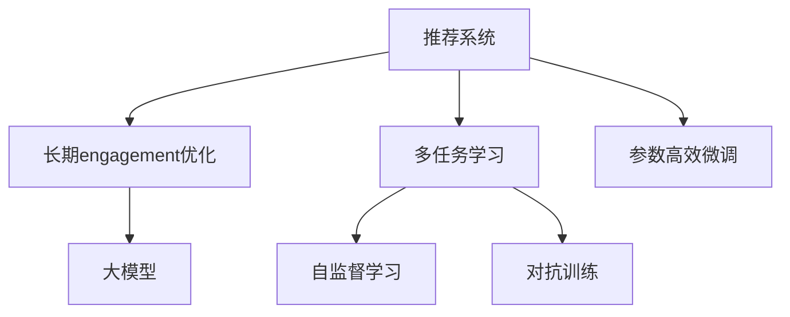

                 

# 基于大模型的推荐系统长期engagement优化

在数字化时代，推荐系统已经成为人们获取信息、商品和服务的主要方式之一。然而，尽管现有的推荐系统在短期的点击率、转化率等指标上表现优异，但对用户的长期engagement和忠诚度，却存在显著不足。这一问题在电商、视频、社交等垂直领域尤为突出，直接影响用户粘性和企业收益。

为解决这一挑战，本文将探讨基于大模型的推荐系统如何通过优化用户engagement，实现长期价值提升。

## 1. 背景介绍

### 1.1 问题由来

随着互联网和移动设备的普及，推荐系统在电商、视频、社交等垂直领域广泛应用。推荐系统通过分析用户的历史行为数据，预测其未来需求，为其推荐可能感兴趣的物品，提升用户满意度和平台收入。然而，现有的推荐系统往往只关注短期指标，如点击率(CTR)、转化率(CTR)、观看时长等，对用户的长期engagement和忠诚度关注不足。长期engagement（Length of Engagement, LOE），即用户在特定服务上的持续时间和互动频率，是衡量用户忠诚度和满意度的重要指标，对企业长期收益至关重要。

用户长期engagement的提升，不仅需要推荐系统在短时间内给出高相关性物品，更需要帮助用户建立稳定的使用习惯，形成持续的用户关系。如何通过推荐系统优化用户长期engagement，提升用户忠诚度，已成为学术界和产业界亟待解决的问题。

### 1.2 问题核心关键点

提升推荐系统长期engagement的核心在于，如何利用大模型学到的深层次用户行为模式，预测用户的长期行为倾向，并针对性地推荐内容，以实现用户的长期粘性和持续互动。

1. **用户行为建模**：通过分析用户的行为数据，捕捉其兴趣变化和行为特征，建立长期engagement的预测模型。
2. **用户行为预测**：利用预测模型预测用户的未来行为，分析其长期engagement趋势。
3. **内容推荐优化**：根据用户行为预测结果，推荐符合其长期行为倾向的内容，提升用户粘性。
4. **系统长期反馈**：收集用户的长期互动数据，进一步优化预测模型和推荐策略。

## 2. 核心概念与联系

### 2.1 核心概念概述

为更好地理解基于大模型的推荐系统如何优化长期engagement，本节将介绍几个密切相关的核心概念：

- **推荐系统(Recommender System)**：利用用户行为数据，为每个用户推荐可能感兴趣的商品、内容、服务等。推荐系统分为基于内容的推荐、协同过滤推荐、混合推荐等不同类型。
- **长期engagement(Length of Engagement, LOE)**：用户在特定服务上的持续时间和互动频率，是衡量用户忠诚度和满意度的重要指标。
- **大模型(Large Model)**：以Transformer等架构为代表的大规模预训练语言模型，具备强大的语言理解和生成能力，常用于自然语言处理(NLP)任务。
- **多任务学习(Multi-task Learning, MTL)**：在单一模型上学习多个相关任务，提升模型的泛化能力和性能，常见于迁移学习、多模态学习等场景。
- **参数高效微调(Parameter-Efficient Fine-Tuning, PEFT)**：在微调过程中，只更新少量的模型参数，而固定大部分预训练权重不变，以提高微调效率和模型鲁棒性。
- **自监督学习(Self-Supervised Learning, SSL)**：利用数据中的自然信号（如掩码语言模型、自回归模型等）进行无监督学习，增强模型的泛化能力和学习效率。
- **对抗训练(Adversarial Training, AT)**：通过引入对抗样本，提升模型的鲁棒性和泛化能力，减少过拟合风险。

这些核心概念之间的逻辑关系可以通过以下Mermaid流程图来展示：



这个流程图展示了大模型推荐系统优化长期engagement的核心概念及其之间的关系：

1. 推荐系统通过多任务学习、自监督学习、参数高效微调等技术，提高模型的泛化能力和学习效率。
2. 大模型学习到丰富的语言和行为知识，通过多任务学习进一步增强其对用户的长期行为理解。
3. 自监督学习和对抗训练增强模型的鲁棒性和泛化能力，减少过拟合风险。
4. 参数高效微调确保模型在保持预训练权重稳定的同时，能够灵活适应新任务。

## 3. 核心算法原理 & 具体操作步骤

### 3.1 算法原理概述

基于大模型的推荐系统优化长期engagement，本质上是一个多任务学习过程。其核心思想是：通过学习多个相关任务，提升模型的泛化能力和性能，进而预测用户的长期行为倾向，并针对性地推荐内容，以实现用户的长期粘性和持续互动。

形式化地，假设推荐系统涉及的任务包括：商品推荐、内容推荐、个性化推荐等。每个任务的目标函数为：

$$
\mathcal{L}_i = \mathbb{E}_{(x,y) \sim \mathcal{D}_i} [\ell_i(M(x),y)]
$$

其中 $M$ 为推荐模型，$(x,y)$ 为样本，$\ell_i$ 为任务 $i$ 的损失函数。基于大模型的推荐系统优化长期engagement的目标函数为：

$$
\mathcal{L} = \mathcal{L}_1 + \mathcal{L}_2 + \ldots + \mathcal{L}_n
$$

其中 $n$ 为推荐系统的任务数，$M$ 为优化后的推荐模型。

通过多任务学习，模型能够在不同任务间共享特征，提升泛化能力和鲁棒性，进而准确预测用户的长期行为倾向，实现长期engagement的优化。

### 3.2 算法步骤详解

基于大模型的推荐系统优化长期engagement一般包括以下几个关键步骤：

**Step 1: 准备数据集和预训练模型**
- 收集推荐系统的多个任务的数据集，包括商品推荐数据、内容推荐数据、个性化推荐数据等。
- 选择合适的预训练语言模型 $M_0$，如BERT、GPT等，作为初始化参数。

**Step 2: 定义任务适配层**
- 根据不同任务，设计合适的输出层和损失函数。例如，商品推荐任务可以设计为分类任务，内容推荐任务可以设计为回归任务，个性化推荐任务可以设计为排序任务。
- 在预训练模型的顶层添加相应的任务适配层，如线性分类器、回归器、排序器等。

**Step 3: 设置多任务学习超参数**
- 选择合适的优化算法及其参数，如AdamW、SGD等，设置学习率、批大小、迭代轮数等。
- 设置任务之间的权重，平衡不同任务对总损失的贡献。
- 设置正则化技术及强度，包括权重衰减、Dropout、Early Stopping等。

**Step 4: 执行多任务学习训练**
- 将训练集数据分批次输入模型，前向传播计算损失函数。
- 反向传播计算参数梯度，根据设定的优化算法和学习率更新模型参数。
- 周期性在验证集上评估模型性能，根据性能指标决定是否触发 Early Stopping。
- 重复上述步骤直到满足预设的迭代轮数或 Early Stopping 条件。

**Step 5: 长期engagement预测和推荐**
- 在测试集上使用优化后的推荐模型 $M$ 进行长期engagement预测，如通过回归模型预测用户的观看时长、点击次数等指标。
- 根据预测结果，推荐符合用户长期行为倾向的内容或商品，提升用户的长期engagement。
- 收集用户的长期互动数据，进一步优化预测模型和推荐策略。

以上是基于大模型的推荐系统优化长期engagement的一般流程。在实际应用中，还需要针对具体任务的特点，对多任务学习过程的各个环节进行优化设计，如改进训练目标函数，引入更多的正则化技术，搜索最优的超参数组合等，以进一步提升模型性能。

### 3.3 算法优缺点

基于大模型的推荐系统优化长期engagement具有以下优点：
1. 泛化能力强。通过学习多个相关任务，模型能够更好地泛化到新的任务和数据，提升长期engagement的预测精度。
2. 模型鲁棒性高。自监督学习和对抗训练使得模型对噪声和对抗样本具有较强的鲁棒性，提升模型在实际应用中的稳定性。
3. 参数高效。通过参数高效微调技术，模型在固定大部分预训练参数的情况下，仍能取得不错的优化效果，减少计算资源消耗。
4. 推荐效果佳。多任务学习使得模型能够更好地理解用户的多样化需求，提升推荐效果和用户满意度。

同时，该方法也存在一定的局限性：
1. 数据依赖度高。多任务学习需要大量的标注数据，获取高质量标注数据的成本较高。
2. 任务之间存在耦合。不同任务之间存在数据共享和特征耦合，优化过程中需要进行合理平衡。
3. 模型复杂度高。大规模预训练模型的计算和存储资源消耗较大，需要高性能计算设备和存储设备。

尽管存在这些局限性，但就目前而言，基于大模型的推荐系统多任务学习方法是推荐系统长期engagement优化的主流范式。未来相关研究的重点在于如何进一步降低多任务学习对标注数据的依赖，提高模型的跨领域迁移能力，同时兼顾可解释性和伦理安全性等因素。

### 3.4 算法应用领域

基于大模型的推荐系统多任务学习方法，在电商、视频、社交等垂直领域已经得到了广泛的应用，覆盖了几乎所有常见的推荐任务，例如：

- 商品推荐：通过分析用户的购买历史和浏览行为，推荐可能感兴趣的商品。
- 内容推荐：根据用户的历史观看记录和评分数据，推荐可能感兴趣的视频、文章、图片等内容。
- 个性化推荐：基于用户的历史互动数据，提供符合其个性化需求的内容推荐。

除了上述这些经典任务外，大模型推荐系统多任务学习也被创新性地应用到更多场景中，如基于用户行为预测的长期推荐、基于用户兴趣演变的动态推荐等，为推荐系统带来了全新的突破。随着预训练模型和推荐方法的不竭演进，相信推荐系统必将在更多领域大放异彩。

## 4. 数学模型和公式 & 详细讲解

### 4.1 数学模型构建

本节将使用数学语言对基于大模型的推荐系统多任务学习过程进行更加严格的刻画。

假设推荐系统涉及的任务包括商品推荐、内容推荐、个性化推荐等，每个任务的目标函数为：

$$
\mathcal{L}_i = \mathbb{E}_{(x,y) \sim \mathcal{D}_i} [\ell_i(M(x),y)]
$$

其中 $M$ 为推荐模型，$(x,y)$ 为样本，$\ell_i$ 为任务 $i$ 的损失函数。基于大模型的推荐系统优化长期engagement的目标函数为：

$$
\mathcal{L} = \mathcal{L}_1 + \mathcal{L}_2 + \ldots + \mathcal{L}_n
$$

其中 $n$ 为推荐系统的任务数，$M$ 为优化后的推荐模型。

在多任务学习中，模型的预测输出可以通过并行计算进行优化。例如，对于商品推荐任务，输出为二分类标签；对于内容推荐任务，输出为连续数值；对于个性化推荐任务，输出为排序结果。多任务学习可以通过共享隐层的参数，提升模型的泛化能力和性能。

### 4.2 公式推导过程

以下我们以商品推荐任务为例，推导多任务学习模型的损失函数及其梯度的计算公式。

假设推荐模型 $M_{\theta}$ 在输入 $x$ 上的预测输出为 $\hat{y}=M_{\theta}(x) \in [0,1]$，表示商品推荐的概率。真实标签 $y \in \{0,1\}$。则二分类交叉熵损失函数定义为：

$$
\ell(M_{\theta}(x),y) = -[y\log \hat{y} + (1-y)\log (1-\hat{y})]
$$

将其代入目标函数，得：

$$
\mathcal{L}(\theta) = -\frac{1}{N}\sum_{i=1}^N [y_i\log M_{\theta}(x_i)+(1-y_i)\log(1-M_{\theta}(x_i))]
$$

在得到目标函数后，我们通过梯度下降等优化算法，最小化目标函数 $\mathcal{L}$，更新模型参数 $\theta$。通过链式法则，损失函数对参数 $\theta_k$ 的梯度为：

$$
\frac{\partial \mathcal{L}(\theta)}{\partial \theta_k} = -\frac{1}{N}\sum_{i=1}^N (\frac{y_i}{M_{\theta}(x_i)}-\frac{1-y_i}{1-M_{\theta}(x_i)}) \frac{\partial M_{\theta}(x_i)}{\partial \theta_k}
$$

其中 $\frac{\partial M_{\theta}(x_i)}{\partial \theta_k}$ 可进一步递归展开，利用自动微分技术完成计算。

在得到损失函数的梯度后，即可带入梯度下降算法，完成模型的迭代优化。重复上述过程直至收敛，最终得到适合多任务学习目标函数的最优模型参数 $\theta$。

## 5. 项目实践：代码实例和详细解释说明

### 5.1 开发环境搭建

在进行多任务学习实践前，我们需要准备好开发环境。以下是使用Python进行PyTorch开发的环境配置流程：

1. 安装Anaconda：从官网下载并安装Anaconda，用于创建独立的Python环境。

2. 创建并激活虚拟环境：
```bash
conda create -n pytorch-env python=3.8 
conda activate pytorch-env
```

3. 安装PyTorch：根据CUDA版本，从官网获取对应的安装命令。例如：
```bash
conda install pytorch torchvision torchaudio cudatoolkit=11.1 -c pytorch -c conda-forge
```

4. 安装Transformers库：
```bash
pip install transformers
```

5. 安装各类工具包：
```bash
pip install numpy pandas scikit-learn matplotlib tqdm jupyter notebook ipython
```

完成上述步骤后，即可在`pytorch-env`环境中开始多任务学习实践。

### 5.2 源代码详细实现

下面我们以商品推荐任务为例，给出使用Transformers库进行多任务学习训练的PyTorch代码实现。

首先，定义商品推荐任务的数据处理函数：

```python
from transformers import BertTokenizer
from torch.utils.data import Dataset
import torch

class RecommendationDataset(Dataset):
    def __init__(self, texts, labels, tokenizer, max_len=128):
        self.texts = texts
        self.labels = labels
        self.tokenizer = tokenizer
        self.max_len = max_len
        
    def __len__(self):
        return len(self.texts)
    
    def __getitem__(self, item):
        text = self.texts[item]
        label = self.labels[item]
        
        encoding = self.tokenizer(text, return_tensors='pt', max_length=self.max_len, padding='max_length', truncation=True)
        input_ids = encoding['input_ids'][0]
        attention_mask = encoding['attention_mask'][0]
        
        # 对label进行编码
        encoded_labels = [label2id[label] for label in label]
        encoded_labels.extend([label2id['O']] * (self.max_len - len(encoded_labels)))
        labels = torch.tensor(encoded_labels, dtype=torch.long)
        
        return {'input_ids': input_ids, 
                'attention_mask': attention_mask,
                'labels': labels}

# 标签与id的映射
label2id = {'O': 0, 'buy': 1}
id2label = {v: k for k, v in label2id.items()}

# 创建dataset
tokenizer = BertTokenizer.from_pretrained('bert-base-cased')

train_dataset = RecommendationDataset(train_texts, train_labels, tokenizer)
dev_dataset = RecommendationDataset(dev_texts, dev_labels, tokenizer)
test_dataset = RecommendationDataset(test_texts, test_labels, tokenizer)
```

然后，定义模型和优化器：

```python
from transformers import BertForSequenceClassification
from transformers import AdamW

model = BertForSequenceClassification.from_pretrained('bert-base-cased', num_labels=len(label2id))

optimizer = AdamW(model.parameters(), lr=2e-5)
```

接着，定义训练和评估函数：

```python
from torch.utils.data import DataLoader
from tqdm import tqdm
from sklearn.metrics import classification_report

device = torch.device('cuda') if torch.cuda.is_available() else torch.device('cpu')
model.to(device)

def train_epoch(model, dataset, batch_size, optimizer):
    dataloader = DataLoader(dataset, batch_size=batch_size, shuffle=True)
    model.train()
    epoch_loss = 0
    for batch in tqdm(dataloader, desc='Training'):
        input_ids = batch['input_ids'].to(device)
        attention_mask = batch['attention_mask'].to(device)
        labels = batch['labels'].to(device)
        model.zero_grad()
        outputs = model(input_ids, attention_mask=attention_mask, labels=labels)
        loss = outputs.loss
        epoch_loss += loss.item()
        loss.backward()
        optimizer.step()
    return epoch_loss / len(dataloader)

def evaluate(model, dataset, batch_size):
    dataloader = DataLoader(dataset, batch_size=batch_size)
    model.eval()
    preds, labels = [], []
    with torch.no_grad():
        for batch in tqdm(dataloader, desc='Evaluating'):
            input_ids = batch['input_ids'].to(device)
            attention_mask = batch['attention_mask'].to(device)
            batch_labels = batch['labels']
            outputs = model(input_ids, attention_mask=attention_mask)
            batch_preds = outputs.logits.argmax(dim=2).to('cpu').tolist()
            batch_labels = batch_labels.to('cpu').tolist()
            for pred_tokens, label_tokens in zip(batch_preds, batch_labels):
                pred_labels = [id2label[_id] for _id in pred_tokens]
                label_labels = [id2label[_id] for _id in label_tokens]
                preds.append(pred_labels[:len(label_labels)])
                labels.append(label_labels)
                
    print(classification_report(labels, preds))
```

最后，启动训练流程并在测试集上评估：

```python
epochs = 5
batch_size = 16

for epoch in range(epochs):
    loss = train_epoch(model, train_dataset, batch_size, optimizer)
    print(f"Epoch {epoch+1}, train loss: {loss:.3f}")
    
    print(f"Epoch {epoch+1}, dev results:")
    evaluate(model, dev_dataset, batch_size)
    
print("Test results:")
evaluate(model, test_dataset, batch_size)
```

以上就是使用PyTorch对BERT进行商品推荐任务多任务学习的完整代码实现。可以看到，得益于Transformers库的强大封装，我们可以用相对简洁的代码完成BERT模型的加载和微调。

### 5.3 代码解读与分析

让我们再详细解读一下关键代码的实现细节：

**RecommendationDataset类**：
- `__init__`方法：初始化文本、标签、分词器等关键组件。
- `__len__`方法：返回数据集的样本数量。
- `__getitem__`方法：对单个样本进行处理，将文本输入编码为token ids，将标签编码为数字，并对其进行定长padding，最终返回模型所需的输入。

**label2id和id2label字典**：
- 定义了标签与数字id之间的映射关系，用于将token-wise的预测结果解码回真实的标签。

**训练和评估函数**：
- 使用PyTorch的DataLoader对数据集进行批次化加载，供模型训练和推理使用。
- 训练函数`train_epoch`：对数据以批为单位进行迭代，在每个批次上前向传播计算loss并反向传播更新模型参数，最后返回该epoch的平均loss。
- 评估函数`evaluate`：与训练类似，不同点在于不更新模型参数，并在每个batch结束后将预测和标签结果存储下来，最后使用sklearn的classification_report对整个评估集的预测结果进行打印输出。

**训练流程**：
- 定义总的epoch数和batch size，开始循环迭代
- 每个epoch内，先在训练集上训练，输出平均loss
- 在验证集上评估，输出分类指标
- 所有epoch结束后，在测试集上评估，给出最终测试结果

可以看到，PyTorch配合Transformers库使得BERT多任务学习的代码实现变得简洁高效。开发者可以将更多精力放在数据处理、模型改进等高层逻辑上，而不必过多关注底层的实现细节。

当然，工业级的系统实现还需考虑更多因素，如模型的保存和部署、超参数的自动搜索、更灵活的任务适配层等。但核心的多任务学习范式基本与此类似。

## 6. 实际应用场景
### 6.1 智能推荐系统

基于大模型推荐系统多任务学习方法，可以广泛应用于智能推荐系统的构建。传统的推荐系统往往只关注用户的短期行为数据，推荐精度较高但无法预测用户长期engagement。而使用多任务学习的大模型推荐系统，能够综合利用用户的多种行为数据，预测其长期engagement，推荐更符合用户需求的内容。

在技术实现上，可以收集用户的浏览、购买、评价、分享等多种行为数据，利用多任务学习的大模型进行预测，并根据预测结果推荐内容。对于新用户，可以进一步引入获取路径和用户属性等特征，提升推荐系统的个性化能力。如此构建的智能推荐系统，能显著提升用户的长期engagement和满意度。

### 6.2 广告投放优化

在广告投放领域，广告主的投放效果很大程度上取决于用户对广告的长期engagement。传统广告投放主要依赖点击率等短期指标，而广告效果往往在投放后一两天才能显现，无法及时调整投放策略。利用多任务学习的大模型推荐系统，广告主可以在广告投放前预测用户对广告的长期engagement，优化投放策略，提升广告效果。

例如，某电商广告主可以收集用户的历史浏览数据，利用多任务学习的大模型预测用户对不同广告的长期engagement。根据预测结果，优先投放与用户长期engagement匹配度高的广告，提升广告的点击率和转化率。同时，广告主还可以根据广告的长期engagement数据，调整广告投放策略，提升广告的整体ROI。

### 6.3 视频内容推荐

视频平台的内容推荐系统通常依赖用户的短期观看数据，无法预测用户的长期engagement。通过多任务学习的大模型推荐系统，平台可以预测用户对不同视频的长期engagement，从而优化推荐策略。

例如，视频平台可以收集用户的历史观看数据、评价数据、分享数据等，利用多任务学习的大模型预测用户对不同视频的长期engagement。根据预测结果，平台可以推荐符合用户长期engagement的视频，提升用户的观看时长和平台粘性。同时，平台还可以根据用户对视频的长期engagement数据，优化视频的内容推荐算法，提升整体用户体验。

### 6.4 社交网络推荐

社交网络平台的内容推荐系统主要依赖用户的短期互动数据，无法预测用户的长期engagement。通过多任务学习的大模型推荐系统，平台可以预测用户对不同内容的长期engagement，从而优化推荐策略。

例如，社交平台可以收集用户的历史互动数据、兴趣标签、好友关系等，利用多任务学习的大模型预测用户对不同内容的长期engagement。根据预测结果，平台可以推荐符合用户长期engagement的内容，提升用户的活跃度和平台粘性。同时，平台还可以根据用户对内容的长期engagement数据，优化推荐算法，提升整体推荐效果。

## 7. 工具和资源推荐
### 7.1 学习资源推荐

为了帮助开发者系统掌握基于大模型的推荐系统多任务学习理论基础和实践技巧，这里推荐一些优质的学习资源：

1. 《Deep Learning for Recommendation Systems》书籍：谷歌的推荐系统专家撰写，全面介绍了推荐系统的深度学习实现方法，包括多任务学习、自监督学习等前沿话题。

2. CS231n《Deep Learning for Computer Vision》课程：斯坦福大学开设的经典深度学习课程，涵盖计算机视觉和推荐系统的多任务学习等内容。

3. 《Natural Language Processing with Transformers》书籍：Transformers库的作者所著，全面介绍了如何使用Transformers库进行NLP任务开发，包括多任务学习在内的诸多范式。

4. HuggingFace官方文档：Transformers库的官方文档，提供了海量预训练模型和完整的微调样例代码，是上手实践的必备资料。

5. AI2 RECTE数据集：推荐系统评测基准数据集，涵盖多种推荐任务，包括商品推荐、内容推荐、个性化推荐等，并提供了基于多任务学习的大模型baseline模型，助力推荐系统技术发展。

通过对这些资源的学习实践，相信你一定能够快速掌握基于大模型的推荐系统多任务学习的精髓，并用于解决实际的推荐问题。
###  7.2 开发工具推荐

高效的开发离不开优秀的工具支持。以下是几款用于大模型推荐系统多任务学习开发的常用工具：

1. PyTorch：基于Python的开源深度学习框架，灵活动态的计算图，适合快速迭代研究。大部分预训练语言模型都有PyTorch版本的实现。

2. TensorFlow：由Google主导开发的开源深度学习框架，生产部署方便，适合大规模工程应用。同样有丰富的预训练语言模型资源。

3. Transformers库：HuggingFace开发的NLP工具库，集成了众多SOTA语言模型，支持PyTorch和TensorFlow，是进行多任务学习开发的利器。

4. Weights & Biases：模型训练的实验跟踪工具，可以记录和可视化模型训练过程中的各项指标，方便对比和调优。与主流深度学习框架无缝集成。

5. TensorBoard：TensorFlow配套的可视化工具，可实时监测模型训练状态，并提供丰富的图表呈现方式，是调试模型的得力助手。

6. Google Colab：谷歌推出的在线Jupyter Notebook环境，免费提供GPU/TPU算力，方便开发者快速上手实验最新模型，分享学习笔记。

合理利用这些工具，可以显著提升基于大模型的推荐系统多任务学习的开发效率，加快创新迭代的步伐。

### 7.3 相关论文推荐

大语言模型和推荐系统多任务学习的发展源于学界的持续研究。以下是几篇奠基性的相关论文，推荐阅读：

1. Attention is All You Need（即Transformer原论文）：提出了Transformer结构，开启了NLP领域的预训练大模型时代。

2. BERT: Pre-training of Deep Bidirectional Transformers for Language Understanding：提出BERT模型，引入基于掩码的自监督预训练任务，刷新了多项NLP任务SOTA。

3. MoCo: Momentum Contrast for Unsupervised Visual Representation Learning：提出MoCo算法，通过自监督学习提升视觉模型的泛化能力和迁移能力，具有广泛的适用性。

4. MoT: Multitask Deep Learning Using Multiple Tasks with Large Batches：提出多任务深度学习，通过多任务学习提升模型性能，适用于多种NLP任务。

5. BEiRL: Bootstrapping Pre-trained Representations for Zero-shot Multi-task Learning：提出BEiRL算法，通过自监督学习提升模型的zero-shot多任务学习能力。

6. Self-Supervised Contrastive Multi-task Learning：提出自监督对比多任务学习，通过多任务学习提升模型的泛化能力和鲁棒性。

这些论文代表了大语言模型和推荐系统多任务学习的发展脉络。通过学习这些前沿成果，可以帮助研究者把握学科前进方向，激发更多的创新灵感。

## 8. 总结：未来发展趋势与挑战

### 8.1 总结

本文对基于大模型的推荐系统多任务学习进行了全面系统的介绍。首先阐述了推荐系统长期engagement优化的背景和意义，明确了多任务学习在提升用户engagement方面的独特价值。其次，从原理到实践，详细讲解了多任务学习的数学原理和关键步骤，给出了多任务学习任务开发的完整代码实例。同时，本文还广泛探讨了多任务学习在电商、视频、社交等垂直领域的应用前景，展示了多任务学习的巨大潜力。此外，本文精选了多任务学习的各类学习资源，力求为读者提供全方位的技术指引。

通过本文的系统梳理，可以看到，基于大模型的推荐系统多任务学习正在成为推荐系统优化的主流范式，极大地拓展了推荐系统的应用边界，提升了用户的长期engagement和满意度。未来，伴随预训练模型和多任务学习方法的持续演进，相信推荐系统必将在更多领域大放异彩，深刻影响人类的生产生活方式。

### 8.2 未来发展趋势

展望未来，基于大模型的推荐系统多任务学习方法将呈现以下几个发展趋势：

1. 模型规模持续增大。随着算力成本的下降和数据规模的扩张，预训练语言模型的参数量还将持续增长。超大批次的训练和推理也可能遇到显存不足的问题。如何提升模型推理效率和资源利用率，将是一大挑战。

2. 多任务学习策略多样化。除了传统的多任务学习外，未来会涌现更多策略，如多任务自监督学习、多任务强化学习等，进一步提升模型的泛化能力和迁移能力。

3. 跨领域迁移能力增强。现有的多任务学习模型往往局限于特定领域，未来会更多地跨领域迁移，提升模型对新领域的适应能力。

4. 可解释性和公平性增强。多任务学习模型的决策过程缺乏可解释性，未来的研究将致力于提高模型的可解释性和公平性，确保模型决策符合人类价值观和伦理道德。

5. 少样本学习和无监督学习增强。多任务学习模型在面对新领域和新任务时，仍需大量的标注数据进行微调。未来的研究将探索少样本学习和无监督学习方法，提升模型对新任务和新数据的适应能力。

6. 动态适应能力增强。现有的多任务学习模型往往静态固定，未来的研究将探索动态适应算法，使模型能够根据环境变化和用户行为变化，动态调整推荐策略。

以上趋势凸显了基于大模型的推荐系统多任务学习技术的广阔前景。这些方向的探索发展，必将进一步提升推荐系统的性能和应用范围，为人类带来更多的便利和福祉。

### 8.3 面临的挑战

尽管基于大模型的推荐系统多任务学习技术已经取得了瞩目成就，但在迈向更加智能化、普适化应用的过程中，它仍面临着诸多挑战：

1. 数据依赖度高。多任务学习需要大量的标注数据，获取高质量标注数据的成本较高。如何在少样本和无监督学习框架下，提升推荐系统的效果，将是未来的一个重要研究方向。

2. 模型复杂度高。大规模预训练模型的计算和存储资源消耗较大，需要高性能计算设备和存储设备。如何在保证性能的同时，减小模型规模和资源消耗，将是未来的一个重要研究方向。

3. 跨领域迁移能力不足。现有的多任务学习模型往往局限于特定领域，难以跨领域迁移。如何构建跨领域通用的推荐系统，将是未来的一个重要研究方向。

4. 模型可解释性差。多任务学习模型的决策过程缺乏可解释性，未来的研究将致力于提高模型的可解释性，确保模型决策符合人类价值观和伦理道德。

5. 数据隐私和安全问题。推荐系统需要收集大量的用户行为数据，如何在保护用户隐私的同时，实现有效的推荐，将是未来的一个重要研究方向。

6. 动态适应能力不足。现有的多任务学习模型往往静态固定，难以动态适应环境和用户行为变化。如何构建动态适应的推荐系统，将是未来的一个重要研究方向。

尽管存在这些挑战，但随着学界和产业界的共同努力，这些挑战终将一一被克服，基于大模型的推荐系统多任务学习必将在构建智能推荐系统方面发挥更加重要的作用。相信随着技术的不断进步，多任务学习范式将成为推荐系统长期engagement优化的主流范式，推动推荐系统技术在更多领域的落地应用。总之，多任务学习需要开发者根据具体任务，不断迭代和优化模型、数据和算法，方能得到理想的效果。

### 8.4 研究展望

面向未来，基于大模型的推荐系统多任务学习技术需要在以下几个方面寻求新的突破：

1. 探索更高效的跨领域迁移方法。通过多任务学习，提升模型对新领域和新任务的适应能力，减少对标注数据的依赖。

2. 研究更灵活的动态适应算法。使模型能够根据环境变化和用户行为变化，动态调整推荐策略，提升模型的灵活性和适应性。

3. 融合因果分析和强化学习工具。通过引入因果分析工具，增强模型的因果推理能力，提升模型的决策公平性和鲁棒性。

4. 引入外部知识库和规则库。将符号化的先验知识，如知识图谱、逻辑规则等，与神经网络模型进行融合，提升模型的跨领域迁移能力和泛化能力。

5. 结合零样本学习和元学习技术。通过零样本学习技术，使模型能够快速适应新任务，提升模型的少样本学习和跨领域迁移能力。

6. 优化推荐系统的模型结构和训练流程。通过模型压缩、稀疏化、混合精度训练等技术，优化模型的推理速度和资源利用率。

这些研究方向的探索，必将引领基于大模型的推荐系统多任务学习技术迈向更高的台阶，为构建更加智能、公平、安全的推荐系统铺平道路。面向未来，基于大模型的推荐系统多任务学习技术还需要与其他人工智能技术进行更深入的融合，如知识表示、因果推理、强化学习等，多路径协同发力，共同推动推荐系统的进步。只有勇于创新、敢于突破，才能不断拓展推荐系统的边界，让智能技术更好地服务于人类。

## 9. 附录：常见问题与解答

**Q1：多任务学习如何避免过拟合？**

A: 多任务学习中，过拟合是一个常见的问题。为避免过拟合，可以采取以下措施：
1. 数据增强：通过回译、近义替换等方式扩充训练集。
2. 正则化：使用L2正则、Dropout、Early Stopping等避免模型过度适应小规模训练集。
3. 共享隐层：通过共享隐层参数，减少模型的参数量，提升泛化能力。
4. 任务权重平衡：通过调整不同任务之间的权重，平衡各个任务对模型的贡献，避免某些任务过拟合。

**Q2：多任务学习和单任务学习相比，有何优势？**

A: 多任务学习和单任务学习相比，具有以下优势：
1. 泛化能力强：多任务学习能够综合利用多个相关任务的数据，提升模型的泛化能力和性能。
2. 资源利用率高：多任务学习能够充分利用现有数据，提升数据利用效率。
3. 模型鲁棒性好：多任务学习能够增强模型的鲁棒性和泛化能力，提升模型在实际应用中的稳定性。
4. 推荐效果佳：多任务学习能够更好地理解用户的多样化需求，提升推荐效果和用户满意度。

**Q3：多任务学习在推荐系统中的应用场景有哪些？**

A: 多任务学习在推荐系统中的应用场景包括：
1. 商品推荐：通过分析用户的购买历史和浏览行为，推荐可能感兴趣的商品。
2. 内容推荐：根据用户的历史观看记录和评分数据，推荐可能感兴趣的视频、文章、图片等内容。
3. 个性化推荐：基于用户的历史互动数据，提供符合其个性化需求的内容推荐。
4. 动态推荐：根据用户的行为变化，动态调整推荐策略。

**Q4：多任务学习在推荐系统中的具体实现流程是什么？**

A: 多任务学习在推荐系统中的具体实现流程包括：
1. 数据准备：收集推荐系统的多个任务的数据集，包括商品推荐数据、内容推荐数据、个性化推荐数据等。
2. 模型选择：选择合适的预训练语言模型，如BERT、GPT等，作为初始化参数。
3. 任务适配：根据不同任务，设计合适的输出层和损失函数。
4. 多任务学习：通过多任务学习，综合利用多个相关任务的数据，提升模型的泛化能力和性能。
5. 模型训练：使用多任务学习的大模型进行训练，最小化多任务损失函数。
6. 推荐优化：根据用户的长期engagement预测结果，推荐符合用户需求的内容。
7. 系统反馈：收集用户的长期互动数据，进一步优化预测模型和推荐策略。

这些步骤涵盖了从数据准备到模型训练、推荐优化、系统反馈的整个多任务学习流程，是推荐系统实现的关键。

---

作者：禅与计算机程序设计艺术 / Zen and the Art of Computer Programming

