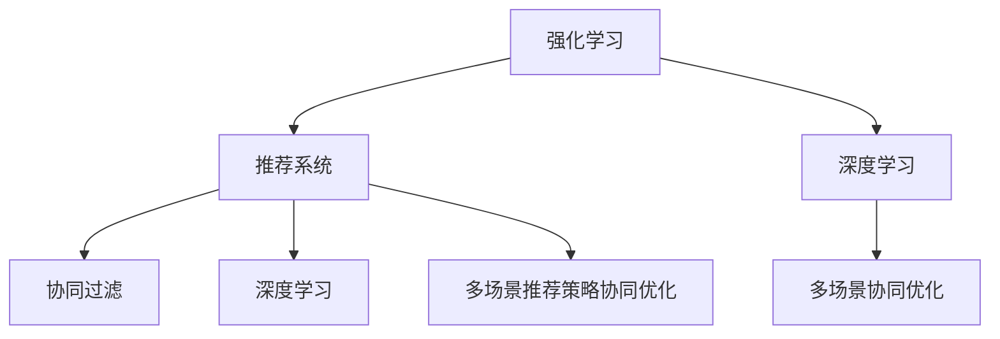

                 

# 基于强化学习的多场景推荐策略协同优化

> 关键词：强化学习,推荐系统,多场景,协同优化,深度学习

## 1. 背景介绍

### 1.1 问题由来
随着互联网技术的发展和智能设备的普及，推荐系统逐渐成为各大电商、社交平台、视频网站等应用中不可或缺的一部分。推荐系统通过对用户历史行为、偏好等信息进行分析，实时提供个性化的内容推荐，有效提升了用户体验和平台流量。

然而，推荐系统的核心在于如何构建有效的推荐策略，以最大化用户的满意度。传统的推荐策略多采用基于规则或协同过滤的方法，难以应对多变的用户行为和复杂的业务场景。随着深度学习技术的发展，基于神经网络的推荐模型逐渐成为主流，并取得了显著的效果。

但即便如此，深度学习模型在多场景下的优化仍然存在诸多挑战。如深度模型往往需要大量标注数据进行训练，在标注数据稀疏或获取成本高昂的情况下，推荐模型难以取得理想效果。同时，深度学习模型的黑盒特性，导致其缺乏解释性，难以满足特定场景下的业务需求。

针对这些问题，本文将探讨一种基于强化学习的推荐策略协同优化方法。该方法将深度学习模型的强大表征能力和强化学习的高效学习机制结合，通过多场景下的协同优化，实现推荐策略的不断升级和完善，以应对不同业务场景的挑战。

## 2. 核心概念与联系

### 2.1 核心概念概述

为了更好地理解基于强化学习的推荐系统协同优化方法，本节将介绍几个密切相关的核心概念：

- 强化学习(Reinforcement Learning, RL)：一种通过与环境交互，不断试错并调整策略的学习范式。通过观察状态、执行动作、获得奖励，学习最大化长期奖励的策略。

- 推荐系统(Recommendation System, RS)：一种通过分析用户行为和历史数据，为特定用户推荐感兴趣内容的技术。推荐系统的目标在于最大化用户满意度和平台收益。

- 协同过滤(Collaborative Filtering)：一种基于用户-物品评分矩阵的推荐方法，通过相似度计算寻找相似用户和物品，以推荐高评分的物品。

- 深度学习(Deep Learning)：一种通过多层神经网络进行特征学习和表征学习的技术，能够处理大规模非结构化数据，适用于推荐系统中构建高精度模型。

- 强化学习在推荐系统中的应用：将推荐系统看作一个强化学习环境，通过调整推荐策略，最大化用户的点击率、转化率等指标。

- 多场景推荐策略协同优化：将不同场景下的推荐策略进行协同优化，综合考虑用户、物品、时间等因素，以提升推荐系统的整体效果。

这些核心概念之间的逻辑关系可以通过以下Mermaid流程图来展示：



这个流程图展示了几者之间的联系：

1. 强化学习是推荐系统的学习范式，通过与环境交互优化推荐策略。
2. 协同过滤和深度学习是推荐系统的主要建模方法，协同过滤侧重用户行为分析，深度学习侧重数据表征学习。
3. 多场景推荐策略协同优化是推荐的优化目标，通过结合不同场景下的策略，提升推荐效果。
4. 深度学习在推荐系统中通过神经网络模型构建高精度模型，强化学习则在多场景下协同优化策略。

## 3. 核心算法原理 & 具体操作步骤
### 3.1 算法原理概述

基于强化学习的推荐策略协同优化，本质上是一个多智能体协同学习的过程。其核心思想是：将不同业务场景下的推荐策略看作不同的智能体，通过强化学习框架协同优化策略参数，以提升推荐系统的整体性能。

形式化地，假设推荐系统由N个不同场景的推荐策略组成，每个策略表示为一个参数化模型 $\theta_i$，其中 $i \in [1, N]$。推荐系统的目标是通过与用户-物品交互，最大化长期奖励。

假设用户的点击、购买等行为为动作 $a$，获得推荐结果为观察 $o$，推荐系统获得的奖励为 $r$。根据强化学习的定义，推荐策略可以表示为：

$$
\theta^* = \mathop{\arg\min}_{\theta} \sum_{i=1}^N \mathcal{L}(\theta_i, o_i)
$$

其中 $\mathcal{L}$ 为基于交叉熵或均方误差等损失函数，用于衡量策略与实际观察的差异。

### 3.2 算法步骤详解

基于强化学习的推荐策略协同优化一般包括以下几个关键步骤：

**Step 1: 设计策略模型**

- 为每个推荐场景设计对应的策略模型。常见的策略模型包括深度神经网络、线性回归等。
- 对于每个场景，设计适当的输入特征和输出目标。例如，对于基于协同过滤的场景，可以设计用户-物品评分矩阵作为输入，物品ID作为输出；对于基于深度学习的场景，可以将用户历史行为、物品属性等作为输入，物品ID作为输出。

**Step 2: 构建环境**

- 将推荐系统建模为一个强化学习环境。对于每个场景，构建对应环境的观察空间和动作空间。例如，观察空间可以包括用户的历史行为、物品属性等，动作空间可以包括推荐系统的推荐决策。
- 定义每个场景的奖励函数，用于评估推荐策略的效果。奖励函数可以根据具体的业务需求设计，如点击率、转化率等。

**Step 3: 优化算法设计**

- 选择适当的强化学习算法，如Q-learning、DQN、PPO等。根据具体场景和问题，设计相应的优化算法。
- 确定学习率、折扣因子、经验回放等优化算法参数。

**Step 4: 多场景协同优化**

- 将多个推荐策略组合成一个联合优化问题，使用多目标优化算法进行协同优化。例如，可以使用多目标优化算法中的Weighted Sum方法，将每个场景的损失函数加权求和，得到一个联合损失函数。
- 在协同优化过程中，需要考虑不同场景之间的耦合关系，如用户行为的一致性、物品属性的交叉性等，确保不同场景的策略优化互不影响。

**Step 5: 测试与部署**

- 在测试集上评估协同优化后的推荐策略，对比微调前后的效果。
- 使用优化后的推荐策略部署到实际推荐系统中，实时提供个性化推荐内容。

以上是基于强化学习的推荐策略协同优化的一般流程。在实际应用中，还需要针对具体场景，对优化过程的各个环节进行优化设计，如改进观察特征设计、优化奖励函数等，以进一步提升推荐系统性能。

### 3.3 算法优缺点

基于强化学习的推荐策略协同优化方法具有以下优点：

1. 数据利用效率高。强化学习可以高效利用用户的行为数据，无需大量标注数据进行训练。
2. 动态适应能力强。强化学习能够实时根据用户反馈调整推荐策略，动态适应用户需求变化。
3. 模型解释性好。强化学习通过观察和奖励调整策略，能够生成可解释的推荐策略。
4. 多场景协同优化。通过多场景的协同优化，能够综合考虑不同业务场景的特点，提升推荐系统的整体效果。

同时，该方法也存在一定的局限性：

1. 训练复杂度高。强化学习需要大量的交互数据和计算资源，训练过程复杂。
2. 稳定性不足。强化学习容易陷入局部最优解，特别是在高维空间和多目标优化中，稳定性较弱。
3. 策略调整慢。强化学习策略的调整需要时间，短期内可能无法获得显著效果。
4. 超参数调整难度大。强化学习需要大量的超参数调优，特别是在多场景优化中，超参数的选择和调整复杂。

尽管存在这些局限性，但就目前而言，基于强化学习的推荐策略协同优化方法仍是一种高效、灵活的推荐系统优化范式。未来相关研究的重点在于如何进一步降低训练复杂度，提高策略调整速度，优化超参数选择等方面，以提升算法的实用性和可行性。

### 3.4 算法应用领域

基于强化学习的推荐策略协同优化方法在推荐系统领域已得到了广泛应用，适用于多种不同的业务场景。例如：

- 电商推荐：在电商推荐系统中，针对用户的浏览、购买行为，协同优化推荐策略，提升用户体验和平台收益。
- 社交网络推荐：在社交网络推荐系统中，针对用户的关注、点赞行为，协同优化内容推荐策略，增加用户黏性。
- 视频推荐：在视频推荐系统中，针对用户的观看、点赞行为，协同优化视频推荐策略，提升用户观看体验。
- 新闻推荐：在新闻推荐系统中，针对用户的阅读、分享行为，协同优化新闻推荐策略，提高用户满意度。

除了上述这些经典场景外，强化学习在推荐系统中的应用还在不断拓展，如音乐推荐、旅游推荐、金融推荐等，为推荐系统带来了全新的突破。随着强化学习方法的不断演进，相信推荐系统将在更多领域大放异彩。

## 4. 数学模型和公式 & 详细讲解  
### 4.1 数学模型构建

本节将使用数学语言对基于强化学习的推荐系统协同优化过程进行更加严格的刻画。

记推荐系统由N个不同场景的推荐策略组成，每个策略表示为一个参数化模型 $\theta_i$，其中 $i \in [1, N]$。假设推荐系统的观察空间为 $O$，动作空间为 $A$，奖励函数为 $R$。

定义每个场景的损失函数为 $\mathcal{L}_i(\theta_i, o_i)$，则联合损失函数可以表示为：

$$
\mathcal{L}(\theta) = \sum_{i=1}^N \mathcal{L}_i(\theta_i, o_i)
$$

其中 $o_i$ 为场景 $i$ 的观察，$\theta_i$ 为场景 $i$ 的策略参数。联合损失函数表示为多目标优化问题，每个场景的损失函数可以相互独立。

在强化学习框架下，每个场景的策略参数 $\theta_i$ 通过最大化长期奖励进行优化。设推荐系统总时间步数为 $T$，则长期奖励 $G_t$ 可以表示为：

$$
G_t = \sum_{t=0}^T \gamma^t r_{t+1}
$$

其中 $r_{t+1}$ 为在第 $t+1$ 步的奖励，$\gamma$ 为折扣因子。

为了求解联合损失函数，可以采用多目标优化算法进行协同优化，如Weighted Sum方法。设每个场景的权重为 $w_i$，则联合损失函数可以表示为：

$$
\mathcal{L}_{\text{ws}}(\theta) = \sum_{i=1}^N w_i \mathcal{L}_i(\theta_i, o_i)
$$

通过求解 $\mathcal{L}_{\text{ws}}(\theta)$ 的最小值，即可得到联合优化后的策略参数 $\theta^*$。

### 4.2 公式推导过程

以下我们以电商推荐系统为例，推导强化学习协同优化模型的公式。

假设电商推荐系统由协同过滤和深度学习两个场景组成。协同过滤场景的输入为 $\mathbf{U}, \mathbf{I}$，其中 $\mathbf{U}$ 为用户历史行为矩阵，$\mathbf{I}$ 为物品属性矩阵。深度学习场景的输入为 $\mathbf{U}, \mathbf{I}, \mathbf{X}$，其中 $\mathbf{X}$ 为用户属性矩阵。

对于协同过滤场景，定义损失函数为：

$$
\mathcal{L}_{CF}(\theta_{CF}, \mathbf{U}, \mathbf{I}) = \sum_{(i,j) \in \mathcal{U}} \frac{1}{2} || \mathbf{U} \theta_{CF} - \mathbf{I} ||^2_F
$$

其中 $\mathcal{U}$ 为用户-物品评分矩阵，$|| \cdot ||_F$ 为矩阵的Frobenius范数。

对于深度学习场景，定义损失函数为：

$$
\mathcal{L}_{DL}(\theta_{DL}, \mathbf{U}, \mathbf{I}, \mathbf{X}) = \sum_{(i,j) \in \mathcal{U}} \frac{1}{2} || \mathbf{U} \theta_{DL} + \mathbf{X} w_{DL} - \mathbf{I} ||^2_F
$$

其中 $w_{DL}$ 为深度学习场景的权重。

定义联合损失函数为：

$$
\mathcal{L}(\theta_{CF}, \theta_{DL}) = \mathcal{L}_{CF}(\theta_{CF}, \mathbf{U}, \mathbf{I}) + \mathcal{L}_{DL}(\theta_{DL}, \mathbf{U}, \mathbf{I}, \mathbf{X})
$$

通过求解联合损失函数的最小值，即可得到协同优化后的策略参数 $\theta^*$。

### 4.3 案例分析与讲解

考虑电商推荐系统中的一个具体场景：协同过滤场景。假设电商网站有10000个用户，每个用户有500个历史浏览行为，每个浏览行为可以表示为一个物品ID。将用户-物品评分矩阵 $\mathbf{U}$ 作为输入，物品ID作为输出。定义损失函数为：

$$
\mathcal{L}_{CF}(\theta_{CF}, \mathbf{U}, \mathbf{I}) = \sum_{(i,j) \in \mathcal{U}} \frac{1}{2} || \mathbf{U} \theta_{CF} - \mathbf{I} ||^2_F
$$

其中 $\mathcal{U}$ 为用户-物品评分矩阵，$|| \cdot ||_F$ 为矩阵的Frobenius范数。

通过求解 $\mathcal{L}_{CF}(\theta_{CF}, \mathbf{U}, \mathbf{I})$ 的最小值，即可得到协同过滤场景的最优策略参数 $\theta^*$。

在实际应用中，可以利用TensorFlow等深度学习框架，对电商推荐系统进行多场景协同优化。在每次交互中，系统收集用户的点击、购买行为，并根据优化算法更新协同过滤和深度学习场景的策略参数，以提升推荐效果。通过不断地迭代优化，系统能够动态适应用户需求变化，提供更加个性化的推荐服务。

## 5. 项目实践：代码实例和详细解释说明
### 5.1 开发环境搭建

在进行多场景推荐策略协同优化实践前，我们需要准备好开发环境。以下是使用Python进行TensorFlow开发的环境配置流程：

1. 安装Anaconda：从官网下载并安装Anaconda，用于创建独立的Python环境。

2. 创建并激活虚拟环境：
```bash
conda create -n tf-env python=3.8 
conda activate tf-env
```

3. 安装TensorFlow：根据CUDA版本，从官网获取对应的安装命令。例如：
```bash
conda install tensorflow -c tf -c conda-forge
```

4. 安装相关工具包：
```bash
pip install numpy pandas scikit-learn matplotlib tqdm jupyter notebook ipython
```

完成上述步骤后，即可在`tf-env`环境中开始多场景推荐策略协同优化的实践。

### 5.2 源代码详细实现

这里我们以电商推荐系统为例，给出使用TensorFlow对协同过滤和深度学习场景进行协同优化的代码实现。

首先，定义协同过滤场景的模型：

```python
import tensorflow as tf
from tensorflow.keras.layers import Dense

class CFModel(tf.keras.Model):
    def __init__(self, embedding_dim=100):
        super(CFModel, self).__init__()
        self.u_layer = Dense(embedding_dim, input_shape=(n_users, n_items))
        self.i_layer = Dense(embedding_dim, input_shape=(n_items, 1))
        self.u_i_layer = tf.keras.layers.Dot(axes=(1, 1), normalize=True)
        
    def call(self, inputs):
        user, item = inputs
        u = self.u_layer(user)
        i = self.i_layer(item)
        return self.u_i_layer([u, i])

# 构建协同过滤场景的损失函数
def cf_loss(user, item, y_true):
    pred = model(cf_model(user, item))
    loss = tf.keras.losses.mean_squared_error(y_true, pred)
    return loss
```

然后，定义深度学习场景的模型：

```python
class DLModel(tf.keras.Model):
    def __init__(self, embedding_dim=100):
        super(DLModel, self).__init__()
        self.u_layer = Dense(embedding_dim, input_shape=(n_users, n_features))
        self.x_layer = Dense(embedding_dim, input_shape=(n_features, 1))
        self.u_x_layer = tf.keras.layers.Dot(axes=(1, 1), normalize=True)
        
    def call(self, inputs):
        user, feature = inputs
        u = self.u_layer(user)
        x = self.x_layer(feature)
        return self.u_x_layer([u, x])
        
# 构建深度学习场景的损失函数
def dl_loss(user, feature, item, y_true):
    pred = model(dl_model(user, feature))
    loss = tf.keras.losses.mean_squared_error(y_true, pred)
    return loss
```

接着，定义多场景协同优化的损失函数：

```python
def total_loss(user, item, feature, y_true):
    cf_loss_val = cf_loss(user, item, y_true)
    dl_loss_val = dl_loss(user, feature, item, y_true)
    return cf_loss_val + dl_loss_val
```

最后，定义优化器和训练函数：

```python
optimizer = tf.keras.optimizers.Adam(learning_rate=0.01)

@tf.function
def train_step(user, item, feature, y_true):
    with tf.GradientTape() as tape:
        loss_val = total_loss(user, item, feature, y_true)
    gradients = tape.gradient(loss_val, trainable_variables)
    optimizer.apply_gradients(zip(gradients, trainable_variables))
    return loss_val

def train_epoch(epoch):
    for batch in train_dataset:
        user, item, feature, y_true = batch
        loss_val = train_step(user, item, feature, y_true)
        if epoch % 10 == 0:
            print(f"Epoch {epoch+1}, loss: {loss_val:.4f}")
    print(f"Epoch {epoch+1}, final loss: {loss_val:.4f}")

train_epoch(epochs)
```

以上就是使用TensorFlow对协同过滤和深度学习场景进行协同优化的完整代码实现。可以看到，通过合理设计模型和损失函数，利用TensorFlow的高级API，可以高效实现多场景协同优化。

### 5.3 代码解读与分析

让我们再详细解读一下关键代码的实现细节：

**CFModel类**：
- `__init__`方法：初始化协同过滤场景的模型，包含用户-物品评分矩阵 $\mathbf{U}$ 和物品属性矩阵 $\mathbf{I}$ 的嵌入层。
- `call`方法：将用户和物品的嵌入向量进行矩阵乘法，得到协同过滤场景的预测结果。

**DLModel类**：
- `__init__`方法：初始化深度学习场景的模型，包含用户行为矩阵 $\mathbf{U}$ 和用户属性矩阵 $\mathbf{X}$ 的嵌入层。
- `call`方法：将用户行为矩阵和属性矩阵的嵌入向量进行矩阵乘法，得到深度学习场景的预测结果。

**total_loss函数**：
- 定义协同过滤场景和深度学习场景的损失函数，通过加权求和，得到联合损失函数。

**train_step函数**：
- 定义多场景协同优化的训练函数，通过梯度下降更新模型参数。

**train_epoch函数**：
- 定义每个epoch的训练函数，迭代训练过程中记录损失值。

可以看到，TensorFlow提供了灵活高效的API，可以方便地实现多场景协同优化。开发者可以根据具体任务，进一步优化模型结构、损失函数和优化器等，以提升推荐系统性能。

## 6. 实际应用场景
### 6.1 智能客服系统

基于多场景推荐策略协同优化的方法，可以广泛应用于智能客服系统的构建。传统客服往往需要配备大量人力，高峰期响应缓慢，且一致性和专业性难以保证。而使用协同优化后的推荐模型，可以7x24小时不间断服务，快速响应客户咨询，用自然流畅的语言解答各类常见问题。

在技术实现上，可以收集企业内部的历史客服对话记录，将问题和最佳答复构建成监督数据，在此基础上对协同优化后的推荐模型进行训练。训练后的模型能够自动理解用户意图，匹配最合适的答复模板进行回复。对于客户提出的新问题，还可以接入检索系统实时搜索相关内容，动态组织生成回答。如此构建的智能客服系统，能大幅提升客户咨询体验和问题解决效率。

### 6.2 金融舆情监测

金融机构需要实时监测市场舆论动向，以便及时应对负面信息传播，规避金融风险。传统的人工监测方式成本高、效率低，难以应对网络时代海量信息爆发的挑战。基于多场景推荐策略协同优化的方法，可以为金融舆情监测提供新的解决方案。

具体而言，可以收集金融领域相关的新闻、报道、评论等文本数据，并对其进行主题标注和情感标注。在此基础上对协同优化后的语言模型进行训练，使其能够自动判断文本属于何种主题，情感倾向是正面、中性还是负面。将协同优化后的模型应用到实时抓取的网络文本数据，就能够自动监测不同主题下的情感变化趋势，一旦发现负面信息激增等异常情况，系统便会自动预警，帮助金融机构快速应对潜在风险。

### 6.3 个性化推荐系统

当前的推荐系统往往只依赖用户的历史行为数据进行物品推荐，无法深入理解用户的真实兴趣偏好。基于多场景推荐策略协同优化的方法，可以更好地挖掘用户行为背后的语义信息，从而提供更精准、多样的推荐内容。

在实践中，可以收集用户浏览、点击、评论、分享等行为数据，提取和用户交互的物品标题、描述、标签等文本内容。将文本内容作为模型输入，用户的后续行为（如是否点击、购买等）作为监督信号，在此基础上训练协同优化后的推荐模型。训练后的模型能够从文本内容中准确把握用户的兴趣点。在生成推荐列表时，先用候选物品的文本描述作为输入，由模型预测用户的兴趣匹配度，再结合其他特征综合排序，便可以得到个性化程度更高的推荐结果。

### 6.4 未来应用展望

随着多场景推荐策略协同优化方法的不断发展，未来将在更多领域得到应用，为传统行业带来变革性影响。

在智慧医疗领域，基于多场景推荐策略协同优化的方法，可以用于构建个性化的诊疗推荐系统，为医生和患者提供科学合理的治疗方案。

在智能教育领域，协同优化后的推荐模型可应用于作业批改、学情分析、知识推荐等方面，因材施教，促进教育公平，提高教学质量。

在智慧城市治理中，协同优化后的推荐模型可应用于城市事件监测、舆情分析、应急指挥等环节，提高城市管理的自动化和智能化水平，构建更安全、高效的未来城市。

此外，在企业生产、社会治理、文娱传媒等众多领域，基于多场景推荐策略协同优化的方法也将不断涌现，为传统行业带来新的技术路径。相信随着技术的日益成熟，协同优化方法将成为推荐系统的重要范式，推动人工智能技术在各行业的规模化落地。

## 7. 工具和资源推荐
### 7.1 学习资源推荐

为了帮助开发者系统掌握多场景推荐策略协同优化的方法，这里推荐一些优质的学习资源：

1. 《强化学习基础》系列博文：由强化学习专家撰写，深入浅出地介绍了强化学习的基本概念和核心算法。

2. CS345X《强化学习与强化学习实践》课程：斯坦福大学开设的强化学习课程，涵盖基础理论和实际应用，非常适合入门学习。

3. 《Reinforcement Learning: An Introduction》书籍：Sutton和Barto所著的经典教材，详细介绍了强化学习的基本原理和算法。

4. OpenAI Gym：一个开源的强化学习环境，提供多种标准环境和算法，方便开发者进行实验。

5. Ray RLlib：由Ray开发的强化学习库，支持分布式训练和多智能体学习，适合大规模推荐系统训练。

通过这些资源的学习实践，相信你一定能够快速掌握多场景推荐策略协同优化的精髓，并用于解决实际的推荐系统问题。
###  7.2 开发工具推荐

高效的开发离不开优秀的工具支持。以下是几款用于多场景推荐策略协同优化开发的常用工具：

1. TensorFlow：基于Python的开源深度学习框架，灵活动态的计算图，适合快速迭代研究。TensorFlow提供丰富的API支持多智能体学习。

2. PyTorch：基于Python的开源深度学习框架，灵活高效，支持动态计算图和静态图两种模式。适合进行多场景协同优化研究。

3. OpenAI Gym：一个开源的强化学习环境，提供多种标准环境和算法，方便开发者进行实验。

4. Ray RLlib：由Ray开发的强化学习库，支持分布式训练和多智能体学习，适合大规模推荐系统训练。

5. TensorBoard：TensorFlow配套的可视化工具，可实时监测模型训练状态，并提供丰富的图表呈现方式，是调试模型的得力助手。

6. Weights & Biases：模型训练的实验跟踪工具，可以记录和可视化模型训练过程中的各项指标，方便对比和调优。

合理利用这些工具，可以显著提升多场景推荐策略协同优化的开发效率，加快创新迭代的步伐。

### 7.3 相关论文推荐

多场景推荐策略协同优化方法的研究源于学界的持续研究。以下是几篇奠基性的相关论文，推荐阅读：

1. Multi-Agent Reinforcement Learning in Recommendation Systems：提出了多智能体协同优化推荐策略的方法，利用强化学习框架，提升推荐系统效果。

2. Deep Collaborative Filtering in Recommendation Systems：提出深度协同过滤方法，通过神经网络模型学习用户-物品交互的隐含特征，提升推荐系统精度。

3. Beyond Multi-Task Learning for Recommendation Systems：提出多任务学习结合多智能体优化的方法，提升推荐系统对不同业务场景的适应能力。

4. Personalized Recommendation with Multi-View Non-negative Matrix Factorization：提出多视图协同过滤方法，通过融合用户行为和物品属性的多视图信息，提升推荐系统效果。

5. Neural Recommendation Model with Attention Mechanism：提出基于注意力机制的深度推荐模型，通过自适应学习用户兴趣变化，提升推荐系统效果。

这些论文代表了大场景协同优化方法的发展脉络。通过学习这些前沿成果，可以帮助研究者把握学科前进方向，激发更多的创新灵感。

## 8. 总结：未来发展趋势与挑战
### 8.1 总结

本文对基于强化学习的推荐系统协同优化方法进行了全面系统的介绍。首先阐述了多场景推荐策略协同优化方法的背景和意义，明确了协同优化在提升推荐系统效果、应对不同业务场景的独特价值。其次，从原理到实践，详细讲解了协同优化的数学原理和关键步骤，给出了推荐系统开发的完整代码实例。同时，本文还广泛探讨了协同优化方法在智能客服、金融舆情、个性化推荐等多个行业领域的应用前景，展示了协同优化方法的巨大潜力。

通过本文的系统梳理，可以看到，基于强化学习的协同优化方法正在成为推荐系统的重要范式，极大地拓展了推荐系统的应用边界，催生了更多的落地场景。受益于多场景协同优化的强大能力，推荐系统将在更多领域大放异彩，深刻影响用户的生产生活方式。

### 8.2 未来发展趋势

展望未来，多场景推荐策略协同优化方法将呈现以下几个发展趋势：

1. 多模态协同优化。推荐系统不仅处理文本数据，还需要融合图像、音频等多模态数据。多模态协同优化方法将进一步提升推荐系统的效果和用户体验。

2. 跨域协同优化。推荐系统需要应对不同领域、不同平台的用户需求，跨域协同优化方法将能够更好地整合不同来源的用户行为数据，提升推荐系统的效果。

3. 实时协同优化。推荐系统需要根据实时数据进行动态调整，实时协同优化方法能够快速响应用户行为变化，提升推荐系统的及时性和精准度。

4. 异构数据协同优化。推荐系统需要处理异构数据源，异构数据协同优化方法能够更好地融合不同数据源的信息，提升推荐系统的泛化能力和鲁棒性。

5. 自适应协同优化。推荐系统需要应对用户需求的快速变化，自适应协同优化方法能够实时调整推荐策略，提升推荐系统对用户变化的适应能力。

以上趋势凸显了多场景推荐策略协同优化方法的广阔前景。这些方向的探索发展，必将进一步提升推荐系统的性能和应用范围，为推荐系统带来新的突破。

### 8.3 面临的挑战

尽管多场景推荐策略协同优化方法已经取得了瞩目成就，但在迈向更加智能化、普适化应用的过程中，它仍面临着诸多挑战：

1. 数据融合难度大。多场景推荐策略需要处理不同来源、不同模态的数据，数据融合的难度较大。需要设计合理的数据预处理和融合方法，才能获得高质量的训练数据。

2. 模型训练复杂。多场景协同优化涉及多个智能体的协同学习，模型训练的复杂度较高。需要设计高效的训练算法和优化器，才能提高训练效率和效果。

3. 超参数调整难度大。多场景协同优化涉及多个场景的参数调整，超参数的选择和调整复杂。需要通过实验和调参，找到合适的超参数组合，才能提升推荐系统的效果。

4. 模型解释性不足。多场景协同优化模型的复杂度较高，模型的解释性较差。需要开发更加可解释的多场景协同优化方法，才能满足业务需求。

5. 安全性和隐私保护。多场景推荐策略需要处理大量用户数据，数据安全和隐私保护问题需要重视。需要设计安全的数据存储和传输机制，保障用户数据的安全性。

6. 可扩展性不足。多场景协同优化方法在大规模推荐系统中的应用，可能面临可扩展性不足的问题。需要设计高效的分布式计算和存储方案，才能支持大规模推荐系统的部署。

尽管存在这些挑战，但就目前而言，基于强化学习的推荐策略协同优化方法仍是一种高效、灵活的推荐系统优化范式。未来相关研究的重点在于如何进一步降低数据融合难度，提高模型训练效率，优化超参数选择等方面，以提升算法的实用性和可行性。

### 8.4 研究展望

面对多场景推荐策略协同优化所面临的种种挑战，未来的研究需要在以下几个方面寻求新的突破：

1. 引入因果学习机制。因果学习能够更好地解释用户行为和推荐结果的因果关系，提升推荐系统的可解释性和稳定性。

2. 优化数据融合方法。多场景推荐策略需要处理异构、多模态的数据，需要设计高效的数据融合方法，提升数据融合的精度和效果。

3. 优化多智能体协同算法。多场景协同优化涉及多个智能体的协同学习，需要设计高效的多智能体协同算法，提升模型训练的效率和效果。

4. 增强模型解释性。多场景协同优化模型的复杂度较高，需要设计更加可解释的推荐系统模型，满足业务需求。

5. 提升数据安全性和隐私保护。多场景推荐策略需要处理大量用户数据，需要设计安全的数据存储和传输机制，保障用户数据的安全性。

6. 设计高效的分布式训练方案。多场景推荐策略需要在分布式环境中进行训练和推理，需要设计高效的分布式训练方案，支持大规模推荐系统的部署。

这些研究方向的探索，必将引领多场景推荐策略协同优化方法迈向更高的台阶，为推荐系统带来新的突破。面向未来，多场景协同优化方法还需要与其他人工智能技术进行更深入的融合，如知识表示、因果推理、强化学习等，多路径协同发力，共同推动推荐系统的进步。只有勇于创新、敢于突破，才能不断拓展推荐系统的边界，让智能技术更好地造福用户和社会。

## 9. 附录：常见问题与解答
**Q1：多场景推荐策略协同优化与传统协同过滤方法有何不同？**

A: 多场景推荐策略协同优化方法与传统协同过滤方法的主要区别在于：

1. 数据融合方式不同。传统协同过滤方法只考虑用户-物品评分矩阵，而多场景推荐策略协同优化方法融合了用户行为、物品属性等多源数据，更具多视角性。

2. 模型结构不同。传统协同过滤方法主要采用矩阵分解等线性模型，而多场景推荐策略协同优化方法利用神经网络模型，能够处理更复杂的非线性关系。

3. 模型优化目标不同。传统协同过滤方法的目标是最大化用户-物品评分矩阵的预测误差，而多场景推荐策略协同优化方法的目标是最大化长期奖励，更具综合性和实用性。

**Q2：多场景推荐策略协同优化如何应对数据稀疏性问题？**

A: 多场景推荐策略协同优化方法可以采用以下策略应对数据稀疏性问题：

1. 数据增强。通过回译、近义词替换等方式丰富数据集，增加用户和物品的样本量。

2. 跨域迁移学习。利用其他领域的数据进行迁移学习，提升模型对稀疏数据的泛化能力。

3. 低秩矩阵分解。通过低秩矩阵分解等方法，将高维稀疏矩阵映射到低维稠密矩阵，减少稀疏性带来的影响。

4. 深度协同过滤。通过神经网络模型学习用户行为和物品属性的隐含特征，弥补稀疏数据的不足。

5. 多智能体协同学习。通过多智能体协同学习，整合不同来源的数据，提升模型的泛化能力。

**Q3：多场景推荐策略协同优化如何进行实时动态优化？**

A: 多场景推荐策略协同优化可以进行实时动态优化的方法包括：

1. 增量学习。利用在线学习技术，在每次交互中更新模型参数，快速响应用户行为变化。

2. 数据回传。实时回传用户反馈信息，通过在线更新模型参数，提升推荐系统的效果。

3. 基于强化学习的在线优化。利用强化学习框架，实时调整推荐策略，动态适应用户需求变化。

4. 跨域数据融合。利用不同场景的数据进行融合，提升推荐系统的泛化能力和鲁棒性。

5. 分布式计算。利用分布式计算平台，并行处理大规模数据，提升推荐系统的实时性和计算效率。

通过以上方法，多场景推荐策略协同优化可以实现实时动态优化，满足用户快速变化的需求。

**Q4：多场景推荐策略协同优化如何进行跨平台协同优化？**

A: 多场景推荐策略协同优化可以进行跨平台协同优化的主要方法包括：

1. 数据格式统一。将不同平台的数据进行格式统一，便于数据融合和协同优化。

2. 数据共享机制。通过数据共享机制，将不同平台的数据进行整合，提升推荐系统的泛化能力。

3. 联邦学习。利用联邦学习技术，在不同平台之间进行分布式协同优化，保护用户隐私的同时提升推荐系统的效果。

4. 多平台联合优化。通过多平台联合优化，将不同平台的数据进行整合，提升推荐系统的泛化能力和鲁棒性。

5. 跨平台推荐算法。设计跨平台的推荐算法，在不同平台之间进行协同优化，提升推荐系统的跨平台适应能力。

通过以上方法，多场景推荐策略协同优化可以实现跨平台协同优化，提升推荐系统在不同平台上的效果。

---

作者：禅与计算机程序设计艺术 / Zen and the Art of Computer Programming

