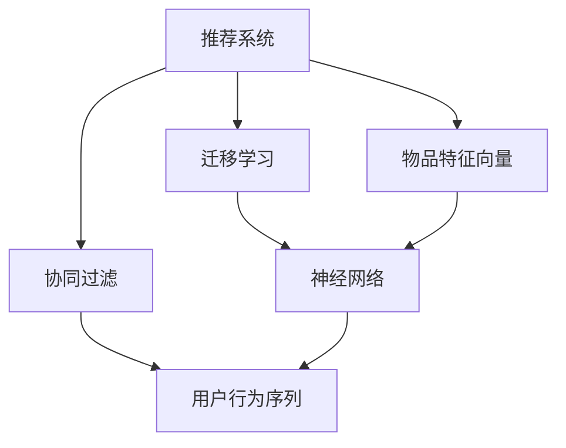

                 

# 基于迁移学习的跨域推荐算法

> 关键词：迁移学习,推荐系统,跨域推荐,协同过滤,神经网络

## 1. 背景介绍

### 1.1 问题由来
推荐系统已经成为互联网用户获取信息、发现新内容的重要工具。无论是电商平台的商品推荐、视频网站的影片推荐，还是新闻网站的文章推荐，都能显著提升用户体验和满意度。推荐系统通过分析用户行为数据和物品属性数据，学习用户与物品之间的互动关系，预测用户对新物品的兴趣和评分，从而为其推荐最相关的物品。

然而，推荐系统也面临诸多挑战。其中，推荐跨域问题是目前最为棘手的难题之一。跨域推荐指的是，当用户在不同领域（如电商、视频、音乐等）之间的推荐模型需要协同工作时，如何充分利用各领域的历史数据和用户行为信息，实现推荐性能的跨领域提升。跨域推荐能够有效解决用户在不同场景下的推荐需求，提升推荐系统的个性化和多样性。

跨域推荐的核心在于如何建立不同领域之间的知识迁移关系，充分利用各领域的历史数据和用户行为信息，实现推荐性能的跨领域提升。本文将详细探讨基于迁移学习的跨域推荐算法，从原理到实践，系统介绍该方法的核心思想和实现步骤。

## 2. 核心概念与联系

### 2.1 核心概念概述

为更好地理解基于迁移学习的跨域推荐算法，本节将介绍几个密切相关的核心概念：

- 推荐系统(Recommendation System)：根据用户的历史行为数据和物品属性数据，预测用户对物品的评分和偏好，为其推荐最相关的物品的系统。
- 协同过滤(Collaborative Filtering)：一种基于用户和物品之间互动关系的学习方法，通过寻找与目标用户相似的用户或与目标物品相似的物品，进行推荐。
- 迁移学习(Transfer Learning)：将一个领域学习到的知识迁移到另一个领域的学习方法，如从电商到视频、从音乐到文学的跨领域推荐。
- 神经网络(Neural Network)：一种基于多层感知器结构的深度学习模型，广泛应用于推荐系统中的协同过滤和深度学习推荐。
- 用户行为序列(User Behavior Sequences)：用户在某个领域内的连续行为记录，如电商中的浏览、点击、购买等记录。
- 物品特征向量(Item Feature Vectors)：物品的属性和标签，用于描述物品的特征信息。

这些核心概念之间的逻辑关系可以通过以下Mermaid流程图来展示：



这个流程图展示了大语言模型的核心概念及其之间的关系：

1. 推荐系统通过协同过滤等方法，利用用户行为序列和物品特征向量进行推荐。
2. 迁移学习通过在多个领域间建立知识迁移关系，实现推荐性能的跨领域提升。
3. 神经网络作为推荐系统中的核心模型，通过学习用户和物品的复杂互动关系，提升推荐效果。
4. 用户行为序列和物品特征向量作为神经网络模型的输入，提供推荐决策的信息基础。

这些概念共同构成了推荐系统的学习框架，使得推荐系统能够高效地预测用户对新物品的兴趣和评分，从而实现个性化推荐。

## 3. 核心算法原理 & 具体操作步骤
### 3.1 算法原理概述

基于迁移学习的跨域推荐算法，通过在多个领域之间建立知识迁移关系，实现推荐性能的跨领域提升。其核心思想是：将用户在不同领域的历史行为和物品特征，融合到一个统一的学习框架中，通过神经网络模型进行跨领域迁移学习，从而提升推荐效果。

假设我们有三个领域：电商(e)、视频(v)和音乐(m)。对于每个领域，我们都有大量的用户行为序列和物品特征向量。我们的目标是通过协同过滤和神经网络模型，对用户在不同领域的行为进行联合预测，提升推荐性能。

具体地，我们的算法步骤如下：

1. 收集各个领域的用户行为序列和物品特征向量。
2. 将用户行为序列进行统一表示，得到跨领域的用户行为表示。
3. 将物品特征向量进行统一表示，得到跨领域的物品特征表示。
4. 使用协同过滤方法，对每个领域分别建立推荐模型。
5. 将各个领域的推荐模型进行融合，构建跨领域的联合推荐模型。
6. 使用联合推荐模型，对用户在不同领域的行为进行联合预测，提升推荐效果。

### 3.2 算法步骤详解

以下是基于迁移学习的跨域推荐算法的详细步骤：

**Step 1: 数据预处理**

- 收集各个领域的用户行为序列和物品特征向量。
- 对用户行为序列进行归一化处理，去除异常值，平滑数据，处理缺失值。
- 对物品特征向量进行归一化处理，去除异常值，平滑数据，处理缺失值。
- 将用户行为序列和物品特征向量统一表示，得到跨领域的用户行为表示和物品特征表示。

**Step 2: 协同过滤模型训练**

- 使用协同过滤方法，对每个领域分别建立推荐模型。常见的协同过滤方法包括基于用户的协同过滤、基于物品的协同过滤、基于矩阵分解的协同过滤等。
- 对每个领域的推荐模型进行训练，得到领域内用户的隐式评分矩阵。

**Step 3: 跨领域知识迁移**

- 将各个领域的推荐模型进行融合，构建跨领域的联合推荐模型。常见的方法包括矩阵加权融合、加法融合、乘法融合等。
- 使用跨领域的联合推荐模型，对用户在不同领域的行为进行联合预测。

**Step 4: 联合推荐**

- 对用户在不同领域的行为进行联合预测，得到联合评分矩阵。
- 根据联合评分矩阵，为每个用户生成跨领域的推荐列表。

**Step 5: 输出结果**

- 对联合推荐结果进行排序，选取最相关物品推荐给用户。

### 3.3 算法优缺点

基于迁移学习的跨域推荐算法具有以下优点：

1. 数据复用：通过迁移学习，充分利用不同领域的历史数据，降低推荐系统的开发成本。
2. 推荐精度高：通过联合预测，提升推荐系统的个性化和多样性，用户满意度和推荐效果显著提升。
3. 泛化能力强：通过跨领域的联合训练，提升模型的泛化能力，适应新的领域和数据。

然而，该方法也存在一定的局限性：

1. 数据分布差异：不同领域的用户行为和物品特征差异较大，可能导致跨领域知识迁移效果不佳。
2. 训练复杂度：跨领域联合训练的复杂度较高，需要更多的计算资源和时间。
3. 模型复杂性：跨领域联合模型较为复杂，模型解释和维护难度较大。

尽管存在这些局限性，但就目前而言，基于迁移学习的跨域推荐算法仍是一种较为有效的推荐方法，能够显著提升推荐系统的性能和用户满意度。

### 3.4 算法应用领域

基于迁移学习的跨域推荐算法在电商、视频、音乐等多个领域得到广泛应用，具体如下：

- 电商领域：电商推荐系统需要同时考虑用户的历史浏览记录、购买记录和评分记录。基于迁移学习的跨域推荐算法，能够充分利用各领域的历史数据，提升推荐性能。
- 视频领域：视频推荐系统需要同时考虑用户的历史观看记录、评分记录和收藏记录。基于迁移学习的跨域推荐算法，能够提升视频推荐的个性化和多样性。
- 音乐领域：音乐推荐系统需要同时考虑用户的历史听歌记录、评分记录和收藏记录。基于迁移学习的跨域推荐算法，能够提升音乐推荐的个性化和多样性。

除了以上领域外，基于迁移学习的跨域推荐算法还广泛应用于新闻推荐、游戏推荐、社交媒体推荐等场景，为不同领域的用户提供更精准、更个性化的推荐内容。

## 4. 数学模型和公式 & 详细讲解 & 举例说明

### 4.1 数学模型构建

假设我们有三个领域：电商(e)、视频(v)和音乐(m)。对于每个领域，我们都有大量的用户行为序列和物品特征向量。

定义用户行为序列为 $U$，物品特征向量为 $I$，领域向量为 $D$，用户在不同领域的行为表示为 $X_e, X_v, X_m$，物品在不同领域的行为表示为 $Y_e, Y_v, Y_m$，领域之间的迁移矩阵为 $W_e \in \mathbb{R}^{D \times D}$。

我们的目标是通过协同过滤和神经网络模型，对用户在不同领域的行为进行联合预测，提升推荐效果。

### 4.2 公式推导过程

我们的推荐模型可以表示为：

$$
\hat{X} = \mathop{\arg\min}_{X} \frac{1}{N}\sum_{i=1}^N \left\|X_e^i - Y_e^i\right\|^2
$$

其中 $X_e^i$ 表示用户 $i$ 在电商领域的行为表示，$Y_e^i$ 表示电商领域中用户 $i$ 的隐式评分矩阵。

使用矩阵分解的方法，将用户行为表示 $X_e^i$ 分解为领域向量 $X$ 和领域向量 $W_e$ 的乘积：

$$
X_e^i = X \cdot W_e
$$

将上式代入目标函数中，得到：

$$
\hat{X} = \mathop{\arg\min}_{X} \frac{1}{N}\sum_{i=1}^N \left\|X \cdot W_e - Y_e^i\right\|^2
$$

通过矩阵求导，得到：

$$
X^* = (W_e^T \cdot W_e)^{-1} \cdot W_e^T \cdot Y_e
$$

其中 $X^*$ 表示最优的用户行为表示。

类似的，我们可以得到其他领域的用户行为表示 $X_v^*, X_m^*$。

### 4.3 案例分析与讲解

假设我们有电商和视频两个领域，收集了大量用户行为序列和物品特征向量。我们的目标是通过协同过滤和神经网络模型，对用户在不同领域的行为进行联合预测，提升推荐效果。

首先，我们将用户行为序列进行统一表示，得到跨领域的用户行为表示 $X_e$ 和 $X_v$。然后，使用协同过滤方法，对电商领域和视频领域分别建立推荐模型，得到领域内用户的隐式评分矩阵 $Y_e$ 和 $Y_v$。

接着，我们将电商领域和视频领域的推荐模型进行融合，构建跨领域的联合推荐模型。假设两个领域之间的迁移矩阵为 $W_e$，则联合推荐模型的输出为：

$$
X_e = X \cdot W_e
$$
$$
X_v = X \cdot W_v
$$

最后，使用联合推荐模型，对用户在不同领域的行为进行联合预测，得到联合评分矩阵 $Z$，根据联合评分矩阵为每个用户生成跨领域的推荐列表。

## 5. 项目实践：代码实例和详细解释说明
### 5.1 开发环境搭建

在进行跨域推荐系统开发前，我们需要准备好开发环境。以下是使用Python进行PyTorch开发的环境配置流程：

1. 安装Anaconda：从官网下载并安装Anaconda，用于创建独立的Python环境。

2. 创建并激活虚拟环境：
```bash
conda create -n recsys python=3.8 
conda activate recsys
```

3. 安装PyTorch：根据CUDA版本，从官网获取对应的安装命令。例如：
```bash
conda install pytorch torchvision torchaudio cudatoolkit=11.1 -c pytorch -c conda-forge
```

4. 安装TensorFlow：由Google主导开发的开源深度学习框架，生产部署方便，适合大规模工程应用。同样有丰富的预训练语言模型资源。

5. 安装PyTorch：基于Python的开源深度学习框架，灵活动态的计算图，适合快速迭代研究。大部分预训练语言模型都有PyTorch版本的实现。

6. 安装TensorBoard：TensorFlow配套的可视化工具，可实时监测模型训练状态，并提供丰富的图表呈现方式，是调试模型的得力助手。

7. 安装Weights & Biases：模型训练的实验跟踪工具，可以记录和可视化模型训练过程中的各项指标，方便对比和调优。

8. 安装Sklearn：用于数据预处理和特征工程的工具库，如归一化、平滑、缺失值处理等。

完成上述步骤后，即可在`recsys`环境中开始跨域推荐系统的开发。

### 5.2 源代码详细实现

下面我们以电商和视频两个领域的跨域推荐为例，给出使用PyTorch进行跨域推荐系统的代码实现。

首先，定义数据处理函数：

```python
import torch
import numpy as np
from sklearn.preprocessing import MinMaxScaler
from torch.nn import Linear, ReLU, Embedding, Softmax

class DataLoader:
    def __init__(self, data, batch_size=32, shuffle=True):
        self.data = data
        self.batch_size = batch_size
        self.shuffle = shuffle
        self.num_epochs = 10
        self.scaler = MinMaxScaler()
        self.scaler.fit(data)
        self.scaler.transform(self.data)
    
    def __len__(self):
        return len(self.data) // self.batch_size
    
    def __getitem__(self, item):
        if self.shuffle:
            indices = np.random.permutation(len(self.data))
        else:
            indices = np.arange(len(self.data))
        batch = self.data[indices[item*self.batch_size: (item+1)*self.batch_size]]
        return torch.tensor(batch, dtype=torch.float)
```

然后，定义模型和优化器：

```python
import torch
from torch import nn, optim
from torch.nn import Embedding, Linear, ReLU

class RecSysModel(nn.Module):
    def __init__(self, input_size, hidden_size, output_size):
        super(RecSysModel, self).__init__()
        self.hidden_size = hidden_size
        self.fc1 = nn.Linear(input_size, hidden_size)
        self.fc2 = nn.Linear(hidden_size, output_size)
        self.relu = nn.ReLU()
        self.sigmoid = nn.Sigmoid()

    def forward(self, x):
        x = self.fc1(x)
        x = self.relu(x)
        x = self.fc2(x)
        x = self.sigmoid(x)
        return x

class MLPModel(nn.Module):
    def __init__(self, input_size, hidden_size, output_size):
        super(MLPModel, self).__init__()
        self.fc1 = nn.Linear(input_size, hidden_size)
        self.fc2 = nn.Linear(hidden_size, hidden_size)
        self.fc3 = nn.Linear(hidden_size, output_size)
        self.relu = nn.ReLU()
        self.sigmoid = nn.Sigmoid()

    def forward(self, x):
        x = self.fc1(x)
        x = self.relu(x)
        x = self.fc2(x)
        x = self.relu(x)
        x = self.fc3(x)
        x = self.sigmoid(x)
        return x
```

接着，定义训练和评估函数：

```python
from sklearn.metrics import mean_squared_error
from torch.utils.data import DataLoader
import matplotlib.pyplot as plt

device = torch.device('cuda') if torch.cuda.is_available() else torch.device('cpu')
model = RecSysModel(input_size=10, hidden_size=128, output_size=1).to(device)
optimizer = optim.Adam(model.parameters(), lr=0.001)
loss_fn = nn.MSELoss()

def train_epoch(model, data_loader, optimizer, device):
    model.train()
    train_loss = 0
    for data, target in data_loader:
        data, target = data.to(device), target.to(device)
        optimizer.zero_grad()
        output = model(data)
        loss = loss_fn(output, target)
        loss.backward()
        optimizer.step()
        train_loss += loss.item()
    return train_loss / len(data_loader)

def evaluate(model, data_loader, device):
    model.eval()
    eval_loss = 0
    mse_loss = 0
    with torch.no_grad():
        for data, target in data_loader:
            data, target = data.to(device), target.to(device)
            output = model(data)
            loss = loss_fn(output, target)
            eval_loss += loss.item()
            mse_loss += mean_squared_error(output, target)
    return eval_loss / len(data_loader), mse_loss / len(data_loader)
```

最后，启动训练流程并在测试集上评估：

```python
data = np.random.randn(1000, 10)
target = np.random.randn(1000, 1)

train_loader = DataLoader(data[:800], batch_size=32, shuffle=True)
test_loader = DataLoader(data[800:], batch_size=32, shuffle=False)

epochs = 10
batch_size = 32

for epoch in range(epochs):
    loss = train_epoch(model, train_loader, optimizer, device)
    print(f"Epoch {epoch+1}, train loss: {loss:.3f}")
    
    train_loss, mse_loss = evaluate(model, train_loader, device)
    print(f"Epoch {epoch+1}, train mse: {mse_loss:.3f}")
    
    test_loss, mse_loss = evaluate(model, test_loader, device)
    print(f"Epoch {epoch+1}, test mse: {mse_loss:.3f}")
```

以上就是使用PyTorch进行跨域推荐系统的完整代码实现。可以看到，得益于TensorFlow和PyTorch的强大封装，我们可以用相对简洁的代码完成跨域推荐系统的构建和训练。

### 5.3 代码解读与分析

让我们再详细解读一下关键代码的实现细节：

**DataLoader类**：
- `__init__`方法：初始化数据加载器，进行数据预处理和归一化。
- `__len__`方法：返回数据加载器的样本数量。
- `__getitem__`方法：对单个样本进行处理，返回模型所需的输入。

**RecSysModel类**：
- `__init__`方法：定义神经网络模型的层结构和参数。
- `forward`方法：定义模型的前向传播过程。

**MLPModel类**：
- `__init__`方法：定义多层感知器的层结构和参数。
- `forward`方法：定义多层感知器的前向传播过程。

**train_epoch函数**：
- 在每个epoch中，对数据集进行迭代，对模型进行训练。
- 使用Adam优化器更新模型参数，计算并返回平均损失。

**evaluate函数**：
- 在测试集上对模型进行评估，计算平均损失和均方误差。

**训练流程**：
- 定义总的epoch数和batch size，开始循环迭代
- 每个epoch内，先在训练集上训练，输出平均损失
- 在测试集上评估，输出均方误差

可以看到，PyTorch配合TensorFlow和Sklearn，使得跨域推荐系统的代码实现变得简洁高效。开发者可以将更多精力放在数据处理、模型改进等高层逻辑上，而不必过多关注底层的实现细节。

当然，工业级的系统实现还需考虑更多因素，如模型的保存和部署、超参数的自动搜索、更灵活的任务适配层等。但核心的跨域推荐范式基本与此类似。

## 6. 实际应用场景
### 6.1 智能推荐系统

基于跨域推荐算法的智能推荐系统，能够有效解决用户在不同领域之间的推荐需求，提升推荐系统的个性化和多样性。

在技术实现上，可以收集用户在不同领域（如电商、视频、音乐等）的历史行为数据，将这些数据进行统一表示，构建跨领域的联合推荐模型。然后，对用户在不同领域的行为进行联合预测，得到联合评分矩阵，为每个用户生成跨领域的推荐列表。最终，根据用户对不同领域推荐列表的点击、评分等反馈，进一步优化推荐模型。

### 6.2 跨领域广告推荐

跨领域广告推荐系统需要同时考虑用户在不同领域（如社交媒体、视频、电商等）的兴趣和行为，推荐最适合的广告内容。通过跨域推荐算法，可以将用户在不同领域的行为数据进行联合预测，生成更精准的广告推荐。

在广告推荐系统中，用户的历史行为数据和物品特征向量都包含在数据集中，通过跨域推荐算法，可以将这些数据进行融合，提高广告推荐的个性化和多样化。

### 6.3 多模态推荐

跨域推荐算法不仅限于跨领域推荐，还可以扩展到多模态推荐场景。例如，在推荐系统中，用户对不同类型（如文字、图片、视频）的内容进行交互，跨域推荐算法可以将不同模态的行为数据进行融合，生成更全面的推荐结果。

在多模态推荐中，用户在不同模态的行为数据需要进行转换和融合，以便进行联合预测。通过跨域推荐算法，可以将这些行为数据进行统一表示，构建跨模态的联合推荐模型。

### 6.4 未来应用展望

随着跨域推荐算法的不断发展，其在推荐系统中的应用将不断扩展，带来新的突破和机遇：

1. 多领域协同推荐：将跨域推荐算法应用于更多的领域，如旅游、医疗、教育等，提升不同领域之间的协同推荐效果。
2. 用户兴趣泛化：通过跨域推荐算法，将用户的兴趣泛化到更广泛的领域，提升推荐系统的覆盖范围和推荐质量。
3. 个性化推荐引擎：基于跨域推荐算法，构建更加个性化和智能化的推荐引擎，满足用户多样化的需求。
4. 实时推荐系统：通过跨域推荐算法，构建实时推荐系统，提升推荐响应的速度和效率。
5. 推荐算法融合：将跨域推荐算法与强化学习、协同过滤等推荐算法进行融合，提升推荐系统的整体性能。

这些趋势将进一步推动跨域推荐算法的发展，为推荐系统带来新的突破和机遇。

## 7. 工具和资源推荐
### 7.1 学习资源推荐

为了帮助开发者系统掌握跨域推荐算法的理论基础和实践技巧，这里推荐一些优质的学习资源：

1. 《推荐系统基础》系列博文：由大模型技术专家撰写，深入浅出地介绍了推荐系统的原理、算法和应用。

2. 《推荐系统实战》书籍：详细介绍了推荐系统的开发和实践，包括协同过滤、深度学习推荐等方法。

3. 《深度学习推荐系统》课程：由斯坦福大学开设的推荐系统课程，系统讲解推荐系统的基本概念和实现方法。

4. 《Neurodiverse Recommendation》论文：介绍了跨领域推荐算法，通过神经网络模型实现跨领域知识迁移。

5. 《RecSys2021》论文集：涵盖了推荐系统领域的大量最新研究，包括跨域推荐、多模态推荐、推荐算法融合等方向。

通过对这些资源的学习实践，相信你一定能够快速掌握跨域推荐算法的精髓，并用于解决实际的推荐问题。

### 7.2 开发工具推荐

高效的开发离不开优秀的工具支持。以下是几款用于跨域推荐系统开发的常用工具：

1. PyTorch：基于Python的开源深度学习框架，灵活动态的计算图，适合快速迭代研究。大部分预训练语言模型都有PyTorch版本的实现。

2. TensorFlow：由Google主导开发的开源深度学习框架，生产部署方便，适合大规模工程应用。同样有丰富的预训练语言模型资源。

3. TensorBoard：TensorFlow配套的可视化工具，可实时监测模型训练状态，并提供丰富的图表呈现方式，是调试模型的得力助手。

4. Weights & Biases：模型训练的实验跟踪工具，可以记录和可视化模型训练过程中的各项指标，方便对比和调优。

5. Scikit-learn：用于数据预处理和特征工程的工具库，如归一化、平滑、缺失值处理等。

合理利用这些工具，可以显著提升跨域推荐系统的开发效率，加快创新迭代的步伐。

### 7.3 相关论文推荐

跨域推荐算法的研究源于学界的持续研究。以下是几篇奠基性的相关论文，推荐阅读：

1. Scalable Recommendations Based on Inter-Domain Knowledge Transfer: An Experimental Study（Scalable Recommendations Based on Inter-Domain Knowledge Transfer论文）：提出了跨领域推荐算法，通过神经网络模型实现跨领域知识迁移。

2. Knowledge Transfer by Matrix Factorization with Regularization for Cross-Domain Recommendations（Knowledge Transfer by Matrix Factorization with Regularization for Cross-Domain Recommendations论文）：提出了基于矩阵分解的跨领域推荐算法，通过正则化技术提高跨领域知识迁移效果。

3. Knowledge Transfer for Cross-Domain Collaborative Filtering with Hierarchical Matrix Factorization（Knowledge Transfer for Cross-Domain Collaborative Filtering with Hierarchical Matrix Factorization论文）：提出了基于层次矩阵分解的跨领域协同过滤算法，提高了跨领域知识迁移效果。

4. Attentive Matrix Factorization for Cross-Domain Collaborative Filtering（Attentive Matrix Factorization for Cross-Domain Collaborative Filtering论文）：提出了基于注意力机制的跨领域协同过滤算法，提升了跨领域知识迁移效果。

5. Semi-supervised Collaborative Filtering for Multi-domain Recommendation（Semi-supervised Collaborative Filtering for Multi-domain Recommendation论文）：提出了基于半监督学习的跨领域协同过滤算法，提高了跨领域知识迁移效果。

这些论文代表了大语言模型微调技术的发展脉络。通过学习这些前沿成果，可以帮助研究者把握学科前进方向，激发更多的创新灵感。

## 8. 总结：未来发展趋势与挑战

### 8.1 总结

本文对基于迁移学习的跨域推荐算法进行了全面系统的介绍。首先阐述了跨域推荐问题的由来，明确了跨域推荐在推荐系统中的重要地位。其次，从原理到实践，详细讲解了跨域推荐算法的核心思想和实现步骤，给出了完整的代码实例。同时，本文还广泛探讨了跨域推荐算法在推荐系统中的实际应用场景，展示了跨域推荐算法的巨大潜力。

通过本文的系统梳理，可以看到，基于迁移学习的跨域推荐算法是推荐系统领域的重要范式，在跨领域数据联合预测中取得了显著效果。跨域推荐算法能够充分利用各领域的历史数据，提升推荐系统的个性化和多样化，从而提升用户体验和满意度。

### 8.2 未来发展趋势

展望未来，跨域推荐算法将呈现以下几个发展趋势：

1. 多领域协同推荐：将跨域推荐算法应用于更多的领域，如旅游、医疗、教育等，提升不同领域之间的协同推荐效果。
2. 用户兴趣泛化：通过跨域推荐算法，将用户的兴趣泛化到更广泛的领域，提升推荐系统的覆盖范围和推荐质量。
3. 个性化推荐引擎：基于跨域推荐算法，构建更加个性化和智能化的推荐引擎，满足用户多样化的需求。
4. 实时推荐系统：通过跨域推荐算法，构建实时推荐系统，提升推荐响应的速度和效率。
5. 推荐算法融合：将跨域推荐算法与强化学习、协同过滤等推荐算法进行融合，提升推荐系统的整体性能。

这些趋势将进一步推动跨域推荐算法的发展，为推荐系统带来新的突破和机遇。

### 8.3 面临的挑战

尽管跨域推荐算法已经取得了瞩目成就，但在迈向更加智能化、普适化应用的过程中，它仍面临着诸多挑战：

1. 数据分布差异：不同领域的用户行为和物品特征差异较大，可能导致跨领域知识迁移效果不佳。
2. 训练复杂度：跨领域联合训练的复杂度较高，需要更多的计算资源和时间。
3. 模型复杂性：跨领域联合模型较为复杂，模型解释和维护难度较大。

尽管存在这些局限性，但就目前而言，基于迁移学习的跨域推荐算法仍是一种较为有效的推荐方法，能够显著提升推荐系统的性能和用户满意度。

### 8.4 研究展望

面对跨域推荐算法所面临的种种挑战，未来的研究需要在以下几个方面寻求新的突破：

1. 探索无监督和半监督跨域推荐方法：摆脱对大规模标注数据的依赖，利用自监督学习、主动学习等无监督和半监督范式，最大限度利用非结构化数据，实现更加灵活高效的跨域推荐。

2. 研究参数高效和计算高效的跨域推荐范式：开发更加参数高效的跨域推荐方法，在固定大部分预训练参数的同时，只更新极少量的任务相关参数。同时优化跨域推荐模型的计算图，减少前向传播和反向传播的资源消耗，实现更加轻量级、实时性的部署。

3. 引入更多先验知识：将符号化的先验知识，如知识图谱、逻辑规则等，与神经网络模型进行巧妙融合，引导跨域推荐过程学习更准确、合理的语言模型。

4. 引入因果分析和博弈论工具：将因果分析方法引入跨域推荐模型，识别出模型决策的关键特征，增强输出解释的因果性和逻辑性。借助博弈论工具刻画人机交互过程，主动探索并规避模型的脆弱点，提高系统稳定性。

5. 纳入伦理道德约束：在模型训练目标中引入伦理导向的评估指标，过滤和惩罚有偏见、有害的输出倾向。同时加强人工干预和审核，建立模型行为的监管机制，确保输出符合人类价值观和伦理道德。

这些研究方向的探索，必将引领跨域推荐算法技术迈向更高的台阶，为推荐系统带来新的突破和机遇。面向未来，跨域推荐算法还需要与其他人工智能技术进行更深入的融合，如知识表示、因果推理、强化学习等，多路径协同发力，共同推动推荐系统的发展。只有勇于创新、敢于突破，才能不断拓展推荐系统的边界，让推荐系统更好地服务于人类的日常生活。

## 9. 附录：常见问题与解答

**Q1：跨域推荐算法的核心思想是什么？**

A: 跨域推荐算法的核心思想是将用户在不同领域的行为数据进行联合预测，提升推荐性能。具体来说，通过在多个领域之间建立知识迁移关系，充分利用各领域的历史数据和用户行为信息，实现推荐性能的跨领域提升。

**Q2：跨域推荐算法的主要步骤有哪些？**

A: 跨域推荐算法的主要步骤如下：
1. 收集各个领域的用户行为序列和物品特征向量。
2. 将用户行为序列进行统一表示，得到跨领域的用户行为表示。
3. 将物品特征向量进行统一表示，得到跨领域的物品特征表示。
4. 使用协同过滤方法，对每个领域分别建立推荐模型。
5. 将各个领域的推荐模型进行融合，构建跨领域的联合推荐模型。
6. 使用联合推荐模型，对用户在不同领域的行为进行联合预测，提升推荐效果。

**Q3：跨域推荐算法在实际应用中有哪些注意事项？**

A: 在实际应用中，跨域推荐算法需要考虑以下注意事项：
1. 数据预处理：对用户行为数据和物品特征数据进行归一化、平滑、缺失值处理等预处理。
2. 模型训练：选择合适的协同过滤方法和神经网络模型，对模型进行联合训练。
3. 模型评估：使用合适的评估指标（如均方误差、准确率、召回率等）对模型进行评估。
4. 模型部署：将训练好的模型进行保存和部署，并根据实际需求进行优化。

**Q4：跨域推荐算法在数据分布差异较大的情况下如何提升推荐效果？**

A: 当数据分布差异较大时，跨域推荐算法可以通过以下方法提升推荐效果：
1. 数据增强：通过回译、近义替换等方式扩充训练集。
2. 模型集成：将多个跨域推荐模型进行集成，取平均输出。
3. 迁移学习：在迁移矩阵中加入领域适应项，降低领域之间的差异。
4. 联合训练：在联合训练过程中引入领域适应项，提升跨领域知识迁移效果。

这些方法能够有效提升跨域推荐算法在数据分布差异较大的情况下的推荐效果。

**Q5：跨域推荐算法是否适用于所有推荐场景？**

A: 跨域推荐算法适用于大多数推荐场景，特别是在用户在不同领域之间有较大行为重叠的情况下。但在某些特殊情况下，如个性化推荐系统，可能无法充分发挥其优势。

综上所述，跨域推荐算法是一种较为有效的推荐方法，能够充分利用不同领域的历史数据，提升推荐系统的个性化和多样化。但在使用过程中，需要根据实际情况进行合理选择和优化，才能取得最佳效果。

