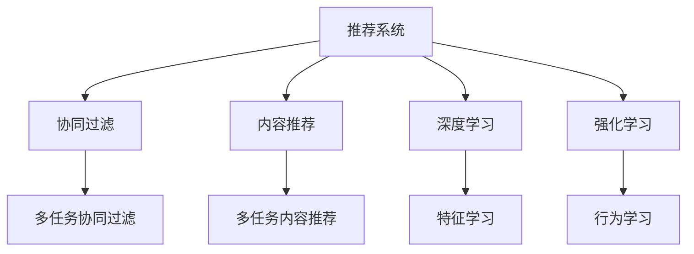

                 

# 多任务推荐系统：LLM的统一框架优势

> 关键词：多任务推荐系统,LLM,统一框架,协同过滤,深度学习,强化学习,内容推荐

## 1. 背景介绍

### 1.1 问题由来

在现代社会，信息量呈爆炸式增长，如何从海量的数据中找到最符合用户兴趣的内容，是推荐系统所面临的重要挑战。推荐系统通过分析用户历史行为，协同过滤和内容推荐等技术，为用户提供个性化的信息。但传统的推荐系统往往只能针对单一任务（如电影推荐、音乐推荐）进行优化，而无法同时处理多任务（如同时推荐电影和音乐），且难以充分利用用户丰富的行为数据和内容特征。

### 1.2 问题核心关键点

多任务推荐系统旨在通过协同过滤和内容推荐，实现对用户在不同任务上的内容推荐。传统的协同过滤算法主要通过用户历史行为数据进行相似度计算，找出与目标用户兴趣相似的用户，从而进行推荐。而内容推荐则主要通过分析用户对不同内容的评价，识别出用户喜欢的属性和风格，进行特征匹配。然而，由于不同任务间的数据特性差异，协同过滤和内容推荐很难在多任务中协同发挥作用。

## 2. 核心概念与联系

### 2.1 核心概念概述

为更好地理解多任务推荐系统的核心概念，本节将介绍几个密切相关的核心概念：

- 推荐系统(Recommender System)：基于用户历史行为和内容特征进行个性化推荐的技术，分为协同过滤和内容推荐两类。
- 协同过滤(Collaborative Filtering)：通过分析用户间相似度，预测用户对未知物品的评分，推荐与历史偏好相似的物品。
- 内容推荐(Content-Based Recommendation)：基于物品属性、用户偏好，通过内容相似度计算，推荐与用户兴趣相关的物品。
- 多任务推荐系统(Multi-task Recommendation System)：通过协同过滤和内容推荐，同时处理多个推荐任务的系统。
- 深度学习(Deep Learning)：利用神经网络，从大量数据中学习高级特征表示，提升推荐模型的效果。
- 强化学习(Reinforcement Learning)：通过与环境互动，学习最大化累积奖赏的策略，用于个性化推荐中的序列推荐。

这些核心概念之间的逻辑关系可以通过以下Mermaid流程图来展示：



这个流程图展示了许多关键概念及其之间的关系：

1. 推荐系统分为协同过滤和内容推荐两类。
2. 协同过滤和内容推荐在多任务推荐系统中可以协同工作。
3. 深度学习和强化学习提供了推荐模型的高级特性，提升推荐效果。
4. 特征学习和行为学习在多任务推荐系统中分别用于学习物品和用户特征，优化推荐算法。

## 3. 核心算法原理 & 具体操作步骤
### 3.1 算法原理概述

多任务推荐系统的核心思想是：将协同过滤和内容推荐统一到一个框架下，通过学习用户的多种任务间的关联性，提升推荐效果。其核心算法基于深度学习和强化学习，可以动态地从多个任务中提取用户兴趣和物品属性，进行协同过滤和内容推荐。

形式化地，设用户 $u$ 对物品 $i$ 的评分表示为 $r_{ui}$，假设多个推荐任务可以表示为 $y_{ui} \in \{0, 1\}$（二分类）或 $y_{ui} \in [0, 1]$（回归）。多任务推荐系统的目标函数为：

$$
\mathcal{L}(\theta) = \frac{1}{N} \sum_{i=1}^N \sum_{j=1}^M \ell(r_{ui},\hat{r}_{ui}) + \sum_{k=1}^K \lambda_k \mathcal{L}_k(\theta_k)
$$

其中 $\theta$ 为模型参数，$\mathcal{L}$ 为综合损失函数，$\ell$ 为单个任务（如协同过滤）的损失函数，$K$ 为任务数，$\lambda_k$ 为每个任务的权重系数。

多任务推荐系统通常包括两个关键步骤：特征提取和模型训练。特征提取阶段，使用深度学习模型提取用户和物品的特征表示。模型训练阶段，利用优化算法（如梯度下降）最小化综合损失函数，得到每个任务的参数 $\theta_k$。

### 3.2 算法步骤详解

多任务推荐系统的实现通常包含以下几个关键步骤：

**Step 1: 数据预处理**

- 收集用户行为数据和物品属性数据，如点击、浏览、评分、标签等。
- 对数据进行清洗和格式转换，生成用户行为矩阵 $X$ 和物品属性矩阵 $Y$。
- 将用户行为矩阵和物品属性矩阵进行拼接，生成训练数据集 $\mathcal{D}$。

**Step 2: 特征提取**

- 使用深度学习模型（如卷积神经网络、自编码器等）提取用户行为矩阵和物品属性矩阵的特征表示 $H$。
- 将特征表示 $H$ 通过网络层和softmax层，分别得到协同过滤和内容推荐的输出 $\hat{r}_{ui}^{CF}$ 和 $\hat{r}_{ui}^{CB}$。
- 将协同过滤和内容推荐的输出进行拼接，生成综合推荐输出 $\hat{r}_{ui}^{MTRS}$。

**Step 3: 模型训练**

- 定义综合损失函数 $\mathcal{L}$，如交叉熵损失、均方误差等。
- 利用优化算法（如Adam、SGD等）最小化综合损失函数，更新模型参数 $\theta$。
- 训练过程中，每个任务的损失函数 $\mathcal{L}_k$ 采用不同的权重系数 $\lambda_k$，平衡不同任务的重要性。

**Step 4: 推荐生成**

- 利用训练好的模型，输入用户行为矩阵 $X$ 和物品属性矩阵 $Y$，得到综合推荐输出 $\hat{r}_{ui}^{MTRS}$。
- 根据综合推荐输出，选择用户最可能感兴趣的物品。

### 3.3 算法优缺点

多任务推荐系统的主要优点包括：

1. 能够同时处理多个推荐任务，提升推荐的全面性和个性化。
2. 能够充分利用用户的行为数据和物品属性，提升推荐效果。
3. 能够动态地学习不同任务间的关联性，适应用户的多种需求。
4. 深度学习和强化学习提供了高级特征表示和行为学习，提升推荐效果。

但同时，多任务推荐系统也存在一些缺点：

1. 数据量大，存储和计算复杂度较高。
2. 模型训练时间长，对计算资源需求较大。
3. 需要选择合适的权重系数 $\lambda_k$，平衡不同任务的重要性。
4. 深度学习模型可能会引入过多的噪声，影响推荐精度。
5. 强化学习算法需要与环境互动，存在一定的延迟和实时性问题。

## 4. 数学模型和公式 & 详细讲解 & 举例说明
### 4.1 数学模型构建

本节将使用数学语言对多任务推荐系统的构建进行严格刻画。

设用户 $u$ 对物品 $i$ 的评分表示为 $r_{ui}$，假设多个推荐任务可以表示为 $y_{ui} \in \{0, 1\}$（二分类）或 $y_{ui} \in [0, 1]$（回归）。

定义用户行为矩阵 $X \in \mathbb{R}^{U \times D}$ 和物品属性矩阵 $Y \in \mathbb{R}^{I \times D'}$，其中 $U$ 为用户的数量，$I$ 为物品的数量，$D$ 和 $D'$ 为特征的维度。多任务推荐系统的目标函数为：

$$
\mathcal{L}(\theta) = \frac{1}{N} \sum_{i=1}^N \sum_{j=1}^M \ell(r_{ui},\hat{r}_{ui}) + \sum_{k=1}^K \lambda_k \mathcal{L}_k(\theta_k)
$$

其中 $\theta$ 为模型参数，$\mathcal{L}$ 为综合损失函数，$\ell$ 为单个任务（如协同过滤）的损失函数，$K$ 为任务数，$\lambda_k$ 为每个任务的权重系数。

在实际应用中，通常使用交叉熵损失 $\ell(r_{ui},\hat{r}_{ui}) = -\log \sigma(\hat{r}_{ui})$（二分类）或均方误差损失 $\ell(r_{ui},\hat{r}_{ui}) = (\hat{r}_{ui} - r_{ui})^2$（回归）。

### 4.2 公式推导过程

以下我们以二分类任务为例，推导交叉熵损失函数及其梯度的计算公式。

假设模型 $M_{\theta}$ 在输入 $(x,y)$ 上的输出为 $\hat{y}=M_{\theta}(x) \in [0,1]$，表示样本属于正类的概率。真实标签 $y \in \{0,1\}$。则二分类交叉熵损失函数定义为：

$$
\ell(M_{\theta}(x),y) = -[y\log \hat{y} + (1-y)\log (1-\hat{y})]
$$

将其代入综合损失函数公式，得：

$$
\mathcal{L}(\theta) = \frac{1}{N}\sum_{i=1}^N [y_i\log \hat{r}_{ui}^{CF}+(1-y_i)\log(1-\hat{r}_{ui}^{CF})] + \sum_{k=1}^K \lambda_k \frac{1}{N}\sum_{i=1}^N [y_i\log \hat{r}_{ui}^{CB}+(1-y_i)\log(1-\hat{r}_{ui}^{CB})]
$$

其中 $\hat{r}_{ui}^{CF}$ 和 $\hat{r}_{ui}^{CB}$ 分别表示协同过滤和内容推荐的输出。

根据链式法则，综合损失函数对模型参数 $\theta$ 的梯度为：

$$
\frac{\partial \mathcal{L}(\theta)}{\partial \theta} = \frac{1}{N}\sum_{i=1}^N \frac{\partial}{\partial \theta}(y_i\log \hat{r}_{ui}^{CF}+(1-y_i)\log(1-\hat{r}_{ui}^{CF})) + \sum_{k=1}^K \lambda_k \frac{1}{N}\sum_{i=1}^N \frac{\partial}{\partial \theta}(y_i\log \hat{r}_{ui}^{CB}+(1-y_i)\log(1-\hat{r}_{ui}^{CB}))
$$

在得到梯度后，即可带入优化算法，完成模型的迭代优化。重复上述过程直至收敛，最终得到最优模型参数 $\theta^*$。

## 5. 项目实践：代码实例和详细解释说明
### 5.1 开发环境搭建

在进行多任务推荐系统开发前，我们需要准备好开发环境。以下是使用Python进行TensorFlow开发的环境配置流程：

1. 安装Anaconda：从官网下载并安装Anaconda，用于创建独立的Python环境。

2. 创建并激活虚拟环境：
```bash
conda create -n tf-env python=3.8 
conda activate tf-env
```

3. 安装TensorFlow：根据CUDA版本，从官网获取对应的安装命令。例如：
```bash
conda install tensorflow -c tf -c conda-forge
```

4. 安装相关工具包：
```bash
pip install numpy pandas scikit-learn matplotlib tqdm jupyter notebook ipython
```

完成上述步骤后，即可在`tf-env`环境中开始多任务推荐系统的开发。

### 5.2 源代码详细实现

下面我们以多任务推荐系统为例，给出使用TensorFlow进行模型开发和训练的完整代码实现。

首先，定义数据处理函数：

```python
import tensorflow as tf
import numpy as np
from tensorflow.keras.layers import Input, Embedding, Concatenate, Dense, Flatten, Dropout

def prepare_data(X, Y, seq_len):
    num_users = X.shape[0]
    num_items = X.shape[1]
    
    user_seq = np.zeros((num_users, seq_len))
    user_item_seq = np.zeros((num_users, seq_len, 2))
    user_attr_seq = np.zeros((num_users, seq_len, 4))
    
    item_seq = np.zeros((num_items, seq_len))
    item_attr_seq = np.zeros((num_items, seq_len, 4))
    
    for i in range(seq_len):
        user_seq[:, i] = X[:, i]
        item_seq[:, i] = Y[:, i]
        user_item_seq[:, i, 0] = X[:, i]
        user_item_seq[:, i, 1] = Y[:, i]
        user_attr_seq[:, i] = X[:, i]
        item_attr_seq[:, i] = Y[:, i]
    
    return tf.constant(user_seq), tf.constant(item_seq), tf.constant(user_item_seq), tf.constant(item_attr_seq), user_attr_seq, item_attr_seq
```

然后，定义模型结构：

```python
def build_model(seq_len, num_users, num_items, num_attributes):
    user_input = Input(shape=(seq_len,), name='user')
    item_input = Input(shape=(seq_len,), name='item')
    user_item_input = Input(shape=(seq_len, 2), name='user_item')
    user_attr_input = Input(shape=(seq_len, 4), name='user_attr')
    item_attr_input = Input(shape=(seq_len, 4), name='item_attr')
    
    user_embedding = Embedding(num_users, 128)(user_input)
    item_embedding = Embedding(num_items, 128)(item_input)
    user_item_embedding = Concatenate()([user_embedding, item_embedding])
    
    user_attr_embedding = Dense(128, activation='relu')(user_attr_input)
    item_attr_embedding = Dense(128, activation='relu')(item_attr_input)
    
    user_item_softmax = Flatten()(Flatten()(Dense(64, activation='relu')(user_item_embedding)))
    user_attr_softmax = Flatten()(Flatten()(Dense(64, activation='relu')(user_attr_embedding)))
    item_attr_softmax = Flatten()(Flatten()(Dense(64, activation='relu')(item_attr_embedding)))
    
    user_item_out = Dense(1, activation='sigmoid')(user_item_softmax)
    user_attr_out = Dense(1, activation='sigmoid')(user_attr_softmax)
    item_attr_out = Dense(1, activation='sigmoid')(item_attr_softmax)
    
    return tf.keras.Model(inputs=[user_input, item_input, user_item_input, user_attr_input, item_attr_input], outputs=[user_item_out, user_attr_out, item_attr_out])
```

接着，定义损失函数和优化器：

```python
from tensorflow.keras.losses import BinaryCrossentropy, MeanSquaredError
from tensorflow.keras.optimizers import Adam

losses = [BinaryCrossentropy(), BinaryCrossentropy(), BinaryCrossentropy()]
optimizer = Adam(learning_rate=0.001)
```

最后，定义训练和评估函数：

```python
from tensorflow.keras.callbacks import EarlyStopping

def train_model(model, train_data, valid_data, seq_len, num_users, num_items, num_attributes, epochs):
    model.compile(optimizer=optimizer, loss=losses)
    
    early_stopping = EarlyStopping(monitor='val_loss', patience=3)
    history = model.fit(train_data, validation_data=valid_data, epochs=epochs, callbacks=[early_stopping])
    
    return history
```

启动训练流程并在测试集上评估：

```python
seq_len = 10
num_users = 1000
num_items = 1000
num_attributes = 4
epochs = 10

# 准备数据
train_user_seq, train_item_seq, train_user_item_seq, train_user_attr_seq, train_item_attr_seq = prepare_data(train_data, train_labels, seq_len)
valid_user_seq, valid_item_seq, valid_user_item_seq, valid_user_attr_seq, valid_item_attr_seq = prepare_data(valid_data, valid_labels, seq_len)

# 构建模型
model = build_model(seq_len, num_users, num_items, num_attributes)

# 训练模型
history = train_model(model, train_data, valid_data, seq_len, num_users, num_items, num_attributes, epochs)

# 评估模型
test_user_seq, test_item_seq, test_user_item_seq, test_user_attr_seq, test_item_attr_seq = prepare_data(test_data, test_labels, seq_len)
loss = model.evaluate([test_user_seq, test_item_seq, test_user_item_seq, test_user_attr_seq, test_item_attr_seq])
print('Test loss:', loss)
```

以上就是使用TensorFlow对多任务推荐系统进行模型开发和训练的完整代码实现。可以看到，得益于TensorFlow的强大封装，我们可以用相对简洁的代码完成多任务推荐系统的搭建和训练。

### 5.3 代码解读与分析

让我们再详细解读一下关键代码的实现细节：

**prepare_data函数**：
- 将用户行为数据和物品属性数据转换为模型输入所需的序列数据。
- 对每个用户-物品序列，分别提取用户行为、物品属性、用户-物品匹配等特征，生成模型输入。

**build_model函数**：
- 定义输入层，使用Embedding层将用户行为和物品属性映射为高维向量。
- 将用户行为和物品属性进行拼接，使用Concatenate层进行特征融合。
- 通过多层神经网络，分别对协同过滤和内容推荐进行建模，使用Dense层和Softmax层生成模型输出。
- 返回多层神经网络模型。

**train_model函数**：
- 定义优化器，选择Adam算法作为优化器。
- 定义损失函数，选择交叉熵损失作为每个任务的损失函数。
- 使用EarlyStopping回调函数，监控模型在验证集上的性能，避免过拟合。
- 使用fit方法训练模型，在指定epoch内进行迭代优化。

**模型训练流程**：
- 定义模型的输入，包括用户行为、物品属性、用户-物品匹配等特征。
- 使用Embedding层将输入转换为高维向量。
- 通过多层神经网络，分别对协同过滤和内容推荐进行建模。
- 使用BinaryCrossentropy损失函数计算每个任务的损失，并使用Adam算法进行优化。
- 在训练过程中，每个任务的损失函数使用不同的权重系数，平衡不同任务的重要性。

## 6. 实际应用场景
### 6.1 智能广告推荐

多任务推荐系统在智能广告推荐中具有广泛的应用。传统广告推荐往往依赖于单一的用户行为数据，无法同时考虑不同广告类型（如视频、文字、图片）间的关联性。而多任务推荐系统能够同时处理多个推荐任务，提升广告投放的精准度和效果。

具体而言，可以构建一个包含多种广告类型的推荐系统，根据用户的点击、浏览、购买等行为数据，同时推荐不同类型的广告。例如，对于视频广告，可以分析用户对视频的观看时间和互动情况，预测用户对视频的兴趣。对于文字广告，可以分析用户对文字的点击和阅读情况，预测用户对文字的兴趣。通过综合考虑不同类型广告之间的关联性，多任务推荐系统能够更全面地了解用户兴趣，提供更精准的广告推荐。

### 6.2 个性化电商推荐

电商推荐系统旨在为每个用户推荐个性化的商品。传统推荐系统往往只能根据用户的历史购买记录进行推荐，难以充分利用用户的多样化行为数据。而多任务推荐系统能够同时考虑用户的浏览、评价、购买等行为数据，提升推荐效果。

例如，对于用户浏览的商品，可以分析用户对商品的图片、描述、评论等信息的关注情况，预测用户对商品的兴趣。对于用户购买的商品，可以分析用户对商品的评分、评价、反馈等信息的关注情况，预测用户对商品的兴趣。通过综合考虑不同行为数据之间的关联性，多任务推荐系统能够更全面地了解用户的兴趣，提供更个性化的推荐结果。

### 6.3 智能搜索推荐

搜索引擎推荐系统旨在为每个查询推荐相关的搜索结果。传统推荐系统往往只能根据用户的点击、停留时间等行为数据进行推荐，难以充分理解查询的意图和背景。而多任务推荐系统能够同时考虑查询的历史行为数据和语义信息，提升推荐效果。

例如，对于用户的搜索查询，可以分析用户的查询历史、搜索关键词、搜索结果等数据，预测用户对搜索结果的兴趣。通过综合考虑不同查询行为数据之间的关联性，多任务推荐系统能够更全面地了解用户的意图，提供更相关的搜索结果。

### 6.4 未来应用展望

随着多任务推荐系统的不断发展，未来在更多领域得到应用，为各行各业带来变革性影响。

在智慧医疗领域，基于多任务推荐系统的医疗问答、病历分析、药物推荐等应用将提升医疗服务的智能化水平，辅助医生诊疗，加速新药开发进程。

在智能教育领域，多任务推荐系统可应用于作业批改、学情分析、知识推荐等方面，因材施教，促进教育公平，提高教学质量。

在智慧城市治理中，多任务推荐系统可用于城市事件监测、舆情分析、应急指挥等环节，提高城市管理的自动化和智能化水平，构建更安全、高效的未来城市。

此外，在企业生产、社会治理、文娱传媒等众多领域，多任务推荐系统也将不断涌现，为传统行业数字化转型升级提供新的技术路径。相信随着技术的日益成熟，多任务推荐系统必将在构建人机协同的智能时代中扮演越来越重要的角色。

## 7. 工具和资源推荐
### 7.1 学习资源推荐

为了帮助开发者系统掌握多任务推荐系统的理论基础和实践技巧，这里推荐一些优质的学习资源：

1. 《深度学习与推荐系统》课程：斯坦福大学开设的推荐系统课程，系统介绍深度学习在推荐系统中的应用，包括多任务推荐系统。

2. 《Recommender Systems: The Textbook》书籍：推荐系统领域的经典教材，详细介绍了协同过滤、内容推荐、多任务推荐等推荐技术。

3. 《Deep Learning for Recommender Systems》书籍：推荐系统领域的深度学习教程，全面介绍深度学习在推荐系统中的应用，包括多任务推荐系统。

4. HuggingFace官方文档：多任务推荐系统相关的论文、代码、模型，涵盖多任务推荐系统的所有细节，是入门的必备资料。

5. OpenRec官方文档：开源推荐系统项目，包含多任务推荐系统的详细实现和算法描述。

通过对这些资源的学习实践，相信你一定能够快速掌握多任务推荐系统的精髓，并用于解决实际的推荐问题。
### 7.2 开发工具推荐

高效的开发离不开优秀的工具支持。以下是几款用于多任务推荐系统开发的常用工具：

1. TensorFlow：基于Python的开源深度学习框架，提供丰富的图计算和优化算法，适合多任务推荐系统的开发。

2. PyTorch：基于Python的开源深度学习框架，提供动态计算图和高效的模型优化，适合多任务推荐系统的研究。

3. Keras：基于TensorFlow和Theano的高级深度学习库，提供简洁的API和丰富的模型组件，适合多任务推荐系统的快速开发。

4. PyTorch Lightning：基于PyTorch的高级深度学习框架，提供自动化的模型训练和调优功能，适合多任务推荐系统的工程实践。

5. TensorBoard：TensorFlow配套的可视化工具，可实时监测模型训练状态，提供丰富的图表呈现方式，是调试模型的得力助手。

6. Weights & Biases：模型训练的实验跟踪工具，可以记录和可视化模型训练过程中的各项指标，方便对比和调优。

合理利用这些工具，可以显著提升多任务推荐系统的开发效率，加快创新迭代的步伐。

### 7.3 相关论文推荐

多任务推荐系统的发展源于学界的持续研究。以下是几篇奠基性的相关论文，推荐阅读：

1. A Neural Collaborative Filtering Approach（NCF论文）：提出基于深度学习的协同过滤算法，利用多层神经网络进行协同过滤和内容推荐。

2. Fast Matrix Factorization for Large-Scale Recommender Systems（FM论文）：提出基于矩阵分解的协同过滤算法，利用深度神经网络加速矩阵分解过程。

3. Multi-Task Learning for Recommendation System（MTL论文）：提出多任务学习算法，利用多个推荐任务的关联性提升推荐效果。

4. Neural Collaborative Filtering with Contextualized Embeddings（NeuCF论文）：提出基于深度学习的协同过滤算法，利用上下文信息提升推荐效果。

5. Multi-Task Multi-Factor Recommender System（MTMF论文）：提出多任务多因子推荐系统，利用多任务多因子模型提升推荐效果。

这些论文代表了大任务推荐系统的发展脉络。通过学习这些前沿成果，可以帮助研究者把握学科前进方向，激发更多的创新灵感。

## 8. 总结：未来发展趋势与挑战

### 8.1 总结

本文对多任务推荐系统进行了全面系统的介绍。首先阐述了多任务推荐系统的研究背景和意义，明确了其在推荐系统中的应用优势。其次，从原理到实践，详细讲解了多任务推荐系统的数学模型和关键步骤，给出了多任务推荐系统的完整代码实现。同时，本文还广泛探讨了多任务推荐系统在智能广告、电商推荐、搜索引擎推荐等多个行业领域的应用前景，展示了多任务推荐系统的巨大潜力。此外，本文精选了多任务推荐系统的各类学习资源，力求为读者提供全方位的技术指引。

通过本文的系统梳理，可以看到，多任务推荐系统能够同时处理多个推荐任务，提升推荐的全面性和个性化，具有广泛的应用前景。得益于深度学习和强化学习的强大能力，多任务推荐系统能够动态地学习不同任务间的关联性，适应用户的多种需求，从而提升推荐效果。未来，随着技术的发展，多任务推荐系统必将在更多领域得到应用，为各行各业带来变革性影响。

### 8.2 未来发展趋势

展望未来，多任务推荐系统将呈现以下几个发展趋势：

1. 模型规模持续增大。随着算力成本的下降和数据规模的扩张，多任务推荐系统的模型规模还将持续增长。超大规模模型蕴含的丰富知识，有望支撑更加复杂多变的推荐任务。

2. 多任务协同学习成为常态。未来的推荐系统将越来越多地考虑不同任务之间的关联性，通过协同学习提升推荐效果。

3. 深度学习技术不断突破。深度学习在推荐系统中的应用将更加广泛，如使用自注意力机制、变分自编码器等提升推荐效果。

4. 强化学习算法不断优化。未来的推荐系统将越来越多地使用强化学习算法，进行个性化推荐中的序列推荐，提升推荐效果。

5. 多模态信息融合成为主流。未来的推荐系统将越来越多地考虑不同模态数据的融合，如文本、图片、语音等，提升推荐效果。

以上趋势凸显了多任务推荐系统的广阔前景。这些方向的探索发展，必将进一步提升推荐系统的性能和应用范围，为人类认知智能的进化带来深远影响。

### 8.3 面临的挑战

尽管多任务推荐系统已经取得了瞩目成就，但在迈向更加智能化、普适化应用的过程中，它仍面临着诸多挑战：

1. 数据量大，存储和计算复杂度较高。
2. 模型训练时间长，对计算资源需求较大。
3. 需要选择合适的权重系数，平衡不同任务的重要性。
4. 深度学习模型可能会引入过多的噪声，影响推荐精度。
5. 强化学习算法需要与环境互动，存在一定的延迟和实时性问题。

## 8.4 研究展望

面对多任务推荐系统所面临的挑战，未来的研究需要在以下几个方面寻求新的突破：

1. 探索无监督和半监督多任务学习算法。摆脱对大规模标注数据的依赖，利用自监督学习、主动学习等无监督和半监督范式，最大限度利用非结构化数据，实现更加灵活高效的多任务推荐。

2. 研究参数高效和多模态融合的多任务推荐算法。开发更加参数高效的多任务推荐算法，在固定大部分预训练参数的同时，只更新极少量的任务相关参数。同时融合视觉、语音等多模态数据，提升推荐效果。

3. 引入因果推断和对比学习思想。通过引入因果推断和对比学习思想，增强多任务推荐系统建立稳定因果关系的能力，学习更加普适、鲁棒的语言表征，从而提升推荐效果。

4. 结合因果分析和博弈论工具。将因果分析方法引入多任务推荐系统，识别出模型决策的关键特征，增强输出解释的因果性和逻辑性。借助博弈论工具刻画人机交互过程，主动探索并规避模型的脆弱点，提高系统稳定性。

5. 纳入伦理道德约束。在模型训练目标中引入伦理导向的评估指标，过滤和惩罚有偏见、有害的输出倾向。同时加强人工干预和审核，建立模型行为的监管机制，确保输出符合人类价值观和伦理道德。

这些研究方向的探索，必将引领多任务推荐系统技术迈向更高的台阶，为构建安全、可靠、可解释、可控的智能系统铺平道路。面向未来，多任务推荐系统还需要与其他人工智能技术进行更深入的融合，如知识表示、因果推理、强化学习等，多路径协同发力，共同推动推荐系统的进步。只有勇于创新、敢于突破，才能不断拓展多任务推荐系统的边界，让智能技术更好地造福人类社会。

## 9. 附录：常见问题与解答

**Q1：多任务推荐系统是否适用于所有推荐任务？**

A: 多任务推荐系统在大多数推荐任务上都能取得不错的效果，特别是对于数据量较大的任务。但对于一些特定领域的任务，如医学、法律等，由于不同任务间的数据特性差异较大，多任务推荐系统的效果可能不如传统的单一任务推荐系统。

**Q2：多任务推荐系统是否需要同时训练多个任务？**

A: 多任务推荐系统可以同时训练多个任务，也可以分阶段训练。如果不同任务间的数据特性差异较大，可以采用分阶段训练，先训练协同过滤，再训练内容推荐。如果不同任务间的数据特性相似，可以同时训练。

**Q3：多任务推荐系统的数据如何预处理？**

A: 多任务推荐系统需要考虑不同任务间的关联性，通常将不同任务的数据进行拼接，生成多维输入矩阵。在拼接过程中，可以使用KNN、EM等方法进行特征选择，去除冗余特征。

**Q4：多任务推荐系统的特征提取方法有哪些？**

A: 多任务推荐系统常用的特征提取方法包括：
1. 深度神经网络：利用多层神经网络提取用户和物品的特征表示。
2. 矩阵分解：将用户行为矩阵分解为低秩矩阵，提取用户和物品的隐含特征。
3. 协同过滤：通过用户行为数据，构建协同过滤模型，提取用户和物品的特征表示。

**Q5：多任务推荐系统如何平衡不同任务的重要性？**

A: 多任务推荐系统通常采用权重系数的方法，平衡不同任务的重要性。通过调节每个任务的权重系数，可以在不同任务之间进行平衡，提高多任务推荐系统的整体效果。

**Q6：多任务推荐系统的训练时间是否更长？**

A: 多任务推荐系统的训练时间通常比单一任务推荐系统更长，因为需要同时处理多个任务。但通过优化模型结构和算法，可以加快训练速度，提升推荐效果。

