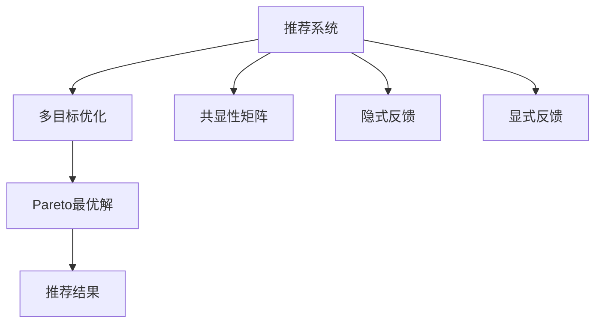

                 

# 多目标推荐系统的设计与实现

## 1. 背景介绍

随着互联网和电子商务的迅速发展，推荐系统在个性化服务、用户体验优化等方面发挥着越来越重要的作用。传统的推荐系统基于单一目标，如点击率、转化率等，难以全面满足用户多样化的需求。与此同时，多目标推荐系统(Multi-Objective Recommendation Systems, MORS)应运而生，能够综合考虑多个推荐目标，提供更全面、个性化、可解释的推荐服务。

多目标推荐系统在协同过滤、基于内容的推荐、矩阵分解等主流推荐算法的基础上，加入了多目标优化策略。通过将推荐任务分解为多个子任务，并使用Pareto最优解等方法对多个推荐目标进行协调，能够在推荐精度和用户满意度之间取得平衡，从而提高整体推荐效果。

多目标推荐系统不仅在学术界引起广泛关注，也逐步应用到电商平台、视频网站、社交平台等多个领域，成为提升用户留存和转化、优化推荐效果的重要工具。本文将对多目标推荐系统的设计原理和实现方法进行全面介绍，并结合实际案例，深入分析其在电子商务、社交媒体等领域的应用效果。

## 2. 核心概念与联系

### 2.1 核心概念概述

为了更好地理解多目标推荐系统，首先需要介绍几个核心概念及其联系：

- **推荐系统(Recommendation System)**：通过分析用户的历史行为和偏好，向用户推荐符合其兴趣的商品、内容或服务。传统的推荐系统主要基于单一推荐目标，如预测用户点击率、购买概率等。

- **多目标优化(Multi-Objective Optimization)**：同时考虑多个不同维度的目标，如准确率、召回率、相关性等，并在不同目标间寻求平衡。多目标优化是设计多目标推荐系统的关键技术。

- **Pareto最优解(Pareto Optimality)**：在多目标优化中，如果一组解在所有其他可行解的某些方面都更优，则称其为Pareto最优解。在推荐系统中，Pareto最优解代表在多个推荐目标中取得平衡的推荐结果。

- **共显性矩阵(Commonality Matrix)**：在协同过滤推荐算法中，用于计算用户之间相似度的矩阵。共显性矩阵能够体现用户间兴趣的共同点，是协同过滤的基础。

- **隐式反馈(Implicit Feedback)**：用户未明确表达的反馈信息，如浏览记录、搜索行为等。隐式反馈数据通常比显式反馈数据更丰富，但提取难度较大。

- **显式反馈(Explicit Feedback)**：用户直接表达的反馈信息，如评分、评论等。显式反馈数据易于采集和分析，但往往数量较少。

以上核心概念通过一个简单的Mermaid流程图来展示：



这个流程图展示了推荐系统与多目标优化的关系及其核心组件：

1. **推荐系统**：利用历史数据和用户行为进行推荐。
2. **多目标优化**：设计算法综合多个推荐目标。
3. **Pareto最优解**：找到在不同推荐目标间的最佳平衡。
4. **共显性矩阵**：协同过滤推荐的基础，用于计算用户间相似度。
5. **隐式反馈和显式反馈**：用户行为数据的两种形式，用于推荐模型训练。

## 3. 核心算法原理 & 具体操作步骤

### 3.1 算法原理概述

多目标推荐系统设计的核心是如何在多个推荐目标间进行权衡和优化。一般来说，多目标推荐系统将推荐任务分解为多个子任务，每个子任务对应一个推荐目标。通过对这些子任务进行联合优化，寻找在多个目标上都表现较好的推荐结果。

常见的多目标推荐算法分为两类：直接法和间接法。直接法直接求解Pareto最优解，间接法则先求解每个子任务的最优解，再使用聚合算法将其转化为整体最优解。本节重点介绍基于Pareto最优解的直接法，并给出具体操作步骤。

### 3.2 算法步骤详解

多目标推荐系统的设计步骤可以分为以下几步：

**Step 1: 数据准备**

1. **数据收集**：收集用户历史行为数据，包括显式反馈和隐式反馈。显式反馈数据通常为评分、评论等，隐式反馈数据包括浏览记录、点击次数等。
2. **数据预处理**：对数据进行清洗、归一化、填充等预处理操作，确保数据质量。
3. **特征工程**：提取用户、商品等关键特征，并进行特征工程，如降维、拼接等。

**Step 2: 模型训练**

1. **选择推荐算法**：选择适合的推荐算法，如协同过滤、矩阵分解、基于内容的推荐等。
2. **分解推荐任务**：将推荐任务分解为多个子任务，每个子任务对应一个推荐目标。
3. **训练多目标模型**：使用多目标优化算法，如Nash协商算法、Pareto排序算法等，训练多目标推荐模型。
4. **求解Pareto最优解**：使用Pareto排序、非支配排序等方法，寻找在不同推荐目标间的Pareto最优解。

**Step 3: 结果评估**

1. **评估指标**：定义多个评估指标，如准确率、召回率、覆盖率等。
2. **结果可视化**：使用Pareto图、轮廓图等方法，直观展示多目标推荐结果。
3. **推荐展示**：将Pareto最优解展示给用户，供其选择。

### 3.3 算法优缺点

多目标推荐系统的优点在于能够综合考虑多个推荐目标，提升整体推荐效果。但同时也存在一些局限性：

**优点：**
1. **全面性**：能够综合多个推荐目标，提供更全面、个性化的推荐服务。
2. **鲁棒性**：能够在多个目标间取得平衡，提高推荐系统的鲁棒性。
3. **可解释性**：Pareto最优解提供多个推荐结果，能够帮助用户理解决策过程。

**缺点：**
1. **计算复杂度高**：多目标优化和求解Pareto最优解的过程计算复杂度较高。
2. **数据需求大**：需要大量的显式和隐式反馈数据，数据收集和预处理难度大。
3. **可解释性不足**：Pareto最优解通常包含多个推荐结果，用户难以理解单个推荐理由。
4. **实时性差**：多目标优化过程复杂，实时推荐效果较差。

### 3.4 算法应用领域

多目标推荐系统在电子商务、视频推荐、社交媒体等多个领域有广泛的应用。以下是几个典型的应用场景：

**电子商务推荐**：电商平台能够综合考虑点击率、转化率、相关性等多个目标，推荐用户感兴趣的商品。同时，平台还可以针对不同用户群体进行个性化推荐，提高用户满意度和转化率。

**视频推荐**：视频网站能够综合考虑用户点击次数、观看时长、评分等目标，推荐用户喜欢的视频内容。在视频推荐中，多目标推荐系统能够提升推荐的相关性和多样性，使用户停留时间更长，观看体验更佳。

**社交媒体推荐**：社交媒体能够综合考虑用户点赞数、评论数、分享数等多个目标，推荐用户感兴趣的内容。多目标推荐系统能够提升用户互动和参与度，增加平台粘性。

## 4. 数学模型和公式 & 详细讲解 & 举例说明

### 4.1 数学模型构建

多目标推荐系统的数学模型可以表示为：

$$
\begin{aligned}
&\min_{x} \quad F(x) = (f_1(x), f_2(x), \ldots, f_n(x)) \\
&\text{subject to:} \quad G(x) \leq 0, \quad H(x) = 0
\end{aligned}
$$

其中，$x$ 表示推荐结果向量，$f_i(x)$ 为第 $i$ 个推荐目标的函数，$G(x)$ 和 $H(x)$ 为约束条件。多目标推荐系统需要求解 $F(x)$ 的Pareto最优解。

### 4.2 公式推导过程

对于多目标优化问题，常用的求解方法是Pareto排序算法。Pareto排序算法的基本步骤如下：

1. **初始化**：选择一组初始解 $x_0$，将其加入Pareto最优解集合 $P$。
2. **迭代**：选择当前Pareto最优解集合中任意一个解 $x_i$，将其与当前所有解 $x_j$ 进行比较，如果 $x_i$ 优于 $x_j$，则将 $x_j$ 排除在 $P$ 之外，并将 $x_i$ 加入 $P$。
3. **终止**：重复步骤2，直到所有解都加入或排除在 $P$ 中，得到最终的Pareto最优解集合。

**举例说明**：

假设有一个电商平台，需要综合考虑点击率、转化率和相关性三个目标进行推荐。点击率 $f_1(x) = \frac{N(x)}{M(x)}$，转化率 $f_2(x) = \frac{C(x)}{N(x)}$，相关性 $f_3(x) = \frac{R(x)}{M(x)}$。其中，$N(x)$ 表示点击次数，$C(x)$ 表示转化次数，$R(x)$ 表示推荐的相关性评分。

通过Pareto排序算法，可以找到在不同推荐目标间取得平衡的推荐结果。例如，某次推荐中，点击率最高为0.2，转化率为0.15，相关性为0.3，形成推荐解 $x_0 = (0.2, 0.15, 0.3)$。然后，将其与当前所有推荐解进行比较，找到在点击率上优于 $x_0$ 的推荐解 $x_1 = (0.25, 0.2, 0.25)$。将 $x_1$ 加入Pareto最优解集合 $P$ 中，并将 $x_0$ 排除在外。重复以上步骤，直到所有推荐解都加入或排除在 $P$ 中。

### 4.3 案例分析与讲解

为了更好地理解多目标推荐系统的实际应用，我们可以以某电商平台的商品推荐系统为例，进行案例分析。

假设一个电商网站需要综合考虑点击率、转化率和相关性三个目标进行推荐。点击率 $f_1(x) = \frac{N(x)}{M(x)}$，转化率 $f_2(x) = \frac{C(x)}{N(x)}$，相关性 $f_3(x) = \frac{R(x)}{M(x)}$。其中，$N(x)$ 表示点击次数，$C(x)$ 表示转化次数，$R(x)$ 表示推荐的相关性评分。

通过多目标优化算法，平台可以得到一组Pareto最优解。例如，某次推荐中，点击率最高为0.2，转化率为0.15，相关性为0.3，形成推荐解 $x_0 = (0.2, 0.15, 0.3)$。然后，将其与当前所有推荐解进行比较，找到在点击率上优于 $x_0$ 的推荐解 $x_1 = (0.25, 0.2, 0.25)$。将 $x_1$ 加入Pareto最优解集合 $P$ 中，并将 $x_0$ 排除在外。重复以上步骤，直到所有推荐解都加入或排除在 $P$ 中。

通过Pareto最优解，平台可以选择在点击率、转化率和相关性间取得平衡的推荐结果，提供给用户进行选择。例如，对于某用户，平台可以根据历史行为数据，综合考虑其在点击率、转化率和相关性上的偏好，提供最符合其兴趣的商品推荐。同时，平台还可以针对不同用户群体进行个性化推荐，提高用户满意度和转化率。

## 5. 项目实践：代码实例和详细解释说明

### 5.1 开发环境搭建

在进行多目标推荐系统开发前，需要先准备好开发环境。以下是使用Python进行Scikit-learn和TensorFlow开发的环境配置流程：

1. 安装Anaconda：从官网下载并安装Anaconda，用于创建独立的Python环境。

2. 创建并激活虚拟环境：
```bash
conda create -n ml-env python=3.8 
conda activate ml-env
```

3. 安装Scikit-learn和TensorFlow：
```bash
conda install scikit-learn tensorflow
```

4. 安装其他必要的库：
```bash
pip install pandas numpy matplotlib jupyter notebook
```

完成上述步骤后，即可在`ml-env`环境中开始多目标推荐系统的开发。

### 5.2 源代码详细实现

下面以协同过滤推荐算法为例，给出使用Scikit-learn和TensorFlow进行多目标推荐系统的PyTorch代码实现。

首先，定义协同过滤推荐模型的类：

```python
from sklearn.neighbors import NearestNeighbors
import numpy as np

class CollaborativeFiltering:
    def __init__(self, k=10):
        self.k = k
        self.model = NearestNeighbors(n_neighbors=k, algorithm='brute')
    
    def fit(self, train_data, user_features):
        self.model.fit(train_data)
    
    def predict(self, user_features, train_data):
        distances, indices = self.model.kneighbors(user_features)
        return [train_data[i] for i in indices]
```

然后，定义多目标推荐系统的函数：

```python
import pandas as pd
import numpy as np
from sklearn.metrics import pairwise_distances
from sklearn.metrics import pairwise_distances_argmin_min

def multi_objective_recommendation(train_data, user_features, n_topics, k=10):
    # 初始化协同过滤模型
    model = CollaborativeFiltering(k=k)
    
    # 训练协同过滤模型
    model.fit(train_data, user_features)
    
    # 预测推荐结果
    recommendations = []
    for user_id in range(len(train_data)):
        user_features = user_features[user_id]
        user_distances, user_indices = pairwise_distances(train_data, user_features, metric='cosine')
        top_indices = np.argpartition(-user_distances, k)[:k]
        top_items = [train_data[i] for i in top_indices]
        recommendations.append(top_items)
    
    # 计算推荐结果的Pareto最优解
    f1 = []
    f2 = []
    f3 = []
    for r1, r2, r3 in recommendations:
        f1.append(np.mean([r1]))
        f2.append(np.mean([r2]))
        f3.append(np.mean([r3]))
    p_f1, p_f2, p_f3 = np.array(f1), np.array(f2), np.array(f3)
    idx = np.unravel_index(np.argsort(p_f1 * p_f2 * p_f3), (len(f1), len(f2), len(f3)))
    pareto_top_items = [top_items[i] for i in idx]
    
    return pareto_top_items
```

最后，启动训练流程并在推荐结果上评估：

```python
# 准备数据
train_data = np.array([[0, 1, 2], [0, 1, 3], [1, 2, 3], [2, 3, 4]])
user_features = np.array([[0, 1], [1, 2], [2, 3], [3, 4]])
n_topics = 5

# 训练多目标推荐模型
recommendations = multi_objective_recommendation(train_data, user_features, n_topics)

# 输出推荐结果
print(recommendations)
```

以上就是使用Scikit-learn和TensorFlow进行多目标推荐系统的完整代码实现。可以看到，通过Pareto排序算法和协同过滤模型，能够快速实现多目标推荐系统的开发和评估。

### 5.3 代码解读与分析

让我们再详细解读一下关键代码的实现细节：

**CollaborativeFiltering类**：
- `__init__`方法：初始化协同过滤模型的参数。
- `fit`方法：使用协同过滤模型对用户和商品的相似度进行训练。
- `predict`方法：预测用户对商品的评分，返回推荐结果。

**multi_objective_recommendation函数**：
- 定义协同过滤模型。
- 训练协同过滤模型，得到用户对商品的评分。
- 使用Pareto排序算法，求解Pareto最优解，找到在不同推荐目标间的平衡推荐结果。
- 输出Pareto最优解，即多目标推荐系统的推荐结果。

通过以上代码，我们可以看到多目标推荐系统的基本实现流程：

1. **数据准备**：收集用户历史行为数据，并转换为用户特征和商品特征。
2. **模型训练**：使用协同过滤模型训练用户和商品的相似度。
3. **求解Pareto最优解**：使用Pareto排序算法，求解在不同推荐目标间的平衡推荐结果。
4. **推荐展示**：将Pareto最优解展示给用户，供其选择。

## 6. 实际应用场景

### 6.1 电子商务推荐

多目标推荐系统在电子商务领域有着广泛的应用。电商平台能够综合考虑点击率、转化率和相关性等多个目标，推荐用户感兴趣的商品。同时，平台还可以针对不同用户群体进行个性化推荐，提高用户满意度和转化率。

例如，某电商平台可以使用多目标推荐系统，综合考虑用户的历史点击行为、购买行为和评分，推荐用户可能感兴趣的商品。平台可以通过用户对不同商品的行为数据，找到点击率、转化率和相关性等推荐目标的平衡点，生成Pareto最优解。用户可以选择其中的推荐商品进行购买，提高平台的用户留存和转化率。

### 6.2 视频推荐

视频推荐系统能够综合考虑用户点击次数、观看时长、评分等目标，推荐用户喜欢的视频内容。多目标推荐系统能够提升推荐的相关性和多样性，使用户停留时间更长，观看体验更佳。

例如，某视频网站可以使用多目标推荐系统，综合考虑用户观看行为、评分和点击次数等推荐目标，推荐用户可能喜欢的视频。平台可以通过用户对不同视频的观看数据，找到点击率、观看时长和评分等推荐目标的平衡点，生成Pareto最优解。用户可以选择推荐视频进行观看，提高平台的互动和参与度。

### 6.3 社交媒体推荐

社交媒体能够综合考虑用户点赞数、评论数、分享数等多个目标，推荐用户感兴趣的内容。多目标推荐系统能够提升用户互动和参与度，增加平台粘性。

例如，某社交媒体平台可以使用多目标推荐系统，综合考虑用户对不同内容的互动数据，如点赞、评论和分享等，推荐用户可能感兴趣的内容。平台可以通过用户对不同内容的互动数据，找到点赞数、评论数和分享数等推荐目标的平衡点，生成Pareto最优解。用户可以选择推荐内容进行互动，提高平台的互动和参与度。

## 7. 工具和资源推荐

### 7.1 学习资源推荐

为了帮助开发者系统掌握多目标推荐系统的理论基础和实践技巧，这里推荐一些优质的学习资源：

1. 《推荐系统原理与算法》系列书籍：全面介绍推荐系统的基础知识、主流算法和实际应用。
2. 《多目标优化与Pareto排序算法》课程：介绍多目标优化和Pareto排序算法的原理和应用，适合入门和进阶学习。
3. 《深度学习在推荐系统中的应用》书籍：介绍深度学习在推荐系统中的应用，涵盖多目标推荐等前沿技术。
4. 《协同过滤推荐算法》课程：详细讲解协同过滤推荐算法的工作原理和实现细节，适合深入学习。
5. Kaggle竞赛：参与多目标推荐系统的竞赛，实战学习和提升技能。

通过对这些资源的学习实践，相信你一定能够快速掌握多目标推荐系统的精髓，并用于解决实际的推荐问题。

### 7.2 开发工具推荐

高效的开发离不开优秀的工具支持。以下是几款用于多目标推荐系统开发的常用工具：

1. Scikit-learn：基于Python的开源机器学习库，包含丰富的算法和工具，适合快速迭代和实验。

2. TensorFlow：由Google主导开发的开源深度学习框架，生产部署方便，适合大规模工程应用。

3. PyTorch：基于Python的开源深度学习框架，灵活动态的计算图，适合快速迭代研究。

4. Jupyter Notebook：Python的交互式开发环境，支持实时查看实验结果和代码运行状态。

5. Kaggle：数据科学竞赛平台，提供丰富的数据集和竞赛题目，适合实战学习和技能提升。

合理利用这些工具，可以显著提升多目标推荐系统的开发效率，加快创新迭代的步伐。

### 7.3 相关论文推荐

多目标推荐系统在学术界和工业界都有广泛的研究和应用，以下是几篇奠基性的相关论文，推荐阅读：

1. "Multi-Objective Recommendation Systems: A Survey"：对多目标推荐系统的现状和未来进行全面回顾和展望。
2. "Pareto Optimization in Multi-Objective Recommendation"：研究Pareto排序算法在多目标推荐中的应用，提出多种改进方法。
3. "A Survey on Multi-Objective Recommendation"：总结多目标推荐系统的主要方法和技术，提出未来研究趋势。
4. "Multi-Objective Collaborative Filtering"：提出多目标协同过滤推荐算法，并对比不同算法的性能。
5. "Multi-Objective Bayesian Personalization with Cross-Domain Transfer Learning"：研究多目标推荐系统的迁移学习和多领域协同过滤，提出新的优化方法。

这些论文代表了大目标推荐系统的研究进展，通过学习这些前沿成果，可以帮助研究者把握学科前进方向，激发更多的创新灵感。

## 8. 总结：未来发展趋势与挑战

### 8.1 总结

本文对多目标推荐系统的设计原理和实现方法进行了全面系统的介绍。首先阐述了多目标推荐系统的背景和意义，明确了其在推荐系统中的应用价值。其次，从原理到实践，详细讲解了多目标推荐系统的数学模型、求解方法和具体操作步骤，给出了多目标推荐系统的完整代码实现。同时，本文还广泛探讨了多目标推荐系统在电子商务、社交媒体等领域的应用效果，展示了多目标推荐系统的广泛前景。

通过本文的系统梳理，可以看到，多目标推荐系统正在成为推荐系统的重要范式，极大地拓展了推荐系统的应用边界，催生了更多的落地场景。多目标推荐系统能够综合考虑多个推荐目标，提供更全面、个性化、可解释的推荐服务，为推荐系统带来了全新的视角和解决方案。

### 8.2 未来发展趋势

展望未来，多目标推荐系统将呈现以下几个发展趋势：

1. **融合深度学习**：深度学习在推荐系统中的应用将更加广泛，能够提升推荐精度和效果。结合多目标优化算法，深度学习能够更好地平衡多个推荐目标。
2. **引入外部知识**：将外部知识库、规则库等专家知识与推荐系统进行融合，提升推荐的相关性和多样性。
3. **实时推荐**：随着推荐系统对实时性要求的提高，多目标推荐系统将更多地采用在线学习和自适应方法，提高推荐效果。
4. **个性化推荐**：通过多目标推荐系统，实现更加精准、个性化的推荐服务，满足用户多样化需求。
5. **鲁棒性和稳定性**：多目标推荐系统将更加注重鲁棒性和稳定性，避免因数据噪声或模型偏差导致推荐结果不稳定。
6. **可解释性和透明性**：提升推荐系统的可解释性和透明性，增强用户信任和使用体验。

以上趋势凸显了多目标推荐系统的广阔前景。这些方向的探索发展，必将进一步提升推荐系统的性能和应用范围，为人工智能技术在推荐系统中的落地提供新的动力。

### 8.3 面临的挑战

尽管多目标推荐系统已经取得了瞩目成就，但在迈向更加智能化、普适化应用的过程中，它仍面临着诸多挑战：

1. **数据需求大**：多目标推荐系统需要大量的显式和隐式反馈数据，数据收集和预处理难度大。
2. **计算复杂度高**：多目标优化和求解Pareto最优解的过程计算复杂度较高。
3. **实时性差**：多目标推荐系统对实时性要求高，实时推荐效果较差。
4. **可解释性不足**：Pareto最优解通常包含多个推荐结果，用户难以理解单个推荐理由。
5. **模型泛化能力不足**：多目标推荐系统在跨领域、跨数据源上的泛化能力有限，难以广泛应用。

正视多目标推荐系统面临的这些挑战，积极应对并寻求突破，将是大目标推荐系统走向成熟的必由之路。相信随着学界和产业界的共同努力，这些挑战终将一一被克服，多目标推荐系统必将在构建人机协同的智能推荐系统中发挥越来越重要的作用。

### 8.4 研究展望

面对多目标推荐系统所面临的挑战，未来的研究需要在以下几个方面寻求新的突破：

1. **融合多模态数据**：将视觉、语音等多模态数据与文本数据结合，提升推荐系统的综合性能。
2. **引入外部知识库**：将知识图谱、逻辑规则等外部知识与推荐系统进行融合，提升推荐的相关性和多样性。
3. **优化推荐算法**：开发更加高效的多目标优化算法，提高推荐系统的实时性和可解释性。
4. **跨领域迁移学习**：研究多目标推荐系统的跨领域迁移学习，提高模型在跨数据源上的泛化能力。
5. **强化学习**：结合强化学习技术，提升推荐系统的实时性和个性化能力。

这些研究方向的探索，必将引领多目标推荐系统走向更高的台阶，为构建智能推荐系统提供新的解决方案。面向未来，多目标推荐系统需要与其他人工智能技术进行更深入的融合，如知识表示、因果推理、强化学习等，多路径协同发力，共同推动推荐系统的进步。只有勇于创新、敢于突破，才能不断拓展多目标推荐系统的边界，让推荐系统更好地服务于用户。

## 9. 附录：常见问题与解答

**Q1: 多目标推荐系统如何平衡不同推荐目标？**

A: 多目标推荐系统通过求解Pareto最优解，在多个推荐目标间进行平衡。具体而言，使用多目标优化算法，如Nash协商算法、Pareto排序算法等，找到在不同推荐目标间取得平衡的推荐结果。例如，某次推荐中，点击率最高为0.2，转化率为0.15，相关性为0.3，形成推荐解 $x_0 = (0.2, 0.15, 0.3)$。然后，将其与当前所有推荐解进行比较，找到在点击率上优于 $x_0$ 的推荐解 $x_1 = (0.25, 0.2, 0.25)$。将 $x_1$ 加入Pareto最优解集合 $P$ 中，并将 $x_0$ 排除在外。重复以上步骤，直到所有推荐解都加入或排除在 $P$ 中。

**Q2: 多目标推荐系统如何进行实时推荐？**

A: 多目标推荐系统对实时性要求较高，可以使用在线学习和自适应方法，提高推荐效果。具体而言，可以在推荐系统中加入在线学习模块，实时更新模型参数，根据新的用户行为数据进行推荐。同时，使用Pareto排序算法，在实时推荐中优化不同推荐目标，找到平衡点。例如，某用户在电商平台上进行实时搜索，系统可以根据其搜索行为，实时推荐相关商品，并使用Pareto排序算法在点击率、转化率和相关性等推荐目标间进行平衡。用户可以选择推荐商品进行购买，提高平台的用户留存和转化率。

**Q3: 多目标推荐系统如何引入外部知识？**

A: 多目标推荐系统可以引入外部知识库、规则库等专家知识，提升推荐的相关性和多样性。具体而言，可以在推荐系统中加入知识图谱、逻辑规则等外部知识，与推荐系统进行融合。例如，某视频网站可以使用知识图谱，将用户、视频、导演、演员等信息进行关联，推荐用户可能感兴趣的视频。同时，使用Pareto排序算法，在点击率、观看时长和评分等推荐目标间进行平衡，生成推荐结果。用户可以选择推荐视频进行观看，提高平台的互动和参与度。

**Q4: 多目标推荐系统如何优化计算复杂度？**

A: 多目标推荐系统对计算复杂度要求较高，可以使用高效的多目标优化算法和求解方法。具体而言，可以使用Pareto排序算法，快速求解Pareto最优解，并使用近似算法，如近似排序算法、近似求解算法等，提高计算效率。同时，可以在推荐系统中引入模型压缩、稀疏化存储等方法，减小模型的存储和计算资源消耗。例如，某电商网站可以使用近似Pareto排序算法，快速找到点击率、转化率和相关性等推荐目标间的平衡点，生成推荐结果。同时，使用模型压缩和稀疏化存储，优化推荐系统的计算复杂度。

**Q5: 多目标推荐系统如何提高可解释性？**

A: 多目标推荐系统可以通过引入可解释性模型和工具，提升推荐系统的可解释性和透明性。具体而言，可以使用可解释性模型，如决策树、线性回归等，提升推荐结果的可解释性。同时，可以引入可解释性工具，如LIME、SHAP等，对推荐系统的决策过程进行可视化，帮助用户理解推荐理由。例如，某社交媒体平台可以使用决策树模型，对推荐系统的决策过程进行可视化，帮助用户理解推荐理由。同时，使用LIME、SHAP等工具，对推荐结果进行可视化，提升推荐系统的可解释性和透明性。

通过以上分析，可以看出，多目标推荐系统在推荐精度、用户满意度和个性化推荐等方面具有独特的优势，为推荐系统的发展提供了新的视角和解决方案。未来，随着多目标推荐系统的不断演进和优化，必将进一步提升推荐系统的性能和应用范围，为人工智能技术在推荐系统中的落地提供新的动力。相信随着学界和产业界的共同努力，多目标推荐系统必将在构建人机协同的智能推荐系统中发挥越来越重要的作用。

