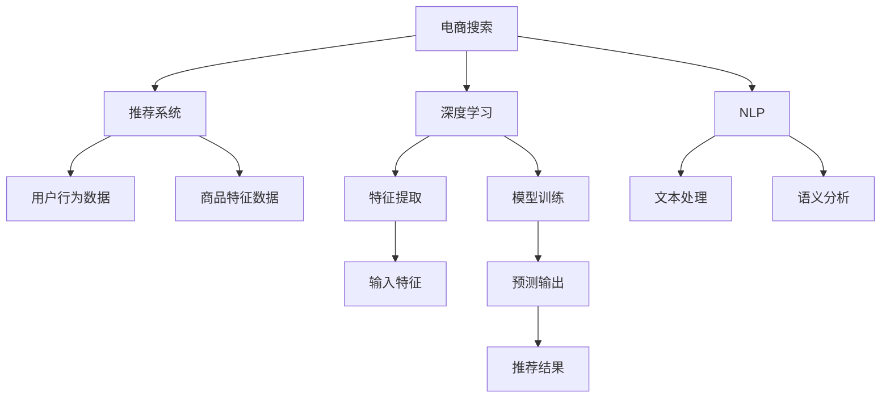

                 

## 1. 背景介绍

随着电商行业的迅速发展，用户对于商品搜索和推荐的体验要求日益提高。传统的基于关键词匹配的搜索算法，已无法满足用户个性化、多样化的需求。越来越多的电商平台开始尝试引入人工智能技术，以提升搜索和推荐的精度和效率，进而增强用户体验。特别是利用大数据和深度学习技术驱动的推荐系统，不仅能够提供个性化的商品推荐，还能有效降低搜索成本，提升运营效率。

### 1.1 电商搜索推荐的核心需求

电商平台的搜索推荐系统需要满足以下几个关键需求：

1. **个性化**：根据用户的历史行为、兴趣和偏好，提供个性化的商品推荐，提升用户体验和转化率。
2. **多样性**：在保证推荐相关性的同时，增加推荐结果的多样性，避免用户陷入信息茧房。
3. **实时性**：在用户搜索时，能够快速响应用户请求，提供实时的商品推荐结果。
4. **可解释性**：让用户了解推荐结果的生成逻辑，增强系统的透明度和信任度。

这些需求推动了电商搜索推荐系统从传统的关键词匹配算法向基于深度学习和人工智能的推荐系统转型。

### 1.2 电商搜索推荐的发展历程

电商搜索推荐技术的发展经历了以下几个阶段：

1. **早期手工规则**：最初的推荐系统依赖于人工设计的规则和策略，如基于时间、地域、价格等的推荐策略。这种方法效率低，缺乏灵活性。
2. **基于内容的推荐**：随着数据量的积累，推荐系统开始引入基于用户行为和商品属性等内容的推荐方法，如协同过滤、基于内容的推荐等。这些方法能够根据用户历史行为和商品属性，推荐相似的商品。
3. **深度学习和自然语言处理**：随着深度学习和大规模自然语言处理技术的发展，电商搜索推荐系统逐渐采用基于深度神经网络的模型，如卷积神经网络(CNN)、循环神经网络(RNN)、长短期记忆网络(LSTM)等，结合自然语言处理技术，提高推荐系统的精度和效率。
4. **大数据和分布式计算**：为了应对海量用户数据和商品数据的处理需求，推荐系统开始采用大数据技术和分布式计算框架，如Hadoop、Spark等，实现高效的数据存储和处理。
5. **AI驱动的推荐**：目前，基于深度学习和人工智能的推荐系统已成为电商搜索推荐的主流技术，能够实现更加精准的个性化推荐和实时性提升，满足用户多样化的需求。

## 2. 核心概念与联系

### 2.1 核心概念概述

为了更好地理解以用户体验为中心的电商搜索推荐系统，本节将介绍几个关键概念及其相互联系：

1. **电商搜索**：指用户通过电商平台提供的搜索功能，输入关键词或使用语音、图像等形式，查找所需商品的流程。
2. **推荐系统**：根据用户行为和商品特征，通过算法预测用户可能感兴趣的商品，并为其提供推荐结果的系统。
3. **深度学习**：一种基于人工神经网络的机器学习方法，通过多层非线性变换，自动提取特征和规律，用于预测和分类等任务。
4. **自然语言处理(NLP)**：涉及计算机对自然语言的理解、生成和处理，是实现个性化搜索和推荐的基础技术之一。
5. **用户行为数据**：用户在电商平台上的各种行为数据，如浏览记录、购买历史、评分、评价等，是推荐系统的重要输入。
6. **商品特征数据**：商品的描述、属性、分类、价格等信息，是推荐系统推荐相似商品的基础。
7. **A/B测试**：通过随机分组，对比不同版本模型的效果，评估推荐系统的改进效果。

这些概念之间的逻辑关系可以通过以下Mermaid流程图来展示：



这个流程图展示了一个电商搜索推荐系统的核心组件和流程：

1. 用户通过搜索功能输入关键词，进入电商平台。
2. 推荐系统根据用户行为数据和商品特征数据，使用深度学习模型进行预测和特征提取。
3. 自然语言处理技术用于文本处理和语义分析，进一步提升推荐系统的精度。
4. 深度学习模型在训练数据上学习用户偏好和商品特征，生成推荐结果。
5. 最终推荐结果提供给用户，供其选择。

## 3. 核心算法原理 & 具体操作步骤

### 3.1 算法原理概述

基于深度学习的电商搜索推荐系统，其核心算法原理如下：

1. **用户行为建模**：通过统计分析用户的浏览记录、购买历史、评分、评价等行为数据，构建用户兴趣模型。
2. **商品特征表示**：将商品的描述、属性、分类、价格等信息，转换为机器可理解的向量形式，用于特征表示。
3. **特征融合与表示学习**：将用户兴趣模型和商品特征向量进行融合，通过深度学习模型进行特征表示学习。
4. **推荐预测与排序**：根据用户兴趣模型和商品特征向量，通过深度学习模型预测用户可能感兴趣的商品，并根据预测结果进行排序。

### 3.2 算法步骤详解

以下详细介绍基于深度学习的电商搜索推荐系统的核心算法步骤：

1. **数据收集与预处理**：收集用户行为数据和商品特征数据，并进行清洗、去重、归一化等预处理工作。
2. **用户行为建模**：根据用户行为数据，构建用户兴趣模型。常用的方法包括基于协同过滤、基于内容推荐、基于深度学习的用户行为模型等。
3. **商品特征表示**：将商品特征数据转换为向量形式，常用的方法包括TF-IDF、Word2Vec、Glove等。
4. **特征融合与表示学习**：将用户兴趣模型和商品特征向量进行融合，通过深度学习模型进行特征表示学习。常用的模型包括基于DNN的推荐模型、基于RNN的推荐模型、基于注意力机制的推荐模型等。
5. **推荐预测与排序**：根据用户兴趣模型和商品特征向量，通过深度学习模型预测用户可能感兴趣的商品，并根据预测结果进行排序。常用的排序方法包括基于排序学习的排序方法、基于多臂赌博机的排序方法等。
6. **在线学习与模型更新**：根据用户实时行为数据，实时更新推荐模型，提升模型效果。常用的方法包括在线梯度下降、在线学习等。

### 3.3 算法优缺点

基于深度学习的电商搜索推荐系统具有以下优点：

1. **个性化推荐**：能够根据用户历史行为和偏好，提供个性化推荐，提升用户体验和转化率。
2. **推荐精度高**：深度学习模型能够自动提取数据中的隐含特征和规律，提供高精度的推荐结果。
3. **实时响应**：深度学习模型可以在线学习，实时更新推荐结果，提升用户体验的实时性。

同时，该方法也存在以下缺点：

1. **数据需求大**：深度学习模型需要大量用户行为数据和商品特征数据，获取和存储成本较高。
2. **计算资源消耗大**：深度学习模型通常需要高性能的计算资源，如GPU或TPU，才能高效训练和预测。
3. **模型复杂度高**：深度学习模型参数较多，容易过拟合，需要复杂的正则化技术。
4. **可解释性差**：深度学习模型往往视为"黑盒"，难以解释推荐结果的生成逻辑。

### 3.4 算法应用领域

基于深度学习的电商搜索推荐系统，已经在电商行业得到了广泛应用，覆盖了多个领域，例如：

1. **商品推荐**：根据用户浏览历史和购买行为，推荐相似或互补的商品。
2. **个性化搜索**：根据用户输入的关键词，推荐相关的商品和内容。
3. **跨品推荐**：根据用户对某一类商品的需求，推荐相关联的其他类别商品。
4. **活动推荐**：根据用户行为数据，推荐相关的促销活动和优惠券。
5. **内容推荐**：根据用户浏览记录，推荐相关的新闻、文章、视频等内容。

这些应用场景展示了深度学习在电商搜索推荐系统中的强大应用潜力。

## 4. 数学模型和公式 & 详细讲解 & 举例说明

### 4.1 数学模型构建

基于深度学习的电商搜索推荐系统，其数学模型可以表示为：

$$
P(y|x, \theta) = \sigma(\mathbf{W}x + \mathbf{b})
$$

其中，$P(y|x, \theta)$ 表示预测用户对商品 $y$ 的兴趣概率，$x$ 表示用户行为数据和商品特征数据的融合向量，$\theta$ 表示模型的参数，$\sigma$ 表示激活函数。

### 4.2 公式推导过程

以上述数学模型为基础，我们可以进一步推导推荐系统的预测过程。

假设用户行为数据和商品特征数据通过某种方式融合后，得到融合向量 $x$，模型的参数为 $\theta$，则预测用户对商品 $y$ 的兴趣概率为：

$$
P(y|x, \theta) = \sigma(\mathbf{W}x + \mathbf{b})
$$

其中，$\mathbf{W}$ 和 $\mathbf{b}$ 分别为模型的权重和偏置项。激活函数 $\sigma$ 通常使用Sigmoid函数、ReLU函数等。

### 4.3 案例分析与讲解

以一个简单的商品推荐系统为例，分析深度学习模型的推荐过程。

假设用户对商品 $A$、$B$、$C$ 的浏览行为数据分别为 $x_A$、$x_B$、$x_C$，商品 $A$、$B$、$C$ 的特征向量分别为 $\mathbf{w}_A$、$\mathbf{w}_B$、$\mathbf{w}_C$，模型的参数为 $\theta$。

根据上述数学模型，预测用户对商品 $A$、$B$、$C$ 的兴趣概率分别为：

$$
P(A|x_A, \theta) = \sigma(\mathbf{W}x_A + \mathbf{b})
$$

$$
P(B|x_B, \theta) = \sigma(\mathbf{W}x_B + \mathbf{b})
$$

$$
P(C|x_C, \theta) = \sigma(\mathbf{W}x_C + \mathbf{b})
$$

通过比较这些概率值，可以决定用户最可能感兴趣的商品推荐顺序。

## 5. 项目实践：代码实例和详细解释说明

### 5.1 开发环境搭建

在进行项目实践前，我们需要准备好开发环境。以下是使用Python进行PyTorch开发的环境配置流程：

1. 安装Anaconda：从官网下载并安装Anaconda，用于创建独立的Python环境。

2. 创建并激活虚拟环境：
```bash
conda create -n pytorch-env python=3.8 
conda activate pytorch-env
```

3. 安装PyTorch：根据CUDA版本，从官网获取对应的安装命令。例如：
```bash
conda install pytorch torchvision torchaudio cudatoolkit=11.1 -c pytorch -c conda-forge
```

4. 安装TensorFlow：由Google主导开发的开源深度学习框架，生产部署方便，适合大规模工程应用。同样有丰富的预训练语言模型资源。

5. 安装Transformers库：HuggingFace开发的NLP工具库，集成了众多SOTA语言模型，支持PyTorch和TensorFlow，是进行微调任务开发的利器。

6. 安装各类工具包：
```bash
pip install numpy pandas scikit-learn matplotlib tqdm jupyter notebook ipython
```

完成上述步骤后，即可在`pytorch-env`环境中开始项目实践。

### 5.2 源代码详细实现

下面我们以商品推荐系统为例，给出使用PyTorch进行推荐系统开发的PyTorch代码实现。

首先，定义推荐系统的数据处理函数：

```python
import numpy as np
import pandas as pd
from sklearn.preprocessing import StandardScaler
from torch.utils.data import Dataset
from transformers import BertTokenizer
import torch

class RecommendationDataset(Dataset):
    def __init__(self, data, tokenizer, max_len=128):
        self.data = data
        self.tokenizer = tokenizer
        self.max_len = max_len
        
    def __len__(self):
        return len(self.data)
    
    def __getitem__(self, item):
        row = self.data.iloc[item]
        title = row['title']
        description = row['description']
        
        # 文本数据预处理
        title_encoded = self.tokenizer(title, return_tensors='pt', max_length=self.max_len, padding='max_length', truncation=True)
        description_encoded = self.tokenizer(description, return_tensors='pt', max_length=self.max_len, padding='max_length', truncation=True)
        input_ids = torch.cat([title_encoded['input_ids'], description_encoded['input_ids']], dim=1)
        attention_mask = torch.cat([title_encoded['attention_mask'], description_encoded['attention_mask']], dim=1)
        
        # 特征数据预处理
        features = np.array([row['price'], row['rating']])
        features = StandardScaler().fit_transform(features)
        features = torch.tensor(features, dtype=torch.float32)
        
        # 返回模型需要的输入
        return {'input_ids': input_ids,
                'attention_mask': attention_mask,
                'features': features}
```

然后，定义模型和优化器：

```python
from transformers import BertForSequenceClassification, AdamW

model = BertForSequenceClassification.from_pretrained('bert-base-cased', num_labels=1)

optimizer = AdamW(model.parameters(), lr=2e-5)
```

接着，定义训练和评估函数：

```python
from torch.utils.data import DataLoader
from tqdm import tqdm
from sklearn.metrics import roc_auc_score

device = torch.device('cuda') if torch.cuda.is_available() else torch.device('cpu')
model.to(device)

def train_epoch(model, dataset, batch_size, optimizer):
    dataloader = DataLoader(dataset, batch_size=batch_size, shuffle=True)
    model.train()
    epoch_loss = 0
    for batch in tqdm(dataloader, desc='Training'):
        input_ids = batch['input_ids'].to(device)
        attention_mask = batch['attention_mask'].to(device)
        features = batch['features'].to(device)
        model.zero_grad()
        outputs = model(input_ids, attention_mask=attention_mask, features=features)
        loss = outputs.loss
        epoch_loss += loss.item()
        loss.backward()
        optimizer.step()
    return epoch_loss / len(dataloader)

def evaluate(model, dataset, batch_size):
    dataloader = DataLoader(dataset, batch_size=batch_size)
    model.eval()
    preds, labels = [], []
    with torch.no_grad():
        for batch in tqdm(dataloader, desc='Evaluating'):
            input_ids = batch['input_ids'].to(device)
            attention_mask = batch['attention_mask'].to(device)
            features = batch['features'].to(device)
            batch_labels = batch['labels']
            outputs = model(input_ids, attention_mask=attention_mask, features=features)
            batch_preds = outputs.logits.sigmoid().cpu().numpy().flatten()
            batch_labels = batch_labels.to('cpu').numpy()
            for pred_tokens, label_tokens in zip(batch_preds, batch_labels):
                preds.append(pred_tokens)
                labels.append(label_tokens)
                
    return roc_auc_score(labels, preds)
```

最后，启动训练流程并在测试集上评估：

```python
epochs = 5
batch_size = 16

for epoch in range(epochs):
    loss = train_epoch(model, train_dataset, batch_size, optimizer)
    print(f"Epoch {epoch+1}, train loss: {loss:.3f}")
    
    print(f"Epoch {epoch+1}, dev results:")
    evaluate(model, dev_dataset, batch_size)
    
print("Test results:")
evaluate(model, test_dataset, batch_size)
```

以上就是使用PyTorch进行商品推荐系统开发的完整代码实现。可以看到，得益于Transformers库的强大封装，我们可以用相对简洁的代码完成商品推荐系统的开发。

### 5.3 代码解读与分析

让我们再详细解读一下关键代码的实现细节：

**RecommendationDataset类**：
- `__init__`方法：初始化数据集，将用户行为数据和商品特征数据进行融合。
- `__len__`方法：返回数据集的样本数量。
- `__getitem__`方法：对单个样本进行处理，将文本数据和特征数据转换为模型所需的输入。

**模型和优化器定义**：
- 使用BertForSequenceClassification模型，设置输出为单分类任务。
- 使用AdamW优化器，设置学习率为2e-5。

**训练和评估函数**：
- 使用PyTorch的DataLoader对数据集进行批次化加载，供模型训练和推理使用。
- 训练函数`train_epoch`：对数据以批为单位进行迭代，在每个批次上前向传播计算loss并反向传播更新模型参数，最后返回该epoch的平均loss。
- 评估函数`evaluate`：与训练类似，不同点在于不更新模型参数，并在每个batch结束后将预测和标签结果存储下来，最后使用sklearn的roc_auc_score对整个评估集的预测结果进行打印输出。

**训练流程**：
- 定义总的epoch数和batch size，开始循环迭代
- 每个epoch内，先在训练集上训练，输出平均loss
- 在验证集上评估，输出AUC指标
- 所有epoch结束后，在测试集上评估，给出最终的AUC指标

可以看到，PyTorch配合Transformers库使得商品推荐系统的代码实现变得简洁高效。开发者可以将更多精力放在数据处理、模型改进等高层逻辑上，而不必过多关注底层的实现细节。

当然，工业级的系统实现还需考虑更多因素，如模型的保存和部署、超参数的自动搜索、更灵活的任务适配层等。但核心的推荐范式基本与此类似。

## 6. 实际应用场景

### 6.1 智能客服系统

基于深度学习的电商搜索推荐技术，可以广泛应用于智能客服系统的构建。传统客服往往需要配备大量人力，高峰期响应缓慢，且一致性和专业性难以保证。而使用推荐系统推荐常见问题和解决方案，可以大幅提升客服响应效率和质量，降低运营成本。

在技术实现上，可以收集客户历史查询记录，构建用户的查询兴趣模型，推荐与其查询意图相关的解决方案。对于新出现的客户查询，系统可以根据推荐结果，自动生成适合的回复模板，帮助客户快速解决问题。

### 6.2 个性化推荐系统

现有的电商推荐系统主要依赖用户的历史行为数据进行推荐，缺乏对用户语义理解的能力。深度学习技术能够自动提取文本中的语义信息，将文本数据与用户行为数据结合，提升推荐系统的精度和多样性。

在实践中，可以收集用户对商品的评价、评论、标题等文本数据，结合用户的历史行为数据，构建综合性的推荐模型。深度学习模型能够自动识别用户的隐含需求和偏好，推荐更加多样化和个性化的商品。

### 6.3 内容推荐系统

内容推荐系统同样可以利用深度学习技术，提升推荐精度和用户体验。通过分析用户对内容的互动行为（如点赞、分享、评论等），结合内容的语义信息，构建用户-内容交互模型。

在推荐过程中，可以采用深度学习模型预测用户对内容的兴趣概率，再根据概率排序，推荐给用户。这种基于内容的推荐方式，能够更好地理解用户的语义需求，提升推荐系统的多样性和精准度。

### 6.4 未来应用展望

随着深度学习技术的发展，基于大数据和AI驱动的电商搜索推荐系统将不断拓展应用场景，提升用户体验和运营效率。未来，基于深度学习的推荐系统可能进一步应用于以下领域：

1. **多模态推荐**：结合图像、视频、音频等多模态数据，提供更加全面和个性化的推荐服务。
2. **实时推荐**：通过在线学习，实时更新推荐模型，提供更加及时和个性化的推荐结果。
3. **跨平台推荐**：在电商、社交、视频等多个平台间实现无缝推荐，提升用户的全场景体验。
4. **智能客服**：结合自然语言处理和推荐技术，提供更加智能和个性化的客户服务。
5. **风险控制**：通过分析用户的交易行为和偏好，提供风险预警和防范建议，增强交易安全性。

## 7. 工具和资源推荐

### 7.1 学习资源推荐

为了帮助开发者系统掌握深度学习和大数据在电商搜索推荐系统中的应用，这里推荐一些优质的学习资源：

1. 《深度学习》系列书籍：由深度学习专家Ian Goodfellow、Yoshua Bengio、Aaron Courville合著，全面介绍了深度学习的基础和高级技术。
2. 《Python深度学习》系列书籍：由Francois Chollet合著，详细介绍了TensorFlow、Keras等深度学习框架的使用方法。
3. Coursera《深度学习专项课程》：由斯坦福大学和deeplearning.ai提供的深度学习课程，涵盖深度学习的基础知识和实践技巧。
4. Udacity《深度学习纳米学位》：提供深度学习领域的项目导向学习，涵盖深度学习项目开发的全流程。
5. PyTorch官方文档：提供了完整的PyTorch文档和代码示例，是学习和使用PyTorch的重要资源。
6. TensorFlow官方文档：提供了TensorFlow的全面文档和示例代码，是学习和使用TensorFlow的重要资源。

通过对这些资源的学习实践，相信你一定能够快速掌握深度学习和大数据在电商搜索推荐系统中的应用，并用于解决实际的NLP问题。

### 7.2 开发工具推荐

高效的开发离不开优秀的工具支持。以下是几款用于深度学习和大数据开发的常用工具：

1. Jupyter Notebook：交互式开发环境，支持Python、R、SQL等多种语言，适合数据探索和模型开发。
2. PyTorch：基于Python的开源深度学习框架，灵活动态的计算图，适合快速迭代研究。
3. TensorFlow：由Google主导开发的开源深度学习框架，生产部署方便，适合大规模工程应用。
4. Scikit-learn：Python的机器学习库，提供了多种经典机器学习算法和数据预处理工具。
5. Hadoop：大数据处理框架，适合海量数据的存储和处理。
6. Spark：分布式计算框架，适合大规模数据的处理和分析。

合理利用这些工具，可以显著提升深度学习和大数据在电商搜索推荐系统中的开发效率，加快创新迭代的步伐。

### 7.3 相关论文推荐

深度学习和大数据在电商搜索推荐系统中的应用源于学界的持续研究。以下是几篇奠基性的相关论文，推荐阅读：

1. "Deep Learning for Recommender Systems"：由Hinton等合著的综述性论文，详细介绍了深度学习在推荐系统中的应用。
2. "A Neural Probabilistic Language Model"：由Bengio等提出的基于神经网络的文本生成模型，为自然语言处理提供了新的范式。
3. "ImageNet Classification with Deep Convolutional Neural Networks"：由Krizhevsky等提出的基于卷积神经网络的图像分类方法，推动了计算机视觉的发展。
4. "Semantic Representations from Deep Learning"：由Collobert等提出的基于深度学习的语义表示方法，为自然语言处理提供了新的视角。
5. "Semi-supervised Text Classification using Deep Convolutional Neural Networks"：由Kim提出的基于卷积神经网络的文本分类方法，展示了深度学习在文本分类中的应用。

这些论文代表了大数据和深度学习在电商搜索推荐系统中的应用前沿，通过学习这些前沿成果，可以帮助研究者把握学科前进方向，激发更多的创新灵感。

## 8. 总结：未来发展趋势与挑战

### 8.1 总结

本文对基于深度学习和大数据驱动的电商搜索推荐系统进行了全面系统的介绍。首先阐述了电商搜索推荐系统的核心需求和发展历程，明确了深度学习和大数据在推荐系统中的重要作用。其次，从原理到实践，详细讲解了推荐系统的核心算法步骤和数学模型，给出了推荐系统开发的完整代码实例。同时，本文还广泛探讨了推荐系统在电商、智能客服、内容推荐等多个领域的应用前景，展示了深度学习在推荐系统中的强大应用潜力。此外，本文精选了推荐系统的各类学习资源，力求为读者提供全方位的技术指引。

通过本文的系统梳理，可以看到，基于深度学习和大数据驱动的电商搜索推荐系统正在成为电商行业的重要范式，极大地提升了推荐系统的个性化和效率。未来，随着深度学习技术和大数据技术的不断进步，基于深度学习的推荐系统将进一步拓展应用场景，提升用户体验和运营效率。

### 8.2 未来发展趋势

展望未来，电商搜索推荐系统的发展趋势如下：

1. **多模态推荐**：结合图像、视频、音频等多模态数据，提供更加全面和个性化的推荐服务。
2. **实时推荐**：通过在线学习，实时更新推荐模型，提供更加及时和个性化的推荐结果。
3. **跨平台推荐**：在电商、社交、视频等多个平台间实现无缝推荐，提升用户的全场景体验。
4. **智能客服**：结合自然语言处理和推荐技术，提供更加智能和个性化的客户服务。
5. **风险控制**：通过分析用户的交易行为和偏好，提供风险预警和防范建议，增强交易安全性。

这些趋势凸显了电商搜索推荐技术的广阔前景。这些方向的探索发展，必将进一步提升推荐系统的性能和用户体验，为电商行业带来新的变革。

### 8.3 面临的挑战

尽管电商搜索推荐系统取得了显著的成果，但在迈向更加智能化、普适化应用的过程中，仍面临诸多挑战：

1. **数据隐私和安全**：如何保护用户数据的隐私和安全，避免数据泄露和滥用，是一个重要挑战。
2. **算法公平性**：推荐系统可能存在算法偏见，导致不公平的推荐结果，如何确保推荐系统的公平性和透明性，需要深入研究。
3. **计算资源需求**：深度学习模型通常需要高性能的计算资源，如何降低计算成本，提高资源利用效率，是未来的一个重要研究方向。
4. **模型可解释性**：深度学习模型往往视为"黑盒"，难以解释推荐结果的生成逻辑，如何增强模型的可解释性，提升用户信任度，是未来的一个重要方向。
5. **跨平台协同**：如何实现不同平台间的无缝推荐，提升用户的全场景体验，需要进一步研究跨平台协同机制。

这些挑战需要学术界和工业界共同努力，通过技术创新和政策监管，才能逐步克服，推动电商搜索推荐系统迈向成熟和普及。

### 8.4 研究展望

面向未来，电商搜索推荐系统需要在以下几个方面进行进一步研究：

1. **模型公平性**：开发公平性友好的推荐模型，避免算法偏见和歧视，确保推荐系统的公平性和透明性。
2. **跨平台协同**：研究不同平台间的无缝推荐机制，提升用户的全场景体验。
3. **用户隐私保护**：开发隐私保护技术，保护用户数据的隐私和安全。
4. **模型可解释性**：提升推荐模型的可解释性，增强用户信任度。
5. **实时推荐**：进一步提高推荐系统的实时性，提升用户响应速度。
6. **多模态推荐**：结合图像、视频、音频等多模态数据，提供更加全面和个性化的推荐服务。
7. **跨领域应用**：拓展推荐系统在金融、医疗、教育等多个领域的应用，推动人工智能技术的广泛应用。

这些研究方向将推动电商搜索推荐系统的进一步发展和普及，为电商行业带来新的突破和机遇。

## 9. 附录：常见问题与解答

**Q1：电商搜索推荐系统如何处理长尾商品？**

A: 电商搜索推荐系统通常通过协同过滤、基于内容的推荐等方式处理长尾商品。协同过滤方法可以基于用户的历史行为，推荐相似或互补的长尾商品。基于内容的推荐方法可以基于商品的描述、属性等特征，推荐与长尾商品相关联的其他商品。此外，还可以通过增加用户兴趣模型中长尾商品的权重，提升长尾商品的推荐精度。

**Q2：电商搜索推荐系统如何避免过拟合？**

A: 电商搜索推荐系统通常采用数据增强、正则化、在线学习等技术，避免模型过拟合。数据增强可以通过回译、近义替换等方式扩充训练集，提升模型的泛化能力。正则化可以通过L2正则、Dropout等技术，防止模型过拟合。在线学习可以通过实时更新模型，避免模型过拟合。

**Q3：电商搜索推荐系统如何提升推荐系统的实时性？**

A: 电商搜索推荐系统可以通过在线学习、增量学习等技术，提升推荐系统的实时性。在线学习可以通过实时更新模型，及时响应用户请求，提升推荐系统的实时性。增量学习可以通过增量更新模型，避免模型更新成本过高，提升推荐系统的实时性。

**Q4：电商搜索推荐系统如何增强推荐系统的多样性？**

A: 电商搜索推荐系统可以通过多臂赌博机、排序学习等技术，增强推荐系统多样性。多臂赌博机可以通过奖励机制，推荐多种商品，避免用户陷入信息茧房。排序学习可以通过排名机制，推荐多样化的商品，提升推荐系统的多样性。

**Q5：电商搜索推荐系统如何保证推荐结果的相关性？**

A: 电商搜索推荐系统可以通过多种方式保证推荐结果的相关性。例如，协同过滤方法可以通过用户历史行为数据，推荐相似或互补的商品。基于内容的推荐方法可以通过商品描述、属性等特征，推荐与用户兴趣相关的商品。此外，还可以通过用户兴趣模型的训练数据，优化推荐模型的预测能力，提升推荐结果的相关性。

通过本文的系统梳理，可以看到，基于深度学习和大数据驱动的电商搜索推荐系统正在成为电商行业的重要范式，极大地提升了推荐系统的个性化和效率。未来，随着深度学习技术和大数据技术的不断进步，基于深度学习的推荐系统将进一步拓展应用场景，提升用户体验和运营效率。

