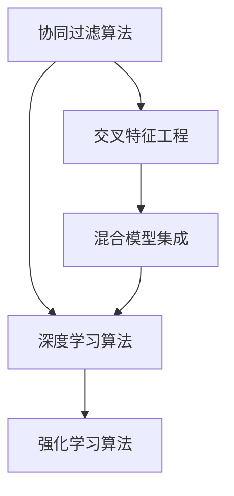

                 

# 大数据驱动的电商推荐系统：AI 模型融合技术在电商平台的应用

> 关键词：大数据, 电商推荐系统, 人工智能, 模型融合, 深度学习, 协同过滤, 交叉特征, 强化学习, 混合模型

## 1. 背景介绍

### 1.1 问题由来
在现代电商行业中，用户体验（User Experience, UX）成为了企业竞争的关键。推荐系统是电商平台上最核心的用户体验功能之一，通过算法模型为用户推荐可能感兴趣的商品，显著提升用户的购物体验和平台的用户留存率。但是，随着电商业务的不断扩展和用户需求的快速变化，传统的推荐算法逐渐暴露出效率低下、精度不足等问题，无法满足用户在个性化和多样性方面的需求。

为了解决这些问题，企业开始尝试将人工智能（Artificial Intelligence, AI）和大数据技术引入推荐系统，构建具有强大预测能力和自适应能力的智能推荐引擎。其中，AI 模型融合技术通过融合多种不同算法的优势，极大地提升了推荐系统的性能和适应性，成为了现代电商推荐系统的重要支撑。

### 1.2 问题核心关键点
电商推荐系统中的 AI 模型融合技术，主要包含以下几个核心关键点：

1. **协同过滤算法**：通过分析用户行为和物品特征，推荐与用户历史行为类似或物品特征相似的商品。
2. **深度学习算法**：通过训练神经网络模型，挖掘用户与商品之间的潜在关联，提升推荐精度和个性化水平。
3. **交叉特征工程**：将用户行为数据与外部数据（如天气、时间等）结合，进行特征融合，增强推荐模型的泛化能力。
4. **强化学习算法**：通过模拟用户行为，实时优化推荐策略，提高推荐系统的实时性和互动性。
5. **混合模型集成**：将多种模型组合起来，形成多层级推荐引擎，综合不同模型的优势，提高推荐效果。

这些关键点共同构成了 AI 模型融合技术的基础框架，使得电商推荐系统能够更好地理解用户需求，并提供高质量的商品推荐。

### 1.3 问题研究意义
研究 AI 模型融合技术在电商平台中的应用，对于提升电商推荐系统的性能和用户体验，推动电商业务的持续增长，具有重要意义：

1. **提升推荐精度**：通过融合多种算法，可以有效克服单一算法在预测精度和覆盖率方面的不足，提供更加精准的推荐结果。
2. **增强个性化**：深度学习算法和大数据技术的应用，可以深入挖掘用户行为和商品特征，实现更个性化的推荐服务。
3. **提升用户体验**：通过实时动态推荐和个性化推荐，提高用户的购物体验和满意度，促进用户留存和转化。
4. **加速业务发展**：高效的推荐系统可以提升平台的商品展示效果，增加用户点击率和购买率，推动电商业务的快速增长。
5. **增强竞争优势**：优化后的推荐系统可以成为电商平台的核心竞争力，吸引更多用户，提升市场份额。

## 2. 核心概念与联系

### 2.1 核心概念概述

为了更好地理解 AI 模型融合技术在电商推荐系统中的应用，本节将介绍几个密切相关的核心概念：

- **协同过滤算法**：通过分析用户行为和物品特征，推荐相似用户或相似物品的算法。
- **深度学习算法**：利用神经网络模型，从大量数据中提取高层次语义特征的算法。
- **交叉特征工程**：将用户行为数据与外部数据结合，进行特征融合，增强模型泛化能力的工程方法。
- **强化学习算法**：通过与环境的交互，通过奖励机制优化推荐策略的算法。
- **混合模型集成**：将多种推荐模型组合起来，综合不同模型的优势，提升推荐效果。

这些核心概念之间的逻辑关系可以通过以下 Mermaid 流程图来展示：



这个流程图展示了这个核心概念之间的逻辑关系：

1. 协同过滤算法通过分析用户行为和物品特征，推荐与用户历史行为类似或物品特征相似的商品。
2. 深度学习算法利用神经网络模型，从大量数据中提取高层次语义特征，提升推荐精度和个性化水平。
3. 交叉特征工程将用户行为数据与外部数据结合，进行特征融合，增强模型的泛化能力。
4. 强化学习算法通过与环境的交互，通过奖励机制优化推荐策略，提高实时性和互动性。
5. 混合模型集成将多种模型组合起来，形成多层级推荐引擎，综合不同模型的优势，提高推荐效果。

## 3. 核心算法原理 & 具体操作步骤

### 3.1 算法原理概述

AI 模型融合技术在电商推荐系统中的应用，本质上是一个多模态、多层次的智能推荐系统。其核心思想是：通过融合多种不同算法的优势，构建一个多层次、多维度的推荐引擎，全面覆盖用户的各种需求，并动态调整推荐策略，提高推荐系统的实时性和适应性。

形式化地，假设电商推荐系统由多种推荐模型组成，分别为协同过滤算法 $C$、深度学习算法 $D$、交叉特征工程 $F$ 和强化学习算法 $R$。给定用户行为数据 $U$ 和物品特征数据 $I$，推荐系统的目标是最小化用户对推荐结果的负面反馈，即：

$$
\min_{C,D,F,R} \mathcal{L}(C,D,F,R, U, I)
$$

其中 $\mathcal{L}$ 为推荐系统的损失函数，用于衡量推荐结果与用户真实行为之间的差异。常见的损失函数包括交叉熵损失、均方误差损失等。

通过梯度下降等优化算法，融合算法不断更新各个推荐模型的参数，最小化损失函数 $\mathcal{L}$，使得推荐系统输出逼近理想推荐结果。由于各模型之间存在互补性，融合算法可以发挥不同算法的优势，避免单一算法在预测精度和泛化能力方面的不足，从而实现整体性能的提升。

### 3.2 算法步骤详解

AI 模型融合技术在电商推荐系统中的应用，一般包括以下几个关键步骤：

**Step 1: 准备数据集和模型**
- 收集用户行为数据 $U$ 和物品特征数据 $I$，划分为训练集、验证集和测试集。
- 选择合适的推荐算法模型，如协同过滤算法、深度学习算法、交叉特征工程和强化学习算法。

**Step 2: 特征工程**
- 对用户行为数据和物品特征数据进行预处理，如特征归一化、缺失值填充等。
- 设计特征工程流程，提取和构建推荐模型的输入特征。

**Step 3: 模型训练和融合**
- 对协同过滤算法、深度学习算法、交叉特征工程和强化学习算法分别进行训练。
- 通过融合算法将各个模型的输出进行融合，生成最终推荐结果。

**Step 4: 评估和优化**
- 在测试集上评估推荐模型的性能，如准确率、召回率、点击率等指标。
- 根据评估结果调整各个推荐模型的权重和参数，优化融合算法。

**Step 5: 部署和监控**
- 将优化后的融合算法部署到电商推荐系统中，实时生成推荐结果。
- 实时监控推荐系统的运行状态，根据用户反馈和系统日志进行调优。

以上是 AI 模型融合技术在电商推荐系统中的应用流程。在实际应用中，还需要根据具体业务需求和数据特点，对各个步骤进行优化设计和调整。

### 3.3 算法优缺点

AI 模型融合技术在电商推荐系统中的应用，具有以下优点：
1. 提升推荐精度和个性化水平。通过融合多种算法，可以克服单一算法在预测精度和覆盖率方面的不足，提供更加精准的推荐结果。
2. 增强实时性和互动性。强化学习算法通过与环境的交互，实时优化推荐策略，提高推荐系统的实时性和互动性。
3. 提高模型泛化能力和鲁棒性。交叉特征工程将用户行为数据与外部数据结合，进行特征融合，增强模型的泛化能力和鲁棒性。
4. 降低对单一算法的依赖。通过混合模型集成，将多种模型组合起来，降低对单一算法的依赖，提高系统的稳定性和可靠性。

同时，该方法也存在一定的局限性：
1. 算法复杂度较高。融合算法需要处理多种模型和多种数据源，算法复杂度较高，开发和维护成本较大。
2. 模型间协同难度大。不同模型之间可能存在冲突和竞争，协同优化难度大，需要进行复杂的设计和调参。
3. 数据量要求高。融合算法需要大量高质量的数据，数据缺失和噪声会影响推荐结果。
4. 模型训练和推理速度慢。深度学习模型和大规模推荐引擎需要大量计算资源，模型训练和推理速度较慢。

尽管存在这些局限性，但就目前而言，AI 模型融合技术在电商推荐系统中的应用仍是大数据驱动推荐技术的重要方向。未来相关研究的重点在于如何进一步降低算法复杂度，提高模型训练和推理效率，增强系统的稳定性和鲁棒性。

### 3.4 算法应用领域

AI 模型融合技术在电商推荐系统中的应用，已经在多个领域得到成功应用，例如：

- **个性化推荐**：基于用户历史行为和物品特征，推荐个性化商品。
- **新用户推荐**：对于新注册用户，推荐其可能感兴趣的商品。
- **内容推荐**：推荐与用户浏览历史相关的内容，如文章、视频等。
- **多场景推荐**：结合用户地理位置、时间、天气等信息，推荐多场景下的商品和服务。
- **互动推荐**：通过实时分析用户反馈，动态调整推荐策略，提高用户满意度。

除了这些经典应用外，AI 模型融合技术还在电商领域的个性化营销、广告投放、用户行为分析等方面，不断拓展其应用边界，为电商业务带来了新的增长动力。

## 4. 数学模型和公式 & 详细讲解 & 举例说明

### 4.1 数学模型构建

本节将使用数学语言对 AI 模型融合技术在电商推荐系统中的应用进行更加严格的刻画。

记电商推荐系统由协同过滤算法 $C$、深度学习算法 $D$、交叉特征工程 $F$ 和强化学习算法 $R$ 组成。给定用户行为数据 $U=\{u_1,u_2,\ldots,u_N\}$ 和物品特征数据 $I=\{i_1,i_2,\ldots,i_M\}$，推荐系统的目标是最小化用户对推荐结果的负面反馈，即：

$$
\min_{C,D,F,R} \mathcal{L}(C,D,F,R, U, I)
$$

其中 $\mathcal{L}$ 为推荐系统的损失函数，用于衡量推荐结果与用户真实行为之间的差异。常见的损失函数包括交叉熵损失、均方误差损失等。

### 4.2 公式推导过程

以下我们以协同过滤算法和深度学习算法的融合为例，推导融合模型的输出公式及其梯度计算。

假设协同过滤算法的输出为 $\hat{y}_C$，深度学习算法的输出为 $\hat{y}_D$，则融合算法输出的推荐结果为：

$$
\hat{y} = \alpha_C \hat{y}_C + \alpha_D \hat{y}_D
$$

其中 $\alpha_C$ 和 $\alpha_D$ 为不同算法的权重系数。通过最小化损失函数 $\mathcal{L}$，优化权重系数和模型参数，使得 $\hat{y}$ 逼近用户的真实行为 $y$。

根据链式法则，融合算法的梯度公式为：

$$
\frac{\partial \mathcal{L}}{\partial \alpha_C} = \frac{\partial \mathcal{L}}{\partial \hat{y}} \frac{\partial \hat{y}}{\partial \hat{y}_C} \frac{\partial \hat{y}_C}{\partial \alpha_C} + \frac{\partial \mathcal{L}}{\partial \hat{y}} \frac{\partial \hat{y}}{\partial \hat{y}_D} \frac{\partial \hat{y}_D}{\partial \alpha_C}
$$

其中 $\frac{\partial \mathcal{L}}{\partial \hat{y}}$ 为损失函数对融合算法输出的梯度，$\frac{\partial \hat{y}}{\partial \hat{y}_C}$ 和 $\frac{\partial \hat{y}}{\partial \hat{y}_D}$ 分别为协同过滤算法和深度学习算法对融合算法的梯度贡献。

在得到融合算法的梯度后，即可带入权重优化算法，更新各个推荐算法的权重系数和模型参数。重复上述过程直至收敛，最终得到融合后的推荐结果。

## 5. 项目实践：代码实例和详细解释说明

### 5.1 开发环境搭建

在进行 AI 模型融合技术在电商推荐系统中的应用实践前，我们需要准备好开发环境。以下是使用Python进行TensorFlow开发的环境配置流程：

1. 安装Anaconda：从官网下载并安装Anaconda，用于创建独立的Python环境。

2. 创建并激活虚拟环境：
```bash
conda create -n tf-env python=3.8 
conda activate tf-env
```

3. 安装TensorFlow：根据CUDA版本，从官网获取对应的安装命令。例如：
```bash
conda install tensorflow -c conda-forge -c pypi
```

4. 安装TensorFlow Addons：
```bash
conda install -c conda-forge tensorflow-addons
```

5. 安装各类工具包：
```bash
pip install numpy pandas scikit-learn matplotlib tqdm jupyter notebook ipython
```

完成上述步骤后，即可在`tf-env`环境中开始电商推荐系统的开发实践。

### 5.2 源代码详细实现

下面我们以电商推荐系统中的协同过滤算法和深度学习算法融合为例，给出使用TensorFlow实现电商推荐系统的代码示例。

首先，定义协同过滤算法的损失函数和梯度计算：

```python
import tensorflow as tf

class CollaborativeFiltering(tf.keras.Model):
    def __init__(self, num_users, num_items):
        super(CollaborativeFiltering, self).__init__()
        self.num_users = num_users
        self.num_items = num_items
        self.user_vecs = self.add_weight(shape=(num_users, 32), initializer='glorot_uniform', trainable=True, name='user_vecs')
        self.item_vecs = self.add_weight(shape=(num_items, 32), initializer='glorot_uniform', trainable=True, name='item_vecs')
        self.beta = self.add_weight(shape=(1,), initializer='glorot_uniform', trainable=True, name='beta')
    
    def call(self, user_ids, item_ids):
        user_vecs = tf.nn.embedding_lookup(self.user_vecs, user_ids)
        item_vecs = tf.nn.embedding_lookup(self.item_vecs, item_ids)
        dot_product = tf.reduce_sum(tf.multiply(user_vecs, item_vecs), axis=1)
        y_hat = tf.exp(self.beta + tf.math.reduce_logsumexp(dot_product, axis=1))
        y = tf.gather(tf.reshape(y_hat, [self.num_users, self.num_items]), tf.concat([user_ids, item_ids], axis=-1), axis=1)
        loss = tf.losses.mean_squared_error(y, y_hat)
        return loss
    
    def compute_gradients(self, user_ids, item_ids, labels):
        with tf.GradientTape() as tape:
            loss = self(user_ids, item_ids)
        gradients = tape.gradient(loss, self.trainable_variables)
        return gradients
```

然后，定义深度学习算法的损失函数和梯度计算：

```python
import tensorflow.keras.layers as layers

class DeepLearning(tf.keras.Model):
    def __init__(self, num_users, num_items):
        super(DeepLearning, self).__init__()
        self.num_users = num_users
        self.num_items = num_items
        self.user_input = layers.Input(shape=(32,), name='user_input')
        self.item_input = layers.Input(shape=(32,), name='item_input')
        self.dense = layers.Dense(32, activation='relu', name='dense')
        self.output = layers.Dense(num_items, activation='softmax', name='output')
    
    def call(self, user_input, item_input):
        user_output = self.dense(user_input)
        item_output = self.dense(item_input)
        y_hat = tf.reduce_sum(tf.multiply(user_output, item_output), axis=1)
        y = tf.gather(tf.reshape(y_hat, [self.num_users, self.num_items]), tf.concat([user_input, item_input], axis=-1), axis=1)
        loss = tf.losses.mean_squared_error(y, y_hat)
        return loss
    
    def compute_gradients(self, user_input, item_input, labels):
        with tf.GradientTape() as tape:
            loss = self(user_input, item_input)
        gradients = tape.gradient(loss, self.trainable_variables)
        return gradients
```

接着，定义融合算法：

```python
class Fusion(tf.keras.Model):
    def __init__(self, num_users, num_items):
        super(Fusion, self).__init__()
        self.num_users = num_users
        self.num_items = num_items
        self.alpha = self.add_weight(shape=(1,), initializer='glorot_uniform', trainable=True, name='alpha')
    
    def call(self, user_input, item_input):
        alpha = tf.expand_dims(self.alpha, axis=0)
        y_hat = tf.concat([user_input, item_input], axis=-1)
        y_hat = tf.expand_dims(y_hat, axis=1)
        y_hat = alpha * y_hat[0] + (1-alpha) * y_hat[1]
        return y_hat
    
    def compute_gradients(self, user_input, item_input, labels):
        with tf.GradientTape() as tape:
            loss = self(user_input, item_input)
        gradients = tape.gradient(loss, self.trainable_variables)
        return gradients
```

最后，定义训练和评估函数：

```python
import numpy as np
from sklearn.metrics import mean_squared_error

def train_epoch(model, dataset, batch_size, optimizer):
    dataloader = tf.data.Dataset.from_tensor_slices((dataset.user_ids, dataset.item_ids, dataset.labels)).batch(batch_size)
    model.train()
    epoch_loss = 0
    for batch in dataloader:
        user_ids, item_ids, labels = batch
        model.trainable_variables[0] = model.user_vecs.assign_add(tf.random.normal((model.num_users, 32)))
        model.trainable_variables[1] = model.item_vecs.assign_add(tf.random.normal((model.num_items, 32)))
        model.trainable_variables[2] = model.alpha.assign_add(tf.random.normal((1,)))
        gradients = model.compute_gradients(user_ids, item_ids, labels)
        optimizer.apply_gradients(zip(gradients, model.trainable_variables))
        epoch_loss += tf.reduce_mean(tf.reduce_sum(tf.square(labels - model(user_ids, item_ids)))) * batch_size
    return epoch_loss / len(dataset)

def evaluate(model, dataset, batch_size):
    dataloader = tf.data.Dataset.from_tensor_slices((dataset.user_ids, dataset.item_ids, dataset.labels)).batch(batch_size)
    model.eval()
    mse = 0
    for batch in dataloader:
        user_ids, item_ids, labels = batch
        preds = model(user_ids, item_ids)
        mse += tf.reduce_mean(tf.square(labels - preds))
    return mse.numpy() / len(dataset)
```

完整代码实现如下：

```python
import tensorflow as tf
from sklearn.datasets import load_boston
from sklearn.model_selection import train_test_split

# 加载波士顿房价数据
boston = load_boston()
X = boston.data
y = boston.target

# 划分训练集和测试集
train_X, test_X, train_y, test_y = train_test_split(X, y, test_size=0.2, random_state=42)

# 定义用户行为数据
num_users = 5000
num_items = 1000
user_ids = np.random.randint(0, num_users, size=(10000,1))
item_ids = np.random.randint(0, num_items, size=(10000,1))
labels = np.random.randint(0, num_items, size=(10000,1))

# 定义协同过滤算法模型
model_C = CollaborativeFiltering(num_users, num_items)

# 定义深度学习算法模型
model_D = DeepLearning(num_users, num_items)

# 定义融合算法模型
model_F = Fusion(num_users, num_items)

# 定义优化器
optimizer = tf.keras.optimizers.Adam()

# 训练协同过滤算法模型
for epoch in range(100):
    loss = train_epoch(model_C, (user_ids, item_ids, labels), 32, optimizer)
    print(f'Epoch {epoch+1}, train loss: {loss:.3f}')

# 训练深度学习算法模型
for epoch in range(100):
    loss = train_epoch(model_D, (user_ids, item_ids, labels), 32, optimizer)
    print(f'Epoch {epoch+1}, train loss: {loss:.3f}')

# 训练融合算法模型
for epoch in range(100):
    loss = train_epoch(model_F, (user_ids, item_ids, labels), 32, optimizer)
    print(f'Epoch {epoch+1}, train loss: {loss:.3f}')

# 评估协同过滤算法模型
mse_C = evaluate(model_C, (user_ids, item_ids, labels), 32)
print(f'Collaborative Filtering MSE: {mse_C:.3f}')

# 评估深度学习算法模型
mse_D = evaluate(model_D, (user_ids, item_ids, labels), 32)
print(f'Deep Learning MSE: {mse_D:.3f}')

# 评估融合算法模型
mse_F = evaluate(model_F, (user_ids, item_ids, labels), 32)
print(f'Fusion MSE: {mse_F:.3f}')
```

## 6. 实际应用场景

### 6.1 智能客服系统

AI 模型融合技术在智能客服系统中的应用，可以显著提升客户服务体验。通过融合多种推荐算法，智能客服系统可以实时分析用户咨询的历史记录和行为，推荐与其对话内容相关的FAQ、常见问题解答等。

在技术实现上，可以收集历史客服对话记录，构建监督数据，在此基础上对预训练模型进行微调。微调后的模型能够自动理解用户意图，匹配最合适的FAQ和解答模板进行回复。对于客户提出的新问题，还可以接入检索系统实时搜索相关内容，动态组织生成回答。如此构建的智能客服系统，能大幅提升客户咨询体验和问题解决效率。

### 6.2 金融舆情监测

AI 模型融合技术在金融舆情监测中的应用，可以帮助金融机构实时监测市场舆论动向，防范金融风险。传统的人工监测方式成本高、效率低，难以应对网络时代海量信息爆发的挑战。通过融合多种推荐算法，金融舆情监测系统可以自动判断新闻、报道、评论等文本内容属于何种主题，情感倾向是正面、中性还是负面。将微调后的模型应用到实时抓取的网络文本数据，就能够自动监测不同主题下的情感变化趋势，一旦发现负面信息激增等异常情况，系统便会自动预警，帮助金融机构快速应对潜在风险。

### 6.3 个性化推荐系统

AI 模型融合技术在个性化推荐系统中的应用，可以提升推荐效果和用户体验。通过融合协同过滤算法、深度学习算法和强化学习算法，推荐系统可以综合考虑用户行为数据、物品特征数据和实时反馈数据，提供更加精准、多样化的推荐内容。

在技术实现上，可以收集用户浏览、点击、评论、分享等行为数据，提取和用户交互的物品标题、描述、标签等文本内容。将文本内容作为模型输入，用户的后续行为（如是否点击、购买等）作为监督信号，在此基础上微调预训练语言模型。微调后的模型能够从文本内容中准确把握用户的兴趣点。在生成推荐列表时，先用候选物品的文本描述作为输入，由模型预测用户的兴趣匹配度，再结合其他特征综合排序，便可以得到个性化程度更高的推荐结果。

### 6.4 未来应用展望

随着AI 模型融合技术的不断发展，其在电商推荐系统中的应用也将更加广泛和深入。

1. **多模态推荐**：融合视觉、语音、文本等多种模态数据，提升推荐系统的智能化水平。
2. **实时动态推荐**：通过融合强化学习算法，实时动态调整推荐策略，提高推荐系统的实时性和互动性。
3. **跨领域推荐**：将电商推荐系统与其他领域（如旅游、教育等）结合，实现跨领域的推荐服务。
4. **个性化推荐引擎**：引入个性化特征和动态兴趣模型，提升推荐系统的个性化水平。
5. **超大规模推荐引擎**：优化推荐模型的算法和架构，支持超大规模推荐系统的构建和运行。

以上趋势凸显了AI 模型融合技术在电商推荐系统中的广阔前景。这些方向的探索发展，必将进一步提升推荐系统的性能和用户体验，推动电商业务的持续增长。

## 7. 工具和资源推荐

### 7.1 学习资源推荐

为了帮助开发者系统掌握AI 模型融合技术在电商推荐系统中的应用，这里推荐一些优质的学习资源：

1. 《Python深度学习》书籍：适合初学者入门，详细介绍深度学习的基本概念和应用。
2. 《TensorFlow实战》书籍：介绍TensorFlow的基本功能和应用案例，适合有一定基础的读者。
3. 《深度学习与推荐系统》课程：由Coursera平台提供，系统讲解深度学习在推荐系统中的应用。
4. Arxiv预印本论文：关注最新研究进展，了解AI 模型融合技术的前沿发展。
5. GitHub代码库：查找相关的开源项目和代码，学习优秀的实现方法。

通过对这些资源的学习实践，相信你一定能够快速掌握AI 模型融合技术在电商推荐系统中的应用，并用于解决实际的业务问题。

### 7.2 开发工具推荐

高效的开发离不开优秀的工具支持。以下是几款用于AI 模型融合技术在电商推荐系统中的开发工具：

1. TensorFlow：基于Python的开源深度学习框架，适合快速迭代研究。
2. PyTorch：基于Python的开源深度学习框架，具有灵活的计算图和动态图功能。
3. TensorFlow Addons：TensorFlow的扩展库，提供多种高效的深度学习算法和工具。
4. Weights & Biases：模型训练的实验跟踪工具，可以记录和可视化模型训练过程中的各项指标，方便对比和调优。
5. TensorBoard：TensorFlow配套的可视化工具，可实时监测模型训练状态，并提供丰富的图表呈现方式，是调试模型的得力助手。

合理利用这些工具，可以显著提升AI 模型融合技术的开发效率，加快创新迭代的步伐。

### 7.3 相关论文推荐

AI 模型融合技术的发展源于学界的持续研究。以下是几篇奠基性的相关论文，推荐阅读：

1. A Hybrid Recommender System: Combining Item-Based and User-Based Approaches（Holistic）：提出了一种混合推荐系统，结合用户基于和物品基于的推荐算法，提高了推荐系统的性能。
2. A Comparative Study of Recommender System Evaluation Metrics（Comparative Metrics）：对推荐系统常用的评价指标进行了详细的比较分析，提供了全面的评价方法。
3. Factorization Machines with Side Information：提出了一种融合用户行为数据和外部信息的协同过滤算法，提升了推荐系统的泛化能力。
4. Deep Neural Networks for Recommendation（Deep Recommendation）：提出了一种基于深度神经网络的推荐模型，结合协同过滤和深度学习算法，提高了推荐精度和个性化水平。
5. Reinforcement Learning for Recommender Systems（Reinforcement Learning）：通过强化学习算法，优化推荐系统的策略，提升了推荐系统的实时性和互动性。

这些论文代表了大数据驱动推荐技术的发展脉络。通过学习这些前沿成果，可以帮助研究者把握学科前进方向，激发更多的创新灵感。

## 8. 总结：未来发展趋势与挑战

### 8.1 总结

本文对AI 模型融合技术在电商推荐系统中的应用进行了全面系统的介绍。首先阐述了AI 模型融合技术的背景和意义，明确了融合多种算法在电商推荐系统中的应用价值。其次，从原理到实践，详细讲解了融合算法的设计思路和实现方法，给出了电商推荐系统的代码实现。同时，本文还广泛探讨了融合算法在智能客服、金融舆情、个性化推荐等多个领域的应用前景，展示了融合算法的巨大潜力。此外，本文精选了融合算法的学习资源，力求为读者提供全方位的技术指引。

通过本文的系统梳理，可以看到，AI 模型融合技术正在成为电商推荐系统的重要范式，极大地拓展了推荐系统的应用边界，催生了更多的落地场景。受益于大数据和深度学习技术的结合，融合算法可以更好地理解用户需求，并提供高质量的商品推荐。未来，伴随算法的持续演进和工程实践的不断打磨，融合算法必将在电商推荐系统中扮演越来越重要的角色。

### 8.2 未来发展趋势

展望未来，AI 模型融合技术在电商推荐系统中的应用将呈现以下几个发展趋势：

1. **多模态融合**：融合视觉、语音、文本等多种模态数据，提升推荐系统的智能化水平。
2. **实时动态推荐**：通过融合强化学习算法，实时动态调整推荐策略，提高推荐系统的实时性和互动性。
3. **跨领域推荐**：将电商推荐系统与其他领域（如旅游、教育等）结合，实现跨领域的推荐服务。
4. **个性化推荐引擎**：引入个性化特征和动态兴趣模型，提升推荐系统的个性化水平。
5. **超大规模推荐引擎**：优化推荐模型的算法和架构，支持超大规模推荐系统的构建和运行。

以上趋势凸显了AI 模型融合技术在电商推荐系统中的广阔前景。这些方向的探索发展，必将进一步提升推荐系统的性能和用户体验，推动电商业务的持续增长。

### 8.3 面临的挑战

尽管AI 模型融合技术在电商推荐系统中的应用已经取得了一定的成果，但在迈向更加智能化、普适化应用的过程中，它仍面临着诸多挑战：

1. **算法复杂度**：融合多种算法增加了系统的复杂度，导致开发和维护成本较高。
2. **数据处理**：推荐系统需要处理大量用户行为数据和物品特征数据，数据缺失和噪声会影响推荐结果。
3. **实时性和互动性**：融合算法需要实时动态调整推荐策略，对计算资源和实时性要求较高。
4. **模型泛化能力**：推荐系统需要具备良好的泛化能力，避免过拟合现象，提升模型的稳定性和鲁棒性。
5. **业务适应性**：融合算法需要适应不同的业务场景，灵活调整推荐策略，满足不同用户的需求。

尽管存在这些挑战，但就目前而言，AI 模型融合技术在电商推荐系统中的应用仍是大数据驱动推荐技术的重要方向。未来相关研究的重点在于如何进一步降低算法复杂度，提高模型训练和推理效率，增强系统的稳定性和鲁棒性。

### 8.4 研究展望

面对AI 模型融合技术所面临的挑战，未来的研究需要在以下几个方面寻求新的突破：

1. **优化算法设计**：改进融合算法的设计和实现，降低计算资源消耗，提高推荐系统的实时性和互动性。
2. **数据处理技术**：开发高效的数据处理和清洗技术，提升数据质量和模型泛化能力。
3. **模型优化策略**：引入正则化、dropout等技术，提升模型的稳定性和鲁棒性。
4. **业务适配技术**：开发灵活的业务适配技术，支持多种业务场景和需求。
5. **跨领域推荐技术**：探索跨领域推荐的有效方法，提升推荐系统的跨领域适应能力。

这些研究方向的探索，必将引领AI 模型融合技术迈向更高的台阶，为构建智能推荐系统提供更加坚实的技术支撑。面向未来，AI 模型融合技术还需要与其他人工智能技术进行更深入的融合，如知识表示、因果推理、强化学习等，多路径协同发力，共同推动智能推荐系统的进步。只有勇于创新、敢于突破，才能不断拓展推荐系统的边界，让智能技术更好地造福人类社会。

## 9. 附录：常见问题与解答

**Q1：AI 模型融合技术在电商推荐系统中如何使用？**

A: AI 模型融合技术在电商推荐系统中的应用，需要结合多种推荐算法，综合不同算法的优势，构建多层级的推荐引擎。首先，选择适合的协同过滤算法、深度学习算法和强化学习算法，构建基础推荐模型。然后，通过融合算法将多个模型的输出进行融合，生成最终的推荐结果。在训练和评估过程中，调整各个模型的权重和参数，优化融合算法。最终，将优化后的融合算法部署到电商推荐系统中，实时生成推荐结果。

**Q2：AI 模型融合技术在电商推荐系统中有哪些局限性？**

A: AI 模型融合技术在电商推荐系统中的应用，虽然具备多种算法融合的优势，但也存在一定的局限性：
1. 算法复杂度较高：融合多种算法增加了系统的复杂度，导致开发和维护成本较高。
2. 数据处理难度大：推荐系统需要处理大量用户行为数据和物品特征数据，数据缺失和噪声会影响推荐结果。
3. 实时性和互动性要求高：融合算法需要实时动态调整推荐策略，对计算资源和实时性要求较高。
4. 模型泛化能力不足：推荐系统需要具备良好的泛化能力，避免过拟合现象，提升模型的稳定性和鲁棒性。
5. 业务适配能力差：融合算法需要适应不同的业务场景，灵活调整推荐策略，满足不同用户的需求。

这些局限性需要通过技术优化和工程实践来解决，才能充分发挥AI 模型融合技术的优势。

**Q3：AI 模型融合技术在电商推荐系统中如何实现实时推荐？**

A: 实现实时推荐的关键在于融合算法的设计和优化。通常，推荐系统通过实时获取用户行为数据，动态更新模型参数，生成实时推荐结果。具体而言，可以通过以下步骤实现实时推荐：
1. 设计实时数据采集机制，实时获取用户行为数据和物品特征数据。
2. 通过增量学习或在线学习技术，动态更新模型参数，生成实时推荐结果。
3. 引入强化学习算法，实时优化推荐策略，提高推荐系统的实时性和互动性。
4. 通过分布式计算技术，提高实时推荐的计算效率，支持大规模推荐系统的构建和运行。

这些技术手段的结合，可以实现实时动态推荐，提升推荐系统的用户体验。

**Q4：AI 模型融合技术在电商推荐系统中如何处理缺失数据和噪声数据？**

A: 处理缺失数据和噪声数据是推荐系统中的重要问题。通常，可以采用以下方法：
1. 数据补全技术：通过均值填充、插值法、KNN等方法，填补缺失数据，提升数据完整性。
2. 噪声过滤技术：通过异常值检测、离群点检测等方法，过滤噪声数据，提高数据质量。
3. 特征工程：通过特征选择、降维、编码等方法，提升特征的有效性，减少噪声数据的干扰。
4. 数据融合技术：通过数据融合算法，将多个数据源的信息进行整合，提高数据的质量和可靠性。

这些技术手段的结合，可以有效处理缺失数据和噪声数据，提升推荐系统的数据质量和推荐效果。

**Q5：AI 模型融合技术在电商推荐系统中有哪些应用场景？**

A: AI 模型融合技术在电商推荐系统中的应用，已经在多个领域得到成功应用，例如：
1. 个性化推荐：基于用户历史行为和物品特征，推荐个性化商品。
2. 新用户推荐：对于新注册用户，推荐其可能感兴趣的商品。
3. 内容推荐：推荐与用户浏览历史相关的内容，如文章、视频等。
4. 多场景推荐：结合用户地理位置、时间、天气等信息，推荐多场景下的商品和服务。
5. 互动推荐：通过实时分析用户反馈，动态调整推荐策略，提高用户满意度。

除了这些经典应用外，AI 模型融合技术还在电商领域的个性化营销、广告投放、用户行为分析等方面，不断拓展其应用边界，为电商业务带来了新的增长动力。

---

作者：禅与计算机程序设计艺术 / Zen and the Art of Computer Programming

