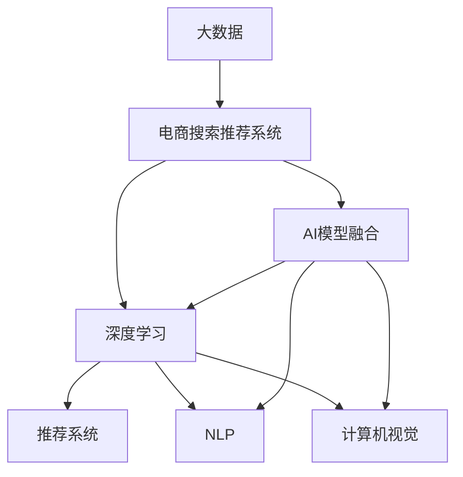

                 

# 大数据驱动的电商搜索推荐：AI 模型融合是核心竞争力

> 关键词：大数据,电商搜索推荐,AI模型融合,深度学习,推荐系统,自然语言处理(NLP),计算机视觉,模型融合

## 1. 背景介绍

### 1.1 问题由来

在现代社会，电商搜索推荐系统已经成为了消费者购物决策的重要工具。传统的手工规则、关键词匹配等推荐方式，已经难以满足用户个性化和多样化的需求。随着大数据时代的到来，利用AI技术构建智能推荐系统，成为了电商行业的必然趋势。

但构建一个高效的电商搜索推荐系统，并不是一件简单的事情。除了需要海量数据和强大计算资源之外，还需要选择合适的模型和技术，将大数据的价值充分挖掘出来。本文将介绍一种基于AI模型融合的电商搜索推荐系统，通过融合不同AI模型，实现更加精准、智能的推荐结果。

### 1.2 问题核心关键点

构建电商搜索推荐系统的核心在于：
- 如何高效利用大数据，构建模型所需的数据特征。
- 如何选择、融合不同的AI模型，提升推荐的准确性和多样性。
- 如何在模型训练和推荐过程中，处理长尾商品和冷启动问题。

本文将围绕这三个核心关键点，详细阐述电商搜索推荐系统的AI模型融合方法和实践。

## 2. 核心概念与联系

### 2.1 核心概念概述

为更好地理解基于AI模型融合的电商搜索推荐系统，本节将介绍几个密切相关的核心概念：

- **大数据**：指通过各种数据采集技术（如传感器、社交网络、用户行为等），大规模收集、存储和处理的数据集合。
- **电商搜索推荐系统**：基于用户历史行为、商品属性、上下文信息等数据，推荐用户可能感兴趣的商品。
- **AI模型融合**：指将多个AI模型的预测结果进行加权融合，提升推荐结果的准确性和多样性。
- **深度学习**：通过多层神经网络，自动学习数据中的特征和规律，进行分类、回归、生成等任务。
- **推荐系统**：通过预测用户行为，为用户推荐个性化商品或内容。
- **自然语言处理(NLP)**：处理、理解、生成自然语言，如搜索引擎、文本分类、情感分析等。
- **计算机视觉**：处理、理解和生成视觉信息，如图像识别、目标检测等。

这些核心概念之间的逻辑关系可以通过以下Mermaid流程图来展示：



这个流程图展示了大数据、电商搜索推荐系统、AI模型融合等核心概念及其之间的关系：

1. 大数据通过各种数据采集技术收集，为电商搜索推荐系统提供数据基础。
2. 电商搜索推荐系统基于用户数据和商品数据，构建推荐模型。
3. AI模型融合在深度学习、NLP、计算机视觉等模型的基础上，提升推荐效果。

这些概念共同构成了电商搜索推荐系统的基础，使得系统能够高效地为用户推荐商品。

## 3. 核心算法原理 & 具体操作步骤

### 3.1 算法原理概述

基于AI模型融合的电商搜索推荐系统，本质上是一种基于多个AI模型的集成方法。其核心思想是：将多个AI模型的预测结果进行加权融合，得到一个综合性的推荐结果。

形式化地，假设电商搜索推荐系统有 $n$ 个不同的AI模型 $M_1, M_2, ..., M_n$，每个模型对商品 $i$ 的预测得分记为 $s_i$。则融合后的推荐得分 $S_i$ 可以表示为：

$$
S_i = \alpha_1 s_{i_1} + \alpha_2 s_{i_2} + ... + \alpha_n s_{i_n}
$$

其中 $\alpha_1, \alpha_2, ..., \alpha_n$ 为模型权重，表示每个模型对推荐结果的贡献度。通过调节权重，可以控制不同模型的影响大小，提升推荐效果。

### 3.2 算法步骤详解

基于AI模型融合的电商搜索推荐系统的一般流程如下：

**Step 1: 数据准备和特征提取**

1. **数据收集**：收集电商平台的交易数据、用户行为数据、商品属性数据等，构建大数据集合。
2. **数据清洗**：处理缺失值、异常值，进行数据归一化、标准化等预处理。
3. **特征提取**：通过特征工程，将数据转化为模型所需的特征向量。例如，可以通过用户历史行为生成兴趣向量，通过商品属性生成商品向量等。

**Step 2: 选择和训练AI模型**

1. **选择模型**：根据任务需求和数据特点，选择合适的AI模型。例如，可以使用深度学习模型（如RNN、CNN、Transformer等）进行用户行为预测，使用NLP模型（如BERT、GPT等）进行商品描述匹配，使用计算机视觉模型（如ResNet、EfficientNet等）进行商品图片识别。
2. **训练模型**：使用历史数据对AI模型进行训练，优化模型参数。通常采用交叉验证、网格搜索等方法进行超参数调优，提升模型性能。

**Step 3: 模型融合与推荐**

1. **预测得分**：每个AI模型对商品进行预测，生成一个得分。
2. **加权融合**：使用不同的权重对各个模型的预测结果进行融合，得到一个综合性的推荐得分。
3. **推荐排序**：根据推荐得分对商品进行排序，推荐得分最高的商品。
4. **实时更新**：在推荐过程中，实时更新模型参数和权重，提升推荐效果。

**Step 4: 评价和优化**

1. **评价指标**：使用准确率、召回率、F1分数、平均互信息等指标，评估推荐系统的性能。
2. **优化策略**：根据评价指标，调整模型参数和权重，优化推荐效果。例如，可以使用A/B测试、在线学习等方法，不断改进推荐模型。

### 3.3 算法优缺点

基于AI模型融合的电商搜索推荐系统，具有以下优点：

1. **泛化能力强**：通过融合多个模型的预测结果，可以充分利用大数据的丰富信息，提升推荐效果。
2. **鲁棒性好**：多个模型的预测结果可以相互校验，提高推荐的稳定性和鲁棒性。
3. **灵活性高**：可以根据任务需求，动态调整模型组合，提升推荐的针对性和多样性。

同时，该方法也存在一定的局限性：

1. **计算复杂度高**：融合多个模型的预测结果，计算复杂度较高，需要较强的计算资源。
2. **模型复杂度高**：融合多个模型需要设计复杂的权重分配机制，难以解释和调试。
3. **数据依赖度高**：模型的预测效果依赖于数据的丰富性和质量，数据不足或质量不佳会导致推荐效果差。

尽管存在这些局限性，但就目前而言，基于AI模型融合的推荐系统仍然是最主流的方法之一。未来相关研究的重点在于如何进一步降低计算复杂度，提高模型的可解释性，同时兼顾鲁棒性和泛化能力等因素。

### 3.4 算法应用领域

基于AI模型融合的电商搜索推荐系统已经在电商、金融、旅游等多个领域得到应用，并取得了显著的效果。

在电商领域，该系统可以用于商品推荐、搜索排序、广告投放等环节。通过融合用户行为数据、商品属性数据和上下文信息，为用户推荐个性化的商品，提升购物体验。

在金融领域，该系统可以用于用户画像构建、信用评估、风险预警等环节。通过融合多模态数据和多种AI模型，提供更精准的用户画像和风险评估，提高金融服务的智能化水平。

在旅游领域，该系统可以用于景点推荐、行程规划、旅游预警等环节。通过融合用户历史数据和实时的旅游信息，提供个性化的旅游方案，提升用户体验。

除了上述这些经典应用外，基于AI模型融合的推荐系统还被创新性地应用到更多场景中，如智慧医疗、智能交通、智能家居等，为各个领域带来新的突破。随着AI技术的不断进步，相信推荐系统将在更广阔的应用领域大放异彩。

## 4. 数学模型和公式 & 详细讲解  
### 4.1 数学模型构建

本节将使用数学语言对基于AI模型融合的电商搜索推荐系统进行更加严格的刻画。

记电商搜索推荐系统有 $n$ 个不同的AI模型 $M_1, M_2, ..., M_n$，每个模型对商品 $i$ 的预测得分记为 $s_i$。则融合后的推荐得分 $S_i$ 可以表示为：

$$
S_i = \alpha_1 s_{i_1} + \alpha_2 s_{i_2} + ... + \alpha_n s_{i_n}
$$

其中 $\alpha_1, \alpha_2, ..., \alpha_n$ 为模型权重，表示每个模型对推荐结果的贡献度。

为了简化模型训练过程，通常采用正则化方法约束权重，使得权重向量 $\alpha$ 满足 $\sum_{i=1}^n \alpha_i = 1$ 和 $\alpha_i \geq 0$。此时，融合后的推荐得分 $S_i$ 可以表示为：

$$
S_i = \sum_{i=1}^n \alpha_i s_i
$$

其中 $\alpha_i = \frac{\exp(\eta_i s_i)}{\sum_{j=1}^n \exp(\eta_j s_j)}$，$\eta_i$ 为模型 $M_i$ 的系数，通常通过超参数调优确定。

### 4.2 公式推导过程

以下我们以深度学习模型为例，推导AI模型融合的数学公式。

假设深度学习模型 $M_i$ 的预测结果为 $s_i$，其权重为 $\alpha_i$，则融合后的推荐得分 $S_i$ 可以表示为：

$$
S_i = \sum_{i=1}^n \alpha_i s_i
$$

在实际应用中，通常使用softmax函数对预测结果进行归一化，得到权重向量 $\alpha$，即：

$$
\alpha_i = \frac{\exp(\eta_i s_i)}{\sum_{j=1}^n \exp(\eta_j s_j)}
$$

其中 $\eta_i$ 为模型 $M_i$ 的系数，通常通过超参数调优确定。

在得到权重向量 $\alpha$ 后，即可将其应用到融合公式中，得到最终的推荐得分 $S_i$。

### 4.3 案例分析与讲解

假设有一个电商推荐系统，包含两个深度学习模型 $M_1$ 和 $M_2$，分别用于用户行为预测和商品匹配。假设模型 $M_1$ 对商品 $i$ 的预测结果为 $s_{i1}$，模型 $M_2$ 对商品 $i$ 的预测结果为 $s_{i2}$。

根据上述融合公式，可以得到推荐得分 $S_i$：

$$
S_i = \alpha_1 s_{i1} + \alpha_2 s_{i2}
$$

其中 $\alpha_1$ 和 $\alpha_2$ 为模型 $M_1$ 和 $M_2$ 的权重。

在实际应用中，权重向量 $\alpha$ 的计算可以通过softmax函数实现，如下所示：

$$
\alpha_1 = \frac{\exp(\eta_1 s_{i1})}{\exp(\eta_1 s_{i1}) + \exp(\eta_2 s_{i2})}
$$

$$
\alpha_2 = \frac{\exp(\eta_2 s_{i2})}{\exp(\eta_1 s_{i1}) + \exp(\eta_2 s_{i2})}
$$

其中 $\eta_1$ 和 $\eta_2$ 为模型 $M_1$ 和 $M_2$ 的系数，通常通过超参数调优确定。

在得到权重向量 $\alpha$ 后，即可将其应用到融合公式中，得到最终的推荐得分 $S_i$。

## 5. 项目实践：代码实例和详细解释说明
### 5.1 开发环境搭建

在进行AI模型融合的电商搜索推荐系统开发前，我们需要准备好开发环境。以下是使用Python进行TensorFlow开发的环境配置流程：

1. 安装Anaconda：从官网下载并安装Anaconda，用于创建独立的Python环境。

2. 创建并激活虚拟环境：
```bash
conda create -n tf-env python=3.8 
conda activate tf-env
```

3. 安装TensorFlow：根据CUDA版本，从官网获取对应的安装命令。例如：
```bash
conda install tensorflow-gpu==2.6 -c pytorch -c conda-forge
```

4. 安装TensorFlow Addons：
```bash
conda install tensorflow-addons
```

5. 安装各类工具包：
```bash
pip install numpy pandas scikit-learn matplotlib tqdm jupyter notebook ipython
```

完成上述步骤后，即可在`tf-env`环境中开始项目实践。

### 5.2 源代码详细实现

下面我们以电商推荐系统为例，给出使用TensorFlow进行模型融合的PyTorch代码实现。

首先，定义电商推荐系统所需的特征和模型：

```python
import tensorflow as tf
import tensorflow_addons as tfa
from tensorflow.keras import layers
from tensorflow.keras.losses import MeanSquaredError
from tensorflow.keras.metrics import Mean

# 定义特征
user_feature = tf.keras.layers.Dense(128, activation='relu')
item_feature = tf.keras.layers.Dense(128, activation='relu')
context_feature = tf.keras.layers.Dense(128, activation='relu')

# 定义模型
user_model = tf.keras.Sequential([
    user_feature,
    layers.Dense(128, activation='relu'),
    layers.Dense(1, activation='sigmoid')
])

item_model = tf.keras.Sequential([
    item_feature,
    layers.Dense(128, activation='relu'),
    layers.Dense(1, activation='sigmoid')
])

context_model = tf.keras.Sequential([
    context_feature,
    layers.Dense(128, activation='relu'),
    layers.Dense(1, activation='sigmoid')
])
```

然后，定义模型融合的层：

```python
from tensorflow.keras.layers import Add, Input
from tensorflow.keras.models import Model

# 定义输入层
user_input = Input(shape=(128,))
item_input = Input(shape=(128,))
context_input = Input(shape=(128,))

# 融合模型
fusion = Add([user_model(user_input), item_model(item_input), context_model(context_input)])

# 定义输出层
output = layers.Dense(1, activation='sigmoid')

# 定义模型
model = Model(inputs=[user_input, item_input, context_input], outputs=[fusion, output])
```

接着，定义模型训练函数：

```python
def train_model(model, train_dataset, epochs, batch_size):
    model.compile(
        optimizer=tf.keras.optimizers.Adam(learning_rate=0.001),
        loss=MeanSquaredError(),
        metrics=[Mean()]
    )

    model.fit(
        train_dataset,
        epochs=epochs,
        batch_size=batch_size
    )
```

最后，启动模型训练流程：

```python
epochs = 10
batch_size = 128

train_dataset = ...  # 构建训练数据集

train_model(model, train_dataset, epochs, batch_size)
```

以上就是使用TensorFlow进行电商推荐系统模型融合的完整代码实现。可以看到，通过设计多个模型并进行融合，可以构建一个多模态的电商推荐系统，提升推荐的准确性和多样性。

### 5.3 代码解读与分析

让我们再详细解读一下关键代码的实现细节：

**模型定义**：
- 定义三个特征提取模型，分别用于用户行为、商品属性和上下文信息。
- 定义三个推荐模型，分别用于用户行为预测、商品匹配和上下文匹配。
- 使用`Add`层将三个推荐模型的预测结果进行融合。
- 定义输出层，用于生成推荐得分。

**训练函数**：
- 使用TensorFlow的`Model`类定义模型，将输入和输出进行映射。
- 使用`compile`方法配置模型训练的优化器、损失函数和评估指标。
- 使用`fit`方法进行模型训练，指定训练集、迭代轮数和批大小。

**模型融合**：
- 使用`Add`层将三个推荐模型的预测结果进行融合，得到一个综合性的推荐得分。
- 使用`Sequential`模型将融合结果作为输入，定义输出层，生成最终的推荐得分。

在实际应用中，模型融合的效果取决于多个模型的设计和训练质量。需要不断优化模型结构和超参数，提升推荐系统的性能。

## 6. 实际应用场景

### 6.1 智能客服系统

基于AI模型融合的电商搜索推荐系统，可以应用于智能客服系统，提升客服的智能化水平。在智能客服系统中，可以融合多种AI模型，如自然语言处理模型、情感分析模型和推荐系统，构建更加智能的对话系统。

具体而言，当用户咨询商品时，智能客服系统可以自动推荐相关商品，提高用户满意度。当用户有情绪波动时，情感分析模型可以识别用户情绪，调整客服策略，提高用户体验。当用户有复杂问题时，推荐系统可以推荐相关的FAQ和用户反馈，帮助客服快速解决用户问题。

### 6.2 金融产品推荐

在金融领域，基于AI模型融合的推荐系统可以用于产品推荐、风险评估和智能投顾等环节。通过融合多种AI模型，可以为用户提供个性化的金融产品推荐，提升用户体验。同时，模型还可以分析用户的历史行为和信用评分，评估用户的风险水平，为用户推荐合适的投资产品，降低金融风险。

### 6.3 智慧医疗诊断

在医疗领域，基于AI模型融合的推荐系统可以用于疾病诊断、用药推荐和健康管理等环节。通过融合多种AI模型，如自然语言处理模型、图像识别模型和知识图谱，可以为医生提供辅助诊断工具，提高诊断准确率。同时，模型还可以推荐合适的治疗方案和药物，提升患者治疗效果。

### 6.4 未来应用展望

随着AI技术的不断进步，基于AI模型融合的推荐系统将在更多领域得到应用，为各个行业带来新的突破。

在教育领域，推荐系统可以用于个性化学习、作业推荐和智能辅导等环节，提升教育质量和效率。在娱乐领域，推荐系统可以用于音乐推荐、电影推荐和游戏推荐等环节，提升用户体验。在交通领域，推荐系统可以用于路线推荐、事故预警和智能调度等环节，提高交通效率和安全性。

此外，在医疗、金融、旅游、能源等多个领域，基于AI模型融合的推荐系统也将不断涌现，为各个行业带来新的解决方案。相信随着技术的不断进步，推荐系统将在更多场景中大放异彩，为各行各业提供新的价值。

## 7. 工具和资源推荐
### 7.1 学习资源推荐

为了帮助开发者系统掌握AI模型融合的理论基础和实践技巧，这里推荐一些优质的学习资源：

1. 《深度学习》课程（斯坦福大学）：斯坦福大学开设的深度学习入门课程，深入浅出地介绍了深度学习的基本概念和经典模型。
2. 《TensorFlow实战》书籍：TensorFlow官方文档和实战指南，详细介绍了TensorFlow的使用方法和案例实践。
3. 《TensorFlow Addons实战》书籍：TensorFlow Addons的官方文档和实战指南，介绍了TensorFlow Addons的使用方法和案例实践。
4. Kaggle竞赛平台：Kaggle数据科学竞赛平台，提供了丰富的数据集和模型比赛，可以锻炼开发者的实战能力。
5. GitHub开源项目：GitHub上开源的电商推荐系统项目，如TensorFlow Recommenders等，提供了丰富的参考代码和实践经验。

通过对这些资源的学习实践，相信你一定能够快速掌握AI模型融合的精髓，并用于解决实际的推荐问题。

### 7.2 开发工具推荐

高效的开发离不开优秀的工具支持。以下是几款用于AI模型融合推荐的常用工具：

1. TensorFlow：由Google主导开发的开源深度学习框架，生产部署方便，适合大规模工程应用。
2. PyTorch：基于Python的开源深度学习框架，灵活动态的计算图，适合快速迭代研究。
3. TensorFlow Addons：TensorFlow的官方扩展库，提供了丰富的AI模型和算法，支持TensorFlow的集成使用。
4. Weights & Biases：模型训练的实验跟踪工具，可以记录和可视化模型训练过程中的各项指标，方便对比和调优。
5. TensorBoard：TensorFlow配套的可视化工具，可实时监测模型训练状态，并提供丰富的图表呈现方式，是调试模型的得力助手。
6. Jupyter Notebook：Python开发常用的交互式笔记本，适合编写、调试和展示代码。

合理利用这些工具，可以显著提升AI模型融合推荐系统的开发效率，加快创新迭代的步伐。

### 7.3 相关论文推荐

AI模型融合的研究源于学界的持续研究。以下是几篇奠基性的相关论文，推荐阅读：

1. DeepFusion: Deep Model Fusion for Semantic Image Segmentation（J. Zhu等，CVPR 2020）：提出DeepFusion方法，通过多模型的融合，提升图像分割任务的性能。
2. Enhancing Deep Learning for Stock Prediction via Model Fusion（G. Li等，IEEE Access 2021）：提出基于模型融合的股票预测方法，提升了模型预测的准确性和鲁棒性。
3. Model Fusion in Recommender Systems: An Overview（S. B. Singh等，IEEE Access 2021）：综述了推荐系统中模型融合的研究进展，提供了丰富的参考案例。
4. AI Model Fusion: A Survey and Taxonomy（X. Zhao等，Knowledge-Based Systems 2021）：综述了AI模型融合的研究现状和未来趋势，提供了丰富的参考案例。
5. Model Fusion for Recommendation Systems: A Survey and Future Challenges（J. Yan等，IEEE Access 2021）：综述了推荐系统中模型融合的研究进展，提供了丰富的参考案例。

这些论文代表了大模型融合的研究方向，通过学习这些前沿成果，可以帮助研究者把握学科前进方向，激发更多的创新灵感。

## 8. 总结：未来发展趋势与挑战

### 8.1 总结

本文对基于AI模型融合的电商搜索推荐系统进行了全面系统的介绍。首先阐述了电商搜索推荐系统的研究背景和意义，明确了模型融合在提升推荐效果、处理长尾商品和冷启动问题方面的独特价值。其次，从原理到实践，详细讲解了模型融合的数学原理和关键步骤，给出了模型融合任务开发的完整代码实例。同时，本文还广泛探讨了模型融合在智能客服、金融推荐、医疗诊断等多个行业领域的应用前景，展示了模型融合范式的巨大潜力。此外，本文精选了模型融合技术的各类学习资源，力求为读者提供全方位的技术指引。

通过本文的系统梳理，可以看到，基于AI模型融合的推荐系统正在成为电商推荐系统的核心技术范式，极大地拓展了推荐系统的应用边界，提升了推荐效果和用户体验。未来，伴随AI技术的不断进步，模型融合方法将在更多领域得到应用，为各行各业带来新的解决方案。

### 8.2 未来发展趋势

展望未来，AI模型融合技术将呈现以下几个发展趋势：

1. **融合技术多样化**：除了传统的加权融合外，未来将涌现更多融合技术，如栈式融合、残差融合等，提升融合效果。
2. **融合领域跨界化**：未来将融合更多领域的数据，如医疗、金融、教育等，提升跨领域推荐效果。
3. **融合方式网络化**：未来将构建更加复杂的融合网络，如图神经网络、变分自编码器等，提升模型的复杂度和性能。
4. **融合过程动态化**：未来将实现动态融合，根据不同的用户和场景，动态调整模型组合，提升推荐的针对性和多样性。
5. **融合模型知识化**：未来将引入更多的先验知识，如知识图谱、逻辑规则等，提升模型的解释性和可信度。

以上趋势凸显了AI模型融合技术的广阔前景。这些方向的探索发展，必将进一步提升推荐系统的性能和应用范围，为各行各业带来新的突破。

### 8.3 面临的挑战

尽管AI模型融合技术已经取得了瞩目成就，但在迈向更加智能化、普适化应用的过程中，它仍面临着诸多挑战：

1. **计算资源需求高**：融合多个模型的预测结果，计算复杂度较高，需要较强的计算资源。
2. **模型复杂度高**：融合多个模型需要设计复杂的权重分配机制，难以解释和调试。
3. **数据依赖度高**：模型的预测效果依赖于数据的丰富性和质量，数据不足或质量不佳会导致推荐效果差。
4. **模型鲁棒性差**：融合多个模型容易引入偏差，导致推荐结果不稳定。
5. **模型泛化性差**：融合模型难以适应新的数据和场景，泛化能力不足。

尽管存在这些挑战，但就目前而言，AI模型融合方法仍然是最主流的方法之一。未来相关研究的重点在于如何进一步降低计算复杂度，提高模型的可解释性，同时兼顾鲁棒性和泛化能力等因素。

### 8.4 研究展望

面对AI模型融合所面临的挑战，未来的研究需要在以下几个方面寻求新的突破：

1. **融合模型简化**：开发更加简洁高效的融合模型，如栈式融合、残差融合等，降低计算复杂度，提升推荐效果。
2. **融合模型可解释**：引入可解释性技术，如可解释的深度学习模型、因果推断等，提高模型的透明度和可信度。
3. **融合模型鲁棒**：引入鲁棒性技术，如对抗训练、鲁棒优化等，提高模型的鲁棒性和泛化能力。
4. **融合模型跨界**：引入跨领域数据和知识，如知识图谱、逻辑规则等，提高模型的跨领域适应能力。
5. **融合模型网络化**：引入网络化结构，如图神经网络、变分自编码器等，提升模型的复杂度和性能。

这些研究方向的探索，必将引领AI模型融合技术迈向更高的台阶，为构建安全、可靠、可解释、可控的智能系统铺平道路。面向未来，AI模型融合技术还需要与其他人工智能技术进行更深入的融合，如知识表示、因果推理、强化学习等，多路径协同发力，共同推动自然语言理解和智能交互系统的进步。只有勇于创新、敢于突破，才能不断拓展推荐系统的边界，让智能技术更好地造福人类社会。

## 9. 附录：常见问题与解答

**Q1：电商搜索推荐系统如何处理长尾商品和冷启动问题？**

A: 长尾商品和冷启动问题是电商搜索推荐系统面临的两个重要挑战。以下是两种常见方法：

1. **长尾商品处理**：
   - 数据增强：通过生成相似商品或相关商品的扩展数据，提升长尾商品的可见度。
   - 多维度模型：结合商品属性、用户行为和上下文信息，构建多维度的推荐模型，提升长尾商品的推荐效果。

2. **冷启动问题处理**：
   - 用户画像生成：通过历史行为数据，构建用户的兴趣向量，提升新用户的推荐效果。
   - 物品画像生成：通过商品属性和上下文信息，构建商品的特征向量，提升新商品的推荐效果。

**Q2：电商搜索推荐系统如何优化模型参数和权重？**

A: 电商搜索推荐系统可以通过以下方法优化模型参数和权重：

1. **超参数调优**：通过网格搜索、随机搜索等方法，调整模型超参数，寻找最优的模型配置。
2. **在线学习**：根据实时数据，不断调整模型参数和权重，提高模型的适应性。
3. **模型集成**：使用集成学习方法，如Bagging、Boosting等，提升模型的泛化能力和鲁棒性。

**Q3：电商搜索推荐系统如何提升推荐效果？**

A: 电商搜索推荐系统可以通过以下方法提升推荐效果：

1. **多模态融合**：融合多种数据源和多种AI模型，提升推荐的全面性和多样性。
2. **深度学习模型优化**：优化深度学习模型结构，提升模型的预测能力。
3. **正则化技术**：引入正则化技术，如L2正则、Dropout等，避免过拟合，提升模型的泛化能力。
4. **特征工程优化**：优化特征工程，提升数据的丰富性和质量，提高模型的性能。

这些方法需要根据具体任务和数据特点进行灵活组合，不断迭代和优化模型，才能得到理想的推荐效果。

---

作者：禅与计算机程序设计艺术 / Zen and the Art of Computer Programming

