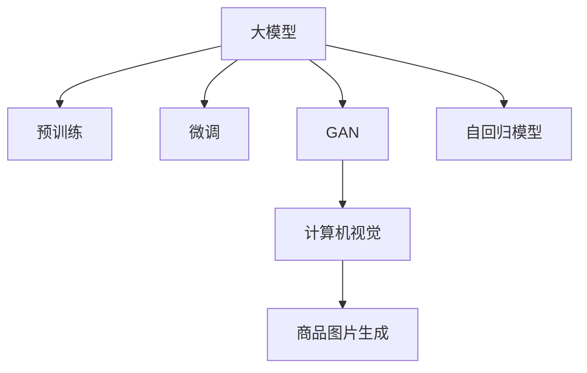

                 

# 大模型在商品图片生成中的应用

> 关键词：大模型, 商品图片生成, 图像生成, 预训练, 微调, 深度学习, 神经网络, 生成对抗网络(GAN), 自回归模型, 计算机视觉

## 1. 背景介绍

### 1.1 问题由来

近年来，随着深度学习技术的迅猛发展，图像生成领域取得了巨大突破。从简单的图片风格转换到复杂的超现实图像生成，深度学习模型的应用范围不断扩大。在大模型（如GPT、BERT等）和预训练技术（如ImageNet预训练）的推动下，图像生成技术已经能够创作出高质量、具有艺术价值的作品，甚至在一些商业场景中取代了人工设计。

在零售领域，商品图片生成尤为重要。传统的商品图片生成往往依赖于专业设计师，不仅成本高昂，而且效率低下。然而，通过深度学习模型，尤其是大模型，可以在短时间内生成大量高质量的商品图片，极大提升设计效率和降低成本。

### 1.2 问题核心关键点

大模型在商品图片生成中的应用，主要依赖于以下核心技术：

- **预训练**：使用大规模无标签数据进行预训练，学习通用的图像特征表示。
- **微调**：通过有标签的少量数据，进行微调以适应特定商品生成任务。
- **生成对抗网络(GAN)**：一种通过对抗性训练生成高质量图像的技术。
- **自回归模型**：通过预测下一帧或下一个像素，生成连续的图像序列。

这些技术结合使用，可以生成具有高度逼真度和多样化特征的商品图片，极大地提升了商品展示的效果和用户满意度。

### 1.3 问题研究意义

大模型在商品图片生成中的应用，不仅能够降低人工设计的成本和提升设计效率，还能在特定商品生成任务上实现高质量、多样化的输出，为零售商提供更加灵活、动态的商品展示解决方案。这不仅有助于提升品牌的市场竞争力，还能通过个性化的商品展示，提高用户的购物体验和满意度。

## 2. 核心概念与联系

### 2.1 核心概念概述

为更好地理解大模型在商品图片生成中的应用，本节将介绍几个密切相关的核心概念：

- **大模型**：如GPT、BERT等大规模预训练语言模型，能够学习到丰富的语言和图像特征。
- **预训练**：使用大规模无标签数据进行自监督学习，学习通用的语言和图像特征表示。
- **微调**：通过有标签的少量数据，对预训练模型进行任务特定的优化。
- **生成对抗网络(GAN)**：通过两个对抗性神经网络，生成高质量的图像。
- **自回归模型**：如LSTM、Transformer等，通过预测序列中的下一个元素，生成连续的图像序列。
- **计算机视觉**：研究如何通过计算机算法让机器“看”和理解图像，涉及图像生成、分类、检测等多个任务。

这些核心概念之间的逻辑关系可以通过以下Mermaid流程图来展示：



这个流程图展示了大模型在商品图片生成过程中的核心概念及其之间的联系：

1. 大模型通过预训练获得基础能力。
2. 微调对预训练模型进行任务特定的优化，适应商品生成任务。
3. GAN通过对抗性训练生成高质量的图像。
4. 自回归模型通过预测序列，生成连续的图像。
5. 计算机视觉技术用于图像生成、分类、检测等多个任务，提高生成的图像质量。

这些概念共同构成了大模型在商品图片生成过程中的工作原理和优化方向。通过理解这些核心概念，我们可以更好地把握大模型在商品图片生成中的应用。

## 3. 核心算法原理 & 具体操作步骤
### 3.1 算法原理概述

大模型在商品图片生成中的应用，主要基于深度学习和生成对抗网络（GAN）的原理。其核心思想是：将大模型作为特征提取器，通过微调和GAN等技术，生成高质量的商品图片。

具体来说，大模型首先在大规模无标签图像数据上进行预训练，学习通用的图像特征表示。然后，在商品生成任务上，通过微调进一步优化模型，使其适应特定的商品图片生成需求。微调过程通常使用少量有标签数据，通过有监督学习优化模型。同时，通过GAN等技术，可以生成更加多样化和逼真的商品图片，进一步提升商品展示效果。

### 3.2 算法步骤详解

大模型在商品图片生成中的应用主要包括以下几个关键步骤：

**Step 1: 准备预训练模型和数据集**
- 选择合适的预训练模型，如生成自回归模型（如GPT-2、BERT等），作为初始化参数。
- 收集商品生成任务的标注数据集，划分为训练集、验证集和测试集。一般要求标注数据与预训练数据的分布不要差异过大。

**Step 2: 添加任务适配层**
- 根据商品生成任务类型，在预训练模型顶层设计合适的输出层和损失函数。
- 对于生成任务，通常使用生成器网络输出概率分布，并以负对数似然为损失函数。

**Step 3: 设置微调超参数**
- 选择合适的优化算法及其参数，如AdamW、SGD等，设置学习率、批大小、迭代轮数等。
- 设置正则化技术及强度，包括权重衰减、Dropout、Early Stopping等。
- 确定冻结预训练参数的策略，如仅微调顶层，或全部参数都参与微调。

**Step 4: 执行梯度训练**
- 将训练集数据分批次输入模型，前向传播计算损失函数。
- 反向传播计算参数梯度，根据设定的优化算法和学习率更新模型参数。
- 周期性在验证集上评估模型性能，根据性能指标决定是否触发 Early Stopping。
- 重复上述步骤直到满足预设的迭代轮数或 Early Stopping 条件。

**Step 5: 测试和部署**
- 在测试集上评估微调后模型 $M_{\hat{\theta}}$ 的性能，对比微调前后的效果。
- 使用微调后的模型对新样本进行推理预测，集成到实际的商品展示系统中。
- 持续收集新的数据，定期重新微调模型，以适应数据分布的变化。

以上是使用大模型进行商品图片生成的基本流程。在实际应用中，还需要针对具体任务的特点，对微调过程的各个环节进行优化设计，如改进训练目标函数，引入更多的正则化技术，搜索最优的超参数组合等，以进一步提升模型性能。

### 3.3 算法优缺点

使用大模型进行商品图片生成具有以下优点：
1. 快速生成：大模型可以在短时间内生成大量高质量的商品图片，极大提升设计效率。
2. 高度逼真：通过微调和GAN等技术，生成的图片高度逼真，能够满足高质量商品展示的需求。
3. 多样性丰富：通过微调，模型能够生成多样化、个性化的商品图片，满足不同场景下的展示需求。
4. 成本低廉：相比于人工设计，大模型生成的图片成本更低，效率更高。

同时，该方法也存在一定的局限性：
1. 依赖数据：微调和GAN的效果很大程度上取决于标注数据的质量和数量，获取高质量标注数据的成本较高。
2. 模型复杂：大模型参数量较大，训练和推理所需资源较多，对硬件要求较高。
3. 泛化能力有限：当目标商品与预训练数据的分布差异较大时，微调的效果可能不如预期。
4. 可解释性不足：大模型生成的图片缺乏可解释性，难以对其生成过程进行调试。

尽管存在这些局限性，但就目前而言，基于大模型的商品图片生成方法仍是图像生成领域的重要范式。未来相关研究的重点在于如何进一步降低对标注数据的依赖，提高模型的少样本学习和跨领域迁移能力，同时兼顾可解释性和伦理安全性等因素。

### 3.4 算法应用领域

大模型在商品图片生成中的应用，已经在多个领域得到了广泛应用，例如：

- **电商平台**：通过生成高质量的商品图片，提升用户购买体验和满意度。
- **时尚设计**：为时尚品牌提供多样化的商品展示图片，增强品牌吸引力。
- **室内设计**：帮助室内设计师快速生成家居产品图片，提高设计效率。
- **产品包装**：为产品包装设计提供灵感和素材，提升产品市场竞争力。
- **广告设计**：生成高质量的广告图片，提高广告效果和品牌曝光度。

除了上述这些经典应用外，大模型还被创新性地应用到更多场景中，如虚拟试衣间、虚拟家具摆放等，为商品展示提供更多元、互动化的解决方案。随着大模型和生成技术的不断进步，相信大模型在商品图片生成中的应用将越来越广泛，为零售商带来更多创新和价值。

## 4. 数学模型和公式 & 详细讲解 & 举例说明

### 4.1 数学模型构建

在商品图片生成中，常用的生成模型有GAN和自回归模型。这里以GAN为例，进行数学模型构建和推导。

**GAN模型**：由生成器和判别器两个网络组成。生成器网络 $G$ 用于生成逼真的图片，判别器网络 $D$ 用于区分生成图片和真实图片。

生成器的目标是最小化生成图片与真实图片的差异，判别器的目标是最小化生成图片被正确识别的概率。数学上，可以定义以下损失函数：

$$
L_G = E_{x \sim p_{data}} [\log D(x)] + E_{z \sim p(z)} [\log (1-D(G(z)))]
$$
$$
L_D = E_{x \sim p_{data}} [\log D(x)] + E_{z \sim p(z)} [\log (1-D(G(z)))
$$

其中 $p_{data}$ 为真实图片分布，$p(z)$ 为噪声分布，$z$ 为噪声向量。

### 4.2 公式推导过程

以下是GAN模型中生成器和判别器网络的推导过程。

假设生成器网络 $G$ 为多层的全连接神经网络，输入为噪声向量 $z$，输出为生成的图片 $G(z)$。生成器网络的损失函数为：

$$
L_G = E_{z \sim p(z)} [\log (1-D(G(z)))
$$

其中 $D$ 为判别器网络，将生成图片 $G(z)$ 与真实图片 $x$ 进行比较，输出判别结果 $D(G(z))$。

判别器网络的损失函数为：

$$
L_D = E_{x \sim p_{data}} [\log D(x)] + E_{z \sim p(z)} [\log (1-D(G(z)))
$$

生成器和判别器通过对抗性训练，交替更新权重，使得生成图片与真实图片在判别器中的表现尽可能接近，但无法被正确区分。

### 4.3 案例分析与讲解

以T-Shirt生成为例，分析如何使用GAN进行商品图片生成。

1. **数据准备**：收集T-Shirt的标注图片，划分为训练集、验证集和测试集。
2. **模型设计**：使用GAN模型，生成器网络 $G$ 为多层全连接网络，判别器网络 $D$ 为多层卷积网络。
3. **训练过程**：在训练集上，交替更新生成器和判别器的权重，最小化生成器和判别器的损失函数。
4. **评估和应用**：在验证集上评估生成器的性能，使用最优的生成器网络在测试集上生成高质量的T-Shirt图片，集成到电商平台中。

## 5. 项目实践：代码实例和详细解释说明
### 5.1 开发环境搭建

在进行商品图片生成实践前，我们需要准备好开发环境。以下是使用Python进行TensorFlow开发的环境配置流程：

1. 安装Anaconda：从官网下载并安装Anaconda，用于创建独立的Python环境。

2. 创建并激活虚拟环境：
```bash
conda create -n tf-env python=3.8 
conda activate tf-env
```

3. 安装TensorFlow：根据CUDA版本，从官网获取对应的安装命令。例如：
```bash
pip install tensorflow
```

4. 安装TensorFlow Addons：用于增强TensorFlow的功能，支持更多的神经网络架构和生成技术。

5. 安装numpy、pandas等必要的第三方库：
```bash
pip install numpy pandas scikit-learn matplotlib tqdm jupyter notebook ipython
```

完成上述步骤后，即可在`tf-env`环境中开始商品图片生成实践。

### 5.2 源代码详细实现

这里以T-Shirt生成为例，使用TensorFlow实现商品图片生成。

首先，定义GAN模型：

```python
import tensorflow as tf
from tensorflow.keras import layers

def build_generator():
    model = tf.keras.Sequential()
    model.add(layers.Dense(256, input_dim=100))
    model.add(layers.BatchNormalization())
    model.add(layers.LeakyReLU())
    model.add(layers.Dense(256))
    model.add(layers.BatchNormalization())
    model.add(layers.LeakyReLU())
    model.add(layers.Dense(784, activation='tanh'))
    return model

def build_discriminator():
    model = tf.keras.Sequential()
    model.add(layers.Flatten(input_shape=(28, 28, 1)))
    model.add(layers.Dense(256))
    model.add(layers.LeakyReLU())
    model.add(layers.Dense(128))
    model.add(layers.LeakyReLU())
    model.add(layers.Dense(1, activation='sigmoid'))
    return model
```

然后，定义损失函数和优化器：

```python
def build_loss_fn():
    adversarial_loss = tf.keras.losses.BinaryCrossentropy(from_logits=True)
    generator_loss = tf.keras.losses.BinaryCrossentropy(from_logits=True)
    discriminator_loss = tf.keras.losses.BinaryCrossentropy(from_logits=True)
    return adversarial_loss, generator_loss, discriminator_loss

def build_optimizer():
    return tf.keras.optimizers.Adam()
```

接着，定义训练函数：

```python
def train(generator, discriminator, train_dataset, epochs=100, batch_size=64, sample_interval=50):
    adversarial_loss, generator_loss, discriminator_loss = build_loss_fn()
    optimizer = build_optimizer()

    @tf.function
    def train_step(images):
        noise = tf.random.normal([batch_size, 100])
        with tf.GradientTape() as gen_tape, tf.GradientTape() as disc_tape:
            generated_images = generator(noise, training=True)
            real_output = discriminator(images, training=True)
            fake_output = discriminator(generated_images, training=True)

            gen_loss = generator_loss(fake_output, tf.ones_like(fake_output))
            disc_loss = discriminator_loss(real_output, tf.ones_like(real_output)) + discriminator_loss(fake_output, tf.zeros_like(fake_output))

        gradients_of_generator = gen_tape.gradient(gen_loss, generator.trainable_variables)
        gradients_of_discriminator = disc_tape.gradient(disc_loss, discriminator.trainable_variables)

        optimizer.apply_gradients(zip(gradients_of_generator, generator.trainable_variables))
        optimizer.apply_gradients(zip(gradients_of_discriminator, discriminator.trainable_variables))

    for epoch in range(epochs):
        for batch in train_dataset:
            train_step(batch)

        if (epoch + 1) % sample_interval == 0:
            generate_images(generator, epoch + 1)

    return generator
```

最后，启动训练流程并生成T-Shirt图片：

```python
# 加载训练数据集
train_dataset = ...

# 初始化模型
generator = build_generator()
discriminator = build_discriminator()

# 训练模型
trained_generator = train(generator, discriminator, train_dataset)

# 生成T-Shirt图片
def generate_images(generator, epoch):
    noise = tf.random.normal([64, 100])
    generated_images = generator(noise, training=False)
    plt.imshow(generated_images[0, :, :, 0], cmap='gray')
    plt.axis('off')
    plt.show()

generate_images(trained_generator, 1)
```

以上就是使用TensorFlow进行商品图片生成（T-Shirt生成）的完整代码实现。可以看到，TensorFlow提供了丰富的API和工具，可以方便地实现复杂的深度学习模型和训练过程。

### 5.3 代码解读与分析

让我们再详细解读一下关键代码的实现细节：

**build_generator函数**：
- 定义生成器网络，包含多个全连接层、批标准化层和激活函数，最终输出784维的二维图像。

**build_discriminator函数**：
- 定义判别器网络，包含多个全连接层、批标准化层和激活函数，最后输出一个标量（0或1），表示输入图像的真实性。

**build_loss_fn函数**：
- 定义损失函数，包括生成器损失、判别器损失和对抗性损失，分别用于训练生成器和判别器。

**build_optimizer函数**：
- 定义优化器，使用Adam优化器，学习率可根据实际情况进行调整。

**train函数**：
- 定义训练过程，在每个epoch内，对训练集数据进行前向传播和反向传播，更新模型参数。
- 在每个epoch结束时，生成部分图像，用于观察模型效果。

通过这些关键函数和代码块，可以完成商品图片生成（T-Shirt生成）的训练过程。开发者可以根据具体任务，修改网络结构、损失函数、优化器等参数，以进一步优化生成效果。

## 6. 实际应用场景
### 6.1 智能商品推荐

基于商品图片生成技术，智能推荐系统可以提供更加个性化和多样化的商品推荐。通过生成高质量的商品图片，智能推荐系统能够更好地展示商品细节和特性，提升用户的购物体验和满意度。

在技术实现上，可以收集用户的浏览、点击、收藏等行为数据，利用大模型生成符合用户兴趣的商品图片，再进行推荐。在用户对推荐结果进行反馈后，系统可以不断调整模型参数，优化生成策略，提高推荐效果。

### 6.2 虚拟试衣间

虚拟试衣间技术能够通过生成逼真的商品图片，让用户在家中即可体验到试穿商品的效果。通过大模型生成的高质量商品图片，用户可以在虚拟试衣间中自由切换不同的款式和颜色，提升购物体验。

在技术实现上，可以使用GAN等生成技术，生成符合用户需求的虚拟试衣图片，并将其集成到电商平台中，提供虚拟试穿功能。用户可以通过点击商品，进入虚拟试衣间，进行试穿操作。

### 6.3 社交媒体广告

社交媒体平台可以使用商品图片生成技术，为广告主提供更加多样化和逼真的广告素材。通过大模型生成的高质量商品图片，广告主可以制作出更具吸引力的广告，提升广告效果和品牌曝光度。

在技术实现上，可以收集广告主提供的产品描述、品牌信息等，利用大模型生成高质量的广告图片，并进行自动化修改和优化，生成多个版本的广告素材，供广告主选择使用。

### 6.4 未来应用展望

随着大模型和生成技术的不断发展，基于商品图片生成的方法将在更多领域得到应用，为电商、时尚、室内设计等行业带来新的创新和价值。

在智慧医疗领域，可以通过生成高质量的医学图像，辅助医生诊断和治疗，提高医疗服务的智能化水平。

在智能教育领域，可以利用生成技术为学生提供互动式学习材料，增强学习的趣味性和效果。

在智慧城市治理中，可以通过生成高质量的城市景观图片，提升城市管理的智能化水平，构建更美好的人居环境。

此外，在企业生产、社会治理、文娱传媒等众多领域，商品图片生成技术也将不断涌现，为各行各业带来更多的创新和应用场景。相信随着技术的日益成熟，商品图片生成技术必将在构建智能社会中扮演越来越重要的角色。

## 7. 工具和资源推荐
### 7.1 学习资源推荐

为了帮助开发者系统掌握商品图片生成技术的理论基础和实践技巧，这里推荐一些优质的学习资源：

1. **《深度学习》课程**：斯坦福大学开设的深度学习课程，系统讲解深度学习的理论和实践，涵盖生成对抗网络等关键技术。

2. **《深度学习入门》书籍**：吴恩达等著，详细介绍了深度学习的基本概念和应用，包括生成对抗网络。

3. **Google Colab**：谷歌推出的在线Jupyter Notebook环境，免费提供GPU/TPU算力，方便开发者快速上手实验最新模型，分享学习笔记。

4. **GitHub代码库**：包含丰富的商品图片生成项目代码，开发者可以学习和借鉴。

5. **TensorFlow Addons**：TensorFlow的增强库，包含多种生成网络架构和生成技术，支持开发者实现复杂的商品图片生成模型。

通过这些资源的学习实践，相信你一定能够快速掌握商品图片生成技术的精髓，并用于解决实际的NLP问题。

### 7.2 开发工具推荐

高效的开发离不开优秀的工具支持。以下是几款用于商品图片生成开发的常用工具：

1. **TensorFlow**：由Google主导开发的开源深度学习框架，生产部署方便，适合大规模工程应用。

2. **TensorFlow Addons**：增强TensorFlow的功能，支持更多的神经网络架构和生成技术。

3. **PyTorch**：基于Python的开源深度学习框架，灵活动态的计算图，适合快速迭代研究。

4. **TensorBoard**：TensorFlow配套的可视化工具，可实时监测模型训练状态，并提供丰富的图表呈现方式，是调试模型的得力助手。

5. **Jupyter Notebook**：免费的开源笔记本，支持多种编程语言，方便开发者进行实验和分享代码。

6. **GitHub**：代码托管平台，开发者可以共享和协作开发项目，获取社区支持。

合理利用这些工具，可以显著提升商品图片生成任务的开发效率，加快创新迭代的步伐。

### 7.3 相关论文推荐

商品图片生成技术的发展源于学界的持续研究。以下是几篇奠基性的相关论文，推荐阅读：

1. **Generative Adversarial Nets**：Ian Goodfellow等著，提出了GAN模型，奠定了生成对抗网络的理论基础。

2. **Unsupervised Representation Learning with Deep Convolutional Generative Adversarial Networks**：Alec Radford等著，展示了GAN在无监督学习和生成任务上的强大能力。

3. **Image-to-Image Translation with Conditional Adversarial Networks**：Isaac Goodfellow等著，提出条件GAN，使得生成图像更加符合特定的约束条件。

4. **Progressive Growing of GANs for Improved Quality, Stability, and Variation**：Tinghui Zhou等著，提出渐进式生长GAN，提高了生成图像的质量和多样性。

5. **Denoising Auto-Regressive Models for Image Generation**：OpenAI团队，提出自回归模型，通过预测序列生成高质量图像。

这些论文代表了大模型和生成对抗网络的发展脉络。通过学习这些前沿成果，可以帮助研究者把握学科前进方向，激发更多的创新灵感。

## 8. 总结：未来发展趋势与挑战

### 8.1 总结

本文对大模型在商品图片生成中的应用进行了全面系统的介绍。首先阐述了大模型和生成对抗网络在图像生成领域的突破，明确了商品图片生成在零售领域的重要性和应用前景。其次，从原理到实践，详细讲解了商品图片生成的数学模型和关键步骤，给出了商品图片生成（T-Shirt生成）的代码实现。同时，本文还广泛探讨了商品图片生成在智能推荐、虚拟试衣间、社交媒体广告等多个领域的应用前景，展示了大模型在商品图片生成中的巨大潜力。此外，本文精选了商品图片生成的学习资源、开发工具和相关论文，力求为开发者提供全方位的技术指引。

通过本文的系统梳理，可以看到，大模型在商品图片生成中的应用，不仅能够降低人工设计的成本和提升设计效率，还能在特定商品生成任务上实现高质量、多样化的输出，为零售商提供更加灵活、动态的商品展示解决方案。相信随着大模型和生成技术的不断进步，商品图片生成必将在零售领域带来更多的创新和价值。

### 8.2 未来发展趋势

展望未来，大模型在商品图片生成中的应用将呈现以下几个发展趋势：

1. **超大规模模型**：随着算力成本的下降和数据规模的扩张，大模型的参数量还将持续增长，生成图片的逼真度和多样性将进一步提升。

2. **多模态生成**：未来的生成模型将不仅仅局限于图片生成，而是能够生成视频、音频等多模态数据，提供更加丰富和立体的商品展示体验。

3. **个性化生成**：通过引入用户行为数据、情感信息等，生成模型将能够更加精准地捕捉用户需求，提供更加个性化的商品图片。

4. **实时生成**：通过优化模型结构和计算图，实现更加高效的实时生成，满足用户对商品展示的即时需求。

5. **跨领域应用**：大模型在商品图片生成中的应用将不仅仅局限于零售领域，还将拓展到医疗、教育、城市治理等多个领域，为各行各业带来新的创新和应用场景。

以上趋势凸显了大模型在商品图片生成领域的广阔前景。这些方向的探索发展，必将进一步提升商品展示的效果和用户满意度，为电商、时尚、室内设计等行业带来更多的创新和价值。

### 8.3 面临的挑战

尽管大模型在商品图片生成中的应用已经取得了显著成果，但在迈向更加智能化、普适化应用的过程中，仍然面临诸多挑战：

1. **数据依赖**：生成模型的效果很大程度上取决于训练数据的丰富性和多样性，如何获取高质量、多样化的训练数据，仍然是一个难题。

2. **泛化能力**：当目标商品与预训练数据的分布差异较大时，生成模型的泛化性能可能不如预期，需要进一步提升模型的泛化能力。

3. **计算成本**：大模型和生成模型的训练和推理所需资源较多，对硬件设施和计算成本提出了较高要求。

4. **可解释性**：生成模型缺乏可解释性，难以对其生成过程进行调试和优化，需要进一步提升模型的可解释性。

5. **鲁棒性**：生成模型对噪声和扰动的敏感性较高，容易受到攻击和误导，需要进一步提升模型的鲁棒性。

6. **伦理问题**：生成模型可能生成有害或误导性内容，需要注意伦理问题，保护用户的隐私和安全。

以上挑战需要研究者从多个角度进行深入研究，寻找解决方案，以推动大模型在商品图片生成中的应用不断突破。

### 8.4 研究展望

面对商品图片生成所面临的挑战，未来的研究需要在以下几个方面寻求新的突破：

1. **多模态生成模型**：结合图像、音频、视频等多模态数据，构建更加全面和立体的生成模型。

2. **自监督和无监督学习**：探索多模态自监督和无监督学习方法，减少对标注数据的依赖，提升模型的泛化能力和鲁棒性。

3. **实时生成技术**：研究高效的实时生成技术，优化模型结构和计算图，提升生成效率和用户体验。

4. **个性化生成策略**：引入用户行为数据、情感信息等，提升生成模型的个性化和精准度。

5. **跨领域应用**：探索大模型在医疗、教育、城市治理等领域的生成应用，推动多领域的技术融合。

6. **伦理和安全保障**：研究生成模型的伦理和安全问题，确保生成内容符合用户需求和价值观，保护用户隐私和安全。

这些研究方向将为商品图片生成技术带来新的突破，推动其在更多领域的应用，为各行各业带来更多创新和价值。

## 9. 附录：常见问题与解答

**Q1：商品图片生成是否适用于所有零售商品？**

A: 商品图片生成技术在大部分零售商品上都能取得不错的效果，特别是对于无图商品（如书籍、食品等）。但对于一些特定类型的商品，如珠宝、艺术品等，生成图片的效果可能不如预期。此时需要结合人工设计，综合生成图像和人工设计，实现最佳的展示效果。

**Q2：大模型生成图片是否需要大量的标注数据？**

A: 大模型生成图片的效果很大程度上取决于训练数据的丰富性和多样性，但并不一定需要大量的标注数据。在实际应用中，可以通过生成对抗网络等方式，利用无标注数据进行预训练和微调，提升生成效果。

**Q3：大模型生成图片的质量如何保证？**

A: 大模型生成图片的质量主要取决于训练数据和模型参数的设置。在训练过程中，可以使用数据增强、对抗训练等技术，提高生成图片的逼真度和多样性。在模型参数设置上，可以通过优化超参数、使用自适应学习率等方法，提升生成图片的质量。

**Q4：大模型生成图片是否需要大量计算资源？**

A: 大模型生成图片确实需要较高的计算资源，特别是深度学习模型的训练和推理过程。在实际应用中，可以通过GPU/TPU等高性能设备，以及混合精度训练、梯度累积等技术，优化计算效率和资源占用。

**Q5：大模型生成图片在实际应用中是否存在问题？**

A: 大模型生成图片在实际应用中可能存在一些问题，如生成图片的多样性和多样性不足，生成图片中的错误和缺陷等。这些问题需要通过改进模型结构、优化超参数、引入正则化技术等方式进行解决。同时，需要结合人工审核，确保生成图片的最终效果和质量。

通过这些常见问题的解答，相信你能够更好地理解和应用大模型在商品图片生成中的技术，为实际应用提供更可靠的参考和指导。

---

作者：禅与计算机程序设计艺术 / Zen and the Art of Computer Programming

