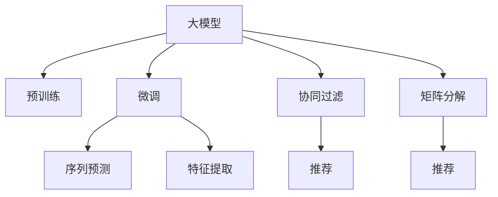

                 

# 大模型在推荐系统中的关键作用

## 1. 背景介绍

### 1.1 问题由来

推荐系统（Recommender System）是互联网时代典型的个性化推荐服务。随着用户规模的不断扩大，用户行为数据的快速积累，推荐系统逐渐从商品推荐、音乐推荐、视频推荐，发展到智能客服、内容推送、广告投放等多个领域。

推荐系统的核心目标是：通过分析用户行为数据，预测用户对未接触过的物品（商品、文章、视频等）的兴趣程度，并为其推荐最相关的物品。传统的推荐系统以协同过滤、矩阵分解等方法为主，但这些方法在数据量较大时，常常面临计算复杂度高、特征工程复杂等问题。

近年来，深度学习和大模型在推荐系统中的应用逐渐增多，特别是在商品推荐、视频推荐等电商、娱乐领域，带来了显著的性能提升。大模型通过学习海量数据，可以自动发现并提取特征，自适应地进行用户行为预测和物品推荐。

### 1.2 问题核心关键点

基于大模型的推荐系统通常可以分为两大类：

1. 基于序列预测的推荐（Sequential Recommendation）：如序列生成模型、变分自编码器等，通过预测用户的下一步行为，如点击、浏览、购买等，来推荐物品。
2. 基于图像和文字特征的推荐（Feature-based Recommendation）：如基于视觉的推荐系统、文本推荐系统等，通过提取用户或物品的特征，建立用户与物品之间的关联关系。

大模型在推荐系统中的关键作用主要体现在以下几个方面：

- **特征提取能力强**：大模型能够自动学习到数据中的高层次、抽象化的特征表示，显著提升特征提取效果。
- **适应性强**：大模型可以自适应地学习到数据分布的复杂模式，适应不同场景下的推荐需求。
- **泛化能力强**：大模型通过大规模数据预训练，具备较强的泛化能力，能够有效推广到未见过的数据上。

### 1.3 问题研究意义

大模型在推荐系统中的应用，能够显著提升推荐效果，提高用户体验，促进用户留存和消费转化。对于电商、娱乐、媒体等众多互联网企业，推荐系统是其商业变现的重要手段，大模型的应用可以带来显著的商业收益。

此外，大模型在推荐系统中的应用，也为更广泛的自然语言处理(NLP)和计算机视觉(CV)技术在推荐领域的应用提供了新思路，推动了跨领域技术融合的发展。

## 2. 核心概念与联系

### 2.1 核心概念概述

为了深入理解大模型在推荐系统中的作用，我们需要先了解一些核心概念：

- **大模型（Large Model）**：指具有数十亿甚至数百亿参数的大规模神经网络模型。如BERT、GPT、DALL-E等。
- **预训练（Pre-training）**：指在大规模无标签数据上进行自监督学习，学习通用特征表示的过程。
- **微调（Fine-tuning）**：指在预训练模型的基础上，针对特定任务进行有监督的训练，优化模型在特定任务上的性能。
- **用户行为预测（User Behavior Prediction）**：指通过分析用户历史行为数据，预测其对未来行为的兴趣和倾向。
- **物品推荐（Item Recommendation）**：指根据用户的兴趣和行为，为其推荐最相关的物品。
- **协同过滤（Collaborative Filtering）**：指基于用户和物品之间的相似性，进行推荐预测。
- **矩阵分解（Matrix Factorization）**：指将用户和物品之间的行为关系，表示为矩阵的分解形式，进行推荐预测。

这些概念之间的逻辑关系可以通过以下Mermaid流程图来展示：



该流程图展示了大模型的核心概念及其之间的关系：

1. 大模型通过预训练获得基础能力。
2. 微调是对预训练模型进行任务特定的优化，可以分为序列预测和特征提取两种范式。
3. 协同过滤和矩阵分解为经典推荐方法，通常与大模型结合使用。
4. 用户行为预测和物品推荐为推荐系统的主要任务。

这些概念共同构成了大模型在推荐系统中的学习和应用框架，使其能够高效地进行推荐预测。

## 3. 核心算法原理 & 具体操作步骤
### 3.1 算法原理概述

基于大模型的推荐系统，本质上是一个通过学习用户行为数据，预测用户未来行为并推荐相关物品的过程。其核心思想是：将用户行为数据输入大模型进行特征提取，构建用户和物品的表示，并通过计算用户与物品之间的相似度来进行推荐。

具体而言，假设用户行为数据为 $U=\{(x_i,y_i)\}_{i=1}^N, x_i \in \mathcal{X}, y_i \in \mathcal{Y}$，其中 $x_i$ 为输入特征，$y_i$ 为输出标签。模型通过学习数据分布，得到用户行为预测函数 $f(\theta, x)$，其中 $\theta$ 为模型参数。推荐系统可以基于此函数进行推荐预测，为用户推荐最相关的物品。

### 3.2 算法步骤详解

基于大模型的推荐系统一般包括以下几个关键步骤：

**Step 1: 准备数据集**

- 收集用户行为数据，通常包括点击、浏览、购买、评分等行为。
- 将数据集划分为训练集、验证集和测试集，一般要求训练集和测试集在数据分布上具有差异。

**Step 2: 构建大模型**

- 选择合适的预训练语言模型或视觉模型，如BERT、GPT、ResNet等。
- 在大规模数据上进行预训练，得到通用特征表示。
- 在特定任务上进行微调，如用户行为预测、物品推荐等。

**Step 3: 设计推荐算法**

- 设计推荐的策略和计算方式，如基于序列的预测、基于特征的匹配等。
- 使用微调后的模型，预测用户对物品的兴趣度，并根据相似度排序推荐。

**Step 4: 评估和优化**

- 在测试集上评估推荐效果，常用的指标包括准确率、召回率、F1分数等。
- 根据评估结果进行模型优化，调整超参数、改进模型结构等。

**Step 5: 部署和迭代**

- 将优化后的模型部署到实际系统中，进行实时推荐。
- 持续收集用户反馈和行为数据，定期重新微调模型，以适应新的数据分布。

以上是基于大模型的推荐系统的一般流程。在实际应用中，还需要针对具体任务的特点，对推荐算法和模型结构进行优化设计，以进一步提升推荐效果。

### 3.3 算法优缺点

基于大模型的推荐系统有以下优点：

1. 特征提取能力强。大模型能够自动学习到数据中的高层次、抽象化的特征表示，显著提升特征提取效果。
2. 适应性强。大模型可以自适应地学习到数据分布的复杂模式，适应不同场景下的推荐需求。
3. 泛化能力强。大模型通过大规模数据预训练，具备较强的泛化能力，能够有效推广到未见过的数据上。
4. 推荐效果好。基于大模型的推荐系统在多个电商、娱乐领域取得了显著的推荐效果，提升了用户满意度。

但大模型推荐系统也存在一定的局限性：

1. 计算成本高。大模型的训练和推理需要高算力支持，导致高昂的计算成本。
2. 数据隐私风险。大规模用户行为数据的收集和存储，存在数据隐私和安全风险。
3. 模型可解释性不足。大模型的复杂结构和深度，导致推荐决策过程缺乏可解释性，难以进行调试和优化。

尽管存在这些局限性，但基于大模型的推荐系统仍是目前推荐领域的主流范式，具有广泛的应用前景。未来相关研究将进一步探索如何降低计算成本，保护用户隐私，增强模型可解释性等关键问题。

### 3.4 算法应用领域

基于大模型的推荐系统，在电商、娱乐、媒体等多个领域已经得到了广泛的应用，例如：

- **电商推荐**：根据用户浏览、购买历史，预测其对新物品的兴趣，进行个性化推荐。
- **视频推荐**：通过分析用户观看记录，推荐用户感兴趣的视频内容。
- **内容推荐**：根据用户阅读、点赞记录，推荐最相关的文章、图片等。
- **广告投放**：通过预测用户对广告的兴趣，进行精准广告投放，提升广告效果。
- **音乐推荐**：根据用户听歌记录，推荐新的音乐作品。

除了这些经典应用外，大模型推荐系统也被创新性地应用到更多场景中，如知识图谱构建、跨领域推荐等，为推荐领域带来了新的发展动力。

## 4. 数学模型和公式 & 详细讲解  
### 4.1 数学模型构建

我们以基于序列预测的推荐系统为例，使用数学语言对推荐模型的构建进行更加严格的刻画。

假设用户行为数据为 $U=\{(x_i,y_i)\}_{i=1}^N, x_i \in \mathcal{X}, y_i \in \mathcal{Y}$。将用户行为数据输入到BERT模型进行特征提取，得到用户和物品的表示：

$$
\mathbf{x}_u = BERT(x_u), \mathbf{x}_i = BERT(x_i)
$$

其中 $x_u$ 为用户的输入特征，$x_i$ 为物品的输入特征。然后，使用预测函数 $f(\theta, \mathbf{x}_u, \mathbf{x}_i)$ 对用户对物品的兴趣度进行预测，得到兴趣度分数：

$$
y_i = f(\theta, \mathbf{x}_u, \mathbf{x}_i)
$$

最后，根据兴趣度分数进行物品排序推荐：

$$
\text{推荐列表} = \mathop{\arg\max}_{i} y_i
$$

其中 $\theta$ 为模型参数，$f(\theta, \mathbf{x}_u, \mathbf{x}_i)$ 为预测函数。预测函数可以使用多层感知器、卷积神经网络等深度学习模型。

### 4.2 公式推导过程

以下我们以多层感知器（MLP）为例，推导预测函数的具体形式。

假设用户行为数据 $U=\{(x_i,y_i)\}_{i=1}^N, x_i \in \mathcal{X}, y_i \in \mathcal{Y}$。将用户行为数据输入到BERT模型进行特征提取，得到用户和物品的表示：

$$
\mathbf{x}_u = BERT(x_u), \mathbf{x}_i = BERT(x_i)
$$

预测函数 $f(\theta, \mathbf{x}_u, \mathbf{x}_i)$ 的形式为：

$$
f(\theta, \mathbf{x}_u, \mathbf{x}_i) = \text{MLP}(\mathbf{x}_u, \mathbf{x}_i; \theta)
$$

其中 $\theta$ 为MLP模型的参数，$\text{MLP}$ 为多层感知器模型，具有两个输入 $x_u, x_i$ 和一个输出 $y_i$。具体形式为：

$$
f(\theta, \mathbf{x}_u, \mathbf{x}_i) = \sigma(\text{MLP}(\mathbf{x}_u, \mathbf{x}_i; \theta))
$$

其中 $\sigma$ 为激活函数，通常使用ReLU或Sigmoid。

预测函数的具体形式可以通过多层的矩阵运算进行展开：

$$
f(\theta, \mathbf{x}_u, \mathbf{x}_i) = \mathbf{W}_o \sigma(\mathbf{W}_h \sigma(\mathbf{W}_x \mathbf{x}_u + \mathbf{b}_x) + \mathbf{b}_h) + \mathbf{b}_o
$$

其中 $\mathbf{W}_x, \mathbf{W}_h, \mathbf{W}_o$ 为权重矩阵，$\mathbf{b}_x, \mathbf{b}_h, \mathbf{b}_o$ 为偏置向量。$\sigma$ 为激活函数，通常使用ReLU或Sigmoid。

通过上述预测函数，可以对用户对物品的兴趣度进行预测，并根据兴趣度排序推荐。

### 4.3 案例分析与讲解

以下我们以电商推荐系统为例，具体展示大模型在推荐系统中的应用。

电商推荐系统的核心任务是预测用户对商品的兴趣度，并根据兴趣度进行排序推荐。可以使用以下步骤进行构建：

1. 数据准备：收集用户的历史行为数据，如浏览、点击、购买记录等。
2. 用户行为预处理：对用户行为数据进行清洗、归一化等处理。
3. 用户和商品表示提取：使用BERT模型对用户和商品特征进行编码，得到用户和商品的表示。
4. 预测函数设计：设计多层感知器模型，预测用户对商品的兴趣度。
5. 推荐排序：根据兴趣度分数，对商品进行排序推荐。

下面给出一个具体的实现示例：

```python
import torch
from transformers import BertForSequenceClassification

# 用户行为数据
user_data = [
    {'id': 1, 'item_id': 101, 'type': 'click'},
    {'id': 1, 'item_id': 102, 'type': 'click'},
    {'id': 1, 'item_id': 103, 'type': 'click'},
    {'id': 1, 'item_id': 101, 'type': 'purchase'},
    {'id': 2, 'item_id': 101, 'type': 'click'},
    {'id': 2, 'item_id': 102, 'type': 'click'},
    {'id': 2, 'item_id': 103, 'type': 'click'},
    {'id': 2, 'item_id': 101, 'type': 'purchase'}
]

# 商品数据
item_data = [
    {'id': 101, 'name': '商品A', 'price': 100},
    {'id': 102, 'name': '商品B', 'price': 200},
    {'id': 103, 'name': '商品C', 'price': 50}
]

# 预训练模型
model = BertForSequenceClassification.from_pretrained('bert-base-cased', num_labels=3)

# 用户行为编码
def encode_user_data(user_data):
    encoded_data = []
    for user in user_data:
        encoded_user = []
        for item in user['item_id']:
            encoded_item = BertTokenizer.from_pretrained('bert-base-cased').encode(item_data[item-1]['name'], add_special_tokens=False)
            encoded_user.append(encoded_item)
        encoded_user = torch.tensor(encoded_user, dtype=torch.long)
        encoded_data.append(encoded_user)
    return encoded_data

# 商品编码
def encode_item_data(item_data):
    encoded_data = []
    for item in item_data:
        encoded_item = BertTokenizer.from_pretrained('bert-base-cased').encode(item['name'], add_special_tokens=False)
        encoded_data.append(encoded_item)
    return encoded_data

# 用户行为表示提取
user_user_embedding = model.encode(encode_user_data(user_data), return_tensors='pt')
user_item_embedding = model.encode(encode_item_data(item_data), return_tensors='pt')

# 预测函数设计
def predict(user_embedding, item_embedding):
    return torch.sigmoid(torch.matmul(user_embedding, item_embedding.t()))

# 预测用户对商品的商品的兴趣度
predictions = [predict(user_user_embedding[i], user_item_embedding) for i in range(len(user_data))]

# 推荐排序
top_items = sorted(range(len(item_data)), key=lambda i: predictions[i].item(), reverse=True)[:5]
```

通过上述代码，我们可以看到，使用BERT模型对用户和商品进行编码，然后通过多层感知器模型预测用户对商品的兴趣度，最后根据兴趣度排序推荐商品。

## 5. 项目实践：代码实例和详细解释说明
### 5.1 开发环境搭建

在进行推荐系统开发前，我们需要准备好开发环境。以下是使用Python进行PyTorch开发的环境配置流程：

1. 安装Anaconda：从官网下载并安装Anaconda，用于创建独立的Python环境。

2. 创建并激活虚拟环境：
```bash
conda create -n pytorch-env python=3.8 
conda activate pytorch-env
```

3. 安装PyTorch：根据CUDA版本，从官网获取对应的安装命令。例如：
```bash
conda install pytorch torchvision torchaudio cudatoolkit=11.1 -c pytorch -c conda-forge
```

4. 安装Transformers库：
```bash
pip install transformers
```

5. 安装各类工具包：
```bash
pip install numpy pandas scikit-learn matplotlib tqdm jupyter notebook ipython
```

完成上述步骤后，即可在`pytorch-env`环境中开始推荐系统开发。

### 5.2 源代码详细实现

下面我们以电商推荐系统为例，给出使用Transformers库对BERT模型进行推荐预测的PyTorch代码实现。

首先，定义推荐任务的数据处理函数：

```python
from transformers import BertTokenizer

# 用户行为数据
user_data = [
    {'id': 1, 'item_id': 101, 'type': 'click'},
    {'id': 1, 'item_id': 102, 'type': 'click'},
    {'id': 1, 'item_id': 103, 'type': 'click'},
    {'id': 1, 'item_id': 101, 'type': 'purchase'},
    {'id': 2, 'item_id': 101, 'type': 'click'},
    {'id': 2, 'item_id': 102, 'type': 'click'},
    {'id': 2, 'item_id': 103, 'type': 'click'},
    {'id': 2, 'item_id': 101, 'type': 'purchase'}
]

# 商品数据
item_data = [
    {'id': 101, 'name': '商品A', 'price': 100},
    {'id': 102, 'name': '商品B', 'price': 200},
    {'id': 103, 'name': '商品C', 'price': 50}
]

# 定义tokenizer
tokenizer = BertTokenizer.from_pretrained('bert-base-cased')

# 将用户行为数据进行tokenization
def tokenize_user_data(user_data):
    tokenized_data = []
    for user in user_data:
        tokenized_user = []
        for item in user['item_id']:
            tokenized_item = tokenizer.encode(item_data[item-1]['name'], add_special_tokens=False)
            tokenized_user.append(tokenized_item)
        tokenized_user = torch.tensor(tokenized_user, dtype=torch.long)
        tokenized_data.append(tokenized_user)
    return tokenized_data

# 定义tokenizer
tokenizer = BertTokenizer.from_pretrained('bert-base-cased')

# 将商品数据进行tokenization
def tokenize_item_data(item_data):
    tokenized_data = []
    for item in item_data:
        tokenized_item = tokenizer.encode(item['name'], add_special_tokens=False)
        tokenized_data.append(tokenized_item)
    return tokenized_data

# 将用户行为数据和商品数据进行tokenization
tokenized_user_data = tokenize_user_data(user_data)
tokenized_item_data = tokenize_item_data(item_data)

# 加载预训练BERT模型
model = BertForSequenceClassification.from_pretrained('bert-base-cased', num_labels=3)
```

然后，定义推荐预测函数：

```python
# 定义预测函数
def predict(user_embedding, item_embedding):
    return torch.sigmoid(torch.matmul(user_embedding, item_embedding.t()))

# 预测用户对商品的商品的兴趣度
predictions = [predict(user_user_embedding[i], user_item_embedding) for i in range(len(user_data))]

# 推荐排序
top_items = sorted(range(len(item_data)), key=lambda i: predictions[i].item(), reverse=True)[:5]
```

最后，启动推荐系统并展示推荐结果：

```python
# 用户行为表示提取
user_user_embedding = model.encode(tokenized_user_data, return_tensors='pt')
user_item_embedding = model.encode(tokenized_item_data, return_tensors='pt')

# 预测用户对商品的商品的兴趣度
predictions = [predict(user_user_embedding[i], user_item_embedding) for i in range(len(user_data))]

# 推荐排序
top_items = sorted(range(len(item_data)), key=lambda i: predictions[i].item(), reverse=True)[:5]

# 展示推荐结果
for item in top_items:
    print(f"推荐商品ID: {item_data[item]['id']}, 商品名称: {item_data[item]['name']}, 商品价格: {item_data[item]['price']}")
```

以上就是使用PyTorch对BERT模型进行电商推荐系统构建的完整代码实现。可以看到，得益于Transformers库的强大封装，我们可以用相对简洁的代码完成BERT模型的加载和推荐预测。

### 5.3 代码解读与分析

让我们再详细解读一下关键代码的实现细节：

**tokenize_user_data和tokenize_item_data函数**：
- `tokenize_user_data`函数：对用户行为数据进行tokenization，并转换为模型所需的输入格式。
- `tokenize_item_data`函数：对商品数据进行tokenization，并转换为模型所需的输入格式。

**预测函数predict**：
- `predict`函数：使用预测函数对用户和商品的表示进行矩阵乘法计算，得到用户对商品的兴趣度分数。

**推荐排序**：
- 根据兴趣度分数，对商品进行排序，选取前5个推荐商品。

可以看到，PyTorch配合Transformers库使得BERT模型的电商推荐系统构建变得简洁高效。开发者可以将更多精力放在数据处理、模型改进等高层逻辑上，而不必过多关注底层的实现细节。

当然，工业级的系统实现还需考虑更多因素，如模型的保存和部署、超参数的自动搜索、更灵活的任务适配层等。但核心的推荐预测流程基本与此类似。

## 6. 实际应用场景
### 6.1 智能客服系统

智能客服系统是一种典型的基于大模型的推荐系统应用。通过分析用户历史咨询记录，智能客服系统可以自动预测用户咨询意图，提供相关问题的回答。智能客服系统能够实现24小时不间断服务，大大提升客服响应速度和用户满意度。

在技术实现上，可以收集企业内部的历史客服咨询记录，将问题-答案对作为监督数据，在此基础上对预训练语言模型进行微调。微调后的模型能够自动理解用户意图，匹配最合适的答案模板进行回复。对于用户提出的新问题，还可以接入检索系统实时搜索相关内容，动态组织生成回答。如此构建的智能客服系统，能大幅提升客户咨询体验和问题解决效率。

### 6.2 金融舆情监测

金融机构需要实时监测市场舆论动向，以便及时应对负面信息传播，规避金融风险。传统的人工监测方式成本高、效率低，难以应对网络时代海量信息爆发的挑战。基于大模型的文本分类和情感分析技术，为金融舆情监测提供了新的解决方案。

具体而言，可以收集金融领域相关的新闻、报道、评论等文本数据，并对其进行主题标注和情感标注。在此基础上对预训练语言模型进行微调，使其能够自动判断文本属于何种主题，情感倾向是正面、中性还是负面。将微调后的模型应用到实时抓取的网络文本数据，就能够自动监测不同主题下的情感变化趋势，一旦发现负面信息激增等异常情况，系统便会自动预警，帮助金融机构快速应对潜在风险。

### 6.3 个性化推荐系统

当前的推荐系统往往只依赖用户的历史行为数据进行物品推荐，无法深入理解用户的真实兴趣偏好。基于大语言模型微调技术，个性化推荐系统可以更好地挖掘用户行为背后的语义信息，从而提供更精准、多样的推荐内容。

在实践中，可以收集用户浏览、点击、评论、分享等行为数据，提取和用户交互的物品标题、描述、标签等文本内容。将文本内容作为模型输入，用户的后续行为（如是否点击、购买等）作为监督信号，在此基础上微调预训练语言模型。微调后的模型能够从文本内容中准确把握用户的兴趣点。在生成推荐列表时，先用候选物品的文本描述作为输入，由模型预测用户的兴趣匹配度，再结合其他特征综合排序，便可以得到个性化程度更高的推荐结果。

### 6.4 未来应用展望

随着大语言模型微调技术的发展，推荐系统的应用领域将进一步扩展，带来更加智能化的推荐体验。

在智慧医疗领域，基于大模型的推荐系统可以帮助医生推荐最适合患者的治疗方案，提升医疗服务的智能化水平，辅助医生诊疗，加速新药开发进程。

在智能教育领域，微调技术可应用于作业批改、学情分析、知识推荐等方面，因材施教，促进教育公平，提高教学质量。

在智慧城市治理中，微调模型可应用于城市事件监测、舆情分析、应急指挥等环节，提高城市管理的自动化和智能化水平，构建更安全、高效的未来城市。

此外，在企业生产、社会治理、文娱传媒等众多领域，基于大模型微调的推荐系统也将不断涌现，为传统行业数字化转型升级提供新的技术路径。相信随着技术的日益成熟，微调方法将成为推荐领域的重要范式，推动推荐技术向更广阔的领域加速渗透。

## 7. 工具和资源推荐
### 7.1 学习资源推荐

为了帮助开发者系统掌握大模型在推荐系统中的作用，这里推荐一些优质的学习资源：

1. 《Recommender Systems: From Theory to Practice》书籍：全面介绍推荐系统理论和实践，包括深度学习、大模型在推荐中的应用。

2. 《Deep Learning for Recommendation Systems》在线课程：斯坦福大学开设的推荐系统课程，涵盖推荐系统的基本概念、算法和应用。

3. CS229《Machine Learning》课程：斯坦福大学机器学习经典课程，介绍推荐系统的经典算法和评估方法，有助于理解大模型在推荐中的应用。

4. Kaggle推荐系统竞赛：Kaggle平台提供的推荐系统竞赛，包括电商推荐、视频推荐、音乐推荐等实际应用场景，帮助开发者积累实践经验。

5. Google AI Blog推荐系统论文：谷歌AI博客收录的推荐系统相关论文，涵盖最新技术进展和应用案例，提供前沿视角。

通过对这些资源的学习实践，相信你一定能够快速掌握大模型在推荐系统中的作用，并用于解决实际的推荐问题。
###  7.2 开发工具推荐

高效的开发离不开优秀的工具支持。以下是几款用于大模型在推荐系统中的应用开发的常用工具：

1. PyTorch：基于Python的开源深度学习框架，灵活动态的计算图，适合快速迭代研究。大部分预训练语言模型都有PyTorch版本的实现。

2. TensorFlow：由Google主导开发的开源深度学习框架，生产部署方便，适合大规模工程应用。同样有丰富的预训练语言模型资源。

3. Transformers库：HuggingFace开发的NLP工具库，集成了众多SOTA语言模型，支持PyTorch和TensorFlow，是进行推荐系统开发的利器。

4. Weights & Biases：模型训练的实验跟踪工具，可以记录和可视化模型训练过程中的各项指标，方便对比和调优。与主流深度学习框架无缝集成。

5. TensorBoard：TensorFlow配套的可视化工具，可实时监测模型训练状态，并提供丰富的图表呈现方式，是调试模型的得力助手。

6. Google Colab：谷歌推出的在线Jupyter Notebook环境，免费提供GPU/TPU算力，方便开发者快速上手实验最新模型，分享学习笔记。

合理利用这些工具，可以显著提升大模型在推荐系统中的应用开发效率，加快创新迭代的步伐。

### 7.3 相关论文推荐

大模型在推荐系统中的应用源于学界的持续研究。以下是几篇奠基性的相关论文，推荐阅读：

1. Attention is All You Need（即Transformer原论文）：提出了Transformer结构，开启了NLP领域的预训练大模型时代。

2. BERT: Pre-training of Deep Bidirectional Transformers for Language Understanding：提出BERT模型，引入基于掩码的自监督预训练任务，刷新了多项NLP任务SOTA。

3. Adversarial Regularization for Recommendation Learning（ALRec）：提出对抗性正则化的推荐学习方法，有效缓解了推荐系统的推荐偏差问题。

4. Path Attention for Recommendation：提出Path Attention机制，使用深度路径图模型进行推荐预测，提升了推荐效果。

5. Memory-Aided Attention Networks：提出Memory-Aided Attention Network，使用记忆网络进行推荐预测，提升了推荐系统的性能和泛化能力。

这些论文代表了大模型在推荐系统中的应用发展脉络。通过学习这些前沿成果，可以帮助研究者把握学科前进方向，激发更多的创新灵感。

## 8. 总结：未来发展趋势与挑战
### 8.1 总结

本文对基于大模型的推荐系统进行了全面系统的介绍。首先阐述了大语言模型在推荐系统中的关键作用，明确了推荐系统和大模型之间的密切联系。其次，从原理到实践，详细讲解了推荐模型的数学原理和关键步骤，给出了推荐系统开发的完整代码实例。同时，本文还广泛探讨了推荐系统在大模型下的应用场景，展示了推荐系统的大规模落地潜力。

通过本文的系统梳理，可以看到，基于大模型的推荐系统正在成为推荐领域的重要范式，极大地提升推荐效果，提高了用户体验，促进了用户留存和消费转化。未来，伴随大模型和微调方法的持续演进，推荐系统将进一步推动NLP技术在推荐领域的应用，为推荐领域带来新的发展动力。

### 8.2 未来发展趋势

展望未来，大模型在推荐系统中的应用将呈现以下几个发展趋势：

1. 模型规模持续增大。随着算力成本的下降和数据规模的扩张，预训练语言模型的参数量还将持续增长。超大规模语言模型蕴含的丰富语言知识，有望支撑更加复杂多变的推荐需求。

2. 推荐算法多样化。除了基于序列预测和特征提取的推荐算法外，未来还会涌现更多基于深度学习的推荐算法，如注意力机制、变分自编码器等，提升推荐模型的性能。

3. 实时推荐成为常态。未来的推荐系统将更注重实时性，能够实时捕捉用户行为变化，动态调整推荐内容。这需要更高性能的硬件设备和优化算法支持。

4. 跨领域推荐崛起。推荐系统将突破单一领域的界限，跨领域进行推荐。多模态信息融合的推荐算法，将成为未来的发展趋势。

5. 用户隐私保护成为焦点。随着用户行为数据的积累，用户隐私保护成为推荐系统面临的重要问题。未来的推荐系统将更加注重用户隐私保护，使用差分隐私等技术，保护用户数据安全。

6. 模型可解释性增强。推荐模型的复杂性和深度，导致推荐决策过程缺乏可解释性，难以进行调试和优化。未来的推荐系统将更加注重模型的可解释性，使用可解释的模型结构，提升推荐决策的透明度。

以上趋势凸显了大模型在推荐系统中的应用前景。这些方向的探索发展，必将进一步提升推荐系统的性能和用户满意度，为推荐领域带来新的突破。

### 8.3 面临的挑战

尽管大模型在推荐系统中的应用已经取得了显著成效，但在迈向更加智能化、普适化应用的过程中，它仍面临着诸多挑战：

1. 计算成本高。大模型的训练和推理需要高算力支持，导致高昂的计算成本。

2. 数据隐私风险。大规模用户行为数据的收集和存储，存在数据隐私和安全风险。

3. 模型可解释性不足。大模型的复杂结构和深度，导致推荐决策过程缺乏可解释性，难以进行调试和优化。

4. 推荐效果不稳定。模型在面对新数据时，可能出现泛化性能不足的问题，导致推荐效果波动。

5. 系统复杂性增加。大规模模型的部署和维护，需要考虑更多的系统复杂性，如模型裁剪、量化加速、服务化封装等。

尽管存在这些挑战，但基于大模型的推荐系统仍是目前推荐领域的主流范式，具有广泛的应用前景。未来研究将进一步探索如何降低计算成本，保护用户隐私，增强模型可解释性等关键问题。

### 8.4 研究展望

面对大模型在推荐系统中所面临的挑战，未来的研究需要在以下几个方面寻求新的突破：

1. 探索无监督和半监督推荐方法。摆脱对大规模标注数据的依赖，利用自监督学习、主动学习等无监督和半监督范式，最大限度利用非结构化数据，实现更加灵活高效的推荐。

2. 研究参数高效和计算高效的推荐范式。开发更加参数高效的推荐方法，在固定大部分预训练参数的同时，只更新极少量的任务相关参数。同时优化推荐模型的计算图，减少前向传播和反向传播的资源消耗，实现更加轻量级、实时性的部署。

3. 融合因果和对比学习范式。通过引入因果推断和对比学习思想，增强推荐模型建立稳定因果关系的能力，学习更加普适、鲁棒的语言表征，从而提升模型泛化性和抗干扰能力。

4. 引入更多先验知识。将符号化的先验知识，如知识图谱、逻辑规则等，与神经网络模型进行巧妙融合，引导推荐过程学习更准确、合理的语言模型。同时加强不同模态数据的整合，实现视觉、语音等多模态信息与文本信息的协同建模。

5. 结合因果分析和博弈论工具。将因果分析方法引入推荐模型，识别出模型决策的关键特征，增强推荐决策的因果性和逻辑性。借助博弈论工具刻画人机交互过程，主动探索并规避模型的脆弱点，提高系统稳定性。

6. 纳入伦理道德约束。在模型训练目标中引入伦理导向的评估指标，过滤和惩罚有偏见、有害的输出倾向。同时加强人工干预和审核，建立模型行为的监管机制，确保输出符合人类价值观和伦理道德。

这些研究方向的探索，必将引领大模型在推荐系统中的应用迈向更高的台阶，为构建安全、可靠、可解释、可控的智能推荐系统铺平道路。面向未来，大模型在推荐系统中的应用还需要与其他人工智能技术进行更深入的融合，如知识表示、因果推理、强化学习等，多路径协同发力，共同推动推荐技术的发展。只有勇于创新、敢于突破，才能不断拓展推荐系统的边界，让智能技术更好地造福人类社会。

## 9. 附录：常见问题与解答
### Q1：大模型在推荐系统中是否会过拟合？

A: 大模型在推荐系统中，由于参数量较大，很容易发生过拟合。为了缓解过拟合问题，可以使用正则化技术、dropout、early stopping等方法。此外，可以通过数据增强、对抗训练等手段，提高模型的泛化能力。

### Q2：推荐系统中的大模型如何设计？

A: 推荐系统中的大模型通常通过预训练-微调的方式进行训练。首先在大规模无标签数据上进行预训练，学习到通用的语言表示。然后对特定任务的数据进行微调，优化模型在特定任务上的性能。常用的预训练模型包括BERT、GPT等，常用的微调方法包括全参数微调、参数高效微调等。

### Q3：推荐系统中的大模型如何降低计算成本？

A: 推荐系统中的大模型可以通过以下方法降低计算成本：
1. 参数高效微调（PEFT）：只更新少量的模型参数，而固定大部分预训练参数不变。
2. 模型压缩：通过剪枝、量化等方法，减小模型规模，提升推理速度。
3. 分布式训练：利用分布式计算框架，如TensorFlow、PyTorch等，并行化训练过程，加速模型训练。
4. 混合精度训练：使用混合精度计算，提高训练效率，降低计算成本。

### Q4：推荐系统中的大模型如何保护用户隐私？

A: 推荐系统中的大模型可以通过以下方法保护用户隐私：
1. 差分隐私：在模型训练过程中加入噪声，保护用户数据的隐私性。
2. 联邦学习：在分布式数据环境中，使用联邦学习技术，保护用户数据本地化，避免数据泄露。
3. 数据匿名化：对用户数据进行匿名化处理，保护用户隐私。
4. 安全多方计算：在模型训练过程中，通过安全多方计算技术，保护用户数据隐私。

### Q5：推荐系统中的大模型如何增强可解释性？

A: 推荐系统中的大模型可以通过以下方法增强可解释性：
1. 模型简化：使用结构简单、可解释性强的模型，如线性模型、决策树等，提升推荐过程的可解释性。
2. 特征可视化：使用特征可视化技术，如t-SNE、PCA等，展示模型的特征表示，帮助理解推荐决策。
3. 模型分解：将大模型分解为多个小模型，提升推荐过程的可解释性。
4. 解释模型输出：使用可解释的模型输出，如注意力机制、路径图等，解释推荐决策。

通过这些方法，可以增强推荐模型的可解释性，提升推荐系统的透明度和可靠性。

---

作者：禅与计算机程序设计艺术 / Zen and the Art of Computer Programming

