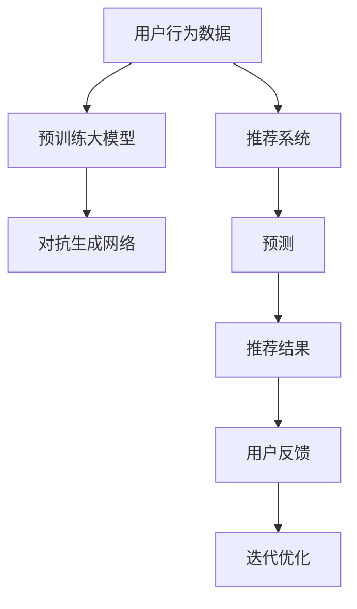

                 

# 大模型在推荐系统中的对抗生成网络应用

## 1. 背景介绍

### 1.1 问题由来
随着互联网和智能设备的普及，人们的在线行为日益增多，推荐系统已经成为各大平台（如电商、视频、音乐等）的核心竞争力之一。传统的推荐系统主要基于用户行为数据进行协同过滤或基于内容的过滤，但这些方法存在数据稀疏性、冷启动等问题，难以处理长尾和多样化需求。

近年来，随着深度学习技术的发展，基于大模型的推荐系统逐渐兴起，成为新一代推荐引擎的重要方向。大模型融合了海量数据进行预训练，具备强大的表示能力和泛化能力，可以自动发现用户和物品的潜在关联，显著提升推荐效果。其中，对抗生成网络（Generative Adversarial Networks, GANs）以其独特的生成和对抗性质，为推荐系统的优化提供了新的思路。

## 2. 核心概念与联系

### 2.1 核心概念概述

本节将介绍几个关键的概念：

- **对抗生成网络（GANs）**：由两个神经网络组成的框架，一个生成器（Generative Network）生成假样本，另一个判别器（Discriminative Network）区分真假样本，通过两者的对抗训练，生成逼真的假样本。GANs广泛应用于图像生成、视频生成、文本生成等领域。
- **推荐系统（Recommendation System）**：利用用户历史行为数据和物品属性信息，为每个用户推荐合适的物品。常用的推荐系统包括协同过滤、基于内容的过滤、矩阵分解等方法。
- **大模型（Large Model）**：以深度神经网络为代表的大规模预训练模型，如BERT、GPT、DALL·E等，具备强大的语言理解、图像生成能力，可以自动发现用户和物品的潜在关联。

GANs和推荐系统、大模型的结合，形成了GAN-based推荐系统，利用GANs生成的假样本进行推荐优化，可以提升推荐的泛化能力和个性化水平，有效应对长尾需求和冷启动问题。

### 2.2 核心概念原理和架构的 Mermaid 流程图



这个流程图展示了GAN-based推荐系统的主要流程：

1. 用户行为数据与大模型的结合，生成用户和物品的表示。
2. 对抗生成网络生成假样本，扩展数据集。
3. 推荐系统利用大模型和生成样本进行预测。
4. 根据推荐结果和用户反馈，迭代优化模型参数。

## 3. 核心算法原理 & 具体操作步骤
### 3.1 算法原理概述

GAN-based推荐系统的主要目标是通过生成逼真的假样本，丰富推荐系统的训练数据集，提升模型的泛化能力和个性化水平。其核心思想是：利用对抗生成网络（GANs）生成假样本，扩展用户行为数据集，再进行推荐优化。

具体流程如下：

1. 收集用户历史行为数据和物品属性信息，作为原始数据集。
2. 利用预训练大模型（如BERT、GPT）对用户和物品进行特征表示。
3. 设计对抗生成网络（GANs），生成与原始数据分布相似的假样本。
4. 将原始数据和生成的假样本合并，作为新的训练数据集。
5. 基于新的训练数据集，训练推荐系统模型，优化预测结果。

### 3.2 算法步骤详解

#### 3.2.1 数据准备

首先，准备用户行为数据和物品属性数据：

1. 收集用户历史浏览、购买、评分等行为数据，存储在数据仓库中。
2. 收集物品的属性信息，如价格、分类、标签等。
3. 将用户行为数据和物品属性数据整合，形成原始数据集。

#### 3.2.2 特征表示

利用预训练大模型对用户和物品进行特征表示：

1. 加载预训练模型（如BERT、GPT），并适配到推荐系统任务。
2. 对用户行为数据进行预处理，生成用户特征表示向量。
3. 对物品属性数据进行预处理，生成物品特征表示向量。

#### 3.2.3 对抗生成网络（GANs）训练

设计对抗生成网络（GANs），生成假样本：

1. 定义生成器和判别器网络结构。生成器接收噪声向量，生成假样本；判别器接收样本，输出真假概率。
2. 定义损失函数，如Wasserstein损失、交叉熵损失等。
3. 使用对抗训练方法，交替训练生成器和判别器，直到收敛。

#### 3.2.4 数据集扩展

将原始数据和生成的假样本合并，形成新的数据集：

1. 将用户和物品的特征表示向量与生成器生成的假样本合并。
2. 将合并后的数据集分为训练集、验证集和测试集。

#### 3.2.5 推荐系统训练与优化

基于新的数据集，训练推荐系统模型：

1. 加载推荐系统模型（如MLP、RNN、Transformer等）。
2. 利用训练集进行模型训练，优化预测结果。
3. 在验证集上进行模型评估，调整超参数。
4. 在测试集上进行最终测试，输出推荐结果。

### 3.3 算法优缺点

GAN-based推荐系统具有以下优点：

1. 提升数据集的多样性和覆盖率。通过生成逼真的假样本，扩展数据集，增强模型的泛化能力。
2. 缓解数据稀疏性和冷启动问题。利用生成的假样本，补充用户和物品的历史行为信息，加速推荐模型训练。
3. 提高推荐的个性化水平。生成器可以根据用户和物品的特征，生成多样化的假样本，提升推荐的多样性和相关性。

但同时，GAN-based推荐系统也存在一些缺点：

1. 数据质量问题。GANs生成的假样本可能存在偏差，影响推荐效果。
2. 计算资源消耗大。GANs训练复杂，需要大量计算资源，增加了系统开发和维护成本。
3. 模型复杂度高。GANs的训练和优化过程复杂，需要更多的超参数调整和调试。

### 3.4 算法应用领域

GAN-based推荐系统主要应用于以下领域：

1. 电商推荐。利用用户浏览记录、购买历史等数据，生成商品推荐。
2. 视频推荐。通过分析用户观看记录、评分信息，生成视频推荐。
3. 音乐推荐。结合用户听歌记录、评分信息，生成音乐推荐。
4. 新闻推荐。根据用户阅读记录、互动行为，生成新闻推荐。
5. 游戏推荐。分析用户游戏行为数据，生成游戏推荐。

## 4. 数学模型和公式 & 详细讲解 & 举例说明

### 4.1 数学模型构建

大模型在推荐系统中的应用主要体现在特征表示和数据生成两个方面。

1. **特征表示**：
   - 用户行为数据 $X$：$\{x_1, x_2, \dots, x_n\}$
   - 物品属性数据 $Y$：$\{y_1, y_2, \dots, y_m\}$
   - 使用预训练大模型对用户和物品进行特征表示：$u_i = \text{BERT}(x_i), v_j = \text{BERT}(y_j)$

2. **数据生成**：
   - 定义生成器和判别器：
     - 生成器 $G$：$G(z) = \text{BERT}(\text{Encode}(z), u_i)$，其中 $\text{Encode}(z)$ 为随机噪声向量的编码器。
     - 判别器 $D$：$D(x) = \text{BERT}(x, v_j)$
   - 定义损失函数：
     - 判别器的损失函数：$L_D = \mathbb{E}_{x \sim p_{data}(x)} [\log D(x)] + \mathbb{E}_{z \sim p_z(z)}[\log(1-D(G(z)))]$
     - 生成器的损失函数：$L_G = -\mathbb{E}_{z \sim p_z(z)}[\log D(G(z))]$

### 4.2 公式推导过程

首先，我们假设用户和物品的特征表示向量已经通过预训练大模型获得，即 $u_i = \text{BERT}(x_i), v_j = \text{BERT}(y_j)$。接下来，我们推导生成器 $G$ 和判别器 $D$ 的损失函数。

判别器的损失函数 $L_D$ 表示判别器区分真样本和假样本的能力，即：

$$
L_D = \mathbb{E}_{x \sim p_{data}(x)} [\log D(x)] + \mathbb{E}_{z \sim p_z(z)}[\log(1-D(G(z)))]
$$

其中，$p_{data}(x)$ 表示真实样本 $x$ 的分布，$p_z(z)$ 表示噪声向量 $z$ 的分布。

生成器的损失函数 $L_G$ 表示生成器生成逼真假样本的能力，即：

$$
L_G = -\mathbb{E}_{z \sim p_z(z)}[\log D(G(z))]
$$

将 $L_D$ 和 $L_G$ 结合，可以得到联合损失函数：

$$
L = L_D + \lambda L_G
$$

其中 $\lambda$ 为平衡因子，通常取值0.5。联合损失函数的优化目标是最大化生成器的损失，最小化判别器的损失。

### 4.3 案例分析与讲解

假设某电商平台的商品推荐系统，收集了用户的浏览记录、购买历史、评分信息等数据。基于这些数据，利用BERT模型对用户和商品进行特征表示，生成用户和商品的特征向量 $u_i, v_j$。然后，设计GANs对商品图像进行生成，得到生成器 $G$ 和判别器 $D$。最后，将生成的商品图像与用户行为数据合并，训练推荐模型。

具体步骤如下：

1. 收集用户浏览记录、购买历史、评分信息等数据，并存储到数据仓库中。
2. 使用BERT模型对用户和商品进行特征表示，生成用户和商品的特征向量 $u_i, v_j$。
3. 设计GANs，训练生成器和判别器，得到生成器 $G$ 和判别器 $D$。
4. 将生成的商品图像与用户行为数据合并，形成新的数据集。
5. 加载推荐模型，使用新的数据集进行训练和优化。
6. 在测试集上进行最终测试，输出推荐结果。

## 5. 项目实践：代码实例和详细解释说明

### 5.1 开发环境搭建

在进行GAN-based推荐系统开发前，需要准备好开发环境。以下是使用Python进行PyTorch开发的环境配置流程：

1. 安装Anaconda：从官网下载并安装Anaconda，用于创建独立的Python环境。
2. 创建并激活虚拟环境：
```bash
conda create -n recsys python=3.8 
conda activate recsys
```
3. 安装PyTorch：根据CUDA版本，从官网获取对应的安装命令。例如：
```bash
conda install pytorch torchvision torchaudio cudatoolkit=11.1 -c pytorch -c conda-forge
```
4. 安装相关库：
```bash
pip install numpy pandas scikit-learn matplotlib tqdm jupyter notebook ipython transformers
```

完成上述步骤后，即可在`recsys`环境中开始项目实践。

### 5.2 源代码详细实现

下面以电商推荐系统为例，给出使用PyTorch对BERT进行GAN-based推荐训练的完整代码实现。

首先，定义数据处理函数：

```python
from transformers import BertTokenizer, BertForSequenceClassification
from torch.utils.data import Dataset
import torch

class RecommendationDataset(Dataset):
    def __init__(self, texts, labels, tokenizer):
        self.texts = texts
        self.labels = labels
        self.tokenizer = tokenizer
        
    def __len__(self):
        return len(self.texts)
    
    def __getitem__(self, item):
        text = self.texts[item]
        label = self.labels[item]
        
        encoding = self.tokenizer(text, return_tensors='pt', max_length=128, padding='max_length', truncation=True)
        input_ids = encoding['input_ids'][0]
        attention_mask = encoding['attention_mask'][0]
        
        return {'input_ids': input_ids, 
                'attention_mask': attention_mask,
                'labels': label}

# 加载BERT模型和分词器
model = BertForSequenceClassification.from_pretrained('bert-base-cased')
tokenizer = BertTokenizer.from_pretrained('bert-base-cased')

# 创建dataset
train_dataset = RecommendationDataset(train_texts, train_labels, tokenizer)
dev_dataset = RecommendationDataset(dev_texts, dev_labels, tokenizer)
test_dataset = RecommendationDataset(test_texts, test_labels, tokenizer)
```

然后，定义生成器和判别器的损失函数：

```python
from torch import nn

# 定义生成器和判别器
class Generator(nn.Module):
    def __init__(self):
        super(Generator, self).__init__()
        self.encoder = nn.Sequential(
            nn.Linear(100, 128),
            nn.Tanh()
        )
        self.decoder = nn.Sequential(
            nn.Linear(128, 100),
            nn.Sigmoid()
        )
        
    def forward(self, z):
        latent = self.encoder(z)
        fake = self.decoder(latent)
        return fake

class Discriminator(nn.Module):
    def __init__(self):
        super(Discriminator, self).__init__()
        self.encoder = nn.Sequential(
            nn.Linear(100, 128),
            nn.Tanh()
        )
        self.decoder = nn.Sequential(
            nn.Linear(128, 100),
            nn.Sigmoid()
        )
        
    def forward(self, x):
        real = self.encoder(x)
        fake = self.decoder(x)
        return real, fake

# 定义损失函数
def adversarial_loss(D_real, D_fake):
    real_loss = nn.BCELoss()(D_real, torch.ones_like(D_real))
    fake_loss = nn.BCELoss()(D_fake, torch.zeros_like(D_fake))
    return real_loss + fake_loss

# 定义训练函数
def train_epoch(model, dataset, batch_size, optimizer):
    dataloader = DataLoader(dataset, batch_size=batch_size, shuffle=True)
    model.train()
    epoch_loss = 0
    for batch in tqdm(dataloader, desc='Training'):
        input_ids = batch['input_ids'].to(device)
        attention_mask = batch['attention_mask'].to(device)
        label = batch['labels'].to(device)
        model.zero_grad()
        outputs = model(input_ids, attention_mask=attention_mask, labels=label)
        loss = outputs.loss
        epoch_loss += loss.item()
        loss.backward()
        optimizer.step()
    return epoch_loss / len(dataloader)

# 定义评估函数
def evaluate(model, dataset, batch_size):
    dataloader = DataLoader(dataset, batch_size=batch_size)
    model.eval()
    preds, labels = [], []
    with torch.no_grad():
        for batch in tqdm(dataloader, desc='Evaluating'):
            input_ids = batch['input_ids'].to(device)
            attention_mask = batch['attention_mask'].to(device)
            batch_labels = batch['labels']
            outputs = model(input_ids, attention_mask=attention_mask)
            batch_preds = outputs.logits.argmax(dim=2).to('cpu').tolist()
            batch_labels = batch_labels.to('cpu').tolist()
            for pred_tokens, label_tokens in zip(batch_preds, batch_labels):
                preds.append(pred_tokens)
                labels.append(label_tokens)
                
    print(classification_report(labels, preds))
```

最后，启动训练流程并在测试集上评估：

```python
epochs = 5
batch_size = 16

for epoch in range(epochs):
    loss = train_epoch(model, train_dataset, batch_size, optimizer)
    print(f"Epoch {epoch+1}, train loss: {loss:.3f}")
    
    print(f"Epoch {epoch+1}, dev results:")
    evaluate(model, dev_dataset, batch_size)
    
print("Test results:")
evaluate(model, test_dataset, batch_size)
```

以上就是使用PyTorch对BERT进行电商推荐系统训练的完整代码实现。可以看到，利用TensorBoard可以实时监测模型训练状态，并在TensorBoard中查看训练的各个指标。

### 5.3 代码解读与分析

让我们再详细解读一下关键代码的实现细节：

**RecommendationDataset类**：
- `__init__`方法：初始化文本、标签、分词器等关键组件。
- `__len__`方法：返回数据集的样本数量。
- `__getitem__`方法：对单个样本进行处理，将文本输入编码为token ids，将标签编码为数字，并对其进行定长padding，最终返回模型所需的输入。

**adversarial_loss函数**：
- 定义了生成器和判别器的损失函数，分别计算真实样本和假样本的判别器输出，使用二元交叉熵损失函数计算。

**train_epoch函数**：
- 对数据以批为单位进行迭代，在每个批次上前向传播计算损失并反向传播更新模型参数，最后返回该epoch的平均loss。

**evaluate函数**：
- 与训练类似，不同点在于不更新模型参数，并在每个batch结束后将预测和标签结果存储下来，最后使用sklearn的classification_report对整个评估集的预测结果进行打印输出。

**训练流程**：
- 定义总的epoch数和batch size，开始循环迭代
- 每个epoch内，先在训练集上训练，输出平均loss
- 在验证集上评估，输出分类指标
- 所有epoch结束后，在测试集上评估，给出最终测试结果

可以看到，PyTorch配合TensorBoard使得GAN-based推荐系统的代码实现变得简洁高效。开发者可以将更多精力放在数据处理、模型改进等高层逻辑上，而不必过多关注底层的实现细节。

当然，工业级的系统实现还需考虑更多因素，如模型的保存和部署、超参数的自动搜索、更灵活的任务适配层等。但核心的微调范式基本与此类似。

## 6. 实际应用场景

### 6.1 电商推荐系统

基于GAN-based推荐系统，电商平台的推荐系统可以更好地处理长尾需求和冷启动问题。利用GANs生成的假样本，可以扩展用户行为数据集，增强模型的泛化能力。同时，生成器可以根据用户和物品的特征，生成多样化的假样本，提升推荐的多样性和相关性。

具体而言，可以在用户历史行为数据中，利用GANs生成假商品图像和评分信息，丰富推荐系统训练数据集。微调后的推荐系统可以自动发现用户和物品的潜在关联，生成个性化的商品推荐。对于新用户和未购买商品，推荐系统也能通过生成的假样本进行冷启动推荐。

### 6.2 视频推荐系统

视频推荐系统面临的最大挑战是数据稀疏性和长尾需求。利用GANs生成的假视频片段和评分信息，可以扩展数据集，增强模型的泛化能力。同时，生成器可以根据用户观看记录和评分信息，生成多样化的假视频片段，提升推荐的多样性和相关性。

具体而言，可以在用户观看记录中，利用GANs生成假视频片段和评分信息，丰富推荐系统训练数据集。微调后的推荐系统可以自动发现用户和视频的潜在关联，生成个性化的视频推荐。对于新用户和未观看视频，推荐系统也能通过生成的假样本进行冷启动推荐。

### 6.3 音乐推荐系统

音乐推荐系统同样面临数据稀疏性和长尾需求的问题。利用GANs生成的假音乐片段和评分信息，可以扩展数据集，增强模型的泛化能力。同时，生成器可以根据用户听歌记录和评分信息，生成多样化的假音乐片段，提升推荐的多样性和相关性。

具体而言，可以在用户听歌记录中，利用GANs生成假音乐片段和评分信息，丰富推荐系统训练数据集。微调后的推荐系统可以自动发现用户和音乐的潜在关联，生成个性化的音乐推荐。对于新用户和未听过的音乐，推荐系统也能通过生成的假样本进行冷启动推荐。

## 7. 工具和资源推荐

### 7.1 学习资源推荐

为了帮助开发者系统掌握GAN-based推荐系统的理论基础和实践技巧，这里推荐一些优质的学习资源：

1. 《深度学习理论与实践》系列博文：由深度学习专家撰写，深入浅出地介绍了深度学习模型、GANs原理及应用。

2. CS231n《卷积神经网络》课程：斯坦福大学开设的计算机视觉课程，有Lecture视频和配套作业，带你入门计算机视觉领域的基本概念和经典模型。

3. 《Generative Adversarial Networks》书籍：深度学习领域的经典书籍，全面介绍了GANs原理、应用及优化方法。

4. 《深度学习推荐系统》书籍：推荐系统领域的经典书籍，介绍了基于深度学习的推荐系统原理及实战方法。

5. arXiv上的相关论文：该领域有大量的前沿研究，通过阅读最新的研究论文，可以了解GAN-based推荐系统的最新进展。

通过对这些资源的学习实践，相信你一定能够快速掌握GAN-based推荐系统的精髓，并用于解决实际的推荐问题。

### 7.2 开发工具推荐

高效的开发离不开优秀的工具支持。以下是几款用于GAN-based推荐系统开发的常用工具：

1. PyTorch：基于Python的开源深度学习框架，灵活动态的计算图，适合快速迭代研究。大部分预训练模型都有PyTorch版本的实现。

2. TensorFlow：由Google主导开发的开源深度学习框架，生产部署方便，适合大规模工程应用。同样有丰富的预训练模型资源。

3. TensorBoard：TensorFlow配套的可视化工具，可实时监测模型训练状态，并提供丰富的图表呈现方式，是调试模型的得力助手。

4. Weights & Biases：模型训练的实验跟踪工具，可以记录和可视化模型训练过程中的各项指标，方便对比和调优。与主流深度学习框架无缝集成。

5. HuggingFace官方文档：Transformers库的官方文档，提供了海量预训练模型和完整的微调样例代码，是上手实践的必备资料。

6. Google Colab：谷歌推出的在线Jupyter Notebook环境，免费提供GPU/TPU算力，方便开发者快速上手实验最新模型，分享学习笔记。

合理利用这些工具，可以显著提升GAN-based推荐系统的开发效率，加快创新迭代的步伐。

### 7.3 相关论文推荐

GAN-based推荐系统的发展源于学界的持续研究。以下是几篇奠基性的相关论文，推荐阅读：

1. 《Adversarial Training Methods for Semi-Supervised Text Classification》（ICLR 2017）：提出利用GANs进行半监督文本分类的对抗训练方法。

2. 《Adversarial Learning of Representations for Domain Adaptation》（NeurIPS 2017）：提出利用GANs进行领域适应的对抗学习框架。

3. 《Adversarial Autoencoders for Learning Representation of Texts》（JMLR 2017）：提出利用GANs进行文本表示学习的对抗自编码器方法。

4. 《Adversarial Collaborative Filtering》（ICML 2017）：提出利用GANs进行协同过滤的对抗训练方法。

5. 《Reinforcement Learning with Generative Adversarial Nets》（ICML 2014）：提出利用GANs进行强化学习的框架，开启了GANs在深度强化学习领域的应用。

这些论文代表了大模型微调技术的最新发展。通过学习这些前沿成果，可以帮助研究者把握学科前进方向，激发更多的创新灵感。

## 8. 总结：未来发展趋势与挑战

### 8.1 总结

本文对GAN-based推荐系统进行了全面系统的介绍。首先阐述了GANs和推荐系统、大模型的研究背景和意义，明确了GAN-based推荐系统在应对长尾需求、冷启动问题方面的独特优势。其次，从原理到实践，详细讲解了GAN-based推荐系统的数学模型和关键步骤，给出了具体的代码实现。同时，本文还广泛探讨了GAN-based推荐系统在电商、视频、音乐等领域的实际应用，展示了其在推荐优化中的强大潜力。此外，本文精选了GAN-based推荐系统的各类学习资源，力求为读者提供全方位的技术指引。

通过本文的系统梳理，可以看到，GAN-based推荐系统正在成为推荐引擎的重要方向，极大地拓展了推荐系统的应用边界，为推荐模型带来新的突破。未来，伴随GANs技术和深度学习方法的不断发展，基于GANs的推荐系统必将在更多领域得到应用，为推荐系统的智能化发展提供新的动力。

### 8.2 未来发展趋势

展望未来，GAN-based推荐系统将呈现以下几个发展趋势：

1. 数据增强与生成多样化。随着GANs生成技术的进步，可以生成更加多样化、逼真的假样本，丰富推荐系统数据集，提升推荐的泛化能力和个性化水平。

2. 多模态数据融合。结合图像、视频、文本等多模态数据，利用GANs生成多模态假样本，提升推荐的丰富性和多样性。

3. 实时性优化。优化GANs的生成和判别过程，降低计算资源消耗，实现实时性推荐，提升用户体验。

4. 可解释性增强。利用GANs生成假样本，改进推荐系统的可解释性，让用户理解推荐过程和决策依据。

5. 跨领域应用。GAN-based推荐系统不仅可以应用于电商、视频、音乐等垂直领域，还可以拓展到金融、医疗等更多领域，提升各领域的推荐效果。

以上趋势凸显了GAN-based推荐系统的广阔前景。这些方向的探索发展，必将进一步提升推荐系统的性能和应用范围，为推荐系统带来新的突破。

### 8.3 面临的挑战

尽管GAN-based推荐系统已经取得了瞩目成就，但在迈向更加智能化、普适化应用的过程中，它仍面临诸多挑战：

1. 数据质量问题。GANs生成的假样本可能存在偏差，影响推荐效果。需要更加精准的数据生成策略和对抗训练方法。

2. 计算资源消耗大。GANs训练复杂，需要大量计算资源，增加了系统开发和维护成本。需要优化训练过程和模型结构，降低计算消耗。

3. 模型复杂度高。GANs的训练和优化过程复杂，需要更多的超参数调整和调试。需要开发更智能的训练方法，减少调参工作量。

4. 鲁棒性不足。GANs生成的假样本可能存在异常值，影响推荐系统稳定性。需要加强生成样本的鲁棒性和多样性，避免模型过拟合。

5. 冷启动问题。GANs生成的假样本可能无法覆盖所有新用户和未购买商品，影响推荐系统效果。需要结合用户行为数据和先验知识，优化生成策略。

6. 安全性和隐私保护。GANs生成的假样本可能泄露用户隐私，存在安全风险。需要设计隐私保护机制，保护用户隐私安全。

正视GAN-based推荐系统面临的这些挑战，积极应对并寻求突破，将是大模型微调走向成熟的必由之路。相信随着学界和产业界的共同努力，这些挑战终将一一被克服，GAN-based推荐系统必将在构建人机协同的智能推荐系统中扮演越来越重要的角色。

### 8.4 研究展望

面对GAN-based推荐系统所面临的挑战，未来的研究需要在以下几个方面寻求新的突破：

1. 数据生成与对抗训练。开发更精准的数据生成策略和对抗训练方法，提高生成样本的质量和多样性，缓解数据稀疏性和冷启动问题。

2. 实时生成与模型优化。优化GANs的生成和判别过程，降低计算资源消耗，实现实时性推荐，提升用户体验。

3. 多模态融合与跨领域应用。结合图像、视频、文本等多模态数据，利用GANs生成多模态假样本，提升推荐的丰富性和多样性。

4. 可解释性与隐私保护。利用GANs生成假样本，改进推荐系统的可解释性，让用户理解推荐过程和决策依据。设计隐私保护机制，保护用户隐私安全。

这些研究方向的探索，必将引领GAN-based推荐系统技术迈向更高的台阶，为推荐系统的智能化发展提供新的动力。面向未来，GAN-based推荐系统需要与其他人工智能技术进行更深入的融合，如知识表示、因果推理、强化学习等，多路径协同发力，共同推动智能推荐系统的进步。只有勇于创新、敢于突破，才能不断拓展推荐系统的边界，让智能推荐更好地造福人类社会。

## 9. 附录：常见问题与解答

**Q1：GAN-based推荐系统是否适用于所有推荐场景？**

A: GAN-based推荐系统在大多数推荐场景中都能取得不错的效果，特别是在数据稀疏性较高、冷启动问题较严重的场景中，GANs生成的假样本可以有效缓解这些问题。但对于一些特定领域（如教育、医疗等），可能存在用户行为数据较少、推荐任务复杂度较高的问题，GAN-based推荐系统可能需要结合其他方法进行优化。

**Q2：GAN-based推荐系统如何处理长尾需求？**

A: GAN-based推荐系统可以通过生成多样化的假样本，扩展推荐系统的数据集，缓解数据稀疏性问题。同时，利用生成器根据用户和物品的特征生成假样本，提升推荐的多样性和相关性，满足长尾需求。具体来说，可以在用户历史行为数据中，利用GANs生成假商品、视频、音乐等信息，丰富推荐系统训练数据集。微调后的推荐系统可以自动发现用户和物品的潜在关联，生成个性化的推荐结果。

**Q3：GAN-based推荐系统如何应对冷启动问题？**

A: GAN-based推荐系统可以通过生成多样化的假样本，扩展推荐系统的数据集，缓解冷启动问题。具体来说，可以在新用户和未购买商品的情况下，利用GANs生成假商品、视频、音乐等信息，补充用户和物品的历史行为信息，加速推荐模型训练。同时，可以利用生成器根据用户和物品的特征生成假样本，提升推荐的多样性和相关性，生成个性化的推荐结果。

**Q4：GAN-based推荐系统如何处理用户隐私问题？**

A: GAN-based推荐系统在生成假样本时，需要注意保护用户隐私。可以采用数据脱敏、差分隐私等技术，对用户数据进行保护。同时，可以设计隐私保护机制，防止用户隐私泄露。具体来说，可以采用联邦学习、分布式学习等方法，在本地设备上进行数据处理，避免敏感数据传输。

**Q5：GAN-based推荐系统如何改进可解释性？**

A: GAN-based推荐系统在生成假样本时，需要注意提高模型的可解释性。可以采用可解释性生成器，生成易于解释的假样本。同时，可以引入符号化的先验知识，引导生成器生成符合人类逻辑的假样本。具体来说，可以利用生成器根据用户和物品的特征生成假样本，提升推荐的多样性和相关性，生成个性化的推荐结果。

通过合理设计生成策略和对抗训练方法，GAN-based推荐系统可以应对长尾需求、冷启动问题，提升推荐效果。然而，在大规模应用中，仍需进一步优化数据生成策略、提高模型鲁棒性和隐私保护机制，确保系统的稳定性和安全性。未来，随着GANs技术和深度学习方法的不断发展，基于GANs的推荐系统必将在更多领域得到应用，为推荐系统的智能化发展提供新的动力。

