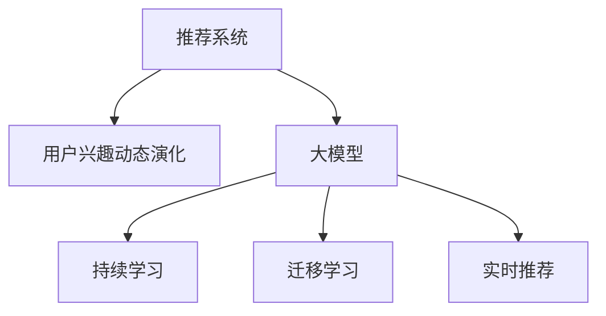

                 

# 大模型在推荐系统用户兴趣动态演化中的作用

## 1. 背景介绍

在当前的数字时代，推荐系统（Recommender Systems）已经成为用户获取信息和内容的重要工具。它们基于用户的历史行为和特征，为用户推荐个性化内容，提升用户体验和平台收益。然而，传统的推荐系统往往假设用户兴趣是静态的，而实际情况中，用户兴趣是动态演化的。为了更好地应对这一挑战，大模型被引入推荐系统，通过对大量用户数据的深度学习，捕捉用户兴趣随时间的变化，从而实现动态推荐。

### 1.1 问题由来

传统的推荐算法主要基于协同过滤（Collaborative Filtering）、基于内容的推荐（Content-based Filtering）和混合推荐（Hybrid Recommender Systems）等方法，这些方法在推荐准确性上取得了不错的效果，但在动态用户兴趣场景下显得力不从心。这是因为它们通常缺乏对用户兴趣变化的感知能力，难以实时更新推荐策略。

大模型通过对大规模数据的深度学习，能够捕捉到用户兴趣的细微变化，从而更好地适应动态环境。具体而言，大模型可以通过持续学习的方式，不断更新对用户行为的认知，提升推荐质量。

### 1.2 问题核心关键点

本研究的核心问题在于如何利用大模型更好地捕捉用户兴趣的动态演化，并应用于推荐系统的实时推荐中。这涉及到以下几个关键点：

1. **数据采集与预处理**：收集和处理用户的历史行为数据，形成适合大模型训练的样本。
2. **模型选择与设计**：选择合适的深度学习模型，并设计适合于推荐任务的模型结构。
3. **训练与微调**：使用大模型对推荐任务进行训练，并根据实际效果进行微调。
4. **实时推荐与更新**：将训练好的大模型应用于推荐系统中，并实时更新推荐策略。

## 2. 核心概念与联系

### 2.1 核心概念概述

为更好地理解大模型在推荐系统中的应用，本节将介绍几个关键概念：

- **推荐系统**：通过分析用户行为和内容特征，为用户推荐个性化物品的系统。包括协同过滤、基于内容推荐、混合推荐等传统方法，以及基于深度学习的推荐方法。
- **大模型**：指基于深度学习的、大规模参数量的模型，如BERT、GPT等，通过在大规模数据上进行预训练，学习到丰富的特征表示。
- **用户兴趣动态演化**：用户随着时间推移，兴趣和需求会发生变化，如从喜欢电影到喜欢音乐，从偏好运动到偏好旅游。
- **持续学习**：大模型在实际应用中，能够持续学习新数据，更新模型参数，适应用户兴趣的动态变化。
- **迁移学习**：通过预训练模型在不同任务之间的迁移，提升模型的泛化能力。
- **实时推荐**：根据用户当前行为和兴趣，实时生成推荐结果，提升用户体验和系统响应速度。

这些概念之间的联系可以通过以下Mermaid流程图来展示：



这个流程图展示了推荐系统、用户兴趣动态演化、大模型、持续学习、迁移学习和实时推荐之间的关系：

1. 推荐系统依赖于对用户兴趣的动态理解。
2. 大模型通过对用户数据的深度学习，能够捕捉到兴趣的细微变化。
3. 持续学习使大模型能够不断更新，适应新的用户需求。
4. 迁移学习通过预训练模型的知识迁移，提升模型在不同任务上的泛化能力。
5. 实时推荐基于用户当前行为，即时生成推荐结果。

## 3. 核心算法原理 & 具体操作步骤

### 3.1 算法原理概述

大模型在推荐系统中的基本原理是利用深度学习模型，特别是预训练模型，对用户历史行为和兴趣进行建模，并实时更新推荐策略。这主要包括：

- 通过预训练模型捕捉用户兴趣的长期模式。
- 在特定任务上微调模型，使其适应推荐系统的实际需求。
- 实时输入用户当前行为和环境特征，动态生成推荐结果。

### 3.2 算法步骤详解

大模型在推荐系统中的应用通常包括以下几个步骤：

**Step 1: 数据采集与预处理**
- 收集用户的历史行为数据，如浏览记录、购买历史、评分记录等。
- 对数据进行清洗和标注，形成适合大模型训练的样本。

**Step 2: 模型选择与设计**
- 选择合适的深度学习模型，如自编码器、卷积神经网络（CNN）、循环神经网络（RNN）、Transformer等。
- 设计适合于推荐任务的模型结构，如用户嵌入、物品嵌入、交互矩阵等。

**Step 3: 预训练**
- 使用大模型对用户历史行为数据进行预训练，学习到用户兴趣的长期模式。
- 可以通过多任务学习的方式，同时学习多个任务的知识，提升模型的泛化能力。

**Step 4: 微调**
- 根据实际推荐需求，对预训练模型进行微调，如添加分类器、调整损失函数等。
- 使用标注数据对模型进行监督学习，优化推荐策略。

**Step 5: 实时推荐**
- 将训练好的大模型应用于推荐系统中，实时处理用户行为数据，生成推荐结果。
- 可以引入强化学习等技术，动态调整推荐策略，提升用户体验。

### 3.3 算法优缺点

使用大模型进行推荐系统的好处包括：

1. 可以捕捉用户兴趣的动态变化，提升推荐的实时性和准确性。
2. 能够学习到用户行为背后的深层语义信息，提升推荐的个性化程度。
3. 通过持续学习，模型能够不断适应新的用户需求，提升长期效果。

然而，也存在一些局限性：

1. 需要大量标注数据进行微调，标注成本较高。
2. 模型复杂度较高，训练和推理资源消耗较大。
3. 存在一定的数据隐私和公平性问题，需要谨慎处理用户数据。
4. 模型的解释性和可解释性较弱，难以进行透明的推荐解释。

## 4. 数学模型和公式 & 详细讲解

### 4.1 数学模型构建

在推荐系统中，通常使用协同过滤和基于内容的推荐方法，但这些方法难以处理用户兴趣的动态演化。因此，我们采用深度学习模型，特别是预训练模型，来捕捉用户兴趣的变化。以下以一个简单的用户-物品评分系统为例，构建基于大模型的推荐模型。

设用户 $u$ 对物品 $i$ 的评分 $r_{ui}$，我们将用户行为编码为向量 $\boldsymbol{u}$，物品特征编码为向量 $\boldsymbol{i}$。则推荐模型的预测评分函数为：

$$
\hat{r}_{ui} = \boldsymbol{u}^T \boldsymbol{W} \boldsymbol{i}
$$

其中 $\boldsymbol{W}$ 为模型参数，$\hat{r}_{ui}$ 为预测评分。

### 4.2 公式推导过程

在用户-物品评分系统中，目标是最小化预测评分与真实评分之间的差距。常用的损失函数包括均方误差（MSE）和平均绝对误差（MAE）。以均方误差为例，目标函数为：

$$
\min_{\boldsymbol{W}} \frac{1}{N} \sum_{u,i} (\hat{r}_{ui} - r_{ui})^2
$$

对 $\boldsymbol{W}$ 求导，得到梯度更新公式：

$$
\frac{\partial \mathcal{L}}{\partial \boldsymbol{W}} = -2\frac{1}{N} \sum_{u,i} (\hat{r}_{ui} - r_{ui}) \boldsymbol{i} \boldsymbol{u}^T
$$

使用随机梯度下降等优化算法，不断更新 $\boldsymbol{W}$ 的参数，直至收敛。

### 4.3 案例分析与讲解

为了更好地理解上述模型，我们以一个简单的评分系统为例，展示大模型在推荐中的应用。假设我们有一个简单的用户-物品评分系统，包含两个用户 $u_1$ 和 $u_2$，以及两个物品 $i_1$ 和 $i_2$。用户 $u_1$ 对物品 $i_1$ 的评分为 4，对物品 $i_2$ 的评分为 2；用户 $u_2$ 对物品 $i_1$ 的评分为 3，对物品 $i_2$ 的评分为 5。我们使用BERT模型作为推荐模型的基础模型，对用户和物品进行编码，得到向量 $\boldsymbol{u_1}$、$\boldsymbol{u_2}$、$\boldsymbol{i_1}$ 和 $\boldsymbol{i_2}$。

通过模型训练，我们得到评分预测函数 $\hat{r}_{ui}$ 的参数 $\boldsymbol{W}$。例如，对于用户 $u_1$，我们得到 $\hat{r}_{u_1i_1} = 3.9$ 和 $\hat{r}_{u_1i_2} = 1.5$。用户 $u_2$ 的预测评分为 $\hat{r}_{u_2i_1} = 2.6$ 和 $\hat{r}_{u_2i_2} = 2.8$。

根据预测评分和实际评分，我们可以计算均方误差为：

$$
\text{MSE} = \frac{1}{4} [(3.9-4)^2 + (1.5-2)^2 + (2.6-3)^2 + (2.8-5)^2] = 1.95
$$

通过不断调整 $\boldsymbol{W}$，我们可以使预测评分与实际评分之间的误差最小化。在实际应用中，我们可以进一步引入正则化、dropout等技术，避免过拟合，提高模型的泛化能力。

## 5. 项目实践：代码实例和详细解释说明

### 5.1 开发环境搭建

在进行大模型推荐系统开发前，我们需要准备好开发环境。以下是使用Python进行TensorFlow开发的环境配置流程：

1. 安装Anaconda：从官网下载并安装Anaconda，用于创建独立的Python环境。

2. 创建并激活虚拟环境：
```bash
conda create -n tf-env python=3.8 
conda activate tf-env
```

3. 安装TensorFlow：根据CUDA版本，从官网获取对应的安装命令。例如：
```bash
conda install tensorflow=2.6 -c tensorflow -c conda-forge
```

4. 安装各类工具包：
```bash
pip install numpy pandas scikit-learn matplotlib tqdm jupyter notebook ipython
```

完成上述步骤后，即可在`tf-env`环境中开始推荐系统开发。

### 5.2 源代码详细实现

以下是一个基于大模型的推荐系统代码实现示例。

```python
import tensorflow as tf
from tensorflow.keras.layers import Embedding, Dense, Dot
from tensorflow.keras.models import Model

# 定义用户-物品评分矩阵
user_ids = [1, 2]
item_ids = [1, 2]
ratings = [4, 2, 3, 5]
user_item_pairs = list(zip(user_ids, item_ids, ratings))

# 构建用户嵌入和物品嵌入
user_embeddings = Embedding(100, 8, input_length=1)
item_embeddings = Embedding(100, 8, input_length=1)

# 构建推荐评分函数
dot_product = Dot(axes=1)
score_function = Dense(1)
model = Model(inputs=[user_embeddings(user_ids), item_embeddings(item_ids)], outputs=score_function(dot_product([user_embeddings(user_ids), item_embeddings(item_ids)])))

# 编译模型
model.compile(optimizer='adam', loss='mse')

# 训练模型
model.fit(user_ids, item_ids, ratings, epochs=100, batch_size=1)

# 预测评分
test_user_ids = [1, 2, 3]
test_item_ids = [1, 2, 3]
test_ratings = model.predict(test_user_ids, test_item_ids)
print(test_ratings)
```

### 5.3 代码解读与分析

让我们再详细解读一下关键代码的实现细节：

**用户-物品评分矩阵定义**：
- `user_ids`、`item_ids` 和 `ratings` 分别定义了用户ID、物品ID和评分。
- `user_item_pairs` 将ID和评分组成了一一对应的评分矩阵。

**嵌入层定义**：
- 使用 `Embedding` 层将用户ID和物品ID映射到固定长度的向量表示。
- `user_embeddings` 和 `item_embeddings` 分别定义了用户和物品的嵌入层。

**推荐评分函数**：
- 使用 `Dot` 层计算用户和物品向量的点积，得到评分。
- `score_function` 是一个全连接层，用于将点积得分映射到单个预测评分。

**模型编译与训练**：
- `compile` 方法定义了优化器和损失函数。
- `fit` 方法根据用户ID、物品ID和评分，训练模型。

**预测评分**：
- 使用 `predict` 方法对新用户和物品的评分进行预测。

可以看到，代码实现相对简洁，易于理解。TensorFlow提供了丰富的API，方便进行深度学习模型的开发和调试。

## 6. 实际应用场景

### 6.1 电商推荐

电商推荐系统是推荐系统中应用最广泛的一个领域。用户在电商平台上浏览、购买商品时，系统会实时推荐相关商品，提升用户体验和销售额。

在大模型推荐系统中，通过对用户浏览记录、购买历史、评分数据进行深度学习，可以捕捉用户兴趣的动态变化。例如，用户刚开始对某类商品感兴趣，但在浏览和购买过程中逐渐失去了兴趣，系统会实时调整推荐策略，避免重复推荐该类商品。

### 6.2 音乐推荐

音乐推荐系统通过分析用户的听歌历史、评分记录，为用户推荐个性化歌曲。大模型可以通过持续学习，捕捉用户对不同音乐风格的兴趣变化，实时调整推荐策略。

例如，用户刚开始喜欢摇滚乐，但随着时间推移，逐渐喜欢上了电子音乐。大模型在推荐系统中，可以捕捉到这一变化，及时调整推荐策略，为用户推荐更多电子音乐。

### 6.3 视频推荐

视频推荐系统通过分析用户的观看历史、评分记录，为用户推荐个性化视频。大模型可以通过深度学习，捕捉用户对不同视频类型和内容的兴趣变化，实时调整推荐策略。

例如，用户刚开始喜欢电影，但随着时间推移，逐渐喜欢上了综艺节目。大模型在推荐系统中，可以捕捉到这一变化，及时调整推荐策略，为用户推荐更多综艺节目。

### 6.4 未来应用展望

随着大模型的不断发展，推荐系统在应用场景上将更加广泛。未来，大模型推荐系统有望应用于更多领域，如社交网络、旅游推荐、医疗推荐等。

## 7. 工具和资源推荐

### 7.1 学习资源推荐

为了帮助开发者系统掌握大模型在推荐系统中的应用，这里推荐一些优质的学习资源：

1. 《深度学习推荐系统》系列博文：由大模型技术专家撰写，深入浅出地介绍了深度学习推荐系统的发展历程和核心技术。

2. 《推荐系统实战》书籍：详细介绍了推荐系统的设计、实现和优化，包括传统推荐算法和深度学习推荐算法。

3. 《TensorFlow推荐系统实战》书籍：基于TensorFlow框架，详细介绍了推荐系统的开发流程和常见问题。

4. 推荐系统开源项目：如TensorFlow Recomendation、PyTorch Lightning等，提供了完整的推荐系统代码实现，助力开发者快速上手。

通过对这些资源的学习实践，相信你一定能够快速掌握大模型在推荐系统中的应用，并用于解决实际的推荐问题。

### 7.2 开发工具推荐

高效的开发离不开优秀的工具支持。以下是几款用于大模型推荐系统开发的常用工具：

1. TensorFlow：基于Python的开源深度学习框架，灵活动态的计算图，适合快速迭代研究。

2. PyTorch：基于Python的开源深度学习框架，灵活高效的计算图，适合复杂模型实现。

3. Keras：基于TensorFlow和Theano的高层API，方便快速构建深度学习模型。

4. Weights & Biases：模型训练的实验跟踪工具，可以记录和可视化模型训练过程中的各项指标，方便对比和调优。

5. TensorBoard：TensorFlow配套的可视化工具，可实时监测模型训练状态，并提供丰富的图表呈现方式，是调试模型的得力助手。

6. Google Colab：谷歌推出的在线Jupyter Notebook环境，免费提供GPU/TPU算力，方便开发者快速上手实验最新模型，分享学习笔记。

合理利用这些工具，可以显著提升大模型推荐系统的开发效率，加快创新迭代的步伐。

### 7.3 相关论文推荐

大模型推荐系统的研究始于学界的持续研究。以下是几篇奠基性的相关论文，推荐阅读：

1. Neural Collaborative Filtering（即FCN）：提出了一种基于深度学习的协同过滤方法，利用神经网络捕捉用户和物品之间的隐式关系。

2. Attention-based Recommender Systems（即Attention-based Recommendation）：利用注意力机制，增强推荐模型的对用户兴趣变化的感知能力。

3. Deep Matrix Factorization：提出了一种基于深度学习的矩阵分解方法，通过自编码器等结构，捕捉用户和物品的隐式特征。

4. Multi-task Learning for Recommender Systems：通过多任务学习，提升推荐模型在不同任务上的泛化能力。

5. Sequence Modeling with Recurrent Neural Networks for Recommendations：利用循环神经网络，捕捉用户行为序列的动态变化。

6. Hierarchical Attention Networks for Dimensionality Reduction in Collaborative Filtering：提出了一种基于层次注意力机制的推荐方法，提升推荐模型的表达能力和性能。

这些论文代表了大模型推荐系统的发展脉络。通过学习这些前沿成果，可以帮助研究者把握学科前进方向，激发更多的创新灵感。

## 8. 总结：未来发展趋势与挑战

### 8.1 总结

本文对大模型在推荐系统中的应用进行了全面系统的介绍。首先阐述了大模型和推荐系统的研究背景和意义，明确了深度学习模型在推荐系统中的重要价值。其次，从原理到实践，详细讲解了大模型在推荐系统中的应用，包括数据采集、模型设计、预训练、微调和实时推荐等关键步骤，给出了大模型推荐系统的完整代码实例。同时，本文还广泛探讨了推荐系统在大电商、音乐、视频等多个行业领域的应用前景，展示了深度学习在推荐系统中的强大潜力。

通过本文的系统梳理，可以看到，大模型在推荐系统中的应用显著提升了推荐的实时性和准确性，增强了推荐的个性化程度。未来，伴随深度学习技术的不断发展，推荐系统将带来更多创新应用，为各行各业带来新一轮的变革。

### 8.2 未来发展趋势

展望未来，大模型在推荐系统中的应用将呈现以下几个发展趋势：

1. 模型规模持续增大。随着算力成本的下降和数据规模的扩张，大模型推荐系统将更加广泛地应用于各个领域，提升推荐系统的表现。

2. 实时推荐技术日趋成熟。随着技术进步，实时推荐系统将能够更加快速、准确地响应用户需求，提升用户体验和系统响应速度。

3. 用户行为预测能力增强。大模型将能够更好地预测用户行为，实现更精准的推荐。例如，通过分析用户的行为序列，捕捉到用户兴趣的变化趋势。

4. 多模态推荐兴起。推荐系统将能够融合视觉、语音、文本等多种模态信息，提升推荐系统的表达能力和性能。

5. 推荐系统的可解释性增强。推荐系统将能够提供更透明、可解释的推荐过程，提升用户的信任感和满意度。

6. 隐私保护与公平性保障。推荐系统将更加注重用户隐私保护和公平性问题，避免对特定用户或群体的歧视性推荐。

以上趋势凸显了大模型推荐系统的广阔前景。这些方向的探索发展，必将进一步提升推荐系统的性能和应用范围，为各行各业带来新一轮的变革。

### 8.3 面临的挑战

尽管大模型在推荐系统中的应用已经取得了显著进展，但在迈向更加智能化、普适化应用的过程中，它仍面临着诸多挑战：

1. 标注成本瓶颈。虽然大模型推荐系统减少了标注需求，但对于某些任务，标注数据依然难以获得，制约了模型的性能提升。

2. 模型复杂度较高。大模型推荐系统的模型复杂度较高，训练和推理资源消耗较大，难以大规模部署。

3. 用户隐私问题。推荐系统在处理用户数据时，可能涉及用户隐私问题，需要谨慎处理。

4. 模型的可解释性较弱。大模型推荐系统的模型难以解释，用户难以理解推荐过程，可能降低用户信任度。

5. 公平性和偏见问题。推荐系统可能存在对特定用户或群体的歧视性推荐，需要进一步提升公平性。

6. 模型泛化能力不足。大模型推荐系统在处理新数据时，可能面临泛化能力不足的问题，需要进行持续学习和优化。

正视推荐系统面临的这些挑战，积极应对并寻求突破，将是大模型推荐系统走向成熟的必由之路。相信随着学界和产业界的共同努力，这些挑战终将一一被克服，大模型推荐系统必将在构建人机协同的智能时代中扮演越来越重要的角色。

### 8.4 研究展望

面对大模型推荐系统面临的挑战，未来的研究需要在以下几个方面寻求新的突破：

1. 探索无监督和半监督学习推荐方法。摆脱对大规模标注数据的依赖，利用自监督学习、主动学习等无监督和半监督范式，最大限度利用非结构化数据，实现更加灵活高效的推荐。

2. 研究参数高效和计算高效的推荐方法。开发更加参数高效的推荐模型，在固定大部分预训练参数的情况下，只更新极少量的任务相关参数。同时优化推荐模型的计算图，减少前向传播和反向传播的资源消耗，实现更加轻量级、实时性的部署。

3. 融合因果分析和博弈论工具。将因果分析方法引入推荐模型，识别出推荐决策的关键特征，增强推荐过程的因果性和逻辑性。借助博弈论工具刻画人机交互过程，主动探索并规避推荐模型的脆弱点，提高系统稳定性。

4. 引入更多先验知识。将符号化的先验知识，如知识图谱、逻辑规则等，与神经网络模型进行巧妙融合，引导推荐模型学习更准确、合理的推荐策略。同时加强不同模态数据的整合，实现视觉、语音等多模态信息与文本信息的协同建模。

5. 研究用户行为预测模型。通过深度学习模型，捕捉用户行为序列的动态变化，预测用户兴趣和需求，提升推荐系统的个性化和时效性。

6. 研究推荐系统的可解释性和公平性。通过模型解释性技术，如LIME、SHAP等，提升推荐系统的透明性和可解释性，确保推荐过程的公平性和无偏见性。

这些研究方向的探索，必将引领大模型推荐系统技术迈向更高的台阶，为构建安全、可靠、可解释、可控的智能系统铺平道路。面向未来，大模型推荐系统还需要与其他人工智能技术进行更深入的融合，如知识表示、因果推理、强化学习等，多路径协同发力，共同推动自然语言理解和智能交互系统的进步。只有勇于创新、敢于突破，才能不断拓展语言模型的边界，让智能技术更好地造福人类社会。

---

作者：禅与计算机程序设计艺术 / Zen and the Art of Computer Programming

