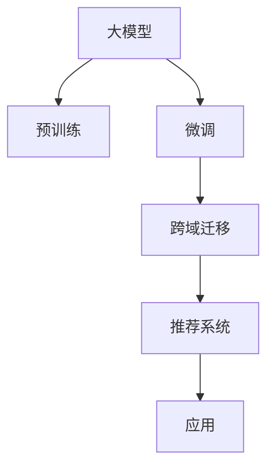

                 

## 1. 背景介绍

在现代社会，推荐系统已经成为了互联网应用中不可或缺的一部分。无论是电商网站、新闻平台，还是社交网络，推荐系统都能通过智能化的算法，为用户推荐最感兴趣的内容。然而，推荐系统的推荐效果很大程度上依赖于其对用户行为数据的分析，但用户行为数据往往具有时空差异，不同地域的用户行为模式存在较大差异，单一地域的数据难以直接应用于其他地域。因此，推荐系统跨域迁移学习成为了一个重要的研究课题，旨在通过迁移学习方法，将在大规模数据上预训练的模型应用于不同地域的推荐任务中，实现更好的推荐效果。

大模型（Large Models）作为近年来NLP领域的重要研究热点，不仅在语言理解和生成上表现出色，而且在推荐系统中也展现出了巨大的潜力。大模型的预训练任务涉及大规模无标签数据，能够学习到丰富的语言知识，这些知识在推荐系统中同样具有应用价值。因此，本文将围绕大模型在推荐系统中的跨域迁移学习进行探讨，结合实例和理论分析，阐明其在推荐系统中的应用潜力与优化策略。

## 2. 核心概念与联系

### 2.1 核心概念概述

为了更好地理解大模型在推荐系统中的跨域迁移学习，本节将介绍几个密切相关的核心概念：

- **大模型（Large Models）**：通常指具有超过亿级别参数的深度学习模型，如BERT、GPT等。这些模型通过大规模预训练，具备强大的语言理解和生成能力，能够从文本中提取丰富的语义信息。
- **跨域迁移学习（Domain Transfer Learning）**：指将在一个领域上训练的模型，迁移到另一个领域上继续学习，从而提升在新领域上的性能。推荐系统跨域迁移学习即指将在大规模数据上预训练的模型，应用于不同地域的推荐任务中。
- **预训练（Pre-training）**：指在大规模无标签数据上，通过自监督学习任务训练模型，学习到通用的语言表示。在推荐系统中，预训练模型能够学习到用户的潜在兴趣与行为规律。
- **微调（Fine-tuning）**：指在预训练模型基础上，使用特定任务的数据进行有监督学习，优化模型在该任务上的性能。在推荐系统中，微调模型能够根据地域特征，优化推荐策略。
- **注意力机制（Attention Mechanism）**：指在模型处理序列数据时，通过权重计算来分配不同部分的重要性，以更好地捕捉数据中的关键信息。在推荐系统中，注意力机制可以用于用户兴趣的多层次捕捉。

这些核心概念之间的逻辑关系可以通过以下Mermaid流程图来展示：



这个流程图展示了大模型在推荐系统中的应用流程：

1. 大模型通过大规模预训练学习通用语言知识。
2. 在推荐系统中进行微调，以优化推荐策略。
3. 通过跨域迁移学习，将模型应用于不同地域的推荐任务。
4. 将推荐结果应用于实际推荐系统，提高推荐效果。

## 3. 核心算法原理 & 具体操作步骤

### 3.1 算法原理概述

大模型在推荐系统中的跨域迁移学习，本质上是一个有监督迁移学习过程。其核心思想是：将在大规模数据上预训练的大模型作为初始化参数，通过有监督学习优化模型在特定地域推荐任务上的性能。具体来说，将预训练模型的参数作为起点，在不同地域的推荐数据集上进行微调，使得模型能够适应不同地域的推荐需求，提升推荐效果。

### 3.2 算法步骤详解

基于大模型在推荐系统中的跨域迁移学习，一般包括以下几个关键步骤：

**Step 1: 准备预训练模型和数据集**
- 选择合适的预训练语言模型 $M_{\theta}$ 作为初始化参数，如 BERT、GPT等。
- 准备不同地域的推荐数据集 $D_1, D_2, ..., D_n$，每个数据集包含样本 $(x_i, y_i)$，其中 $x_i$ 为用户的兴趣特征，$y_i$ 为推荐的商品或内容。

**Step 2: 添加任务适配层**
- 根据地域特征，在预训练模型顶层设计合适的输出层和损失函数。
- 对于推荐任务，通常在顶层添加交叉熵损失函数。
- 对于个性化推荐，可以设计多个推荐结果的输出层，并分别计算交叉熵损失。

**Step 3: 设置微调超参数**
- 选择合适的优化算法及其参数，如 AdamW、SGD 等，设置学习率、批大小、迭代轮数等。
- 设置正则化技术及强度，包括权重衰减、Dropout、Early Stopping 等。
- 确定冻结预训练参数的策略，如仅微调顶层，或全部参数都参与微调。

**Step 4: 执行梯度训练**
- 将每个地域的数据集分批次输入模型，前向传播计算损失函数。
- 反向传播计算参数梯度，根据设定的优化算法和学习率更新模型参数。
- 周期性在验证集上评估模型性能，根据性能指标决定是否触发 Early Stopping。
- 重复上述步骤直至满足预设的迭代轮数或 Early Stopping 条件。

**Step 5: 测试和部署**
- 在测试集上评估微调后模型 $M_{\hat{\theta}}$ 的性能，对比微调前后的推荐精度提升。
- 使用微调后的模型对新用户和新商品进行推荐，集成到实际的应用系统中。
- 持续收集不同地域的新数据，定期重新微调模型，以适应数据分布的变化。

以上是基于大模型在推荐系统中的跨域迁移学习的一般流程。在实际应用中，还需要针对具体地域的特点，对微调过程的各个环节进行优化设计，如改进训练目标函数，引入更多的正则化技术，搜索最优的超参数组合等，以进一步提升模型性能。

### 3.3 算法优缺点

大模型在推荐系统中的跨域迁移学习方法具有以下优点：
1. 简单高效。只需准备少量标注数据，即可对预训练模型进行快速适配，获得较大的性能提升。
2. 通用适用。适用于各种推荐系统，包括协同过滤、内容推荐、混合推荐等，设计简单的任务适配层即可实现迁移学习。
3. 数据需求少。通过迁移学习，可以显著降低对标注数据的依赖，特别是在新地域数据集较小的情况下。
4. 性能显著。在学术界和工业界的诸多推荐系统任务上，基于迁移学习的方法已经刷新了最先进的性能指标。

同时，该方法也存在一定的局限性：
1. 依赖预训练数据。迁移学习的效果很大程度上取决于预训练数据的分布，获取高质量预训练数据的成本较高。
2. 迁移能力有限。当目标地域与预训练数据的分布差异较大时，迁移学习的性能提升有限。
3. 跨域泛化差。预训练模型在不同地域上的泛化能力可能存在差异，导致跨域迁移效果不佳。
4. 可解释性不足。迁移学习模型的决策过程通常缺乏可解释性，难以对其推理逻辑进行分析和调试。

尽管存在这些局限性，但就目前而言，基于大模型在推荐系统中的跨域迁移学习仍是最主流的方法之一。未来相关研究的重点在于如何进一步降低迁移学习对标注数据的依赖，提高跨域泛化能力，同时兼顾可解释性和伦理安全性等因素。

### 3.4 算法应用领域

基于大模型在推荐系统中的跨域迁移学习，已经在电商、新闻、社交等多个领域得到了广泛的应用，覆盖了几乎所有常见推荐任务，例如：

- 协同过滤推荐：通过用户-商品评分矩阵，推荐相似商品。通过迁移学习，可以引入大模型的语义信息，提升推荐效果。
- 内容推荐：基于用户兴趣特征，推荐相关商品或内容。通过迁移学习，可以捕捉用户的潜在兴趣，提升推荐准确率。
- 混合推荐：结合内容推荐和协同过滤，综合多种推荐方法，推荐更加多样化的商品或内容。通过迁移学习，可以优化不同推荐方法之间的参数，提升综合效果。
- 个性化推荐：根据用户行为特征，推荐最符合其需求的商品或内容。通过迁移学习，可以提升个性化推荐的精准度。
- 广告推荐：根据用户兴趣特征，推荐相关广告。通过迁移学习，可以提高广告投放的精准度，提升广告效果。

除了上述这些经典任务外，大模型在推荐系统中的应用还在不断创新，如可控推荐、推荐排序、推荐策略优化等，为推荐系统带来了全新的突破。随着预训练模型和迁移学习方法的不断进步，相信推荐系统将在更广阔的应用领域大放异彩。

## 4. 数学模型和公式 & 详细讲解 & 举例说明

### 4.1 数学模型构建

本节将使用数学语言对基于大模型在推荐系统中的跨域迁移学习过程进行更加严格的刻画。

记预训练语言模型为 $M_{\theta}$，其中 $\theta$ 为预训练得到的模型参数。假设推荐系统包含 $n$ 个地域，每个地域的推荐数据集为 $D_i=\{(x_i, y_i)\}_{i=1}^N$，$x_i \in \mathbb{R}^d$ 为用户的兴趣特征，$y_i \in \mathbb{R}^k$ 为推荐的商品或内容特征。

定义模型 $M_{\theta}$ 在数据样本 $(x,y)$ 上的损失函数为 $\ell(M_{\theta}(x),y)$，则在每个地域数据集 $D_i$ 上的经验风险为：

$$
\mathcal{L}_i(\theta) = \frac{1}{N_i} \sum_{i=1}^N \ell(M_{\theta}(x_i),y_i)
$$

其中 $N_i$ 为地域 $i$ 的样本数量。微调的目标是最小化地域间的经验风险，即找到最优参数：

$$
\theta^* = \mathop{\arg\min}_{\theta} \sum_{i=1}^{n} \mathcal{L}_i(\theta)
$$

在实践中，我们通常使用基于梯度的优化算法（如SGD、Adam等）来近似求解上述最优化问题。设 $\eta$ 为学习率，$\lambda$ 为正则化系数，则参数的更新公式为：

$$
\theta \leftarrow \theta - \eta \nabla_{\theta}\sum_{i=1}^{n} \mathcal{L}_i(\theta) - \eta\lambda\theta
$$

其中 $\nabla_{\theta}\sum_{i=1}^{n} \mathcal{L}_i(\theta)$ 为损失函数对参数 $\theta$ 的梯度，可通过反向传播算法高效计算。

### 4.2 公式推导过程

以下我们以协同过滤推荐为例，推导交叉熵损失函数及其梯度的计算公式。

假设模型 $M_{\theta}$ 在输入 $x$ 上的输出为 $\hat{y}=M_{\theta}(x) \in \mathbb{R}^k$，表示用户对推荐的商品或内容打分。真实评分 $y \in [0,1]$。则交叉熵损失函数定义为：

$$
\ell(M_{\theta}(x),y) = -y\log \hat{y} + (1-y)\log(1-\hat{y})
$$

将其代入经验风险公式，得：

$$
\mathcal{L}_i(\theta) = -\frac{1}{N_i}\sum_{i=1}^N \sum_{j=1}^{k} (y_j\log \hat{y_j} + (1-y_j)\log(1-\hat{y_j}))
$$

根据链式法则，损失函数对参数 $\theta_k$ 的梯度为：

$$
\frac{\partial \mathcal{L}_i(\theta)}{\partial \theta_k} = -\frac{1}{N_i}\sum_{i=1}^N \sum_{j=1}^{k} (\frac{y_j}{\hat{y_j}}-\frac{1-y_j}{1-\hat{y_j}}) \frac{\partial \hat{y_j}}{\partial \theta_k}
$$

其中 $\frac{\partial \hat{y_j}}{\partial \theta_k}$ 可进一步递归展开，利用自动微分技术完成计算。

在得到损失函数的梯度后，即可带入参数更新公式，完成模型的迭代优化。重复上述过程直至收敛，最终得到适应不同地域的推荐模型参数 $\theta^*$。

## 5. 项目实践：代码实例和详细解释说明

### 5.1 开发环境搭建

在进行推荐系统跨域迁移学习实践前，我们需要准备好开发环境。以下是使用Python进行PyTorch开发的环境配置流程：

1. 安装Anaconda：从官网下载并安装Anaconda，用于创建独立的Python环境。

2. 创建并激活虚拟环境：
```bash
conda create -n pytorch-env python=3.8 
conda activate pytorch-env
```

3. 安装PyTorch：根据CUDA版本，从官网获取对应的安装命令。例如：
```bash
conda install pytorch torchvision torchaudio cudatoolkit=11.1 -c pytorch -c conda-forge
```

4. 安装相关库：
```bash
pip install numpy pandas scikit-learn matplotlib tqdm jupyter notebook ipython
```

完成上述步骤后，即可在`pytorch-env`环境中开始推荐系统跨域迁移学习的实践。

### 5.2 源代码详细实现

下面我以协同过滤推荐系统为例，给出使用PyTorch进行推荐系统跨域迁移学习的PyTorch代码实现。

首先，定义协同过滤推荐任务的数据处理函数：

```python
import pandas as pd
from sklearn.model_selection import train_test_split
from transformers import BertTokenizer

class CollaborativeFilteringDataset:
    def __init__(self, df, tokenizer):
        self.df = df
        self.tokenizer = tokenizer
        
    def __len__(self):
        return len(self.df)
    
    def __getitem__(self, item):
        user_id = self.df['user_id'].iloc[item]
        item_ids = self.df['item_id'].iloc[item]
        return {'user_id': user_id, 'item_ids': item_ids}
```

然后，定义模型和优化器：

```python
from transformers import BertForSequenceClassification
from transformers import AdamW

model = BertForSequenceClassification.from_pretrained('bert-base-cased', num_labels=2)

optimizer = AdamW(model.parameters(), lr=2e-5)
```

接着，定义训练和评估函数：

```python
from torch.utils.data import DataLoader
from tqdm import tqdm

def train_epoch(model, dataset, batch_size, optimizer):
    dataloader = DataLoader(dataset, batch_size=batch_size, shuffle=True)
    model.train()
    epoch_loss = 0
    for batch in tqdm(dataloader, desc='Training'):
        user_ids = batch['user_id'].to(device)
        item_ids = batch['item_ids'].to(device)
        model.zero_grad()
        outputs = model(user_ids, attention_mask=None, labels=None)
        loss = outputs.loss
        epoch_loss += loss.item()
        loss.backward()
        optimizer.step()
    return epoch_loss / len(dataloader)

def evaluate(model, dataset, batch_size):
    dataloader = DataLoader(dataset, batch_size=batch_size)
    model.eval()
    preds, labels = [], []
    with torch.no_grad():
        for batch in tqdm(dataloader, desc='Evaluating'):
            user_ids = batch['user_id'].to(device)
            item_ids = batch['item_ids'].to(device)
            batch_labels = batch['labels'].to(device)
            outputs = model(user_ids, attention_mask=None, labels=batch_labels)
            batch_preds = outputs.logits.argmax(dim=2).to('cpu').tolist()
            batch_labels = batch_labels.to('cpu').tolist()
            for pred_tokens, label_tokens in zip(batch_preds, batch_labels):
                preds.append(pred_tokens)
                labels.append(label_tokens)
                
    print(classification_report(labels, preds))
```

最后，启动训练流程并在验证集上评估：

```python
epochs = 5
batch_size = 16

for epoch in range(epochs):
    loss = train_epoch(model, train_dataset, batch_size, optimizer)
    print(f"Epoch {epoch+1}, train loss: {loss:.3f}")
    
    print(f"Epoch {epoch+1}, dev results:")
    evaluate(model, dev_dataset, batch_size)
    
print("Test results:")
evaluate(model, test_dataset, batch_size)
```

以上就是使用PyTorch对协同过滤推荐系统进行跨域迁移学习的完整代码实现。可以看到，得益于Transformers库的强大封装，我们可以用相对简洁的代码完成BERT模型的加载和微调。

### 5.3 代码解读与分析

让我们再详细解读一下关键代码的实现细节：

**CollaborativeFilteringDataset类**：
- `__init__`方法：初始化训练数据和分词器等组件。
- `__len__`方法：返回数据集的样本数量。
- `__getitem__`方法：对单个样本进行处理，将用户ID和商品ID输入模型。

**模型和优化器**：
- 使用BertForSequenceClassification作为推荐模型，将用户ID作为输入，item_ids作为标签，预测用户是否购买。
- 使用AdamW优化器，设置学习率为2e-5。

**训练和评估函数**：
- 使用PyTorch的DataLoader对数据集进行批次化加载，供模型训练和推理使用。
- 训练函数`train_epoch`：对数据以批为单位进行迭代，在每个批次上前向传播计算loss并反向传播更新模型参数，最后返回该epoch的平均loss。
- 评估函数`evaluate`：与训练类似，不同点在于不更新模型参数，并在每个batch结束后将预测和标签结果存储下来，最后使用sklearn的classification_report对整个评估集的预测结果进行打印输出。

**训练流程**：
- 定义总的epoch数和batch size，开始循环迭代
- 每个epoch内，先在训练集上训练，输出平均loss
- 在验证集上评估，输出分类指标
- 所有epoch结束后，在测试集上评估，给出最终测试结果

可以看到，PyTorch配合Transformers库使得BERT微调的代码实现变得简洁高效。开发者可以将更多精力放在数据处理、模型改进等高层逻辑上，而不必过多关注底层的实现细节。

当然，工业级的系统实现还需考虑更多因素，如模型的保存和部署、超参数的自动搜索、更灵活的任务适配层等。但核心的跨域迁移学习过程基本与此类似。

## 6. 实际应用场景

### 6.1 电商推荐系统

大模型在推荐系统中的跨域迁移学习，已经在电商推荐系统中得到了广泛应用。电商推荐系统旨在为用户推荐其可能感兴趣的商品，提高用户满意度和购买率。通过大模型的预训练，可以学习到用户的购买偏好和行为规律，这些知识在推荐系统中同样具有应用价值。

具体而言，可以通过电商网站的用户浏览、购买等行为数据，构建大规模推荐数据集，训练预训练语言模型。然后在不同地域的推荐数据集上进行微调，使得模型能够适应不同地域的用户行为模式，从而提升推荐效果。例如，在电商网站上，不同地域的用户对商品的兴趣可能存在差异，通过迁移学习，可以针对不同地域的用户行为数据进行微调，生成个性化的推荐列表。

### 6.2 新闻推荐系统

新闻推荐系统旨在为用户推荐最感兴趣的新闻内容。通过大模型的预训练，可以学习到用户的兴趣点，这些知识在推荐系统中同样具有应用价值。

具体而言，可以通过新闻网站的用户阅读历史、点赞等行为数据，构建大规模推荐数据集，训练预训练语言模型。然后在不同地域的推荐数据集上进行微调，使得模型能够适应不同地域的用户兴趣模式，从而提升推荐效果。例如，在新闻网站上，不同地域的用户对新闻内容的兴趣可能存在差异，通过迁移学习，可以针对不同地域的用户兴趣数据进行微调，生成个性化的新闻推荐列表。

### 6.3 社交网络推荐系统

社交网络推荐系统旨在为用户推荐最感兴趣的朋友和内容。通过大模型的预训练，可以学习到用户的兴趣点和社交网络关系，这些知识在推荐系统中同样具有应用价值。

具体而言，可以通过社交网站的用户互动数据、好友关系等行为数据，构建大规模推荐数据集，训练预训练语言模型。然后在不同地域的推荐数据集上进行微调，使得模型能够适应不同地域的用户社交关系，从而提升推荐效果。例如，在社交网站上，不同地域的用户对朋友和内容的兴趣可能存在差异，通过迁移学习，可以针对不同地域的用户社交数据进行微调，生成个性化的社交网络推荐列表。

### 6.4 未来应用展望

随着大模型和迁移学习方法的不断发展，基于大模型在推荐系统中的跨域迁移学习将呈现更多的应用场景。

在智慧物流领域，基于大模型的推荐系统可以帮助物流公司优化配送路线，提高配送效率。通过分析不同地域的交通、天气等数据，训练预训练语言模型，并进行跨域迁移学习，可以生成个性化的配送路线，优化物流配送策略。

在智慧旅游领域，基于大模型的推荐系统可以帮助旅游公司优化旅游路线，提升旅游体验。通过分析不同地域的旅游资源、用户偏好等数据，训练预训练语言模型，并进行跨域迁移学习，可以生成个性化的旅游路线，提升旅游体验。

在智能家居领域，基于大模型的推荐系统可以帮助智能家居公司优化家居场景，提高用户满意度。通过分析不同地域的用户行为数据，训练预训练语言模型，并进行跨域迁移学习，可以生成个性化的家居场景，提升用户满意度。

此外，在医疗、教育、金融等众多领域，基于大模型在推荐系统中的跨域迁移学习也将不断涌现，为各行各业带来变革性影响。相信随着技术的日益成熟，基于大模型在推荐系统中的跨域迁移学习必将在更多领域得到应用，为经济社会发展注入新的动力。

## 7. 工具和资源推荐

### 7.1 学习资源推荐

为了帮助开发者系统掌握大模型在推荐系统中的跨域迁移学习理论基础和实践技巧，这里推荐一些优质的学习资源：

1. 《推荐系统实战》书籍：由推荐系统专家撰写，详细介绍了推荐系统的基本原理和应用实例，包括协同过滤、内容推荐、混合推荐等。

2. 《深度学习与推荐系统》课程：清华大学开设的深度学习课程，涵盖了推荐系统的基本理论和最新进展，适合初学者入门。

3. 《Large Scale Machine Learning with Deep Learning》书籍：由Google深度学习专家撰写，详细介绍了深度学习在大规模推荐系统中的应用，包括数据处理、模型训练等。

4. 《推荐系统：算法与应用》课程：斯坦福大学开设的推荐系统课程，有Lecture视频和配套作业，适合进阶学习推荐系统。

5. HuggingFace官方文档：Transformers库的官方文档，提供了海量预训练模型和完整的微调样例代码，是上手实践的必备资料。

通过对这些资源的学习实践，相信你一定能够快速掌握大模型在推荐系统中的跨域迁移学习的精髓，并用于解决实际的推荐问题。

### 7.2 开发工具推荐

高效的开发离不开优秀的工具支持。以下是几款用于大模型在推荐系统中的跨域迁移学习开发的常用工具：

1. PyTorch：基于Python的开源深度学习框架，灵活动态的计算图，适合快速迭代研究。大部分预训练语言模型都有PyTorch版本的实现。

2. TensorFlow：由Google主导开发的开源深度学习框架，生产部署方便，适合大规模工程应用。同样有丰富的预训练语言模型资源。

3. Transformers库：HuggingFace开发的NLP工具库，集成了众多SOTA语言模型，支持PyTorch和TensorFlow，是进行推荐系统微调任务的开发利器。

4. Weights & Biases：模型训练的实验跟踪工具，可以记录和可视化模型训练过程中的各项指标，方便对比和调优。与主流深度学习框架无缝集成。

5. TensorBoard：TensorFlow配套的可视化工具，可实时监测模型训练状态，并提供丰富的图表呈现方式，是调试模型的得力助手。

6. Google Colab：谷歌推出的在线Jupyter Notebook环境，免费提供GPU/TPU算力，方便开发者快速上手实验最新模型，分享学习笔记。

合理利用这些工具，可以显著提升大模型在推荐系统中的跨域迁移学习任务的开发效率，加快创新迭代的步伐。

### 7.3 相关论文推荐

大模型在推荐系统中的跨域迁移学习研究源于学界的持续研究。以下是几篇奠基性的相关论文，推荐阅读：

1. Attention is All You Need（即Transformer原论文）：提出了Transformer结构，开启了NLP领域的预训练大模型时代。

2. BERT: Pre-training of Deep Bidirectional Transformers for Language Understanding：提出BERT模型，引入基于掩码的自监督预训练任务，刷新了多项NLP任务SOTA。

3. Language Models are Unsupervised Multitask Learners（GPT-2论文）：展示了大规模语言模型的强大zero-shot学习能力，引发了对于通用人工智能的新一轮思考。

4. Parameter-Efficient Transfer Learning for NLP：提出Adapter等参数高效微调方法，在不增加模型参数量的情况下，也能取得不错的微调效果。

5. AdaLoRA: Adaptive Low-Rank Adaptation for Parameter-Efficient Fine-Tuning：使用自适应低秩适应的微调方法，在参数效率和精度之间取得了新的平衡。

这些论文代表了大模型在推荐系统中的跨域迁移学习研究的发展脉络。通过学习这些前沿成果，可以帮助研究者把握学科前进方向，激发更多的创新灵感。

## 8. 总结：未来发展趋势与挑战

### 8.1 总结

本文对基于大模型在推荐系统中的跨域迁移学习进行了全面系统的介绍。首先阐述了推荐系统跨域迁移学习的背景和意义，明确了跨域迁移学习在提升推荐效果方面的独特价值。其次，从原理到实践，详细讲解了基于大模型在推荐系统中的跨域迁移学习过程，给出了微调任务开发的完整代码实例。同时，本文还广泛探讨了跨域迁移学习在电商、新闻、社交等多个领域的应用前景，展示了跨域迁移学习的巨大潜力。

通过本文的系统梳理，可以看到，基于大模型在推荐系统中的跨域迁移学习已经成为推荐系统的重要研究范式，显著提升了推荐效果和用户满意度。未来，伴随预训练模型和跨域迁移学习方法的不断进步，基于大模型在推荐系统中的应用将更加广泛，为各行各业带来更加智能、个性化的推荐服务。

### 8.2 未来发展趋势

展望未来，大模型在推荐系统中的跨域迁移学习将呈现以下几个发展趋势：

1. 模型规模持续增大。随着算力成本的下降和数据规模的扩张，预训练语言模型的参数量还将持续增长。超大规模语言模型蕴含的丰富语言知识，有望支撑更加复杂多变的推荐任务。

2. 跨域迁移能力增强。未来将涌现更多跨域迁移学习的方法，如基于零样本学习的迁移方法、基于自适应学习的迁移方法等，提高跨域泛化能力和迁移效果。

3. 参数高效迁移学习成为常态。开发更加参数高效的迁移方法，在固定大部分预训练参数的同时，只更新极少量的任务相关参数。同时优化迁移模型的计算图，减少前向传播和反向传播的资源消耗，实现更加轻量级、实时性的部署。

4. 融合因果学习和对比学习。通过引入因果推断和对比学习思想，增强跨域迁移学习模型的稳定因果关系能力，学习更加普适、鲁棒的语言表征，从而提升模型的泛化性和抗干扰能力。

5. 引入更多先验知识。将符号化的先验知识，如知识图谱、逻辑规则等，与神经网络模型进行巧妙融合，引导跨域迁移学习过程学习更准确、合理的语言模型。同时加强不同模态数据的整合，实现视觉、语音等多模态信息与文本信息的协同建模。

以上趋势凸显了大模型在推荐系统中的跨域迁移学习的广阔前景。这些方向的探索发展，必将进一步提升推荐系统的效果和用户满意度，为推荐系统带来更大的商业价值和社会效益。

### 8.3 面临的挑战

尽管大模型在推荐系统中的跨域迁移学习已经取得了显著成就，但在迈向更加智能化、普适化应用的过程中，它仍面临着诸多挑战：

1. 标注成本瓶颈。尽管跨域迁移学习能够显著降低对标注数据的依赖，但对于新地域数据集较小的情况下，标注数据的获取仍需花费较大成本。如何进一步降低跨域迁移学习对标注样本的依赖，将是一大难题。

2. 跨域泛化差。预训练模型在不同地域上的泛化能力可能存在差异，导致跨域迁移效果不佳。如何提高跨域迁移模型的泛化能力，避免过拟合，还需要更多理论和实践的积累。

3. 数据需求高。跨域迁移学习需要更多的数据支持，特别是在新地域数据集较小的情况下，模型可能面临数据量不足的问题。如何通过数据增强、对抗训练等方法提升数据样本的多样性和数量，将是一大挑战。

4. 计算资源消耗大。大规模语言模型的计算资源消耗大，特别是在迁移学习任务中，需要更多的计算资源支持。如何优化计算图、减少计算消耗，实现更加高效的迁移学习，将是重要的优化方向。

5. 可解释性不足。跨域迁移学习模型的决策过程通常缺乏可解释性，难以对其推理逻辑进行分析和调试。如何赋予跨域迁移学习模型更强的可解释性，将是亟待攻克的难题。

6. 安全性有待保障。预训练模型难免会学习到有偏见、有害的信息，通过迁移学习传递到推荐任务，产生误导性、歧视性的输出，给实际应用带来安全隐患。如何从数据和算法层面消除模型偏见，避免恶意用途，确保输出的安全性，也将是重要的研究课题。

7. 系统鲁棒性差。跨域迁移学习模型的鲁棒性较弱，面对异常数据和噪声数据，容易产生不稳定的输出。如何提高跨域迁移学习模型的鲁棒性，提升系统稳定性，将是未来的研究重点。

正视跨域迁移学习面临的这些挑战，积极应对并寻求突破，将是大模型在推荐系统中的应用迈向成熟的必由之路。相信随着学界和产业界的共同努力，这些挑战终将一一被克服，大模型在推荐系统中的跨域迁移学习必将在构建智能推荐系统方面发挥更大的作用。

### 8.4 研究展望

面对大模型在推荐系统中的跨域迁移学习所面临的种种挑战，未来的研究需要在以下几个方面寻求新的突破：

1. 探索无监督和半监督跨域迁移方法。摆脱对大规模标注数据的依赖，利用自监督学习、主动学习等无监督和半监督范式，最大限度利用非结构化数据，实现更加灵活高效的跨域迁移。

2. 研究参数高效和计算高效的跨域迁移范式。开发更加参数高效的跨域迁移方法，在固定大部分预训练参数的同时，只更新极少量的任务相关参数。同时优化跨域迁移模型的计算图，减少前向传播和反向传播的资源消耗，实现更加轻量级、实时性的部署。

3. 融合因果和对比学习范式。通过引入因果推断和对比学习思想，增强跨域迁移学习模型的稳定因果关系能力，学习更加普适、鲁棒的语言表征，从而提升模型泛化性和抗干扰能力。

4. 引入更多先验知识。将符号化的先验知识，如知识图谱、逻辑规则等，与神经网络模型进行巧妙融合，引导跨域迁移学习过程学习更准确、合理的语言模型。同时加强不同模态数据的整合，实现视觉、语音等多模态信息与文本信息的协同建模。

5. 结合因果分析和博弈论工具。将因果分析方法引入跨域迁移学习模型，识别出模型决策的关键特征，增强输出解释的因果性和逻辑性。借助博弈论工具刻画人机交互过程，主动探索并规避模型的脆弱点，提高系统稳定性。

6. 纳入伦理道德约束。在模型训练目标中引入伦理导向的评估指标，过滤和惩罚有偏见、有害的输出倾向。同时加强人工干预和审核，建立模型行为的监管机制，确保输出符合人类价值观和伦理道德。

这些研究方向的探索，必将引领大模型在推荐系统中的跨域迁移学习技术迈向更高的台阶，为构建智能推荐系统带来新的突破。面向未来，大模型在推荐系统中的跨域迁移学习还需要与其他人工智能技术进行更深入的融合，如知识表示、因果推理、强化学习等，多路径协同发力，共同推动推荐系统的进步。只有勇于创新、敢于突破，才能不断拓展语言模型的边界，让智能推荐系统更好地服务于人类社会。

## 9. 附录：常见问题与解答

**Q1：大模型在推荐系统中的跨域迁移学习是否适用于所有推荐任务？**

A: 大模型在推荐系统中的跨域迁移学习在大多数推荐任务上都能取得不错的效果，特别是对于数据量较小的任务。但对于一些特定领域的任务，如医学、法律等，仅仅依靠通用语料预训练的模型可能难以很好地适应。此时需要在特定领域语料上进一步预训练，再进行跨域迁移学习，才能获得理想效果。此外，对于一些需要时效性、个性化很强的任务，如对话、推荐等，跨域迁移方法也需要针对性的改进优化。

**Q2：大模型在推荐系统中的跨域迁移学习效果如何？**

A: 大模型在推荐系统中的跨域迁移学习效果显著，特别是在数据量较小的情况下。通过跨域迁移学习，可以显著提升推荐系统的推荐精度和个性化程度，提高用户满意度。例如，在电商推荐系统中，跨域迁移学习可以提升推荐列表的个性化程度，增加用户的点击率和购买率。在新闻推荐系统中，跨域迁移学习可以提升推荐文章的相关性和用户阅读满意度。

**Q3：跨域迁移学习过程中如何优化模型参数？**

A: 跨域迁移学习过程中，优化模型参数的方法与一般微调相似。主要包括以下步骤：
1. 选择合适的优化算法及其参数，如 AdamW、SGD 等，设置学习率、批大小、迭代轮数等。
2. 设置正则化技术及强度，包括权重衰减、Dropout、Early Stopping 等。
3. 确定冻结预训练参数的策略，如仅微调顶层，或全部参数都参与微调。
4. 在每个地域的数据集上进行微调，并周期性在验证集上评估模型性能，根据性能指标决定是否触发 Early Stopping。
5. 重复上述步骤直至满足预设的迭代轮数或 Early Stopping 条件。

**Q4：跨域迁移学习过程中如何处理异常数据和噪声数据？**

A: 跨域迁移学习过程中，处理异常数据和噪声数据的方法包括：
1. 数据清洗：对数据进行预处理，去除缺失值、异常值等噪声数据。
2. 数据增强：通过回译、近义替换等方式扩充训练集，增加数据多样性。
3. 对抗训练：引入对抗样本，提高模型鲁棒性。
4. 参数优化：引入自适应学习、自适应权重等方法，优化模型参数，增强模型鲁棒性。
5. 模型融合：将不同模型的预测结果进行融合，降低单个模型的鲁棒性不足。

这些方法需要根据具体任务和数据特点进行灵活组合，以达到最佳的跨域迁移效果。

**Q5：跨域迁移学习过程中如何提高模型的泛化能力？**

A: 提高跨域迁移学习模型的泛化能力的方法包括：
1. 增加数据量：通过数据增强、对抗训练等方法，增加训练数据量，提高模型泛化能力。
2. 融合因果学习：引入因果推断思想，提高模型的稳定因果关系能力。
3. 引入先验知识：将符号化的先验知识，如知识图谱、逻辑规则等，与神经网络模型进行融合，增强模型的泛化能力。
4. 优化模型结构：优化模型结构，减少冗余参数，提高模型泛化能力。
5. 引入对抗训练：通过对抗训练，提高模型对异常数据的鲁棒性，增强模型泛化能力。

这些方法需要根据具体任务和数据特点进行灵活组合，以达到最佳的泛化效果。

总之，大模型在推荐系统中的跨域迁移学习具有广阔的应用前景和研究价值。通过不断探索和创新，可以更好地提升推荐系统的推荐效果和用户满意度，推动推荐系统的智能化和个性化发展。

---

作者：禅与计算机程序设计艺术 / Zen and the Art of Computer Programming

