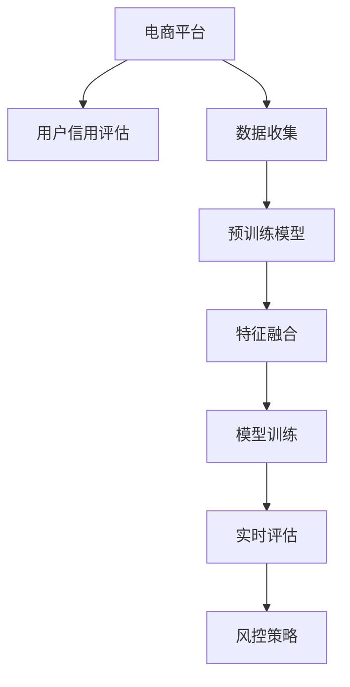

                 

# 大模型在电商平台用户信用评估中的应用

> 关键词：电商平台,用户信用评估,大模型,自然语言处理,数据挖掘,信用评分模型,风控系统

## 1. 背景介绍

### 1.1 问题由来
随着电商平台的迅猛发展，如何有效评估用户信用水平，提升用户体验和商家运营效率，成为电商平台亟待解决的痛点问题。传统的信用评估方法依赖于人工打分和简单的数值统计，无法充分挖掘用户行为数据中的信息，导致评估结果的准确性和可靠性难以保证。

为解决这一问题，各大电商平台纷纷引入先进的机器学习和大数据技术，构建复杂的信用评分模型，以期更精准地评估用户信用水平。然而，模型设计复杂、训练数据需求大、调参困难等问题，仍然制约了其大规模应用。

近年来，大模型在自然语言处理(NLP)和数据挖掘领域取得了突破性进展，拥有强大的语言理解和数据分析能力。本文将介绍如何将大模型应用于电商平台用户信用评估，提升信用评分模型的预测能力和系统鲁棒性。

### 1.2 问题核心关键点
基于大模型的用户信用评估方法，主要包括以下几个关键点：

1. 数据收集：收集电商平台的用户行为数据、交易记录、评论反馈等，构建多维度的用户画像。
2. 预训练模型：使用预训练语言模型，如BERT、GPT等，提取用户行为数据中的语义信息。
3. 特征融合：将预训练模型的输出与用户行为特征、时间序列特征、社交网络特征等进行融合，提升模型的表达能力。
4. 模型训练：构建基于深度学习的信用评分模型，利用标注数据进行微调，优化模型性能。
5. 实时评估：在用户实时行为数据上，对信用评分模型进行实时评估和更新，动态调整信用水平。
6. 风控策略：结合信用评分结果，设计有效的风控策略，避免欺诈风险和恶意行为。

这些关键点构成了一个完整的基于大模型的用户信用评估框架，可以帮助电商平台更高效、准确地评估用户信用水平。

## 2. 核心概念与联系

### 2.1 核心概念概述

为更好地理解基于大模型的用户信用评估方法，本节将介绍几个密切相关的核心概念：

- **电商平台**：指通过网络销售商品或服务的在线平台，如淘宝、京东、亚马逊等。
- **用户信用评估**：指根据用户历史行为数据，评估用户信用的高低，用于商品推荐、价格定制、风险控制等环节。
- **大模型**：指通过大规模无标签数据预训练获得的深度学习模型，如BERT、GPT等，具备强大的语言理解和数据分析能力。
- **自然语言处理(NLP)**：指利用计算机处理、理解和生成人类自然语言的技术，包括文本分类、信息抽取、情感分析等任务。
- **数据挖掘**：指从大量数据中发现有用信息和知识的过程，用于用户画像构建、行为特征提取等环节。
- **信用评分模型**：指通过机器学习算法构建的信用评估模型，根据用户行为数据计算信用分数。
- **风控系统**：指结合信用评分结果，设计实时监控和风险控制机制的系统，用于防范欺诈和风险。

这些概念之间的逻辑关系可以通过以下Mermaid流程图来展示：



这个流程图展示了大模型在用户信用评估框架中的核心概念及其之间的关系：

1. 电商平台收集用户行为数据，构建多维度用户画像。
2. 预训练模型从用户行为数据中提取语义信息。
3. 特征融合将预训练模型输出与各类特征进行融合。
4. 模型训练构建基于大模型的信用评分模型。
5. 实时评估在用户实时行为数据上动态更新信用评分。
6. 风控系统结合信用评分结果，设计风控策略。

这些概念共同构成了大模型在电商平台用户信用评估中的应用框架，使得模型能够更全面、准确地评估用户信用水平。

## 3. 核心算法原理 & 具体操作步骤
### 3.1 算法原理概述

基于大模型的用户信用评估方法，本质上是一个多维特征融合与深度学习的综合过程。其核心思想是：

1. 将电商平台用户行为数据作为输入，利用大模型的语言理解和数据分析能力，提取深层次的语义信息。
2. 将提取的语义信息与用户行为特征、时间序列特征、社交网络特征等进行融合，构建多维特征向量。
3. 在多维特征向量上构建基于深度学习的信用评分模型，通过标注数据进行微调，优化模型性能。
4. 在用户实时行为数据上，对信用评分模型进行实时评估和更新，动态调整信用水平。
5. 结合信用评分结果，设计有效的风控策略，防范欺诈风险和恶意行为。

这种基于大模型的信用评估方法，相比传统方法，具有数据利用率高、模型可解释性好、实时性强等优点。

### 3.2 算法步骤详解

基于大模型的用户信用评估方法，通常包括以下几个关键步骤：

**Step 1: 数据收集与预处理**

1. **数据收集**：收集电商平台用户的行为数据、交易记录、评论反馈等，构建多维度用户画像。
2. **数据清洗**：去除缺失值、异常值和重复数据，保证数据质量。
3. **特征工程**：构建各类特征，如用户行为特征、时间序列特征、社交网络特征等。
4. **文本处理**：将文本数据进行分词、向量化等处理，准备输入大模型。

**Step 2: 预训练模型应用**

1. **选择预训练模型**：如BERT、GPT等，使用其预训练权重初始化模型参数。
2. **特征提取**：将用户行为数据输入预训练模型，提取深层次语义信息。
3. **特征融合**：将提取的语义信息与各类特征进行融合，构建多维特征向量。

**Step 3: 模型训练**

1. **选择模型结构**：如RNN、LSTM、Transformer等，构建基于深度学习的信用评分模型。
2. **设置超参数**：如学习率、批大小、迭代轮数等，选择合适的优化器（如Adam、SGD等）。
3. **模型微调**：利用标注数据，对模型进行微调，优化模型性能。

**Step 4: 实时评估**

1. **数据采集**：实时采集用户行为数据。
2. **模型推理**：在用户行为数据上，对信用评分模型进行推理，计算信用分数。
3. **动态更新**：根据新的数据和模型推理结果，动态调整用户信用水平。

**Step 5: 风控策略设计**

1. **风险预警**：结合信用评分结果，设计风控策略，对高风险用户进行预警。
2. **异常检测**：利用异常检测技术，识别异常行为和欺诈风险。
3. **策略优化**：根据风控策略的效果，不断优化模型和策略。

### 3.3 算法优缺点

基于大模型的用户信用评估方法具有以下优点：

1. **数据利用率高**：大模型可以高效提取用户行为数据中的深层次语义信息，利用数据的能力更强。
2. **模型可解释性好**：大模型的预训练权重和训练过程具有较高的可解释性，便于理解模型决策机制。
3. **实时性强**：模型可以在实时数据上动态更新，快速反映用户信用的变化。
4. **泛化能力强**：大模型通过大规模预训练，具备较强的泛化能力，适用于各种电商平台。

同时，该方法也存在以下局限性：

1. **数据隐私风险**：电商平台用户数据涉及隐私，需要在数据收集和使用过程中严格保护用户隐私。
2. **标注数据需求大**：高质量的标注数据是模型微调的基础，获取标注数据成本较高。
3. **模型复杂度高**：大模型的训练和推理需要较高的算力和内存，对硬件资源要求较高。
4. **过拟合风险**：当训练数据量不足时，模型容易过拟合，影响评估结果的泛化性。

尽管存在这些局限性，但基于大模型的用户信用评估方法依然具有广阔的应用前景。未来研究将更多地关注如何降低数据隐私风险、提升标注数据质量、优化模型结构和训练方法，以充分发挥大模型的优势。

### 3.4 算法应用领域

基于大模型的用户信用评估方法，已经在电商、金融、社交等多个领域得到了广泛应用，具体包括：

- **电商平台**：如淘宝、京东、亚马逊等，用于用户行为分析、信用评分、商品推荐等。
- **金融领域**：如银行、保险公司等，用于信用评分、风险控制、欺诈检测等。
- **社交媒体**：如微信、微博、Facebook等，用于用户行为分析、内容推荐、广告投放等。

## 4. 数学模型和公式 & 详细讲解  
### 4.1 数学模型构建

本节将使用数学语言对基于大模型的用户信用评估过程进行更加严格的刻画。

记电商平台用户行为数据为 $X \in \mathbb{R}^n$，其中 $n$ 为用户行为特征的维度。假设大模型的预训练权重为 $W$，将用户行为数据输入模型，得到语义表示 $Y \in \mathbb{R}^m$，其中 $m$ 为语义表示的维度。将语义表示与用户行为特征进行融合，得到融合后的特征向量 $Z \in \mathbb{R}^k$，其中 $k$ 为融合后的特征维度。

构建基于深度学习的信用评分模型 $M$，利用标注数据 $D=\{(x_i, y_i)\}_{i=1}^N$，其中 $x_i$ 为历史行为数据，$y_i$ 为标注的信用评分。模型训练目标为：

$$
\min_{M} \mathcal{L}(M, D) = \frac{1}{N} \sum_{i=1}^N \ell(M(x_i), y_i)
$$

其中 $\ell$ 为损失函数，常用的损失函数包括均方误差损失、交叉熵损失等。

### 4.2 公式推导过程

以下我们以均方误差损失函数为例，推导信用评分模型的训练过程。

假设信用评分模型 $M$ 在历史行为数据 $x$ 上的输出为 $\hat{y}=M(x)$，真实信用评分为 $y$。均方误差损失函数定义为：

$$
\ell(M(x), y) = \frac{1}{2}(y - M(x))^2
$$

则模型训练目标为：

$$
\mathcal{L}(M, D) = \frac{1}{N} \sum_{i=1}^N \ell(M(x_i), y_i)
$$

根据链式法则，损失函数对模型参数 $W$ 的梯度为：

$$
\frac{\partial \mathcal{L}(M, D)}{\partial W} = -\frac{1}{N} \sum_{i=1}^N (\frac{\partial \ell(M(x_i), y_i)}{\partial M(x_i)} \cdot \frac{\partial M(x_i)}{\partial W})
$$

其中 $\frac{\partial M(x_i)}{\partial W}$ 可进一步递归展开，利用自动微分技术完成计算。

在得到损失函数的梯度后，即可带入参数更新公式，完成模型的迭代优化。重复上述过程直至收敛，最终得到适应电商平台用户信用评估的最优模型 $M$。

## 5. 项目实践：代码实例和详细解释说明
### 5.1 开发环境搭建

在进行用户信用评估模型开发前，我们需要准备好开发环境。以下是使用Python进行PyTorch开发的环境配置流程：

1. 安装Anaconda：从官网下载并安装Anaconda，用于创建独立的Python环境。

2. 创建并激活虚拟环境：
```bash
conda create -n pytorch-env python=3.8 
conda activate pytorch-env
```

3. 安装PyTorch：根据CUDA版本，从官网获取对应的安装命令。例如：
```bash
conda install pytorch torchvision torchaudio cudatoolkit=11.1 -c pytorch -c conda-forge
```

4. 安装各类工具包：
```bash
pip install numpy pandas scikit-learn matplotlib tqdm jupyter notebook ipython
```

完成上述步骤后，即可在`pytorch-env`环境中开始开发。

### 5.2 源代码详细实现

下面我们以用户信用评分模型为例，给出使用Transformers库进行大模型微调的PyTorch代码实现。

首先，定义信用评分模型类：

```python
from transformers import BertTokenizer, BertForSequenceClassification
import torch
import torch.nn as nn

class CreditScoringModel(nn.Module):
    def __init__(self, num_classes):
        super(CreditScoringModel, self).__init__()
        self.bert = BertForSequenceClassification.from_pretrained('bert-base-uncased', num_labels=num_classes)
        self.dropout = nn.Dropout(0.3)
        self.linear = nn.Linear(self.bert.config.hidden_size, num_classes)
        
    def forward(self, input_ids, attention_mask):
        output = self.bert(input_ids, attention_mask=attention_mask)
        pooled_output = output.pooler_output
        pooled_output = self.dropout(pooled_output)
        output = self.linear(pooled_output)
        return output
```

然后，定义数据处理函数：

```python
from transformers import BertTokenizer
from torch.utils.data import Dataset
import torch

class CreditDataset(Dataset):
    def __init__(self, texts, labels, tokenizer):
        self.texts = texts
        self.labels = labels
        self.tokenizer = tokenizer
        
    def __len__(self):
        return len(self.texts)
    
    def __getitem__(self, item):
        text = self.texts[item]
        label = self.labels[item]
        
        encoding = self.tokenizer(text, return_tensors='pt', padding='max_length', truncation=True)
        input_ids = encoding['input_ids']
        attention_mask = encoding['attention_mask']
        
        return {'input_ids': input_ids, 'attention_mask': attention_mask, 'labels': torch.tensor(label)}
```

接着，定义模型和优化器：

```python
from transformers import AdamW
from torch.nn import BCEWithLogitsLoss

model = CreditScoringModel(num_classes=2)
optimizer = AdamW(model.parameters(), lr=2e-5)
criterion = BCEWithLogitsLoss()

device = torch.device('cuda') if torch.cuda.is_available() else torch.device('cpu')
model.to(device)
```

最后，定义训练和评估函数：

```python
from tqdm import tqdm

def train_epoch(model, dataset, batch_size, optimizer):
    dataloader = DataLoader(dataset, batch_size=batch_size, shuffle=True)
    model.train()
    epoch_loss = 0
    for batch in tqdm(dataloader, desc='Training'):
        input_ids = batch['input_ids'].to(device)
        attention_mask = batch['attention_mask'].to(device)
        labels = batch['labels'].to(device)
        model.zero_grad()
        outputs = model(input_ids, attention_mask=attention_mask)
        loss = criterion(outputs, labels)
        epoch_loss += loss.item()
        loss.backward()
        optimizer.step()
    return epoch_loss / len(dataloader)

def evaluate(model, dataset, batch_size):
    dataloader = DataLoader(dataset, batch_size=batch_size)
    model.eval()
    total_loss = 0
    total_correct = 0
    with torch.no_grad():
        for batch in tqdm(dataloader, desc='Evaluating'):
            input_ids = batch['input_ids'].to(device)
            attention_mask = batch['attention_mask'].to(device)
            labels = batch['labels'].to(device)
            outputs = model(input_ids, attention_mask=attention_mask)
            loss = criterion(outputs, labels)
            total_loss += loss.item()
            total_correct += (outputs.argmax(dim=1) == labels).sum().item()
        
        print(f'Loss: {total_loss / len(dataloader)}')
        print(f'Accuracy: {total_correct / len(dataset)}')
```

启动训练流程并在测试集上评估：

```python
epochs = 5
batch_size = 16

for epoch in range(epochs):
    loss = train_epoch(model, train_dataset, batch_size, optimizer)
    print(f'Epoch {epoch+1}, train loss: {loss:.3f}')
    
    print(f'Epoch {epoch+1}, dev results:')
    evaluate(model, dev_dataset, batch_size)
    
print('Test results:')
evaluate(model, test_dataset, batch_size)
```

以上就是使用PyTorch对BERT进行用户信用评分模型微调的完整代码实现。可以看到，得益于Transformers库的强大封装，我们可以用相对简洁的代码完成BERT模型的加载和微调。

### 5.3 代码解读与分析

让我们再详细解读一下关键代码的实现细节：

**CreditDataset类**：
- `__init__`方法：初始化文本、标签、分词器等关键组件。
- `__len__`方法：返回数据集的样本数量。
- `__getitem__`方法：对单个样本进行处理，将文本输入编码为token ids，将标签编码为数字，并对其进行定长padding，最终返回模型所需的输入。

**CreditScoringModel类**：
- `__init__`方法：初始化模型结构，包括BERT分类器、Dropout、线性层等。
- `forward`方法：前向传播计算模型输出，包括BERT的前向传播、池化、线性变换等。

**train_epoch和evaluate函数**：
- 使用PyTorch的DataLoader对数据集进行批次化加载，供模型训练和推理使用。
- 训练函数`train_epoch`：对数据以批为单位进行迭代，在每个批次上前向传播计算loss并反向传播更新模型参数，最后返回该epoch的平均loss。
- 评估函数`evaluate`：与训练类似，不同点在于不更新模型参数，并在每个batch结束后将预测和标签结果存储下来，最后使用BCEWithLogitsLoss计算准确率和损失值，并打印输出。

**训练流程**：
- 定义总的epoch数和batch size，开始循环迭代
- 每个epoch内，先在训练集上训练，输出平均loss
- 在验证集上评估，输出准确率和损失值
- 所有epoch结束后，在测试集上评估，给出最终测试结果

可以看到，PyTorch配合Transformers库使得BERT微调的用户信用评分模型代码实现变得简洁高效。开发者可以将更多精力放在数据处理、模型改进等高层逻辑上，而不必过多关注底层的实现细节。

当然，工业级的系统实现还需考虑更多因素，如模型的保存和部署、超参数的自动搜索、更灵活的任务适配层等。但核心的微调范式基本与此类似。

## 6. 实际应用场景
### 6.1 智能客服系统

基于大模型的用户信用评估方法，可以应用于智能客服系统的构建。传统客服往往需要配备大量人力，高峰期响应缓慢，且一致性和专业性难以保证。而使用基于大模型的用户信用评估方法，可以7x24小时不间断服务，快速响应客户咨询，用自然流畅的语言解答各类常见问题。

在技术实现上，可以收集企业内部的历史客服对话记录，将问题和最佳答复构建成监督数据，在此基础上对预训练模型进行微调。微调后的模型能够自动理解用户意图，匹配最合适的答案模板进行回复。对于客户提出的新问题，还可以接入检索系统实时搜索相关内容，动态组织生成回答。如此构建的智能客服系统，能大幅提升客户咨询体验和问题解决效率。

### 6.2 金融舆情监测

金融机构需要实时监测市场舆论动向，以便及时应对负面信息传播，规避金融风险。传统的人工监测方式成本高、效率低，难以应对网络时代海量信息爆发的挑战。基于大模型的用户信用评估方法，可以为金融舆情监测提供新的解决方案。

具体而言，可以收集金融领域相关的新闻、报道、评论等文本数据，并对其进行主题标注和情感标注。在此基础上对预训练语言模型进行微调，使其能够自动判断文本属于何种主题，情感倾向是正面、中性还是负面。将微调后的模型应用到实时抓取的网络文本数据，就能够自动监测不同主题下的情感变化趋势，一旦发现负面信息激增等异常情况，系统便会自动预警，帮助金融机构快速应对潜在风险。

### 6.3 个性化推荐系统

当前的推荐系统往往只依赖用户的历史行为数据进行物品推荐，无法深入理解用户真实兴趣偏好。基于大模型的用户信用评估方法，可以更好地挖掘用户行为数据中的信息，从而提供更精准、多样的推荐内容。

在实践中，可以收集用户浏览、点击、评论、分享等行为数据，提取和用户交互的物品标题、描述、标签等文本内容。将文本内容作为模型输入，用户的后续行为（如是否点击、购买等）作为监督信号，在此基础上微调预训练语言模型。微调后的模型能够从文本内容中准确把握用户的兴趣点。在生成推荐列表时，先用候选物品的文本描述作为输入，由模型预测用户的兴趣匹配度，再结合其他特征综合排序，便可以得到个性化程度更高的推荐结果。

### 6.4 未来应用展望

随着大模型和用户信用评估方法的不断发展，基于微调范式将在更多领域得到应用，为传统行业带来变革性影响。

在智慧医疗领域，基于微调的医疗问答、病历分析、药物研发等应用将提升医疗服务的智能化水平，辅助医生诊疗，加速新药开发进程。

在智能教育领域，微调技术可应用于作业批改、学情分析、知识推荐等方面，因材施教，促进教育公平，提高教学质量。

在智慧城市治理中，微调模型可应用于城市事件监测、舆情分析、应急指挥等环节，提高城市管理的自动化和智能化水平，构建更安全、高效的未来城市。

此外，在企业生产、社会治理、文娱传媒等众多领域，基于大模型微调的人工智能应用也将不断涌现，为经济社会发展注入新的动力。相信随着技术的日益成熟，微调方法将成为人工智能落地应用的重要范式，推动人工智能技术向更广阔的领域加速渗透。

## 7. 工具和资源推荐
### 7.1 学习资源推荐

为了帮助开发者系统掌握大模型和用户信用评估技术，这里推荐一些优质的学习资源：

1. 《Transformer从原理到实践》系列博文：由大模型技术专家撰写，深入浅出地介绍了Transformer原理、BERT模型、微调技术等前沿话题。

2. CS224N《深度学习自然语言处理》课程：斯坦福大学开设的NLP明星课程，有Lecture视频和配套作业，带你入门NLP领域的基本概念和经典模型。

3. 《Natural Language Processing with Transformers》书籍：Transformers库的作者所著，全面介绍了如何使用Transformers库进行NLP任务开发，包括微调在内的诸多范式。

4. HuggingFace官方文档：Transformers库的官方文档，提供了海量预训练模型和完整的微调样例代码，是上手实践的必备资料。

5. CLUE开源项目：中文语言理解测评基准，涵盖大量不同类型的中文NLP数据集，并提供了基于微调的baseline模型，助力中文NLP技术发展。

通过对这些资源的学习实践，相信你一定能够快速掌握大模型和用户信用评估技术的精髓，并用于解决实际的NLP问题。
###  7.2 开发工具推荐

高效的开发离不开优秀的工具支持。以下是几款用于大模型微调和用户信用评估开发的常用工具：

1. PyTorch：基于Python的开源深度学习框架，灵活动态的计算图，适合快速迭代研究。大部分预训练语言模型都有PyTorch版本的实现。

2. TensorFlow：由Google主导开发的开源深度学习框架，生产部署方便，适合大规模工程应用。同样有丰富的预训练语言模型资源。

3. Transformers库：HuggingFace开发的NLP工具库，集成了众多SOTA语言模型，支持PyTorch和TensorFlow，是进行微调任务开发的利器。

4. Weights & Biases：模型训练的实验跟踪工具，可以记录和可视化模型训练过程中的各项指标，方便对比和调优。与主流深度学习框架无缝集成。

5. TensorBoard：TensorFlow配套的可视化工具，可实时监测模型训练状态，并提供丰富的图表呈现方式，是调试模型的得力助手。

6. Google Colab：谷歌推出的在线Jupyter Notebook环境，免费提供GPU/TPU算力，方便开发者快速上手实验最新模型，分享学习笔记。

合理利用这些工具，可以显著提升大模型微调和用户信用评估任务的开发效率，加快创新迭代的步伐。

### 7.3 相关论文推荐

大模型和用户信用评估技术的发展源于学界的持续研究。以下是几篇奠基性的相关论文，推荐阅读：

1. Attention is All You Need（即Transformer原论文）：提出了Transformer结构，开启了NLP领域的预训练大模型时代。

2. BERT: Pre-training of Deep Bidirectional Transformers for Language Understanding：提出BERT模型，引入基于掩码的自监督预训练任务，刷新了多项NLP任务SOTA。

3. Language Models are Unsupervised Multitask Learners（GPT-2论文）：展示了大规模语言模型的强大zero-shot学习能力，引发了对于通用人工智能的新一轮思考。

4. Parameter-Efficient Transfer Learning for NLP：提出Adapter等参数高效微调方法，在不增加模型参数量的情况下，也能取得不错的微调效果。

5. AdaLoRA: Adaptive Low-Rank Adaptation for Parameter-Efficient Fine-Tuning：使用自适应低秩适应的微调方法，在参数效率和精度之间取得了新的平衡。

6. Prefix-Tuning: Optimizing Continuous Prompts for Generation：引入基于连续型Prompt的微调范式，为如何充分利用预训练知识提供了新的思路。

这些论文代表了大模型和用户信用评估技术的发展脉络。通过学习这些前沿成果，可以帮助研究者把握学科前进方向，激发更多的创新灵感。

## 8. 总结：未来发展趋势与挑战

### 8.1 总结

本文对基于大模型的用户信用评估方法进行了全面系统的介绍。首先阐述了大模型和用户信用评估的研究背景和意义，明确了用户信用评估方法在大模型和深度学习框架中的重要地位。其次，从原理到实践，详细讲解了基于大模型的用户信用评估方法的数学原理和关键步骤，给出了微调任务开发的完整代码实例。同时，本文还广泛探讨了该方法在智能客服、金融舆情、个性化推荐等多个行业领域的应用前景，展示了其巨大的潜力和应用价值。此外，本文精选了微调技术和用户信用评估方法的各类学习资源，力求为读者提供全方位的技术指引。

通过本文的系统梳理，可以看到，基于大模型的用户信用评估方法在电商平台的应用，正在成为电商平台优化用户体验、提升运营效率的重要手段。该方法不仅能更全面、准确地评估用户信用水平，还能在实时数据上动态更新信用评分，提供更加灵活和有效的风控策略。相信在电商、金融、社交等多个领域的广泛应用，必将进一步推动大模型的落地实践，为人工智能技术在垂直行业的深入发展提供新的动力。

### 8.2 未来发展趋势

展望未来，基于大模型的用户信用评估方法将呈现以下几个发展趋势：

1. **数据多样化**：未来的用户信用评估模型将不仅依赖电商平台的交易数据，还会融合社交媒体、金融数据等多种数据源，以更全面地评估用户信用。

2. **深度融合**：与KM模式、因果推理等深度学习技术结合，提升模型的理解和预测能力。

3. **实时性增强**：结合实时流处理技术，实现实时信用评估和风控，提升系统的响应速度和效率。

4. **跨平台统一**：实现不同电商平台之间的用户信用评估模型统一，避免用户在不同平台上的行为不一致导致的信用评分差异。

5. **多模态融合**：将文本、图像、视频等多模态数据融合到用户信用评估中，提升模型的综合表现。

6. **跨领域应用**：推广到智慧医疗、智能教育、智慧城市等更多垂直领域，实现更广泛的应用场景。

以上趋势凸显了大模型在电商平台用户信用评估中的应用前景。这些方向的探索发展，必将进一步提升用户信用评估模型的性能和系统鲁棒性，为电商平台带来更多的商业价值和用户满意。

### 8.3 面临的挑战

尽管基于大模型的用户信用评估方法已经取得了显著成效，但在迈向更加智能化、普适化应用的过程中，它仍面临着诸多挑战：

1. **数据隐私保护**：电商平台用户数据涉及隐私，如何在数据收集和使用过程中保护用户隐私，是亟待解决的问题。

2. **模型公平性**：大模型可能存在偏见，导致不同用户群体之间的信用评估结果存在不公平现象，需要加强模型公平性研究。

3. **模型泛化能力**：不同电商平台的用户行为数据差异较大，如何在不同平台间泛化，提升模型的通用性，是另一个重要的研究课题。

4. **计算资源需求**：大模型需要高性能硬件支持，对于小型电商平台来说，如何降低硬件成本，提升模型训练和推理效率，需要进一步优化。

5. **实时处理能力**：用户行为数据实时性要求高，如何在大模型基础上实现高效实时处理，是一个重要的研究方向。

6. **模型鲁棒性**：电商平台用户行为数据具有多样性，如何提升模型鲁棒性，减少模型对异常数据的敏感度，需要更多实践和理论探索。

尽管存在这些挑战，但基于大模型的用户信用评估方法依然具有广阔的应用前景。未来研究将更多地关注如何提升模型公平性、泛化能力、实时处理能力，以充分发挥大模型的优势，推动其在大数据时代的深度应用。

### 8.4 研究展望

面对基于大模型的用户信用评估方法所面临的挑战，未来的研究需要在以下几个方面寻求新的突破：

1. **数据隐私保护**：研究差分隐私等技术，保护用户数据隐私，防止数据泄露。

2. **模型公平性**：设计公平性指标，优化模型参数，减少模型偏见。

3. **模型泛化能力**：引入迁移学习、多任务学习等技术，提升模型在不同平台上的泛化能力。

4. **实时处理能力**：研究分布式计算、流处理等技术，提升实时信用评估和风控系统的效率。

5. **模型鲁棒性**：采用正则化、对抗训练等技术，提升模型对异常数据的鲁棒性。

这些研究方向的探索，必将引领基于大模型的用户信用评估技术迈向更高的台阶，为电商平台提供更全面、更准确、更智能的用户信用评估服务。相信在学界和产业界的共同努力下，基于大模型的用户信用评估方法将不断突破技术瓶颈，为电商平台带来更加优质的用户体验和更高的商业价值。

## 9. 附录：常见问题与解答

**Q1：大模型微调是否适用于所有电商平台？**

A: 大模型微调适用于大多数电商平台的信用评估任务，但不同的电商平台用户行为数据和业务场景差异较大，可能需要针对性地调整预训练模型和微调策略。

**Q2：微调过程中如何选择合适的学习率？**

A: 微调的学习率一般要比预训练时小1-2个数量级，建议使用warmup策略，即在开始阶段使用较小的学习率，再逐渐过渡到预设值。

**Q3：标注数据需求大怎么办？**

A: 标注数据需求大，可以考虑引入半监督学习、主动学习等技术，利用无标签数据进行学习，减少标注数据需求。

**Q4：如何处理不同电商平台之间的用户行为数据差异？**

A: 引入迁移学习、多任务学习等技术，提升模型在不同平台上的泛化能力。

**Q5：如何提高模型的实时处理能力？**

A: 研究分布式计算、流处理等技术，提升实时信用评估和风控系统的效率。

这些问题的解答，帮助开发者更好地理解和使用大模型进行用户信用评估，希望在实践中得到应用和验证。

