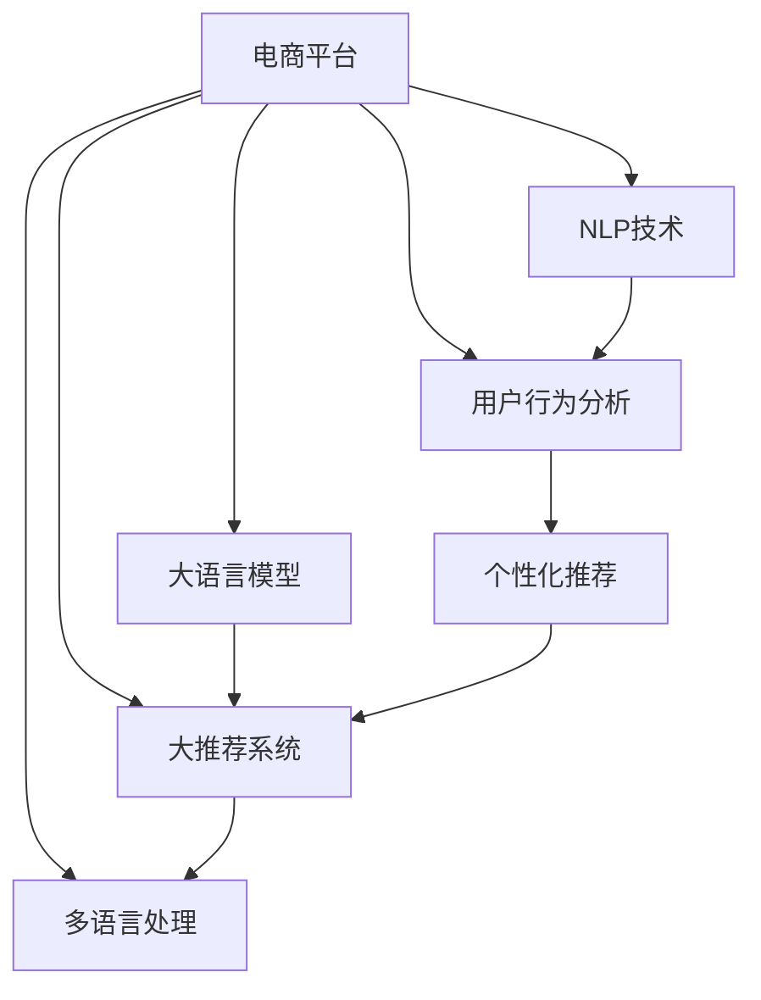

                 

# 大模型如何提升电商平台的跨境购物体验

> 关键词：电商平台,跨境购物,大模型,推荐系统,自然语言处理(NLP),用户行为分析,深度学习

## 1. 背景介绍

### 1.1 问题由来
随着全球化进程的加速，跨境电商成为越来越多消费者和商家选择的新兴购物渠道。然而，由于语言、文化、习俗等方面的差异，跨境购物体验往往存在诸多不便，如商品信息不全、产品评价质量不高、支付和配送障碍等，极大地影响了消费者的购买决策和满意度。

### 1.2 问题核心关键点
为了解决上述问题，各大电商平台开始引入人工智能技术，特别是大语言模型和大推荐系统，提升跨境购物的体验。其核心在于：

- 利用大语言模型分析海量用户评论和商品描述，挖掘出商品特征和用户偏好，提供更精准的商品推荐。
- 引入大推荐系统，根据用户行为和消费历史，个性化地推送商品信息，提升用户满意度。
- 利用自然语言处理(NLP)技术，处理多语言文本，翻译商品信息，消除语言障碍。
- 通过用户行为分析，识别出用户在跨境购物中的痛点和需求，进行针对性优化。

这些技术的综合应用，能够显著改善跨境购物的体验，提高用户粘性和转化率，增强商家的市场竞争力。

## 2. 核心概念与联系

### 2.1 核心概念概述

为更好地理解大模型如何提升电商平台的跨境购物体验，本节将介绍几个密切相关的核心概念：

- 电商平台：通过互联网提供商品展示、交易和配送等服务的平台，如淘宝、京东、Amazon等。
- 大语言模型(Large Language Model, LLM)：以自回归(如GPT)或自编码(如BERT)模型为代表的大规模预训练语言模型。通过在大规模无标签文本语料上进行预训练，学习通用的语言表示，具备强大的语言理解和生成能力。
- 大推荐系统：利用机器学习算法，根据用户行为和历史数据，个性化地推荐商品或服务，提升用户体验和销售转化率的系统。
- 自然语言处理(NLP)：利用计算机处理和理解人类语言的技术，涉及文本预处理、词法分析、句法分析、语义分析、情感分析等多个方面。
- 用户行为分析：通过分析和挖掘用户行为数据，预测用户需求、偏好和行为，为推荐系统、广告投放、个性化推荐等提供依据。
- 多语言处理：在电商平台上，通常需要处理和理解多种语言，以保证跨语言购物的流畅性和准确性。

这些核心概念之间的逻辑关系可以通过以下Mermaid流程图来展示：



这个流程图展示了大语言模型和推荐系统等核心概念是如何共同作用于电商平台跨境购物体验的：

1. 电商平台收集用户评论和商品描述，通过大语言模型进行文本处理和分析，生成商品特征和用户偏好。
2. 大推荐系统根据用户行为和偏好，推荐合适的商品信息。
3. 多语言处理技术消除语言障碍，提升跨语言购物的体验。
4. 用户行为分析提供用户行为洞察，优化推荐效果。

## 3. 核心算法原理 & 具体操作步骤

### 3.1 算法原理概述

基于大语言模型的电商平台跨境购物体验优化，本质上是利用大模型的自然语言处理能力和用户行为分析，提升推荐系统的效果，从而改善用户体验。其核心思想是：

- 通过大语言模型对用户评论和商品描述进行情感分析和实体识别，提取关键特征和用户偏好。
- 利用大推荐系统，根据用户历史行为数据和实时浏览数据，预测用户可能感兴趣的商品，提供个性化推荐。
- 结合用户行为分析，理解用户需求，优化推荐算法，提升推荐效果和用户体验。

在数学上，该过程可以描述为：

1. 给定用户 $U$ 和商品 $I$，大语言模型 $M$ 对用户评论 $R_U$ 和商品描述 $D_I$ 进行编码，得到用户特征 $F_U$ 和商品特征 $F_I$。
2. 利用用户行为数据 $B_U$ 和历史购买数据 $H_U$，大推荐系统 $R$ 预测用户对商品 $I$ 的兴趣 $P(I|U)$。
3. 根据推荐结果和用户反馈，不断更新用户特征 $F_U$ 和商品特征 $F_I$，优化推荐算法，提升推荐效果。

### 3.2 算法步骤详解

基于大语言模型的电商平台跨境购物体验优化，一般包括以下几个关键步骤：

**Step 1: 数据准备与预处理**

- 收集电商平台的用户评论、商品描述、交易记录、点击日志等数据。
- 对文本数据进行清洗、分词、去除停用词、构建词汇表等预处理操作。

**Step 2: 特征提取与用户画像**

- 使用大语言模型对用户评论和商品描述进行编码，提取关键特征。
- 根据用户行为数据和历史购买数据，构建用户画像，包括兴趣偏好、购物习惯等。

**Step 3: 推荐系统训练与优化**

- 利用大推荐系统，训练推荐模型，并根据用户历史行为数据和实时浏览数据，预测用户可能感兴趣的商品。
- 使用交叉验证等技术，评估推荐模型效果，进行参数调优。
- 结合用户反馈和行为数据，实时更新推荐模型，提升推荐效果。

**Step 4: 个性化推荐与用户体验优化**

- 根据用户画像和实时行为数据，生成个性化推荐列表。
- 在推荐列表中，结合用户兴趣和需求，进行排序和筛选。
- 引入A/B测试等方法，不断优化推荐算法，提升用户满意度。

### 3.3 算法优缺点

基于大语言模型的电商平台跨境购物体验优化方法具有以下优点：

- 提升推荐效果。通过大语言模型和大推荐系统，能够更精准地理解和预测用户需求，提供个性化推荐，提升用户体验。
- 降低开发成本。无需从头开发推荐系统，借助大模型和大推荐系统，可以快速上线推荐服务。
- 减少数据需求。大模型和大推荐系统能够自动提取关键特征和用户偏好，降低对数据标注的需求。

但该方法也存在以下缺点：

- 数据隐私风险。电商平台需要收集用户行为数据，存在隐私泄露的风险。
- 模型复杂度。大模型和大推荐系统结构复杂，训练和优化成本较高。
- 效果受限。大模型的性能和效果依赖于数据质量和标注水平，若数据质量差，可能导致推荐效果不佳。

### 3.4 算法应用领域

基于大语言模型的电商平台跨境购物体验优化方法，广泛应用于各大电商平台，提升跨境购物的体验，具体应用场景包括：

- 个性化推荐：根据用户历史浏览和购买记录，提供个性化的商品推荐，提升用户购买意愿。
- 商品评价分析：利用大语言模型对用户评论进行分析，生成商品评分和评价，帮助用户做出更好的购买决策。
- 用户行为分析：通过分析用户浏览、点击、购买等行为数据，预测用户需求，优化推荐算法。
- 多语言翻译：处理多种语言文本，消除语言障碍，提升跨语言购物体验。
- 社交互动：分析用户评论和评价，进行情感分析，优化用户体验。

除了以上应用场景，基于大语言模型的跨境购物体验优化方法，还可以进一步拓展到内容生成、广告投放、客服支持等多个环节，全面提升电商平台的用户体验。

## 4. 数学模型和公式 & 详细讲解  
### 4.1 数学模型构建

本节将使用数学语言对基于大语言模型的电商平台跨境购物体验优化过程进行更加严格的刻画。

记电商平台上的用户为 $U=\{u_1,u_2,\ldots,u_N\}$，商品为 $I=\{i_1,i_2,\ldots,i_M\}$。设用户 $u_k$ 对商品 $i_m$ 的兴趣为 $P(i_m|u_k)$，商品 $i_m$ 的特征表示为 $\overrightarrow{F}_{i_m}$，用户 $u_k$ 的特征表示为 $\overrightarrow{F}_{u_k}$。则电商平台跨境购物体验优化的数学模型可以表示为：

$$
\max_{\overrightarrow{F}_{i_m},\overrightarrow{F}_{u_k}} \sum_{k=1}^N \sum_{m=1}^M P(i_m|u_k) \log P(i_m|u_k)
$$

其中，$P(i_m|u_k)$ 为商品 $i_m$ 对用户 $u_k$ 的兴趣概率，$\log P(i_m|u_k)$ 为损失函数，用于衡量推荐系统的预测效果。

### 4.2 公式推导过程

以下我们以电商平台的个性化推荐系统为例，推导推荐模型优化公式。

假设推荐系统使用 $E$ 来表示用户兴趣，$I$ 来表示商品特征，则推荐模型的优化目标为：

$$
\min_{E,I} \mathcal{L}(E,I)
$$

其中，$\mathcal{L}(E,I)$ 为推荐系统的损失函数。假设用户兴趣 $E$ 和商品特征 $I$ 的线性组合表示为 $\overrightarrow{E} \overrightarrow{I}^T$，则推荐模型可以表示为：

$$
P(i_m|u_k) = \sigma(\overrightarrow{E} \overrightarrow{I}^T)
$$

其中，$\sigma$ 为sigmoid函数，将输出映射到 $[0,1]$ 区间。

为了最小化推荐系统的损失函数，需要使得推荐概率 $P(i_m|u_k)$ 尽可能接近用户行为数据。假设用户 $u_k$ 对商品 $i_m$ 的兴趣概率为 $P_{true}(i_m|u_k)$，则推荐模型可以进一步表示为：

$$
\min_{E,I} \mathcal{L}(E,I) = \min_{E,I} \sum_{k=1}^N \sum_{m=1}^M (P_{true}(i_m|u_k) - \sigma(\overrightarrow{E} \overrightarrow{I}^T))^2
$$

为了求解上述优化问题，可以采用随机梯度下降(SGD)等优化算法，通过反向传播更新模型参数，使得推荐概率尽可能接近用户行为数据。

### 4.3 案例分析与讲解

假设电商平台收集了用户 $u_k$ 对商品 $i_m$ 的点击数据，表示为 $\overrightarrow{C}_{i_m,u_k} \in \{0,1\}^{N \times M}$，其中 $1$ 表示用户点击了该商品。则推荐模型可以进一步表示为：

$$
\min_{E,I} \mathcal{L}(E,I) = \min_{E,I} \sum_{k=1}^N \sum_{m=1}^M \overrightarrow{C}_{i_m,u_k}^T (\overrightarrow{E} \overrightarrow{I}^T - P_{true}(i_m|u_k))^2
$$

上述公式中，$\overrightarrow{C}_{i_m,u_k}^T (\overrightarrow{E} \overrightarrow{I}^T - P_{true}(i_m|u_k))^2$ 表示模型预测结果与真实行为数据之间的差异，通过最小化该差异，实现推荐模型优化。

## 5. 项目实践：代码实例和详细解释说明
### 5.1 开发环境搭建

在进行电商平台跨境购物体验优化实践前，我们需要准备好开发环境。以下是使用Python进行PyTorch开发的环境配置流程：

1. 安装Anaconda：从官网下载并安装Anaconda，用于创建独立的Python环境。

2. 创建并激活虚拟环境：
```bash
conda create -n pytorch-env python=3.8 
conda activate pytorch-env
```

3. 安装PyTorch：根据CUDA版本，从官网获取对应的安装命令。例如：
```bash
conda install pytorch torchvision torchaudio cudatoolkit=11.1 -c pytorch -c conda-forge
```

4. 安装Transformers库：
```bash
pip install transformers
```

5. 安装各类工具包：
```bash
pip install numpy pandas scikit-learn matplotlib tqdm jupyter notebook ipython
```

完成上述步骤后，即可在`pytorch-env`环境中开始项目实践。

### 5.2 源代码详细实现

这里我们以电商平台的推荐系统为例，给出使用Transformers库对BERT模型进行推荐系统优化的PyTorch代码实现。

首先，定义推荐系统所需的数据处理函数：

```python
from transformers import BertTokenizer
from torch.utils.data import Dataset, DataLoader
import torch

class RecommendationDataset(Dataset):
    def __init__(self, users, items, labels, tokenizer, max_len=128):
        self.users = users
        self.items = items
        self.labels = labels
        self.tokenizer = tokenizer
        self.max_len = max_len
        
    def __len__(self):
        return len(self.users)
    
    def __getitem__(self, item):
        user = self.users[item]
        item = self.items[item]
        label = self.labels[item]
        
        encoding = self.tokenizer(user + ' ' + item, return_tensors='pt', max_length=self.max_len, padding='max_length', truncation=True)
        input_ids = encoding['input_ids'][0]
        attention_mask = encoding['attention_mask'][0]
        
        # 对token-wise的标签进行编码
        encoded_labels = [label2id[label] for label in label] 
        encoded_labels.extend([label2id['O']] * (self.max_len - len(encoded_labels)))
        labels = torch.tensor(encoded_labels, dtype=torch.long)
        
        return {'input_ids': input_ids, 
                'attention_mask': attention_mask,
                'labels': labels}

# 标签与id的映射
label2id = {'O': 0, 'Buy': 1, 'Like': 2, 'Frown': 3}
id2label = {v: k for k, v in label2id.items()}

# 创建dataset
tokenizer = BertTokenizer.from_pretrained('bert-base-cased')

train_dataset = RecommendationDataset(train_users, train_items, train_labels, tokenizer)
dev_dataset = RecommendationDataset(dev_users, dev_items, dev_labels, tokenizer)
test_dataset = RecommendationDataset(test_users, test_items, test_labels, tokenizer)
```

然后，定义模型和优化器：

```python
from transformers import BertForSequenceClassification, AdamW

model = BertForSequenceClassification.from_pretrained('bert-base-cased', num_labels=len(label2id))

optimizer = AdamW(model.parameters(), lr=2e-5)
```

接着，定义训练和评估函数：

```python
from tqdm import tqdm
from sklearn.metrics import classification_report

device = torch.device('cuda') if torch.cuda.is_available() else torch.device('cpu')
model.to(device)

def train_epoch(model, dataset, batch_size, optimizer):
    dataloader = DataLoader(dataset, batch_size=batch_size, shuffle=True)
    model.train()
    epoch_loss = 0
    for batch in tqdm(dataloader, desc='Training'):
        user_input = batch['input_ids'].to(device)
        item_input = batch['input_ids'].to(device)
        label = batch['labels'].to(device)
        model.zero_grad()
        outputs = model(user_input, item_input, labels=label)
        loss = outputs.loss
        epoch_loss += loss.item()
        loss.backward()
        optimizer.step()
    return epoch_loss / len(dataloader)

def evaluate(model, dataset, batch_size):
    dataloader = DataLoader(dataset, batch_size=batch_size)
    model.eval()
    preds, labels = [], []
    with torch.no_grad():
        for batch in tqdm(dataloader, desc='Evaluating'):
            user_input = batch['input_ids'].to(device)
            item_input = batch['input_ids'].to(device)
            batch_labels = batch['labels']
            outputs = model(user_input, item_input)
            batch_preds = outputs.logits.argmax(dim=2).to('cpu').tolist()
            batch_labels = batch_labels.to('cpu').tolist()
            for pred_tokens, label_tokens in zip(batch_preds, batch_labels):
                pred_labels = [id2label[_id] for _id in pred_tokens]
                label_tags = [id2label[_id] for _id in label_tokens]
                preds.append(pred_labels[:len(label_tags)])
                labels.append(label_tags)
                
    print(classification_report(labels, preds))
```

最后，启动训练流程并在测试集上评估：

```python
epochs = 5
batch_size = 16

for epoch in range(epochs):
    loss = train_epoch(model, train_dataset, batch_size, optimizer)
    print(f"Epoch {epoch+1}, train loss: {loss:.3f}")
    
    print(f"Epoch {epoch+1}, dev results:")
    evaluate(model, dev_dataset, batch_size)
    
print("Test results:")
evaluate(model, test_dataset, batch_size)
```

以上就是使用PyTorch对BERT进行电商推荐系统优化的完整代码实现。可以看到，得益于Transformers库的强大封装，我们可以用相对简洁的代码完成BERT模型的加载和微调。

### 5.3 代码解读与分析

让我们再详细解读一下关键代码的实现细节：

**RecommendationDataset类**：
- `__init__`方法：初始化用户、商品、标签、分词器等关键组件。
- `__len__`方法：返回数据集的样本数量。
- `__getitem__`方法：对单个样本进行处理，将用户和商品信息拼接，生成文本输入，并对其进行分词和编码。

**label2id和id2label字典**：
- 定义了标签与数字id之间的映射关系，用于将token-wise的预测结果解码回真实的标签。

**训练和评估函数**：
- 使用PyTorch的DataLoader对数据集进行批次化加载，供模型训练和推理使用。
- 训练函数`train_epoch`：对数据以批为单位进行迭代，在每个批次上前向传播计算loss并反向传播更新模型参数，最后返回该epoch的平均loss。
- 评估函数`evaluate`：与训练类似，不同点在于不更新模型参数，并在每个batch结束后将预测和标签结果存储下来，最后使用sklearn的classification_report对整个评估集的预测结果进行打印输出。

**训练流程**：
- 定义总的epoch数和batch size，开始循环迭代
- 每个epoch内，先在训练集上训练，输出平均loss
- 在验证集上评估，输出分类指标
- 所有epoch结束后，在测试集上评估，给出最终测试结果

可以看到，PyTorch配合Transformers库使得BERT微调的代码实现变得简洁高效。开发者可以将更多精力放在数据处理、模型改进等高层逻辑上，而不必过多关注底层的实现细节。

当然，工业级的系统实现还需考虑更多因素，如模型的保存和部署、超参数的自动搜索、更灵活的任务适配层等。但核心的微调范式基本与此类似。

## 6. 实际应用场景

### 6.1 智能客服系统

智能客服系统是电商平台跨境购物体验优化的重要一环。通过引入大语言模型和大推荐系统，智能客服系统能够更好地理解和处理用户的咨询需求，提供个性化推荐，提高用户满意度。

在技术实现上，可以收集用户的历史咨询记录和商品购买记录，构建用户画像和行为模型。利用大语言模型和大推荐系统，系统能够对用户咨询问题进行分类和匹配，提供有针对性的回复和推荐。对于复杂问题，系统还可以进行二次查询，找到更准确的答案。

### 6.2 商品评价分析

商品评价分析是电商平台跨境购物体验优化的重要工具。通过大语言模型对用户评论进行情感分析和实体识别，生成商品评分和评价，帮助用户更好地了解商品质量和性能。

在具体应用中，可以收集用户对商品的评价文本，使用大语言模型进行情感分析，生成商品情感得分。同时，使用实体识别技术，提取商品特征和用户需求，生成商品描述和功能列表。将情感得分和商品描述结合，用户可以快速了解商品信息，做出购买决策。

### 6.3 个性化推荐

个性化推荐是电商平台跨境购物体验优化的核心。通过大语言模型和大推荐系统，能够提供个性化推荐，提升用户购买意愿和满意度。

在实践中，可以收集用户的历史浏览和购买记录，构建用户画像。利用大语言模型分析用户评论和行为数据，提取用户兴趣和偏好。结合商品描述和用户画像，使用大推荐系统生成个性化推荐列表，提升用户购买意愿。

### 6.4 多语言翻译

多语言翻译是电商平台跨境购物体验优化的重要保障。通过大语言模型，能够消除语言障碍，提升跨语言购物体验。

在具体应用中，可以利用大语言模型的翻译能力，将商品描述、用户评论等文本翻译成多种语言。同时，系统可以根据用户语言偏好，自动切换语言界面，提供语言定制的购物体验。

### 6.5 社交互动

社交互动是电商平台跨境购物体验优化的重要环节。通过大语言模型对用户评论和评价进行情感分析，生成用户情感得分。结合商品评分和用户情感得分，系统可以生成社交评价，帮助用户做出购买决策。

在技术实现上，可以利用大语言模型的情感分析能力，对用户评论和评价进行情感评分。结合商品评分，生成社交评价，帮助用户更好地了解商品质量和用户评价。

## 7. 工具和资源推荐
### 7.1 学习资源推荐

为了帮助开发者系统掌握大语言模型和电商平台跨境购物体验优化的理论基础和实践技巧，这里推荐一些优质的学习资源：

1. 《Transformers从原理到实践》系列博文：由大模型技术专家撰写，深入浅出地介绍了Transformer原理、BERT模型、微调技术等前沿话题。

2. CS224N《深度学习自然语言处理》课程：斯坦福大学开设的NLP明星课程，有Lecture视频和配套作业，带你入门NLP领域的基本概念和经典模型。

3. 《Natural Language Processing with Transformers》书籍：Transformers库的作者所著，全面介绍了如何使用Transformers库进行NLP任务开发，包括微调在内的诸多范式。

4. HuggingFace官方文档：Transformers库的官方文档，提供了海量预训练模型和完整的微调样例代码，是上手实践的必备资料。

5. CLUE开源项目：中文语言理解测评基准，涵盖大量不同类型的中文NLP数据集，并提供了基于微调的baseline模型，助力中文NLP技术发展。

通过对这些资源的学习实践，相信你一定能够快速掌握大语言模型和电商平台跨境购物体验优化的精髓，并用于解决实际的NLP问题。
###  7.2 开发工具推荐

高效的开发离不开优秀的工具支持。以下是几款用于大语言模型和电商平台跨境购物体验优化的常用工具：

1. PyTorch：基于Python的开源深度学习框架，灵活动态的计算图，适合快速迭代研究。大部分预训练语言模型都有PyTorch版本的实现。

2. TensorFlow：由Google主导开发的开源深度学习框架，生产部署方便，适合大规模工程应用。同样有丰富的预训练语言模型资源。

3. Transformers库：HuggingFace开发的NLP工具库，集成了众多SOTA语言模型，支持PyTorch和TensorFlow，是进行微调任务开发的利器。

4. Weights & Biases：模型训练的实验跟踪工具，可以记录和可视化模型训练过程中的各项指标，方便对比和调优。与主流深度学习框架无缝集成。

5. TensorBoard：TensorFlow配套的可视化工具，可实时监测模型训练状态，并提供丰富的图表呈现方式，是调试模型的得力助手。

6. Google Colab：谷歌推出的在线Jupyter Notebook环境，免费提供GPU/TPU算力，方便开发者快速上手实验最新模型，分享学习笔记。

合理利用这些工具，可以显著提升大语言模型和电商平台跨境购物体验优化的开发效率，加快创新迭代的步伐。

### 7.3 相关论文推荐

大语言模型和电商平台跨境购物体验优化的研究源于学界的持续研究。以下是几篇奠基性的相关论文，推荐阅读：

1. Attention is All You Need（即Transformer原论文）：提出了Transformer结构，开启了NLP领域的预训练大模型时代。

2. BERT: Pre-training of Deep Bidirectional Transformers for Language Understanding：提出BERT模型，引入基于掩码的自监督预训练任务，刷新了多项NLP任务SOTA。

3. Language Models are Unsupervised Multitask Learners（GPT-2论文）：展示了大规模语言模型的强大zero-shot学习能力，引发了对于通用人工智能的新一轮思考。

4. Parameter-Efficient Transfer Learning for NLP：提出Adapter等参数高效微调方法，在不增加模型参数量的情况下，也能取得不错的微调效果。

5. Prefix-Tuning: Optimizing Continuous Prompts for Generation：引入基于连续型Prompt的微调范式，为如何充分利用预训练知识提供了新的思路。

6. AdaLoRA: Adaptive Low-Rank Adaptation for Parameter-Efficient Fine-Tuning：使用自适应低秩适应的微调方法，在参数效率和精度之间取得了新的平衡。

这些论文代表了大语言模型和电商平台跨境购物体验优化的发展脉络。通过学习这些前沿成果，可以帮助研究者把握学科前进方向，激发更多的创新灵感。

## 8. 总结：未来发展趋势与挑战

### 8.1 总结

本文对基于大语言模型的电商平台跨境购物体验优化方法进行了全面系统的介绍。首先阐述了电商平台的跨境购物体验优化问题，明确了大语言模型和推荐系统在其中的核心作用。其次，从原理到实践，详细讲解了大语言模型和推荐系统的数学模型和优化算法，给出了优化的完整代码实例。同时，本文还广泛探讨了大语言模型和电商平台跨境购物体验优化的实际应用场景，展示了其在个性化推荐、智能客服、商品评价分析、多语言翻译等多个环节的广泛应用。最后，本文精选了相关的学习资源、开发工具和论文推荐，力求为开发者提供全方位的技术指引。

通过本文的系统梳理，可以看到，基于大语言模型的电商平台跨境购物体验优化方法，能够显著提升用户购买体验和平台竞争力。未来的研究将在模型参数效率、用户隐私保护、跨语言翻译等方面进一步深入，以实现更加智能、高效、安全的跨境购物体验。

### 8.2 未来发展趋势

展望未来，大语言模型和电商平台跨境购物体验优化技术将呈现以下几个发展趋势：

1. 参数效率进一步提升。随着模型参数量越来越大，参数高效的微调方法将更加重要。未来的研究将致力于开发更加高效的微调算法，如AdaLoRA、Prefix-Tuning等，减少计算资源消耗，提高模型部署效率。

2. 多语言处理能力增强。电商平台跨境购物涉及多种语言，未来的研究将进一步提升大语言模型的多语言处理能力，减少语言障碍，提供更好的跨语言购物体验。

3. 推荐系统个性化增强。推荐系统将更加注重个性化推荐，利用用户行为数据和评论数据，提供更加精准和有针对性的推荐。同时，推荐算法将更加灵活，能够处理长尾商品和新兴商品。

4. 用户隐私保护加强。电商平台跨境购物涉及用户隐私数据，未来的研究将进一步加强用户隐私保护，利用差分隐私等技术，减少隐私泄露风险。

5. 社交互动优化。社交互动是大语言模型和电商平台跨境购物体验优化的重要一环。未来的研究将进一步提升社交互动的质量，利用大语言模型进行情感分析和意图识别，提供更加个性化和智能化的社交互动体验。

6. 数据集成和知识融合。电商平台跨境购物涉及海量数据和复杂知识，未来的研究将进一步探索如何有效整合多源数据和知识，提升模型的综合能力。

以上趋势凸显了大语言模型和电商平台跨境购物体验优化技术的广阔前景。这些方向的探索发展，必将进一步提升电商平台的竞争力，带来更好的用户体验。

### 8.3 面临的挑战

尽管大语言模型和电商平台跨境购物体验优化技术已经取得了显著进展，但在迈向更加智能化、普适化应用的过程中，仍面临诸多挑战：

1. 数据隐私风险。电商平台需要收集用户行为数据，存在隐私泄露的风险。如何平衡用户隐私和业务需求，是需要解决的重要问题。

2. 模型复杂度。大语言模型和推荐系统结构复杂，训练和优化成本较高。如何在保证效果的同时，降低复杂度，提高计算效率，是需要解决的重要问题。

3. 推荐系统鲁棒性不足。当前推荐系统面对域外数据时，泛化性能往往大打折扣。如何提高推荐系统的鲁棒性，避免灾难性遗忘，是需要解决的重要问题。

4. 推荐系统效果受限。大语言模型和推荐系统的性能和效果依赖于数据质量和标注水平，若数据质量差，可能导致推荐效果不佳。如何优化数据采集和标注流程，提升数据质量，是需要解决的重要问题。

5. 社交互动质量提升。虽然社交互动是大语言模型和电商平台跨境购物体验优化的重要一环，但如何提供高质量的社交互动，仍然是一个重要挑战。

6. 推荐系统安全性有待保障。推荐系统可能存在恶意推荐和虚假信息，对用户产生误导。如何保障推荐系统的安全性，是需要解决的重要问题。

7. 推荐系统可信度提升。虽然推荐系统能够提供个性化的商品推荐，但推荐结果的可靠性仍需提升。如何评估和提升推荐系统的可信度，是需要解决的重要问题。

这些挑战凸显了大语言模型和电商平台跨境购物体验优化技术的复杂性。未来的研究需要在数据、模型、算法、隐私等多个维度协同发力，以克服这些挑战，实现更加智能、高效、安全的跨境购物体验优化。

### 8.4 研究展望

面向未来，大语言模型和电商平台跨境购物体验优化技术的研究将在以下几个方向继续深入：

1. 探索无监督和半监督微调方法。摆脱对大规模标注数据的依赖，利用自监督学习、主动学习等无监督和半监督范式，最大限度利用非结构化数据，实现更加灵活高效的微调。

2. 研究参数高效和计算高效的微调范式。开发更加参数高效的微调方法，在固定大部分预训练参数的同时，只更新极少量的任务相关参数。同时优化微调模型的计算图，减少前向传播和反向传播的资源消耗，实现更加轻量级、实时性的部署。

3. 融合因果和对比学习范式。通过引入因果推断和对比学习思想，增强推荐系统建立稳定因果关系的能力，学习更加普适、鲁棒的语言表征，从而提升推荐效果和用户体验。

4. 引入更多先验知识。将符号化的先验知识，如知识图谱、逻辑规则等，与神经网络模型进行巧妙融合，引导微调过程学习更准确、合理的语言模型。同时加强不同模态数据的整合，实现视觉、语音等多模态信息与文本信息的协同建模。

5. 结合因果分析和博弈论工具。将因果分析方法引入推荐系统，识别出推荐系统决策的关键特征，增强推荐系统输出解释的因果性和逻辑性。借助博弈论工具刻画人机交互过程，主动探索并规避推荐系统的脆弱点，提高系统稳定性。

6. 纳入伦理道德约束。在推荐系统训练目标中引入伦理导向的评估指标，过滤和惩罚有偏见、有害的输出倾向。同时加强人工干预和审核，建立推荐系统的监管机制，确保输出符合人类价值观和伦理道德。

这些研究方向的探索，必将引领大语言模型和电商平台跨境购物体验优化技术迈向更高的台阶，为构建安全、可靠、可解释、可控的智能系统铺平道路。面向未来，大语言模型和电商平台跨境购物体验优化技术还需要与其他人工智能技术进行更深入的融合，如知识表示、因果推理、强化学习等，多路径协同发力，共同推动自然语言理解和智能交互系统的进步。只有勇于创新、敢于突破，才能不断拓展语言模型的边界，让智能技术更好地造福人类社会。

## 9. 附录：常见问题与解答

**Q1：大语言模型和电商平台跨境购物体验优化是否适用于所有跨境电商平台？**

A: 大语言模型和电商平台跨境购物体验优化方法可以应用于多种类型的跨境电商平台，特别是涉及多语言购物和用户行为分析的平台。但对于仅支持单一语言或小众语言的平台，可能效果有限。此外，对于涉及高度定制化或特定业务逻辑的平台，需要对模型进行微调，以适配其特定需求。

**Q2：如何保证跨境电商平台推荐系统的泛化能力？**

A: 为保证跨境电商平台推荐系统的泛化能力，需要在数据采集和标注过程中注意以下几点：
1. 收集多样化的数据。收集来自不同地区、不同语言、不同用户的推荐数据，确保数据的多样性和代表性。
2. 采用半监督学习。利用少量标注数据和大量未标注数据，进行半监督学习，提升模型的泛化能力。
3. 数据增强。通过回译、近义替换等方式扩充训练集，增强模型的鲁棒性和泛化能力。
4. 多模型集成。训练多个推荐模型，通过集成提升泛化能力，减少单一模型的过拟合风险。

**Q3：电商平台跨境购物体验优化中的用户隐私保护措施有哪些？**

A: 电商平台跨境购物体验优化中的用户隐私保护措施包括：
1. 数据匿名化。对用户行为数据进行匿名化处理，去除敏感信息，保护用户隐私。
2. 差分隐私。在数据收集和处理过程中，使用差分隐私技术，防止用户数据泄露。
3. 访问控制。对用户数据进行访问控制，只有授权人员才能访问和使用用户数据。
4. 数据加密。对用户数据进行加密处理，防止数据被非法访问和窃取。
5. 安全存储。对用户数据进行安全存储，防止数据被恶意篡改和破坏。

**Q4：电商平台跨境购物体验优化中的推荐系统如何处理长尾商品？**

A: 电商平台跨境购物体验优化中的推荐系统处理长尾商品的方法包括：
1. 协同过滤。利用用户行为数据和历史购买数据，推荐与用户兴趣相似的长尾商品。
2. 内容推荐。利用商品描述、评价等信息，推荐与用户兴趣相关联的长尾商品。
3. 上下文推荐。利用用户搜索行为和浏览历史，推荐与上下文环境相关的长尾商品。
4. 多模态推荐。结合商品图像、视频、文本等多模态信息，推荐长尾商品。
5. 动态调整。根据用户反馈和行为数据，动态调整推荐策略，提升长尾商品推荐效果。

**Q5：电商平台跨境购物体验优化中的社交互动如何实现？**

A: 电商平台跨境购物体验优化中的社交互动实现方法包括：
1. 情感分析。利用大语言模型对用户评论和评价进行情感分析，生成用户情感得分。
2. 意图识别。利用大语言模型对用户评论和评价进行意图识别，理解用户需求。
3. 社交评价。结合商品评分和用户情感得分，生成社交评价，帮助用户做出购买决策。
4. 推荐反馈。利用用户对推荐结果的反馈，优化推荐系统，提升推荐效果。

这些技术手段能够显著提升电商平台跨境购物体验的社交互动质量，提升用户满意度和平台竞争力。

**Q6：电商平台跨境购物体验优化中的多语言翻译如何实现？**

A: 电商平台跨境购物体验优化中的多语言翻译实现方法包括：
1. 基于规则的翻译。利用语言学规则和词典进行翻译，适用于翻译简单且规则明确的文本。
2. 基于统计的翻译。利用大量平行语料进行统计翻译，适用于翻译复杂且上下文相关的文本。
3. 基于神经网络的翻译。利用预训练语言模型进行翻译，适用于翻译多样化且上下文复杂的文本。
4. 跨语言推荐。结合多语言文本和用户画像，推荐与用户兴趣相关联的跨语言商品。
5. 多语言评价分析。利用大语言模型对用户评论和评价进行情感分析和实体识别，生成跨语言商品评分和评价。

这些技术手段能够显著提升电商平台的跨境购物体验，消除语言障碍，提升跨语言购物体验。

---

作者：禅与计算机程序设计艺术 / Zen and the Art of Computer Programming

