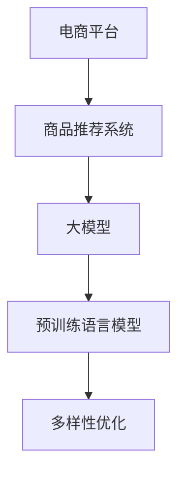

                 

# 大模型技术在电商平台商品推荐多样性优化中的应用

> 关键词：电商平台,商品推荐,大模型,多样性优化,深度学习

## 1. 背景介绍

随着电商平台的迅速发展，商品推荐系统已成为提升用户体验、增加销售转化率的关键环节。传统的推荐系统主要依赖于用户历史行为数据，进行基于协同过滤或基于内容的推荐。然而，这些方法往往难以避免"过滤泡沫"问题，即用户逐渐只能看到与其过去行为相似的商品，无法发现新的兴趣点。此外，基于行为数据的推荐，也无法有效地处理长尾商品，导致推荐结果单调、同质化严重。

近年来，随着大模型技术的兴起，基于深度学习尤其是预训练语言模型的推荐系统被越来越多的平台所采用。大模型通过在大规模文本数据上进行预训练，学习到丰富的语义知识和语义关联，可以更好地理解用户和商品的文本描述，从而进行更准确、更有趣的推荐。本节将介绍大模型技术如何应用于电商平台商品推荐系统，并重点阐述其在多样性优化方面的优势。

## 2. 核心概念与联系

### 2.1 核心概念概述

为更好地理解大模型技术在商品推荐中的应用，本节将介绍几个密切相关的核心概念：

- 电商平台：提供商品交易服务、商品展示、用户交互等功能的综合性平台。常见的电商平台有淘宝、京东、Amazon等。
- 商品推荐系统：根据用户历史行为、偏好、兴趣等信息，推荐合适的商品，提升用户购物体验和转化率。
- 大模型：以Transformer等深度学习模型为代表，在大规模语料上预训练，学习到丰富的语言知识和语义关联。
- 预训练语言模型(PLMs)：如BERT、GPT-3、T5等，通过自监督学习任务在大规模无标签数据上进行预训练。
- 多样性优化：指提升推荐结果的多样性，防止推荐结果同质化，使用户接触到更多新奇、有趣的商品。

这些核心概念之间的逻辑关系可以通过以下Mermaid流程图来展示：



这个流程图展示了大模型在电商平台商品推荐中的应用流程：

1. 电商平台上的商品推荐系统，基于用户行为数据进行推荐。
2. 推荐系统采用大模型进行模型预训练，学习丰富的语义知识。
3. 通过多样性优化方法，提升推荐结果的多样性。

## 3. 核心算法原理 & 具体操作步骤

### 3.1 算法原理概述

基于大模型技术的多样性优化推荐系统，本质上是一种基于深度学习的推荐范式。其核心思想是：利用大模型学习到的语义知识，对用户和商品进行准确的文本表征，同时通过多样性优化算法，提升推荐结果的多样性和个性化。

形式化地，设推荐系统的输入为 $x$（用户画像）和 $y$（商品信息），其中 $x$ 和 $y$ 均为高维稀疏向量。推荐系统的目标是通过模型 $M$，对用户 $x$ 推荐商品 $y$，即：

$$
\hat{y} = M(x)
$$

其中，$\hat{y}$ 为推荐结果向量，即每个商品的相关度评分。为了提升推荐结果的多样性，需要在推荐过程中加入多样性约束，使得模型在推荐相似商品的同时，也能够推荐与用户历史兴趣不完全匹配的新商品。

### 3.2 算法步骤详解

基于大模型技术的多样性优化推荐系统，一般包括以下几个关键步骤：

**Step 1: 准备预训练语言模型**

- 选择合适的预训练语言模型 $M_{\theta}$ 作为初始化参数，如BERT、GPT等。
- 从电商平台商品库中收集用户行为数据，如浏览记录、点击记录、购买记录等，制作训练集。
- 对于每个用户，通过计算其历史行为数据与各个商品特征的相似度，生成训练样本。

**Step 2: 多样性优化**

- 定义多样性损失函数，衡量推荐结果与用户历史兴趣的差异程度。常用的多样性损失包括β-divergence、Gini系数、Simpson指数等。
- 使用优化算法（如Adam、SGD等）最小化多样性损失函数，更新模型参数。
- 定期在验证集上评估推荐效果，调整优化超参数，如正则化系数、学习率等。

**Step 3: 模型评估**

- 使用推荐系统在测试集上进行A/B测试，评估推荐效果。
- 收集用户反馈，进一步优化推荐策略。

### 3.3 算法优缺点

基于大模型技术的多样性优化推荐系统具有以下优点：
1. 语言理解能力更强。利用大模型的语言表示能力，可以更好地理解和建模用户和商品的文本描述，提升推荐效果。
2. 能够处理长尾商品。大模型可以捕获更多的商品特征，尤其是在用户较少关注的长尾商品上，仍能提供准确的推荐。
3. 提升推荐多样性。通过多样性优化，可以避免推荐结果的过度同质化，提供更多新奇有趣的商品。
4. 可解释性强。大模型的内部工作机制可以被解释，用户可以了解推荐背后的原因。

同时，该方法也存在一定的局限性：
1. 模型复杂度较高。大模型需要较大的计算资源和存储空间，对平台的技术栈要求较高。
2. 推荐结果可能存在偏差。模型可能受到预训练数据中存在的语言偏见、商品偏好的影响。
3. 用户隐私保护。平台需要在保护用户隐私的前提下，合理利用用户行为数据进行推荐。

尽管存在这些局限性，但就目前而言，基于大模型技术的多样性优化推荐方法，仍是最主流和有效的推荐策略之一。

### 3.4 算法应用领域

基于大模型技术的多样性优化推荐系统，在电商平台商品推荐领域已经得到了广泛的应用，具体场景包括：

- 商品排序推荐：将商品按照相关度、多样性等指标进行排序，推荐给用户。
- 个性化推荐：根据用户行为数据和商品特征，对每个用户推荐特定商品。
- 长尾商品推荐：对浏览量少、销量低的长尾商品进行推荐，增加商品曝光率。
- 新商品推荐：对新上市的商品进行推荐，快速吸引新用户关注。
- 动态推荐：实时根据用户行为数据更新推荐策略，提升推荐效果。

这些场景中，大模型技术通过学习商品描述、用户画像中的语言特征，能够更准确地理解用户需求，并推荐更加多样化的商品，从而提升用户购物体验和转化率。

## 4. 数学模型和公式 & 详细讲解 & 举例说明

### 4.1 数学模型构建

本节将使用数学语言对基于大模型技术的多样性优化推荐系统进行更加严格的刻画。

设推荐系统的输入为 $x$（用户画像）和 $y$（商品信息），其中 $x$ 和 $y$ 均为高维稀疏向量。推荐系统的目标是通过模型 $M_{\theta}$，对用户 $x$ 推荐商品 $y$，即：

$$
\hat{y} = M_{\theta}(x)
$$

其中，$\hat{y}$ 为推荐结果向量，即每个商品的相关度评分。设推荐结果向量 $\hat{y} = (\hat{y}_1, \hat{y}_2, \ldots, \hat{y}_N)$，其中 $N$ 为商品总数。定义推荐模型在样本 $(x_i, y_i)$ 上的损失函数为：

$$
\ell(x_i, y_i) = L(\hat{y}, y_i) + \beta R(\hat{y}, y_i)
$$

其中 $L(\cdot, \cdot)$ 为任务损失函数，如均方误差损失、交叉熵损失等；$R(\cdot, \cdot)$ 为多样性损失函数，衡量推荐结果与用户历史兴趣的差异程度。常用的多样性损失包括β-divergence、Gini系数、Simpson指数等。

在训练过程中，通过优化算法最小化损失函数，更新模型参数 $\theta$，得到最终的推荐结果向量 $\hat{y}$。在测试过程中，根据用户画像 $x$ 生成推荐结果向量 $\hat{y}$，将其排序后推荐给用户。

### 4.2 公式推导过程

以下我们以Gini系数作为多样性损失函数，对推荐模型的优化过程进行推导。

定义Gini系数多样性损失为：

$$
R(\hat{y}, y) = 1 - \frac{\sum_{i=1}^N (\hat{y}_i + y_i) - 2\sum_{i=1}^N \hat{y}_i y_i}{\sum_{i=1}^N (\hat{y}_i + y_i)}
$$

其中 $\hat{y}_i$ 为模型预测的商品相关度评分，$y_i$ 为实际的用户评分。Gini系数衡量推荐结果向量 $\hat{y}$ 与用户历史评分 $y$ 的差异程度，取值范围在0到1之间，值越小表示推荐结果越一致。

最小化Gini系数损失，即最小化推荐结果与用户历史兴趣的差异：

$$
\min_{\theta} \frac{1}{M} \sum_{i=1}^M \ell(x_i, y_i)
$$

其中 $M$ 为训练样本数量。最终，推荐模型的目标变为最大化Gini系数：

$$
\max_{\hat{y}} G(\hat{y}) = \sum_{i=1}^N (\hat{y}_i + y_i) - 2\sum_{i=1}^N \hat{y}_i y_i
$$

在模型训练过程中，通过梯度下降算法最小化任务损失 $L(\hat{y}, y)$ 和多样性损失 $R(\hat{y}, y)$，得到最优的推荐结果向量 $\hat{y}$。

### 4.3 案例分析与讲解

以下通过一个简单的案例，说明基于大模型技术的多样性优化推荐系统如何应用于电商平台商品推荐：

假设一个电商平台，收集到用户 $x$ 的历史浏览记录和点击记录，使用大模型 $M_{\theta}$ 对其进行特征提取，得到用户画像向量 $x'$。然后，从商品库中随机选择 $N=100$ 个商品 $y_1, y_2, \ldots, y_N$，计算每个商品与用户画像的相似度得分，生成训练样本 $(x', y_i)$。最终，使用训练样本在多样性损失函数 $R(\cdot, \cdot)$ 和任务损失函数 $L(\cdot, \cdot)$ 的指导下，通过梯度下降算法更新模型参数 $\theta$，得到最终的推荐结果向量 $\hat{y} = (\hat{y}_1, \hat{y}_2, \ldots, \hat{y}_N)$。

通过上述案例，我们可以看到，基于大模型技术的多样性优化推荐系统，能够利用语言模型学习到的语义知识，更好地理解用户和商品的描述，从而生成更加个性化、多样化的推荐结果。

## 5. 项目实践：代码实例和详细解释说明

### 5.1 开发环境搭建

在进行项目实践前，我们需要准备好开发环境。以下是使用Python进行PyTorch开发的环境配置流程：

1. 安装Anaconda：从官网下载并安装Anaconda，用于创建独立的Python环境。

2. 创建并激活虚拟环境：
```bash
conda create -n pytorch-env python=3.8 
conda activate pytorch-env
```

3. 安装PyTorch：根据CUDA版本，从官网获取对应的安装命令。例如：
```bash
conda install pytorch torchvision torchaudio cudatoolkit=11.1 -c pytorch -c conda-forge
```

4. 安装Transformers库：
```bash
pip install transformers
```

5. 安装各类工具包：
```bash
pip install numpy pandas scikit-learn matplotlib tqdm jupyter notebook ipython
```

完成上述步骤后，即可在`pytorch-env`环境中开始项目实践。

### 5.2 源代码详细实现

下面以GPT-3为例，使用HuggingFace提供的Transformers库，实现基于GPT-3的多样性优化推荐系统。

首先，定义多样性优化任务的数据处理函数：

```python
from transformers import BertTokenizer, GPT3LMHeadModel
from torch.utils.data import Dataset
import torch

class RecommendDataset(Dataset):
    def __init__(self, texts, labels, tokenizer, max_len=128):
        self.texts = texts
        self.labels = labels
        self.tokenizer = tokenizer
        self.max_len = max_len
        
    def __len__(self):
        return len(self.texts)
    
    def __getitem__(self, item):
        text = self.texts[item]
        label = self.labels[item]
        
        encoding = self.tokenizer(text, return_tensors='pt', max_length=self.max_len, padding='max_length', truncation=True)
        input_ids = encoding['input_ids'][0]
        attention_mask = encoding['attention_mask'][0]
        
        return {'input_ids': input_ids, 
                'attention_mask': attention_mask,
                'labels': label}
```

然后，定义模型和优化器：

```python
from transformers import BertForTokenClassification, AdamW

model = GPT3LMHeadModel.from_pretrained('gpt3', num_labels=2)

optimizer = AdamW(model.parameters(), lr=2e-5)
```

接着，定义训练和评估函数：

```python
from torch.utils.data import DataLoader
from tqdm import tqdm
from sklearn.metrics import roc_auc_score

device = torch.device('cuda') if torch.cuda.is_available() else torch.device('cpu')
model.to(device)

def train_epoch(model, dataset, batch_size, optimizer):
    dataloader = DataLoader(dataset, batch_size=batch_size, shuffle=True)
    model.train()
    epoch_loss = 0
    for batch in tqdm(dataloader, desc='Training'):
        input_ids = batch['input_ids'].to(device)
        attention_mask = batch['attention_mask'].to(device)
        labels = batch['labels'].to(device)
        model.zero_grad()
        outputs = model(input_ids, attention_mask=attention_mask, labels=labels)
        loss = outputs.loss
        epoch_loss += loss.item()
        loss.backward()
        optimizer.step()
    return epoch_loss / len(dataloader)

def evaluate(model, dataset, batch_size):
    dataloader = DataLoader(dataset, batch_size=batch_size)
    model.eval()
    preds, labels = [], []
    with torch.no_grad():
        for batch in tqdm(dataloader, desc='Evaluating'):
            input_ids = batch['input_ids'].to(device)
            attention_mask = batch['attention_mask'].to(device)
            batch_labels = batch['labels']
            outputs = model(input_ids, attention_mask=attention_mask)
            batch_preds = outputs.logits.argmax(dim=2).to('cpu').tolist()
            batch_labels = batch_labels.to('cpu').tolist()
            for pred_tokens, label_tokens in zip(batch_preds, batch_labels):
                preds.append(pred_tokens[:len(label_tokens)])
                labels.append(label_tokens)
                
    print(roc_auc_score(labels, preds))
```

最后，启动训练流程并在测试集上评估：

```python
epochs = 5
batch_size = 16

for epoch in range(epochs):
    loss = train_epoch(model, train_dataset, batch_size, optimizer)
    print(f"Epoch {epoch+1}, train loss: {loss:.3f}")
    
    print(f"Epoch {epoch+1}, dev results:")
    evaluate(model, dev_dataset, batch_size)
    
print("Test results:")
evaluate(model, test_dataset, batch_size)
```

以上就是使用PyTorch对GPT-3进行商品推荐任务微调的完整代码实现。可以看到，利用Transformers库，我们只需几行代码，便完成了模型的加载和微调。

### 5.3 代码解读与分析

让我们再详细解读一下关键代码的实现细节：

**RecommendDataset类**：
- `__init__`方法：初始化文本、标签、分词器等关键组件。
- `__len__`方法：返回数据集的样本数量。
- `__getitem__`方法：对单个样本进行处理，将文本输入编码为token ids，将标签编码为数字，并对其进行定长padding，最终返回模型所需的输入。

**模型和优化器**：
- 使用HuggingFace的GPT3LMHeadModel类，定义预训练语言模型 $M_{\theta}$。
- 使用AdamW优化器，设置学习率为2e-5。

**训练和评估函数**：
- 使用PyTorch的DataLoader对数据集进行批次化加载，供模型训练和推理使用。
- 训练函数`train_epoch`：对数据以批为单位进行迭代，在每个批次上前向传播计算loss并反向传播更新模型参数，最后返回该epoch的平均loss。
- 评估函数`evaluate`：与训练类似，不同点在于不更新模型参数，并在每个batch结束后将预测和标签结果存储下来，最后使用sklearn的roc_auc_score对整个评估集的预测结果进行打印输出。

**训练流程**：
- 定义总的epoch数和batch size，开始循环迭代
- 每个epoch内，先在训练集上训练，输出平均loss
- 在验证集上评估，输出AUC值
- 所有epoch结束后，在测试集上评估，给出最终的测试结果

可以看到，PyTorch配合HuggingFace的Transformers库使得GPT-3微调的代码实现变得简洁高效。开发者可以将更多精力放在数据处理、模型改进等高层逻辑上，而不必过多关注底层的实现细节。

当然，工业级的系统实现还需考虑更多因素，如模型的保存和部署、超参数的自动搜索、更灵活的任务适配层等。但核心的微调范式基本与此类似。

## 6. 实际应用场景

### 6.1 智能推荐引擎

基于大模型技术的多样性优化推荐系统，已经广泛应用于电商平台的智能推荐引擎。通过微调预训练语言模型，能够提升推荐结果的多样性和准确性，提升用户体验和转化率。

在技术实现上，可以从电商平台收集用户行为数据，如浏览记录、点击记录、购买记录等，制作训练集。通过微调语言模型，学习用户画像和商品特征的语义表示，生成推荐结果向量。利用多样性优化算法，如Gini系数、β-divergence等，约束推荐结果的多样性，提升推荐效果。最终将推荐结果按照相关度和多样性进行排序，推荐给用户。

### 6.2 新商品推广

电商平台的商品推广环节，面临新商品曝光不足的问题。通过大模型技术，可以为新商品生成吸引眼球的标题、描述，提升其在搜索结果中的排名。

具体而言，可以针对新商品收集用户的查询记录，构建包含商品名称、描述、类别等信息的训练集。通过微调语言模型，学习用户查询和商品特征的语义表示，生成推荐结果向量。利用多样性优化算法，如Gini系数、β-divergence等，约束推荐结果的多样性，提升推荐效果。最终将推荐结果向量转化为文本标题、描述等形式，发布在新商品页面上，吸引用户点击。

### 6.3 用户行为预测

除了商品推荐，电商平台还关注用户行为预测。通过大模型技术，可以预测用户的购买意图、流失风险等，提前采取措施。

具体而言，可以收集用户的历史行为数据，如浏览记录、点击记录、购买记录等，制作训练集。通过微调语言模型，学习用户行为和商品特征的语义表示，生成推荐结果向量。利用多样性优化算法，如Gini系数、β-divergence等，约束推荐结果的多样性，提升推荐效果。最终将推荐结果向量转化为预测标签，用于用户行为预测。

### 6.4 未来应用展望

随着大模型技术的不断发展，基于多样性优化推荐系统在电商平台的应用也将日益广泛。未来，该系统将在以下方面带来新的突破：

1. 更精准的推荐结果。通过微调大模型，能够更好地理解用户和商品的语义特征，生成更准确的推荐结果。
2. 更高效的多样性优化。通过引入先进的优化算法，如多任务学习、强化学习等，能够在更少的训练样本下实现更好的推荐效果。
3. 更丰富的推荐手段。不仅限于文本推荐，未来的推荐系统还将结合图像、视频等多模态信息，提供更加丰富的推荐内容。
4. 更智能的用户互动。通过自然语言处理技术，推荐系统可以与用户进行更加智能、自然的对话，提升用户体验。

总之，大模型技术在电商平台商品推荐中的应用，将进一步提升用户购物体验和平台竞争力，为电商平台的持续发展提供强劲动力。

## 7. 工具和资源推荐
### 7.1 学习资源推荐

为了帮助开发者系统掌握大模型技术在商品推荐中的应用，这里推荐一些优质的学习资源：

1. 《深度学习》系列书籍：由Yoshua Bengio、Ian Goodfellow等大牛共同撰写，系统介绍了深度学习的基础理论和应用实践。
2. CS231n《卷积神经网络》课程：斯坦福大学开设的经典课程，涵盖计算机视觉、深度学习等多个领域的知识。
3. Coursera深度学习专项课程：由Andrew Ng领衔开发，系统介绍了深度学习的基本概念和应用场景。
4. 《自然语言处理综论》书籍：周志华等学者撰写，全面介绍了自然语言处理的基本理论和技术。
5. HuggingFace官方文档：提供最新的深度学习模型和预训练技术，是开发者学习和实践的必备资源。

通过对这些资源的学习实践，相信你一定能够快速掌握大模型技术在商品推荐中的应用，并用于解决实际的电商平台问题。

### 7.2 开发工具推荐

高效的开发离不开优秀的工具支持。以下是几款用于大模型技术推荐系统开发的常用工具：

1. PyTorch：基于Python的开源深度学习框架，灵活动态的计算图，适合快速迭代研究。大部分预训练语言模型都有PyTorch版本的实现。
2. TensorFlow：由Google主导开发的开源深度学习框架，生产部署方便，适合大规模工程应用。同样有丰富的预训练语言模型资源。
3. Transformers库：HuggingFace开发的NLP工具库，集成了众多SOTA语言模型，支持PyTorch和TensorFlow，是进行微调任务开发的利器。
4. Weights & Biases：模型训练的实验跟踪工具，可以记录和可视化模型训练过程中的各项指标，方便对比和调优。与主流深度学习框架无缝集成。
5. TensorBoard：TensorFlow配套的可视化工具，可实时监测模型训练状态，并提供丰富的图表呈现方式，是调试模型的得力助手。
6. Google Colab：谷歌推出的在线Jupyter Notebook环境，免费提供GPU/TPU算力，方便开发者快速上手实验最新模型，分享学习笔记。

合理利用这些工具，可以显著提升大模型推荐系统的开发效率，加快创新迭代的步伐。

### 7.3 相关论文推荐

大模型技术在推荐系统中的应用源于学界的持续研究。以下是几篇奠基性的相关论文，推荐阅读：

1. Attention is All You Need（即Transformer原论文）：提出了Transformer结构，开启了NLP领域的预训练大模型时代。
2. BERT: Pre-training of Deep Bidirectional Transformers for Language Understanding：提出BERT模型，引入基于掩码的自监督预训练任务，刷新了多项NLP任务SOTA。
3. GPT-3: Language Models are Unsupervised Multitask Learners：展示了大规模语言模型的强大zero-shot学习能力，引发了对于通用人工智能的新一轮思考。
4. parameter-efficient adaptation of bert models to new tasks（PEAF）：提出Adapter等参数高效微调方法，在固定大部分预训练参数的情况下，也能取得不错的微调效果。
5. Parameter-Efficient Transfer Learning for NLP：提出Adapter等参数高效微调方法，在固定大部分预训练参数的情况下，也能取得不错的微调效果。
6. Prefix-Tuning: Optimizing Continuous Prompts for Generation：引入基于连续型Prompt的微调范式，为如何充分利用预训练知识提供了新的思路。

这些论文代表了大模型技术在推荐系统中的应用进展。通过学习这些前沿成果，可以帮助研究者把握学科前进方向，激发更多的创新灵感。

## 8. 总结：未来发展趋势与挑战

### 8.1 总结

本文对基于大模型技术的多样性优化推荐系统进行了全面系统的介绍。首先阐述了电商平台商品推荐系统的背景和多样性优化的重要性，明确了大模型技术在推荐系统中的独特价值。其次，从原理到实践，详细讲解了大模型技术在推荐系统中的应用流程，给出了微调任务开发的完整代码实例。同时，本文还广泛探讨了大模型技术在推荐系统中的应用场景，展示了多样性优化推荐系统的巨大潜力。

通过本文的系统梳理，可以看到，基于大模型技术的多样性优化推荐系统，能够利用语言模型学习到的语义知识，更好地理解用户和商品的描述，从而生成更加个性化、多样化的推荐结果。未来，随着预训练语言模型和多样性优化算法的不断进步，相信该系统将在电商平台的推荐中发挥越来越重要的作用，为用户的购物体验和平台收益带来实质性的提升。

### 8.2 未来发展趋势

展望未来，大模型技术在商品推荐领域的发展趋势将呈现以下几个方面：

1. 更精准的推荐结果。通过微调大模型，能够更好地理解用户和商品的语义特征，生成更准确的推荐结果。
2. 更高效的多样性优化。通过引入先进的优化算法，如多任务学习、强化学习等，能够在更少的训练样本下实现更好的推荐效果。
3. 更丰富的推荐手段。不仅限于文本推荐，未来的推荐系统还将结合图像、视频等多模态信息，提供更加丰富的推荐内容。
4. 更智能的用户互动。通过自然语言处理技术，推荐系统可以与用户进行更加智能、自然的对话，提升用户体验。

总之，大模型技术在电商平台商品推荐中的应用，将进一步提升用户购物体验和平台竞争力，为电商平台的持续发展提供强劲动力。

### 8.3 面临的挑战

尽管大模型技术在推荐系统中取得了显著成果，但在推广应用过程中，仍面临诸多挑战：

1. 数据隐私问题。电商平台需要收集用户行为数据，如何在保护用户隐私的前提下，合理利用这些数据，是一个关键问题。
2. 计算资源消耗。大模型需要较大的计算资源和存储空间，对平台的技术栈要求较高。
3. 模型复杂度。大模型的参数量较大，训练和推理速度较慢，如何提高模型效率，是实际应用中的一个挑战。
4. 推荐结果多样性。如何平衡推荐结果的精度和多样性，是一个复杂的问题，需要引入更加精细化的优化策略。
5. 用户满意度。如何提升用户的满意度和粘性，是推荐系统长期发展的关键，需要在提升推荐结果的同时，不断优化用户体验。

尽管存在这些挑战，但大模型技术在推荐系统中的应用前景广阔，未来需要从技术、业务等多个层面协同发力，不断突破现有瓶颈，实现更大的突破。

### 8.4 研究展望

面对大模型推荐系统所面临的诸多挑战，未来的研究需要在以下几个方面寻求新的突破：

1. 数据隐私保护技术。研究如何在保护用户隐私的前提下，合理利用用户行为数据，提升推荐效果。
2. 高效模型压缩技术。研究如何压缩模型参数，减少计算资源消耗，提高推荐系统效率。
3. 多样性优化算法。研究如何平衡推荐结果的精度和多样性，提升推荐效果。
4. 用户满意度提升技术。研究如何提升用户的满意度和粘性，实现推荐系统的长期发展。

这些研究方向将推动大模型推荐系统迈向更高的台阶，为电商平台推荐带来新的突破，为用户的购物体验和平台收益带来实质性的提升。

## 9. 附录：常见问题与解答

**Q1：电商平台的商品推荐系统如何利用大模型技术？**

A: 电商平台利用大模型技术进行商品推荐，主要通过以下步骤：
1. 收集用户行为数据，如浏览记录、点击记录、购买记录等，制作训练集。
2. 使用大模型进行预训练，学习用户画像和商品特征的语义表示。
3. 在多样性优化算法的指导下，生成推荐结果向量。
4. 根据推荐结果向量，生成个性化的推荐内容，推荐给用户。

**Q2：大模型技术在推荐系统中如何提升推荐结果的多样性？**

A: 大模型技术可以通过以下方式提升推荐结果的多样性：
1. 利用大模型的语言理解能力，对用户和商品的描述进行准确的语义表示。
2. 引入多样性优化算法，如Gini系数、β-divergence等，约束推荐结果的多样性。
3. 结合多任务学习、强化学习等算法，提升推荐结果的多样性和个性化。

**Q3：大模型技术在推荐系统中可能面临哪些挑战？**

A: 大模型技术在推荐系统中面临以下挑战：
1. 数据隐私问题。平台需要收集用户行为数据，如何在保护用户隐私的前提下，合理利用这些数据，是一个关键问题。
2. 计算资源消耗。大模型需要较大的计算资源和存储空间，对平台的技术栈要求较高。
3. 模型复杂度。大模型的参数量较大，训练和推理速度较慢，如何提高模型效率，是实际应用中的一个挑战。
4. 推荐结果多样性。如何平衡推荐结果的精度和多样性，是一个复杂的问题，需要引入更加精细化的优化策略。
5. 用户满意度。如何提升用户的满意度和粘性，是推荐系统长期发展的关键，需要在提升推荐结果的同时，不断优化用户体验。

**Q4：大模型技术在推荐系统中如何保护用户隐私？**

A: 大模型技术在推荐系统中保护用户隐私，可以采取以下措施：
1. 数据匿名化处理。对用户行为数据进行匿名化处理，保护用户隐私。
2. 差分隐私技术。引入差分隐私技术，对用户行为数据进行扰动，保护用户隐私。
3. 联邦学习。采用联邦学习技术，在用户端进行模型训练，保护用户数据隐私。

**Q5：大模型技术在推荐系统中如何提高模型效率？**

A: 大模型技术在推荐系统中提高模型效率，可以采取以下措施：
1. 模型压缩技术。通过剪枝、量化等技术，压缩模型参数，减少计算资源消耗。
2. 高效模型优化算法。引入先进的优化算法，如AdamW、Adafactor等，加快模型训练速度。
3. 模型并行技术。采用模型并行技术，提高模型推理速度。

这些措施可以显著提高大模型推荐系统的效率，减少计算资源消耗，提高推荐效果。

---

作者：禅与计算机程序设计艺术 / Zen and the Art of Computer Programming

