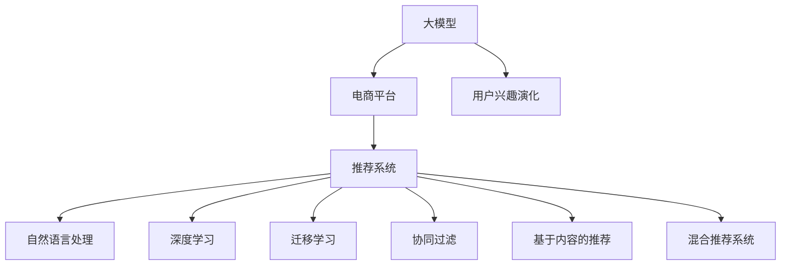

                 

# 大模型技术在电商平台用户兴趣演化中的应用

> 关键词：大模型,电商平台,用户兴趣演化,推荐系统,自然语言处理,NLP,深度学习,迁移学习

## 1. 背景介绍

### 1.1 问题由来
随着电子商务的快速发展，电商平台用户数量和商品种类迅速增长，如何精准捕捉用户兴趣，提升购物体验和转化率，成为了电商运营的核心难题。传统的推荐系统通过用户行为数据和历史购买记录，构建简单的评分矩阵进行推荐，但在用户兴趣快速变化、商品种类庞杂的情况下，难以精准匹配用户需求。

### 1.2 问题核心关键点
电商平台需要一套高效、灵活、可解释的推荐系统，基于用户行为数据和兴趣演化，实时动态推荐商品。针对这一需求，大模型技术在自然语言处理(NLP)、用户行为分析、个性化推荐等领域展现了强大的潜力。通过对用户行为数据和商品描述信息进行深度学习，可以更精准地捕捉用户兴趣，提供个性化的购物建议。

## 2. 核心概念与联系

### 2.1 核心概念概述

为更好地理解大模型技术在电商平台用户兴趣演化中的应用，本节将介绍几个密切相关的核心概念：

- 大模型(Large Model)：指使用深度学习技术训练的大规模神经网络模型，如BERT、GPT等，具备强大的语言理解和生成能力。
- 电商平台(e-Commerce Platform)：提供商品展示、购买、评价等服务的在线平台，如淘宝、京东等。
- 用户兴趣演化(User Interest Evolution)：指用户在购物过程中，随着时间推移，兴趣和需求的变化趋势。
- 推荐系统(Recommender System)：根据用户行为数据，为用户推荐商品或服务的系统。
- 自然语言处理(Natural Language Processing, NLP)：研究如何让计算机理解和处理人类语言的技术。
- 深度学习(Deep Learning)：使用多层次神经网络模型进行学习和推理的机器学习方法。
- 迁移学习(Transfer Learning)：将一个领域学到的知识迁移到另一个领域的过程，如将预训练模型应用于特定任务。
- 协同过滤(Collaborative Filtering)：通过分析用户和商品的相似度，为用户推荐相似商品的技术。
- 基于内容的推荐(Content-Based Recommendation)：根据商品属性和用户历史偏好进行推荐。
- 混合推荐系统(Hybrid Recommender System)：结合多种推荐算法，提高推荐效果的技术。

这些核心概念之间的逻辑关系可以通过以下Mermaid流程图来展示：



这个流程图展示了大模型技术在电商平台用户兴趣演化中的应用框架：

1. 大模型通过学习大规模语料，获得丰富的语言知识和背景信息。
2. 电商平台利用用户行为数据，结合大模型进行推荐。
3. 用户兴趣随时间演化，需要实时动态推荐。
4. 推荐系统可以基于深度学习进行个性化推荐，采用多种算法组合，提升效果。
5. 自然语言处理和大模型技术结合，可以处理用户输入的自然语言查询，提供精准的购物建议。

## 3. 核心算法原理 & 具体操作步骤
### 3.1 算法原理概述

在电商平台中，大模型技术主要用于自然语言处理和用户兴趣演化。具体而言，通过以下步骤：

1. **预训练大模型**：使用大规模无标签数据进行自监督预训练，学习语言的通用表示。
2. **微调模型**：利用平台上的用户行为数据和商品描述，对预训练模型进行有监督微调，学习特定任务。
3. **兴趣演化分析**：通过分析用户的历史行为数据，发现用户兴趣的变化趋势。
4. **实时推荐**：结合用户实时行为和兴趣变化，动态调整推荐策略，提供精准的个性化推荐。

### 3.2 算法步骤详解

下面详细介绍基于大模型技术的电商平台推荐系统的具体实现步骤：

**Step 1: 数据预处理**

- 数据收集：收集用户的历史行为数据、商品描述信息、用户评价数据等。
- 数据清洗：去除噪声数据，处理缺失值，确保数据质量。
- 数据转换：将文本数据转换为模型可接受的格式，如向量化表示。

**Step 2: 模型预训练**

- 选择预训练模型：选择适合的任务，如BERT、GPT等。
- 数据准备：准备预训练数据集，如大规模语料库。
- 预训练过程：使用预训练模型学习语言表示，提升模型的通用性。
- 模型保存：保存预训练模型参数，供后续微调使用。

**Step 3: 模型微调**

- 任务定义：根据电商平台特点，定义推荐系统的具体任务。
- 数据标注：标注用户行为数据，如浏览记录、点击行为、评价内容等。
- 微调训练：加载预训练模型，利用标注数据进行有监督微调。
- 模型评估：在验证集上评估微调模型效果，调整超参数。
- 模型部署：将微调后的模型部署到实际推荐系统中。

**Step 4: 用户兴趣演化分析**

- 用户行为建模：利用时间序列分析、关联规则挖掘等方法，建模用户行为模式。
- 兴趣演化识别：通过计算用户兴趣相似度，识别出用户的兴趣变化趋势。
- 兴趣变化预测：利用预测模型，预测用户未来的兴趣变化。

**Step 5: 实时推荐生成**

- 用户行为实时收集：实时收集用户的最新行为数据。
- 兴趣演化动态调整：根据用户最新行为和兴趣变化，动态调整推荐策略。
- 推荐生成：结合用户兴趣演化和商品描述信息，生成个性化推荐列表。

### 3.3 算法优缺点

基于大模型技术的电商平台推荐系统具有以下优点：

- **高精度推荐**：通过深度学习和自然语言处理技术，可以精准捕捉用户兴趣，提升推荐准确性。
- **自适应性**：用户兴趣随时间变化，大模型能够实时动态调整推荐策略，保持推荐的相关性和新鲜度。
- **可解释性**：大模型在推荐过程中，可以输出详细推理过程，提供可解释的推荐依据。
- **泛化性强**：通过预训练和微调，大模型能够很好地处理电商平台上丰富的商品和用户数据，提升推荐系统的泛化能力。

同时，该方法也存在以下缺点：

- **计算资源消耗大**：预训练和微调过程需要大量的计算资源和时间。
- **模型复杂度高**：大模型结构复杂，推理过程繁琐，需要较高的硬件支持。
- **数据隐私问题**：电商平台需要收集大量用户数据，涉及隐私保护和数据安全。
- **冷启动问题**：新用户没有历史行为数据，大模型难以准确捕捉其兴趣。

尽管存在这些局限性，但大模型技术在电商平台推荐系统中的应用，仍然具有巨大的优势和潜力，值得深入探索和优化。

### 3.4 算法应用领域

基于大模型技术的电商平台推荐系统在以下领域具有广泛的应用前景：

- **商品推荐**：根据用户浏览和购买历史，动态推荐商品。
- **个性化促销**：通过分析用户兴趣变化，设计个性化的优惠券和促销活动。
- **内容推荐**：推荐相关商品的同时，推送匹配度高的商品描述和评价。
- **搜索推荐**：用户输入自然语言查询，提供精准的搜索结果和相关商品。
- **广告推荐**：推荐与用户兴趣相关的广告，提升广告效果和转化率。
- **市场分析**：分析用户行为数据，洞察市场需求和趋势，辅助决策。

随着电商平台的不断发展和用户需求的多样化，基于大模型技术的推荐系统将发挥越来越重要的作用，成为电商平台的核心竞争力。

## 4. 数学模型和公式 & 详细讲解 & 举例说明

### 4.1 数学模型构建

基于大模型技术的电商平台推荐系统，可以抽象为以下几个关键模块：

1. **用户行为建模**：利用时间序列模型、协同过滤等方法，建模用户行为模式。
2. **兴趣演化预测**：利用深度学习模型，预测用户兴趣变化。
3. **推荐生成**：结合用户兴趣演化和商品描述，生成个性化推荐列表。

以商品推荐为例，假设用户行为数据为 $D=\{(x_i,y_i)\}_{i=1}^N$，其中 $x_i$ 为用户的浏览记录，$y_i$ 为用户的购买行为。定义用户兴趣演化矩阵为 $I \in \mathbb{R}^{N \times T}$，其中 $T$ 为时间步长，$I_{ij}=1$ 表示在第 $i$ 个用户，第 $j$ 个时间步内，用户对商品 $j$ 的兴趣为 $1$，否则为 $0$。

定义推荐模型为 $f$，推荐结果为 $R \in \mathbb{R}^{N \times C}$，其中 $C$ 为商品种类数，$R_{ij}$ 表示在第 $i$ 个用户，对第 $j$ 个商品进行推荐的概率。

### 4.2 公式推导过程

以深度学习模型为例，用户兴趣演化矩阵 $I$ 和推荐结果 $R$ 的预测公式如下：

$$
I_{ij} = f(x_i; \theta)
$$

$$
R_{ij} = g(I_{ij}; \omega)
$$

其中 $\theta$ 为深度学习模型的参数，$g$ 为推荐生成模型，$\omega$ 为推荐生成模型的参数。

通过以上公式，可以预测用户在不同时间步的兴趣变化，并生成相应的推荐结果。

### 4.3 案例分析与讲解

以电商平台上的服装推荐为例，假设用户 $i$ 浏览了 $j$ 件服装，并购买了其中一件。根据用户行为数据，可以构建用户兴趣演化矩阵 $I_{ij}$，其中 $I_{i1}=1$ 表示用户对第一件服装的兴趣为 $1$，否则为 $0$。

假设利用深度学习模型对 $I_{ij}$ 进行预测，得到 $I_{i2}=0.8$，表示用户对第二件服装的兴趣为 $0.8$。

然后，根据用户兴趣演化矩阵 $I$ 和商品描述 $d_j$，使用大模型进行推荐生成：

$$
R_{ij} = g(I_{ij}; \omega) = \text{softmax}(W_I^{(j)} I_{ij} + W_D^{(j)} d_j + b)
$$

其中 $W_I^{(j)}$ 和 $W_D^{(j)}$ 为模型的权重矩阵，$b$ 为偏置项。

通过计算，得到推荐结果 $R_{i2} = (0.5, 0.3, 0.2)$，表示对三件服装的推荐概率分别为 $0.5$、$0.3$、$0.2$。

## 5. 项目实践：代码实例和详细解释说明
### 5.1 开发环境搭建

在进行大模型推荐系统开发前，需要先准备好开发环境。以下是使用Python进行TensorFlow开发的环境配置流程：

1. 安装Anaconda：从官网下载并安装Anaconda，用于创建独立的Python环境。

2. 创建并激活虚拟环境：
```bash
conda create -n tensorflow-env python=3.8 
conda activate tensorflow-env
```

3. 安装TensorFlow：
```bash
pip install tensorflow
```

4. 安装各类工具包：
```bash
pip install numpy pandas scikit-learn matplotlib tqdm jupyter notebook ipython
```

5. 安装TensorBoard：
```bash
pip install tensorboard
```

完成上述步骤后，即可在`tensorflow-env`环境中开始推荐系统开发。

### 5.2 源代码详细实现

下面我们以电商服装推荐为例，给出使用TensorFlow实现深度学习推荐系统的代码实现。

首先，定义用户行为数据：

```python
import numpy as np

# 构建用户行为数据
N = 1000  # 用户数
T = 10    # 时间步长
M = 100   # 商品种类数

X = np.random.randint(0, M, size=(N, T))  # 随机生成用户浏览记录
Y = np.random.randint(0, M, size=(N, T))  # 随机生成用户购买记录

I = np.zeros((N, T))  # 初始化用户兴趣演化矩阵

# 模拟用户行为数据
for i in range(N):
    for t in range(T):
        if t == 0:
            I[i][t] = 1
        if X[i][t] == Y[i][t]:
            I[i][t] = 1

# 输出用户兴趣演化矩阵
print(I)
```

然后，定义深度学习模型：

```python
import tensorflow as tf
from tensorflow.keras.layers import Input, Embedding, Dense, Flatten
from tensorflow.keras.models import Model
from tensorflow.keras.optimizers import Adam

# 定义输入层
user_input = Input(shape=(N, T))
item_input = Input(shape=(T,))

# 定义嵌入层
user_embedding = Embedding(M, 128, input_length=T)(user_input)
item_embedding = Embedding(M, 128, input_length=T)(item_input)

# 定义全连接层
item_flatten = Flatten()(item_embedding)
user_flatten = Flatten()(user_embedding)
item_vector = Dense(64)(item_flatten)
user_vector = Dense(64)(user_flatten)
item_user_vector = tf.concat([item_vector, user_vector], axis=1)

# 定义推荐生成层
recommendation = Dense(M)(item_user_vector)

# 定义模型
model = Model([user_input, item_input], recommendation)

# 定义优化器
optimizer = Adam(learning_rate=0.001)
```

接着，训练模型并生成推荐结果：

```python
# 定义损失函数和评价指标
loss_function = tf.keras.losses.MeanSquaredError()
metrics = [tf.keras.metrics.MeanAbsoluteError()]

# 定义训练过程
model.compile(optimizer=optimizer, loss=loss_function, metrics=metrics)

# 训练模型
model.fit([X, Y], I, epochs=100, batch_size=32)

# 生成推荐结果
X_test = np.random.randint(0, M, size=(10, T))  # 随机生成测试用户浏览记录
Y_test = np.random.randint(0, M, size=(10, T))  # 随机生成测试用户购买记录

recommendations = model.predict([X_test, Y_test])

# 输出推荐结果
print(recommendations)
```

以上是使用TensorFlow实现深度学习推荐系统的完整代码实现。可以看到，TensorFlow提供了丰富的工具和组件，使得深度学习模型开发变得更加简单高效。

### 5.3 代码解读与分析

让我们再详细解读一下关键代码的实现细节：

**用户行为数据定义**：
- 首先，定义了用户数 $N$、时间步长 $T$ 和商品种类数 $M$，并使用Numpy生成随机用户浏览记录和购买记录。
- 然后，初始化用户兴趣演化矩阵 $I$，将初始时用户的兴趣设定为 $1$。

**深度学习模型定义**：
- 定义了用户输入层 `user_input` 和商品输入层 `item_input`，分别表示用户和商品的浏览记录。
- 使用Embedding层将输入转化为向量表示，再将向量连接，通过全连接层生成推荐结果。
- 定义了模型 `model` 和优化器 `optimizer`。

**模型训练与推荐生成**：
- 定义了损失函数和评价指标，使用`compile`方法编译模型。
- 调用`fit`方法训练模型，设定训练轮数和批次大小。
- 使用`predict`方法生成推荐结果。

以上代码实现了深度学习推荐系统的基础功能，但实际应用中，还需对模型进行优化和改进，以提升推荐效果和模型性能。

## 6. 实际应用场景
### 6.1 智能客服系统

在智能客服系统中，大模型技术可以用于自然语言理解和问题解答。客服机器人通过收集用户查询数据，学习语言模型，可以实时响应客户问题，提供精准的解决方案。

具体而言，可以通过微调语言模型，使机器人能够理解自然语言输入，识别出用户的具体需求，自动调用内部知识库，提供个性化的回答。对于复杂的查询，机器人还可以将用户问题进一步分解，分步骤解答。

### 6.2 金融交易系统

在金融交易系统中，大模型技术可以用于风险评估和交易预测。金融市场数据复杂多变，交易系统需要实时分析市场动态，预测价格趋势，进行风险控制。

具体而言，可以通过微调深度学习模型，分析市场数据，学习市场变化规律，预测价格走势。同时，利用自然语言处理技术，分析新闻报道、市场评论等文本信息，提取情感倾向，辅助交易决策。

### 6.3 内容推荐系统

在内容推荐系统中，大模型技术可以用于推荐个性化内容。用户在浏览内容时，系统会根据其行为数据，学习用户兴趣，推荐相关文章、视频、音频等。

具体而言，可以通过微调推荐模型，分析用户历史行为数据，预测用户兴趣演化，生成个性化推荐内容。同时，利用自然语言处理技术，分析内容文本，提取关键词，推荐相似度高的内容。

### 6.4 未来应用展望

随着大模型技术的不断发展和成熟，其在电商平台用户兴趣演化中的应用前景将更加广阔。未来，大模型推荐系统将能够更加精准地捕捉用户兴趣，提供更个性化、更实时、更智能的购物建议，提升用户满意度和平台竞争力。

## 7. 工具和资源推荐
### 7.1 学习资源推荐

为了帮助开发者系统掌握大模型技术在电商平台推荐系统中的应用，这里推荐一些优质的学习资源：

1. TensorFlow官方文档：提供了深度学习框架的详细使用手册，适合初学者和进阶开发者。
2. Coursera《深度学习专项课程》：斯坦福大学开设的深度学习系列课程，包含深度学习理论、实践和案例分析。
3. 《深度学习入门：基于Python的理论与实现》书籍：介绍深度学习基础知识和常用算法，适合入门读者。
4. 《深度学习实战：基于TensorFlow和Keras的案例》书籍：通过实际案例，讲解深度学习模型的开发和应用。
5. HuggingFace官方文档：提供了预训练语言模型的使用指南和代码示例，适合实践开发者。

通过对这些资源的学习实践，相信你一定能够快速掌握大模型技术在电商平台推荐系统中的应用，并用于解决实际的推荐问题。

### 7.2 开发工具推荐

高效的开发离不开优秀的工具支持。以下是几款用于电商平台推荐系统开发的常用工具：

1. TensorFlow：由Google主导开发的深度学习框架，支持GPU/TPU加速，适合大规模工程应用。
2. PyTorch：基于Python的开源深度学习框架，灵活动态的计算图，适合快速迭代研究。
3. Jupyter Notebook：交互式编程环境，支持代码展示和文档化，适合数据分析和模型开发。
4. TensorBoard：TensorFlow配套的可视化工具，可实时监测模型训练状态，提供丰富的图表呈现方式。
5. Weights & Biases：模型训练的实验跟踪工具，可以记录和可视化模型训练过程中的各项指标。

合理利用这些工具，可以显著提升电商平台推荐系统的开发效率，加快创新迭代的步伐。

### 7.3 相关论文推荐

大模型技术在电商平台推荐系统中的应用源于学界的持续研究。以下是几篇奠基性的相关论文，推荐阅读：

1. Attention is All You Need（即Transformer原论文）：提出了Transformer结构，开启了深度学习时代。
2. BERT: Pre-training of Deep Bidirectional Transformers for Language Understanding：提出BERT模型，引入基于掩码的自监督预训练任务，刷新了多项NLP任务SOTA。
3. Deep Reinforcement Learning for Personalized Product Recommendation：提出深度强化学习模型，优化推荐效果。
4. A Neural Attention Model for Dynamic Product Recommendations：提出注意力机制，提升推荐系统的动态性和多样性。
5. A Simple, General Approach to Deep Affective Image and Text Understanding：利用深度学习模型，学习情感表达，应用于推荐系统。

这些论文代表了大模型技术在推荐系统中的应用方向，提供了丰富的理论基础和技术思路。通过学习这些前沿成果，可以帮助研究者把握学科前进方向，激发更多的创新灵感。

## 8. 总结：未来发展趋势与挑战
### 8.1 研究成果总结

本文对大模型技术在电商平台用户兴趣演化中的应用进行了全面系统的介绍。首先阐述了电商推荐系统面临的挑战和需求，明确了大模型技术的潜在优势和应用价值。其次，从原理到实践，详细讲解了大模型推荐系统的核心算法和操作步骤，给出了实际开发中的代码实现。同时，本文还广泛探讨了推荐系统在智能客服、金融交易、内容推荐等多个领域的应用前景，展示了大模型技术的广阔前景。

### 8.2 未来发展趋势

展望未来，大模型技术在电商平台用户兴趣演化中的应用将呈现以下几个发展趋势：

1. **多模态融合**：推荐系统将结合用户行为数据、商品描述信息、用户评价等多模态数据，提供更全面、更精准的推荐结果。
2. **个性化推荐**：利用深度学习和大模型技术，实时动态生成个性化推荐，提升用户体验和满意度。
3. **推荐解释性**：增强推荐系统的可解释性，使推荐结果具备可信度和透明性，满足用户需求和信任。
4. **用户兴趣演化预测**：利用预测模型，准确预测用户兴趣变化，提升推荐系统的时效性和适应性。
5. **数据隐私保护**：加强用户数据保护，确保数据安全，提升用户对推荐系统的信任度。
6. **推荐模型优化**：优化推荐模型，降低计算资源消耗，提高推理速度和效率。

以上趋势凸显了大模型技术在电商平台推荐系统中的应用潜力，这些方向的探索发展，必将进一步提升推荐系统的性能和应用范围，为电商平台带来更多的商业价值。

### 8.3 面临的挑战

尽管大模型技术在电商平台推荐系统中展现了巨大的优势和潜力，但在实现大规模应用时，仍面临以下挑战：

1. **计算资源消耗大**：大模型推荐系统需要大量的计算资源和时间，对硬件和网络环境有较高要求。
2. **模型复杂度高**：推荐系统需要处理复杂的用户行为数据和商品信息，模型结构复杂，推理过程繁琐。
3. **数据隐私问题**：电商平台需要收集大量用户数据，涉及隐私保护和数据安全。
4. **冷启动问题**：新用户没有历史行为数据，推荐系统难以准确捕捉其兴趣。
5. **模型泛化性不足**：推荐系统往往依赖特定数据集，泛化能力有限，难以应对数据分布变化。

尽管存在这些挑战，但通过不断的技术创新和优化，大模型推荐系统必将在电商平台推荐领域大放异彩，成为电商平台的核心竞争力。

### 8.4 研究展望

面对大模型推荐系统面临的挑战，未来的研究需要在以下几个方面寻求新的突破：

1. **轻量级模型优化**：开发更加轻量级、高效的推荐模型，减少计算资源消耗，提升推理速度。
2. **推荐系统解释性**：增强推荐系统的可解释性，使推荐结果具备可信度和透明性，满足用户需求和信任。
3. **多模态数据融合**：利用多模态数据进行推荐，提升推荐系统的全面性和精准性。
4. **用户兴趣演化预测**：利用预测模型，准确预测用户兴趣变化，提升推荐系统的时效性和适应性。
5. **数据隐私保护**：加强用户数据保护，确保数据安全，提升用户对推荐系统的信任度。
6. **推荐模型优化**：优化推荐模型，降低计算资源消耗，提高推理速度和效率。

这些研究方向的探索，必将引领大模型推荐系统走向更加智能、更加可靠、更加可控的未来，为电商平台带来更大的商业价值。总之，电商平台推荐系统需要从数据、算法、工程等多个维度协同发力，才能真正实现人工智能技术在电商平台的应用。

## 9. 附录：常见问题与解答
**Q1：电商平台推荐系统需要收集哪些数据？**

A: 电商平台推荐系统需要收集用户的行为数据、商品描述信息、用户评价数据等。这些数据可以用于建模用户行为模式、预测用户兴趣变化、生成个性化推荐列表等。

**Q2：电商平台推荐系统如何提高推荐效果？**

A: 电商平台推荐系统可以通过以下方式提高推荐效果：
1. 利用深度学习和大模型技术，实时动态生成个性化推荐。
2. 结合用户行为数据和商品描述信息，综合考虑多方面因素，生成精准推荐。
3. 利用预测模型，准确预测用户兴趣变化，提升推荐系统的时效性和适应性。

**Q3：电商平台推荐系统如何保护用户隐私？**

A: 电商平台推荐系统可以采取以下措施保护用户隐私：
1. 对用户数据进行匿名化处理，避免直接暴露用户身份。
2. 利用加密技术，保护数据传输过程中的安全性。
3. 遵循隐私保护法规，确保用户数据的合法使用。

**Q4：电商平台推荐系统如何处理冷启动问题？**

A: 电商平台推荐系统可以采取以下措施处理冷启动问题：
1. 利用用户浏览记录中的商品信息，初始化推荐列表。
2. 通过分析用户兴趣演化，逐步调整推荐策略，适应用户兴趣变化。
3. 结合商品描述信息，提供基础推荐，提升用户体验。

通过以上措施，电商平台推荐系统可以在冷启动阶段，提供基础推荐，逐步提升推荐效果。

---

作者：禅与计算机程序设计艺术 / Zen and the Art of Computer Programming

