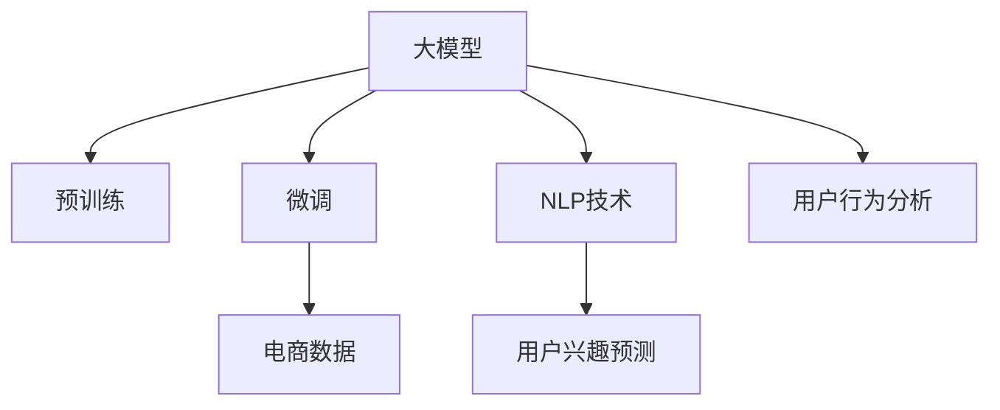

                 

# 大模型技术在电商平台用户兴趣短期预测中的应用

> 关键词：电商平台,用户兴趣预测,大模型,深度学习,自然语言处理,NLP,用户行为分析

## 1. 背景介绍

### 1.1 问题由来
在电商领域，了解用户兴趣和需求对于提高销售转化率和提升用户体验至关重要。传统的用户兴趣分析方法依赖于问卷调查、点击流数据分析等，费时费力且效果有限。而利用深度学习和自然语言处理技术，可以更加自动化、精准地从用户行为数据中挖掘出其潜在兴趣，形成短期预测模型。

近年来，随着深度学习和大模型的快速发展，基于预训练语言模型的用户兴趣预测方法应运而生，并取得了显著效果。这种大模型方法通常需要在海量数据上进行预训练，然后通过微调学习特定电商平台的标签数据，最终实现对用户短期兴趣的精准预测。

### 1.2 问题核心关键点
大模型技术在电商平台用户兴趣预测的应用核心关键点包括：
1. **预训练和微调**：通过在大规模文本数据上预训练大模型，然后在电商数据上微调，从而学习用户短期兴趣。
2. **用户行为分析**：从电商平台的用户点击、浏览、搜索等行为数据中提取特征，作为模型输入。
3. **短期兴趣预测**：基于历史数据和用户行为特征，预测用户在短时间内对特定商品或类别的兴趣。
4. **模型部署与优化**：将模型集成到电商平台的推荐系统中，通过A/B测试优化模型参数和预测效果。

这些关键点构成了大模型技术在电商平台用户兴趣预测中的应用框架，使其能够在大规模数据上实现高效、准确的预测。

## 2. 核心概念与联系

### 2.1 核心概念概述

为更好地理解大模型在电商平台用户兴趣预测中的应用，本节将介绍几个密切相关的核心概念：

- **大模型（Large Model）**：指通过在大规模数据上训练得到的深度学习模型，通常包括BERT、GPT、RoBERTa等。这些模型在处理大规模文本数据时具有出色的性能。
- **预训练（Pre-training）**：指在大规模无标签数据上对模型进行训练，使其学习到通用的语言表示和特征抽取能力。
- **微调（Fine-tuning）**：指在预训练模型基础上，通过在小规模标签数据上进行有监督学习，进一步提升模型在特定任务上的表现。
- **自然语言处理（NLP）**：指利用计算机科学和人工智能技术对自然语言进行理解和生成。
- **用户行为分析（User Behavior Analysis）**：通过分析用户在线行为，挖掘其兴趣和需求，为个性化推荐和营销策略提供依据。
- **短期兴趣预测（Short-term Interest Prediction）**：指通过用户行为数据，预测用户在未来短时间内的兴趣趋势。

这些核心概念之间的逻辑关系可以通过以下Mermaid流程图来展示：



这个流程图展示了大模型在电商平台用户兴趣预测中的应用逻辑：

1. 大模型通过预训练获得基础能力。
2. 在电商数据上微调，学习特定任务。
3. NLP技术帮助提取特征。
4. 用户行为分析挖掘用户兴趣。
5. 短期兴趣预测输出预测结果。

## 3. 核心算法原理 & 具体操作步骤
### 3.1 算法原理概述

基于大模型的电商平台用户兴趣预测方法，本质上是一种有监督的细粒度迁移学习过程。其核心思想是：将预训练的大模型视为强大的"特征提取器"，通过微调学习电商平台的特定标签数据，从而能够更准确地预测用户短期兴趣。

形式化地，假设预训练模型为 $M_{\theta}$，其中 $\theta$ 为预训练得到的模型参数。给定电商平台上的标注数据集 $D=\{(x_i, y_i)\}_{i=1}^N$，其中 $x_i$ 表示用户行为特征，$y_i$ 表示用户对 $x_i$ 的兴趣标签。微调的目标是找到新的模型参数 $\hat{\theta}$，使得：

$$
\hat{\theta}=\mathop{\arg\min}_{\theta} \mathcal{L}(M_{\theta},D)
$$

其中 $\mathcal{L}$ 为针对电商平台特定任务的损失函数，用于衡量模型预测输出与真实标签之间的差异。常见的损失函数包括交叉熵损失、均方误差损失等。

通过梯度下降等优化算法，微调过程不断更新模型参数 $\theta$，最小化损失函数 $\mathcal{L}$，使得模型输出逼近真实标签。由于 $\theta$ 已经通过预训练获得了较好的初始化，因此即便在电商数据的规模相对较小的情况下，也能较快收敛到理想的模型参数 $\hat{\theta}$。

### 3.2 算法步骤详解

基于大模型的电商平台用户兴趣预测一般包括以下几个关键步骤：

**Step 1: 准备预训练模型和数据集**
- 选择合适的预训练语言模型 $M_{\theta}$ 作为初始化参数，如 BERT、GPT、RoBERTa 等。
- 准备电商平台上的标注数据集 $D$，划分为训练集、验证集和测试集。

**Step 2: 设计任务适配层**
- 根据电商平台的任务特点，在预训练模型顶层设计合适的输出层和损失函数。
- 对于分类任务，通常在顶层添加线性分类器和交叉熵损失函数。
- 对于生成任务，通常使用语言模型的解码器输出概率分布，并以负对数似然为损失函数。

**Step 3: 设置微调超参数**
- 选择合适的优化算法及其参数，如 AdamW、SGD 等，设置学习率、批大小、迭代轮数等。
- 设置正则化技术及强度，包括权重衰减、Dropout、Early Stopping 等。
- 确定冻结预训练参数的策略，如仅微调顶层，或全部参数都参与微调。

**Step 4: 执行梯度训练**
- 将训练集数据分批次输入模型，前向传播计算损失函数。
- 反向传播计算参数梯度，根据设定的优化算法和学习率更新模型参数。
- 周期性在验证集上评估模型性能，根据性能指标决定是否触发 Early Stopping。
- 重复上述步骤直到满足预设的迭代轮数或 Early Stopping 条件。

**Step 5: 测试和部署**
- 在测试集上评估微调后模型 $M_{\hat{\theta}}$ 的性能，对比微调前后的精度提升。
- 使用微调后的模型对新用户进行兴趣预测，集成到电商平台推荐系统中。
- 持续收集新的用户行为数据，定期重新微调模型，以适应数据分布的变化。

以上是基于大模型的电商平台用户兴趣预测的一般流程。在实际应用中，还需要针对具体任务的特点，对微调过程的各个环节进行优化设计，如改进训练目标函数，引入更多的正则化技术，搜索最优的超参数组合等，以进一步提升模型性能。

### 3.3 算法优缺点

基于大模型的电商平台用户兴趣预测方法具有以下优点：
1. **高效性**：通过在大规模预训练模型上进行微调，能够快速提升模型性能，避免从头训练的高成本和高时间消耗。
2. **高准确性**：大模型通常具有强大的语言理解能力和特征提取能力，能够从电商平台上的文本数据中提取出丰富的用户兴趣信息。
3. **泛化性强**：经过大规模预训练的模型能够适应多种电商平台的数据，具有一定的泛化能力。

同时，该方法也存在一定的局限性：
1. **数据需求高**：虽然微调能够利用现有数据提升模型效果，但初始预训练数据集的规模和质量对最终效果影响较大。
2. **模型复杂度**：大模型的参数量和计算复杂度较高，对计算资源和训练时间有较高要求。
3. **解释性不足**：大模型通常被视为"黑盒"模型，难以解释其内部决策过程，对模型调试和优化带来挑战。
4. **对抗攻击风险**：大模型可能存在对抗攻击风险，导致模型输出不稳定或错误。

尽管存在这些局限性，但就目前而言，基于大模型的用户兴趣预测方法仍然是大规模电商平台数据处理和分析的重要工具。未来相关研究的重点在于如何进一步降低对初始预训练数据集的依赖，提高模型的解释性和对抗鲁棒性，同时兼顾高效性和准确性。

### 3.4 算法应用领域

基于大模型的电商平台用户兴趣预测方法，已经在多个领域得到了广泛应用，例如：

- **个性化推荐**：通过预测用户对商品或类别的短期兴趣，为用户生成个性化推荐列表。
- **广告投放优化**：预测用户对广告的响应概率，优化广告投放策略，提高广告转化率。
- **库存管理**：预测热门商品的需求趋势，优化库存管理和物流配送。
- **市场分析**：分析用户兴趣变化趋势，提供市场趋势和用户需求分析报告。

除了上述这些经典应用外，大模型用户兴趣预测方法还被创新性地应用于客户细分、商品价格调整、内容推荐优化等方面，为电商平台带来了全新的应用场景和商业价值。

## 4. 数学模型和公式 & 详细讲解  
### 4.1 数学模型构建

本节将使用数学语言对基于大模型的电商平台用户兴趣预测过程进行更加严格的刻画。

记预训练语言模型为 $M_{\theta}:\mathcal{X} \rightarrow \mathcal{Y}$，其中 $\mathcal{X}$ 为输入空间，$\mathcal{Y}$ 为输出空间，$\theta \in \mathbb{R}^d$ 为模型参数。假设电商平台上的标注数据集为 $D=\{(x_i,y_i)\}_{i=1}^N, x_i \in \mathcal{X}, y_i \in \mathcal{Y}$，其中 $x_i$ 表示用户行为特征，$y_i$ 表示用户对 $x_i$ 的兴趣标签。

定义模型 $M_{\theta}$ 在输入 $x_i$ 上的输出为 $\hat{y}=M_{\theta}(x_i)$。假设模型的损失函数为 $\ell$，则在数据集 $D$ 上的经验风险为：

$$
\mathcal{L}(\theta) = \frac{1}{N}\sum_{i=1}^N \ell(\hat{y},y_i)
$$

常见的损失函数包括交叉熵损失、均方误差损失等。在实际应用中，我们通常使用基于梯度的优化算法（如SGD、Adam等）来近似求解上述最优化问题。设 $\eta$ 为学习率，$\lambda$ 为正则化系数，则参数的更新公式为：

$$
\theta \leftarrow \theta - \eta \nabla_{\theta}\mathcal{L}(\theta) - \eta\lambda\theta
$$

其中 $\nabla_{\theta}\mathcal{L}(\theta)$ 为损失函数对参数 $\theta$ 的梯度，可通过反向传播算法高效计算。

### 4.2 公式推导过程

以下我们以二分类任务为例，推导交叉熵损失函数及其梯度的计算公式。

假设模型 $M_{\theta}$ 在输入 $x_i$ 上的输出为 $\hat{y}=M_{\theta}(x_i)$，表示用户对 $x_i$ 的兴趣概率。真实标签 $y \in \{0,1\}$。则二分类交叉熵损失函数定义为：

$$
\ell(\hat{y},y) = -[y\log \hat{y} + (1-y)\log (1-\hat{y})]
$$

将其代入经验风险公式，得：

$$
\mathcal{L}(\theta) = -\frac{1}{N}\sum_{i=1}^N [y_i\log M_{\theta}(x_i)+(1-y_i)\log(1-M_{\theta}(x_i))]
$$

根据链式法则，损失函数对参数 $\theta_k$ 的梯度为：

$$
\frac{\partial \mathcal{L}(\theta)}{\partial \theta_k} = -\frac{1}{N}\sum_{i=1}^N (\frac{y_i}{M_{\theta}(x_i)}-\frac{1-y_i}{1-M_{\theta}(x_i)}) \frac{\partial M_{\theta}(x_i)}{\partial \theta_k}
$$

其中 $\frac{\partial M_{\theta}(x_i)}{\partial \theta_k}$ 可进一步递归展开，利用自动微分技术完成计算。

在得到损失函数的梯度后，即可带入参数更新公式，完成模型的迭代优化。重复上述过程直至收敛，最终得到适应电商平台任务的最优模型参数 $\theta^*$。

## 5. 项目实践：代码实例和详细解释说明
### 5.1 开发环境搭建

在进行用户兴趣预测实践前，我们需要准备好开发环境。以下是使用Python进行PyTorch开发的环境配置流程：

1. 安装Anaconda：从官网下载并安装Anaconda，用于创建独立的Python环境。

2. 创建并激活虚拟环境：
```bash
conda create -n pytorch-env python=3.8 
conda activate pytorch-env
```

3. 安装PyTorch：根据CUDA版本，从官网获取对应的安装命令。例如：
```bash
conda install pytorch torchvision torchaudio cudatoolkit=11.1 -c pytorch -c conda-forge
```

4. 安装Transformers库：
```bash
pip install transformers
```

5. 安装各类工具包：
```bash
pip install numpy pandas scikit-learn matplotlib tqdm jupyter notebook ipython
```

完成上述步骤后，即可在`pytorch-env`环境中开始用户兴趣预测实践。

### 5.2 源代码详细实现

这里我们以电商平台上的个性化推荐任务为例，给出使用Transformers库对BERT模型进行微调的PyTorch代码实现。

首先，定义推荐任务的数据处理函数：

```python
from transformers import BertTokenizer
from torch.utils.data import Dataset
import torch

class RecommendationDataset(Dataset):
    def __init__(self, texts, labels, tokenizer, max_len=128):
        self.texts = texts
        self.labels = labels
        self.tokenizer = tokenizer
        self.max_len = max_len
        
    def __len__(self):
        return len(self.texts)
    
    def __getitem__(self, item):
        text = self.texts[item]
        label = self.labels[item]
        
        encoding = self.tokenizer(text, return_tensors='pt', max_length=self.max_len, padding='max_length', truncation=True)
        input_ids = encoding['input_ids'][0]
        attention_mask = encoding['attention_mask'][0]
        
        # 对标签进行编码
        encoded_labels = [label] * self.max_len
        labels = torch.tensor(encoded_labels, dtype=torch.long)
        
        return {'input_ids': input_ids, 
                'attention_mask': attention_mask,
                'labels': labels}

# 标签与id的映射
label2id = {'1': 1, '0': 0}
id2label = {v: k for k, v in label2id.items()}

# 创建dataset
tokenizer = BertTokenizer.from_pretrained('bert-base-cased')

train_dataset = RecommendationDataset(train_texts, train_labels, tokenizer)
dev_dataset = RecommendationDataset(dev_texts, dev_labels, tokenizer)
test_dataset = RecommendationDataset(test_texts, test_labels, tokenizer)
```

然后，定义模型和优化器：

```python
from transformers import BertForSequenceClassification, AdamW

model = BertForSequenceClassification.from_pretrained('bert-base-cased', num_labels=len(label2id))

optimizer = AdamW(model.parameters(), lr=2e-5)
```

接着，定义训练和评估函数：

```python
from torch.utils.data import DataLoader
from tqdm import tqdm
from sklearn.metrics import accuracy_score

device = torch.device('cuda') if torch.cuda.is_available() else torch.device('cpu')
model.to(device)

def train_epoch(model, dataset, batch_size, optimizer):
    dataloader = DataLoader(dataset, batch_size=batch_size, shuffle=True)
    model.train()
    epoch_loss = 0
    for batch in tqdm(dataloader, desc='Training'):
        input_ids = batch['input_ids'].to(device)
        attention_mask = batch['attention_mask'].to(device)
        labels = batch['labels'].to(device)
        model.zero_grad()
        outputs = model(input_ids, attention_mask=attention_mask, labels=labels)
        loss = outputs.loss
        epoch_loss += loss.item()
        loss.backward()
        optimizer.step()
    return epoch_loss / len(dataloader)

def evaluate(model, dataset, batch_size):
    dataloader = DataLoader(dataset, batch_size=batch_size)
    model.eval()
    preds, labels = [], []
    with torch.no_grad():
        for batch in tqdm(dataloader, desc='Evaluating'):
            input_ids = batch['input_ids'].to(device)
            attention_mask = batch['attention_mask'].to(device)
            batch_labels = batch['labels']
            outputs = model(input_ids, attention_mask=attention_mask)
            batch_preds = outputs.logits.argmax(dim=2).to('cpu').tolist()
            batch_labels = batch_labels.to('cpu').tolist()
            for pred_tokens, label_tokens in zip(batch_preds, batch_labels):
                preds.append(pred_tokens)
                labels.append(label_tokens)
                
    print(f"Accuracy: {accuracy_score(labels, preds):.3f}")
```

最后，启动训练流程并在测试集上评估：

```python
epochs = 5
batch_size = 16

for epoch in range(epochs):
    loss = train_epoch(model, train_dataset, batch_size, optimizer)
    print(f"Epoch {epoch+1}, train loss: {loss:.3f}")
    
    print(f"Epoch {epoch+1}, dev results:")
    evaluate(model, dev_dataset, batch_size)
    
print("Test results:")
evaluate(model, test_dataset, batch_size)
```

以上就是使用PyTorch对BERT进行电商平台用户兴趣预测的完整代码实现。可以看到，得益于Transformers库的强大封装，我们可以用相对简洁的代码完成BERT模型的加载和微调。

### 5.3 代码解读与分析

让我们再详细解读一下关键代码的实现细节：

**RecommendationDataset类**：
- `__init__`方法：初始化文本、标签、分词器等关键组件。
- `__len__`方法：返回数据集的样本数量。
- `__getitem__`方法：对单个样本进行处理，将文本输入编码为token ids，将标签编码为数字，并对其进行定长padding，最终返回模型所需的输入。

**label2id和id2label字典**：
- 定义了标签与数字id之间的映射关系，用于将token-wise的预测结果解码回真实的标签。

**训练和评估函数**：
- 使用PyTorch的DataLoader对数据集进行批次化加载，供模型训练和推理使用。
- 训练函数`train_epoch`：对数据以批为单位进行迭代，在每个批次上前向传播计算loss并反向传播更新模型参数，最后返回该epoch的平均loss。
- 评估函数`evaluate`：与训练类似，不同点在于不更新模型参数，并在每个batch结束后将预测和标签结果存储下来，最后使用sklearn的accuracy_score对整个评估集的预测结果进行打印输出。

**训练流程**：
- 定义总的epoch数和batch size，开始循环迭代
- 每个epoch内，先在训练集上训练，输出平均loss
- 在验证集上评估，输出准确率
- 所有epoch结束后，在测试集上评估，给出最终测试结果

可以看到，PyTorch配合Transformers库使得BERT微调的代码实现变得简洁高效。开发者可以将更多精力放在数据处理、模型改进等高层逻辑上，而不必过多关注底层的实现细节。

当然，工业级的系统实现还需考虑更多因素，如模型的保存和部署、超参数的自动搜索、更灵活的任务适配层等。但核心的微调范式基本与此类似。

## 6. 实际应用场景
### 6.1 智能客服系统

基于大模型技术的电商平台用户兴趣预测方法，可以广泛应用于智能客服系统的构建。传统客服往往需要配备大量人力，高峰期响应缓慢，且一致性和专业性难以保证。而使用预测结果驱动的智能客服系统，可以7x24小时不间断服务，快速响应客户咨询，用自然流畅的语言解答各类常见问题。

在技术实现上，可以收集企业内部的历史客服对话记录，将问题和最佳答复构建成监督数据，在此基础上对预训练大模型进行微调。微调后的预测模型能够自动理解用户意图，匹配最合适的答案模板进行回复。对于客户提出的新问题，还可以接入检索系统实时搜索相关内容，动态组织生成回答。如此构建的智能客服系统，能大幅提升客户咨询体验和问题解决效率。

### 6.2 个性化推荐系统

当前电商平台的推荐系统往往只依赖用户的历史行为数据进行物品推荐，无法深入理解用户的真实兴趣偏好。基于大模型技术的用户兴趣预测方法，可以更加自动化、精准地从用户行为数据中挖掘出其潜在兴趣，形成短期预测模型。

在实践中，可以收集用户浏览、点击、搜索等行为数据，提取和用户交互的物品标题、描述、标签等文本内容。将文本内容作为模型输入，用户的后续行为（如是否点击、购买等）作为监督信号，在此基础上微调预训练语言模型。微调后的模型能够从文本内容中准确把握用户的兴趣点。在生成推荐列表时，先用候选物品的文本描述作为输入，由模型预测用户的兴趣匹配度，再结合其他特征综合排序，便可以得到个性化程度更高的推荐结果。

### 6.3 广告投放优化

电商平台的广告投放往往面临高昂的投放成本和低转化率的问题。通过基于大模型的用户兴趣预测，可以精准预测用户对不同广告的响应概率，优化广告投放策略，提高广告转化率。

在实际操作中，可以收集用户在广告点击、浏览、停留等行为数据，将这些行为数据作为模型输入，预测用户对广告的兴趣。根据预测结果，将广告资源分配给感兴趣的用户，从而提高广告的点击率和转化率。同时，通过分析用户兴趣的动态变化，可以实时调整广告投放策略，进一步提升广告效果。

### 6.4 库存管理

电商平台的库存管理需要精准预测热门商品的需求趋势，从而优化库存管理和物流配送。通过基于大模型的用户兴趣预测，可以预测用户对商品的短期兴趣，从而及时调整库存，避免商品过剩或短缺。

具体而言，可以收集用户的历史浏览、点击、购买等行为数据，分析其对不同商品类别的兴趣趋势，预测未来一段时间内的需求量。根据需求量，调整商品库存，优化物流配送计划，从而减少库存成本，提升用户体验。

## 7. 工具和资源推荐
### 7.1 学习资源推荐

为了帮助开发者系统掌握大模型技术在电商平台用户兴趣预测中的应用，这里推荐一些优质的学习资源：

1. 《深度学习在电商平台中的应用》系列博文：由电商平台专家撰写，介绍了深度学习在电商推荐、广告投放、库存管理等方面的应用。

2. 《Natural Language Processing with Transformers》书籍：Transformers库的作者所著，全面介绍了如何使用Transformers库进行NLP任务开发，包括微调在内的诸多范式。

3. 《Hands-On Machine Learning for Theology》课程：由斯坦福大学开设的深度学习入门课程，讲解了深度学习在电商推荐系统中的应用，帮助读者快速上手。

4. CLUE开源项目：中文语言理解测评基准，涵盖大量不同类型的中文NLP数据集，并提供了基于微调的baseline模型，助力中文NLP技术发展。

通过对这些资源的学习实践，相信你一定能够快速掌握大模型技术在电商平台用户兴趣预测中的精髓，并用于解决实际的NLP问题。
###  7.2 开发工具推荐

高效的开发离不开优秀的工具支持。以下是几款用于大模型技术在电商平台用户兴趣预测开发的常用工具：

1. PyTorch：基于Python的开源深度学习框架，灵活动态的计算图，适合快速迭代研究。大部分预训练语言模型都有PyTorch版本的实现。

2. TensorFlow：由Google主导开发的开源深度学习框架，生产部署方便，适合大规模工程应用。同样有丰富的预训练语言模型资源。

3. Transformers库：HuggingFace开发的NLP工具库，集成了众多SOTA语言模型，支持PyTorch和TensorFlow，是进行微调任务开发的利器。

4. Weights & Biases：模型训练的实验跟踪工具，可以记录和可视化模型训练过程中的各项指标，方便对比和调优。与主流深度学习框架无缝集成。

5. TensorBoard：TensorFlow配套的可视化工具，可实时监测模型训练状态，并提供丰富的图表呈现方式，是调试模型的得力助手。

6. Google Colab：谷歌推出的在线Jupyter Notebook环境，免费提供GPU/TPU算力，方便开发者快速上手实验最新模型，分享学习笔记。

合理利用这些工具，可以显著提升大模型技术在电商平台用户兴趣预测任务的开发效率，加快创新迭代的步伐。

### 7.3 相关论文推荐

大模型技术在电商平台用户兴趣预测的应用源于学界的持续研究。以下是几篇奠基性的相关论文，推荐阅读：

1. Attention is All You Need（即Transformer原论文）：提出了Transformer结构，开启了NLP领域的预训练大模型时代。

2. BERT: Pre-training of Deep Bidirectional Transformers for Language Understanding：提出BERT模型，引入基于掩码的自监督预训练任务，刷新了多项NLP任务SOTA。

3. Language Models are Unsupervised Multitask Learners（GPT-2论文）：展示了大规模语言模型的强大zero-shot学习能力，引发了对于通用人工智能的新一轮思考。

4. Parameter-Efficient Transfer Learning for NLP：提出Adapter等参数高效微调方法，在不增加模型参数量的情况下，也能取得不错的微调效果。

5. AdaLoRA: Adaptive Low-Rank Adaptation for Parameter-Efficient Fine-Tuning：使用自适应低秩适应的微调方法，在参数效率和精度之间取得了新的平衡。

这些论文代表了大模型技术在电商平台用户兴趣预测的应用发展脉络。通过学习这些前沿成果，可以帮助研究者把握学科前进方向，激发更多的创新灵感。

## 8. 总结：未来发展趋势与挑战
### 8.1 总结

本文对基于大模型的电商平台用户兴趣预测方法进行了全面系统的介绍。首先阐述了大模型技术在电商平台用户兴趣预测的应用背景和意义，明确了预测技术在提升用户体验、优化广告投放、精准推荐等方面的独特价值。其次，从原理到实践，详细讲解了预测模型的数学原理和关键步骤，给出了完整的代码实现示例。同时，本文还广泛探讨了预测技术在智能客服、个性化推荐、广告投放等多个领域的应用前景，展示了预测方法的巨大潜力。此外，本文精选了预测技术的学习资源，力求为开发者提供全方位的技术指引。

通过本文的系统梳理，可以看到，基于大模型的电商平台用户兴趣预测技术已经在多个行业得到应用，并取得了显著效果。未来，伴随预训练语言模型和微调方法的持续演进，基于大模型的预测技术必将在更广泛的场景下发挥作用，为电商平台的智能化转型提供更多助力。

### 8.2 未来发展趋势

展望未来，基于大模型的电商平台用户兴趣预测技术将呈现以下几个发展趋势：

1. **模型规模持续增大**：随着算力成本的下降和数据规模的扩张，预训练语言模型的参数量还将持续增长。超大规模语言模型蕴含的丰富语言知识，有望支撑更加复杂多变的电商平台用户兴趣预测。

2. **预测精度提升**：随着预训练模型的不断优化，微调方法的改进，电商平台的预测精度将进一步提升，能够更精准地预测用户短期兴趣。

3. **多模态预测发展**：当前的预测方法主要依赖于文本数据，未来会进一步拓展到图像、视频、语音等多模态数据预测。多模态信息的融合，将显著提升语言模型对现实世界的理解和建模能力。

4. **用户反馈机制优化**：通过引入用户反馈机制，实时更新预测模型，能够更好地适应用户行为变化，提升预测的动态性和鲁棒性。

5. **联邦学习应用**：在用户隐私保护的要求下，将预测模型在本地设备上训练，能够保证数据的安全性和隐私性，同时提升预测精度。

6. **跨平台数据共享**：在保证数据隐私的前提下，将不同平台的用户数据进行融合，能够大幅提升预测的全面性和准确性。

以上趋势凸显了大模型技术在电商平台用户兴趣预测的应用前景。这些方向的探索发展，必将进一步提升预测模型的性能和应用范围，为电商平台带来更多的价值。

### 8.3 面临的挑战

尽管基于大模型的用户兴趣预测技术已经取得了显著成效，但在实际应用中仍面临一些挑战：

1. **数据质量与标注成本**：高质量标注数据的获取成本较高，且用户行为数据的获取往往受到隐私和用户意愿的限制，导致数据质量参差不齐。

2. **计算资源消耗**：大模型的训练和推理需要大量的计算资源，对算力和内存等硬件资源有较高要求。

3. **模型过拟合问题**：在标注数据较少的情况下，模型容易过拟合电商平台的特定数据集，泛化性能有限。

4. **模型解释性不足**：大模型通常被视为"黑盒"模型，难以解释其内部决策过程，对模型调试和优化带来挑战。

5. **对抗攻击风险**：大模型可能存在对抗攻击风险，导致模型输出不稳定或错误。

6. **模型鲁棒性不足**：当前预测模型面对域外数据时，泛化性能往往大打折扣。对于测试样本的微小扰动，预测模型的响应也容易发生波动。

尽管存在这些挑战，但就目前而言，基于大模型的用户兴趣预测方法仍然是大规模电商平台数据处理和分析的重要工具。未来相关研究的重点在于如何进一步降低对初始预训练数据集的依赖，提高模型的解释性和对抗鲁棒性，同时兼顾高效性和准确性。

### 8.4 研究展望

面向未来，基于大模型的电商平台用户兴趣预测技术需要从以下几个方向进行研究：

1. **探索无监督和半监督微调方法**：摆脱对大规模标注数据的依赖，利用自监督学习、主动学习等无监督和半监督范式，最大限度利用非结构化数据，实现更加灵活高效的预测。

2. **研究参数高效和计算高效的微调范式**：开发更加参数高效的微调方法，在固定大部分预训练参数的同时，只更新极少量的任务相关参数。同时优化微调模型的计算图，减少前向传播和反向传播的资源消耗，实现更加轻量级、实时性的部署。

3. **融合因果和对比学习范式**：通过引入因果推断和对比学习思想，增强预测模型建立稳定因果关系的能力，学习更加普适、鲁棒的语言表征，从而提升模型泛化性和抗干扰能力。

4. **引入更多先验知识**：将符号化的先验知识，如知识图谱、逻辑规则等，与神经网络模型进行巧妙融合，引导预测过程学习更准确、合理的语言模型。同时加强不同模态数据的整合，实现视觉、语音等多模态信息与文本信息的协同建模。

5. **结合因果分析和博弈论工具**：将因果分析方法引入预测模型，识别出模型决策的关键特征，增强输出解释的因果性和逻辑性。借助博弈论工具刻画人机交互过程，主动探索并规避模型的脆弱点，提高系统稳定性。

6. **纳入伦理道德约束**：在模型训练目标中引入伦理导向的评估指标，过滤和惩罚有偏见、有害的输出倾向。同时加强人工干预和审核，建立模型行为的监管机制，确保输出符合人类价值观和伦理道德。

这些研究方向凸显了电商平台上用户兴趣预测技术的未来发展方向。只有在数据、算法、工程、业务等多个维度协同发力，才能真正实现人工智能技术在垂直行业的规模化落地。总之，用户兴趣预测需要开发者根据具体任务，不断迭代和优化模型、数据和算法，方能得到理想的效果。

---

作者：禅与计算机程序设计艺术 / Zen and the Art of Computer Programming

