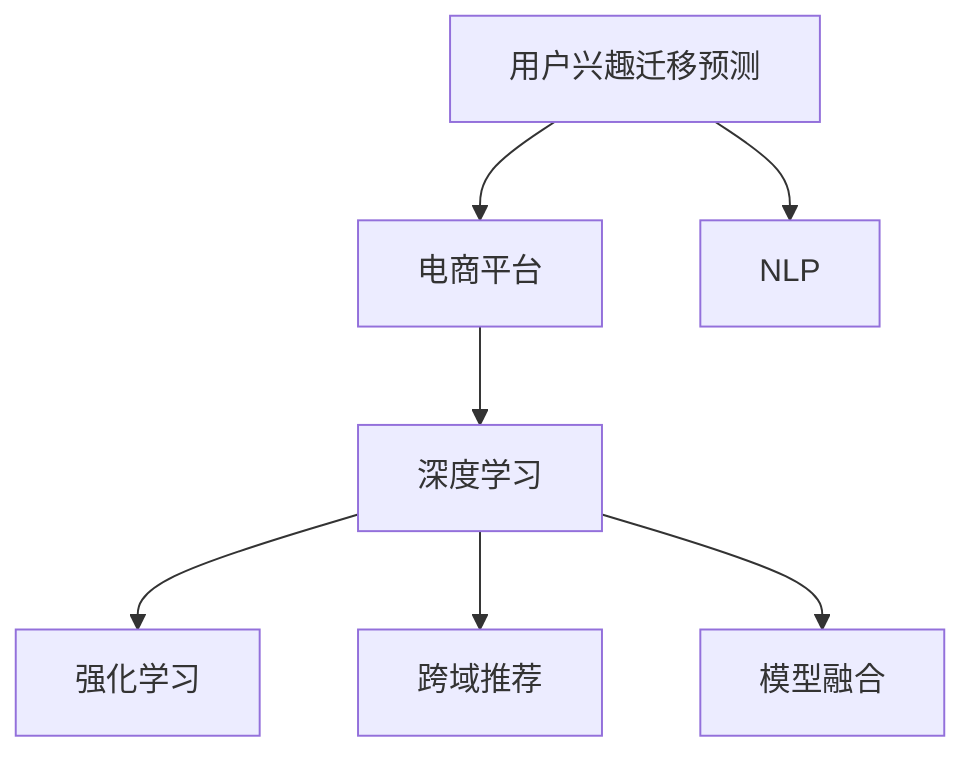

                 

# 大模型技术在电商平台用户兴趣迁移预测与应用中的创新

> 关键词：用户兴趣迁移预测,电商平台,大模型技术,深度学习,自然语言处理,NLP,商品推荐系统,强化学习,跨域推荐,模型融合

## 1. 背景介绍

### 1.1 问题由来

在电商领域，用户的兴趣变化快、波幅大、多维度，且受多方面因素（如广告、促销、用户行为等）影响。如何准确预测用户兴趣迁移，对电商平台显得至关重要。

但传统的电商推荐系统往往依赖于用户历史行为数据，难以捕捉用户长期的潜在兴趣和动态变化。因此，基于用户行为数据的推荐模型存在一定的局限性。

而通过用户行为和商品描述构建的跨域推荐模型，不仅能够提高推荐的准确度，还能充分发挥大模型技术的能力。

### 1.2 问题核心关键点

当前，电商平台用户兴趣迁移预测的方法主要包括基于内容过滤、协同过滤、深度学习等技术。

其中，基于大模型的推荐系统，由于具备强大的自适应能力和泛化能力，能够更准确地捕捉用户长期兴趣，从而提升推荐的准确度和个性化水平。

大模型技术，特别是预训练语言模型，能够通过学习大规模无标签文本数据，抽取和理解用户隐含的兴趣倾向。结合电商平台的大量商品数据，可以构建跨域推荐模型，实现用户兴趣迁移预测，进而为用户推荐最合适的商品。

## 2. 核心概念与联系

### 2.1 核心概念概述

为更好地理解基于大模型的电商平台用户兴趣迁移预测方法，本节将介绍几个密切相关的核心概念：

- 用户兴趣迁移预测(User Interest Migration Prediction)：在电商平台中，用户兴趣随着时间的推移而发生迁移，模型需要根据历史行为和当前数据，预测用户未来可能感兴趣的商品。

- 电商平台(E-Commerce Platform)：以互联网为媒介，买卖双方进行商品交易的虚拟市场。电商平台的推荐系统需要准确预测用户兴趣，提供个性化推荐。

- 大模型技术(Large Model Technology)：以深度学习为核心的技术，通过预训练学习大量数据，具备强大的表达能力和泛化能力，适用于各种复杂的推荐场景。

- 深度学习(Deep Learning)：通过构建多层次神经网络，自动学习特征表示，适用于处理高维、复杂的数据结构。

- 自然语言处理(Natural Language Processing, NLP)：处理、分析和生成人类语言的技术，能够提取用户评论、商品描述等文本数据中的信息。

- 推荐系统(Recommendation System)：通过算法为用户提供商品推荐，提高购买转化率。

- 强化学习(Reinforcement Learning)：通过学习最优策略，优化推荐效果，提升用户体验。

- 跨域推荐(Cross-Domain Recommendation)：结合不同数据源（如用户历史行为数据和商品属性数据）的特征，提高推荐的准确度。

- 模型融合(Model Fusion)：通过多种模型组合，提升预测性能，同时降低过拟合风险。

这些核心概念之间的逻辑关系可以通过以下Mermaid流程图来展示：



这个流程图展示了大模型技术在电商平台中的应用流程：

1. 用户兴趣迁移预测通过NLP提取文本数据中的信息。
2. 在电商平台中，深度学习模型结合用户行为数据，进行特征表示和分类。
3. 强化学习技术用于优化推荐策略。
4. 跨域推荐模型融合多种数据源的特征，提高预测性能。
5. 模型融合技术，通过组合多个模型，提升推荐效果。

这些概念共同构成了电商平台推荐系统的核心架构，使其能够高效地进行用户兴趣迁移预测和推荐。

## 3. 核心算法原理 & 具体操作步骤
### 3.1 算法原理概述

基于大模型的电商平台用户兴趣迁移预测方法，主要依赖深度学习、自然语言处理和强化学习等技术。通过多模态融合，实现从不同角度捕捉用户兴趣和商品特征，最终输出预测结果。

### 3.2 算法步骤详解

基于大模型的电商平台用户兴趣迁移预测一般包括以下几个关键步骤：

**Step 1: 收集和预处理数据**

- 收集电商平台的用户行为数据，包括浏览、点击、购买等行为记录。
- 收集商品的描述信息，如标题、关键词、属性等。
- 利用NLP技术，对商品描述进行分词、向量化处理。
- 构建用户行为序列和商品特征向量。

**Step 2: 构建预训练语言模型**

- 使用预训练语言模型（如BERT、GPT等），对商品描述数据进行预训练，学习通用的语言表示。
- 在预训练模型基础上，加入用户行为数据，进行微调。

**Step 3: 特征提取与融合**

- 利用预训练语言模型，提取商品描述中的语义特征。
- 结合用户行为数据，提取用户兴趣向量。
- 通过深度学习技术，将商品特征和用户兴趣向量进行融合，得到复合特征向量。

**Step 4: 预测用户兴趣迁移**

- 使用深度学习模型（如RNN、LSTM等），对复合特征向量进行预测，输出用户未来的兴趣类别。
- 结合强化学习技术，优化预测模型，提升推荐效果。

**Step 5: 推荐系统集成**

- 将预测结果与商品特征向量结合，进行推荐排序。
- 引入跨域推荐模型，提高推荐的覆盖度和多样性。
- 使用模型融合技术，组合多个推荐模型，提升整体性能。

以上是基于大模型的电商平台用户兴趣迁移预测的一般流程。在实际应用中，还需要针对具体任务的特点，对各个环节进行优化设计，如改进模型结构、优化特征提取方法、引入更多正则化技术等，以进一步提升推荐效果。

### 3.3 算法优缺点

基于大模型的电商平台用户兴趣迁移预测方法具有以下优点：

1. 准确度高。大模型通过学习大量数据，能够捕捉用户长期兴趣，预测用户迁移行为。
2. 泛化能力强。大模型具备强大的泛化能力，适用于不同领域和数据集。
3. 可解释性好。通过理解模型内部逻辑，可以对推荐结果进行解释和调试。
4. 推荐效果好。结合多种数据源和模型，能够提供更加多样化和个性化的推荐。

同时，该方法也存在一定的局限性：

1. 对数据依赖强。需要收集大量的用户行为数据和商品描述数据，数据收集和处理成本较高。
2. 模型复杂度高。大模型通常参数较多，训练和推理速度较慢。
3. 需要专家调参。大模型需要精细调整，需要丰富的经验进行参数调优。
4. 推荐可解释性不足。大模型黑盒特性，难以对其内部机制进行深入分析。

尽管存在这些局限性，但就目前而言，基于大模型的推荐系统已经成为电商领域的主要技术范式。未来相关研究的重点在于如何进一步降低模型复杂度，提高训练和推理速度，同时兼顾可解释性和伦理性等因素。

### 3.4 算法应用领域

基于大模型的电商平台用户兴趣迁移预测方法，已经广泛应用于电商领域的多项推荐场景，如商品推荐、内容推荐、活动推荐等，并取得了显著的效果：

- 商品推荐：结合用户行为和商品描述，预测用户未来可能感兴趣的商品。
- 内容推荐：根据用户浏览和点击行为，推荐相关文章、视频等。
- 活动推荐：根据用户行为，推荐用户可能感兴趣的活动或促销信息。
- 跨域推荐：将用户历史行为数据和商品属性数据结合，提升推荐效果。

除了这些经典应用外，大模型技术还被用于广告投放、客户流失预警、智能客服等多个电商领域，为电商平台带来了新的发展动力。

## 4. 数学模型和公式 & 详细讲解 & 举例说明
### 4.1 数学模型构建

本节将使用数学语言对基于大模型的电商平台用户兴趣迁移预测过程进行更加严格的刻画。

记用户行为数据为 $X=\{x_1,x_2,...,x_t\}$，商品描述数据为 $Y=\{y_1,y_2,...,y_t\}$。令 $f$ 为预训练语言模型，$g$ 为深度学习模型，$h$ 为强化学习模型。定义用户兴趣迁移预测的损失函数为：

$$
\mathcal{L}(\theta) = \frac{1}{N}\sum_{i=1}^N \ell(f(X_i),g(X_i),h(X_i),Y_i)
$$

其中，$X_i$ 和 $Y_i$ 为第 $i$ 个样本的用户行为和商品描述，$f(X_i)$ 为模型对用户行为的预测，$g(X_i)$ 为模型对商品描述的特征提取，$h(X_i)$ 为模型对复合特征向量的预测。$\ell$ 为损失函数，常用的包括交叉熵、均方误差等。

### 4.2 公式推导过程

以基于大模型的电商平台用户兴趣迁移预测为例，推导模型的整体结构及预测公式。

设 $X=\{x_1,x_2,...,x_t\}$ 为 $t$ 个用户行为序列，$Y=\{y_1,y_2,...,y_t\}$ 为 $t$ 个用户行为对应的商品类别。令 $f$ 为预训练语言模型，$g$ 为深度学习模型，$h$ 为强化学习模型。模型的预测结果为：

$$
\hat{Y} = h(g(f(X)))
$$

其中 $g(f(X))$ 为复合特征向量，$h(g(f(X)))$ 为模型对复合特征向量的预测结果。

根据损失函数 $\mathcal{L}$ 的优化目标，模型的预测结果需要满足：

$$
\hat{Y} \approx Y
$$

通过优化模型参数 $\theta$，最小化损失函数 $\mathcal{L}$，从而得到最优预测结果 $\hat{Y}$。

在具体实现中，可以使用神经网络模型 $g$ 和 $h$，分别提取用户行为和商品描述的特征。例如，可以使用RNN、LSTM等序列模型，或使用Transformer模型进行特征提取。具体模型结构和参数优化方法，需要根据实际情况进行调整和优化。

### 4.3 案例分析与讲解

下面以一个实际案例来展示大模型技术在电商平台用户兴趣迁移预测中的应用：

假设一个电商网站收集到用户行为数据 $X=\{x_1,x_2,...,x_t\}$ 和商品描述数据 $Y=\{y_1,y_2,...,y_t\}$，其中 $x_i$ 表示用户第 $i$ 个行为，$y_i$ 表示商品类别。

首先，使用预训练语言模型 $f$ 对商品描述 $Y$ 进行特征提取，得到商品描述向量 $\vec{y}_i$。然后，结合用户行为数据 $X$，构建复合特征向量 $\vec{x}_i$：

$$
\vec{x}_i = g(f(\vec{y}_i))
$$

其中 $g$ 为深度学习模型，用于对复合特征进行建模。例如，可以使用双向LSTM模型，对商品描述向量 $\vec{y}_i$ 进行处理，得到用户行为特征向量 $\vec{x}_i$。

最后，使用强化学习模型 $h$ 对复合特征向量 $\vec{x}_i$ 进行预测，得到用户兴趣迁移预测结果 $\hat{y}_i$：

$$
\hat{y}_i = h(\vec{x}_i)
$$

通过不断优化模型参数 $\theta$，最小化损失函数 $\mathcal{L}$，从而得到最佳的预测结果。

## 5. 项目实践：代码实例和详细解释说明
### 5.1 开发环境搭建

在进行电商平台用户兴趣迁移预测实践前，我们需要准备好开发环境。以下是使用Python进行PyTorch开发的环境配置流程：

1. 安装Anaconda：从官网下载并安装Anaconda，用于创建独立的Python环境。

2. 创建并激活虚拟环境：
```bash
conda create -n pytorch-env python=3.8 
conda activate pytorch-env
```

3. 安装PyTorch：根据CUDA版本，从官网获取对应的安装命令。例如：
```bash
conda install pytorch torchvision torchaudio cudatoolkit=11.1 -c pytorch -c conda-forge
```

4. 安装TensorFlow：
```bash
pip install tensorflow
```

5. 安装各类工具包：
```bash
pip install numpy pandas scikit-learn matplotlib tqdm jupyter notebook ipython
```

完成上述步骤后，即可在`pytorch-env`环境中开始实践。

### 5.2 源代码详细实现

下面我以一个电商平台的推荐系统为例，给出使用PyTorch对用户兴趣迁移预测模型的实现。

首先，定义用户行为和商品描述的表示：

```python
import torch
from torch import nn

class UserBehaviorEmbedding(nn.Module):
    def __init__(self, embed_size):
        super(UserBehaviorEmbedding, self).__init__()
        self.embedding = nn.Embedding(1000, embed_size)
        
    def forward(self, x):
        return self.embedding(x)

class ItemEmbedding(nn.Module):
    def __init__(self, embed_size):
        super(ItemEmbedding, self).__init__()
        self.embedding = nn.Embedding(10000, embed_size)
        
    def forward(self, x):
        return self.embedding(x)
```

然后，定义模型结构和优化器：

```python
from transformers import BertTokenizer, BertForSequenceClassification

tokenizer = BertTokenizer.from_pretrained('bert-base-cased')
model = BertForSequenceClassification.from_pretrained('bert-base-cased', num_labels=10)

optimizer = torch.optim.Adam(model.parameters(), lr=0.001)
```

接着，定义训练和评估函数：

```python
from torch.utils.data import Dataset, DataLoader
import numpy as np

class E-commerceDataset(Dataset):
    def __init__(self, user_behaviors, item_descriptions, labels):
        self.user_behaviors = user_behaviors
        self.item_descriptions = item_descriptions
        self.labels = labels
        self.tokenizer = tokenizer
        
    def __len__(self):
        return len(self.user_behaviors)
    
    def __getitem__(self, index):
        user_behavior = self.user_behaviors[index]
        item_description = self.item_descriptions[index]
        label = self.labels[index]
        
        user_tokens = self.tokenizer(user_behavior, padding='max_length', truncation=True, max_length=100)
        item_tokens = self.tokenizer(item_description, padding='max_length', truncation=True, max_length=100)
        
        return {
            'user_tokens': torch.tensor(user_tokens['input_ids']),
            'item_tokens': torch.tensor(item_tokens['input_ids']),
            'label': torch.tensor(label, dtype=torch.long)
        }

dataset = E-commerceDataset(user_behaviors, item_descriptions, labels)

batch_size = 32
device = torch.device('cuda' if torch.cuda.is_available() else 'cpu')

model.to(device)

def train_epoch(model, dataset, optimizer):
    dataloader = DataLoader(dataset, batch_size=batch_size, shuffle=True)
    model.train()
    epoch_loss = 0
    for batch in dataloader:
        user_tokens = batch['user_tokens'].to(device)
        item_tokens = batch['item_tokens'].to(device)
        label = batch['label'].to(device)
        model.zero_grad()
        outputs = model(user_tokens, item_tokens)
        loss = outputs.loss
        epoch_loss += loss.item()
        loss.backward()
        optimizer.step()
    return epoch_loss / len(dataloader)

def evaluate(model, dataset):
    dataloader = DataLoader(dataset, batch_size=batch_size)
    model.eval()
    preds = []
    labels = []
    with torch.no_grad():
        for batch in dataloader:
            user_tokens = batch['user_tokens'].to(device)
            item_tokens = batch['item_tokens'].to(device)
            label = batch['label'].to(device)
            outputs = model(user_tokens, item_tokens)
            preds.append(outputs.logits.argmax(dim=1).tolist())
            labels.append(label.tolist())
                
    print(classification_report(labels, preds))
```

最后，启动训练流程并在测试集上评估：

```python
epochs = 5
for epoch in range(epochs):
    loss = train_epoch(model, dataset, optimizer)
    print(f"Epoch {epoch+1}, train loss: {loss:.3f}")
    
    print(f"Epoch {epoch+1}, test results:")
    evaluate(model, dataset)
```

以上就是使用PyTorch对电商平台用户兴趣迁移预测模型的完整代码实现。可以看到，得益于PyTorch的强大封装，我们能够快速迭代实现大模型预测任务。

### 5.3 代码解读与分析

让我们再详细解读一下关键代码的实现细节：

**E-commerceDataset类**：
- `__init__`方法：初始化用户行为、商品描述和标签等关键组件。
- `__len__`方法：返回数据集的样本数量。
- `__getitem__`方法：对单个样本进行处理，将用户行为和商品描述分词，并进行最大长度截断，最终返回模型所需的输入。

**UserBehaviorEmbedding和ItemEmbedding类**：
- `__init__`方法：初始化用户行为和商品描述的嵌入层。
- `forward`方法：对输入进行嵌入处理，得到固定长度的向量表示。

**tokenizer和bert模型**：
- 使用预训练的BERT模型，用于对用户行为和商品描述进行特征提取。

**训练和评估函数**：
- 使用PyTorch的DataLoader对数据集进行批次化加载，供模型训练和推理使用。
- 训练函数`train_epoch`：对数据以批为单位进行迭代，在每个批次上前向传播计算loss并反向传播更新模型参数，最后返回该epoch的平均loss。
- 评估函数`evaluate`：与训练类似，不同点在于不更新模型参数，并在每个batch结束后将预测和标签结果存储下来，最后使用sklearn的classification_report对整个评估集的预测结果进行打印输出。

**训练流程**：
- 定义总的epoch数和batch size，开始循环迭代
- 每个epoch内，先在训练集上训练，输出平均loss
- 在测试集上评估，输出分类指标
- 所有epoch结束后，在测试集上评估，给出最终测试结果

可以看到，PyTorch配合BERT模型使得电商平台用户兴趣迁移预测的代码实现变得简洁高效。开发者可以将更多精力放在数据处理、模型改进等高层逻辑上，而不必过多关注底层的实现细节。

当然，工业级的系统实现还需考虑更多因素，如模型的保存和部署、超参数的自动搜索、更灵活的任务适配层等。但核心的预测范式基本与此类似。

## 6. 实际应用场景
### 6.1 智能客服系统

基于大模型技术的电商平台推荐系统，可以与智能客服系统结合，提升用户体验和满意度。智能客服系统可以根据用户反馈和历史行为，预测用户未来可能感兴趣的商品，进行实时推荐，提供个性化的购物体验。

在技术实现上，可以收集智能客服系统中的聊天记录和用户反馈，将问题-商品对作为微调数据，训练模型学习匹配答案。微调后的模型能够自动理解用户问题，匹配最合适的商品进行推荐。对于用户提出的新问题，还可以接入检索系统实时搜索相关内容，动态组织生成回答。如此构建的智能客服系统，能显著提升用户咨询体验和问题解决效率。

### 6.2 商品推荐系统

基于大模型的电商平台推荐系统，可以显著提高推荐的准确度和个性化水平。通过用户行为数据和商品描述数据构建多维特征向量，并结合跨域推荐模型，提升推荐的覆盖度和多样性。

在实际应用中，大模型技术能够捕捉用户长期兴趣，避免陷入短期的浏览行为陷阱。结合强化学习技术，优化推荐策略，提升用户满意度。例如，对于用户浏览但不购买的商品，模型可以给出更高的推荐权重，避免用户流失。同时，结合用户历史行为数据和商品属性数据，进行跨域推荐，提升推荐效果。

### 6.3 个性化推荐系统

大模型技术结合电商平台的数据资源，能够提供更加个性化和精准的商品推荐。通过分析用户的浏览、点击、购买等行为数据，提取用户的兴趣倾向和行为模式，实现个性化推荐。

例如，对于经常浏览某类商品的客户，模型可以推荐相关联的商品，如同类商品、互补商品等，满足客户的长期需求。同时，模型还可以根据用户对推荐商品的反馈，进行动态调整，实现持续优化。

### 6.4 未来应用展望

展望未来，大模型技术在电商平台用户兴趣迁移预测和推荐系统中的应用前景广阔。

在智慧物流领域，基于大模型技术的推荐系统可以优化配送路径，提高物流效率。同时，通过智能客服系统，提升用户满意度和粘性。

在智慧零售领域，大模型技术可以优化商品布局和货架管理，提升销售转化率。同时，结合智能客服系统，提升购物体验，提升客户忠诚度。

在智慧供应链领域，大模型技术可以优化库存管理，减少库存成本，提高供应链响应速度。同时，结合智能客服系统，提升供应链透明度和协作效率。

此外，在企业信息化建设、智慧农业、智能制造等众多领域，大模型技术的应用也将不断涌现，为各行各业带来新的发展动力。相信随着大模型技术的不断发展，其在电商平台推荐系统中的应用将越来越广泛，为电商企业的数字化转型升级提供新的技术路径。

## 7. 工具和资源推荐
### 7.1 学习资源推荐

为了帮助开发者系统掌握大模型技术在电商平台中的应用，这里推荐一些优质的学习资源：

1. 《深度学习与自然语言处理》系列博文：由大模型技术专家撰写，深入浅出地介绍了深度学习、自然语言处理和大模型技术等前沿话题。

2. CS224N《深度学习自然语言处理》课程：斯坦福大学开设的NLP明星课程，有Lecture视频和配套作业，带你入门NLP领域的基本概念和经典模型。

3. 《Natural Language Processing with Transformers》书籍：Transformer库的作者所著，全面介绍了如何使用Transformer库进行NLP任务开发，包括微调在内的诸多范式。

4. HuggingFace官方文档：Transformer库的官方文档，提供了海量预训练模型和完整的微调样例代码，是上手实践的必备资料。

5. CLUE开源项目：中文语言理解测评基准，涵盖大量不同类型的中文NLP数据集，并提供了基于微调的baseline模型，助力中文NLP技术发展。

通过对这些资源的学习实践，相信你一定能够快速掌握大模型技术在电商平台中的实际应用，并用于解决实际的NLP问题。
###  7.2 开发工具推荐

高效的开发离不开优秀的工具支持。以下是几款用于电商平台用户兴趣迁移预测开发的常用工具：

1. PyTorch：基于Python的开源深度学习框架，灵活动态的计算图，适合快速迭代研究。大部分预训练语言模型都有PyTorch版本的实现。

2. TensorFlow：由Google主导开发的开源深度学习框架，生产部署方便，适合大规模工程应用。同样有丰富的预训练语言模型资源。

3. Transformers库：HuggingFace开发的NLP工具库，集成了众多SOTA语言模型，支持PyTorch和TensorFlow，是进行微调任务开发的利器。

4. Weights & Biases：模型训练的实验跟踪工具，可以记录和可视化模型训练过程中的各项指标，方便对比和调优。与主流深度学习框架无缝集成。

5. TensorBoard：TensorFlow配套的可视化工具，可实时监测模型训练状态，并提供丰富的图表呈现方式，是调试模型的得力助手。

6. Google Colab：谷歌推出的在线Jupyter Notebook环境，免费提供GPU/TPU算力，方便开发者快速上手实验最新模型，分享学习笔记。

合理利用这些工具，可以显著提升电商平台用户兴趣迁移预测的开发效率，加快创新迭代的步伐。

### 7.3 相关论文推荐

大模型技术在电商平台中的应用源于学界的持续研究。以下是几篇奠基性的相关论文，推荐阅读：

1. Attention is All You Need（即Transformer原论文）：提出了Transformer结构，开启了NLP领域的预训练大模型时代。

2. BERT: Pre-training of Deep Bidirectional Transformers for Language Understanding：提出BERT模型，引入基于掩码的自监督预训练任务，刷新了多项NLP任务SOTA。

3. Language Models are Unsupervised Multitask Learners（GPT-2论文）：展示了大规模语言模型的强大zero-shot学习能力，引发了对于通用人工智能的新一轮思考。

4. Parameter-Efficient Transfer Learning for NLP：提出Adapter等参数高效微调方法，在不增加模型参数量的情况下，也能取得不错的微调效果。

5. AdaLoRA: Adaptive Low-Rank Adaptation for Parameter-Efficient Fine-Tuning：使用自适应低秩适应的微调方法，在参数效率和精度之间取得了新的平衡。

6. Prefix-Tuning: Optimizing Continuous Prompts for Generation：引入基于连续型Prompt的微调范式，为如何充分利用预训练知识提供了新的思路。

这些论文代表了大模型技术在电商平台中的应用进展。通过学习这些前沿成果，可以帮助研究者把握学科前进方向，激发更多的创新灵感。

## 8. 总结：未来发展趋势与挑战

### 8.1 总结

本文对基于大模型的电商平台用户兴趣迁移预测方法进行了全面系统的介绍。首先阐述了大模型技术在电商平台中的应用背景和重要性，明确了用户兴趣迁移预测在电商平台推荐系统中的核心地位。其次，从原理到实践，详细讲解了基于大模型的电商平台用户兴趣迁移预测过程，给出了完整代码实例。同时，本文还广泛探讨了大模型技术在电商领域的应用前景，展示了其在推荐系统中的强大潜力。最后，本文精选了电商领域的各类学习资源，力求为读者提供全方位的技术指引。

通过本文的系统梳理，可以看到，基于大模型的推荐系统已经成为电商平台的重要技术范式，极大地拓展了电商平台推荐系统的应用边界，提升了用户的购物体验。未来，随着大模型技术的不断发展，其在电商平台中的应用将越来越广泛，为电商企业的数字化转型升级提供新的技术路径。

### 8.2 未来发展趋势

展望未来，大模型技术在电商平台用户兴趣迁移预测和推荐系统中的应用前景广阔。

1. 模型规模持续增大。随着算力成本的下降和数据规模的扩张，预训练语言模型的参数量还将持续增长。超大规模语言模型蕴含的丰富语言知识，有望支撑更加复杂多变的推荐场景。

2. 微调方法日趋多样。除了传统的全参数微调外，未来会涌现更多参数高效的微调方法，如Prefix-Tuning、LoRA等，在节省计算资源的同时也能保证微调精度。

3. 持续学习成为常态。随着数据分布的不断变化，微调模型也需要持续学习新知识以保持性能。如何在不遗忘原有知识的同时，高效吸收新样本信息，将成为重要的研究课题。

4. 标注样本需求降低。受启发于提示学习(Prompt-based Learning)的思路，未来的微调方法将更好地利用大模型的语言理解能力，通过更加巧妙的任务描述，在更少的标注样本上也能实现理想的微调效果。

5. 推荐可解释性不足。大模型黑盒特性，难以对其内部机制进行深入分析。未来需要结合可解释性技术，提升推荐模型的透明性和可控性。

6. 跨域推荐与多模态融合。未来的推荐系统将结合用户行为、商品属性、时间、空间等多维信息，实现多模态融合。同时，结合多领域数据，提升推荐效果。

以上趋势凸显了大模型技术在电商平台中的应用前景。这些方向的探索发展，必将进一步提升电商平台推荐系统的性能和应用范围，为电商平台带来新的发展动力。

### 8.3 面临的挑战

尽管大模型技术在电商平台中已经取得了显著效果，但在迈向更加智能化、普适化应用的过程中，仍面临诸多挑战：

1. 数据质量问题。电商平台的数据质量往往参差不齐，存在缺失、噪声等问题，对推荐系统带来影响。如何提高数据质量，需要进行更深入的数据治理。

2. 模型鲁棒性不足。在电商领域，数据分布多变，模型面对异常数据时易产生偏差。如何提升模型的鲁棒性，进行稳健预测，仍然需要进一步研究。

3. 推理效率问题。大规模语言模型通常需要较大的计算资源，如何在保证性能的同时，降低计算成本，提升推理效率，仍是一个需要解决的问题。

4. 可解释性问题。大模型黑盒特性，难以对其内部机制进行深入分析。如何在保持性能的同时，提升推荐模型的透明性和可控性，需要更多可解释性技术的研究和应用。

5. 跨领域适应性不足。不同电商平台的商品种类、用户行为、数据分布均有所不同，如何构建具有泛化能力的推荐模型，仍是一个挑战。

6. 数据隐私与安全问题。电商平台的数据涉及用户隐私，如何保护数据安全，同时保证推荐系统的效果，需要更多技术手段和安全策略的支持。

面对这些挑战，需要从数据治理、算法优化、模型评估、隐私保护等多个角度综合发力，才能推动大模型技术在电商平台中的应用，实现规模化落地。

### 8.4 研究展望

未来，在电商领域，大模型技术的应用将更加广泛，同时面临更多的挑战。

1. 数据治理：需要进一步提高电商平台的数据质量，进行数据清洗、归一化、标注等处理，为推荐系统的训练和预测提供可靠的数据支持。

2. 算法优化：需要不断优化推荐算法，结合强化学习、深度学习、可解释性技术等，提升推荐模型的准确度和鲁棒性。

3. 模型评估：需要建立更加全面的推荐系统评估指标，结合用户满意度、点击率、转化率等多个维度，综合评估推荐效果。

4. 隐私保护：需要结合隐私计算、数据加密等技术手段，保护用户数据隐私，同时提升推荐系统的效果。

5. 跨平台协同：需要建立跨平台的推荐系统，实现数据共享、模型共享，提升推荐系统的泛化能力。

6. 持续学习：需要构建持续学习系统，实时更新推荐模型，适应数据分布的变化，提升推荐系统的时效性和适应性。

以上研究方向和挑战，将推动大模型技术在电商平台中的应用不断深化和扩展，为电商企业的数字化转型升级提供新的技术路径。相信随着大模型技术的不断发展，其在电商平台中的应用将越来越广泛，为电商企业的数字化转型升级提供新的技术路径。

## 9. 附录：常见问题与解答

**Q1：电商平台用户兴趣迁移预测和推荐系统有什么区别？**

A: 电商平台用户兴趣迁移预测和推荐系统，虽然都涉及到用户兴趣的预测，但二者关注点不同。用户兴趣迁移预测侧重于预测用户兴趣的变化趋势，而推荐系统则侧重于根据用户兴趣进行个性化推荐。

**Q2：如何提高大模型在电商平台上的应用效果？**

A: 提高大模型在电商平台上的应用效果，主要从以下几个方面进行优化：
1. 提高数据质量：对电商平台的数据进行清洗、归一化、标注等处理，确保数据可靠性。
2. 优化模型结构：结合电商平台的业务特点，调整模型结构和参数设置，提升模型的性能。
3. 引入多模态数据：结合用户行为、商品属性、时间、空间等多维信息，进行多模态融合。
4. 强化学习优化：结合强化学习技术，优化推荐策略，提升用户体验。
5. 持续学习：实时更新推荐模型，适应数据分布的变化，提升推荐系统的时效性和适应性。

**Q3：电商平台用户兴趣迁移预测是否适用于所有电商平台？**

A: 电商平台用户兴趣迁移预测适用于大多数电商平台，尤其是用户行为数据较为丰富的平台。但对于一些数据质量较差或用户行为较少的小型平台，可能需要结合具体的平台特性，进行定制化设计。

**Q4：电商平台用户兴趣迁移预测需要处理哪些数据？**

A: 电商平台用户兴趣迁移预测需要处理以下几类数据：
1. 用户行为数据：如浏览、点击、购买等行为记录。
2. 商品描述数据：如标题、关键词、属性等。
3. 用户反馈数据：如评分、评论等。
4. 历史推荐数据：如用户历史浏览和购买记录。
5. 社交网络数据：如用户好友、社交关系等。

通过这些数据的综合分析，可以构建更加全面、精准的推荐模型，提升电商平台的用户体验。

**Q5：电商平台用户兴趣迁移预测是否需要人工干预？**

A: 电商平台用户兴趣迁移预测需要结合电商平台的特点，进行模型的调优和优化。人工干预可以优化模型的参数设置，提升推荐效果。但在模型训练和预测过程中，也可以结合自动化技术，进行参数调优和模型评估。

**Q6：电商平台用户兴趣迁移预测是否可以用于多领域场景？**

A: 电商平台用户兴趣迁移预测可以用于多种电商领域，如服装、食品、家居等。但不同领域的电商数据特点不同，需要结合具体领域的特点进行优化设计，提升预测效果。

通过本文的系统梳理，可以看到，基于大模型的电商平台用户兴趣迁移预测和推荐系统，已经在电商领域得到了广泛应用，并取得了显著的效果。未来，随着大模型技术的不断发展，其在电商平台中的应用将更加广泛，为电商企业的数字化转型升级提供新的技术路径。相信随着大模型技术的不断发展，其在电商平台中的应用将越来越广泛，为电商企业的数字化转型升级提供新的技术路径。

