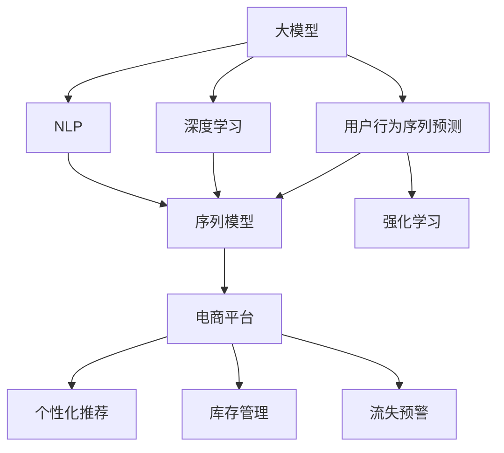

                 

# 大模型技术在电商平台用户行为序列预测中的应用

> 关键词：大模型技术、用户行为序列预测、电商平台、深度学习、自然语言处理(NLP)、序列模型、强化学习、应用场景

## 1. 背景介绍

### 1.1 问题由来
电商平台用户行为序列预测（User Behavior Sequencing Prediction）是电商领域一项重要的应用技术。通过对用户过往浏览、点击、购买等行为进行建模，可以预测用户的未来行为，如是否购买某商品、点击某商品详情页等。这种技术的应用场景包括但不限于个性化推荐、库存管理、广告投放优化、流失用户预警等。

然而，用户行为序列数据往往具有高维稀疏、时序相关性等特点，传统机器学习模型难以有效建模。而近年来，基于大模型技术，如Transformer、BERT、GPT等，借助深度学习、自然语言处理等方法，可以显著提升用户行为序列预测的精度和泛化能力。

### 1.2 问题核心关键点
在电商平台用户行为序列预测中，核心问题包括：

1. 如何高效捕捉高维稀疏特征：电商平台用户行为数据通常包含海量的行为记录，如何将这些数据高效地编码为模型可以接受的格式，是模型训练的第一步。

2. 如何捕捉时序相关性：用户行为序列数据具有很强的时间相关性，如何在模型中保留这种时序依赖，是模型建模的难点。

3. 如何处理长序列数据：电商平台用户行为序列往往很长，如何在保证模型训练和推理效率的同时，建模长序列的依赖，是模型应用的关键。

4. 如何提升模型的泛化能力：电商平台应用场景多变，如何训练出在多种场景下都表现良好的模型，是模型部署的挑战。

5. 如何实现模型解释和可控性：电商平台的用户行为预测涉及到商业决策，模型的输出需要具备可解释性和可控性，以便于人工干预和理解。

本文聚焦于大模型技术在电商平台用户行为序列预测中的应用，阐述其核心原理、操作步骤、模型构建及优化方法，并结合实践案例，探讨该技术在实际应用中的效果和挑战。

## 2. 核心概念与联系

### 2.1 核心概念概述

为更好地理解大模型在电商平台用户行为序列预测中的应用，本节将介绍几个密切相关的核心概念：

- 大模型（Large Model）：以Transformer、BERT、GPT等为代表的深度学习模型，通过在大量数据上进行预训练，学习丰富的语言和特征表示，具有强大的泛化能力。

- 用户行为序列预测（User Behavior Sequencing Prediction）：通过建模用户过往行为序列，预测用户未来的行为，如点击、购买等。常见应用包括个性化推荐、库存管理、流失预警等。

- 深度学习（Deep Learning）：使用多层神经网络进行特征学习和模型训练，能够自动发现数据中的复杂结构，适合处理高维、非线性数据。

- 自然语言处理（NLP）：处理和分析人类语言的数据，包括文本分类、情感分析、语言生成等任务。

- 序列模型（Sequence Model）：以循环神经网络（RNN）、长短时记忆网络（LSTM）、Transformer等为代表，能够有效处理序列数据的模型。

- 强化学习（Reinforcement Learning, RL）：通过与环境交互，学习最优策略的模型，适用于用户行为预测中的推荐系统优化等场景。

- 大模型应用场景：电商、社交媒体、搜索引擎、语音识别等领域，借助大模型进行深度学习建模，提升用户体验和运营效率。

这些核心概念之间的逻辑关系可以通过以下Mermaid流程图来展示：



这个流程图展示了大模型在电商平台用户行为序列预测中的应用场景及其关联概念：

1. 大模型通过深度学习和自然语言处理进行预训练，学习丰富的特征表示。
2. 用户行为序列预测任务引入序列模型和强化学习进行建模，捕捉用户行为的时序相关性和互动性。
3. 模型在电商平台应用中，进行个性化推荐、库存管理、流失预警等具体任务。

## 3. 核心算法原理 & 具体操作步骤
### 3.1 算法原理概述

基于大模型技术在电商平台用户行为序列预测中，核心思想是通过深度学习模型捕捉用户行为序列的时序相关性和特征表示，并通过优化策略提升模型的泛化能力和预测精度。

具体而言，大模型技术可以用于以下几个方面：

- 特征编码：将高维稀疏的用户行为数据编码成模型可以接受的格式，如将点击、浏览行为编码为向量表示。
- 序列建模：通过序列模型捕捉用户行为序列的时序相关性，如利用RNN、LSTM、Transformer等模型对行为序列进行建模。
- 泛化提升：通过强化学习、迁移学习等策略，提升模型在多种场景下的泛化能力。
- 模型优化：通过调整超参数、正则化、对抗训练等方法，提升模型性能和稳定性。

### 3.2 算法步骤详解

基于大模型技术的电商平台用户行为序列预测通常包括以下关键步骤：

**Step 1: 数据预处理**
- 收集电商平台用户的历史行为数据，包括点击、浏览、购买等行为记录。
- 对数据进行清洗和特征工程，如缺失值填充、异常值处理、特征编码等。

**Step 2: 特征编码**
- 使用嵌入层（Embedding Layer）将高维稀疏的特征编码为低维稠密向量，以便于模型处理。
- 常用的嵌入方式包括独热编码、词向量嵌入（Word Embedding）等。

**Step 3: 序列建模**
- 使用序列模型（如RNN、LSTM、Transformer等）对用户行为序列进行建模，捕捉时序依赖。
- 序列模型需要根据数据特点选择合适的参数和层数，进行调参和优化。

**Step 4: 模型训练**
- 将处理好的数据集划分为训练集、验证集和测试集。
- 使用优化器（如AdamW、SGD等）和损失函数（如交叉熵损失、均方误差等）对模型进行训练，最小化损失函数。
- 在训练过程中，需要监控模型的性能，防止过拟合。

**Step 5: 模型评估与调优**
- 在验证集上评估模型的性能，如准确率、F1分数等。
- 根据评估结果，对模型进行调优，如调整超参数、正则化强度、对抗训练等。
- 重复训练和评估过程，直到模型达到预设的性能指标。

**Step 6: 模型应用**
- 在测试集上评估模型性能。
- 将训练好的模型部署到电商平台上，进行实时行为预测。
- 持续收集用户新行为数据，定期重新训练模型，保持模型性能。

### 3.3 算法优缺点

基于大模型的电商平台用户行为序列预测方法具有以下优点：

1. 高效捕捉高维稀疏特征：大模型通过预训练，自动学习特征编码方式，能够高效处理高维稀疏数据。

2. 强大的时序建模能力：序列模型能够捕捉用户行为序列的时序相关性，提升模型预测精度。

3. 良好的泛化能力：大模型通常具备较强的泛化能力，可以在多种电商应用场景中表现良好。

4. 可解释性：大模型通过预训练和微调，能够提供可解释的特征表示，便于人工干预和理解。

5. 灵活的扩展性：大模型可以通过增减参数、调整层数等方式进行灵活扩展，适用于多种电商平台应用场景。

然而，该方法也存在以下局限性：

1. 高计算成本：大模型的训练和推理需要大量的计算资源，对硬件要求较高。

2. 数据依赖性：模型的性能高度依赖于训练数据的质量和数量，需要大量标注数据进行预训练和微调。

3. 模型复杂度：大模型通常具有较高的复杂度，训练和推理效率可能受到影响。

4. 模型可控性：大模型的决策过程复杂，难以解释和控制。

### 3.4 算法应用领域

基于大模型的电商平台用户行为序列预测方法，广泛应用于以下领域：

1. 个性化推荐系统：通过预测用户未来的购买行为，为用户推荐个性化商品，提升用户满意度。

2. 库存管理：预测用户未来购买商品的趋势，优化库存管理，减少缺货和过剩。

3. 广告投放优化：预测用户点击广告的可能性，优化广告投放策略，提高广告效果和ROI。

4. 流失预警：预测用户流失的风险，提前采取措施，提升用户留存率。

5. 商品相似度计算：通过建模用户行为序列，计算商品之间的相似度，提升商品搜索和推荐效果。

6. 内容生成：根据用户行为序列，生成个性化的商品推荐内容，提升用户互动和留存。

## 4. 数学模型和公式 & 详细讲解 & 举例说明
### 4.1 数学模型构建

在电商平台用户行为序列预测中，常用的数学模型包括循环神经网络（RNN）、长短时记忆网络（LSTM）、Transformer等。以Transformer模型为例，其核心组成部分包括自注意力机制（Self-Attention Mechanism）和多层感知器（Multi-Layer Perceptron）。

设用户行为序列数据为 $\{x_t\}_{t=1}^T$，其中 $x_t$ 表示第 $t$ 个行为记录，可以表示为高维向量。使用Transformer模型进行建模时，首先需要将 $x_t$ 编码成低维稠密向量 $h_t$，然后通过自注意力机制和多层感知器进行处理。

自注意力机制（Self-Attention）的核心公式如下：

$$
\text{Attention}(Q, K, V) = \text{Softmax}(\frac{QK^T}{\sqrt{d_k}})V
$$

其中，$Q$ 和 $K$ 是Transformer中的查询和键，$V$ 是值。通过计算查询向量与键向量的点积，得到注意力权重，然后根据权重加权求和，得到最终输出。

Transformer模型的整体结构如图1所示：


图1：Transformer模型结构

Transformer模型通常包括多个编码层（Encoder Layer）和解码层（Decoder Layer），每个层包含自注意力机制、多头注意力机制和多层感知器等组件。

### 4.2 公式推导过程

Transformer模型中，编码层和解码层的核心公式如下：

1. 自注意力机制（Self-Attention）
$$
\text{Attention}(Q, K, V) = \text{Softmax}(\frac{QK^T}{\sqrt{d_k}})V
$$

2. 多头注意力机制（Multi-Head Attention）
$$
\text{MultiHead}(Q, K, V) = \text{Concat}(\text{Attention}(QW_Q^T, KW_K^T, VW_V^T))W_O
$$

其中，$W_Q^T$、$W_K^T$、$W_V^T$ 和 $W_O$ 分别是线性变换层的权重矩阵。

3. 残差连接（Residual Connection）
$$
h' = h + \text{MultiHead}(h)
$$

4. 层归一化（Layer Normalization）
$$
\text{LayerNorm}(h) = \gamma \sigma(\beta h)
$$

其中，$\gamma$ 和 $\beta$ 是归一化层的可训练参数。

通过这些核心公式，Transformer模型可以高效处理长序列数据，同时保留时序相关性。

### 4.3 案例分析与讲解

以电商平台的个性化推荐系统为例，介绍Transformer模型的应用。

假设电商平台收集了用户过去一个月的点击、浏览行为数据，使用Transformer模型进行建模，预测用户未来一个月的购买行为。

1. 数据预处理
- 收集用户行为数据，进行清洗和特征工程，如缺失值填充、异常值处理、特征编码等。

2. 特征编码
- 使用嵌入层将高维稀疏的特征编码为低维稠密向量，以便于模型处理。例如，将点击、浏览行为编码为词向量嵌入。

3. 序列建模
- 使用Transformer模型对用户行为序列进行建模，捕捉时序相关性。例如，将Transformer模型的输入序列为 $\{x_t\}_{t=1}^{30}$，输出为 $\{y_t\}_{t=1}^{30}$，表示未来一个月的购买行为预测。

4. 模型训练
- 将处理好的数据集划分为训练集、验证集和测试集。
- 使用优化器（如AdamW、SGD等）和损失函数（如交叉熵损失、均方误差等）对模型进行训练，最小化损失函数。
- 在训练过程中，需要监控模型的性能，防止过拟合。

5. 模型评估与调优
- 在验证集上评估模型的性能，如准确率、F1分数等。
- 根据评估结果，对模型进行调优，如调整超参数、正则化强度、对抗训练等。
- 重复训练和评估过程，直到模型达到预设的性能指标。

6. 模型应用
- 在测试集上评估模型性能。
- 将训练好的模型部署到电商平台上，进行实时行为预测。
- 持续收集用户新行为数据，定期重新训练模型，保持模型性能。

## 5. 项目实践：代码实例和详细解释说明
### 5.1 开发环境搭建

在进行电商平台用户行为序列预测实践前，我们需要准备好开发环境。以下是使用Python进行PyTorch开发的环境配置流程：

1. 安装Anaconda：从官网下载并安装Anaconda，用于创建独立的Python环境。

2. 创建并激活虚拟环境：
```bash
conda create -n pytorch-env python=3.8 
conda activate pytorch-env
```

3. 安装PyTorch：根据CUDA版本，从官网获取对应的安装命令。例如：
```bash
conda install pytorch torchvision torchaudio cudatoolkit=11.1 -c pytorch -c conda-forge
```

4. 安装Transformers库：
```bash
pip install transformers
```

5. 安装各类工具包：
```bash
pip install numpy pandas scikit-learn matplotlib tqdm jupyter notebook ipython
```

完成上述步骤后，即可在`pytorch-env`环境中开始微调实践。

### 5.2 源代码详细实现

下面我们以电商平台个性化推荐系统为例，给出使用Transformers库对BERT模型进行用户行为序列预测的PyTorch代码实现。

首先，定义用户行为序列的特征处理函数：

```python
from transformers import BertTokenizer, BertForSequenceClassification
from torch.utils.data import Dataset, DataLoader
import torch

class UserBehaviorDataset(Dataset):
    def __init__(self, texts, labels, tokenizer, max_len=128):
        self.texts = texts
        self.labels = labels
        self.tokenizer = tokenizer
        self.max_len = max_len
        
    def __len__(self):
        return len(self.texts)
    
    def __getitem__(self, item):
        text = self.texts[item]
        label = self.labels[item]
        
        encoding = self.tokenizer(text, return_tensors='pt', max_length=self.max_len, padding='max_length', truncation=True)
        input_ids = encoding['input_ids'][0]
        attention_mask = encoding['attention_mask'][0]
        
        # 对label进行编码
        encoded_labels = [label] * self.max_len
        labels = torch.tensor(encoded_labels, dtype=torch.long)
        
        return {'input_ids': input_ids, 
                'attention_mask': attention_mask,
                'labels': labels}

# 创建dataset
tokenizer = BertTokenizer.from_pretrained('bert-base-cased')
train_dataset = UserBehaviorDataset(train_texts, train_labels, tokenizer)
dev_dataset = UserBehaviorDataset(dev_texts, dev_labels, tokenizer)
test_dataset = UserBehaviorDataset(test_texts, test_labels, tokenizer)
```

然后，定义模型和优化器：

```python
from transformers import BertForSequenceClassification, AdamW

model = BertForSequenceClassification.from_pretrained('bert-base-cased', num_labels=2)

optimizer = AdamW(model.parameters(), lr=2e-5)
```

接着，定义训练和评估函数：

```python
from tqdm import tqdm

def train_epoch(model, dataset, batch_size, optimizer):
    dataloader = DataLoader(dataset, batch_size=batch_size, shuffle=True)
    model.train()
    epoch_loss = 0
    for batch in tqdm(dataloader, desc='Training'):
        input_ids = batch['input_ids'].to(device)
        attention_mask = batch['attention_mask'].to(device)
        labels = batch['labels'].to(device)
        model.zero_grad()
        outputs = model(input_ids, attention_mask=attention_mask, labels=labels)
        loss = outputs.loss
        epoch_loss += loss.item()
        loss.backward()
        optimizer.step()
    return epoch_loss / len(dataloader)

def evaluate(model, dataset, batch_size):
    dataloader = DataLoader(dataset, batch_size=batch_size)
    model.eval()
    preds, labels = [], []
    with torch.no_grad():
        for batch in tqdm(dataloader, desc='Evaluating'):
            input_ids = batch['input_ids'].to(device)
            attention_mask = batch['attention_mask'].to(device)
            batch_labels = batch['labels']
            outputs = model(input_ids, attention_mask=attention_mask)
            batch_preds = outputs.logits.argmax(dim=2).to('cpu').tolist()
            batch_labels = batch_labels.to('cpu').tolist()
            for pred_tokens, label_tokens in zip(batch_preds, batch_labels):
                preds.append(pred_tokens[:len(label_tokens)])
                labels.append(label_tokens)
                
    print(classification_report(labels, preds))
```

最后，启动训练流程并在测试集上评估：

```python
epochs = 5
batch_size = 16

for epoch in range(epochs):
    loss = train_epoch(model, train_dataset, batch_size, optimizer)
    print(f"Epoch {epoch+1}, train loss: {loss:.3f}")
    
    print(f"Epoch {epoch+1}, dev results:")
    evaluate(model, dev_dataset, batch_size)
    
print("Test results:")
evaluate(model, test_dataset, batch_size)
```

以上就是使用PyTorch对BERT进行电商平台用户行为序列预测的完整代码实现。可以看到，得益于Transformers库的强大封装，我们可以用相对简洁的代码完成BERT模型的加载和微调。

### 5.3 代码解读与分析

让我们再详细解读一下关键代码的实现细节：

**UserBehaviorDataset类**：
- `__init__`方法：初始化文本、标签、分词器等关键组件。
- `__len__`方法：返回数据集的样本数量。
- `__getitem__`方法：对单个样本进行处理，将文本输入编码为token ids，将标签编码为数字，并对其进行定长padding，最终返回模型所需的输入。

**tokenizer**：
- 定义了文本和标签的编码方式，利用BertTokenizer进行特征编码。

**训练和评估函数**：
- 使用PyTorch的DataLoader对数据集进行批次化加载，供模型训练和推理使用。
- 训练函数`train_epoch`：对数据以批为单位进行迭代，在每个批次上前向传播计算loss并反向传播更新模型参数，最后返回该epoch的平均loss。
- 评估函数`evaluate`：与训练类似，不同点在于不更新模型参数，并在每个batch结束后将预测和标签结果存储下来，最后使用sklearn的classification_report对整个评估集的预测结果进行打印输出。

**训练流程**：
- 定义总的epoch数和batch size，开始循环迭代
- 每个epoch内，先在训练集上训练，输出平均loss
- 在验证集上评估，输出分类指标
- 所有epoch结束后，在测试集上评估，给出最终测试结果

可以看到，PyTorch配合Transformers库使得BERT微调的代码实现变得简洁高效。开发者可以将更多精力放在数据处理、模型改进等高层逻辑上，而不必过多关注底层的实现细节。

当然，工业级的系统实现还需考虑更多因素，如模型的保存和部署、超参数的自动搜索、更灵活的任务适配层等。但核心的微调范式基本与此类似。

## 6. 实际应用场景
### 6.1 智能客服系统

基于大模型技术在电商平台用户行为序列预测中，智能客服系统是一个重要的应用场景。智能客服系统通过分析用户的历史行为，预测用户未来需求，自动回答用户问题，提升客户咨询体验。

在技术实现上，可以收集用户的历史查询记录、点击行为等数据，将用户行为序列输入大模型进行预测。预测结果可以用于自动回答用户问题，或者作为人工客服的提示信息，提升客服系统响应速度和准确性。

### 6.2 个性化推荐系统

电商平台的用户行为序列预测可以用于个性化推荐系统的优化。传统的推荐系统往往依赖用户的历史行为数据，难以充分挖掘用户潜在的兴趣和需求。通过预测用户未来的行为，可以提升推荐系统的个性化程度和推荐效果。

具体而言，可以将用户的历史点击、浏览、购买行为序列输入大模型，预测用户未来可能感兴趣的商品。然后，将预测结果作为推荐系统的输入，生成个性化推荐内容，提升用户满意度。

### 6.3 用户流失预警

电商平台的用户行为序列预测可以用于用户流失预警。通过预测用户未来的购买行为，可以判断用户是否有可能流失。对于高流失风险用户，可以及时采取措施，如发送优惠券、提供优质服务等，减少用户流失。

## 7. 工具和资源推荐
### 7.1 学习资源推荐

为了帮助开发者系统掌握大模型在电商平台用户行为序列预测中的应用，这里推荐一些优质的学习资源：

1. 《Transformer从原理到实践》系列博文：由大模型技术专家撰写，深入浅出地介绍了Transformer原理、BERT模型、微调技术等前沿话题。

2. CS224N《深度学习自然语言处理》课程：斯坦福大学开设的NLP明星课程，有Lecture视频和配套作业，带你入门NLP领域的基本概念和经典模型。

3. 《Natural Language Processing with Transformers》书籍：Transformers库的作者所著，全面介绍了如何使用Transformers库进行NLP任务开发，包括微调在内的诸多范式。

4. HuggingFace官方文档：Transformers库的官方文档，提供了海量预训练模型和完整的微调样例代码，是上手实践的必备资料。

5. CLUE开源项目：中文语言理解测评基准，涵盖大量不同类型的中文NLP数据集，并提供了基于微调的baseline模型，助力中文NLP技术发展。

通过对这些资源的学习实践，相信你一定能够快速掌握大模型在电商平台用户行为序列预测中的应用，并用于解决实际的NLP问题。
###  7.2 开发工具推荐

高效的开发离不开优秀的工具支持。以下是几款用于大模型在电商平台用户行为序列预测开发的常用工具：

1. PyTorch：基于Python的开源深度学习框架，灵活动态的计算图，适合快速迭代研究。大部分预训练语言模型都有PyTorch版本的实现。

2. TensorFlow：由Google主导开发的开源深度学习框架，生产部署方便，适合大规模工程应用。同样有丰富的预训练语言模型资源。

3. Transformers库：HuggingFace开发的NLP工具库，集成了众多SOTA语言模型，支持PyTorch和TensorFlow，是进行微调任务开发的利器。

4. Weights & Biases：模型训练的实验跟踪工具，可以记录和可视化模型训练过程中的各项指标，方便对比和调优。与主流深度学习框架无缝集成。

5. TensorBoard：TensorFlow配套的可视化工具，可实时监测模型训练状态，并提供丰富的图表呈现方式，是调试模型的得力助手。

6. Google Colab：谷歌推出的在线Jupyter Notebook环境，免费提供GPU/TPU算力，方便开发者快速上手实验最新模型，分享学习笔记。

合理利用这些工具，可以显著提升大模型在电商平台用户行为序列预测任务的开发效率，加快创新迭代的步伐。

### 7.3 相关论文推荐

大模型在电商平台用户行为序列预测中的应用源于学界的持续研究。以下是几篇奠基性的相关论文，推荐阅读：

1. Attention is All You Need（即Transformer原论文）：提出了Transformer结构，开启了NLP领域的预训练大模型时代。

2. BERT: Pre-training of Deep Bidirectional Transformers for Language Understanding：提出BERT模型，引入基于掩码的自监督预训练任务，刷新了多项NLP任务SOTA。

3. Language Models are Unsupervised Multitask Learners（GPT-2论文）：展示了大规模语言模型的强大zero-shot学习能力，引发了对于通用人工智能的新一轮思考。

4. Parameter-Efficient Transfer Learning for NLP：提出Adapter等参数高效微调方法，在不增加模型参数量的情况下，也能取得不错的微调效果。

5. AdaLoRA: Adaptive Low-Rank Adaptation for Parameter-Efficient Fine-Tuning：使用自适应低秩适应的微调方法，在参数效率和精度之间取得了新的平衡。

这些论文代表了大模型在电商平台用户行为序列预测技术的发展脉络。通过学习这些前沿成果，可以帮助研究者把握学科前进方向，激发更多的创新灵感。

## 8. 总结：未来发展趋势与挑战
### 8.1 总结

本文对大模型在电商平台用户行为序列预测中的应用进行了全面系统的介绍。首先阐述了大模型和用户行为序列预测的研究背景和意义，明确了两者结合的优势。其次，从原理到实践，详细讲解了大模型在用户行为序列预测中的核心算法和操作步骤，给出了完整的代码实例和详细解释。同时，本文还探讨了该技术在实际应用中的效果和挑战，强调了未来发展趋势和潜在突破方向。

通过本文的系统梳理，可以看到，大模型在电商平台用户行为序列预测中的应用，通过捕捉高维稀疏特征、捕捉时序相关性和提升泛化能力，显著提升了预测精度和系统性能。未来，随着大模型和微调技术的不断演进，基于大模型的电商平台应用将更具智能化、普适化和可控性，进一步推动电商行业的数字化转型升级。

### 8.2 未来发展趋势

展望未来，大模型在电商平台用户行为序列预测中，将呈现以下几个发展趋势：

1. 模型规模持续增大。随着算力成本的下降和数据规模的扩张，预训练语言模型的参数量还将持续增长。超大规模语言模型蕴含的丰富语言知识，有望支撑更加复杂多变的用户行为序列预测任务。

2. 微调方法日趋多样。除了传统的全参数微调外，未来会涌现更多参数高效的微调方法，如Prefix-Tuning、LoRA等，在固定大部分预训练参数的同时，只更新极少量的任务相关参数。

3. 持续学习成为常态。随着数据分布的不断变化，微调模型也需要持续学习新知识以保持性能。如何在不遗忘原有知识的同时，高效吸收新样本信息，将成为重要的研究课题。

4. 标注样本需求降低。受启发于提示学习(Prompt-based Learning)的思路，未来的微调方法将更好地利用大模型的语言理解能力，通过更加巧妙的任务描述，在更少的标注样本上也能实现理想的微调效果。

5. 模型鲁棒性提升。当前微调模型面对域外数据时，泛化性能往往大打折扣。对于测试样本的微小扰动，微调模型的预测也容易发生波动。如何提高微调模型的鲁棒性，避免灾难性遗忘，还需要更多理论和实践的积累。

6. 模型可控性增强。大模型的决策过程复杂，难以解释和控制。如何赋予微调模型更强的可解释性和可控性，将是重要的研究方向。

以上趋势凸显了大模型在电商平台用户行为序列预测中的广阔前景。这些方向的探索发展，必将进一步提升模型的性能和应用范围，为电商行业的数字化转型升级带来新的机遇。

### 8.3 面临的挑战

尽管大模型在电商平台用户行为序列预测中取得了显著进展，但在迈向更加智能化、普适化应用的过程中，仍面临诸多挑战：

1. 数据依赖性。模型的性能高度依赖于训练数据的质量和数量，需要大量标注数据进行预训练和微调。如何降低数据依赖，提高模型的泛化能力，是未来的一大挑战。

2. 计算成本高。大模型的训练和推理需要大量的计算资源，对硬件要求较高。如何优化计算图，降低计算成本，是工程化部署的重要方向。

3. 模型可解释性不足。大模型的决策过程复杂，难以解释和控制。如何赋予微调模型更强的可解释性和可控性，是模型应用的重要问题。

4. 对抗攻击脆弱。大模型容易受到对抗样本的攻击，导致预测结果失真。如何提升模型的鲁棒性和安全性，是模型部署的关键。

5. 技术门槛高。大模型和微调技术的实现需要深厚的数学和算法基础，对研究者和技术人员的素质要求较高。如何降低技术门槛，推广大模型应用，是普及化应用的重要课题。

这些挑战需要学界和产业界共同努力，通过不断的技术突破和优化，才能克服现有困难，推动大模型技术在电商平台用户行为序列预测中更好地落地应用。

### 8.4 研究展望

面向未来，大模型在电商平台用户行为序列预测的研究方向可能包括：

1. 无监督和半监督微调方法。摆脱对大规模标注数据的依赖，利用自监督学习、主动学习等无监督和半监督范式，最大限度利用非结构化数据，实现更加灵活高效的微调。

2. 参数高效和计算高效的微调范式。开发更加参数高效的微调方法，在固定大部分预训练参数的同时，只更新极少量的任务相关参数。同时优化微调模型的计算图，减少前向传播和反向传播的资源消耗，实现更加轻量级、实时性的部署。

3. 融合因果和对比学习范式。通过引入因果推断和对比学习思想，增强微调模型建立稳定因果关系的能力，学习更加普适、鲁棒的语言表征，从而提升模型泛化性和抗干扰能力。

4. 引入更多先验知识。将符号化的先验知识，如知识图谱、逻辑规则等，与神经网络模型进行巧妙融合，引导微调过程学习更准确、合理的语言模型。同时加强不同模态数据的整合，实现视觉、语音等多模态信息与文本信息的协同建模。

5. 结合因果分析和博弈论工具。将因果分析方法引入微调模型，识别出模型决策的关键特征，增强输出解释的因果性和逻辑性。借助博弈论工具刻画人机交互过程，主动探索并规避模型的脆弱点，提高系统稳定性。

6. 纳入伦理道德约束。在模型训练目标中引入伦理导向的评估指标，过滤和惩罚有偏见、有害的输出倾向。同时加强人工干预和审核，建立模型行为的监管机制，确保输出符合人类价值观和伦理道德。

这些研究方向为未来大模型在电商平台用户行为序列预测中的应用提供了新的思路和方法，将有助于构建更加智能、普适、可控的电商系统。通过这些研究，能够更好地应对未来的技术挑战，推动大模型技术的普及和应用，为电商行业带来新的突破和发展。

## 9. 附录：常见问题与解答

**Q1：大模型在电商平台用户行为序列预测中，如何处理高维稀疏特征？**

A: 大模型在处理高维稀疏特征时，通常使用嵌入层（Embedding Layer）进行特征编码。嵌入层将高维稀疏特征编码为低维稠密向量，以便于模型处理。常用的嵌入方式包括独热编码、词向量嵌入（Word Embedding）等。

**Q2：大模型在电商平台用户行为序列预测中，如何处理时序相关性？**

A: 大模型处理时序相关性时，通常使用序列模型（如RNN、LSTM、Transformer等）进行建模。序列模型能够捕捉用户行为序列的时序依赖，提升模型预测精度。Transformer模型通过自注意力机制和多头注意力机制，能够有效地捕捉长序列的时序相关性。

**Q3：大模型在电商平台用户行为序列预测中，如何提升模型泛化能力？**

A: 大模型在提升泛化能力时，通常使用强化学习、迁移学习等策略。强化学习可以通过与环境交互，学习最优策略，提升模型的泛化能力。迁移学习可以将预训练模型中学习到的通用知识迁移到下游任务中，提升模型在多种场景下的泛化能力。

**Q4：大模型在电商平台用户行为序列预测中，如何提升模型推理效率？**

A: 大模型在提升推理效率时，通常使用参数高效微调方法，如Prefix-Tuning、LoRA等，在固定大部分预训练参数的同时，只更新极少量的任务相关参数。同时优化计算图，减少前向传播和反向传播的资源消耗，实现更加轻量级、实时性的部署。

**Q5：大模型在电商平台用户行为序列预测中，如何确保模型可解释性和可控性？**

A: 大模型在确保可解释性和可控性时，通常使用对抗训练、正则化等方法。对抗训练可以通过引入对抗样本，提高模型鲁棒性，增强模型的可解释性。正则化可以通过L2正则、Dropout等方法，防止模型过度适应数据，增强模型的可控性。

通过这些策略，可以最大限度地提升大模型在电商平台用户行为序列预测中的性能和稳定性，确保模型输出的可解释性和可控性，推动大模型技术的普及和应用。

---

作者：禅与计算机程序设计艺术 / Zen and the Art of Computer Programming

