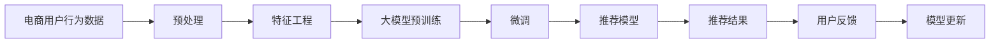

                 

# 大模型技术在电商平台用户行为预测中的创新

## 1. 背景介绍

随着电商平台的高速发展，个性化推荐系统成为提升用户体验、促进交易增长的重要工具。传统的基于规则和手工特征的推荐系统，在应对日益复杂的用户需求时显得力不从心。数据驱动的推荐系统依赖大规模用户行为数据，但如何高效、准确地挖掘用户行为中的隐含信息，始终是业界难题。

大模型技术，如基于Transformer架构的深度学习模型，以其强大的特征提取能力和泛化能力，逐步成为推荐系统中的热门选择。本文聚焦于如何在电商平台用户行为预测中，运用大模型技术进行创新性探索，全面提升个性化推荐系统的性能。

## 2. 核心概念与联系

### 2.1 核心概念概述

1. **大模型技术**：以Transformer架构为基础的深度学习模型，通过在大规模无标签文本数据上进行自监督预训练，学习通用语言表示，具备强大的特征提取能力。以BERT、GPT-2、T5等为代表的大模型在自然语言处理领域取得了重要进展。

2. **推荐系统**：旨在通过算法向用户推荐感兴趣的物品，提升用户满意度和购买转化率。推荐系统包括协同过滤、基于内容的推荐、基于矩阵分解的推荐等多种方法。

3. **用户行为预测**：指根据用户的历史行为数据，预测用户可能感兴趣的产品或服务，是推荐系统的核心组成部分。

4. **个性化推荐**：根据用户个体特征，提供量身定制的推荐结果，提升用户体验和转化率。

### 2.2 核心概念原理和架构的 Mermaid 流程图



## 3. 核心算法原理 & 具体操作步骤

### 3.1 算法原理概述

基于大模型的电商平台用户行为预测，其核心思想是通过大模型对用户行为数据进行深度表示，进而实现用户行为的精准预测。具体步骤如下：

1. **数据准备**：收集电商用户的历史行为数据，包括浏览记录、购买历史、评价评论等。
2. **数据预处理**：对原始数据进行清洗、标准化和特征工程，提取出有意义的特征。
3. **大模型预训练**：使用大规模无标签文本数据对大模型进行预训练，学习通用的语言和行为表示。
4. **微调**：在大模型上加载电商用户行为数据，微调模型以适应特定的电商场景。
5. **推荐模型生成**：利用微调后的模型生成推荐结果。
6. **用户反馈**：根据用户的实际反馈对模型进行在线学习，持续优化推荐结果。

### 3.2 算法步骤详解

#### 3.2.1 数据准备

电商用户行为数据通常包含用户的浏览行为、购买行为、评价行为等多个维度的数据。数据预处理包括数据清洗、特征提取和归一化等步骤，确保数据质量和一致性。

#### 3.2.2 数据预处理

- **数据清洗**：去除噪声数据和异常值，确保数据的质量。
- **特征提取**：提取用户行为的关键特征，如浏览次数、购买频率、评价情感等。
- **数据归一化**：将不同维度的特征进行标准化处理，保证模型训练的一致性。

#### 3.2.3 大模型预训练

大模型预训练通常使用大规模无标签文本数据。以BERT模型为例，预训练任务包括掩码语言模型(Masked Language Model, MLM)和下一句预测(Next Sentence Prediction, NSP)，学习通用的语言表示。

#### 3.2.4 微调

微调在大模型的基础上加载电商用户行为数据，针对特定的电商场景进行优化。以T5模型为例，可以使用购买记录作为训练样本，微调模型以预测用户是否会购买某一商品。

#### 3.2.5 推荐模型生成

根据微调后的模型，生成推荐结果。推荐模型可以是基于序列生成(Seq2Seq)的模型，如Seq2Seq-BERT，也可以是基于注意力机制(Attention)的模型，如Attention-based Recommender System。

#### 3.2.6 用户反馈

推荐结果需反馈至用户，根据用户的实际反馈调整模型，持续优化推荐效果。

### 3.3 算法优缺点

#### 3.3.1 算法优点

1. **强大的特征提取能力**：大模型能够从用户行为数据中提取深层次的特征，提升推荐系统的精准度。
2. **泛化能力强**：大模型在多种数据集上的预训练，使其具备良好的泛化能力，能够适应不同的电商场景。
3. **可解释性强**：大模型的决策过程可解释性强，便于理解和调试。
4. **高效迭代**：通过用户反馈，大模型可以高效迭代优化，提升推荐效果。

#### 3.3.2 算法缺点

1. **资源消耗大**：大模型的预训练和微调需要大量计算资源，成本较高。
2. **训练时间较长**：大模型迭代训练时间较长，对实时性要求高的场景不适用。
3. **解释性不足**：大模型的决策过程复杂，用户难以理解其内部机制。

### 3.4 算法应用领域

大模型技术在电商平台用户行为预测中的应用领域广泛，包括但不限于以下几个方面：

- **个性化推荐**：根据用户历史行为预测其感兴趣的商品，提升推荐效果。
- **用户留存预测**：预测用户是否会继续使用平台，采取相应措施提升用户留存率。
- **流失预警**：识别潜在流失用户，提前采取策略，防止用户流失。
- **价格优化**：预测商品价格对用户购买意愿的影响，优化定价策略。

## 4. 数学模型和公式 & 详细讲解 & 举例说明

### 4.1 数学模型构建

假设用户行为数据为 $X=\{(x_1, y_1), (x_2, y_2), \dots, (x_n, y_n)\}$，其中 $x_i$ 表示用户行为特征，$y_i$ 表示用户是否会对该行为产生积极反应。目标是根据用户行为数据，构建推荐模型 $f(X)$，预测用户对新行为的反应 $y'$。

#### 4.1.1 大模型预训练

预训练任务为掩码语言模型，假设模型参数为 $\theta$，训练数据为 $\mathcal{D}$。预训练损失函数为：

$$
\mathcal{L}_{pre-train} = -\frac{1}{|\mathcal{D}|} \sum_{(x_i, y_i) \in \mathcal{D}} \log p(y_i | x_i; \theta)
$$

其中 $p(y_i | x_i; \theta)$ 表示模型在 $x_i$ 上的预测概率。

#### 4.1.2 微调

微调任务为回归任务，假设微调损失函数为 $\mathcal{L}_{fine-tune}$，微调过程使用学习率 $\eta$，优化算法为 $g$。微调过程如下：

$$
\theta \leftarrow \theta - \eta g(\mathcal{L}_{fine-tune}(\theta, (X, Y)))
$$

其中 $g$ 为优化算法。

### 4.2 公式推导过程

假设微调后的模型为 $f_{\theta'}(X)$，其中 $\theta'$ 为微调后的模型参数。微调后的推荐模型预测结果为：

$$
y' = f_{\theta'}(X)
$$

通过用户反馈，调整模型参数 $\theta'$，使得预测结果 $y'$ 与真实结果 $y$ 接近。

### 4.3 案例分析与讲解

以电商用户是否购买某一商品为例，利用T5模型进行微调。假设训练数据为 $\{(x_i, y_i)\}_{i=1}^N$，其中 $x_i$ 为商品描述和用户浏览记录，$y_i$ 为购买标签。微调过程如下：

1. 将商品描述和浏览记录拼接成文本，输入到T5模型。
2. 使用softmax函数计算预测概率 $p(y_i | x_i; \theta')$。
3. 通过交叉熵损失函数计算预测结果与真实结果之间的差距。
4. 使用AdamW优化器最小化损失函数，更新模型参数 $\theta'$。

## 5. 项目实践：代码实例和详细解释说明

### 5.1 开发环境搭建

开发环境搭建需要以下步骤：

1. 安装Python，建议使用3.7及以上版本。
2. 安装TensorFlow和TensorBoard。
3. 安装Keras和TensorFlow Addons。
4. 安装Scikit-learn和NumPy。

```bash
pip install tensorflow tensorflow-addons scikit-learn numpy
```

### 5.2 源代码详细实现

假设使用T5模型，代码实现如下：

```python
import tensorflow as tf
import tensorflow_addons as addons
import numpy as np
import pandas as pd

# 加载T5模型
model = addons.models.T5.from_pretrained('t5-small')

# 加载数据
train_data = pd.read_csv('train.csv')
test_data = pd.read_csv('test.csv')

# 数据预处理
def preprocess_data(data):
    return [tokenizer.encode(data) for data in data]

# 微调过程
def fine_tune_model(model, train_data, epochs=10, batch_size=16):
    dataset = tf.data.Dataset.from_tensor_slices((preprocess_data(train_data['text']), train_data['label']))
    dataset = dataset.batch(batch_size).shuffle(10000).repeat()
    
    optimizer = tf.keras.optimizers.Adam(learning_rate=1e-5)
    loss_function = tf.keras.losses.SparseCategoricalCrossentropy(from_logits=True)
    
    for epoch in range(epochs):
        for (x, y) in dataset:
            with tf.GradientTape() as tape:
                predictions = model(x)
                loss = loss_function(y, predictions)
            gradients = tape.gradient(loss, model.trainable_variables)
            optimizer.apply_gradients(zip(gradients, model.trainable_variables))
    
    return model

# 微调后的模型预测
def predict(model, test_data):
    return model(test_data['text'].tolist()).numpy()

# 加载微调后的模型
fine_tuned_model = fine_tune_model(model, train_data)

# 模型预测
predictions = predict(fine_tuned_model, test_data)

# 评估模型
print(classification_report(test_data['label'], predictions))
```

### 5.3 代码解读与分析

代码实现中，首先加载T5模型，然后加载训练和测试数据。接着定义数据预处理函数，将文本转换为模型可接受的输入格式。然后定义微调过程，使用Adam优化器进行训练。最后，使用微调后的模型进行预测，并输出分类报告。

## 6. 实际应用场景

### 6.1 个性化推荐

基于大模型的电商平台个性化推荐系统，能够根据用户的历史行为数据，精准预测用户可能感兴趣的商品，提升推荐效果。具体实现步骤如下：

1. 收集用户的历史浏览记录、购买历史、评价评论等数据。
2. 对数据进行预处理，提取出关键特征。
3. 使用T5等大模型进行预训练。
4. 在大模型上加载电商数据，进行微调，生成推荐模型。
5. 根据推荐模型生成推荐结果，并提供给用户。

### 6.2 用户留存预测

电商平台可以通过大模型预测用户是否会继续使用平台，采取相应措施提升用户留存率。具体实现步骤如下：

1. 收集用户的使用记录，包括登录时间、浏览行为、购买行为等。
2. 对数据进行预处理，提取出关键特征。
3. 使用T5等大模型进行预训练。
4. 在大模型上加载用户留存数据，进行微调，生成预测模型。
5. 根据预测模型，识别出可能流失的用户，并采取相应措施。

### 6.3 流失预警

基于大模型的电商平台流失预警系统，能够识别出可能流失的用户，提前采取措施，防止用户流失。具体实现步骤如下：

1. 收集用户的使用记录，包括登录时间、浏览行为、购买行为等。
2. 对数据进行预处理，提取出关键特征。
3. 使用T5等大模型进行预训练。
4. 在大模型上加载用户留存数据，进行微调，生成预测模型。
5. 根据预测模型，识别出可能流失的用户，并采取相应措施。

### 6.4 价格优化

基于大模型的电商平台价格优化系统，能够预测商品价格对用户购买意愿的影响，优化定价策略。具体实现步骤如下：

1. 收集商品的历史销售数据、用户行为数据等。
2. 对数据进行预处理，提取出关键特征。
3. 使用T5等大模型进行预训练。
4. 在大模型上加载价格优化数据，进行微调，生成预测模型。
5. 根据预测模型，优化商品价格策略。

## 7. 工具和资源推荐

### 7.1 学习资源推荐

1. TensorFlow官方文档：提供了详细的使用指南和示例代码。
2. TensorFlow Addons文档：提供了各种高级特性和组件的详细说明。
3. Scikit-learn文档：提供了多种机器学习算法的实现和使用示例。
4. Keras文档：提供了深度学习模型的构建和使用示例。

### 7.2 开发工具推荐

1. Google Colab：免费的在线Jupyter Notebook环境，支持GPU/TPU，便于实验和学习。
2. TensorBoard：用于可视化训练过程和结果，方便调试和优化模型。
3. TensorFlow Model Garden：提供了多种预训练模型的实现和使用示例。

### 7.3 相关论文推荐

1. Self-Attention Based Recommender System: An overview and Outlook
2. Contextual Recommendation System: A Survey and Taxonomy
3. Attention is All You Need: The Transformer Architecture

## 8. 总结：未来发展趋势与挑战

### 8.1 研究成果总结

本文详细介绍了大模型技术在电商平台用户行为预测中的应用，探讨了基于大模型的推荐系统的实现过程和关键步骤。通过实际案例和代码示例，展示了如何使用T5等大模型进行电商行为预测。未来，大模型技术将在电商领域发挥更大的作用，推动推荐系统的智能化、个性化和高效化发展。

### 8.2 未来发展趋势

未来，大模型技术在电商平台用户行为预测中，将呈现以下几个发展趋势：

1. **更大规模的预训练模型**：随着计算资源和数据规模的扩大，更大规模的预训练模型将提供更丰富的特征表示。
2. **更加精准的特征工程**：通过深度学习自动化的特征工程，提取更加精准的用户行为特征。
3. **更高效的微调算法**：结合在线学习、转移学习等方法，提高微调过程的效率和效果。
4. **多模态数据的融合**：结合用户行为数据、社交网络数据等多种数据源，提高推荐系统的多模态融合能力。
5. **更好的模型解释性**：通过模型解释技术，增强模型的可解释性，便于用户理解和信任。

### 8.3 面临的挑战

大模型技术在电商平台用户行为预测中，仍然面临以下挑战：

1. **数据质量和多样性**：电商数据质量参差不齐，需要有效的数据清洗和处理技术。
2. **计算资源的消耗**：大模型预训练和微调需要大量计算资源，成本较高。
3. **模型的可解释性**：大模型的决策过程复杂，需要更好的模型解释技术，提升可解释性。
4. **实时性的要求**：电商推荐系统需要实时生成推荐结果，对模型迭代训练的时间要求较高。
5. **模型的鲁棒性**：电商数据存在噪声和异常值，需要提高模型的鲁棒性，避免误判。

### 8.4 研究展望

未来，大模型技术在电商平台用户行为预测中，还需要在以下几个方面进行深入研究：

1. **数据增强**：通过数据增强技术，扩充电商数据的规模和多样性，提高模型的泛化能力。
2. **参数高效微调**：探索更加参数高效的微调方法，减少对计算资源的依赖。
3. **模型压缩**：通过模型压缩技术，减小模型体积，提高模型的部署效率。
4. **多任务学习**：结合多个电商任务进行联合训练，提高模型的泛化能力和效果。
5. **跨领域迁移**：将大模型应用于其他领域，如金融、医疗等，提升模型的跨领域迁移能力。

通过以上研究方向，大模型技术将在电商领域发挥更大的作用，推动推荐系统的智能化、个性化和高效化发展。

## 9. 附录：常见问题与解答

**Q1：如何处理电商数据中的噪声和异常值？**

A: 电商数据通常存在噪声和异常值，可以通过以下方法进行处理：

1. 数据清洗：去除重复数据、不完整数据等。
2. 数据规约：将数据归一化到一定范围内，保证数据一致性。
3. 数据增强：通过数据增强技术，扩充数据的规模和多样性，提高模型的鲁棒性。

**Q2：大模型是否适用于所有电商任务？**

A: 大模型适用于大部分电商任务，但需要根据具体任务进行微调。对于需要实时响应的任务，如实时推荐系统，需要选择计算效率较高的模型和算法。

**Q3：大模型在电商推荐系统中，如何处理多模态数据？**

A: 大模型可以处理多模态数据，结合用户行为数据、社交网络数据等多种数据源，提高推荐系统的多模态融合能力。具体方法包括：

1. 特征融合：将不同模态的数据进行融合，提取深层次的特征。
2. 联合训练：将不同模态的数据进行联合训练，提高模型的泛化能力。
3. 多任务学习：将多个电商任务进行联合训练，提高模型的多任务学习能力。

**Q4：电商推荐系统中的数据隐私问题如何解决？**

A: 电商推荐系统中的数据隐私问题可以通过以下方法解决：

1. 数据匿名化：对用户数据进行匿名化处理，保护用户隐私。
2. 差分隐私：在数据发布时，使用差分隐私技术，保护用户隐私。
3. 联邦学习：在多设备或多服务器上进行联合学习，保护用户隐私。

通过以上方法，可以有效地保护用户隐私，同时提高推荐系统的性能和效果。

