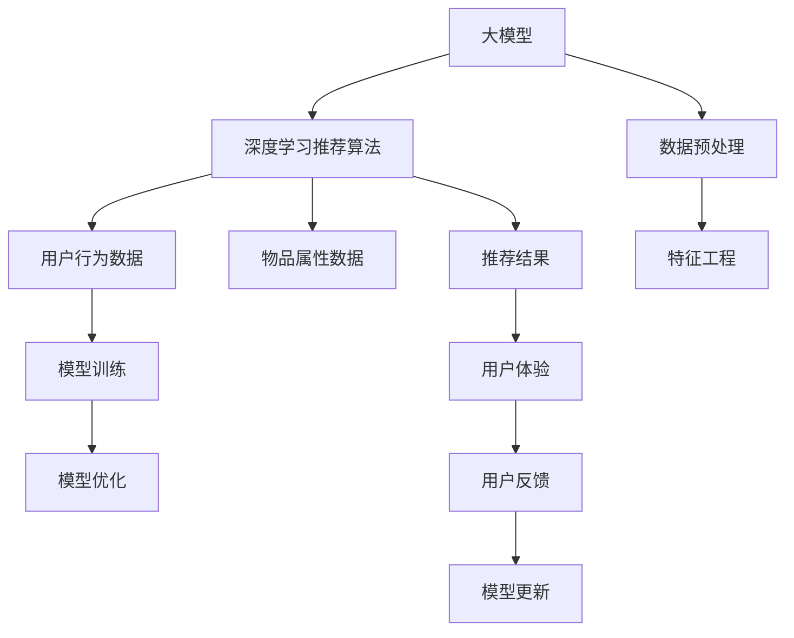

                 

# 大模型技术对电商用户体验的提升效果分析

> 关键词：大模型技术,电商用户体验,客户推荐系统,个性化推荐,深度学习,用户体验优化

## 1. 背景介绍

### 1.1 问题由来

近年来，随着电子商务的迅猛发展，各大电商平台为了提升用户体验，纷纷投入大量资源优化购物体验，包括商品搜索、推荐系统、购物车等功能的改进。传统的基于规则的推荐算法由于缺乏足够的背景知识，很难满足用户的个性化需求，而基于深度学习的大模型推荐算法，通过对用户行为的深度学习，可以有效提高推荐系统的准确性，提升用户满意度。

本文将深入分析大模型技术在电商推荐系统中的应用，从算法原理、操作过程、效果评估等多个维度探讨大模型技术对电商用户体验的提升效果。

## 2. 核心概念与联系

### 2.1 核心概念概述

在电商推荐系统中，大模型技术主要体现在基于深度学习的推荐算法上。大模型通过预训练大量的用户行为数据，能够学习到用户行为背后的复杂关联，从而在推荐过程中提供更加个性化的推荐。核心概念包括：

- 大模型（Large Model）：指具有巨大参数量的深度神经网络模型，如BERT、GPT等。通过大规模数据预训练，大模型具备强大的数据建模能力。
- 深度学习（Deep Learning）：一种基于神经网络的机器学习算法，通过多层次的特征抽取和融合，可以处理复杂的非线性关系。
- 推荐系统（Recommendation System）：通过分析用户的历史行为数据，向用户推荐其可能感兴趣的物品。
- 个性化推荐（Personalized Recommendation）：根据用户的具体特点，为其提供差异化的推荐结果。
- 用户体验（User Experience, UX）：衡量用户对产品的满意度，包括易用性、功能性、安全性等各方面。

这些概念之间有紧密的联系。大模型技术的引入，使得推荐系统从基于规则的系统转变为基于深度学习的智能系统，能够更好地适应用户的个性化需求，提升用户体验。

### 2.2 核心概念原理和架构的 Mermaid 流程图



这个流程图展示了大模型在电商推荐系统中的工作流程。大模型通过预训练和微调，学习用户行为数据和物品属性数据，然后通过深度学习算法生成推荐结果，最终影响用户体验。

## 3. 核心算法原理 & 具体操作步骤

### 3.1 算法原理概述

电商推荐系统通常采用基于协同过滤、内容推荐和混合推荐的算法。协同过滤算法根据用户的历史行为和相似用户的行为进行推荐，但需要大规模的用户行为数据。内容推荐算法根据物品的特征和用户的偏好进行推荐，但需要丰富的物品属性数据。混合推荐算法结合了协同过滤和内容推荐，综合利用多种数据源，提升推荐效果。

大模型推荐算法通过在大规模用户行为数据上预训练，能够学习到用户行为背后的复杂关联，从而提供更加个性化的推荐。主要算法原理如下：

1. 数据预处理：清洗用户行为数据和物品属性数据，提取有意义的特征，如用户的浏览历史、购买历史、评分历史等。
2. 特征工程：将处理后的数据进行特征选择和特征提取，如用户行为向量、物品属性向量等。
3. 深度学习推荐算法：使用深度神经网络模型，如RNN、LSTM、BERT等，对用户和物品进行编码，预测用户对物品的评分，生成推荐结果。
4. 模型训练和优化：在大规模数据上训练深度学习模型，并使用优化算法调整模型参数，提升模型效果。
5. 推荐结果输出：将模型输出的推荐结果进行排序，选择最符合用户兴趣的物品进行推荐。

### 3.2 算法步骤详解

以下以一个基于深度学习的推荐系统为例，详细介绍其操作步骤：

**Step 1: 数据准备**

- 收集用户的历史行为数据，包括浏览记录、购买记录、评分记录等。
- 收集物品的属性数据，如商品名称、价格、分类等。
- 对数据进行清洗和预处理，去除噪声和异常值，填补缺失值。
- 使用特征工程方法，将用户行为和物品属性转化为特征向量。

**Step 2: 模型选择**

- 选择合适的深度学习模型，如BERT、RNN、LSTM等。
- 设计模型的输入输出结构，如用户行为向量、物品属性向量、评分等。

**Step 3: 模型训练**

- 在训练集上对模型进行训练，使用优化算法调整模型参数，如Adam、SGD等。
- 在验证集上评估模型效果，选择最优的模型参数。
- 在测试集上进一步验证模型效果，确保模型的泛化能力。

**Step 4: 推荐结果生成**

- 根据用户输入的行为数据，生成推荐结果，包括推荐物品的ID、评分、排序等。
- 使用推荐算法对结果进行排序，如基于评分、时间、热门等。
- 对推荐结果进行页面展示，并根据用户反馈进行实时更新。

**Step 5: 模型优化**

- 根据用户反馈和点击行为，对模型进行在线更新和优化，提升模型效果。
- 使用A/B测试等方法，评估推荐算法的效果，选择最优方案。

### 3.3 算法优缺点

大模型推荐算法具有以下优点：

1. 能够处理大规模、复杂的数据。大模型通过预训练和微调，可以学习到复杂的用户行为和物品属性关联，适用于大规模推荐系统。
2. 能够提供更加个性化的推荐。大模型能够学习到用户和物品的深度特征，能够提供更加精准的个性化推荐。
3. 能够适应不断变化的用户需求。大模型可以持续学习新数据，适应用户兴趣的变化。

同时，大模型推荐算法也存在以下缺点：

1. 需要大规模的标注数据。大模型推荐算法需要大量的用户行为数据和物品属性数据，获取和标注成本较高。
2. 需要高计算资源。大模型需要大量的计算资源进行训练和推理，对硬件要求较高。
3. 容易受到数据偏差的影响。大模型训练的模型可能受到训练数据偏差的影响，导致推荐结果出现偏差。

### 3.4 算法应用领域

大模型推荐算法在电商推荐系统中应用广泛，涵盖商品推荐、用户画像生成、个性化展示等多个方面。以下是主要应用领域：

- 商品推荐：根据用户的历史行为和物品属性，生成个性化的推荐商品。
- 用户画像生成：根据用户的行为和属性，生成用户画像，帮助用户更好的进行个性化推荐。
- 个性化展示：根据用户的行为和偏好，生成个性化的商品展示页面。
- 实时更新：根据用户的实时行为和反馈，实时更新推荐结果，提升用户体验。

## 4. 数学模型和公式 & 详细讲解 & 举例说明

### 4.1 数学模型构建

大模型推荐算法主要使用深度神经网络进行建模。以下是一个简单的模型结构：

$$
\begin{aligned}
&h_u = f_U([u_1, u_2, ..., u_n]) \\
&h_i = f_I([i_1, i_2, ..., i_n]) \\
&r_{ui} = h_u^T W r_i \\
&p_{ui} = \sigma(r_{ui}^T b)
\end{aligned}
$$

其中 $u$ 表示用户，$i$ 表示物品，$h_u$ 和 $h_i$ 表示用户和物品的隐向量，$W$ 和 $b$ 表示模型的参数，$\sigma$ 表示激活函数，$p_{ui}$ 表示用户对物品的评分预测。

### 4.2 公式推导过程

在大模型推荐算法中，主要通过学习用户行为和物品属性之间的关联，预测用户对物品的评分。以下是评分预测的公式推导过程：

1. 将用户行为和物品属性转化为隐向量 $h_u$ 和 $h_i$。
2. 计算用户和物品之间的交互向量 $r_{ui} = h_u^T W r_i$。
3. 使用激活函数 $\sigma$ 将交互向量转化为评分预测 $p_{ui} = \sigma(r_{ui}^T b)$。

其中 $W$ 和 $b$ 表示模型的参数，可以通过深度学习算法进行优化。

### 4.3 案例分析与讲解

以一个简单的电商推荐系统为例，使用基于BERT的推荐算法。

**输入**：用户的历史浏览记录和物品的属性信息。

**输出**：推荐给用户的物品列表。

**过程**：

1. 使用BERT模型将用户行为和物品属性转化为隐向量。
2. 计算用户和物品之间的交互向量，使用线性变换和激活函数转化为评分预测。
3. 根据评分预测结果，生成推荐物品列表。

使用BERT模型的好处在于，它可以通过大规模预训练学习到语言和物品之间的深度关联，能够提供更加精准的推荐结果。

## 5. 项目实践：代码实例和详细解释说明

### 5.1 开发环境搭建

开发电商推荐系统需要使用深度学习框架，如TensorFlow、PyTorch等。以下是使用PyTorch搭建环境的示例：

1. 安装Anaconda：从官网下载并安装Anaconda，用于创建独立的Python环境。

2. 创建并激活虚拟环境：
```bash
conda create -n pytorch-env python=3.8 
conda activate pytorch-env
```

3. 安装PyTorch：根据CUDA版本，从官网获取对应的安装命令。例如：
```bash
conda install pytorch torchvision torchaudio cudatoolkit=11.1 -c pytorch -c conda-forge
```

4. 安装各类工具包：
```bash
pip install numpy pandas scikit-learn matplotlib tqdm jupyter notebook ipython
```

### 5.2 源代码详细实现

以下是使用PyTorch搭建基于BERT的电商推荐系统的示例代码：

```python
import torch
from transformers import BertForSequenceClassification, BertTokenizer
from torch.utils.data import Dataset, DataLoader
import pandas as pd

class UserBehaviorDataset(Dataset):
    def __init__(self, data, tokenizer):
        self.data = data
        self.tokenizer = tokenizer
        
    def __len__(self):
        return len(self.data)
    
    def __getitem__(self, idx):
        row = self.data.iloc[idx]
        user_behavior = row['user_behavior']
        item_attributes = row['item_attributes']
        
        # 使用BERT进行编码
        user_input = self.tokenizer.encode_plus(user_behavior, add_special_tokens=True, max_length=512, return_tensors='pt')
        item_input = self.tokenizer.encode_plus(item_attributes, add_special_tokens=True, max_length=512, return_tensors='pt')
        
        return {
            'user_input_ids': user_input['input_ids'],
            'user_attention_mask': user_input['attention_mask'],
            'item_input_ids': item_input['input_ids'],
            'item_attention_mask': item_input['attention_mask']
        }
        
def model_forward(user_input_ids, user_attention_mask, item_input_ids, item_attention_mask):
    # 定义模型
    model = BertForSequenceClassification.from_pretrained('bert-base-uncased')
    model.eval()
    
    # 前向传播
    with torch.no_grad():
        user_output = model(user_input_ids, attention_mask=user_attention_mask)
        item_output = model(item_input_ids, attention_mask=item_attention_mask)
    
    return user_output, item_output

# 读取数据
data = pd.read_csv('user_behavior.csv')

# 定义模型参数
tokenizer = BertTokenizer.from_pretrained('bert-base-uncased')
device = torch.device('cuda') if torch.cuda.is_available() else torch.device('cpu')

# 加载数据集
dataset = UserBehaviorDataset(data, tokenizer)

# 定义数据加载器
dataloader = DataLoader(dataset, batch_size=64, shuffle=False)

# 前向传播
for batch in dataloader:
    user_input_ids = batch['user_input_ids'].to(device)
    user_attention_mask = batch['user_attention_mask'].to(device)
    item_input_ids = batch['item_input_ids'].to(device)
    item_attention_mask = batch['item_attention_mask'].to(device)
    
    user_output, item_output = model_forward(user_input_ids, user_attention_mask, item_input_ids, item_attention_mask)
```

### 5.3 代码解读与分析

代码中首先定义了UserBehaviorDataset类，用于处理用户行为数据和物品属性数据。接着定义了模型前向传播函数，使用BertForSequenceClassification模型对用户行为和物品属性进行编码，并计算评分预测。最后，使用DataLoader加载数据，并使用前向传播函数进行模型推理。

## 6. 实际应用场景

### 6.1 智能推荐引擎

大模型技术在电商推荐系统中可以应用于智能推荐引擎。通过分析用户的历史行为和物品属性，生成个性化的推荐结果。智能推荐引擎可以提高用户的购物体验，增加用户留存率，提升销售额。

在实际应用中，可以将用户的行为数据和物品的属性数据输入到模型中，生成推荐结果。同时，可以根据用户的实时行为和反馈，实时更新推荐结果，提升推荐效果。

### 6.2 用户画像生成

用户画像是指根据用户的行为和属性，生成用户画像，帮助用户更好的进行个性化推荐。大模型技术可以通过对用户行为和物品属性数据的深度学习，生成用户画像。

用户画像生成可以提高推荐系统的精准度，提升用户的购物体验。通过用户画像，可以为用户提供更加个性化的推荐，增加用户的满意度和粘性。

### 6.3 个性化展示

个性化展示可以根据用户的兴趣和需求，生成个性化的商品展示页面。大模型技术可以通过对用户行为和物品属性数据的深度学习，生成个性化的展示页面。

个性化展示可以提高用户的浏览体验，增加用户的停留时间和购买率。通过个性化的展示，可以更好地满足用户的需求，提升用户满意度。

## 7. 工具和资源推荐

### 7.1 学习资源推荐

为了帮助开发者系统掌握大模型技术在电商推荐系统中的应用，这里推荐一些优质的学习资源：

1. 《深度学习推荐系统：理论与实践》书籍：该书详细介绍了深度学习在推荐系统中的应用，包括电商推荐系统的构建和优化。

2. 《TensorFlow深度学习实战》书籍：该书介绍了TensorFlow在电商推荐系统中的应用，涵盖数据预处理、模型构建、训练和优化等多个方面。

3. Coursera《深度学习与推荐系统》课程：由斯坦福大学开设的课程，涵盖深度学习在推荐系统中的应用，适合初学者学习。

4. Kaggle电商推荐系统竞赛：Kaggle是一个数据科学竞赛平台，定期举办电商推荐系统竞赛，可以提供实际应用中的案例和数据。

5. GitHub开源项目：GitHub上有大量的电商推荐系统开源项目，可以借鉴和参考。

通过对这些资源的学习实践，相信你一定能够快速掌握大模型技术在电商推荐系统中的应用，并用于解决实际的电商推荐问题。

### 7.2 开发工具推荐

大模型技术在电商推荐系统中需要使用深度学习框架和工具。以下是一些常用的开发工具：

1. PyTorch：基于Python的开源深度学习框架，灵活动态的计算图，适合快速迭代研究。

2. TensorFlow：由Google主导开发的开源深度学习框架，生产部署方便，适合大规模工程应用。

3. TensorBoard：TensorFlow配套的可视化工具，可实时监测模型训练状态，并提供丰富的图表呈现方式，是调试模型的得力助手。

4. Weights & Biases：模型训练的实验跟踪工具，可以记录和可视化模型训练过程中的各项指标，方便对比和调优。

5. Jupyter Notebook：一个交互式的编程环境，支持Python、R等多种语言，可以方便地进行模型实验和数据处理。

合理利用这些工具，可以显著提升电商推荐系统的开发效率，加快创新迭代的步伐。

### 7.3 相关论文推荐

大模型技术在电商推荐系统中的应用源于学界的持续研究。以下是几篇奠基性的相关论文，推荐阅读：

1. "Deep Contextual Bandits for E-commerce：A Summary of Research and Empirical Findings"：介绍了深度学习在电商推荐系统中的应用，包括用户行为建模、个性化推荐、模型评估等多个方面。

2. "An Efficient Personalized Recommendation System for E-commerce using Deep Learning"：提出了一种基于深度学习的个性化推荐系统，展示了其在电商推荐系统中的应用效果。

3. "A Survey on Personalized Recommendation Systems for E-commerce"：综述了电商推荐系统的研究进展，包括基于协同过滤、基于内容的推荐、深度学习推荐等多个方面。

4. "A Multi-objective Personalized Recommendation System for E-commerce"：提出了一种多目标优化推荐系统，提升了电商推荐系统的用户满意度和推荐效果。

5. "Reinforcement Learning for E-commerce Personalized Recommendations"：提出了一种基于强化学习的推荐系统，展示了其在电商推荐系统中的应用效果。

这些论文代表了大模型技术在电商推荐系统中的应用方向和研究成果，对深入理解电商推荐系统具有重要意义。

## 8. 总结：未来发展趋势与挑战

### 8.1 研究成果总结

大模型技术在电商推荐系统中已经取得了显著的成果，提升了用户的购物体验，增加了用户的留存率和销售额。未来，随着深度学习技术的发展，大模型技术将进一步优化电商推荐系统的精准度和效果。

### 8.2 未来发展趋势

1. 模型规模持续增大。随着算力成本的下降和数据规模的扩张，大模型推荐算法的参数量将进一步增大，模型的表达能力和泛化能力将进一步提升。

2. 深度学习技术不断发展。深度学习技术将继续发展，新的模型结构和优化算法将不断涌现，提升电商推荐系统的精准度和效果。

3. 数据处理技术不断优化。数据处理技术的不断优化，如数据清洗、特征工程、模型训练等，将进一步提升电商推荐系统的性能。

4. 实时推荐系统成为趋势。实时推荐系统能够及时响应用户的实时行为和反馈，提升用户体验和系统效果。

5. 多模态数据融合成为趋势。多模态数据融合技术，如文本、图像、视频等多模态数据联合推荐，将进一步提升电商推荐系统的效果。

### 8.3 面临的挑战

尽管大模型技术在电商推荐系统中已经取得了显著的成果，但在迈向更加智能化、普适化应用的过程中，它仍面临着诸多挑战：

1. 标注数据获取成本高。大模型推荐系统需要大量的标注数据，获取和标注成本较高，如何降低标注成本成为一大难题。

2. 模型复杂度较高。大模型推荐算法的复杂度较高，需要高计算资源进行训练和推理，如何提升模型效率成为一大挑战。

3. 数据偏差问题。大模型推荐算法可能受到训练数据偏差的影响，导致推荐结果出现偏差，如何降低数据偏差成为一大挑战。

4. 用户隐私问题。电商推荐系统需要收集用户的浏览记录和购买记录，如何保障用户隐私成为一大挑战。

5. 模型解释性问题。大模型推荐算法的黑盒特性，使得其难以解释推荐结果的逻辑和原因，如何提升模型的可解释性成为一大挑战。

### 8.4 研究展望

面对电商推荐系统中的诸多挑战，未来需要从以下几个方向进行探索：

1. 数据获取和标注技术的发展。如何降低标注成本，提升数据获取效率，是未来研究的重要方向。

2. 模型优化和效率提升。如何提升模型的效率，降低计算资源消耗，是未来研究的重要方向。

3. 多模态数据融合技术的发展。如何提升多模态数据的融合能力，提升电商推荐系统的效果，是未来研究的重要方向。

4. 用户隐私保护技术的发展。如何保障用户隐私，提升用户信任度，是未来研究的重要方向。

5. 模型可解释性的提升。如何提升模型的可解释性，增强用户对推荐结果的理解和信任，是未来研究的重要方向。

## 9. 附录：常见问题与解答

**Q1：大模型推荐算法是否适用于所有电商推荐系统？**

A: 大模型推荐算法在大多数电商推荐系统中都能取得不错的效果，特别是对于数据量较小的电商推荐系统。但对于一些特定领域的电商推荐系统，如医疗、教育等，仅仅依靠通用语料预训练的模型可能难以很好地适应。此时需要在特定领域语料上进一步预训练，再进行微调，才能获得理想效果。

**Q2：大模型推荐算法需要多少标注数据？**

A: 大模型推荐算法需要大量的标注数据，一般需要几十万甚至数百万条标注数据，才能得到理想的推荐效果。标注数据的获取和标注成本较高，如何降低标注成本，提升标注数据的质量，是未来研究的重要方向。

**Q3：大模型推荐算法是否需要进行超参数调优？**

A: 大模型推荐算法需要进行超参数调优，以确保模型在不同场景下都能取得较好的效果。常用的超参数包括学习率、批大小、迭代轮数等，需要进行多次实验和调整，找到最优的超参数组合。

**Q4：大模型推荐算法是否需要进行模型更新？**

A: 大模型推荐算法需要实时更新，以应对用户行为的变化和推荐效果的变化。可以使用在线学习算法，如AdaGrad、SGD等，实时更新模型参数，提升推荐效果。

**Q5：大模型推荐算法是否需要进行模型裁剪？**

A: 大模型推荐算法可以进行模型裁剪，去除不必要的层和参数，减小模型尺寸，加快推理速度。模型裁剪可以提升模型的效率和性能，但需要保证模型的效果不受影响。

**Q6：大模型推荐算法是否需要进行数据增强？**

A: 大模型推荐算法需要进行数据增强，以提高模型的泛化能力和鲁棒性。数据增强可以通过回译、近义替换等方式扩充训练集，提高模型的表现。

**Q7：大模型推荐算法是否需要进行对抗训练？**

A: 大模型推荐算法可以进行对抗训练，提高模型的鲁棒性和安全性。对抗训练可以通过加入对抗样本，提升模型对噪声的鲁棒性，防止模型被攻击。

**Q8：大模型推荐算法是否需要进行模型压缩？**

A: 大模型推荐算法可以进行模型压缩，减小模型的存储和计算开销。模型压缩可以通过剪枝、量化等方式进行，提高模型的效率和性能。

**Q9：大模型推荐算法是否需要进行模型并行？**

A: 大模型推荐算法可以进行模型并行，提高模型的计算速度和处理能力。模型并行可以通过分布式训练、多GPU训练等方式进行，提高模型的效率和性能。

**Q10：大模型推荐算法是否需要进行模型融合？**

A: 大模型推荐算法可以进行模型融合，提升模型的效果和鲁棒性。模型融合可以通过集成多个模型，综合其输出进行推荐，提高模型的表现。

通过以上问题的回答，相信你一定能够更加全面地理解大模型技术在电商推荐系统中的应用，并用于解决实际的电商推荐问题。

---

作者：禅与计算机程序设计艺术 / Zen and the Art of Computer Programming

