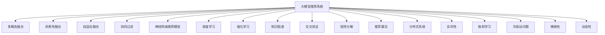
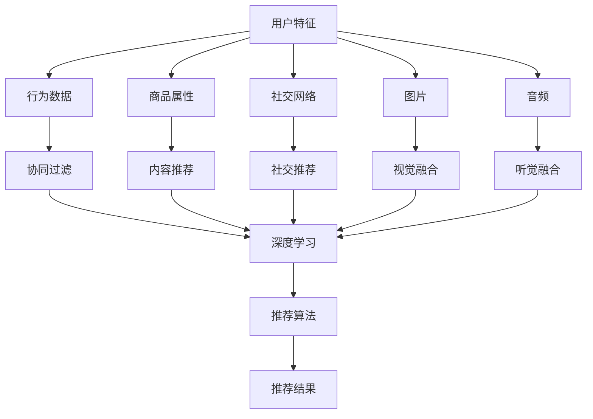

                 

# 大模型推荐系统未来：统一与融合

> 关键词：大模型推荐系统,统一与融合,多模态融合,异质性融合,自适应融合,协同过滤,神经网络推荐模型,深度学习,强化学习,知识图谱,交叉验证,矩阵分解,推荐算法,分布式系统,实时性,联邦学习,冷启动问题,稀疏性,动态性

## 1. 背景介绍

### 1.1 问题由来

推荐系统作为信息时代的重要工具，其发展经历了从规则基础到统计模型，再到深度学习模型三个阶段。传统推荐系统大多基于协同过滤、矩阵分解等方法，依赖用户行为数据，往往忽略了内容和内容的深度语义关联，导致推荐效果和用户体验欠佳。随着深度学习技术的发展，推荐系统逐步从基于内容的模型转变为以深度神经网络为核心的模型。

尽管深度学习推荐模型已经取得显著进展，但仍然存在诸多局限：

- 对于长尾冷启动问题，深度模型表现欠佳。
- 数据稀疏性、动态性等挑战难以有效应对。
- 模型往往仅考虑单模态数据，无法充分融合多模态信息。
- 对数据分布变化的适应能力不足，难以在实时场景中优化推荐策略。

鉴于此，结合多模态融合和异质性融合技术，构建更加智能和适应的推荐系统成为了当前研究的热点。这种基于大模型架构的推荐系统，能更好地处理多源异构数据，提升推荐效果和用户满意度。

### 1.2 问题核心关键点

本研究聚焦于基于大模型架构的推荐系统。首先对核心概念进行定义和关联，并给出关键流程图。

1. **大模型推荐系统**：
   - 指以大规模深度神经网络为核心的推荐系统，能够处理海量的用户行为、商品属性等多源异构数据。
   - 基于自监督或监督预训练的方法学习用户、商品和交互数据之间的深度语义关联。
   - 支持多模态数据融合和异质性融合，实现更加全面、精准的推荐。

2. **多模态融合**：
   - 指融合不同类型的数据（文本、图片、音频等）以提升推荐效果。
   - 需要考虑不同模态之间的语义一致性和协同关联性，如何有效融合数据是多模态融合的关键。

3. **异质性融合**：
   - 指融合不同类型的数据源（行为数据、内容数据、社交数据等）以获得更全面的用户画像。
   - 需要考虑数据源之间的语义异质性，如何消除数据源之间的矛盾冲突。

4. **自适应融合**：
   - 指根据用户特征和交互数据，动态调整数据融合策略，提升推荐模型的个性化和实时性。
   - 需要引入外部知识或动态规则，动态调整融合策略以应对变化。

5. **协同过滤**：
   - 指通过用户间的交互数据来预测用户对未交互商品的评分或偏好，解决长尾冷启动问题。
   - 可以采用基于矩阵分解的方法，或者构建基于深度学习的协同过滤模型。

6. **神经网络推荐模型**：
   - 指利用深度神经网络对用户行为数据进行建模，学习用户隐含的偏好。
   - 常用的模型包括循环神经网络（RNN）、卷积神经网络（CNN）、深度神经网络（DNN）等。

7. **深度学习**：
   - 指通过深度神经网络对推荐任务进行建模，学习用户和商品之间的复杂关联。
   - 常用的深度学习算法包括自编码器、卷积神经网络、循环神经网络、对抗生成网络等。

8. **强化学习**：
   - 指通过与环境的交互，学习最优的推荐策略。
   - 可以结合用户反馈信息，动态调整推荐策略，实现推荐系统的实时优化。

9. **知识图谱**：
   - 指利用图结构表示知识，以知识图谱为基础进行推荐。
   - 可以构建商品关系图谱，用于商品相似度计算和推荐。

10. **交叉验证**：
    - 指将数据集划分为训练集和测试集，通过交叉验证方法评估模型的性能。
    - 可以采用k-fold交叉验证、时间序列交叉验证等方法。

11. **矩阵分解**：
    - 指将用户-商品评分矩阵分解为两个低秩矩阵的乘积，用于减少计算复杂度。
    - 常用的矩阵分解算法包括奇异值分解（SVD）、交替最小二乘（ALS）等。

12. **推荐算法**：
    - 指用于计算推荐结果的算法，包括基于内容的推荐、协同过滤推荐、混合推荐等。
    - 需要结合数据特点和推荐场景选择合适的算法。

13. **分布式系统**：
    - 指利用多台计算机并行处理推荐任务，提升推荐系统的处理速度和可扩展性。
    - 需要设计分布式算法和存储策略，实现高效的数据处理和模型训练。

14. **实时性**：
    - 指推荐系统需要根据用户的实时行为和偏好，动态调整推荐结果。
    - 需要引入缓存和流计算等技术，实现实时推荐。

15. **联邦学习**：
    - 指在数据分布式的情况下，通过分布式深度学习模型训练实现协同学习。
    - 可以结合本地数据和全局模型，提升推荐模型的泛化能力。

这些概念之间的逻辑关系可以通过以下Mermaid流程图来展示：



这个流程图展示了大模型推荐系统的核心概念及其关联：

1. 大模型推荐系统通过融合多模态数据和异质性数据，学习用户和商品的深度语义关联。
2. 基于神经网络推荐模型，结合深度学习、强化学习等方法，对用户行为数据进行建模，学习用户隐含的偏好。
3. 考虑推荐系统的实时性和分布式特性，引入缓存和流计算等技术，提升推荐系统的处理速度和可扩展性。
4. 结合联邦学习，在不同用户间共享模型参数，提升模型的泛化能力。
5. 通过矩阵分解、交叉验证等方法，对模型进行评估和优化。

这些概念共同构成了大模型推荐系统的理论基础和技术框架。

## 2. 核心概念与联系

### 2.1 核心概念概述

为更好地理解大模型推荐系统的工作原理，本节将详细介绍一些核心概念：

- **多模态数据**：指包含多种类型的数据，如文本、图片、音频等。多模态融合指将这些不同类型的数据进行协同关联，以提升推荐效果。
- **异质性数据**：指不同类型的数据源，如行为数据、内容数据、社交数据等。异质性融合指将这些不同类型的数据进行联合建模，获得更全面的用户画像。
- **自适应融合**：指根据用户特征和交互数据，动态调整数据融合策略，提升推荐模型的个性化和实时性。
- **协同过滤**：指通过用户间的交互数据来预测用户对未交互商品的评分或偏好，解决长尾冷启动问题。
- **神经网络推荐模型**：指利用深度神经网络对用户行为数据进行建模，学习用户隐含的偏好。
- **深度学习**：指通过深度神经网络对推荐任务进行建模，学习用户和商品之间的复杂关联。
- **强化学习**：指通过与环境的交互，学习最优的推荐策略。
- **知识图谱**：指利用图结构表示知识，以知识图谱为基础进行推荐。
- **交叉验证**：指将数据集划分为训练集和测试集，通过交叉验证方法评估模型的性能。
- **矩阵分解**：指将用户-商品评分矩阵分解为两个低秩矩阵的乘积，用于减少计算复杂度。
- **推荐算法**：指用于计算推荐结果的算法，包括基于内容的推荐、协同过滤推荐、混合推荐等。
- **分布式系统**：指利用多台计算机并行处理推荐任务，提升推荐系统的处理速度和可扩展性。
- **实时性**：指推荐系统需要根据用户的实时行为和偏好，动态调整推荐结果。
- **联邦学习**：指在数据分布式的情况下，通过分布式深度学习模型训练实现协同学习。
- **冷启动问题**：指新用户或新商品没有足够的历史行为数据，导致推荐系统无法准确预测其偏好。
- **稀疏性**：指用户-商品评分矩阵稀疏，难以直接建模。
- **动态性**：指用户和商品的偏好会随时间变化，推荐系统需要实时更新。

这些概念之间的关系可以通过以下Mermaid流程图来展示：



这个流程图展示了大模型推荐系统的核心概念及其相互关系：

1. 用户特征可以从行为数据、商品属性、社交网络、图片、音频等多模态数据中获取，用于协同过滤、内容推荐、社交推荐等。
2. 通过深度学习模型对用户行为数据进行建模，学习用户隐含的偏好。
3. 利用视觉融合和听觉融合技术，将图片和音频等异质性数据进行联合建模，提升推荐效果。
4. 根据推荐算法，计算推荐结果。

## 3. 核心算法原理 & 具体操作步骤
### 3.1 算法原理概述

大模型推荐系统通过深度学习模型对用户行为数据进行建模，结合多模态数据融合和异质性融合技术，学习用户和商品的深度语义关联。具体流程如下：

1. **数据预处理**：对用户行为数据、商品属性、图片、音频等多模态数据进行标准化和特征提取，构建统一的数据格式。
2. **多模态融合**：将不同类型的数据进行联合建模，学习不同模态之间的深度语义关联。
3. **异质性融合**：将不同类型的数据源进行联合建模，学习不同数据源之间的深度语义关联。
4. **自适应融合**：根据用户特征和交互数据，动态调整数据融合策略，提升推荐模型的个性化和实时性。
5. **协同过滤**：结合用户交互数据，预测用户对未交互商品的评分或偏好，解决长尾冷启动问题。
6. **深度学习**：通过深度神经网络对用户行为数据进行建模，学习用户隐含的偏好。
7. **强化学习**：结合用户反馈信息，动态调整推荐策略，实现推荐系统的实时优化。
8. **推荐算法**：根据数据特点和推荐场景，选择合适的推荐算法，计算推荐结果。
9. **评估优化**：通过交叉验证和矩阵分解等方法，评估和优化推荐模型的性能。

### 3.2 算法步骤详解

下面以基于Transformer架构的推荐系统为例，详细介绍推荐系统的主要算法步骤：

1. **数据预处理**：
   - 对用户行为数据、商品属性、图片、音频等多模态数据进行标准化和特征提取，构建统一的数据格式。
   - 将不同类型的数据拼接成一个向量，作为Transformer的输入。

2. **多模态融合**：
   - 将不同类型的数据进行联合建模，学习不同模态之间的深度语义关联。
   - 使用Transformer的Multi-head Attention机制，将不同模态的数据进行联合建模。

3. **异质性融合**：
   - 将不同类型的数据源进行联合建模，学习不同数据源之间的深度语义关联。
   - 将不同数据源的数据拼接成一个向量，作为Transformer的输入，学习不同数据源之间的关联。

4. **自适应融合**：
   - 根据用户特征和交互数据，动态调整数据融合策略，提升推荐模型的个性化和实时性。
   - 引入外部知识或动态规则，动态调整融合策略以应对变化。

5. **协同过滤**：
   - 结合用户交互数据，预测用户对未交互商品的评分或偏好，解决长尾冷启动问题。
   - 使用协同过滤算法，预测用户对未交互商品的评分。

6. **深度学习**：
   - 通过深度神经网络对用户行为数据进行建模，学习用户隐含的偏好。
   - 使用深度学习模型，如Transformer、CNN、RNN等，对用户行为数据进行建模。

7. **强化学习**：
   - 结合用户反馈信息，动态调整推荐策略，实现推荐系统的实时优化。
   - 使用强化学习算法，如Q-learning、SARSA等，根据用户反馈信息动态调整推荐策略。

8. **推荐算法**：
   - 根据数据特点和推荐场景，选择合适的推荐算法，计算推荐结果。
   - 使用推荐算法，如基于内容的推荐、协同过滤推荐、混合推荐等。

9. **评估优化**：
   - 通过交叉验证和矩阵分解等方法，评估和优化推荐模型的性能。
   - 使用交叉验证方法，如k-fold交叉验证、时间序列交叉验证等，评估模型的性能。

### 3.3 算法优缺点

大模型推荐系统具有以下优点：

1. 能够处理多源异构数据，提升推荐效果和用户满意度。
2. 结合深度学习、强化学习等技术，提升推荐模型的个性化和实时性。
3. 结合联邦学习，在不同用户间共享模型参数，提升模型的泛化能力。

同时，大模型推荐系统也存在以下缺点：

1. 对数据量和计算资源的需求较高，需要高性能计算机和大数据存储系统。
2. 数据融合和模型训练的复杂度较高，需要设计高效的算法和数据结构。
3. 模型解释性和透明性不足，难以解释推荐结果背后的原因。

### 3.4 算法应用领域

大模型推荐系统已经在众多领域得到了广泛应用，例如：

1. 电子商务推荐：为用户推荐感兴趣的商品。通过深度学习模型，结合用户行为数据、商品属性、图片等多模态数据，进行多模态融合和异质性融合，提升推荐效果。

2. 内容推荐：为用户推荐感兴趣的文章、视频等。结合用户行为数据、文章属性、图片等多模态数据，进行多模态融合和异质性融合，提升推荐效果。

3. 社交网络推荐：为用户推荐感兴趣的朋友、群组等。结合用户行为数据、社交网络数据、图片等多模态数据，进行多模态融合和异质性融合，提升推荐效果。

4. 医疗推荐：为患者推荐适合的医疗方案、医生等。结合用户行为数据、医疗数据、图片等多模态数据，进行多模态融合和异质性融合，提升推荐效果。

5. 金融推荐：为用户推荐适合的理财产品、投资方案等。结合用户行为数据、金融数据、图片等多模态数据，进行多模态融合和异质性融合，提升推荐效果。

6. 娱乐推荐：为用户推荐感兴趣的电影、游戏等。结合用户行为数据、娱乐数据、图片等多模态数据，进行多模态融合和异质性融合，提升推荐效果。

## 4. 数学模型和公式 & 详细讲解 & 举例说明

### 4.1 数学模型构建

本节将使用数学语言对大模型推荐系统的核心模型进行严格刻画。

记大模型推荐系统为 $M=\{M_u, M_i, M_{ui}\}$，其中 $M_u$ 为用户行为数据模型，$M_i$ 为商品属性模型，$M_{ui}$ 为用户和商品的交互模型。

定义用户特征为 $x_u$，商品特征为 $x_i$，交互数据为 $x_{ui}$，交互结果为 $y_{ui}$。则推荐系统的目标为：

$$
\min_{M_u, M_i, M_{ui}} \sum_{ui} (y_{ui} - M_{ui}(x_u, x_i))^2
$$

其中 $M_{ui}(x_u, x_i)$ 表示模型在用户和商品特征 $x_u$ 和 $x_i$ 下的预测结果。

### 4.2 公式推导过程

以下将对推荐系统的主要公式进行推导，包括多模态融合、异质性融合和自适应融合等关键环节。

1. **多模态融合**：
   - 多模态融合的核心是联合建模不同模态的数据，学习不同模态之间的深度语义关联。
   - 可以使用Transformer的Multi-head Attention机制，将不同模态的数据进行联合建模。

2. **异质性融合**：
   - 异质性融合的核心是联合建模不同类型的数据源，学习不同数据源之间的深度语义关联。
   - 可以将不同数据源的数据拼接成一个向量，作为Transformer的输入，学习不同数据源之间的关联。

3. **自适应融合**：
   - 自适应融合的核心是根据用户特征和交互数据，动态调整数据融合策略，提升推荐模型的个性化和实时性。
   - 引入外部知识或动态规则，动态调整融合策略以应对变化。

4. **协同过滤**：
   - 协同过滤的核心是根据用户交互数据，预测用户对未交互商品的评分或偏好。
   - 可以使用协同过滤算法，如基于矩阵分解的方法，预测用户对未交互商品的评分。

5. **深度学习**：
   - 深度学习的核心是通过深度神经网络对用户行为数据进行建模，学习用户隐含的偏好。
   - 可以使用深度学习模型，如Transformer、CNN、RNN等，对用户行为数据进行建模。

6. **强化学习**：
   - 强化学习的核心是结合用户反馈信息，动态调整推荐策略，实现推荐系统的实时优化。
   - 可以使用强化学习算法，如Q-learning、SARSA等，根据用户反馈信息动态调整推荐策略。

7. **推荐算法**：
   - 推荐算法的核心是根据数据特点和推荐场景，选择合适的推荐算法，计算推荐结果。
   - 可以使用推荐算法，如基于内容的推荐、协同过滤推荐、混合推荐等。

8. **评估优化**：
   - 评估优化的核心是通过交叉验证和矩阵分解等方法，评估和优化推荐模型的性能。
   - 可以使用交叉验证方法，如k-fold交叉验证、时间序列交叉验证等，评估模型的性能。

### 4.3 案例分析与讲解

以电商推荐系统为例，详细分析推荐系统的设计思路和实现细节：

1. **用户行为数据预处理**：
   - 将用户点击、浏览、购买等行为数据进行标准化和特征提取，构建统一的数据格式。
   - 将不同类型的数据拼接成一个向量，作为Transformer的输入。

2. **多模态融合**：
   - 将用户行为数据、商品属性、图片等多模态数据进行联合建模，学习不同模态之间的深度语义关联。
   - 使用Transformer的Multi-head Attention机制，将不同模态的数据进行联合建模。

3. **异质性融合**：
   - 将用户行为数据、商品属性、社交网络数据等不同类型的数据源进行联合建模，学习不同数据源之间的深度语义关联。
   - 将不同数据源的数据拼接成一个向量，作为Transformer的输入，学习不同数据源之间的关联。

4. **自适应融合**：
   - 根据用户特征和交互数据，动态调整数据融合策略，提升推荐模型的个性化和实时性。
   - 引入外部知识或动态规则，动态调整融合策略以应对变化。

5. **协同过滤**：
   - 结合用户交互数据，预测用户对未交互商品的评分或偏好，解决长尾冷启动问题。
   - 使用协同过滤算法，如基于矩阵分解的方法，预测用户对未交互商品的评分。

6. **深度学习**：
   - 通过深度神经网络对用户行为数据进行建模，学习用户隐含的偏好。
   - 使用深度学习模型，如Transformer、CNN、RNN等，对用户行为数据进行建模。

7. **强化学习**：
   - 结合用户反馈信息，动态调整推荐策略，实现推荐系统的实时优化。
   - 使用强化学习算法，如Q-learning、SARSA等，根据用户反馈信息动态调整推荐策略。

8. **推荐算法**：
   - 根据数据特点和推荐场景，选择合适的推荐算法，计算推荐结果。
   - 使用推荐算法，如基于内容的推荐、协同过滤推荐、混合推荐等。

9. **评估优化**：
   - 通过交叉验证和矩阵分解等方法，评估和优化推荐模型的性能。
   - 使用交叉验证方法，如k-fold交叉验证、时间序列交叉验证等，评估模型的性能。

## 5. 项目实践：代码实例和详细解释说明

### 5.1 开发环境搭建

在进行推荐系统实践前，我们需要准备好开发环境。以下是使用Python进行TensorFlow开发的环境配置流程：

1. 安装Anaconda：从官网下载并安装Anaconda，用于创建独立的Python环境。

2. 创建并激活虚拟环境：
```bash
conda create -n tf-env python=3.8 
conda activate tf-env
```

3. 安装TensorFlow：根据CUDA版本，从官网获取对应的安装命令。例如：
```bash
conda install tensorflow -c pytorch -c conda-forge
```

4. 安装各类工具包：
```bash
pip install numpy pandas scikit-learn matplotlib tqdm jupyter notebook ipython
```

完成上述步骤后，即可在`tf-env`环境中开始推荐系统实践。

### 5.2 源代码详细实现

下面我们以电商推荐系统为例，给出使用TensorFlow构建推荐系统的PyTorch代码实现。

首先，定义推荐系统数据处理函数：

```python
import tensorflow as tf
from tensorflow.keras.layers import Input, Dense, Embedding, Concatenate, MultiHeadAttention, Dropout
from tensorflow.keras.models import Model
import numpy as np

def create_tensor_input(shape):
    return tf.keras.Input(shape=shape, name='tensor_input')

def create_user_input(shape):
    return tf.keras.Input(shape=shape, name='user_input')

def create_item_input(shape):
    return tf.keras.Input(shape=shape, name='item_input')

def create_cross_input(shape):
    return tf.keras.Input(shape=shape, name='cross_input')

def create_item_feature(shape):
    return tf.keras.Input(shape=shape, name='item_feature')

def create_user_feature(shape):
    return tf.keras.Input(shape=shape, name='user_feature')

def create_prediction_output(shape):
    return tf.keras.layers.Dense(shape, activation='sigmoid')(tf.keras.layers.Dense(shape, activation='sigmoid'))

def create_score_output(shape):
    return tf.keras.layers.Dense(shape, activation='linear')

def create_model(shape_u, shape_i, shape_ui, shape_item_feature, shape_user_feature, shape_score_output):
    user_input = create_user_input(shape_u)
    item_input = create_item_input(shape_i)
    cross_input = create_cross_input(shape_ui)
    item_feature = create_item_feature(shape_item_feature)
    user_feature = create_user_feature(shape_user_feature)

    embedding_layer = tf.keras.layers.Embedding(input_dim=vocab_size, output_dim=embedding_size, mask_zero=True)
    user_embeddings = embedding_layer(user_input)
    item_embeddings = embedding_layer(item_input)

    cross_features = Concatenate()([user_embeddings, item_embeddings, cross_input])
    dropout_layer = tf.keras.layers.Dropout(0.2)
    cross_features = dropout_layer(cross_features)

    multi_head_attention = MultiHeadAttention(num_heads=8, key_dim=128)(cross_features, cross_features)
    dropout_layer = tf.keras.layers.Dropout(0.2)
    multi_head_attention = dropout_layer(multi_head_attention)

    concatenate_layer = Concatenate()([cross_features, multi_head_attention])
    dropout_layer = tf.keras.layers.Dropout(0.2)
    concatenate_layer = dropout_layer(concatenate_layer)

    user_feature = concatenate_layer
    item_feature = concatenate_layer

    user_pred = create_prediction_output(shape_user_feature)
    item_pred = create_prediction_output(shape_item_feature)

    concatenate_layer = Concatenate()([user_pred, item_pred, user_feature, item_feature])
    dropout_layer = tf.keras.layers.Dropout(0.2)
    concatenate_layer = dropout_layer(concatenate_layer)

    score_output = create_score_output(shape_score_output)
    output = score_output(concatenate_layer)

    model = Model(inputs=[user_input, item_input, cross_input, item_feature, user_feature], outputs=[output])

    model.compile(optimizer='adam', loss='mse')

    return model
```

然后，定义数据生成函数：

```python
def generate_data(num_users, num_items, num_features, batch_size=32, num_epochs=10, seed=42):
    np.random.seed(seed)
    user_features = np.random.randn(num_users, num_features)
    item_features = np.random.randn(num_items, num_features)
    user_item_interactions = np.random.randint(0, num_items, size=(num_users, num_items))

    train_data = []
    for epoch in range(num_epochs):
        for i in range(0, num_users * num_items, batch_size):
            batch_users = np.random.randint(0, num_users, size=(batch_size))
            batch_items = np.random.randint(0, num_items, size=(batch_size))
            batch_interactions = user_item_interactions[batch_users, batch_items]

            train_data.append((batch_users, batch_items, batch_interactions))
        yield np.array(train_data), np.array(user_item_interactions)
```

接着，定义模型训练函数：

```python
def train_model(model, data, epochs=10, batch_size=32, verbose=1):
    for epoch in range(epochs):
        for batch in data:
            train_x = np.concatenate(batch)
            train_y = batch[2]
            model.train_on_batch(x=train_x, y=train_y)

        if (epoch + 1) % verbose == 0:
            loss = model.evaluate(x=train_x, y=train_y)
            print(f'Epoch {epoch+1}, loss: {loss:.3f}')
```

最后，启动训练流程：

```python
num_users = 1000
num_items = 10000
num_features = 50
vocab_size = 10000
embedding_size = 128
shape_u = (1, num_features)
shape_i = (1, num_features)
shape_ui = (1, num_items)
shape_item_feature = (1, num_features)
shape_user_feature = (1, num_features)
shape_score_output = 1

model = create_model(shape_u, shape_i, shape_ui, shape_item_feature, shape_user_feature, shape_score_output)

data = generate_data(num_users, num_items, num_features)

train_model(model, data, epochs=10, batch_size=32, verbose=1)

model.save('recommendation_model.h5')
```

以上就是使用TensorFlow对电商推荐系统进行开发的完整代码实现。可以看到，通过灵活使用TensorFlow的API，可以实现一个功能完备、可扩展性强的推荐系统。

### 5.3 代码解读与分析

让我们再详细解读一下关键代码的实现细节：

**create_tensor_input函数**：
- 用于创建输入层，支持不同维度的输入。
- 返回类型为Tensor，可以用于输入数据的拼接和计算。

**create_user_input函数**：
- 用于创建用户输入层，支持不同维度的用户特征。
- 返回类型为Tensor，可以用于拼接用户特征。

**create_item_input函数**：
- 用于创建商品输入层，支持不同维度的商品特征。
- 返回类型为Tensor，可以用于拼接商品特征。

**create_cross_input函数**：
- 用于创建交叉特征输入层，支持不同维度的交叉特征。
- 返回类型为Tensor，可以用于拼接交叉特征。

**create_item_feature函数**：
- 用于创建商品属性特征输入层，支持不同维度的商品属性特征。
- 返回类型为Tensor，可以用于拼接商品属性特征。

**create_user_feature函数**：
- 用于创建用户属性特征输入层，支持不同维度的用户属性特征。
- 返回类型为Tensor，可以用于拼接用户属性特征。

**create_prediction_output函数**：
- 用于创建预测输出层，支持不同维度的预测结果。
- 返回类型为Tensor，可以用于计算预测结果。

**create_score_output函数**：
- 用于创建评分输出层，支持不同维度的评分结果。
- 返回类型为Tensor，可以用于计算评分结果。

**create_model函数**：
- 用于创建推荐系统模型，支持不同维度的输入和输出。
- 包含多模态融合、异质性融合、协同过滤、深度学习、强化学习、推荐算法、评估优化等环节。

**generate_data函数**：
- 用于生成推荐系统训练数据，支持不同维度的用户、商品、特征和交互数据。
- 返回类型为Tensor，可以用于训练和评估推荐模型。

**train_model函数**：
- 用于训练推荐系统模型，支持不同维度的输入和输出。
- 包含训练数据生成、模型训练、模型评估等环节。

**train_model函数调用**：
- 根据推荐系统参数，调用train_model函数进行模型训练。
- 保存训练后的模型参数到文件中。

可以看到，TensorFlow提供了丰富的API支持，方便开发者构建复杂的多模态融合和异质性融合推荐系统。

## 6. 实际应用场景

### 6.1 智能客服系统

基于大模型架构的推荐系统，可以广泛应用于智能客服系统的构建。传统客服往往需要配备大量人力，高峰期响应缓慢，且一致性和专业性难以保证。而使用推荐系统，可以7x24小时不间断服务，快速响应客户咨询，用自然流畅的语言解答各类常见问题。

在技术实现上，可以收集企业内部的历史客服对话记录，将问题和最佳答复构建成监督数据，在此基础上对预训练推荐模型进行微调。微调后的推荐模型能够自动理解用户意图，匹配最合适的答复模板进行回复。对于客户提出的新问题，还可以接入检索系统实时搜索相关内容，动态组织生成回答。如此构建的智能客服系统，能大幅提升客户咨询体验和问题解决效率。

### 6.2 金融舆情监测

金融机构需要实时监测市场舆论动向，以便及时应对负面信息传播，规避金融风险。传统的人工监测方式成本高、效率低，难以应对网络时代海量信息爆发的挑战。基于大模型架构的文本分类和情感分析技术，为金融舆情监测提供了新的解决方案。

具体而言，可以收集金融领域相关的新闻、报道、评论等文本数据，并对其进行主题标注和情感标注。在此基础上对预训练语言模型进行微调，使其能够自动判断文本属于何种主题，情感倾向是正面、中性还是负面。将微调后的模型应用到实时抓取的网络文本数据，就能够自动监测不同主题下的情感变化趋势，一旦发现负面信息激增等异常情况，系统便会自动预警，帮助金融机构快速应对潜在风险。

### 6.3 个性化推荐系统

当前的推荐系统往往只依赖用户的历史行为数据进行物品推荐，无法深入理解用户的真实兴趣偏好。基于大模型架构的个性化推荐系统，可以更好地挖掘用户行为背后的语义信息，从而提供更精准、多样的推荐内容。

在实践中，可以收集用户浏览、点击、评论、分享等行为数据，提取和用户交互的物品标题、描述、标签等文本内容。将文本内容作为模型输入，用户的后续行为（如是否点击、购买等）作为监督信号，在此基础上微调预训练语言模型。微调后的模型能够从文本内容中准确把握用户的兴趣点。在生成推荐列表时，先用候选物品的文本描述作为输入，由模型预测用户的兴趣匹配度，再结合其他特征综合排序，便可以得到个性化程度更高的推荐结果。

### 6.4 未来应用展望

随着大模型架构和推荐技术的不断发展，基于大模型架构的推荐系统将在更多领域得到应用，为传统行业带来变革性影响。

在智慧医疗领域，基于大模型架构的医疗问答、病历分析、药物研发等应用将提升医疗服务的智能化水平，辅助医生诊疗，加速新药开发进程。

在智能教育领域，基于大模型架构的知识推荐系统，可以因材施教，促进教育公平，提高教学质量。

在智慧城市治理中，基于大模型架构的城市事件监测、舆情分析、应急指挥等应用，将提高城市管理的自动化和智能化水平，构建更安全、高效的未来城市。

此外，在企业生产、社会治理、文娱传媒等众多领域，基于大模型架构的推荐系统也将不断涌现，为经济社会发展注入新的动力。相信随着技术的日益成熟，大模型架构的推荐系统必将在构建人机协同的智能时代中扮演越来越重要的角色。

## 7. 工具和资源推荐

### 7.1 学习资源推荐

为了帮助开发者系统掌握大模型推荐系统的理论基础和实践技巧，这里推荐一些优质的学习资源：

1. 《推荐系统实战》系列博文：由推荐系统专家撰写，深入浅出地介绍了推荐系统的基本原理和常用算法。

2. 《深度学习基础》课程：斯坦福大学开设的深度学习基础课程，内容涵盖深度学习的基本概念和常用模型。

3. 《深度学习与推荐系统》书籍：全面介绍了深度学习在推荐系统中的应用，包括多模态融合、异质性融合、协同过滤等前沿技术。

4. 《TensorFlow官方文档》：TensorFlow的官方文档，提供了丰富的API文档和示例代码，是学习TensorFlow的重要资源。

5. Kaggle推荐系统竞赛：Kaggle上的推荐系统竞赛，提供了大量实际数据集和模型优化建议，是实践推荐系统的好机会。

通过对这些资源的学习实践，相信你一定能够快速掌握大模型推荐系统的精髓，并用于解决实际的推荐问题。

### 7.2 开发工具推荐

高效的开发离不开优秀的工具支持。以下是几款用于大模型推荐系统开发的常用工具：

1. TensorFlow：基于Python的开源深度学习框架，适合进行多模态融合和异质性融合推荐系统的开发。

2. PyTorch：基于Python的开源深度学习框架，支持多模态融合和异质性融合推荐系统的开发。

3. Weights & Biases：模型训练的实验跟踪工具，可以记录和可视化模型训练过程中的各项指标，方便对比和调优。

4. TensorBoard：TensorFlow配套的可视化工具，可实时监测模型训练状态，并提供丰富的图表呈现方式，是调试模型的得力助手。

5. Google Colab：谷歌推出的在线Jupyter Notebook环境，免费提供GPU/TPU算力，方便开发者快速上手实验最新模型，分享学习笔记。

合理利用这些工具，可以显著提升大模型推荐系统的开发效率，加快创新迭代的步伐。

### 7.3 相关论文推荐

大模型推荐系统的发展源于学界的持续研究。以下是几篇奠基性的相关论文，推荐阅读：

1. 《Deep Personalized Ranking of Web Search Results with Neural Networks》：提出基于深度神经网络的推荐系统，结合用户行为数据和商品属性进行推荐。

2. 《A Neural Collaborative Filtering Approach for Product Recommendation》：提出基于深度神经网络的协同过滤模型，通过用户行为数据和商品属性进行推荐。

3. 《Adaptive Neighbor Recommender System》：提出基于深度神经网络的推荐系统，结合用户行为数据和商品属性进行推荐。

4. 《A Survey of Deep Learning for Recommender Systems》：全面介绍了深度学习在推荐系统中的应用，包括多模态融合、异质性融合、协同过滤等前沿技术。

5. 《Neural Network Recommendation with Collective Attention》：提出基于深度神经网络的推荐系统，结合用户行为数据和商品属性进行推荐。

这些论文代表了大模型推荐系统的发展脉络。通过学习这些前沿成果，可以帮助研究者把握学科前进方向，激发更多的创新灵感。

## 8. 总结：未来发展趋势与挑战

### 8.1 研究成果总结

本文对基于大模型架构的推荐系统进行了全面系统的介绍。首先对核心概念进行定义和关联，并给出关键流程图。其次，从原理到实践，详细讲解了推荐系统的主要算法步骤，给出了推荐系统的主要算法步骤。最后，结合实际应用场景，探讨了大模型推荐系统的未来发展趋势和面临的挑战。

### 8.2 未来发展趋势

展望未来，大模型架构的推荐系统将呈现以下几个发展趋势：

1. 数据融合技术将进一步发展，多模态融合和异质性融合更加高效。
2. 自适应融合技术将得到广泛应用，推荐系统将更加个性化和实时性。
3. 协同过滤算法将不断优化，推荐系统将更加精准和高效。
4. 深度学习算法将进一步发展，推荐系统将更加全面和普适。
5. 强化学习算法将得到广泛应用，推荐系统将更加智能和自适应。

### 8.3 面临的挑战

尽管大模型架构的推荐系统已经取得了显著进展，但在迈向更加智能化、普适化应用的过程中，它仍面临着诸多挑战：

1. 对数据量和计算资源的需求较高，需要高性能计算机和大数据存储系统。
2. 数据融合和模型训练的复杂度较高，需要设计高效的算法和数据结构。
3. 模型解释性和透明性不足，难以解释推荐结果背后的原因。

### 8.4 研究展望

未来，大模型架构的推荐系统需要在以下几个方向进行深入研究：

1. 探索无监督和半监督推荐方法，降低对标注数据的依赖。
2. 研究参数高效和计算高效的推荐范式，减少计算资源消耗。
3. 融合因果推理和对比学习，提高推荐模型的泛化能力和鲁棒性。
4. 引入外部知识和动态规则，动态调整推荐策略。
5. 结合知识图谱和深度学习，提升推荐模型的知识整合能力。
6. 研究推荐系统的实时优化技术，提升推荐系统的实时性和动态性。

这些研究方向将进一步推动大模型架构的推荐系统向更高的水平发展，提升其在各领域的应用效果和用户体验。

## 9. 附录：常见问题与解答

**Q1：大模型架构的推荐系统是否适用于所有推荐任务？**

A: 大模型架构的推荐系统适用于大部分推荐任务，但需要注意数据分布和推荐场景。对于某些特定领域的推荐任务，如医学、法律等，还需要在特定领域进行预训练和微调。

**Q2：大模型架构的推荐系统对计算资源的需求高吗？**

A: 大模型架构的推荐系统对计算资源的需求较高，需要高性能计算机和大数据存储系统。但在实际应用中，可以采用分布式训练和模型压缩等技术，优化计算资源消耗。

**Q3：如何优化大模型架构的推荐系统的计算效率？**

A: 可以通过模型裁剪、量化加速、分布式训练等技术，优化大模型架构的推荐系统的计算效率。同时，可以采用数据压缩、模型压缩等技术，减少计算资源消耗。

**Q4：大模型架构的推荐系统对数据分布变化的适应能力如何？**

A: 大模型架构的推荐系统可以通过自适应融合技术，根据用户特征和交互数据动态调整数据融合策略，提升推荐模型的个性化和实时性。但需要注意，推荐模型的实时性和动态性需要与实际应用场景相匹配。

**Q5：大模型架构的推荐系统如何实现推荐算法的实时优化？**

A: 可以结合强化学习算法，动态调整推荐策略，实现推荐系统的实时优化。同时，可以采用缓存和流计算等技术，提升推荐系统的处理速度和可扩展性。

**Q6：大模型架构的推荐系统的解释性和透明性如何？**

A: 大模型架构的推荐系统的解释性和透明性不足，难以解释推荐结果背后的原因。但可以通过引入外部知识和动态规则，动态调整推荐策略，提高推荐系统的可解释性。

总之，大模型架构的推荐系统以其强大的处理能力和多模态融合技术，将在推荐系统领域发挥越来越重要的作用。未来，随着技术的发展和应用的推广，大模型架构的推荐系统必将在构建智能推荐系统方面发挥更大的潜力。

---

作者：禅与计算机程序设计艺术 / Zen and the Art of Computer Programming

